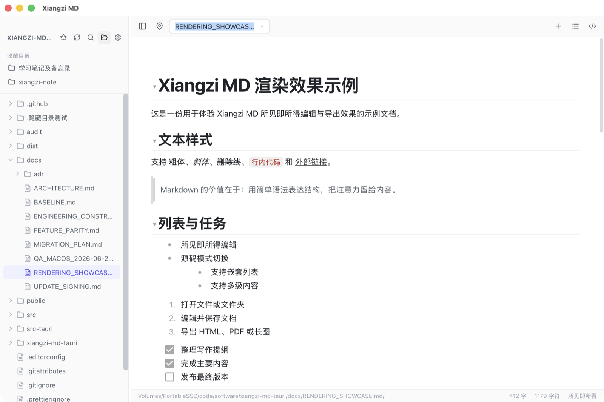
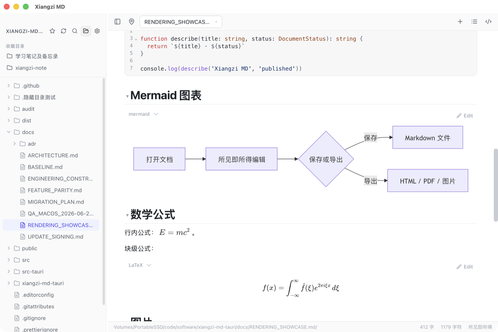

# Xiangzi MD

**English** | [简体中文](README.zh-CN.md)

> Write Markdown well—and deliver it without the extra work.

Xiangzi MD is an open-source, local-first WYSIWYG Markdown editor for macOS and Windows.

It is built around a practical workflow: manage documents in folders, write Markdown and Mermaid diagrams, paste local images, then copy the result directly into Feishu, Word, or email—or export it as a long image. No account, cloud dependency, or proprietary document format is required. Your content always remains in ordinary `.md` files.

[Download the latest release](https://github.com/AttackingXiang/xiangzi-md/releases/latest) · [User guide](docs/USER_GUIDE.md) · [Report an issue or suggest an idea](https://github.com/AttackingXiang/xiangzi-md/issues)



## Why Xiangzi MD?

Many Markdown editors are good at writing. Once the document is finished, however, you may still need to screenshot diagrams, fix image paths, convert formats, and move everything into another application.

Xiangzi MD focuses on the entire path from writing to delivery:

- **Take diagrams with you**: preview Mermaid diagrams in place, then copy them directly as PNG images—or switch to copying the Mermaid source.
- **Copy text and images together**: when copied content contains local images, the images themselves are placed on the clipboard. Paste the result into Word, Feishu, or email instead of getting broken local paths.
- **Export long images in one step**: export Markdown as a PNG or JPEG long image for chats, social platforms, reviews, and presentations. HTML, PDF, and Word export are also available.
- **Make it your default Markdown app**: double-click a `.md` file to open it directly in Xiangzi MD.
- **Your files remain yours**: Xiangzi MD reads and writes local Markdown without accounts, cloud lock-in, or proprietary formats. Continue using Typora, Obsidian, VS Code, or Git whenever you want.
- **Edit one file or manage a project**: folder workspaces, tabs, full-text search, an outline, a command palette, and session restoration are included in one lightweight desktop app.



## How is it different?

Xiangzi MD is not trying to become another all-encompassing knowledge base, nor is it only a minimal text box. It focuses on efficient local Markdown editing—and on making the content useful after it leaves the editor.

| What matters to you | Xiangzi MD | Typical single-file editors | Typical knowledge-base apps |
| --- | --- | --- | --- |
| WYSIWYG editing of ordinary `.md` files | Supported | Usually supported | Supported, or split edit/preview views |
| Folders, tabs, and full-text search | Built in | Often limited | Usually strong |
| Copy Mermaid as an image | Built in; image or source | Often requires screenshots or plugins | Depends on plugins and themes |
| Copy rich content into office apps | Handles local images | May copy only local paths | Depends on the app and plugins |
| PNG/JPEG long-image export | Built in | Not always available | Often requires a plugin or external tool |
| Word import and export | Supported via Pandoc | Not always available | Usually not a core feature |
| Data and accounts | Local files; no account | Mostly local files | Some features revolve around vaults or cloud services |
| Primary focus | **Local writing + effortless delivery** | Focused single-document writing | Knowledge management and relationships |

> The table describes common product categories, not every application or plugin. Xiangzi MD stands out by keeping Markdown writing lightweight and direct while making diagrams, images, rich copying, and multi-format delivery first-class features.

## Who is it for?

- People writing technical proposals, API documentation, and READMEs with Mermaid, KaTeX, code blocks, and tables.
- People who draft in Markdown but deliver their work through Feishu, Word, email, or chat applications.
- People who want fully local files together with folders, tabs, and full-text search.
- People who enjoy Typora-style in-place editing but need a more capable workspace and export workflow.
- People who want Git-friendly documents without being locked into a knowledge base or proprietary format.

## Features

### Writing and formatting

- WYSIWYG and source modes edit the same Markdown document.
- GFM tables, task lists, footnotes, syntax highlighting, Mermaid, and KaTeX.
- Drag-to-reorder table rows and columns, intelligent column widths, and a reorderable outline.
- Reading, focus, and typewriter modes; an optional formatting toolbar; custom CSS; and Chinese/English UI.

### Files and workspaces

- Open an individual file or an entire folder.
- Pinnable and reorderable tabs, recent files, and session restoration.
- Workspace-wide full-text search, a command palette, undoable file operations, and customizable keyboard shortcuts.
- Paste or drag images with five attachment organization strategies. Remote images are disabled by default to reduce privacy exposure.

### Copying and delivery

- Copy Mermaid diagrams as PNG images or source text.
- Copy content containing images as rich text for pasting into common office applications.
- Export complete HTML, paginated PDF, PNG/JPEG long images, and Word documents.
- Import Word documents as Markdown. DOCX conversion in both directions requires Pandoc.

## Get started in three minutes

1. Download the macOS Universal DMG or Windows x64 installer from [GitHub Releases](https://github.com/AttackingXiang/xiangzi-md/releases/latest).
2. Open a `.md` file, or open a folder as a workspace.
3. Start editing. Switch to source mode whenever you need the raw Markdown.
4. Select a Mermaid diagram or rich content and copy it into another application, or use **File > Export** to create HTML, PDF, image, or Word output.

To make Xiangzi MD the default application for Markdown files:

- **macOS**: select any `.md` file in Finder, press `Command + I`, choose Xiangzi MD under **Open with**, then click **Change All**.
- **Windows**: right-click any `.md` file, choose **Open with > Choose another app**, select Xiangzi MD, and enable the option to always use this app.

See the [user guide](docs/USER_GUIDE.md) for complete instructions and settings. If GitHub is difficult to access, releases are also available on [Gitee](https://gitee.com/tlqgyx/xiangzi-md/releases). Signed automatic updates check GitHub first and fall back to Gitee.

## Current limitations

The project is actively evolving and currently has the following known limitations:

- PDF output uses paginated bitmap rendering for consistent cross-platform layout, so its text cannot be selected or searched.
- Source mode supports Find, but not Replace yet.
- Word conversion requires Pandoc, and complex Word layouts may not survive a round trip perfectly.
- Linux packages are not available yet.

If one of these limitations affects your workflow, please open an [issue](https://github.com/AttackingXiang/xiangzi-md/issues).

## For open-source contributors

### Technology

- Desktop: [Tauri 2](https://tauri.app/) + Rust
- Frontend: [React 18](https://react.dev/) + TypeScript + Vite
- WYSIWYG editor: [Milkdown](https://milkdown.dev/)
- Source editor: CodeMirror 6
- Diagrams and math: Mermaid + KaTeX
- Testing: Vitest + Rust tests

### Repository map

```text
src/
├── components/       # Editor, sidebar, settings, search, tabs, and other UI
├── features/         # Independent features such as export, tags, and properties
├── hooks/            # File, command, export, update, and native integration flows
├── lib/              # Editor behavior, clipboard, images, tables, and pure logic
├── platform/         # Frontend platform contracts and the Tauri adapter
└── styles/           # Styles split by interface area
src-tauri/
├── src/              # Rust commands, filesystem operations, and OS integration
└── tauri.conf.json   # Desktop application and packaging configuration
docs/                 # Architecture, user guide, release, and acceptance documents
```

The frontend isolates desktop capabilities behind the contracts in `src/platform`. Tauri and Rust handle local files, operating-system integration, and packaging. Testable editing, clipboard, and export logic primarily lives in `src/lib` and `src/features`. See the [architecture guide](docs/ARCHITECTURE.md) and [engineering constraints](docs/ENGINEERING_CONSTRAINTS.md) for more detail.

### Local development

Install Node.js 22, npm 10, and the stable Rust toolchain. macOS development also requires Xcode Command Line Tools.

```bash
npm ci
npm run check
npm run tauri:dev
```

Check the Rust code or build an installer:

```bash
npm run rust:check
npm run tauri:build
```

You can also use the included `mise.toml`:

```bash
mise install
mise run check
```

Additional project documentation:

- [Rendering showcase](docs/RENDERING_SHOWCASE.md)
- [Feature and platform acceptance status](docs/FEATURE_PARITY.md)
- [Architecture](docs/ARCHITECTURE.md)
- [Update signing and releases](docs/UPDATE_SIGNING.md)
- [Privacy](PRIVACY.md)

## Contributing

Bug reports, real-world feedback, ideas, and code contributions are welcome. Before submitting a pull request, run `npm run check` and `npm run rust:check`, then describe the use case and how the change was verified.

Xiangzi MD is available under the [MIT License](LICENSE). If it removes a little friction from your documentation workflow, consider giving the project a Star so more people can discover it.
