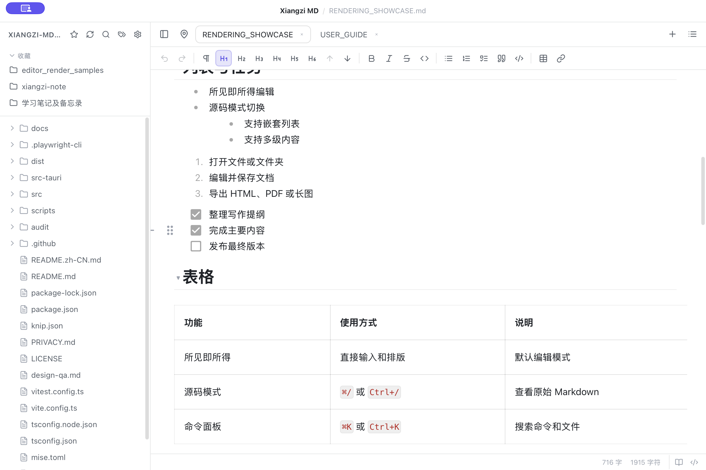
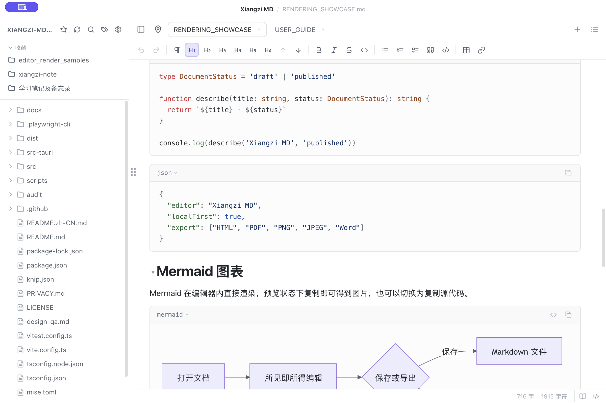

# Xiangzi MD

[English](README.md) | **简体中文**

> 不只把 Markdown 写好，也把它顺手地交付出去。

Xiangzi MD 是一款开源、本地优先的所见即所得 Markdown 编辑器，支持 macOS 和 Windows。

它面向这样一种真实工作流：在文件夹里管理文档，用 Markdown 写作和画流程图，粘贴本地图片，然后把结果直接复制到飞书、Word 或邮件，或导出成长图发给别人。整个过程不需要账号、云端同步或私有文件格式，你的内容始终是普通的 `.md` 文件。

[下载最新版](https://github.com/AttackingXiang/xiangzi-md/releases/latest) · [使用说明](docs/USER_GUIDE.md) · [提交问题或建议](https://github.com/AttackingXiang/xiangzi-md/issues)


## 为什么用 Xiangzi MD

很多 Markdown 编辑器擅长“写”，但文档写完之后，你往往还要截图流程图、处理图片路径、转换格式，再把内容搬到另一个软件里。

Xiangzi MD 想解决的是从写作到交付的整段流程：

- **流程图可以直接拿走**：原地预览 Mermaid，复制时可直接得到 PNG 图片，也可切换为复制 Mermaid 源码。
- **图文可以一起复制**：复制包含本地图片的内容时，图片本身会进入剪贴板，可直接粘贴到 Word、飞书或邮件，而不只是复制一个失效的本地路径。
- **一键导出长图**：Markdown 可导出为 PNG 或 JPEG 长图，适合聊天工具、社交平台、评审和演示；也支持 HTML、PDF 和 Word。
- **它可以就是你的 Markdown 默认应用**：双击 `.md` 文件即可打开，不必先进入软件再找文件。
- **文件仍然属于你**：直接读写本地 Markdown，没有账号体系、云端绑定和私有格式，随时可以换回 Typora、Obsidian、VS Code 或 Git。
- **既能写单篇，也能管项目**：文件夹工作区、多标签页、全文搜索、大纲、命令面板和会话恢复都在一个轻量桌面应用中。






## 和同类软件有什么不同

Xiangzi MD 不是要复制另一个“全能知识库”，也不只是提供一个干净的输入框。它更关注本地 Markdown 文档的编辑效率，以及内容离开编辑器时是否依然好用。

| 你关心的事               | Xiangzi MD              | 常见单文件编辑器 | 常见知识库软件            |
| ------------------------ | ----------------------- | ---------------- | ------------------------- |
| 所见即所得编辑普通 `.md` | 支持                    | 通常支持         | 支持或以阅读/编辑双栏为主 |
| 文件夹、标签页与全文搜索 | 内置                    | 往往较弱         | 通常较强                  |
| Mermaid 复制为图片       | 内置，可选图片或源码    | 常需截图或插件   | 视插件和主题而定          |
| 图文复制到办公软件       | 内置处理本地图片        | 容易只得到路径   | 视软件与插件而定          |
| PNG/JPEG 长图导出        | 内置                    | 不一定支持       | 常需插件或外部工具        |
| Word 导入与导出          | 支持，依赖 Pandoc       | 不一定支持       | 通常不是核心能力          |
| 数据与账号               | 本地文件，无需账号      | 多为本地文件     | 部分功能围绕仓库或云服务  |
| 产品侧重点               | **本地写作 + 顺手交付** | 专注单篇写作     | 知识管理与关系组织        |

> 表格描述的是产品类型的常见取向，不代表每一款软件或插件的全部能力。Xiangzi MD 的辨识度在于：保留轻量、直接的 Markdown 写作体验，同时把流程图、图片、复制和多格式交付做成默认能力。

## 适合谁

- 写技术方案、接口文档、README，并经常使用 Mermaid、KaTeX、代码块和表格的人。
- 用 Markdown 起稿，但最终需要把内容发到飞书、Word、邮件或聊天工具的人。
- 希望文件完全保存在本地，又需要文件夹、标签页和全文搜索的人。
- 喜欢 Typora 的原地编辑体验，但还想要更完整的工作区和导出能力的人。
- 不想被某个知识库或私有格式绑定，希望文档继续由 Git 管理的人。

## 功能一览

### 写作与排版

- 所见即所得与源码模式编辑同一份 Markdown。
- 支持 GFM 表格、任务列表、脚注、代码高亮、Mermaid 和 KaTeX。
- 表格支持行列拖动和智能列宽，大纲支持拖拽调整章节。
- 提供阅读、专注、打字机模式、格式工具栏、自定义 CSS 和中英文界面。

### 文件与工作区

- 打开单个文件或整个文件夹。
- 支持可固定、可拖动的多标签页，最近文件与会话恢复。
- 支持文件夹全文搜索、命令面板、文件操作撤销和自定义快捷键。
- 图片可粘贴或拖入，并提供五种附件归档规则；远程图片默认关闭以减少隐私泄露。

### 复制与交付

- Mermaid 图表复制为 PNG 图片或源文本。
- 包含图片的内容复制为富文本，可粘贴到常用办公软件。
- 导出完整 HTML、多页 PDF、PNG/JPEG 长图和 Word。
- 从 Word 导入 Markdown；DOCX 双向转换需要本机安装 Pandoc。

## 三分钟开始使用

1. 从 [GitHub Releases](https://github.com/AttackingXiang/xiangzi-md/releases/latest) 下载 macOS Universal DMG 或 Windows x64 安装程序。
2. 打开一个 `.md` 文件，或打开包含文档的文件夹作为工作区。
3. 直接编辑；需要查看原文时切换到源码模式。
4. 选中 Mermaid 流程图或图文内容后复制，粘贴到目标软件；也可从“文件 > 导出”生成 HTML、PDF、图片或 Word。

如果希望双击 Markdown 就用 Xiangzi MD 打开：

- **macOS**：在 Finder 中选中任意 `.md` 文件，按 `Command + I`，在“打开方式”中选择 Xiangzi MD，再点击“全部更改”。
- **Windows**：右键任意 `.md` 文件，选择“打开方式 > 选择其他应用”，选择 Xiangzi MD，并勾选始终使用此应用。

完整操作和设置说明见 [用户指南](docs/USER_GUIDE.md)。GitHub 访问不方便时，也可使用 [Gitee Releases](https://gitee.com/tlqgyx/xiangzi-md/releases)。应用支持签名自动更新，更新检查会优先访问 GitHub，失败后回退到 Gitee。

## 当前限制

项目仍在持续更新，目前有这些明确限制：

- PDF 为保持跨平台排版一致，当前采用分页位图，文字不能选择或搜索。
- 源码模式支持查找，暂不支持替换。
- Word 双向转换依赖 Pandoc，复杂 Word 版式无法保证无损往返。
- 暂未提供 Linux 安装包。

如果这些限制影响了你的使用，欢迎提交 [Issue](https://github.com/AttackingXiang/xiangzi-md/issues)。

## 给开源项目读者

### 技术栈

- 桌面框架：[Tauri 2](https://tauri.app/) + Rust
- 前端：[React 18](https://react.dev/) + TypeScript + Vite
- 所见即所得编辑器：[Milkdown](https://milkdown.dev/)
- 源码编辑器：CodeMirror 6
- 图表与公式：Mermaid + KaTeX
- 测试：Vitest + Rust tests

### 代码地图

```text
src/
├── components/       # 编辑器、侧边栏、设置、搜索、标签页等 UI
├── features/         # 导出、标签与文档属性等独立功能
├── hooks/            # 文件、命令、导出、更新和原生集成流程
├── lib/              # 编辑器能力、剪贴板、图片、表格与纯函数
├── platform/         # 前端平台接口及 Tauri 适配器
└── styles/           # 按界面区域拆分的样式
src-tauri/
├── src/              # Rust 原生命令、文件系统和应用集成
└── tauri.conf.json   # 桌面应用与打包配置
docs/                 # 架构、用户指南、发布和验收资料
```

前端通过 `src/platform` 中的接口隔离桌面能力，Tauri/Rust 负责本地文件、系统集成和打包；编辑、剪贴板、导出等可测试逻辑主要放在 `src/lib` 与 `src/features`。更完整的设计说明见 [架构文档](docs/ARCHITECTURE.md) 和 [工程约束](docs/ENGINEERING_CONSTRAINTS.md)。

### 本地开发

先准备 Node.js 22、npm 10 和 Rust stable；macOS 还需要 Xcode Command Line Tools。

```bash
npm ci
npm run check
npm run tauri:dev
```

检查 Rust 代码或构建安装包：

```bash
npm run rust:check
npm run tauri:build
```

也可以使用仓库里的 `mise.toml`：

```bash
mise install
mise run check
```

进一步了解项目：

- [渲染效果示例](docs/RENDERING_SHOWCASE.md)
- [功能与平台验收状态](docs/FEATURE_PARITY.md)
- [架构说明](docs/ARCHITECTURE.md)
- [更新签名与发布](docs/UPDATE_SIGNING.md)
- [隐私说明](PRIVACY.md)

## 参与项目

欢迎提交 bug、真实使用反馈和功能建议。准备贡献代码时，建议先运行 `npm run check` 和 `npm run rust:check`，并在 PR 中说明改动场景与验证方式。

项目使用 [MIT License](LICENSE)。如果 Xiangzi MD 帮你减少了一点文档处理的摩擦，欢迎点一个 Star，让更多人看见它。
