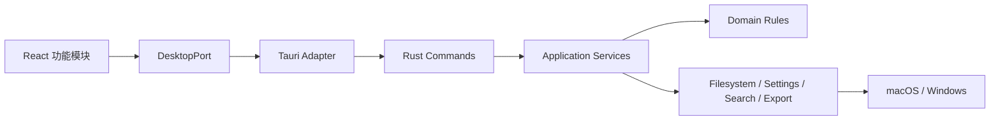

# 架构说明

## 决策摘要

采用“保留渲染层、替换平台层”的渐进迁移。Milkdown、CodeMirror、React 组件和样式先原样迁移，Electron `preload` API 被 `DesktopPort` 替换；文件系统、搜索、设置、菜单、生命周期和导出逐步落到 Rust。

不在同一阶段升级 React、编辑器或视觉设计。壳层迁移完成并通过功能对照验收后，再单独评估依赖升级。



依赖只能从左向右。React 功能模块不得直接导入 `@tauri-apps/*`；Rust command 只做反序列化、授权、调用服务和错误映射，不承载业务算法。

## 目录边界

```text
src/
  app/                    # 应用装配与全局生命周期
  features/               # editor、workspace、search、settings、export 等垂直功能
  shared/                 # 无平台依赖的类型与纯函数
  platform/
    contracts.ts          # UI 依赖的唯一桌面能力接口
    tauriAdapter.ts       # 唯一允许导入 @tauri-apps/* 的位置

src-tauri/src/
  commands/               # Tauri command / event 薄适配层
  application/            # 用例编排、授权与取消
  domain/                 # 纯 Rust 规则和值对象
  infrastructure/         # 文件、设置、搜索、导出、系统集成
```

当前 React 侧暂时保留旧版 `components/`、`hooks/` 与 `lib/` 目录，以降低行为回归；所有桌面能力已经收口到 `platform/`。Rust 侧已按 `commands/domain/infrastructure` 拆分文件、设置、附件、搜索、资源协议、菜单与生命周期。待功能对照稳定后，再将 React 代码机械拆入 `features/`，避免壳层迁移和目录重构同时发生。

## 平台契约

`DesktopPort` 保留旧 `window.api` 的能力形状，减少 UI 迁移改动。命令名和 DTO 一旦进入主分支即视为兼容接口：

- 所有 DTO 使用 camelCase JSON，Rust 内部保持 snake_case。
- 失败统一返回 `{ code, message, details?, retryable }`，UI 不解析 Rust 字符串。
- 事件只使用 `menu-action`、`open-path` 等稳定名称，并返回可释放的监听函数。
- 二进制附件在第一阶段用字节数组保证正确性；性能验证后再决定是否改为临时文件或流式协议。

## 文件访问模型

不能把“任意绝对路径”能力直接暴露给 WebView。Rust 维护运行期授权集合：

1. 用户通过系统对话框选择的 workspace 根目录；
2. 用户明确打开的单文件；
3. 设置中经用户选择的 CSS 与额外图片目录；
4. 应用自己的配置目录和临时目录。

每次读写都通过 `tauri-plugin-fs` 的运行期 scope 校验；新目标检查已授权父目录，名称拒绝绝对路径、`..` 与路径分隔符。目录遍历不跟随符号链接，并设置文件数/大小上限。Windows 的 UNC/盘符变体仍必须在跨平台验收中补测试。

## 状态与数据兼容

新设置文件增加 `schemaVersion`，读取时执行单向、幂等 migration。首次启动只复制 Electron 设置，不修改旧文件；最近文件、收藏、会话和所有现有字段都要保留。迁移失败时回退默认值并记录诊断日志，不允许崩溃或覆盖原数据。

## 性能策略

- 文件树继续按层懒加载。
- 全文搜索在 Rust 后台线程执行，已有文件数、文件大小、匹配数上限和忽略目录；request id 与取消在性能阶段补齐。
- 大附件避免重复复制；迁移早期先正确，性能阶段再改通道。
- Mermaid 和编辑器继续懒加载，避免首屏把完整编辑器包拉入。
- 所有性能结论都在同一机器、同一测试库、冷/热启动分开测量。
