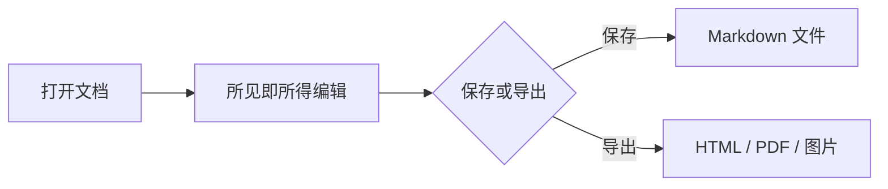

# Xiangzi MD 渲染效果示例

这是一份用于体验 Xiangzi MD 所见即所得编辑与导出效果的示例文档。文档顶部同时展示了与 Obsidian 兼容的 YAML 属性和标签，它们仍会原样保存在 Markdown 文件中。

正文标签也可以直接参与文档组织：#Markdown #技术写作 #本地优先

## 个性化工作区

- 可设置自定义**背景图片**，让写作空间更有个人辨识度。
- 可调整界面**主题色**与明暗外观，也可以使用简洁的无背景主题。
- 可按需显示顶部**格式工具栏**，快速插入标题、列表、引用、代码、表格和链接。
- 支持自定义 CSS、专注模式、阅读模式和打字机模式。

## 文本样式

支持 **粗体**、_斜体_、~~删除线~~、`行内代码` 和 [外部链接](https://github.com/AttackingXiang/xiangzi-md)。

> Markdown 的价值在于：用简单语法表达结构，把注意力留给内容。

## 列表与任务

- 所见即所得编辑
- 源码模式切换
  - 支持嵌套列表
  - 支持多级内容

1. 打开文件或文件夹
2. 编辑并保存文档
3. 导出 HTML、PDF 或长图

- [x] 整理写作提纲
- [x] 完成主要内容
- [ ] 发布最终版本

## 表格

| 功能       | 使用方式         | 说明              |
| ---------- | ---------------- | ----------------- |
| 所见即所得 | 直接输入和排版   | 默认编辑模式      |
| 源码模式   | `⌘/` 或 `Ctrl+/` | 查看原始 Markdown |
| 命令面板   | `⌘K` 或 `Ctrl+K` | 搜索命令和文件    |

## 代码高亮

代码块支持语言识别、语法高亮、自动换行和一键复制，适合 README、技术方案与接口文档。

```typescript
type DocumentStatus = 'draft' | 'published'

function describe(title: string, status: DocumentStatus): string {
  return `${title} · ${status}`
}

console.log(describe('Xiangzi MD', 'published'))
```

```json
{
  "editor": "Xiangzi MD",
  "localFirst": true,
  "export": ["HTML", "PDF", "PNG", "JPEG", "Word"]
}
```

## Mermaid 图表

Mermaid 在编辑器内直接渲染，预览状态下复制即可得到图片，也可以切换为复制源代码。



## 数学公式

行内公式：$E = mc^2$。

块级公式：

$$
f(x)=\int_{-\infty}^{\infty}\hat f(\xi)e^{2\pi i\xi x}\,d\xi
$$

## 图片

单击图片可选中，双击可打开大图预览。


## 脚注

Xiangzi MD 是一个本地优先的跨平台 Markdown 编辑器。[^local-first]

[^local-first]: 文档保存在本地文件系统中，可继续使用其他 Markdown 工具打开。

---

你可以修改本文件，检查编辑、搜索、保存、导出和会话恢复等功能。
