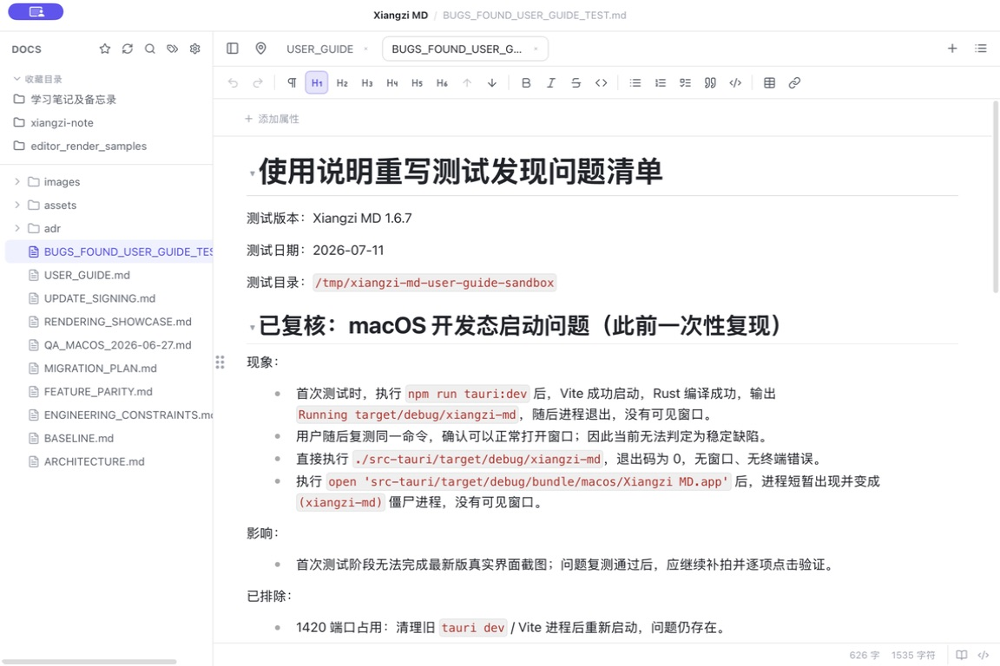
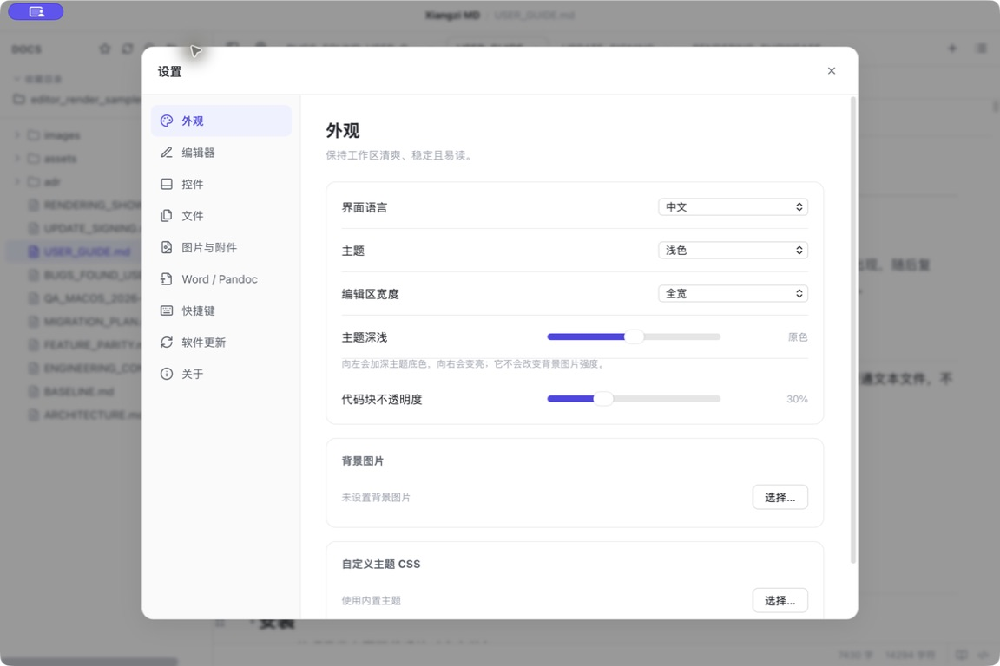
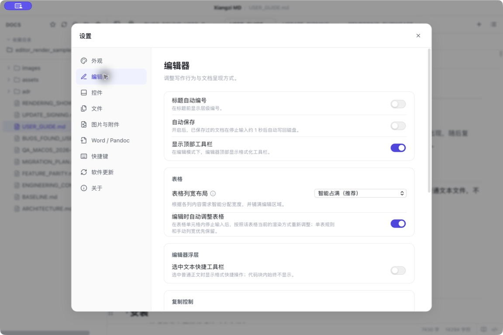
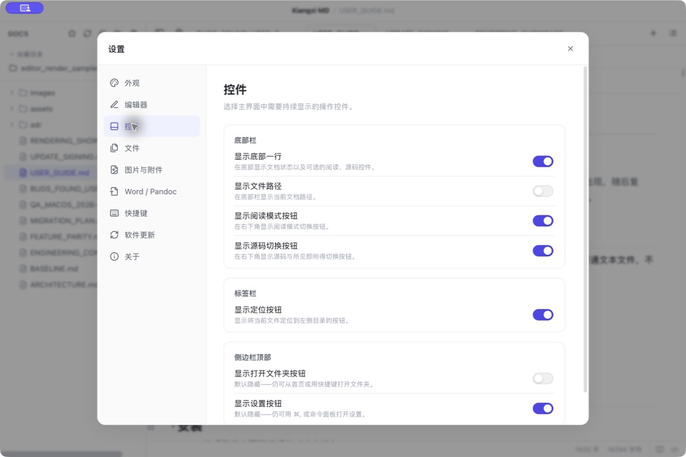
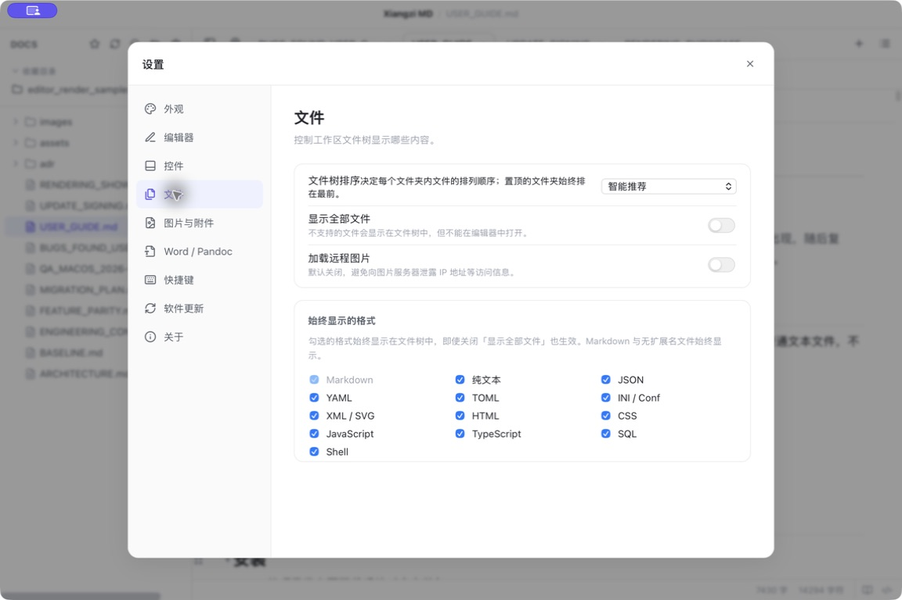

# Xiangzi MD 软件使用说明 / 功能演示文档

适用版本：Xiangzi MD 1.6.22

> 本文档按 1.6.22 当前源码、菜单实现、设置模型与组件实现重新整理。普通浏览器开发页会进入不访问本机文件的预览模式；涉及原生菜单、文件系统和更新器的截图仍应以 Tauri 窗口为准。

## 1. 软件简介

Xiangzi MD 是一款本地优先、所见即所得的 Markdown 编辑器。文档直接保存为 `.md`、`.markdown` 或普通文本文件，不需要账号，也不使用私有文档格式。

适合用于：

- 写作、技术文档、会议记录、知识库笔记。
- 管理一个本地 Markdown 文件夹。
- 查看和编辑多种文本/代码文件。
- 将 Markdown 导出为 HTML、PDF、图片或 Word 文档。

## 2. 安装、启动与首次使用

### 安装

1. 从项目发布页下载系统对应安装包。
2. macOS 通常使用 DMG 安装包；Windows 使用安装程序。
3. 安装完成后，系统可将 `.md`、`.markdown` 文件关联到 Xiangzi MD。

效果：双击 Markdown 文件时，系统可用 Xiangzi MD 打开。

失败排查：

- macOS 提示无法打开：在系统“隐私与安全性”中允许打开，或确认安装包来源。
- 双击文件未关联：在系统文件属性中把默认打开方式改为 Xiangzi MD。

### 启动与首页

启动后进入首页。首页入口包括：

- 新建文件：创建一个未保存 Markdown 标签页。
- 打开文件：选择已有文件。
- 打开文件夹：选择一个目录作为工作区。
- 最近文件 / 最近文件夹：快速回到近期打开内容。

注意：测试和演示建议先建立独立测试文件夹，避免打开私人文件。

## 3. 整体界面



图 3-1：当前版本主界面。截图中可看到左侧文件目录、顶部工具栏、多标签页、编辑工具栏、文档属性入口、Markdown 编辑区和底部状态栏。首次启动可能出现“发现新版本”提示，选择“稍后”即可继续使用。

### 3.1 当前版本主界面截图整理原则

主界面截图按以下七个区域组织：

| 编号 | 区域               | 重点说明                                       |
| ---- | ------------------ | ---------------------------------------------- |
| A    | 文件目录与收藏目录 | 工作区、收藏夹、文件树、目录展开与文件选择     |
| B    | 顶部工具栏         | 侧栏、定位、搜索、标签、设置等入口             |
| C    | 标签栏             | 多文档切换、关闭标签、新建标签                 |
| D    | 编辑工具栏         | 撤销、重做、标题、列表、引用、代码、表格、链接 |
| E    | 文档属性区         | Frontmatter、标签和属性入口                    |
| F    | Markdown 编辑区    | 标题、正文、代码、表格、图片和 Mermaid 内容    |
| G    | 底部状态栏         | 字数、字符数、阅读/源码模式与状态信息          |

正式截图应使用浅色主题、无背景图片、测试目录中的演示文档，并在截图前关闭无关窗口；文件名、路径和正文内容只保留演示所需信息。

主界面分为：

- 顶部自定义标题栏：窗口按钮、应用菜单按钮、标题。
- 左侧侧边栏：收藏目录、文件树、文件夹搜索、标签面板。
- 顶部标签栏：打开文件切换、关闭、固定、定位、大纲、首页入口。
- 编辑区：所见即所得 Markdown 编辑器或源码编辑器。
- 编辑器工具栏：格式化按钮，默认关闭，可在设置中开启。
- 右侧大纲：按标题浏览并拖拽重排章节。
- 底部状态栏：文件路径、行列、字数、模式状态、视图控制。
- 弹窗：设置、命令面板、查找替换、草稿恢复、未保存确认、导出完成、大图预览、表格放大。

## 4. 顶部菜单栏功能

macOS 原生菜单按以下结构提供功能。

### Xiangzi MD 菜单

- 关于 Xiangzi MD：查看版本、资源、开源许可、支持项目。
- 设置：打开设置窗口，快捷键 `Command+,`。
- 检查更新：手动检查新版本。
- 隐藏 / 隐藏其他 / 全部显示：系统窗口功能。
- 退出 Xiangzi MD：退出前会检查未保存修改。

### 文件菜单

- 新建文件：`Command+N`，创建未保存标签。
- 打开文件：`Command+O`，选择 Markdown 或文本文件。
- 打开文件夹：`Command+Shift+O`，选择工作区目录。
- 保存：`Command+S`，保存当前标签。
- 另存为：`Command+Shift+S`，把当前文档保存到新位置。
- 导出 HTML / PDF / 图片 / Word 文档：生成交付文件。
- 导入 Word 文档：使用 Pandoc 将 `.docx` 转成 Markdown。
- 关闭标签页：`Command+W`。

失败排查：

- Word 导入导出不可用：需要安装 Pandoc，或在“设置 > Word / Pandoc”指定路径。
- 新文件保存失败：确认目标目录有写入权限。
- 当前文件被外部修改：保存时可能提示版本冲突，请先确认是否覆盖。

### 编辑菜单

- 撤销 / 重做。
- 剪切 / 复制 / 粘贴。
- 全选：`Command+A`，全选当前文章。
- 查找：`Command+F`。
- 在文件夹中搜索：`Command+Shift+F`。

### 视图菜单

- 切换侧边栏：`Command+\`。
- 大纲：`Command+Shift+K`。
- 切换源码模式：`Command+/`。
- 专注模式：`Command+Option+F`。
- 打字机模式：`Command+Shift+T`。
- 命令面板：`Command+K`。
- 快捷键：`Command+Shift+/`。
- 实际大小 / 放大 / 缩小。
- 切换全屏。

## 5. 文件、工作区与标签页

### 新建 Markdown 文档

用途：快速开始一篇新文章。

入口：首页“新建文件”、文件菜单“新建文件”、快捷键 `Command+N`、命令面板。

步骤：

1. 点击“新建文件”。
2. 在编辑器输入标题和内容。
3. 按 `Command+S`。
4. 在保存对话框中选择位置和文件名，例如 `demo-guide.md`。

效果：标签页从“未命名”变为实际文件名，未保存圆点消失。

注意：新文件第一次保存前没有路径，自动保存不会生效。

### 打开文件

支持打开：

- Markdown：`.md`、`.markdown`、`.mdown`、`.mkd`、`.mdx`。
- 文本/配置/代码：`.txt`、`.log`、`.json`、`.json5`、`.jsonc`、`.yaml`、`.yml`、`.toml`、`.ini`、`.conf`、`.properties`、`.xml`、`.svg`、`.html`、`.htm`、`.css`、`.js`、`.mjs`、`.cjs`、`.jsx`、`.ts`、`.mts`、`.cts`、`.tsx`、`.sql`、`.sh`、`.bash`、`.zsh`。

步骤：

1. 选择“文件 > 打开文件…”。
2. 选择一个受支持文件。
3. Markdown 会进入所见即所得编辑器；其他文本/代码文件进入文本编辑器。

失败排查：文件过大、无读取权限或格式不在可编辑列表内时，可能无法在编辑器中打开。

### 打开文件夹

用途：把一个目录作为工作区，使用左侧文件树管理文件。

步骤：

1. 点击首页“打开文件夹”或使用 `Command+Shift+O`。
2. 选择一个目录。
3. 左侧文件树显示目录内容。

效果：可在文件树中展开子目录、打开文件、新建/重命名/移动。

隐私建议：演示时请使用独立示例目录，不要选择含私人资料的目录。

### 文件树右键菜单

文件右键常见操作：

- 打开。
- 用系统默认应用打开。
- 重命名。
- 在系统文件管理器中显示。
- 删除到废纸篓/回收站。

文件夹或空白区域右键常见操作：

- 新建文件。
- 新建文件夹。
- 打开上级文件夹。
- 选择其他文件夹。
- 在系统文件管理器中显示。
- 刷新。
- 置顶 / 取消置顶文件夹。
- 隐藏文件夹。

注意：删除进入系统废纸篓/回收站；文档演示不要对真实工作区做删除测试。

### 文件拖拽移动

用途：整理目录结构。

步骤：

1. 在文件树按住文件或文件夹。
2. 拖到目标文件夹上。
3. 松开鼠标。

效果：项目移动到目标目录，文件树刷新。

限制：不能把文件夹移动到自己的子目录；不能覆盖目标目录中的同名项目。

### 标签页

功能入口：顶部标签栏、标签右键菜单、快捷键。

可用操作：

- 单击标签切换。
- 点击关闭按钮或中键关闭标签。
- `Command+W` 关闭当前标签。
- 拖拽标签调整顺序。
- 右键固定 / 取消固定。
- 右键关闭当前、关闭其他、关闭左侧、关闭右侧、关闭全部。
- 标签过多时使用溢出列表切换。
- `+` 按钮回到首页。

注意：关闭有未保存修改的标签会弹出确认；固定标签会在批量关闭中保留。

## 6. 编辑器基础操作

### 所见即所得与源码模式

入口：底部源码按钮、顶部标签栏右侧源码按钮、视图菜单、`Command+/`。

区别：

- 所见即所得：直接看到标题、表格、图片、列表、代码块渲染效果。
- 源码模式：直接编辑 Markdown 原文，适合精确处理语法。

效果：两种模式编辑同一份内容，切换不会改变文件格式。

### Markdown 格式

支持内容：

- 1 到 6 级标题。
- 加粗、斜体、删除线、行内代码、链接。
- 无序列表、有序列表、任务列表。
- 引用、分割线、代码块。
- 表格、图片、脚注。
- Mermaid 图表。
- 行内公式和块级公式。
- YAML frontmatter 属性。
- 文档内 `#标签`。

### 编辑器工具栏

默认值：关闭。

开启位置：设置 > 编辑器 > 显示顶部工具栏。

按钮包括：

- 撤销、重做。
- 正文、H1、H2、H3、升级标题、降级标题。
- 加粗、斜体、删除线、行内代码。
- 无序列表、有序列表、任务列表。
- 引用、代码块。
- 插入表格。
- 插入链接。

使用案例：选中一段文字，点击“加粗”按钮，文字会变成 `**文字**` 对应的粗体效果。

### 选中文本快捷工具栏

默认值：关闭。

开启位置：设置 > 编辑器 > 选中文本快捷工具栏。

用途：选中普通正文后显示常用格式按钮，减少鼠标移动。

注意：代码块内不会显示该浮层。

### 表格

入口：工具栏“插入表格”、右键菜单“插入表格”、Markdown 源码表格。

操作：

1. 点击“插入表格”。
2. 在 1×1 到 8×8 网格中选择行列数。
3. 在单元格内输入内容。
4. 拖动列边界调整宽度。

表格右键功能：

- 在上方/下方插入行。
- 在左侧/右侧插入列。
- 自动分配列宽。
- 按内容调整列宽。
- 清除列宽。
- 放大只读查看。
- 删除行、删除列、删除表格。

### 大纲

入口：标签栏右侧“大纲”按钮、视图菜单、`Command+Shift+K`。

用途：根据标题快速定位文档结构。

操作：

1. 打开包含多个标题的 Markdown。
2. 打开大纲。
3. 点击标题跳转。
4. 拖拽大纲标题调整章节顺序。

效果：拖拽标题时，会连同该标题下的整个章节一起移动。

### 阅读模式、专注模式、打字机模式

- 阅读模式：隐藏编辑操作，更适合浏览。
- 专注模式：弱化当前段落之外的内容。
- 打字机模式：输入时让光标区域尽量保持在视野中部。

入口：视图菜单、底部状态栏按钮、命令面板。

## 7. 搜索、替换与命令面板

### 当前文档查找和替换

入口：`Command+F`。

步骤：

1. 按 `Command+F`。
2. 在“查找…”输入关键词。
3. 用“上一个 / 下一个”跳转。
4. 展开替换区，输入“替换为…”。
5. 点击“替换”或“全部替换”。

注意：源码模式当前只支持查找，不支持替换。

### 文件夹搜索

入口：`Command+Shift+F`、编辑菜单、侧边栏搜索。

步骤：

1. 打开一个工作区文件夹。
2. 输入搜索词。
3. 查看匹配文件和行号。
4. 点击结果打开对应文件。

效果：左侧显示文件列表和匹配上下文。

### 命令面板

入口：`Command+K`。

用途：用键盘快速执行命令或打开文件。

操作：

1. 按 `Command+K`。
2. 输入命令名或文件名。
3. 回车执行。

常见命令：新建文件、打开文件、打开文件夹、保存、另存为、查找、文件夹搜索、切换侧边栏、切换大纲、源码模式、专注模式、打字机模式、导出、导入 Word、设置。

## 8. 标签与文档属性

### 文档属性面板

Xiangzi MD 支持读取和编辑 YAML frontmatter，例如：

```markdown
---
tags:
  - guide/demo
status: draft
---
```

可用操作：

- 添加属性。
- 编辑属性名称。
- 编辑属性值。
- 删除属性。
- 标签属性可添加或删除单个标签。
- 复杂值需要在源码模式中编辑。

### 标签导航

支持两类标签来源：

- frontmatter 中的 `tags`。
- 正文里的 `#标签`。

功能：

- 点击标签查看相关文档。
- 打开“全部标签”树。
- 搜索该标签下的文档。
- 置顶/取消置顶标签。
- 折叠/展开标签分组。
- 拖动标签到另一个标签下快速改分组。
- 右键标签可改名或改分组。

相关设置位于“设置 > 编辑器 > 标签”。

## 9. 导入、导出与生成文件

### 导出 HTML

入口：文件 > 导出 > HTML。

步骤：

1. 打开 Markdown 文档。
2. 选择“文件 > 导出 > HTML…”。
3. 选择保存位置。

效果：生成一个 `.html` 文件，适合网页预览或归档。

### 导出 PDF

入口：文件 > 导出 > PDF。

用途：生成便于发送、打印或归档的 PDF。

失败排查：如果图片无法加载，检查图片路径是否有效；远程图片默认不加载。

### 导出图片

入口：文件 > 导出 > 图片。

效果：把当前文档渲染成图片文件。

适用场景：分享长图、发送到聊天工具、生成演示图。

### 导出 Word 文档

入口：文件 > 导出 > Word 文档。

前提：需要 Pandoc。

相关设置：

- Pandoc 程序路径。
- Word 模板。
- 生成目录。
- 标题自动编号。
- 规范中文字体。
- 导出附加参数。

### 导入 Word 文档

入口：文件 > 导入 Word 文档。

步骤：

1. 安装 Pandoc。
2. 设置图片目录，例如 `assets`。
3. 选择 `.docx` 文件。
4. 软件生成 Markdown 文件，并将 Word 图片提取到指定目录。

## 10. 设置项完整说明



图 10-1：设置窗口的“外观”页面。左侧是设置分类，右侧依次展示界面语言、主题、编辑区宽度、主题深浅、代码块不透明度、背景图片和自定义主题 CSS 入口。

设置入口：Xiangzi MD > 设置、`Command+,`、命令面板、可选侧边栏设置按钮。

所有设置通常立即生效；快捷键和语言会触发菜单/界面刷新。恢复默认可使用对应“清除、恢复默认、恢复自动检测、全部恢复默认”按钮，或将设置改回默认值。

### 外观

| 设置项         | 默认值   | 可选值                                       | 用途与案例                                                                                                   |
| -------------- | -------- | -------------------------------------------- | ------------------------------------------------------------------------------------------------------------ |
| 界面语言       | 中文     | 中文、English                                | 切换界面文本。案例：给英文用户演示时选 English。立即生效，不需重启。                                         |
| 主题           | 跟随系统 | 跟随系统、浅色、深色、暖色、浅绿、蓝调、夏日 | 控制整体配色。普通演示建议选“浅色”。立即生效。                                                               |
| 编辑区宽度     | 全宽     | 适中、较宽、全宽                             | 控制正文最大宽度。长文写作可选“适中”，宽屏表格可选“全宽”。                                                   |
| 主题深浅       | 0        | -50 到 50                                    | 调整主题底色深浅。案例：浅色主题下设为 10，让背景更亮。                                                      |
| 代码块不透明度 | 30       | 0 到 100                                     | 调整代码块表面不透明度。背景图下可调高到 80 提升可读性。                                                     |
| 背景图片       | 未设置   | 本地图片路径                                 | 选择本地图片作为背景。演示指定图片：`/Users/guoxiangzi/Downloads/2d039dd3-358c-4c45-a412-8f542479961f.png`。 |
| 背景强度       | 30       | 0 到 100                                     | 控制背景图片可见强度。案例：设为 20 保持文字清晰。                                                           |
| 自定义主题 CSS | 未设置   | 本地 CSS 文件                                | 加载自定义样式。案例：选择团队统一排版 CSS；清除后恢复内置主题。                                             |

背景图片演示步骤：

1. 打开“设置 > 外观”。
2. 主题选择“浅色”。
3. 在“背景图片”点击“选择…”。
4. 选择 `/Users/guoxiangzi/Downloads/2d039dd3-358c-4c45-a412-8f542479961f.png`。
5. 调整“背景强度”，观察编辑区背景变化。
6. 点击“更换…”可选择其他图片。
7. 点击“清除”取消背景。
8. 主题恢复“浅色”，背景保持未设置。

注意：源码中仅看到背景路径与强度设置，未发现缩放、平铺、居中、填充、模糊、亮度或遮罩的独立设置项。

### 编辑器



图 10-2：编辑器设置页面。当前版本可直接看到标题自动编号、自动保存、代码块自动换行、顶部工具栏、表格列宽布局、编辑时自动调整表格和选中文本快捷工具栏等开关或选项。

| 设置项                     | 默认值   | 可选值                               | 用途与案例                                                                        |
| -------------------------- | -------- | ------------------------------------ | --------------------------------------------------------------------------------- |
| 标题自动编号               | 关闭     | 开/关                                | 在标题前显示层级编号。案例：技术方案需要 1、1.1、1.1.1 时开启。                   |
| 自动保存                   | 关闭     | 开/关                                | 已保存文档停止输入约 1 秒后写回磁盘。案例：会议记录时开启。新建未保存文件不生效。 |
| 代码块自动换行             | 关闭     | 开/关                                | 控制代码块长行是否换行。关闭时保留原始行并使用横向滚动，适合查看接口或日志代码。  |
| 显示顶部工具栏             | 关闭     | 开/关                                | 显示格式化按钮。案例：给新用户演示时开启。                                        |
| 表格列宽布局               | 智能占满 | 智能占满、按内容适配、等宽分配       | 控制未单独指定布局的表格。案例：表格列差异大选“按内容适配”。                      |
| 编辑时自动调整表格         | 开启     | 开/关                                | 单元格输入后按当前布局重新调整列宽。案例：想保持手动列宽时关闭。                  |
| 选中文本快捷工具栏         | 关闭     | 开/关                                | 选中文本时显示格式浮层。案例：频繁加粗/斜体时开启。                               |
| 图片复制为                 | 图片     | 图片、地址                           | 复制含图片内容时复制图片本身或路径。案例：发到聊天工具选“图片”。                  |
| Mermaid 复制为             | 图片     | 图片、源文本                         | 复制 Mermaid 图表时复制渲染图或源码。案例：交给开发同事可选“源文本”。             |
| 标签默认展开层级           | 全部展开 | 全部展开、仅顶层、展开两层、展开三层 | 控制全部标签树初始展开。标签多时选“仅顶层”。                                      |
| 结果列排序                 | 最近修改 | 最近修改、名称                       | 标签结果按修改时间或名称排序。归档查找可选“名称”。                                |
| 分组优先置顶               | 关闭     | 开/关                                | 标签树中含子标签的分组排前。层级标签多时建议开启。                                |
| 点击文档标签时展示全部标签 | 关闭     | 开/关                                | 点击正文标签时是否同时展开全部标签树。做标签整理时开启。                          |

### 控件



图 10-3：控件设置页面。可分别控制底部栏、文件路径、阅读模式按钮、源码模式按钮、定位按钮、打开文件夹按钮和设置按钮是否显示。

| 设置项             | 默认值 | 用途与案例                                           |
| ------------------ | ------ | ---------------------------------------------------- |
| 显示底部一行       | 开启   | 显示状态栏。极简写作可关闭。                         |
| 显示文件路径       | 开启   | 底部显示当前文件路径。截图演示可关闭以减少路径暴露。 |
| 显示阅读模式按钮   | 开启   | 底部显示阅读模式开关。                               |
| 显示源码切换按钮   | 开启   | 底部显示源码/所见即所得切换按钮。                    |
| 显示定位按钮       | 开启   | 标签栏显示“在文件夹中定位”。                         |
| 显示打开文件夹按钮 | 关闭   | 侧边栏顶部显示打开文件夹按钮。经常切换工作区时开启。 |
| 显示设置按钮       | 关闭   | 侧边栏顶部显示设置按钮。给新用户演示时开启。         |

### 文件



图 10-4：文件设置页面。可设置文件树排序、是否显示全部文件、是否加载远程图片，以及始终显示的 Markdown、YAML、XML/SVG、JavaScript、Shell、纯文本、TOML、TypeScript、JSON、INI/Conf、HTML、CSS 和 SQL 格式。

| 设置项           | 默认值                                                                       | 可选值                                                                                     | 用途与案例                                                         |
| ---------------- | ---------------------------------------------------------------------------- | ------------------------------------------------------------------------------------------ | ------------------------------------------------------------------ |
| 文件树排序       | 名称 A→Z                                                                     | 名称 A→Z、名称 Z→A、最近修改、最近打开、智能推荐                                           | 控制每个目录内排序。写作项目建议“最近修改”。                       |
| 显示全部文件     | 关闭                                                                         | 开/关                                                                                      | 不支持文件也显示，但不可编辑文件会交给系统默认应用。               |
| 加载远程图片     | 关闭                                                                         | 开/关                                                                                      | 控制 Markdown 远程图片请求。默认关闭可避免暴露 IP 等访问信息。     |
| 始终显示的格式   | 默认全选支持格式                                                             | 纯文本、JSON、YAML、TOML、INI/Conf、XML/SVG、HTML、CSS、JavaScript、TypeScript、SQL、Shell | 即使关闭“显示全部文件”，这些格式仍在文件树出现。                   |
| 按名称隐藏       | `.git`、`node_modules`、`.obsidian`、`.vscode`、`dist`、`build`、`.DS_Store` | 精确名称                                                                                   | 案例：添加 `.next` 隐藏构建目录。                                  |
| 手动隐藏的文件夹 | 无                                                                           | 文件夹路径                                                                                 | 选择不想在文件树显示的目录。恢复方式：点击对应路径的取消隐藏按钮。 |

### 图片与附件

| 设置项                 | 默认值           | 可选值                                                                                   | 用途与案例                                               |
| ---------------------- | ---------------- | ---------------------------------------------------------------------------------------- | -------------------------------------------------------- |
| 附件存放方式           | 文档同级子文件夹 | 文档同级子文件夹、文档同级按文档名分文件夹、与文档相同目录、仓库根目录、仓库根的子文件夹 | 粘贴图片时决定保存位置。团队文档推荐“文档同级子文件夹”。 |
| 子文件夹名称           | `assets`         | 文本                                                                                     | 案例：改为 `images` 后，新图片写入 `images/`。           |
| 图片最大显示宽度       | 800px            | 数字，0 表示不限制                                                                       | 控制图片在编辑区的最大显示宽度。                         |
| 文件树中隐藏附件文件夹 | 关闭             | 开/关                                                                                    | 隐藏与子文件夹名称同名的附件目录。                       |
| 额外图片搜索目录       | 无               | 每行一个绝对路径                                                                         | 当图片不在文档目录时，按这些目录查找。                   |

### Word / Pandoc

| 设置项          | 默认值       | 用途与案例                                                       |
| --------------- | ------------ | ---------------------------------------------------------------- |
| Pandoc 程序路径 | 留空自动检测 | 找不到 Pandoc 时手动指定 `/opt/homebrew/bin/pandoc` 等路径。     |
| Word 模板       | 内置默认模板 | 指定 `reference.docx` 控制 Word 样式。可导出默认模板副本再编辑。 |
| 生成目录        | 关闭         | 导出 Word 时插入目录。长文档建议开启。                           |
| 标题自动编号    | 关闭         | 导出 Word 时给章节编号。正式报告建议开启。                       |
| 规范中文字体    | 开启         | 正文宋体、标题黑体、标题黑色。若完全依赖模板样式可关闭。         |
| 图片目录        | `assets`     | Word 导入时提取图片的目录。                                      |
| 导出附加参数    | 空           | 例如 `--highlight-style=tango --metadata lang=zh-CN`。           |
| 导入附加参数    | 空           | 例如 `--track-changes=accept`。                                  |

注意：附加参数不经过 shell；输入输出格式、输出路径、媒体目录和模板参数由软件管理，不应重复指定。

### 快捷键

可在“设置 > 快捷键”逐项修改。点击某个快捷键后按新的组合键即可；冲突会被拦截。按 Backspace 或 Delete 可恢复单项默认，“全部恢复默认”可清空所有自定义。

默认快捷键见第 11 节。

### 软件更新

| 设置项             | 默认值   | 用途                         |
| ------------------ | -------- | ---------------------------- |
| 启动时自动检查更新 | 开启     | 启动后后台检查，不阻塞编辑。 |
| 立即检查           | 手动按钮 | 立即查询最新版本。           |

### 关于

包含：

- 当前版本。
- 检查更新。
- 使用指南、更新日志、问题反馈。
- 支持项目。
- 开源许可。
- 隐私说明。
- GitHub 项目主页。

## 11. 快捷键索引

| 功能                   | macOS 默认快捷键       |
| ---------------------- | ---------------------- |
| 新建文件               | Command+N              |
| 打开文件               | Command+O              |
| 打开文件夹             | Command+Shift+O        |
| 保存                   | Command+S              |
| 另存为                 | Command+Shift+S        |
| 关闭标签页             | Command+W              |
| 查找                   | Command+F              |
| 在文件夹中搜索         | Command+Shift+F        |
| 全选文章               | Command+A              |
| 命令面板               | Command+K              |
| 切换侧边栏             | Command+\              |
| 切换大纲               | Command+Shift+K        |
| 源码 / 所见即所得      | Command+/              |
| 专注模式               | Command+Option+F       |
| 打字机模式             | Command+Shift+T        |
| 切换选中文本快捷工具栏 | Command+Option+T       |
| 设置                   | Command+,              |
| 快捷键设置             | Command+Shift+/        |
| 一级到六级标题         | Command+1 到 Command+6 |
| 设为正文               | Command+0              |
| 升级标题               | Command+Option+↑       |
| 降级标题               | Command+Option+↓       |
| 加粗                   | Command+B              |
| 斜体                   | Command+I              |
| 行内代码               | Command+E              |
| 引用                   | Command+Shift+B        |
| 代码块                 | Command+Option+C       |
| 无序列表               | Command+Option+8       |
| 有序列表               | Command+Option+7       |

Windows / Linux 通常将 Command 替换为 Ctrl。

## 12. 完整使用案例

### 案例 1：新建 Markdown 并保存

目标：建立一篇新文档。

准备：选择一个测试目录。

步骤：

1. 打开软件。
2. 点击“新建文件”。
3. 输入 `# 演示文档`。
4. 按 `Command+S`。
5. 保存为 `demo.md`。

最终效果：文件落盘，标签显示 `demo.md`。

### 案例 2：打开已有 Markdown 并编辑

1. 选择“文件 > 打开文件…”。
2. 打开 `demo-guide.md`。
3. 修改正文内容。
4. 按 `Command+S`。

注意：如果开启自动保存，已保存文件会在停止输入后自动写入。

### 案例 3：同时打开多个文件并切换标签

1. 打开 `demo-guide.md`。
2. 再打开 `second-note.md`。
3. 点击标签切换。
4. 右键其中一个标签选择“固定”。
5. 使用 `Command+W` 关闭普通标签。

效果：固定标签保留。

### 案例 4：使用大纲定位内容

1. 打开包含多级标题的文档。
2. 点击“大纲”。
3. 点击“表格示例”标题。
4. 拖动标题调整章节顺序。

注意：拖动会移动整个章节。

### 案例 5：搜索与替换

1. 按 `Command+F`。
2. 查找 `替换目标`。
3. 输入替换文本 `已替换内容`。
4. 点击“全部替换”。

注意：源码模式只支持查找。

### 案例 6：修改字体相关外观

当前 1.6.22 设置中未发现独立“字体、字号、行高”设置项；可通过“自定义主题 CSS”实现。

步骤：

1. 准备一个 CSS 文件。
2. 打开“设置 > 外观 > 自定义主题 CSS”。
3. 点击“选择…”并选择 CSS。
4. 如需恢复，点击“清除”。

### 案例 7：设置主题和背景图片

1. 打开“设置 > 外观”。
2. 主题选择“浅色”。
3. 背景图片选择 `/Users/guoxiangzi/Downloads/2d039dd3-358c-4c45-a412-8f542479961f.png`。
4. 背景强度设为 20 到 30。
5. 观察编辑区背景。

恢复：

1. 点击背景图片“清除”。
2. 主题选择“浅色”。
3. 主题深浅恢复 0。

### 案例 8：打开不同格式文件

1. 打开工作区文件夹。
2. 在文件树打开 `plain-text.txt`、`config.json`、`example.ts`。
3. 观察文本编辑器和代码高亮。

如文件不显示：到“设置 > 文件”确认对应格式已勾选，或开启“显示全部文件”。

### 案例 9：导出最终文件

1. 打开 Markdown。
2. 选择“文件 > 导出 > PDF…”。
3. 选择输出路径。
4. 导出完成后点击“在文件夹中显示”。

Word 导出需先确认 Pandoc 可用。

### 案例 10：恢复默认设置

1. 外观：把语言设为中文、主题设为跟随系统或浅色、编辑区宽度设为全宽、清除背景和自定义 CSS。
2. 编辑器：关闭标题编号、自动保存、顶部工具栏、选中文本工具栏；表格列宽设为智能占满，开启自动调整。
3. 文件：排序恢复名称 A→Z，关闭显示全部文件和远程图片，恢复默认隐藏名称。
4. 快捷键：点击“全部恢复默认”。
5. Pandoc：清空程序路径和模板路径，图片目录改回 `assets`。

## 13. 常见问题

### 为什么远程图片不显示？

默认关闭远程图片加载，以减少隐私泄露风险。可在“设置 > 文件 > 加载远程图片”开启。

### 为什么 Word 导入导出失败？

通常是 Pandoc 未安装、路径不正确、模板路径无效或附加参数包含保留参数。先在“设置 > Word / Pandoc”检查状态。

### 为什么文件树里看不到某些文件？

可能原因：

- 未开启“显示全部文件”。
- 对应格式未勾选为“始终显示”。
- 名称命中隐藏规则。
- 文件夹被手动隐藏。
- 附件文件夹隐藏开关开启。

### 为什么替换按钮不可用？

源码模式暂不支持替换。切回所见即所得模式再使用替换。

### 如何避免截图暴露私人路径？

在“设置 > 控件”关闭“显示文件路径”，并使用单独测试工作区。

## 14. 截图补拍清单

当前版本启动问题修复后，需要按浅色、无背景、测试工作区重新补拍：

1. 首页。
2. 打开测试工作区后的整体界面。
3. 文件树右键菜单。
4. 标签页右键菜单。
5. 所见即所得编辑器渲染效果。
6. 源码模式。
7. 顶部工具栏。
8. 查找替换条。
9. 文件夹搜索结果。
10. 命令面板。
11. 大纲拖拽。
12. 标签概览和标签结果列。
13. 设置各页面整页截图：外观、编辑器、控件、文件、图片与附件、Word / Pandoc、快捷键、更新、关于。
14. 背景图片设置前后效果，且只在该章节使用指定图片。
15. 导出完成弹窗。
16. 草稿恢复和未保存确认弹窗。

## 15. 功能索引

| 功能          | 主要入口                                  |
| ------------- | ----------------------------------------- |
| 新建文件      | 首页、文件菜单、命令面板、Command+N       |
| 打开文件      | 首页、文件菜单、命令面板、Command+O       |
| 打开文件夹    | 首页、文件菜单、命令面板、Command+Shift+O |
| 保存 / 另存为 | 文件菜单、快捷键、命令面板                |
| 多标签        | 顶部标签栏                                |
| 文件树管理    | 左侧文件树右键                            |
| Markdown 编辑 | 编辑区、工具栏、右键菜单、快捷键          |
| 源码模式      | 视图菜单、底部按钮、Command+/             |
| 大纲          | 标签栏按钮、视图菜单、Command+Shift+K     |
| 查找替换      | Command+F                                 |
| 文件夹搜索    | Command+Shift+F、侧边栏                   |
| 命令面板      | Command+K                                 |
| 标签管理      | 文档属性、正文标签、标签侧栏              |
| 导出          | 文件 > 导出                               |
| 导入 Word     | 文件菜单、命令面板                        |
| 设置          | Xiangzi MD 菜单、Command+,                |
| 快捷键自定义  | 设置 > 快捷键                             |
| 更新          | 设置 > 软件更新、应用菜单                 |

## 16. 当前测试限制

本次重写期间已实际完成：

- 读取并确认 1.6.22 版本号。
- 读取原生菜单实现。
- 读取全部设置模型默认值。
- 读取设置页、工具栏、状态栏、标签、文件树、搜索、命令面板、Pandoc 等组件入口。
- 建立独立测试目录 `/tmp/xiangzi-md-user-guide-sandbox`。
- 尝试启动 `npm run tauri:dev`、debug 二进制和 debug `.app`。

当前限制：

- 首次测试的启动异常未能稳定复现，仍需在正常打开窗口后完成真实 UI 截图和逐项点击验证。
- 单独打开 Vite 页面会缺少 Tauri IPC，只能显示空白，不能作为正式截图来源。

相关问题记录见 `docs/BUGS_FOUND_USER_GUIDE_TEST.md`。
