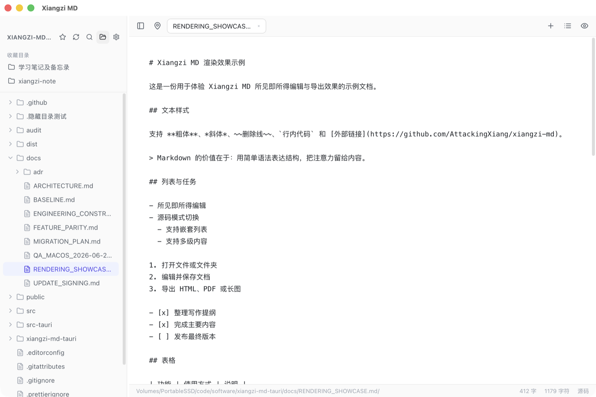
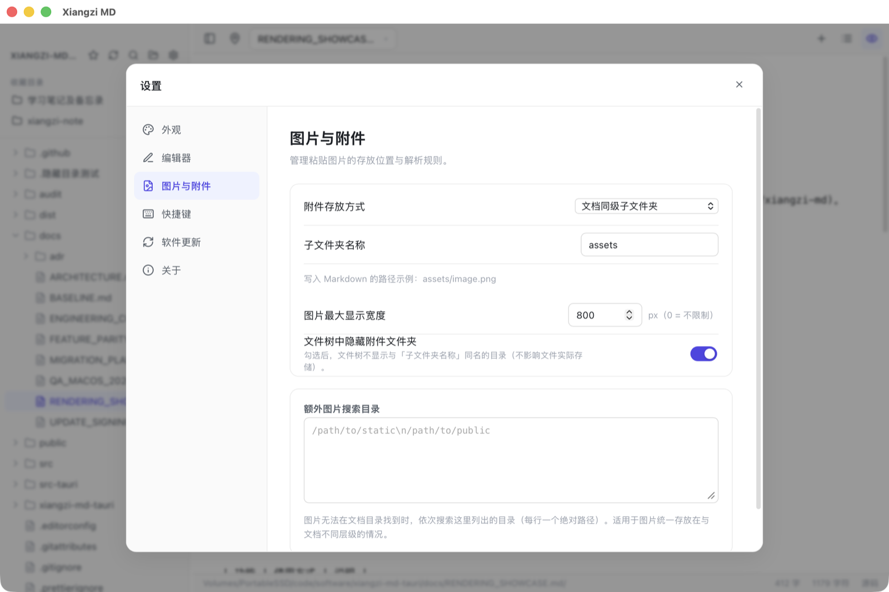
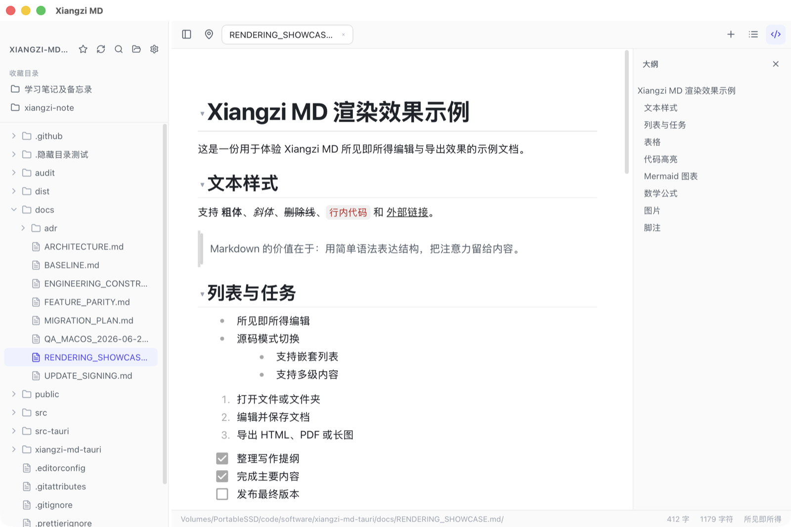
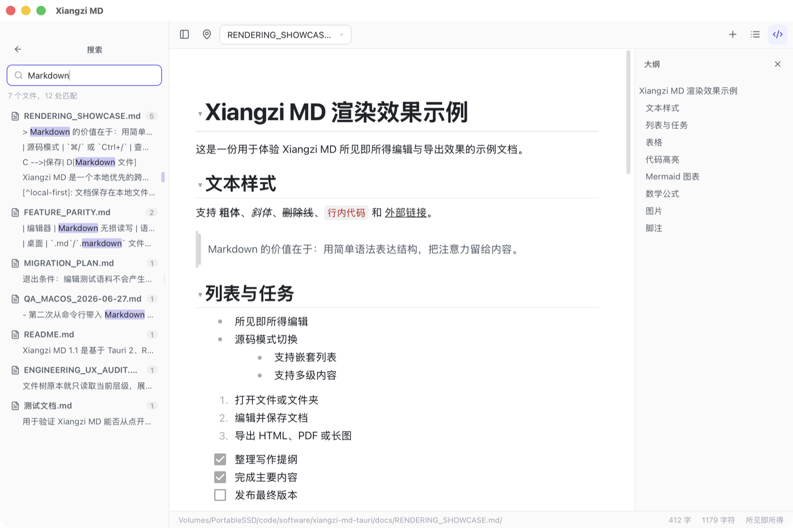
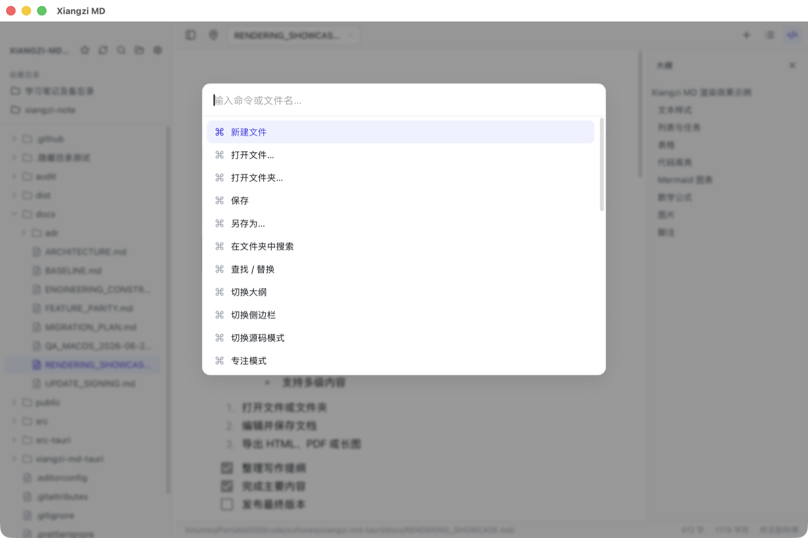
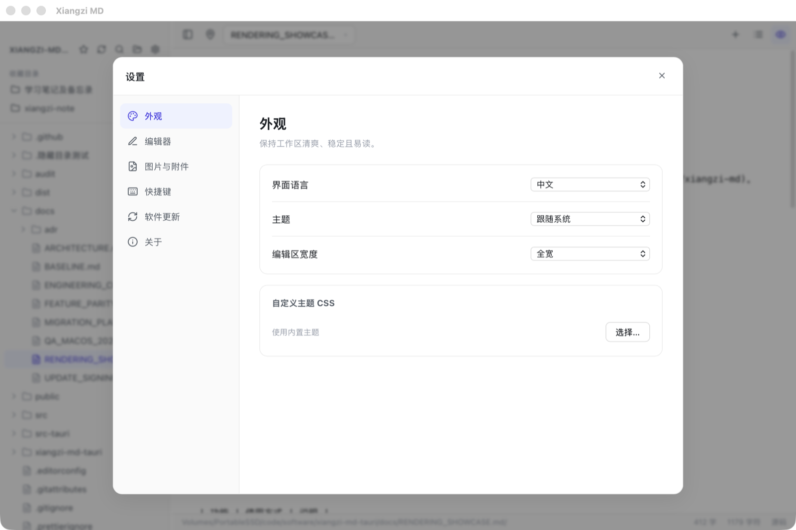
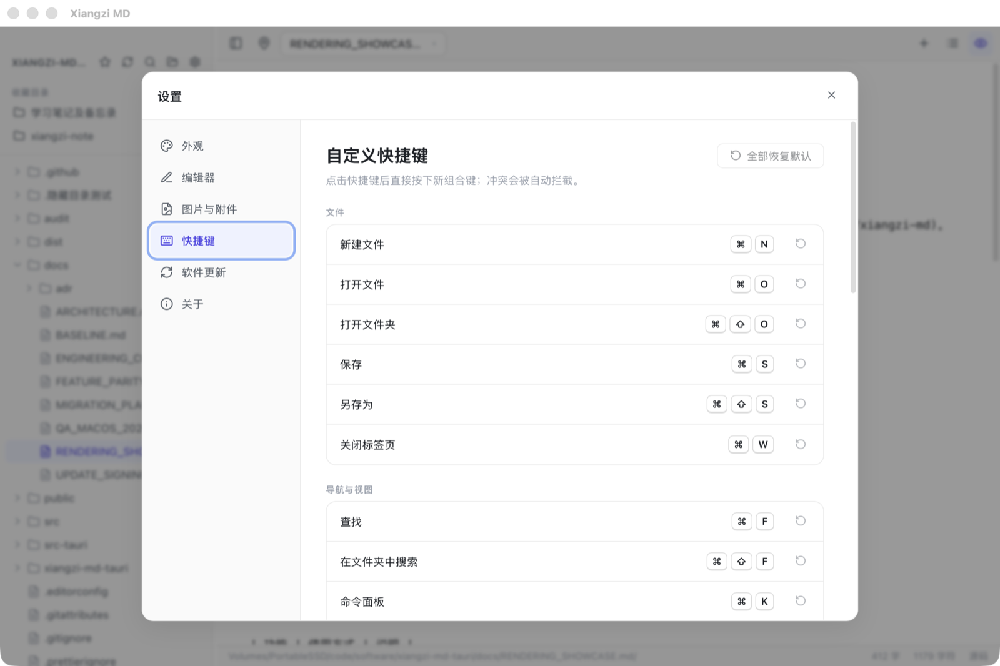

# Xiangzi MD 使用说明

> 适用版本：Xiangzi MD 1.1.x（macOS / Windows）

Xiangzi MD 是一个本地优先、所见即所得的跨平台 Markdown 编辑器。文档直接保存在本地文件系统中，不使用私有文档格式，可以继续用 Typora、Obsidian、VS Code 等工具打开。

## 目录

- [安装与首次启动](#安装与首次启动)

- [快速开始](#快速开始)

- [界面说明](#界面说明)

- [文件与工作区](#文件与工作区)

- [编辑与 Markdown 渲染](#编辑与-markdown-渲染)

- [图片与附件](#图片与附件)

- [大纲、搜索与命令面板](#大纲搜索与命令面板)

- [导出 HTML、PDF 和图片](#导出-htmlpdf-和图片)

- [设置](#设置)

- [快捷键](#快捷键)

- [软件更新](#软件更新)

- [常见问题](#常见问题)

## 安装与首次启动

### 下载安装包

从项目 Release 页面下载与系统匹配的安装包：

- GitHub：[AttackingXiang/xiangzi-md Releases](https://github.com/AttackingXiang/xiangzi-md/releases)

- Gitee：[tlqgyx/xiangzi-md Releases](https://gitee.com/tlqgyx/xiangzi-md/releases)

macOS 使用 DMG 安装包，Windows 使用 x64 安装程序。安装完成后，系统可将 `.md` 和 `.markdown` 文件关联到 Xiangzi MD。

### 首页入口

首页提供三个主要入口：

- **新建文件**：创建一个未保存的 Markdown 标签页，首次保存时选择位置。

- **打开文件**：打开已有 Markdown 或文本文件。

- **打开文件夹**：把一个目录作为工作区，在左侧文件树中管理文档。

首页还会显示最近文件和最近文件夹。顶部标签栏右侧的 **`+`** 用于回到首页，不是直接新建文档。

## 快速开始

推荐以文件夹作为工作区：

1. 在首页选择 **打开文件夹**。
2. 在左侧文件树中展开目录并打开 Markdown 文件。
3. 直接在中间区域编辑，默认是所见即所得模式。
4. 使用 `⌘S`（Windows 为 `Ctrl+S`）保存。
5. 需要交付时，从 **文件 → 导出** 选择 HTML、PDF 或图片。

## 界面说明

工作区从左到右分为以下区域：

| 区域       | 功能                                                       |
| ---------- | ---------------------------------------------------------- |
| 左侧边栏   | 收藏目录、文件树、刷新、文件夹搜索、打开文件夹和设置       |
| 顶部标签栏 | 多文件切换、关闭标签、回到首页、打开大纲、切换源码模式     |
| 中间编辑区 | 所见即所得或 Markdown 源码编辑                             |
| 右侧大纲   | 浏览标题结构、跳转标题、拖拽调整章节顺序                   |
| 底部状态栏 | 当前文件路径、字数、字符数、编辑模式、自动保存和未保存状态 |

左侧边栏和右侧大纲的宽度都可以拖动调整。顶部的定位按钮可在文件树中找到当前文件。

## 文件与工作区

### 支持的文件类型

通过 **打开文件** 可以选择：

- `.md`

- `.markdown`

- `.mdown`

- `.mkd`

- `.mdx`

- `.txt`

文件树会显示上述 Markdown 文件、`.txt` 文件和没有扩展名的文本文件。单个文档的打开和保存上限为 20 MB。

### 文件树按需加载

打开工作区时只读取当前目录。子目录会在用户展开时再加载，因此大型笔记目录不会在启动时一次性递归扫描。

文件树默认忽略 `.git`、`node_modules`、`.obsidian` 和 `.vscode`。其他点号开头的目录（例如 `.github`）可以正常显示和展开。

### 文件与目录操作

在文件树中右键可执行：

- 新建文件或文件夹

- 打开文件

- 重命名

- 在访达或文件资源管理器中显示

- 删除到系统废纸篓或回收站

- 刷新工作区

可以把左侧的文件或文件夹拖到另一个目录上完成移动。应用会阻止把文件夹移动到自身子目录，以及覆盖目标目录中的同名项目。

### 多标签页

- 单击标签切换文件。

- 单击关闭按钮或按 `⌘W` / `Ctrl+W` 关闭。

- 鼠标中键可关闭标签。

- 右键标签可以关闭当前、其他、左侧、右侧或全部标签。

- 标签过多时，可使用触控板横向滑动或鼠标滚轮滚动标签栏。

- 未保存标签会显示圆点，关闭或退出前会二次确认。

### 保存、最近记录和会话恢复

- 新文件第一次保存时会弹出保存位置选择器。

- **另存为** 会把当前标签切换到新路径。

- 开启自动保存后，已落盘文档停止输入约 1.2 秒后自动写回磁盘。

- 应用会保存最近文件、最近文件夹、收藏目录和上次工作区。

- 下次启动最多恢复上次会话中的 12 个标签页。

### 从系统双击打开

安装版应用可以关联 `.md` 和 `.markdown` 文件。应用已运行时，从访达或文件资源管理器再次打开文档，会在现有窗口中追加标签并聚焦，而不是再启动一个窗口。

## 编辑与 Markdown 渲染

### 所见即所得与源码模式

默认模式会直接渲染 Markdown。点击右上角的代码图标，或按 `⌘/` / `Ctrl+/`，可切换到源码模式。

两种模式编辑的是同一份 Markdown 文本：

- **所见即所得**：适合写作、排版、表格、图片、公式和图表编辑。

- **源码模式**：适合精确检查语法、批量粘贴或处理编辑器尚未提供图形入口的语法。

### 插入和格式化内容

在所见即所得模式下，可以通过以下方式编辑结构：

- 使用快捷键设置标题、粗体、斜体、行内代码、引用、代码块和列表。

- 在编辑区右键打开常用格式菜单。

- 使用块左侧的插入或拖动控件选择正文、标题、引用、分割线、列表、任务、图片、代码、表格和公式。

- 使用 `Tab` / `Shift+Tab` 调整列表层级。

### 支持的渲染能力

| 类型     | 支持内容                                 |
| -------- | ---------------------------------------- |
| 文本     | 正文、粗体、斜体、删除线、行内代码、链接 |
| 标题     | 1–6 级标题、标题折叠、可选自动编号       |
| 列表     | 无序列表、有序列表、嵌套列表、任务列表   |
| 块内容   | 引用、分割线、围栏代码块                 |
| 表格     | GFM 表格、单元格编辑、列宽拖动调整       |
| 代码     | 语言选择、语法高亮、复制代码             |
| 图表     | Mermaid 流程图等，渲染视图与源码可切换   |
| 公式     | KaTeX 行内公式和块级公式                 |
| 媒体     | 本地图片、粘贴或拖入图片、图片大图预览   |
| 扩展语法 | 脚注                                     |

标题左侧的小三角可折叠或展开对应章节。代码块右上角可复制代码；Mermaid 和公式块还可以在渲染结果与源码之间切换。

完整的可编辑示例位于 `docs/RENDERING_SHOWCASE.md`，可从左侧文件树直接打开。

### 图片预览

- 单击图片：选中图片，便于继续编辑。

- 双击图片：打开大图预览。

- 在大图预览中按 `Esc` 或单击背景：关闭预览。

### 专注模式与打字机模式

- **专注模式**：弱化当前段落之外的内容，帮助聚焦写作。

- **打字机模式**：输入时尽量让光标保持在编辑区垂直中部；拖动选择文本时不会强制追随光标滚动。

可从 **视图** 菜单或命令面板切换这两种模式。

## 图片与附件

### 插入图片

先保存当前文档，再把图片粘贴或拖入编辑区。Xiangzi MD 会将图片写入本地目录，并在 Markdown 中保存相对路径。

单个附件不能超过 20 MB；未保存的新文档不能写入本地附件。

### 附件存放方式

在 **设置 → 图片与附件** 中可以选择五种规则。假设文档为 `notes/guide.md`，附件目录名为 `assets`：

| 模式                       | 示例位置                       |
| -------------------------- | ------------------------------ |
| 文档同级子文件夹           | `notes/assets/image.png`       |
| 文档同级，按文档名分文件夹 | `notes/assets/guide/image.png` |
| 与文档相同目录             | `notes/image.png`              |
| 仓库根目录                 | `<工作区>/image.png`           |
| 仓库根的子文件夹           | `<工作区>/assets/image.png`    |

如果目标目录已有同名图片，应用会自动添加 `-1`、`-2` 等后缀，不会覆盖旧文件。

其他图片选项：

- 限制图片在编辑器中的最大显示宽度；`0` 表示不限制。

- 在文件树中隐藏指定的附件文件夹，但不会删除磁盘内容。

- 配置额外图片搜索目录；相对路径在文档目录中找不到时，会按顺序到这些目录查找。

## 大纲、搜索与命令面板

### 大纲

点击右上角大纲按钮或按 `⌘⇧K` / `Ctrl+Shift+K` 打开：

- 单击标题可跳转到正文位置。

- 大纲按 1–6 级标题缩进展示。

- 拖动标题可调整对应章节的顺序。

- 拖动大纲左边界可调整宽度。

### 当前文档查找与替换

按 `⌘F` / `Ctrl+F` 打开查找栏：

- `Enter` 跳到下一个匹配，`Shift+Enter` 跳到上一个匹配。

- 所见即所得模式支持替换当前项和全部替换。

- 源码模式目前支持查找，不支持替换。

### 文件夹全文搜索

点击左侧搜索按钮或按 `⌘⇧F` / `Ctrl+Shift+F`：

- 搜索当前工作区内的 Markdown 文档。

- 显示文件、匹配数量和匹配行。

- 单击结果会打开文件，并继续在编辑器内定位关键词。

为控制大型目录的资源占用，全文搜索最多扫描 3000 个 Markdown 文件、返回 400 处匹配，每个文件最多显示 20 处；超过 5 MB 的单个文件会跳过。

### 命令面板与快速打开

按 `⌘K` / `Ctrl+K` 打开命令面板。输入命令名或文件名，可快速执行操作或打开工作区文档；使用上下方向键选择，按 `Enter` 执行，按 `Esc` 关闭。

## 导出 HTML、PDF 和图片

从 **文件 → 导出** 或命令面板选择导出格式。完成后会显示保存路径，可选择 **确认** 或 **打开所在文件夹**。

### HTML

- 生成可单独打开的完整 HTML 文件。

- 内含当前主题与排版样式。

- 本地图片会尽量转为 Base64 内嵌。

- Mermaid 会导出为静态 SVG。

- 代码块按所选语言重新进行稳定的语法高亮。

### PDF

- 生成 A4 纵向多页 PDF。

- 分页时会尽量避免把表格、引用、代码块和 Mermaid 图表从中间切开。

- 当前 PDF 使用分页位图实现，适合保持视觉一致；导出后的文字不能像原生 PDF 文本那样选择或搜索。

### PNG / JPEG 长图

- 保存对话框中选择 `.png`、`.jpg` 或 `.jpeg` 即可确定格式。

- 按完整文档生成长图，不依赖当前屏幕可见区域。

- 渲染宽度为 920 像素，JPEG 质量为 92。

- 最大导出高度为 20000 像素。超长文档建议改用 PDF、HTML，或拆分后导出。

导出会沿用当前主题、自定义 CSS、标题编号、代码高亮、公式和 Mermaid 渲染效果，但不会包含编辑器按钮、选区、折叠按钮等编辑界面元素。

## 设置

点击左侧齿轮，或按 `⌘,` / `Ctrl+,` 打开设置。

### 外观

- 界面语言：中文 / English。

- 主题：跟随系统、浅色、深色。

- 编辑区宽度：适中、较宽、全宽。

- 自定义主题 CSS：选择本地 `.css` 文件覆盖或扩展内置样式。

建议只加载自己编写或确认可信的 CSS。清除路径即可恢复内置主题。

### 编辑器

- 标题自动编号：显示层级标题编号，不修改 Markdown 原文。

- 自动保存：保存过的文档在停止输入约 1.2 秒后写回磁盘。

### 图片与附件

配置附件目录、图片最大宽度、文件树是否隐藏附件目录，以及额外图片搜索路径。详见[图片与附件](#图片与附件)。

### 快捷键

点击某个快捷键后，直接按新的组合键完成录制。快捷键必须包含 `⌘/Ctrl`、`Alt` 或 `Control` 等修饰键；如果与已有快捷键冲突，设置会自动拒绝。可单独恢复或全部恢复默认。

### 软件更新

- 开启或关闭启动时自动检查更新。

- 查看当前版本和检查状态。

- 手动点击 **立即检查**。

### 关于

显示应用名称、当前版本和产品简介。

## 快捷键

下表中的 `Mod` 在 macOS 表示 `⌘`，在 Windows 表示 `Ctrl`。所有表内快捷键均可在设置中自定义。

### 文件

| 操作       | 默认快捷键    |
| ---------- | ------------- |
| 新建文件   | `Mod+N`       |
| 打开文件   | `Mod+O`       |
| 打开文件夹 | `Mod+Shift+O` |
| 保存       | `Mod+S`       |
| 另存为     | `Mod+Shift+S` |
| 关闭标签页 | `Mod+W`       |

### 导航与视图

| 操作              | 默认快捷键    |
| ----------------- | ------------- |
| 查找              | `Mod+F`       |
| 在文件夹中搜索    | `Mod+Shift+F` |
| 命令面板          | `Mod+K`       |
| 切换侧边栏        | `Mod+\`       |
| 切换大纲          | `Mod+Shift+K` |
| 源码 / 所见即所得 | `Mod+/`       |
| 专注模式          | `Mod+Alt+F`   |
| 打字机模式        | `Mod+Shift+T` |
| 设置              | `Mod+,`       |
| 快捷键设置        | `Mod+Shift+/` |

### 编辑与格式

| 操作           | 默认快捷键         |
| -------------- | ------------------ |
| 一级至六级标题 | `Mod+1` 至 `Mod+6` |
| 设为正文       | `Mod+0`            |
| 加粗           | `Mod+B`            |
| 斜体           | `Mod+I`            |
| 行内代码       | `Mod+E`            |
| 引用           | `Mod+Shift+B`      |
| 代码块         | `Mod+Alt+C`        |
| 无序列表       | `Mod+Alt+8`        |
| 有序列表       | `Mod+Alt+7`        |

系统通用的撤销、重做、剪切、复制、粘贴和全选快捷键同样可用。界面缩放使用 `Mod++`、`Mod+-`，`Mod+Shift+0` 恢复实际大小。

## 软件更新

开启 **启动时自动检查更新** 后，应用启动约 1.5 秒会在后台检查，不阻塞编辑器打开。

更新源按以下顺序尝试：

1. GitHub Release
2. Gitee 镜像回退

发现新版本时，窗口会显示版本号；如果 Release 提供了更新说明，还会列出本次更新的主要内容。可以选择稍后处理，或点击 **更新并重启**。下载过程中会显示进度，安装完成后自动重启应用。

也可随时从 **Xiangzi MD → 检查更新** 或 **设置 → 软件更新 → 立即检查** 手动触发。

## 常见问题

### 打开文件夹后看起来是空的

文件树采用按需加载。当前层没有 Markdown 时仍会显示子目录，请继续展开子目录。文件夹只有在实际没有可显示的文件和目录时才会标记为“空文件夹”。

### 点号开头的文件夹看不到

应用只固定忽略 `.git`、`.obsidian`、`.vscode` 和 `node_modules`，其他点号目录可以打开。如果 macOS 的文件夹选择器隐藏了点号目录，按 `⌘⇧.` 显示隐藏项目后再选择。

### 图片粘贴或拖入失败

先保存 Markdown 文档，让应用确定附件写入位置；确认图片小于 20 MB，并检查目标目录写权限。旧文档中的图片无法显示时，可在设置里补充“额外图片搜索目录”。

### 双击图片没有放大

必须在所见即所得模式下双击图片本体。单击只负责选中；双击后按 `Esc` 或单击背景关闭。

### 源码模式无法替换

源码模式目前只支持查找。切回所见即所得模式即可使用替换当前项和全部替换。

### PDF 中的文字无法选择

当前 PDF 是为了保持排版一致而生成的分页位图。需要可选择文字时，优先导出 HTML，再使用浏览器的打印功能生成原生文本 PDF。

### 长图底部内容缺失

PNG/JPEG 的最大高度为 20000 像素。更长的文档请改用 PDF、HTML，或拆分章节后分别导出。

### 文档无法打开或保存

检查文件是否为 UTF-8 文本、是否超过 20 MB，以及磁盘空间和目录权限。二进制文件或超大日志不适合作为 Markdown 文档打开。

### 退出时提示有未保存内容

应用会保护未保存标签。选择取消后逐个保存，或确认放弃修改；开启自动保存只对已经保存过、具有磁盘路径的文档生效。

---

项目主页：[github.com/AttackingXiang/xiangzi-md](https://github.com/AttackingXiang/xiangzi-md)
