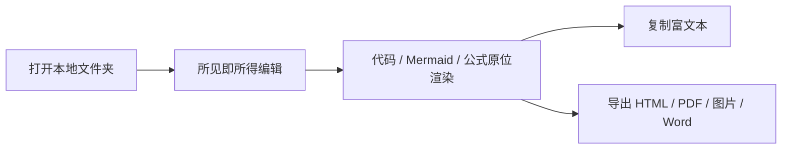

# Xiangzi MD 官网演示文档

适用版本：Xiangzi MD 2.0.16

> 这是一份专门为官网更新准备的演示文档。它不追求覆盖所有功能，而是用最少的内容，把当前版本最值得展示的体验集中放在一份本地 Markdown 里。

## 一份普通 Markdown，就是完整工作区的一部分

- 文件仍然保存在本地文件系统中。
- 打开文件夹后，可以直接得到文件树、标签页、搜索和大纲。
- 不需要账号，不需要把内容迁移到私有格式。

## 所见即所得编辑

写标题、列表、引用、表格、代码块时，不需要在“编辑”和“预览”之间反复切换。

| 场景     | 当前体验                       | 适合用途         |
| -------- | ------------------------------ | ---------------- |
| 技术方案 | 代码、Mermaid、公式原位渲染    | 团队协作与评审   |
| 知识笔记 | 标签、属性、图片与表格统一排版 | 个人知识沉淀     |
| 对外交付 | 富文本复制与多格式导出         | Word、飞书、邮件 |

## Mermaid 与公式



行内公式：$E = mc^2$

块级公式：

$$
\text{delivery} = \text{markdown} + \text{rendering} + \text{export}
$$

## 代码块

```ts
type DeliveryTarget = 'word' | 'html' | 'pdf' | 'image'

export function summarize(target: DeliveryTarget) {
  return `Ready for ${target}`
}
```

## 交付不是截图，而是可继续使用的内容

1. 复制到 Word、飞书或邮件时，尽量保留结构与样式。
2. 本地图片与 Mermaid 图表可以一起带走。
3. 需要落地文件时，再导出 HTML、PDF、长图或 Word。

## 当前版本想重点展示的关键词

- 本地优先
- 文件夹工作区
- 所见即所得
- Mermaid / KaTeX
- 富文本复制
- Word 导出
