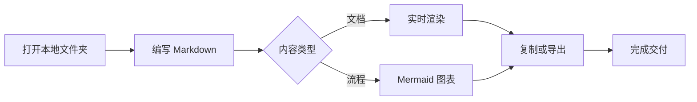

# Mermaid 流程图

把流程写成文本，并在文档中直接看到图形结果。

```mermaid
flowchart LR
    A[打开本地文件夹] --> B[编写 Markdown]
    B --> C{内容类型}
    C -->|文档| D[实时渲染]
    C -->|流程| E[Mermaid 图表]
    D --> F[复制或导出]
    E --> F
    F --> G[完成交付]
```

流程图与正文保存在同一份 Markdown 文件中。
