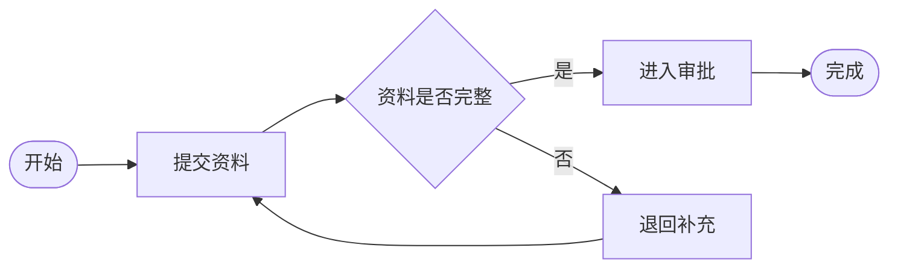
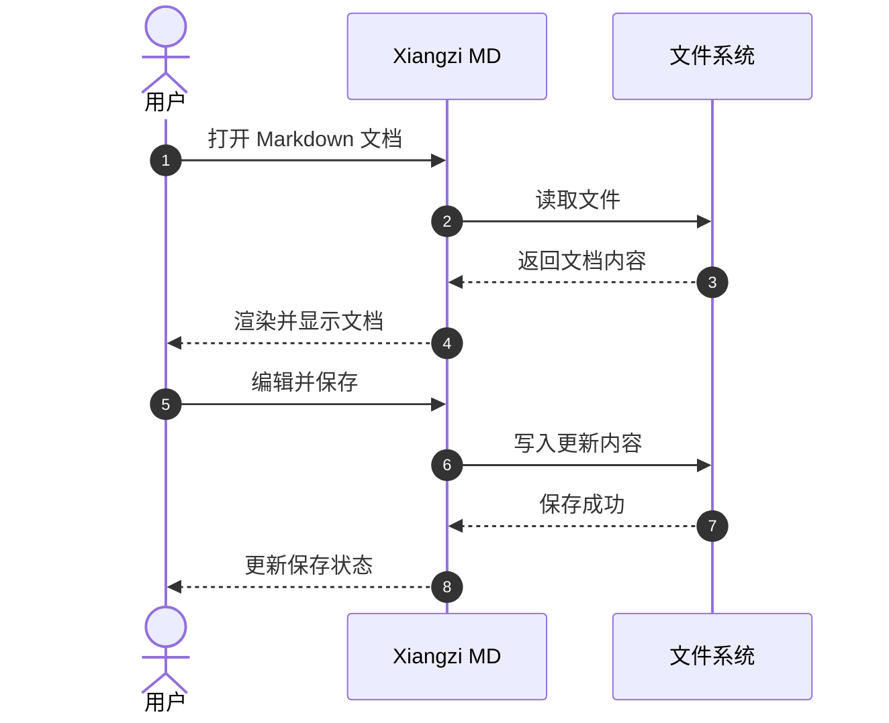
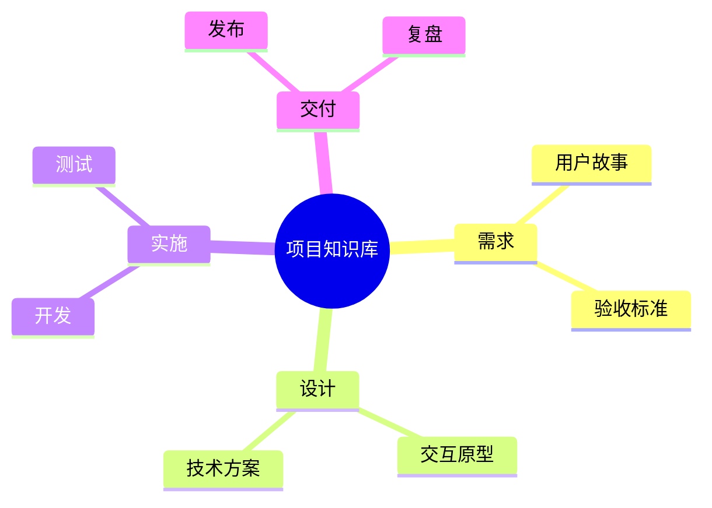
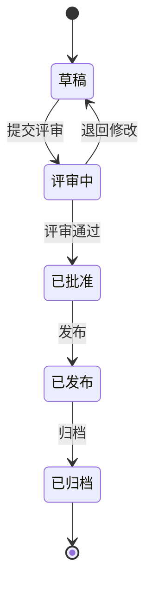
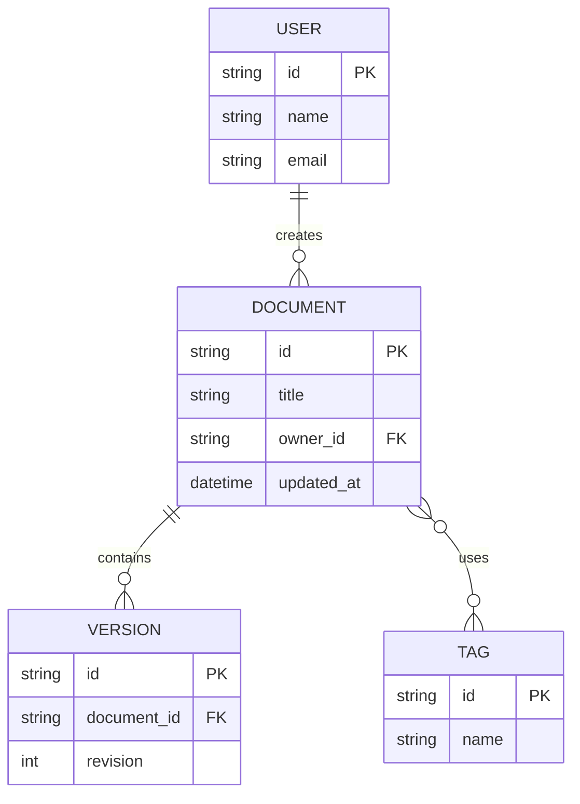
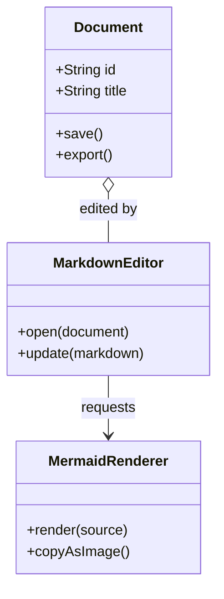
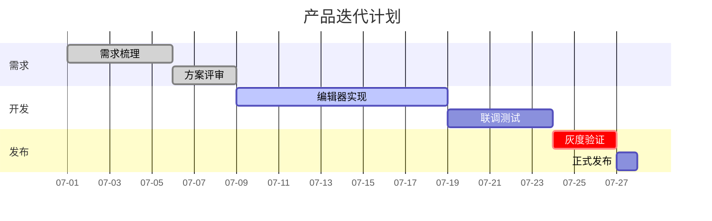
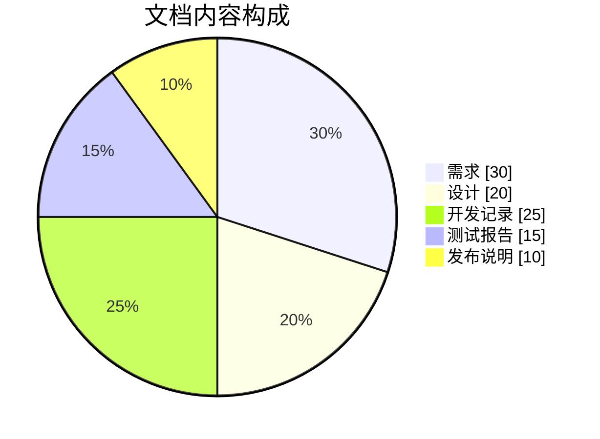
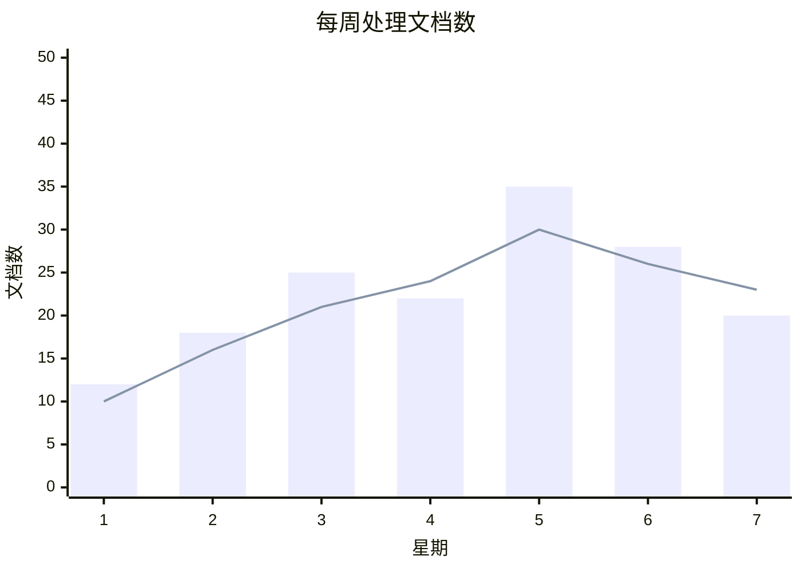

# Mermaid 常用图表示例

本文档集中展示 AI 生成 Markdown 时常见的 Mermaid 图表类型，可用于检查 Xiangzi MD 的渲染效果，也可作为后续可视化编辑功能的测试样例。

## 1. 流程图

适合表达业务流程、审批过程、决策树和系统处理步骤。

## 2. 时序图

适合表达用户、应用和服务之间按照时间顺序发生的交互。

## 3. 思维导图

适合表达主题、知识结构、需求拆解和层级关系。

## 4. 状态图

适合表达文档、订单、任务等对象的生命周期和状态转换。

## 5. ER 图

适合表达数据库实体、字段以及实体之间的关系。

## 6. 类图

适合表达代码模块、领域对象、属性、方法和依赖关系。

## 7. 甘特图

适合表达项目阶段、任务依赖和时间计划。

## 8. 饼图

适合表达各类数据在整体中的占比。

## 9. XY 图

适合表达连续数据、趋势变化以及不同数据系列之间的对比。

## 可视化编辑建议

- 流程图、状态图、ER 图和类图适合使用节点与连线画布编辑。
- 思维导图适合使用树形分支编辑器。
- 时序图适合调整参与者、消息内容和消息顺序。
- 甘特图适合在时间轴上调整任务起止时间和依赖关系。
- 饼图和 XY 图适合通过数据表格修改名称与数值。
