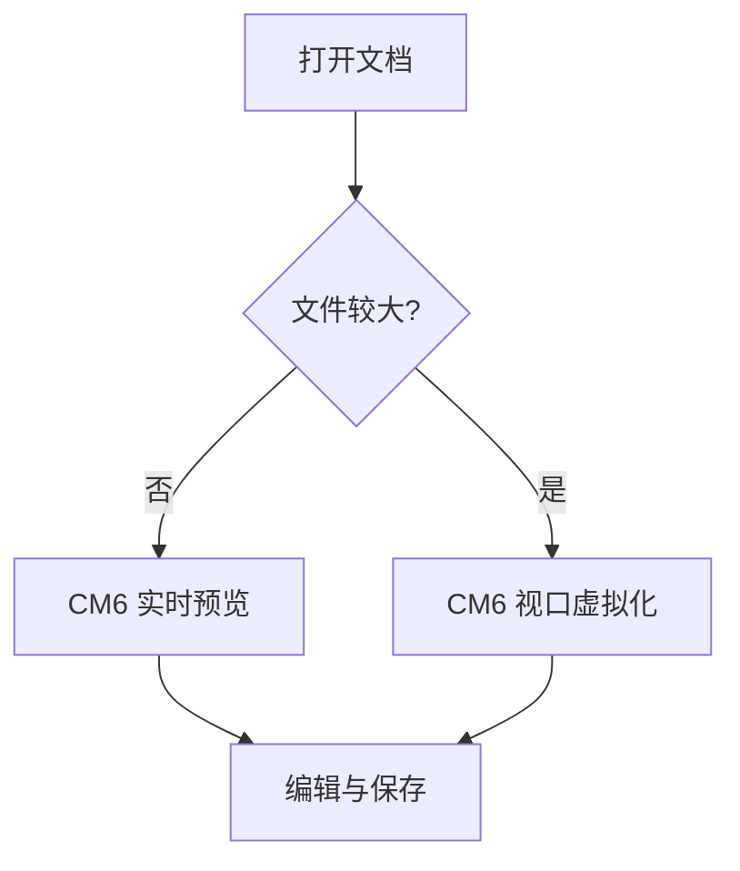
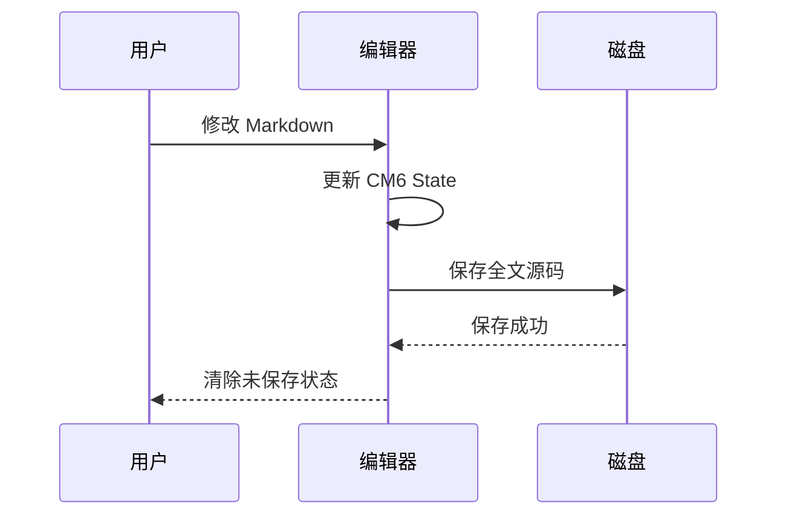

# Markdown 全格式测试文档
这是一份覆盖常见 Markdown、GFM 和编辑器扩展语法的回归测试文档。

# 一级标题
## 二级标题
### 三级标题
#### 四级标题
##### 五级标题
###### 六级标题

Setext 一级标题
===============

Setext 二级标题
---------------

## 行内文本格式

普通文本、**粗体**、*斜体*、***粗斜体***、~~删除线~~、`行内代码`。

转义字符：\*不是斜体\*、\# 不是标题、\| 不是表格分隔符。

特殊字符：& < > " ' © ® ™ 😀 中文 English 日本語 한국어。

连续空格测试：文字  中间  包含  多个  空格。

硬换行测试：第一行末尾有两个空格。  
这是硬换行后的第二行。

## 段落与分隔线

这是第一个段落。段落中包含较长文本，用于检查自动换行、光标定位、框选、复制和滚动表现。

这是第二个段落。

---

***

___

## 引用

> 一级引用
>
> 引用中的第二段。
>
> > 二级嵌套引用
> >
> > - 引用中的列表
> > - 第二项

## 无序列表

- 第一项
- 第二项
  - 二级项目 A
  - 二级项目 B
    - 三级项目
- 第三项

* 星号列表
* 第二项

+ 加号列表
+ 第二项

## 有序列表

1. 第一项
2. 第二项
   1. 二级第一项
   2. 二级第二项
3. 第三项

5. 从 5 开始
6. 下一项

## 任务列表

- [ ] 未完成任务
- [x] 已完成任务
- [ ] 父任务
  - [x] 已完成子任务
  - [ ] 未完成子任务

## 链接

- [OpenAI](https://openai.com)
- [带标题的链接](https://example.com "示例站点")
- [相对 Markdown 文档](./README.md)
- [页内锚点：表格](#表格)
- <https://example.com>
- <test@example.com>

引用式链接：[示例链接][example-link]。

快捷引用式链接：[example-link][]；纯邮箱自动链接：<test@example.com>。

[example-link]: https://example.com "引用式链接"

## 图片

远程图片：


本地相对图片（仓库内真实文件）：


不存在的图片（应安全显示源码或加载失败状态）：


带空格路径：


引用式图片（测试定义解析与失败回退）：

![引用式图片][reference-image]

[reference-image]: ./src-tauri/icons/64x64.png "引用图片标题"

## 表格

| 序号 | 名称 | 类型 | 状态 | 说明 |
| ---: | :--- | :---: | :---: | --- |
| 1 | Markdown | 文档 | ✅ | 常用轻量标记语言 |
| 2 | JSON | 数据 | ✅ | 结构化数据格式 |
| 3 | YAML | 配置 | ✅ | 第一行<br>单元格内第二行 |
| 4 | 含竖线 | 转义 | ⚠️ | 值为 A \| B |
| 5 | `inline code` | 代码 | ✅ | **粗体说明** |

## 代码块

无语言代码块：

```
plain text
第二行
```

JavaScript：

```javascript
function greet(name) {
  const message = `Hello, ${name}!`;
  console.log(message);
  return message;
}

greet("Markdown");
```

TypeScript：

```typescript
interface User {
  id: number;
  name: string;
  active: boolean;
}

const user: User = {
  id: 1,
  name: "Xiangzi",
  active: true,
};
```

Python：

```python
def fibonacci(count: int) -> list[int]:
    result = [0, 1]
    while len(result) < count:
        result.append(result[-1] + result[-2])
    return result[:count]

print(fibonacci(10))
```

Shell：

```bash
#!/usr/bin/env bash
set -euo pipefail
echo "Markdown test"
```

JSON：

```json
{
  "name": "xiangzi-md",
  "enabled": true,
  "formats": ["markdown", "html", "pdf"]
}
```

YAML：

```yaml
editor:
  mode: live-preview
  lineNumbers: false
  features:
    - tables
    - mermaid
    - math
```

SQL：

```sql
SELECT id, name
FROM users
WHERE active = TRUE
ORDER BY name ASC;
```

HTML：

```html
<section class="example">
  <h2>HTML code block</h2>
  <p>Safe source display.</p>
</section>
```

CSS：

```css
.example {
  display: grid;
  gap: 1rem;
  color: var(--text);
}
```

波浪线围栏与带附加信息的代码块：

~~~rust
fn main() {
    println!("tilde fence");
}
~~~

缩进代码块：

    indented code
    second line

## 数学公式

行内公式：$E = mc^2$，勾股定理 $a^2 + b^2 = c^2$。

块级公式：

$$
\int_{-\infty}^{\infty} e^{-x^2}\,dx = \sqrt{\pi}
$$

矩阵：

$$
A = \begin{bmatrix}
1 & 2 \\
3 & 4
\end{bmatrix}
$$

## Mermaid

流程图：



时序图：



## 脚注

这句话包含一个脚注。[^first]

这里还有一个包含多段内容的脚注。[^long-note]

[^first]: 这是第一个脚注的内容。

[^long-note]: 这是较长脚注的第一段。

    这是同一脚注的缩进续段。

## HTML

行内 HTML 换行：第一行<br>第二行。

<!-- HTML 注释应保持安全，不执行脚本。 -->

<details>
<summary>点击展开原生 HTML 详情</summary>

详情区域中的 **Markdown** 是否渲染取决于渲染器设置。

</details>

<kbd>Cmd</kbd> + <kbd>S</kbd>

上标：X<sup>2</sup>，下标：H<sub>2</sub>O。

## 删除、插入和高亮扩展

标准删除线：~~已删除内容~~。

以下语法属于部分 Markdown 方言，未支持时应保持为安全源码文本：

- ==高亮文本==
- H~2~O
- X^2^
- ++插入文本++

## 定义列表扩展

Markdown
: 一种轻量级标记语言。

CodeMirror 6
: 一个可扩展的代码编辑器组件。

## Emoji 与 Unicode

:smile: :rocket: :white_check_mark:

😀 🚀 ✅ ⚠️ ❤️ 🎉

中文标点测试：“你好，世界！”《Markdown 测试》——破折号……省略号。

## 长文本与长链接

超长连续文本：ABCDEFGHIJKLMNOPQRSTUVWXYZabcdefghijklmnopqrstuvwxyz0123456789ABCDEFGHIJKLMNOPQRSTUVWXYZabcdefghijklmnopqrstuvwxyz0123456789

[超长链接](https://example.com/a/very/long/path/that/should/not/expand/the/whole/document/horizontally?query=markdown&mode=regression&value=1234567890)

## 相邻块与空行

### 标题后紧接段落
这一段与标题之间没有额外空行，用于检查标题样式和光标定位。

### 标题后紧接代码块
```typescript
const adjacent = true;
```

上方代码块与本段之间只有标准 Markdown 换行。


上方保留了一个真实空行，用于测试空行点击和光标定位。

### 连续代码块与结构行

```text
first block
```
```python
print("second block")
```

下面的 `---` 属于 Setext 标题标记，不应渲染成分割线，也不应形成可选中的小行：

Setext 边界标题
---

下面才是独立分割线：

---

### 宽表格与长单元格

| A | B | C | D | E | F | G | H |
| --- | --- | --- | --- | --- | --- | --- | --- |
| 1 | 2 | 3 | 4 | 5 | 6 | 7 | 这是一段很长的单元格内容，用来验证单元格内部换行、表格自身横向滚动以及整个文档不会横向移动。 |

## 最终检查

- [x] 标题样式正确
- [ ] 点击标题不会显示 Markdown 标记
- [ ] Markdown 分隔空行不形成可见小行，新建空段仍可编辑
- [ ] 代码块可直接编辑并语法高亮
- [ ] 代码块语言选择器位于右上角
- [ ] 表格键盘导航和单元格换行正常
- [ ] 图片可以加载、放大和复制
- [ ] Mermaid 可以切换源码、预览和复制图片
- [ ] 数学公式正确渲染
- [ ] 搜索、替换、撤销、重做正常
- [ ] 导出 HTML、PDF 内容完整

文档结束。
