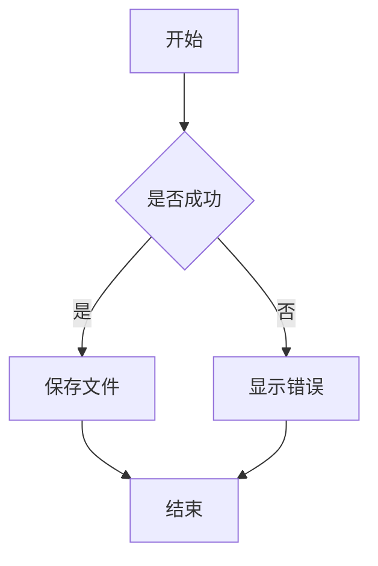
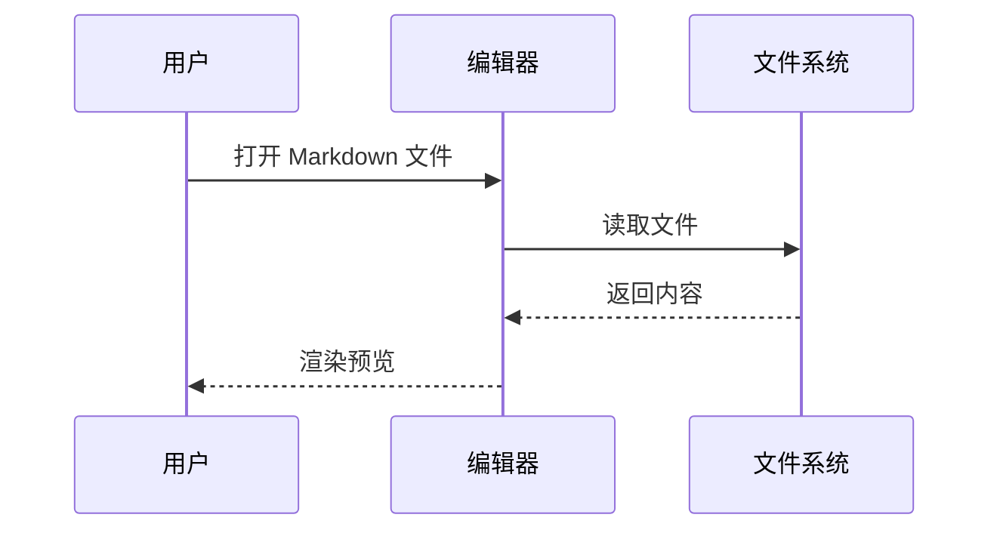
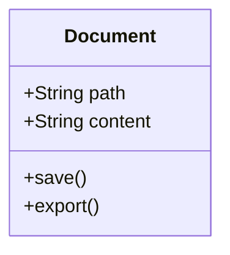

# Markdown 全格式测试文档

> 文件目标大小：1 MiB（1,048,576 字节）  
> 内容覆盖标题、段落、列表、表格、任务列表、代码块、数学公式、引用、链接、图片、HTML、脚注、Mermaid、折叠块等常见格式。

## 目录

- [基础文本](#基础文本)
- [列表](#列表)
- [表格](#表格)
- [代码块](#代码块)
- [数学公式](#数学公式)
- [引用与提示](#引用与提示)
- [链接与图片](#链接与图片)
- [Mermaid](#mermaid)
- [HTML](#html)
- [脚注](#脚注)

---

## 基础文本

这是普通段落，用于测试中文、English、数字 1234567890 和常见标点符号。

**粗体文本**、*斜体文本*、***粗斜体文本***、~~删除线~~、`行内代码`、<u>下划线 HTML</u>。

这里测试转义字符：\*不是斜体\*、\#不是标题、\[不是链接。

这是一个较长的段落：Markdown 编辑器需要正确处理自动换行、段落间距、中文排版、英文单词、数字以及各种标点。The quick brown fox jumps over the lazy dog. 0123456789.

### 不同级别标题

# 一级标题示例
## 二级标题示例
### 三级标题示例
#### 四级标题示例
##### 五级标题示例
###### 六级标题示例

---

## 列表

### 无序列表

- 苹果
- 香蕉
  - 黄色香蕉
  - 绿色香蕉
    - 未成熟
    - 可催熟
- 橙子

### 有序列表

1. 第一步：打开文件
2. 第二步：编辑内容
   1. 输入文字
   2. 插入代码
   3. 插入表格
3. 第三步：保存文件

### 任务列表

- [x] 支持 Markdown 标题
- [x] 支持代码高亮
- [x] 支持表格渲染
- [ ] 支持云同步
- [ ] 支持多人协作

### 定义列表

术语一
: 这是术语一的解释。

术语二
: 这是术语二的解释。
: 这是第二行解释。

---

## 表格

| 序号 | 名称 | 类型 | 状态 | 说明 |
|---:|:---|:---:|:---:|---|
| 1 | Markdown | 文档 | ✅ | 常用轻量标记语言 |
| 2 | JSON | 数据 | ✅ | 结构化数据格式 |
| 3 | YAML | 配置 | ✅ | 可读性较好的配置格式 |
| 4 | TOML | 配置 | ✅ | 明确且易于解析 |
| 5 | XML | 数据 | ✅ | 可扩展标记语言 |

| 左对齐 | 居中对齐 | 右对齐 |
|:---|:---:|---:|
| left | center | 100 |
| text | value | 200 |

---

## 代码块

### JavaScript

```javascript
function greet(name) {
  const message = `Hello, ${name}!`;
  console.log(message);
  return message;
}

greet("Markdown");
```

### TypeScript

```typescript
interface User {
  id: number;
  name: string;
  active: boolean;
}

const user: User = {
  id: 1,
  name: "Xiangzi",
  active: true
};
```

### Python

```python
from dataclasses import dataclass

@dataclass
class User:
    id: int
    name: str
    active: bool = True

def greet(user: User) -> str:
    return f"Hello, {user.name}"
```

### Java

```java
public class Main {
    public static void main(String[] args) {
        System.out.println("Hello Markdown");
    }
}
```

### SQL

```sql
SELECT
    id,
    username,
    created_at
FROM users
WHERE status = 1
ORDER BY created_at DESC
LIMIT 100;
```

### Shell

```bash
#!/usr/bin/env bash
set -euo pipefail

echo "Current directory: $(pwd)"
find . -type f -name "*.md" | sort
```

### JSON

```json
{
  "name": "markdown-test",
  "version": "1.0.0",
  "features": ["preview", "export", "search"],
  "enabled": true
}
```

### YAML

```yaml
app:
  name: markdown-test
  version: 1.0.0
  features:
    - preview
    - export
    - search
```

### TOML

```toml
[app]
name = "markdown-test"
version = "1.0.0"
enabled = true

[editor]
theme = "light"
font_size = 16
```

### INI

```ini
[app]
name=markdown-test
version=1.0.0

[editor]
theme=light
font_size=16
```

### XML

```xml
<?xml version="1.0" encoding="UTF-8"?>
<app>
  <name>markdown-test</name>
  <version>1.0.0</version>
</app>
```

### HTML

```html
<!doctype html>
<html lang="zh-CN">
<head>
  <meta charset="utf-8">
  <title>Markdown Test</title>
</head>
<body>
  <h1>Hello Markdown</h1>
</body>
</html>
```

### CSS

```css
:root {
  --font-size: 16px;
  --line-height: 1.7;
}

body {
  font-size: var(--font-size);
  line-height: var(--line-height);
}
```

### C

```c
#include <stdio.h>

int main(void) {
    printf("Hello Markdown\n");
    return 0;
}
```

### C++

```cpp
#include <iostream>
#include <string>

int main() {
    std::string text = "Hello Markdown";
    std::cout << text << std::endl;
    return 0;
}
```

### Rust

```rust
fn main() {
    let message = "Hello Markdown";
    println!("{}", message);
}
```

### Go

```go
package main

import "fmt"

func main() {
    fmt.Println("Hello Markdown")
}
```

### Dockerfile

```dockerfile
FROM node:22-alpine
WORKDIR /app
COPY . .
RUN npm ci
CMD ["npm", "start"]
```

---

## 数学公式

行内公式：$E = mc^2$。

块级公式：

$$
f(x) = ax^2 + bx + c
$$

$$
\int_{a}^{b} f(x)\,dx
$$

矩阵：

$$
A =
\begin{bmatrix}
1 & 2 \\
3 & 4
\end{bmatrix}
$$

---

## 引用与提示

> 这是一级引用。
>
> > 这是二级嵌套引用。
> >
> > - 引用中的列表
> > - 第二项

> [!NOTE]
> 这是 Note 提示块。

> [!TIP]
> 这是 Tip 提示块。

> [!WARNING]
> 这是 Warning 提示块。

> [!IMPORTANT]
> 这是 Important 提示块。

---

## 链接与图片

普通链接：[OpenAI](https://openai.com)

自动链接：<https://example.com>

邮箱链接：<test@example.com>

引用式链接：[Markdown Guide][md-guide]

[md-guide]: https://www.markdownguide.org "Markdown Guide"

图片：


带链接的图片：

[](https://example.com)

---

## Mermaid







---

## HTML

<details>
<summary>点击展开隐藏内容</summary>

这里是折叠区域中的 Markdown 内容。

- 项目一
- 项目二
- 项目三

</details>

<kbd>Command</kbd> + <kbd>S</kbd>

<mark>这是高亮文本</mark>

<sup>上标</sup> 与 <sub>下标</sub>

---

## 脚注

这里有一个脚注引用[^1]，这里还有另一个脚注[^long-note]。

[^1]: 这是第一个脚注。
[^long-note]: 这是一个较长的脚注，用于测试多行内容以及渲染效果。

---

## 分隔线

---

***

___

## 重复压力测试区

下面的内容会重复多次，用于把文件扩展到约 1 MiB，并测试大文件加载、滚动、搜索、替换、目录解析和导出性能。


### 测试区块 1

这是第 1 个重复测试区块。包含 **粗体**、*斜体*、~~删除线~~、`inline_code_1` 和 [示例链接](https://example.com/1)。

- 列表项 A-1
- 列表项 B-1
  - 子列表 B.1-1
  - 子列表 B.2-1
- [ ] 待办事项 1
- [x] 已完成事项 1

| 编号 | 字段 | 值 | 描述 |
|---:|---|---:|---|
| 1 | name | test-1 | 普通文本 |
| 1 | count | 1 | 数字字段 |
| 1 | active | true | 布尔字段 |

```javascript
const section1 = {
  id: 1,
  name: "section-1",
  enabled: true,
  tags: ["markdown", "test", "performance"]
};

console.log(section1);
```

```sql
SELECT id, name, status
FROM markdown_test
WHERE section_id = 1
ORDER BY id DESC;
```

> 区块 1 的引用内容。用于测试引用样式、换行、嵌套和长文档滚动性能。

行内数学公式：$x_1 = 1^2$。

---


### 测试区块 2

这是第 2 个重复测试区块。包含 **粗体**、*斜体*、~~删除线~~、`inline_code_2` 和 [示例链接](https://example.com/2)。

- 列表项 A-2
- 列表项 B-2
  - 子列表 B.1-2
  - 子列表 B.2-2
- [ ] 待办事项 2
- [x] 已完成事项 2

| 编号 | 字段 | 值 | 描述 |
|---:|---|---:|---|
| 2 | name | test-2 | 普通文本 |
| 2 | count | 2 | 数字字段 |
| 2 | active | true | 布尔字段 |

```javascript
const section2 = {
  id: 2,
  name: "section-2",
  enabled: true,
  tags: ["markdown", "test", "performance"]
};

console.log(section2);
```

```sql
SELECT id, name, status
FROM markdown_test
WHERE section_id = 2
ORDER BY id DESC;
```

> 区块 2 的引用内容。用于测试引用样式、换行、嵌套和长文档滚动性能。

行内数学公式：$x_2 = 2^2$。

---


### 测试区块 3

这是第 3 个重复测试区块。包含 **粗体**、*斜体*、~~删除线~~、`inline_code_3` 和 [示例链接](https://example.com/3)。

- 列表项 A-3
- 列表项 B-3
  - 子列表 B.1-3
  - 子列表 B.2-3
- [ ] 待办事项 3
- [x] 已完成事项 3

| 编号 | 字段 | 值 | 描述 |
|---:|---|---:|---|
| 3 | name | test-3 | 普通文本 |
| 3 | count | 3 | 数字字段 |
| 3 | active | true | 布尔字段 |

```javascript
const section3 = {
  id: 3,
  name: "section-3",
  enabled: true,
  tags: ["markdown", "test", "performance"]
};

console.log(section3);
```

```sql
SELECT id, name, status
FROM markdown_test
WHERE section_id = 3
ORDER BY id DESC;
```

> 区块 3 的引用内容。用于测试引用样式、换行、嵌套和长文档滚动性能。

行内数学公式：$x_3 = 3^2$。

---


### 测试区块 4

这是第 4 个重复测试区块。包含 **粗体**、*斜体*、~~删除线~~、`inline_code_4` 和 [示例链接](https://example.com/4)。

- 列表项 A-4
- 列表项 B-4
  - 子列表 B.1-4
  - 子列表 B.2-4
- [ ] 待办事项 4
- [x] 已完成事项 4

| 编号 | 字段 | 值 | 描述 |
|---:|---|---:|---|
| 4 | name | test-4 | 普通文本 |
| 4 | count | 4 | 数字字段 |
| 4 | active | true | 布尔字段 |

```javascript
const section4 = {
  id: 4,
  name: "section-4",
  enabled: true,
  tags: ["markdown", "test", "performance"]
};

console.log(section4);
```

```sql
SELECT id, name, status
FROM markdown_test
WHERE section_id = 4
ORDER BY id DESC;
```

> 区块 4 的引用内容。用于测试引用样式、换行、嵌套和长文档滚动性能。

行内数学公式：$x_4 = 4^2$。

---


### 测试区块 5

这是第 5 个重复测试区块。包含 **粗体**、*斜体*、~~删除线~~、`inline_code_5` 和 [示例链接](https://example.com/5)。

- 列表项 A-5
- 列表项 B-5
  - 子列表 B.1-5
  - 子列表 B.2-5
- [ ] 待办事项 5
- [x] 已完成事项 5

| 编号 | 字段 | 值 | 描述 |
|---:|---|---:|---|
| 5 | name | test-5 | 普通文本 |
| 5 | count | 5 | 数字字段 |
| 5 | active | true | 布尔字段 |

```javascript
const section5 = {
  id: 5,
  name: "section-5",
  enabled: true,
  tags: ["markdown", "test", "performance"]
};

console.log(section5);
```

```sql
SELECT id, name, status
FROM markdown_test
WHERE section_id = 5
ORDER BY id DESC;
```

> 区块 5 的引用内容。用于测试引用样式、换行、嵌套和长文档滚动性能。

行内数学公式：$x_5 = 5^2$。

---


### 测试区块 6

这是第 6 个重复测试区块。包含 **粗体**、*斜体*、~~删除线~~、`inline_code_6` 和 [示例链接](https://example.com/6)。

- 列表项 A-6
- 列表项 B-6
  - 子列表 B.1-6
  - 子列表 B.2-6
- [ ] 待办事项 6
- [x] 已完成事项 6

| 编号 | 字段 | 值 | 描述 |
|---:|---|---:|---|
| 6 | name | test-6 | 普通文本 |
| 6 | count | 6 | 数字字段 |
| 6 | active | true | 布尔字段 |

```javascript
const section6 = {
  id: 6,
  name: "section-6",
  enabled: true,
  tags: ["markdown", "test", "performance"]
};

console.log(section6);
```

```sql
SELECT id, name, status
FROM markdown_test
WHERE section_id = 6
ORDER BY id DESC;
```

> 区块 6 的引用内容。用于测试引用样式、换行、嵌套和长文档滚动性能。

行内数学公式：$x_6 = 6^2$。

---


### 测试区块 7

这是第 7 个重复测试区块。包含 **粗体**、*斜体*、~~删除线~~、`inline_code_7` 和 [示例链接](https://example.com/7)。

- 列表项 A-7
- 列表项 B-7
  - 子列表 B.1-7
  - 子列表 B.2-7
- [ ] 待办事项 7
- [x] 已完成事项 7

| 编号 | 字段 | 值 | 描述 |
|---:|---|---:|---|
| 7 | name | test-7 | 普通文本 |
| 7 | count | 7 | 数字字段 |
| 7 | active | true | 布尔字段 |

```javascript
const section7 = {
  id: 7,
  name: "section-7",
  enabled: true,
  tags: ["markdown", "test", "performance"]
};

console.log(section7);
```

```sql
SELECT id, name, status
FROM markdown_test
WHERE section_id = 7
ORDER BY id DESC;
```

> 区块 7 的引用内容。用于测试引用样式、换行、嵌套和长文档滚动性能。

行内数学公式：$x_7 = 7^2$。

---


### 测试区块 8

这是第 8 个重复测试区块。包含 **粗体**、*斜体*、~~删除线~~、`inline_code_8` 和 [示例链接](https://example.com/8)。

- 列表项 A-8
- 列表项 B-8
  - 子列表 B.1-8
  - 子列表 B.2-8
- [ ] 待办事项 8
- [x] 已完成事项 8

| 编号 | 字段 | 值 | 描述 |
|---:|---|---:|---|
| 8 | name | test-8 | 普通文本 |
| 8 | count | 8 | 数字字段 |
| 8 | active | true | 布尔字段 |

```javascript
const section8 = {
  id: 8,
  name: "section-8",
  enabled: true,
  tags: ["markdown", "test", "performance"]
};

console.log(section8);
```

```sql
SELECT id, name, status
FROM markdown_test
WHERE section_id = 8
ORDER BY id DESC;
```

> 区块 8 的引用内容。用于测试引用样式、换行、嵌套和长文档滚动性能。

行内数学公式：$x_8 = 8^2$。

---


### 测试区块 9

这是第 9 个重复测试区块。包含 **粗体**、*斜体*、~~删除线~~、`inline_code_9` 和 [示例链接](https://example.com/9)。

- 列表项 A-9
- 列表项 B-9
  - 子列表 B.1-9
  - 子列表 B.2-9
- [ ] 待办事项 9
- [x] 已完成事项 9

| 编号 | 字段 | 值 | 描述 |
|---:|---|---:|---|
| 9 | name | test-9 | 普通文本 |
| 9 | count | 9 | 数字字段 |
| 9 | active | true | 布尔字段 |

```javascript
const section9 = {
  id: 9,
  name: "section-9",
  enabled: true,
  tags: ["markdown", "test", "performance"]
};

console.log(section9);
```

```sql
SELECT id, name, status
FROM markdown_test
WHERE section_id = 9
ORDER BY id DESC;
```

> 区块 9 的引用内容。用于测试引用样式、换行、嵌套和长文档滚动性能。

行内数学公式：$x_9 = 9^2$。

---


### 测试区块 10

这是第 10 个重复测试区块。包含 **粗体**、*斜体*、~~删除线~~、`inline_code_10` 和 [示例链接](https://example.com/10)。

- 列表项 A-10
- 列表项 B-10
  - 子列表 B.1-10
  - 子列表 B.2-10
- [ ] 待办事项 10
- [x] 已完成事项 10

| 编号 | 字段 | 值 | 描述 |
|---:|---|---:|---|
| 10 | name | test-10 | 普通文本 |
| 10 | count | 10 | 数字字段 |
| 10 | active | true | 布尔字段 |

```javascript
const section10 = {
  id: 10,
  name: "section-10",
  enabled: true,
  tags: ["markdown", "test", "performance"]
};

console.log(section10);
```

```sql
SELECT id, name, status
FROM markdown_test
WHERE section_id = 10
ORDER BY id DESC;
```

> 区块 10 的引用内容。用于测试引用样式、换行、嵌套和长文档滚动性能。

行内数学公式：$x_10 = 10^2$。

---


### 测试区块 11

这是第 11 个重复测试区块。包含 **粗体**、*斜体*、~~删除线~~、`inline_code_11` 和 [示例链接](https://example.com/11)。

- 列表项 A-11
- 列表项 B-11
  - 子列表 B.1-11
  - 子列表 B.2-11
- [ ] 待办事项 11
- [x] 已完成事项 11

| 编号 | 字段 | 值 | 描述 |
|---:|---|---:|---|
| 11 | name | test-11 | 普通文本 |
| 11 | count | 11 | 数字字段 |
| 11 | active | true | 布尔字段 |

```javascript
const section11 = {
  id: 11,
  name: "section-11",
  enabled: true,
  tags: ["markdown", "test", "performance"]
};

console.log(section11);
```

```sql
SELECT id, name, status
FROM markdown_test
WHERE section_id = 11
ORDER BY id DESC;
```

> 区块 11 的引用内容。用于测试引用样式、换行、嵌套和长文档滚动性能。

行内数学公式：$x_11 = 11^2$。

---


### 测试区块 12

这是第 12 个重复测试区块。包含 **粗体**、*斜体*、~~删除线~~、`inline_code_12` 和 [示例链接](https://example.com/12)。

- 列表项 A-12
- 列表项 B-12
  - 子列表 B.1-12
  - 子列表 B.2-12
- [ ] 待办事项 12
- [x] 已完成事项 12

| 编号 | 字段 | 值 | 描述 |
|---:|---|---:|---|
| 12 | name | test-12 | 普通文本 |
| 12 | count | 12 | 数字字段 |
| 12 | active | true | 布尔字段 |

```javascript
const section12 = {
  id: 12,
  name: "section-12",
  enabled: true,
  tags: ["markdown", "test", "performance"]
};

console.log(section12);
```

```sql
SELECT id, name, status
FROM markdown_test
WHERE section_id = 12
ORDER BY id DESC;
```

> 区块 12 的引用内容。用于测试引用样式、换行、嵌套和长文档滚动性能。

行内数学公式：$x_12 = 12^2$。

---


### 测试区块 13

这是第 13 个重复测试区块。包含 **粗体**、*斜体*、~~删除线~~、`inline_code_13` 和 [示例链接](https://example.com/13)。

- 列表项 A-13
- 列表项 B-13
  - 子列表 B.1-13
  - 子列表 B.2-13
- [ ] 待办事项 13
- [x] 已完成事项 13

| 编号 | 字段 | 值 | 描述 |
|---:|---|---:|---|
| 13 | name | test-13 | 普通文本 |
| 13 | count | 13 | 数字字段 |
| 13 | active | true | 布尔字段 |

```javascript
const section13 = {
  id: 13,
  name: "section-13",
  enabled: true,
  tags: ["markdown", "test", "performance"]
};

console.log(section13);
```

```sql
SELECT id, name, status
FROM markdown_test
WHERE section_id = 13
ORDER BY id DESC;
```

> 区块 13 的引用内容。用于测试引用样式、换行、嵌套和长文档滚动性能。

行内数学公式：$x_13 = 13^2$。

---


### 测试区块 14

这是第 14 个重复测试区块。包含 **粗体**、*斜体*、~~删除线~~、`inline_code_14` 和 [示例链接](https://example.com/14)。

- 列表项 A-14
- 列表项 B-14
  - 子列表 B.1-14
  - 子列表 B.2-14
- [ ] 待办事项 14
- [x] 已完成事项 14

| 编号 | 字段 | 值 | 描述 |
|---:|---|---:|---|
| 14 | name | test-14 | 普通文本 |
| 14 | count | 14 | 数字字段 |
| 14 | active | true | 布尔字段 |

```javascript
const section14 = {
  id: 14,
  name: "section-14",
  enabled: true,
  tags: ["markdown", "test", "performance"]
};

console.log(section14);
```

```sql
SELECT id, name, status
FROM markdown_test
WHERE section_id = 14
ORDER BY id DESC;
```

> 区块 14 的引用内容。用于测试引用样式、换行、嵌套和长文档滚动性能。

行内数学公式：$x_14 = 14^2$。

---


### 测试区块 15

这是第 15 个重复测试区块。包含 **粗体**、*斜体*、~~删除线~~、`inline_code_15` 和 [示例链接](https://example.com/15)。

- 列表项 A-15
- 列表项 B-15
  - 子列表 B.1-15
  - 子列表 B.2-15
- [ ] 待办事项 15
- [x] 已完成事项 15

| 编号 | 字段 | 值 | 描述 |
|---:|---|---:|---|
| 15 | name | test-15 | 普通文本 |
| 15 | count | 15 | 数字字段 |
| 15 | active | true | 布尔字段 |

```javascript
const section15 = {
  id: 15,
  name: "section-15",
  enabled: true,
  tags: ["markdown", "test", "performance"]
};

console.log(section15);
```

```sql
SELECT id, name, status
FROM markdown_test
WHERE section_id = 15
ORDER BY id DESC;
```

> 区块 15 的引用内容。用于测试引用样式、换行、嵌套和长文档滚动性能。

行内数学公式：$x_15 = 15^2$。

---


### 测试区块 16

这是第 16 个重复测试区块。包含 **粗体**、*斜体*、~~删除线~~、`inline_code_16` 和 [示例链接](https://example.com/16)。

- 列表项 A-16
- 列表项 B-16
  - 子列表 B.1-16
  - 子列表 B.2-16
- [ ] 待办事项 16
- [x] 已完成事项 16

| 编号 | 字段 | 值 | 描述 |
|---:|---|---:|---|
| 16 | name | test-16 | 普通文本 |
| 16 | count | 16 | 数字字段 |
| 16 | active | true | 布尔字段 |

```javascript
const section16 = {
  id: 16,
  name: "section-16",
  enabled: true,
  tags: ["markdown", "test", "performance"]
};

console.log(section16);
```

```sql
SELECT id, name, status
FROM markdown_test
WHERE section_id = 16
ORDER BY id DESC;
```

> 区块 16 的引用内容。用于测试引用样式、换行、嵌套和长文档滚动性能。

行内数学公式：$x_16 = 16^2$。

---


### 测试区块 17

这是第 17 个重复测试区块。包含 **粗体**、*斜体*、~~删除线~~、`inline_code_17` 和 [示例链接](https://example.com/17)。

- 列表项 A-17
- 列表项 B-17
  - 子列表 B.1-17
  - 子列表 B.2-17
- [ ] 待办事项 17
- [x] 已完成事项 17

| 编号 | 字段 | 值 | 描述 |
|---:|---|---:|---|
| 17 | name | test-17 | 普通文本 |
| 17 | count | 17 | 数字字段 |
| 17 | active | true | 布尔字段 |

```javascript
const section17 = {
  id: 17,
  name: "section-17",
  enabled: true,
  tags: ["markdown", "test", "performance"]
};

console.log(section17);
```

```sql
SELECT id, name, status
FROM markdown_test
WHERE section_id = 17
ORDER BY id DESC;
```

> 区块 17 的引用内容。用于测试引用样式、换行、嵌套和长文档滚动性能。

行内数学公式：$x_17 = 17^2$。

---


### 测试区块 18

这是第 18 个重复测试区块。包含 **粗体**、*斜体*、~~删除线~~、`inline_code_18` 和 [示例链接](https://example.com/18)。

- 列表项 A-18
- 列表项 B-18
  - 子列表 B.1-18
  - 子列表 B.2-18
- [ ] 待办事项 18
- [x] 已完成事项 18

| 编号 | 字段 | 值 | 描述 |
|---:|---|---:|---|
| 18 | name | test-18 | 普通文本 |
| 18 | count | 18 | 数字字段 |
| 18 | active | true | 布尔字段 |

```javascript
const section18 = {
  id: 18,
  name: "section-18",
  enabled: true,
  tags: ["markdown", "test", "performance"]
};

console.log(section18);
```

```sql
SELECT id, name, status
FROM markdown_test
WHERE section_id = 18
ORDER BY id DESC;
```

> 区块 18 的引用内容。用于测试引用样式、换行、嵌套和长文档滚动性能。

行内数学公式：$x_18 = 18^2$。

---


### 测试区块 19

这是第 19 个重复测试区块。包含 **粗体**、*斜体*、~~删除线~~、`inline_code_19` 和 [示例链接](https://example.com/19)。

- 列表项 A-19
- 列表项 B-19
  - 子列表 B.1-19
  - 子列表 B.2-19
- [ ] 待办事项 19
- [x] 已完成事项 19

| 编号 | 字段 | 值 | 描述 |
|---:|---|---:|---|
| 19 | name | test-19 | 普通文本 |
| 19 | count | 19 | 数字字段 |
| 19 | active | true | 布尔字段 |

```javascript
const section19 = {
  id: 19,
  name: "section-19",
  enabled: true,
  tags: ["markdown", "test", "performance"]
};

console.log(section19);
```

```sql
SELECT id, name, status
FROM markdown_test
WHERE section_id = 19
ORDER BY id DESC;
```

> 区块 19 的引用内容。用于测试引用样式、换行、嵌套和长文档滚动性能。

行内数学公式：$x_19 = 19^2$。

---


### 测试区块 20

这是第 20 个重复测试区块。包含 **粗体**、*斜体*、~~删除线~~、`inline_code_20` 和 [示例链接](https://example.com/20)。

- 列表项 A-20
- 列表项 B-20
  - 子列表 B.1-20
  - 子列表 B.2-20
- [ ] 待办事项 20
- [x] 已完成事项 20

| 编号 | 字段 | 值 | 描述 |
|---:|---|---:|---|
| 20 | name | test-20 | 普通文本 |
| 20 | count | 20 | 数字字段 |
| 20 | active | true | 布尔字段 |

```javascript
const section20 = {
  id: 20,
  name: "section-20",
  enabled: true,
  tags: ["markdown", "test", "performance"]
};

console.log(section20);
```

```sql
SELECT id, name, status
FROM markdown_test
WHERE section_id = 20
ORDER BY id DESC;
```

> 区块 20 的引用内容。用于测试引用样式、换行、嵌套和长文档滚动性能。

行内数学公式：$x_20 = 20^2$。

---


### 测试区块 21

这是第 21 个重复测试区块。包含 **粗体**、*斜体*、~~删除线~~、`inline_code_21` 和 [示例链接](https://example.com/21)。

- 列表项 A-21
- 列表项 B-21
  - 子列表 B.1-21
  - 子列表 B.2-21
- [ ] 待办事项 21
- [x] 已完成事项 21

| 编号 | 字段 | 值 | 描述 |
|---:|---|---:|---|
| 21 | name | test-21 | 普通文本 |
| 21 | count | 21 | 数字字段 |
| 21 | active | true | 布尔字段 |

```javascript
const section21 = {
  id: 21,
  name: "section-21",
  enabled: true,
  tags: ["markdown", "test", "performance"]
};

console.log(section21);
```

```sql
SELECT id, name, status
FROM markdown_test
WHERE section_id = 21
ORDER BY id DESC;
```

> 区块 21 的引用内容。用于测试引用样式、换行、嵌套和长文档滚动性能。

行内数学公式：$x_21 = 21^2$。

---


### 测试区块 22

这是第 22 个重复测试区块。包含 **粗体**、*斜体*、~~删除线~~、`inline_code_22` 和 [示例链接](https://example.com/22)。

- 列表项 A-22
- 列表项 B-22
  - 子列表 B.1-22
  - 子列表 B.2-22
- [ ] 待办事项 22
- [x] 已完成事项 22

| 编号 | 字段 | 值 | 描述 |
|---:|---|---:|---|
| 22 | name | test-22 | 普通文本 |
| 22 | count | 22 | 数字字段 |
| 22 | active | true | 布尔字段 |

```javascript
const section22 = {
  id: 22,
  name: "section-22",
  enabled: true,
  tags: ["markdown", "test", "performance"]
};

console.log(section22);
```

```sql
SELECT id, name, status
FROM markdown_test
WHERE section_id = 22
ORDER BY id DESC;
```

> 区块 22 的引用内容。用于测试引用样式、换行、嵌套和长文档滚动性能。

行内数学公式：$x_22 = 22^2$。

---


### 测试区块 23

这是第 23 个重复测试区块。包含 **粗体**、*斜体*、~~删除线~~、`inline_code_23` 和 [示例链接](https://example.com/23)。

- 列表项 A-23
- 列表项 B-23
  - 子列表 B.1-23
  - 子列表 B.2-23
- [ ] 待办事项 23
- [x] 已完成事项 23

| 编号 | 字段 | 值 | 描述 |
|---:|---|---:|---|
| 23 | name | test-23 | 普通文本 |
| 23 | count | 23 | 数字字段 |
| 23 | active | true | 布尔字段 |

```javascript
const section23 = {
  id: 23,
  name: "section-23",
  enabled: true,
  tags: ["markdown", "test", "performance"]
};

console.log(section23);
```

```sql
SELECT id, name, status
FROM markdown_test
WHERE section_id = 23
ORDER BY id DESC;
```

> 区块 23 的引用内容。用于测试引用样式、换行、嵌套和长文档滚动性能。

行内数学公式：$x_23 = 23^2$。

---


### 测试区块 24

这是第 24 个重复测试区块。包含 **粗体**、*斜体*、~~删除线~~、`inline_code_24` 和 [示例链接](https://example.com/24)。

- 列表项 A-24
- 列表项 B-24
  - 子列表 B.1-24
  - 子列表 B.2-24
- [ ] 待办事项 24
- [x] 已完成事项 24

| 编号 | 字段 | 值 | 描述 |
|---:|---|---:|---|
| 24 | name | test-24 | 普通文本 |
| 24 | count | 24 | 数字字段 |
| 24 | active | true | 布尔字段 |

```javascript
const section24 = {
  id: 24,
  name: "section-24",
  enabled: true,
  tags: ["markdown", "test", "performance"]
};

console.log(section24);
```

```sql
SELECT id, name, status
FROM markdown_test
WHERE section_id = 24
ORDER BY id DESC;
```

> 区块 24 的引用内容。用于测试引用样式、换行、嵌套和长文档滚动性能。

行内数学公式：$x_24 = 24^2$。

---


### 测试区块 25

这是第 25 个重复测试区块。包含 **粗体**、*斜体*、~~删除线~~、`inline_code_25` 和 [示例链接](https://example.com/25)。

- 列表项 A-25
- 列表项 B-25
  - 子列表 B.1-25
  - 子列表 B.2-25
- [ ] 待办事项 25
- [x] 已完成事项 25

| 编号 | 字段 | 值 | 描述 |
|---:|---|---:|---|
| 25 | name | test-25 | 普通文本 |
| 25 | count | 25 | 数字字段 |
| 25 | active | true | 布尔字段 |

```javascript
const section25 = {
  id: 25,
  name: "section-25",
  enabled: true,
  tags: ["markdown", "test", "performance"]
};

console.log(section25);
```

```sql
SELECT id, name, status
FROM markdown_test
WHERE section_id = 25
ORDER BY id DESC;
```

> 区块 25 的引用内容。用于测试引用样式、换行、嵌套和长文档滚动性能。

行内数学公式：$x_25 = 25^2$。

---


### 测试区块 26

这是第 26 个重复测试区块。包含 **粗体**、*斜体*、~~删除线~~、`inline_code_26` 和 [示例链接](https://example.com/26)。

- 列表项 A-26
- 列表项 B-26
  - 子列表 B.1-26
  - 子列表 B.2-26
- [ ] 待办事项 26
- [x] 已完成事项 26

| 编号 | 字段 | 值 | 描述 |
|---:|---|---:|---|
| 26 | name | test-26 | 普通文本 |
| 26 | count | 26 | 数字字段 |
| 26 | active | true | 布尔字段 |

```javascript
const section26 = {
  id: 26,
  name: "section-26",
  enabled: true,
  tags: ["markdown", "test", "performance"]
};

console.log(section26);
```

```sql
SELECT id, name, status
FROM markdown_test
WHERE section_id = 26
ORDER BY id DESC;
```

> 区块 26 的引用内容。用于测试引用样式、换行、嵌套和长文档滚动性能。

行内数学公式：$x_26 = 26^2$。

---


### 测试区块 27

这是第 27 个重复测试区块。包含 **粗体**、*斜体*、~~删除线~~、`inline_code_27` 和 [示例链接](https://example.com/27)。

- 列表项 A-27
- 列表项 B-27
  - 子列表 B.1-27
  - 子列表 B.2-27
- [ ] 待办事项 27
- [x] 已完成事项 27

| 编号 | 字段 | 值 | 描述 |
|---:|---|---:|---|
| 27 | name | test-27 | 普通文本 |
| 27 | count | 27 | 数字字段 |
| 27 | active | true | 布尔字段 |

```javascript
const section27 = {
  id: 27,
  name: "section-27",
  enabled: true,
  tags: ["markdown", "test", "performance"]
};

console.log(section27);
```

```sql
SELECT id, name, status
FROM markdown_test
WHERE section_id = 27
ORDER BY id DESC;
```

> 区块 27 的引用内容。用于测试引用样式、换行、嵌套和长文档滚动性能。

行内数学公式：$x_27 = 27^2$。

---


### 测试区块 28

这是第 28 个重复测试区块。包含 **粗体**、*斜体*、~~删除线~~、`inline_code_28` 和 [示例链接](https://example.com/28)。

- 列表项 A-28
- 列表项 B-28
  - 子列表 B.1-28
  - 子列表 B.2-28
- [ ] 待办事项 28
- [x] 已完成事项 28

| 编号 | 字段 | 值 | 描述 |
|---:|---|---:|---|
| 28 | name | test-28 | 普通文本 |
| 28 | count | 28 | 数字字段 |
| 28 | active | true | 布尔字段 |

```javascript
const section28 = {
  id: 28,
  name: "section-28",
  enabled: true,
  tags: ["markdown", "test", "performance"]
};

console.log(section28);
```

```sql
SELECT id, name, status
FROM markdown_test
WHERE section_id = 28
ORDER BY id DESC;
```

> 区块 28 的引用内容。用于测试引用样式、换行、嵌套和长文档滚动性能。

行内数学公式：$x_28 = 28^2$。

---


### 测试区块 29

这是第 29 个重复测试区块。包含 **粗体**、*斜体*、~~删除线~~、`inline_code_29` 和 [示例链接](https://example.com/29)。

- 列表项 A-29
- 列表项 B-29
  - 子列表 B.1-29
  - 子列表 B.2-29
- [ ] 待办事项 29
- [x] 已完成事项 29

| 编号 | 字段 | 值 | 描述 |
|---:|---|---:|---|
| 29 | name | test-29 | 普通文本 |
| 29 | count | 29 | 数字字段 |
| 29 | active | true | 布尔字段 |

```javascript
const section29 = {
  id: 29,
  name: "section-29",
  enabled: true,
  tags: ["markdown", "test", "performance"]
};

console.log(section29);
```

```sql
SELECT id, name, status
FROM markdown_test
WHERE section_id = 29
ORDER BY id DESC;
```

> 区块 29 的引用内容。用于测试引用样式、换行、嵌套和长文档滚动性能。

行内数学公式：$x_29 = 29^2$。

---


### 测试区块 30

这是第 30 个重复测试区块。包含 **粗体**、*斜体*、~~删除线~~、`inline_code_30` 和 [示例链接](https://example.com/30)。

- 列表项 A-30
- 列表项 B-30
  - 子列表 B.1-30
  - 子列表 B.2-30
- [ ] 待办事项 30
- [x] 已完成事项 30

| 编号 | 字段 | 值 | 描述 |
|---:|---|---:|---|
| 30 | name | test-30 | 普通文本 |
| 30 | count | 30 | 数字字段 |
| 30 | active | true | 布尔字段 |

```javascript
const section30 = {
  id: 30,
  name: "section-30",
  enabled: true,
  tags: ["markdown", "test", "performance"]
};

console.log(section30);
```

```sql
SELECT id, name, status
FROM markdown_test
WHERE section_id = 30
ORDER BY id DESC;
```

> 区块 30 的引用内容。用于测试引用样式、换行、嵌套和长文档滚动性能。

行内数学公式：$x_30 = 30^2$。

---


### 测试区块 31

这是第 31 个重复测试区块。包含 **粗体**、*斜体*、~~删除线~~、`inline_code_31` 和 [示例链接](https://example.com/31)。

- 列表项 A-31
- 列表项 B-31
  - 子列表 B.1-31
  - 子列表 B.2-31
- [ ] 待办事项 31
- [x] 已完成事项 31

| 编号 | 字段 | 值 | 描述 |
|---:|---|---:|---|
| 31 | name | test-31 | 普通文本 |
| 31 | count | 31 | 数字字段 |
| 31 | active | true | 布尔字段 |

```javascript
const section31 = {
  id: 31,
  name: "section-31",
  enabled: true,
  tags: ["markdown", "test", "performance"]
};

console.log(section31);
```

```sql
SELECT id, name, status
FROM markdown_test
WHERE section_id = 31
ORDER BY id DESC;
```

> 区块 31 的引用内容。用于测试引用样式、换行、嵌套和长文档滚动性能。

行内数学公式：$x_31 = 31^2$。

---


### 测试区块 32

这是第 32 个重复测试区块。包含 **粗体**、*斜体*、~~删除线~~、`inline_code_32` 和 [示例链接](https://example.com/32)。

- 列表项 A-32
- 列表项 B-32
  - 子列表 B.1-32
  - 子列表 B.2-32
- [ ] 待办事项 32
- [x] 已完成事项 32

| 编号 | 字段 | 值 | 描述 |
|---:|---|---:|---|
| 32 | name | test-32 | 普通文本 |
| 32 | count | 32 | 数字字段 |
| 32 | active | true | 布尔字段 |

```javascript
const section32 = {
  id: 32,
  name: "section-32",
  enabled: true,
  tags: ["markdown", "test", "performance"]
};

console.log(section32);
```

```sql
SELECT id, name, status
FROM markdown_test
WHERE section_id = 32
ORDER BY id DESC;
```

> 区块 32 的引用内容。用于测试引用样式、换行、嵌套和长文档滚动性能。

行内数学公式：$x_32 = 32^2$。

---


### 测试区块 33

这是第 33 个重复测试区块。包含 **粗体**、*斜体*、~~删除线~~、`inline_code_33` 和 [示例链接](https://example.com/33)。

- 列表项 A-33
- 列表项 B-33
  - 子列表 B.1-33
  - 子列表 B.2-33
- [ ] 待办事项 33
- [x] 已完成事项 33

| 编号 | 字段 | 值 | 描述 |
|---:|---|---:|---|
| 33 | name | test-33 | 普通文本 |
| 33 | count | 33 | 数字字段 |
| 33 | active | true | 布尔字段 |

```javascript
const section33 = {
  id: 33,
  name: "section-33",
  enabled: true,
  tags: ["markdown", "test", "performance"]
};

console.log(section33);
```

```sql
SELECT id, name, status
FROM markdown_test
WHERE section_id = 33
ORDER BY id DESC;
```

> 区块 33 的引用内容。用于测试引用样式、换行、嵌套和长文档滚动性能。

行内数学公式：$x_33 = 33^2$。

---


### 测试区块 34

这是第 34 个重复测试区块。包含 **粗体**、*斜体*、~~删除线~~、`inline_code_34` 和 [示例链接](https://example.com/34)。

- 列表项 A-34
- 列表项 B-34
  - 子列表 B.1-34
  - 子列表 B.2-34
- [ ] 待办事项 34
- [x] 已完成事项 34

| 编号 | 字段 | 值 | 描述 |
|---:|---|---:|---|
| 34 | name | test-34 | 普通文本 |
| 34 | count | 34 | 数字字段 |
| 34 | active | true | 布尔字段 |

```javascript
const section34 = {
  id: 34,
  name: "section-34",
  enabled: true,
  tags: ["markdown", "test", "performance"]
};

console.log(section34);
```

```sql
SELECT id, name, status
FROM markdown_test
WHERE section_id = 34
ORDER BY id DESC;
```

> 区块 34 的引用内容。用于测试引用样式、换行、嵌套和长文档滚动性能。

行内数学公式：$x_34 = 34^2$。

---


### 测试区块 35

这是第 35 个重复测试区块。包含 **粗体**、*斜体*、~~删除线~~、`inline_code_35` 和 [示例链接](https://example.com/35)。

- 列表项 A-35
- 列表项 B-35
  - 子列表 B.1-35
  - 子列表 B.2-35
- [ ] 待办事项 35
- [x] 已完成事项 35

| 编号 | 字段 | 值 | 描述 |
|---:|---|---:|---|
| 35 | name | test-35 | 普通文本 |
| 35 | count | 35 | 数字字段 |
| 35 | active | true | 布尔字段 |

```javascript
const section35 = {
  id: 35,
  name: "section-35",
  enabled: true,
  tags: ["markdown", "test", "performance"]
};

console.log(section35);
```

```sql
SELECT id, name, status
FROM markdown_test
WHERE section_id = 35
ORDER BY id DESC;
```

> 区块 35 的引用内容。用于测试引用样式、换行、嵌套和长文档滚动性能。

行内数学公式：$x_35 = 35^2$。

---


### 测试区块 36

这是第 36 个重复测试区块。包含 **粗体**、*斜体*、~~删除线~~、`inline_code_36` 和 [示例链接](https://example.com/36)。

- 列表项 A-36
- 列表项 B-36
  - 子列表 B.1-36
  - 子列表 B.2-36
- [ ] 待办事项 36
- [x] 已完成事项 36

| 编号 | 字段 | 值 | 描述 |
|---:|---|---:|---|
| 36 | name | test-36 | 普通文本 |
| 36 | count | 36 | 数字字段 |
| 36 | active | true | 布尔字段 |

```javascript
const section36 = {
  id: 36,
  name: "section-36",
  enabled: true,
  tags: ["markdown", "test", "performance"]
};

console.log(section36);
```

```sql
SELECT id, name, status
FROM markdown_test
WHERE section_id = 36
ORDER BY id DESC;
```

> 区块 36 的引用内容。用于测试引用样式、换行、嵌套和长文档滚动性能。

行内数学公式：$x_36 = 36^2$。

---


### 测试区块 37

这是第 37 个重复测试区块。包含 **粗体**、*斜体*、~~删除线~~、`inline_code_37` 和 [示例链接](https://example.com/37)。

- 列表项 A-37
- 列表项 B-37
  - 子列表 B.1-37
  - 子列表 B.2-37
- [ ] 待办事项 37
- [x] 已完成事项 37

| 编号 | 字段 | 值 | 描述 |
|---:|---|---:|---|
| 37 | name | test-37 | 普通文本 |
| 37 | count | 37 | 数字字段 |
| 37 | active | true | 布尔字段 |

```javascript
const section37 = {
  id: 37,
  name: "section-37",
  enabled: true,
  tags: ["markdown", "test", "performance"]
};

console.log(section37);
```

```sql
SELECT id, name, status
FROM markdown_test
WHERE section_id = 37
ORDER BY id DESC;
```

> 区块 37 的引用内容。用于测试引用样式、换行、嵌套和长文档滚动性能。

行内数学公式：$x_37 = 37^2$。

---


### 测试区块 38

这是第 38 个重复测试区块。包含 **粗体**、*斜体*、~~删除线~~、`inline_code_38` 和 [示例链接](https://example.com/38)。

- 列表项 A-38
- 列表项 B-38
  - 子列表 B.1-38
  - 子列表 B.2-38
- [ ] 待办事项 38
- [x] 已完成事项 38

| 编号 | 字段 | 值 | 描述 |
|---:|---|---:|---|
| 38 | name | test-38 | 普通文本 |
| 38 | count | 38 | 数字字段 |
| 38 | active | true | 布尔字段 |

```javascript
const section38 = {
  id: 38,
  name: "section-38",
  enabled: true,
  tags: ["markdown", "test", "performance"]
};

console.log(section38);
```

```sql
SELECT id, name, status
FROM markdown_test
WHERE section_id = 38
ORDER BY id DESC;
```

> 区块 38 的引用内容。用于测试引用样式、换行、嵌套和长文档滚动性能。

行内数学公式：$x_38 = 38^2$。

---


### 测试区块 39

这是第 39 个重复测试区块。包含 **粗体**、*斜体*、~~删除线~~、`inline_code_39` 和 [示例链接](https://example.com/39)。

- 列表项 A-39
- 列表项 B-39
  - 子列表 B.1-39
  - 子列表 B.2-39
- [ ] 待办事项 39
- [x] 已完成事项 39

| 编号 | 字段 | 值 | 描述 |
|---:|---|---:|---|
| 39 | name | test-39 | 普通文本 |
| 39 | count | 39 | 数字字段 |
| 39 | active | true | 布尔字段 |

```javascript
const section39 = {
  id: 39,
  name: "section-39",
  enabled: true,
  tags: ["markdown", "test", "performance"]
};

console.log(section39);
```

```sql
SELECT id, name, status
FROM markdown_test
WHERE section_id = 39
ORDER BY id DESC;
```

> 区块 39 的引用内容。用于测试引用样式、换行、嵌套和长文档滚动性能。

行内数学公式：$x_39 = 39^2$。

---


### 测试区块 40

这是第 40 个重复测试区块。包含 **粗体**、*斜体*、~~删除线~~、`inline_code_40` 和 [示例链接](https://example.com/40)。

- 列表项 A-40
- 列表项 B-40
  - 子列表 B.1-40
  - 子列表 B.2-40
- [ ] 待办事项 40
- [x] 已完成事项 40

| 编号 | 字段 | 值 | 描述 |
|---:|---|---:|---|
| 40 | name | test-40 | 普通文本 |
| 40 | count | 40 | 数字字段 |
| 40 | active | true | 布尔字段 |

```javascript
const section40 = {
  id: 40,
  name: "section-40",
  enabled: true,
  tags: ["markdown", "test", "performance"]
};

console.log(section40);
```

```sql
SELECT id, name, status
FROM markdown_test
WHERE section_id = 40
ORDER BY id DESC;
```

> 区块 40 的引用内容。用于测试引用样式、换行、嵌套和长文档滚动性能。

行内数学公式：$x_40 = 40^2$。

---


### 测试区块 41

这是第 41 个重复测试区块。包含 **粗体**、*斜体*、~~删除线~~、`inline_code_41` 和 [示例链接](https://example.com/41)。

- 列表项 A-41
- 列表项 B-41
  - 子列表 B.1-41
  - 子列表 B.2-41
- [ ] 待办事项 41
- [x] 已完成事项 41

| 编号 | 字段 | 值 | 描述 |
|---:|---|---:|---|
| 41 | name | test-41 | 普通文本 |
| 41 | count | 41 | 数字字段 |
| 41 | active | true | 布尔字段 |

```javascript
const section41 = {
  id: 41,
  name: "section-41",
  enabled: true,
  tags: ["markdown", "test", "performance"]
};

console.log(section41);
```

```sql
SELECT id, name, status
FROM markdown_test
WHERE section_id = 41
ORDER BY id DESC;
```

> 区块 41 的引用内容。用于测试引用样式、换行、嵌套和长文档滚动性能。

行内数学公式：$x_41 = 41^2$。

---


### 测试区块 42

这是第 42 个重复测试区块。包含 **粗体**、*斜体*、~~删除线~~、`inline_code_42` 和 [示例链接](https://example.com/42)。

- 列表项 A-42
- 列表项 B-42
  - 子列表 B.1-42
  - 子列表 B.2-42
- [ ] 待办事项 42
- [x] 已完成事项 42

| 编号 | 字段 | 值 | 描述 |
|---:|---|---:|---|
| 42 | name | test-42 | 普通文本 |
| 42 | count | 42 | 数字字段 |
| 42 | active | true | 布尔字段 |

```javascript
const section42 = {
  id: 42,
  name: "section-42",
  enabled: true,
  tags: ["markdown", "test", "performance"]
};

console.log(section42);
```

```sql
SELECT id, name, status
FROM markdown_test
WHERE section_id = 42
ORDER BY id DESC;
```

> 区块 42 的引用内容。用于测试引用样式、换行、嵌套和长文档滚动性能。

行内数学公式：$x_42 = 42^2$。

---


### 测试区块 43

这是第 43 个重复测试区块。包含 **粗体**、*斜体*、~~删除线~~、`inline_code_43` 和 [示例链接](https://example.com/43)。

- 列表项 A-43
- 列表项 B-43
  - 子列表 B.1-43
  - 子列表 B.2-43
- [ ] 待办事项 43
- [x] 已完成事项 43

| 编号 | 字段 | 值 | 描述 |
|---:|---|---:|---|
| 43 | name | test-43 | 普通文本 |
| 43 | count | 43 | 数字字段 |
| 43 | active | true | 布尔字段 |

```javascript
const section43 = {
  id: 43,
  name: "section-43",
  enabled: true,
  tags: ["markdown", "test", "performance"]
};

console.log(section43);
```

```sql
SELECT id, name, status
FROM markdown_test
WHERE section_id = 43
ORDER BY id DESC;
```

> 区块 43 的引用内容。用于测试引用样式、换行、嵌套和长文档滚动性能。

行内数学公式：$x_43 = 43^2$。

---


### 测试区块 44

这是第 44 个重复测试区块。包含 **粗体**、*斜体*、~~删除线~~、`inline_code_44` 和 [示例链接](https://example.com/44)。

- 列表项 A-44
- 列表项 B-44
  - 子列表 B.1-44
  - 子列表 B.2-44
- [ ] 待办事项 44
- [x] 已完成事项 44

| 编号 | 字段 | 值 | 描述 |
|---:|---|---:|---|
| 44 | name | test-44 | 普通文本 |
| 44 | count | 44 | 数字字段 |
| 44 | active | true | 布尔字段 |

```javascript
const section44 = {
  id: 44,
  name: "section-44",
  enabled: true,
  tags: ["markdown", "test", "performance"]
};

console.log(section44);
```

```sql
SELECT id, name, status
FROM markdown_test
WHERE section_id = 44
ORDER BY id DESC;
```

> 区块 44 的引用内容。用于测试引用样式、换行、嵌套和长文档滚动性能。

行内数学公式：$x_44 = 44^2$。

---


### 测试区块 45

这是第 45 个重复测试区块。包含 **粗体**、*斜体*、~~删除线~~、`inline_code_45` 和 [示例链接](https://example.com/45)。

- 列表项 A-45
- 列表项 B-45
  - 子列表 B.1-45
  - 子列表 B.2-45
- [ ] 待办事项 45
- [x] 已完成事项 45

| 编号 | 字段 | 值 | 描述 |
|---:|---|---:|---|
| 45 | name | test-45 | 普通文本 |
| 45 | count | 45 | 数字字段 |
| 45 | active | true | 布尔字段 |

```javascript
const section45 = {
  id: 45,
  name: "section-45",
  enabled: true,
  tags: ["markdown", "test", "performance"]
};

console.log(section45);
```

```sql
SELECT id, name, status
FROM markdown_test
WHERE section_id = 45
ORDER BY id DESC;
```

> 区块 45 的引用内容。用于测试引用样式、换行、嵌套和长文档滚动性能。

行内数学公式：$x_45 = 45^2$。

---


### 测试区块 46

这是第 46 个重复测试区块。包含 **粗体**、*斜体*、~~删除线~~、`inline_code_46` 和 [示例链接](https://example.com/46)。

- 列表项 A-46
- 列表项 B-46
  - 子列表 B.1-46
  - 子列表 B.2-46
- [ ] 待办事项 46
- [x] 已完成事项 46

| 编号 | 字段 | 值 | 描述 |
|---:|---|---:|---|
| 46 | name | test-46 | 普通文本 |
| 46 | count | 46 | 数字字段 |
| 46 | active | true | 布尔字段 |

```javascript
const section46 = {
  id: 46,
  name: "section-46",
  enabled: true,
  tags: ["markdown", "test", "performance"]
};

console.log(section46);
```

```sql
SELECT id, name, status
FROM markdown_test
WHERE section_id = 46
ORDER BY id DESC;
```

> 区块 46 的引用内容。用于测试引用样式、换行、嵌套和长文档滚动性能。

行内数学公式：$x_46 = 46^2$。

---


### 测试区块 47

这是第 47 个重复测试区块。包含 **粗体**、*斜体*、~~删除线~~、`inline_code_47` 和 [示例链接](https://example.com/47)。

- 列表项 A-47
- 列表项 B-47
  - 子列表 B.1-47
  - 子列表 B.2-47
- [ ] 待办事项 47
- [x] 已完成事项 47

| 编号 | 字段 | 值 | 描述 |
|---:|---|---:|---|
| 47 | name | test-47 | 普通文本 |
| 47 | count | 47 | 数字字段 |
| 47 | active | true | 布尔字段 |

```javascript
const section47 = {
  id: 47,
  name: "section-47",
  enabled: true,
  tags: ["markdown", "test", "performance"]
};

console.log(section47);
```

```sql
SELECT id, name, status
FROM markdown_test
WHERE section_id = 47
ORDER BY id DESC;
```

> 区块 47 的引用内容。用于测试引用样式、换行、嵌套和长文档滚动性能。

行内数学公式：$x_47 = 47^2$。

---


### 测试区块 48

这是第 48 个重复测试区块。包含 **粗体**、*斜体*、~~删除线~~、`inline_code_48` 和 [示例链接](https://example.com/48)。

- 列表项 A-48
- 列表项 B-48
  - 子列表 B.1-48
  - 子列表 B.2-48
- [ ] 待办事项 48
- [x] 已完成事项 48

| 编号 | 字段 | 值 | 描述 |
|---:|---|---:|---|
| 48 | name | test-48 | 普通文本 |
| 48 | count | 48 | 数字字段 |
| 48 | active | true | 布尔字段 |

```javascript
const section48 = {
  id: 48,
  name: "section-48",
  enabled: true,
  tags: ["markdown", "test", "performance"]
};

console.log(section48);
```

```sql
SELECT id, name, status
FROM markdown_test
WHERE section_id = 48
ORDER BY id DESC;
```

> 区块 48 的引用内容。用于测试引用样式、换行、嵌套和长文档滚动性能。

行内数学公式：$x_48 = 48^2$。

---


### 测试区块 49

这是第 49 个重复测试区块。包含 **粗体**、*斜体*、~~删除线~~、`inline_code_49` 和 [示例链接](https://example.com/49)。

- 列表项 A-49
- 列表项 B-49
  - 子列表 B.1-49
  - 子列表 B.2-49
- [ ] 待办事项 49
- [x] 已完成事项 49

| 编号 | 字段 | 值 | 描述 |
|---:|---|---:|---|
| 49 | name | test-49 | 普通文本 |
| 49 | count | 49 | 数字字段 |
| 49 | active | true | 布尔字段 |

```javascript
const section49 = {
  id: 49,
  name: "section-49",
  enabled: true,
  tags: ["markdown", "test", "performance"]
};

console.log(section49);
```

```sql
SELECT id, name, status
FROM markdown_test
WHERE section_id = 49
ORDER BY id DESC;
```

> 区块 49 的引用内容。用于测试引用样式、换行、嵌套和长文档滚动性能。

行内数学公式：$x_49 = 49^2$。

---


### 测试区块 50

这是第 50 个重复测试区块。包含 **粗体**、*斜体*、~~删除线~~、`inline_code_50` 和 [示例链接](https://example.com/50)。

- 列表项 A-50
- 列表项 B-50
  - 子列表 B.1-50
  - 子列表 B.2-50
- [ ] 待办事项 50
- [x] 已完成事项 50

| 编号 | 字段 | 值 | 描述 |
|---:|---|---:|---|
| 50 | name | test-50 | 普通文本 |
| 50 | count | 50 | 数字字段 |
| 50 | active | true | 布尔字段 |

```javascript
const section50 = {
  id: 50,
  name: "section-50",
  enabled: true,
  tags: ["markdown", "test", "performance"]
};

console.log(section50);
```

```sql
SELECT id, name, status
FROM markdown_test
WHERE section_id = 50
ORDER BY id DESC;
```

> 区块 50 的引用内容。用于测试引用样式、换行、嵌套和长文档滚动性能。

行内数学公式：$x_50 = 50^2$。

---


### 测试区块 51

这是第 51 个重复测试区块。包含 **粗体**、*斜体*、~~删除线~~、`inline_code_51` 和 [示例链接](https://example.com/51)。

- 列表项 A-51
- 列表项 B-51
  - 子列表 B.1-51
  - 子列表 B.2-51
- [ ] 待办事项 51
- [x] 已完成事项 51

| 编号 | 字段 | 值 | 描述 |
|---:|---|---:|---|
| 51 | name | test-51 | 普通文本 |
| 51 | count | 51 | 数字字段 |
| 51 | active | true | 布尔字段 |

```javascript
const section51 = {
  id: 51,
  name: "section-51",
  enabled: true,
  tags: ["markdown", "test", "performance"]
};

console.log(section51);
```

```sql
SELECT id, name, status
FROM markdown_test
WHERE section_id = 51
ORDER BY id DESC;
```

> 区块 51 的引用内容。用于测试引用样式、换行、嵌套和长文档滚动性能。

行内数学公式：$x_51 = 51^2$。

---


### 测试区块 52

这是第 52 个重复测试区块。包含 **粗体**、*斜体*、~~删除线~~、`inline_code_52` 和 [示例链接](https://example.com/52)。

- 列表项 A-52
- 列表项 B-52
  - 子列表 B.1-52
  - 子列表 B.2-52
- [ ] 待办事项 52
- [x] 已完成事项 52

| 编号 | 字段 | 值 | 描述 |
|---:|---|---:|---|
| 52 | name | test-52 | 普通文本 |
| 52 | count | 52 | 数字字段 |
| 52 | active | true | 布尔字段 |

```javascript
const section52 = {
  id: 52,
  name: "section-52",
  enabled: true,
  tags: ["markdown", "test", "performance"]
};

console.log(section52);
```

```sql
SELECT id, name, status
FROM markdown_test
WHERE section_id = 52
ORDER BY id DESC;
```

> 区块 52 的引用内容。用于测试引用样式、换行、嵌套和长文档滚动性能。

行内数学公式：$x_52 = 52^2$。

---


### 测试区块 53

这是第 53 个重复测试区块。包含 **粗体**、*斜体*、~~删除线~~、`inline_code_53` 和 [示例链接](https://example.com/53)。

- 列表项 A-53
- 列表项 B-53
  - 子列表 B.1-53
  - 子列表 B.2-53
- [ ] 待办事项 53
- [x] 已完成事项 53

| 编号 | 字段 | 值 | 描述 |
|---:|---|---:|---|
| 53 | name | test-53 | 普通文本 |
| 53 | count | 53 | 数字字段 |
| 53 | active | true | 布尔字段 |

```javascript
const section53 = {
  id: 53,
  name: "section-53",
  enabled: true,
  tags: ["markdown", "test", "performance"]
};

console.log(section53);
```

```sql
SELECT id, name, status
FROM markdown_test
WHERE section_id = 53
ORDER BY id DESC;
```

> 区块 53 的引用内容。用于测试引用样式、换行、嵌套和长文档滚动性能。

行内数学公式：$x_53 = 53^2$。

---


### 测试区块 54

这是第 54 个重复测试区块。包含 **粗体**、*斜体*、~~删除线~~、`inline_code_54` 和 [示例链接](https://example.com/54)。

- 列表项 A-54
- 列表项 B-54
  - 子列表 B.1-54
  - 子列表 B.2-54
- [ ] 待办事项 54
- [x] 已完成事项 54

| 编号 | 字段 | 值 | 描述 |
|---:|---|---:|---|
| 54 | name | test-54 | 普通文本 |
| 54 | count | 54 | 数字字段 |
| 54 | active | true | 布尔字段 |

```javascript
const section54 = {
  id: 54,
  name: "section-54",
  enabled: true,
  tags: ["markdown", "test", "performance"]
};

console.log(section54);
```

```sql
SELECT id, name, status
FROM markdown_test
WHERE section_id = 54
ORDER BY id DESC;
```

> 区块 54 的引用内容。用于测试引用样式、换行、嵌套和长文档滚动性能。

行内数学公式：$x_54 = 54^2$。

---


### 测试区块 55

这是第 55 个重复测试区块。包含 **粗体**、*斜体*、~~删除线~~、`inline_code_55` 和 [示例链接](https://example.com/55)。

- 列表项 A-55
- 列表项 B-55
  - 子列表 B.1-55
  - 子列表 B.2-55
- [ ] 待办事项 55
- [x] 已完成事项 55

| 编号 | 字段 | 值 | 描述 |
|---:|---|---:|---|
| 55 | name | test-55 | 普通文本 |
| 55 | count | 55 | 数字字段 |
| 55 | active | true | 布尔字段 |

```javascript
const section55 = {
  id: 55,
  name: "section-55",
  enabled: true,
  tags: ["markdown", "test", "performance"]
};

console.log(section55);
```

```sql
SELECT id, name, status
FROM markdown_test
WHERE section_id = 55
ORDER BY id DESC;
```

> 区块 55 的引用内容。用于测试引用样式、换行、嵌套和长文档滚动性能。

行内数学公式：$x_55 = 55^2$。

---


### 测试区块 56

这是第 56 个重复测试区块。包含 **粗体**、*斜体*、~~删除线~~、`inline_code_56` 和 [示例链接](https://example.com/56)。

- 列表项 A-56
- 列表项 B-56
  - 子列表 B.1-56
  - 子列表 B.2-56
- [ ] 待办事项 56
- [x] 已完成事项 56

| 编号 | 字段 | 值 | 描述 |
|---:|---|---:|---|
| 56 | name | test-56 | 普通文本 |
| 56 | count | 56 | 数字字段 |
| 56 | active | true | 布尔字段 |

```javascript
const section56 = {
  id: 56,
  name: "section-56",
  enabled: true,
  tags: ["markdown", "test", "performance"]
};

console.log(section56);
```

```sql
SELECT id, name, status
FROM markdown_test
WHERE section_id = 56
ORDER BY id DESC;
```

> 区块 56 的引用内容。用于测试引用样式、换行、嵌套和长文档滚动性能。

行内数学公式：$x_56 = 56^2$。

---


### 测试区块 57

这是第 57 个重复测试区块。包含 **粗体**、*斜体*、~~删除线~~、`inline_code_57` 和 [示例链接](https://example.com/57)。

- 列表项 A-57
- 列表项 B-57
  - 子列表 B.1-57
  - 子列表 B.2-57
- [ ] 待办事项 57
- [x] 已完成事项 57

| 编号 | 字段 | 值 | 描述 |
|---:|---|---:|---|
| 57 | name | test-57 | 普通文本 |
| 57 | count | 57 | 数字字段 |
| 57 | active | true | 布尔字段 |

```javascript
const section57 = {
  id: 57,
  name: "section-57",
  enabled: true,
  tags: ["markdown", "test", "performance"]
};

console.log(section57);
```

```sql
SELECT id, name, status
FROM markdown_test
WHERE section_id = 57
ORDER BY id DESC;
```

> 区块 57 的引用内容。用于测试引用样式、换行、嵌套和长文档滚动性能。

行内数学公式：$x_57 = 57^2$。

---


### 测试区块 58

这是第 58 个重复测试区块。包含 **粗体**、*斜体*、~~删除线~~、`inline_code_58` 和 [示例链接](https://example.com/58)。

- 列表项 A-58
- 列表项 B-58
  - 子列表 B.1-58
  - 子列表 B.2-58
- [ ] 待办事项 58
- [x] 已完成事项 58

| 编号 | 字段 | 值 | 描述 |
|---:|---|---:|---|
| 58 | name | test-58 | 普通文本 |
| 58 | count | 58 | 数字字段 |
| 58 | active | true | 布尔字段 |

```javascript
const section58 = {
  id: 58,
  name: "section-58",
  enabled: true,
  tags: ["markdown", "test", "performance"]
};

console.log(section58);
```

```sql
SELECT id, name, status
FROM markdown_test
WHERE section_id = 58
ORDER BY id DESC;
```

> 区块 58 的引用内容。用于测试引用样式、换行、嵌套和长文档滚动性能。

行内数学公式：$x_58 = 58^2$。

---


### 测试区块 59

这是第 59 个重复测试区块。包含 **粗体**、*斜体*、~~删除线~~、`inline_code_59` 和 [示例链接](https://example.com/59)。

- 列表项 A-59
- 列表项 B-59
  - 子列表 B.1-59
  - 子列表 B.2-59
- [ ] 待办事项 59
- [x] 已完成事项 59

| 编号 | 字段 | 值 | 描述 |
|---:|---|---:|---|
| 59 | name | test-59 | 普通文本 |
| 59 | count | 59 | 数字字段 |
| 59 | active | true | 布尔字段 |

```javascript
const section59 = {
  id: 59,
  name: "section-59",
  enabled: true,
  tags: ["markdown", "test", "performance"]
};

console.log(section59);
```

```sql
SELECT id, name, status
FROM markdown_test
WHERE section_id = 59
ORDER BY id DESC;
```

> 区块 59 的引用内容。用于测试引用样式、换行、嵌套和长文档滚动性能。

行内数学公式：$x_59 = 59^2$。

---


### 测试区块 60

这是第 60 个重复测试区块。包含 **粗体**、*斜体*、~~删除线~~、`inline_code_60` 和 [示例链接](https://example.com/60)。

- 列表项 A-60
- 列表项 B-60
  - 子列表 B.1-60
  - 子列表 B.2-60
- [ ] 待办事项 60
- [x] 已完成事项 60

| 编号 | 字段 | 值 | 描述 |
|---:|---|---:|---|
| 60 | name | test-60 | 普通文本 |
| 60 | count | 60 | 数字字段 |
| 60 | active | true | 布尔字段 |

```javascript
const section60 = {
  id: 60,
  name: "section-60",
  enabled: true,
  tags: ["markdown", "test", "performance"]
};

console.log(section60);
```

```sql
SELECT id, name, status
FROM markdown_test
WHERE section_id = 60
ORDER BY id DESC;
```

> 区块 60 的引用内容。用于测试引用样式、换行、嵌套和长文档滚动性能。

行内数学公式：$x_60 = 60^2$。

---


### 测试区块 61

这是第 61 个重复测试区块。包含 **粗体**、*斜体*、~~删除线~~、`inline_code_61` 和 [示例链接](https://example.com/61)。

- 列表项 A-61
- 列表项 B-61
  - 子列表 B.1-61
  - 子列表 B.2-61
- [ ] 待办事项 61
- [x] 已完成事项 61

| 编号 | 字段 | 值 | 描述 |
|---:|---|---:|---|
| 61 | name | test-61 | 普通文本 |
| 61 | count | 61 | 数字字段 |
| 61 | active | true | 布尔字段 |

```javascript
const section61 = {
  id: 61,
  name: "section-61",
  enabled: true,
  tags: ["markdown", "test", "performance"]
};

console.log(section61);
```

```sql
SELECT id, name, status
FROM markdown_test
WHERE section_id = 61
ORDER BY id DESC;
```

> 区块 61 的引用内容。用于测试引用样式、换行、嵌套和长文档滚动性能。

行内数学公式：$x_61 = 61^2$。

---


### 测试区块 62

这是第 62 个重复测试区块。包含 **粗体**、*斜体*、~~删除线~~、`inline_code_62` 和 [示例链接](https://example.com/62)。

- 列表项 A-62
- 列表项 B-62
  - 子列表 B.1-62
  - 子列表 B.2-62
- [ ] 待办事项 62
- [x] 已完成事项 62

| 编号 | 字段 | 值 | 描述 |
|---:|---|---:|---|
| 62 | name | test-62 | 普通文本 |
| 62 | count | 62 | 数字字段 |
| 62 | active | true | 布尔字段 |

```javascript
const section62 = {
  id: 62,
  name: "section-62",
  enabled: true,
  tags: ["markdown", "test", "performance"]
};

console.log(section62);
```

```sql
SELECT id, name, status
FROM markdown_test
WHERE section_id = 62
ORDER BY id DESC;
```

> 区块 62 的引用内容。用于测试引用样式、换行、嵌套和长文档滚动性能。

行内数学公式：$x_62 = 62^2$。

---


### 测试区块 63

这是第 63 个重复测试区块。包含 **粗体**、*斜体*、~~删除线~~、`inline_code_63` 和 [示例链接](https://example.com/63)。

- 列表项 A-63
- 列表项 B-63
  - 子列表 B.1-63
  - 子列表 B.2-63
- [ ] 待办事项 63
- [x] 已完成事项 63

| 编号 | 字段 | 值 | 描述 |
|---:|---|---:|---|
| 63 | name | test-63 | 普通文本 |
| 63 | count | 63 | 数字字段 |
| 63 | active | true | 布尔字段 |

```javascript
const section63 = {
  id: 63,
  name: "section-63",
  enabled: true,
  tags: ["markdown", "test", "performance"]
};

console.log(section63);
```

```sql
SELECT id, name, status
FROM markdown_test
WHERE section_id = 63
ORDER BY id DESC;
```

> 区块 63 的引用内容。用于测试引用样式、换行、嵌套和长文档滚动性能。

行内数学公式：$x_63 = 63^2$。

---


### 测试区块 64

这是第 64 个重复测试区块。包含 **粗体**、*斜体*、~~删除线~~、`inline_code_64` 和 [示例链接](https://example.com/64)。

- 列表项 A-64
- 列表项 B-64
  - 子列表 B.1-64
  - 子列表 B.2-64
- [ ] 待办事项 64
- [x] 已完成事项 64

| 编号 | 字段 | 值 | 描述 |
|---:|---|---:|---|
| 64 | name | test-64 | 普通文本 |
| 64 | count | 64 | 数字字段 |
| 64 | active | true | 布尔字段 |

```javascript
const section64 = {
  id: 64,
  name: "section-64",
  enabled: true,
  tags: ["markdown", "test", "performance"]
};

console.log(section64);
```

```sql
SELECT id, name, status
FROM markdown_test
WHERE section_id = 64
ORDER BY id DESC;
```

> 区块 64 的引用内容。用于测试引用样式、换行、嵌套和长文档滚动性能。

行内数学公式：$x_64 = 64^2$。

---


### 测试区块 65

这是第 65 个重复测试区块。包含 **粗体**、*斜体*、~~删除线~~、`inline_code_65` 和 [示例链接](https://example.com/65)。

- 列表项 A-65
- 列表项 B-65
  - 子列表 B.1-65
  - 子列表 B.2-65
- [ ] 待办事项 65
- [x] 已完成事项 65

| 编号 | 字段 | 值 | 描述 |
|---:|---|---:|---|
| 65 | name | test-65 | 普通文本 |
| 65 | count | 65 | 数字字段 |
| 65 | active | true | 布尔字段 |

```javascript
const section65 = {
  id: 65,
  name: "section-65",
  enabled: true,
  tags: ["markdown", "test", "performance"]
};

console.log(section65);
```

```sql
SELECT id, name, status
FROM markdown_test
WHERE section_id = 65
ORDER BY id DESC;
```

> 区块 65 的引用内容。用于测试引用样式、换行、嵌套和长文档滚动性能。

行内数学公式：$x_65 = 65^2$。

---


### 测试区块 66

这是第 66 个重复测试区块。包含 **粗体**、*斜体*、~~删除线~~、`inline_code_66` 和 [示例链接](https://example.com/66)。

- 列表项 A-66
- 列表项 B-66
  - 子列表 B.1-66
  - 子列表 B.2-66
- [ ] 待办事项 66
- [x] 已完成事项 66

| 编号 | 字段 | 值 | 描述 |
|---:|---|---:|---|
| 66 | name | test-66 | 普通文本 |
| 66 | count | 66 | 数字字段 |
| 66 | active | true | 布尔字段 |

```javascript
const section66 = {
  id: 66,
  name: "section-66",
  enabled: true,
  tags: ["markdown", "test", "performance"]
};

console.log(section66);
```

```sql
SELECT id, name, status
FROM markdown_test
WHERE section_id = 66
ORDER BY id DESC;
```

> 区块 66 的引用内容。用于测试引用样式、换行、嵌套和长文档滚动性能。

行内数学公式：$x_66 = 66^2$。

---


### 测试区块 67

这是第 67 个重复测试区块。包含 **粗体**、*斜体*、~~删除线~~、`inline_code_67` 和 [示例链接](https://example.com/67)。

- 列表项 A-67
- 列表项 B-67
  - 子列表 B.1-67
  - 子列表 B.2-67
- [ ] 待办事项 67
- [x] 已完成事项 67

| 编号 | 字段 | 值 | 描述 |
|---:|---|---:|---|
| 67 | name | test-67 | 普通文本 |
| 67 | count | 67 | 数字字段 |
| 67 | active | true | 布尔字段 |

```javascript
const section67 = {
  id: 67,
  name: "section-67",
  enabled: true,
  tags: ["markdown", "test", "performance"]
};

console.log(section67);
```

```sql
SELECT id, name, status
FROM markdown_test
WHERE section_id = 67
ORDER BY id DESC;
```

> 区块 67 的引用内容。用于测试引用样式、换行、嵌套和长文档滚动性能。

行内数学公式：$x_67 = 67^2$。

---


### 测试区块 68

这是第 68 个重复测试区块。包含 **粗体**、*斜体*、~~删除线~~、`inline_code_68` 和 [示例链接](https://example.com/68)。

- 列表项 A-68
- 列表项 B-68
  - 子列表 B.1-68
  - 子列表 B.2-68
- [ ] 待办事项 68
- [x] 已完成事项 68

| 编号 | 字段 | 值 | 描述 |
|---:|---|---:|---|
| 68 | name | test-68 | 普通文本 |
| 68 | count | 68 | 数字字段 |
| 68 | active | true | 布尔字段 |

```javascript
const section68 = {
  id: 68,
  name: "section-68",
  enabled: true,
  tags: ["markdown", "test", "performance"]
};

console.log(section68);
```

```sql
SELECT id, name, status
FROM markdown_test
WHERE section_id = 68
ORDER BY id DESC;
```

> 区块 68 的引用内容。用于测试引用样式、换行、嵌套和长文档滚动性能。

行内数学公式：$x_68 = 68^2$。

---


### 测试区块 69

这是第 69 个重复测试区块。包含 **粗体**、*斜体*、~~删除线~~、`inline_code_69` 和 [示例链接](https://example.com/69)。

- 列表项 A-69
- 列表项 B-69
  - 子列表 B.1-69
  - 子列表 B.2-69
- [ ] 待办事项 69
- [x] 已完成事项 69

| 编号 | 字段 | 值 | 描述 |
|---:|---|---:|---|
| 69 | name | test-69 | 普通文本 |
| 69 | count | 69 | 数字字段 |
| 69 | active | true | 布尔字段 |

```javascript
const section69 = {
  id: 69,
  name: "section-69",
  enabled: true,
  tags: ["markdown", "test", "performance"]
};

console.log(section69);
```

```sql
SELECT id, name, status
FROM markdown_test
WHERE section_id = 69
ORDER BY id DESC;
```

> 区块 69 的引用内容。用于测试引用样式、换行、嵌套和长文档滚动性能。

行内数学公式：$x_69 = 69^2$。

---


### 测试区块 70

这是第 70 个重复测试区块。包含 **粗体**、*斜体*、~~删除线~~、`inline_code_70` 和 [示例链接](https://example.com/70)。

- 列表项 A-70
- 列表项 B-70
  - 子列表 B.1-70
  - 子列表 B.2-70
- [ ] 待办事项 70
- [x] 已完成事项 70

| 编号 | 字段 | 值 | 描述 |
|---:|---|---:|---|
| 70 | name | test-70 | 普通文本 |
| 70 | count | 70 | 数字字段 |
| 70 | active | true | 布尔字段 |

```javascript
const section70 = {
  id: 70,
  name: "section-70",
  enabled: true,
  tags: ["markdown", "test", "performance"]
};

console.log(section70);
```

```sql
SELECT id, name, status
FROM markdown_test
WHERE section_id = 70
ORDER BY id DESC;
```

> 区块 70 的引用内容。用于测试引用样式、换行、嵌套和长文档滚动性能。

行内数学公式：$x_70 = 70^2$。

---


### 测试区块 71

这是第 71 个重复测试区块。包含 **粗体**、*斜体*、~~删除线~~、`inline_code_71` 和 [示例链接](https://example.com/71)。

- 列表项 A-71
- 列表项 B-71
  - 子列表 B.1-71
  - 子列表 B.2-71
- [ ] 待办事项 71
- [x] 已完成事项 71

| 编号 | 字段 | 值 | 描述 |
|---:|---|---:|---|
| 71 | name | test-71 | 普通文本 |
| 71 | count | 71 | 数字字段 |
| 71 | active | true | 布尔字段 |

```javascript
const section71 = {
  id: 71,
  name: "section-71",
  enabled: true,
  tags: ["markdown", "test", "performance"]
};

console.log(section71);
```

```sql
SELECT id, name, status
FROM markdown_test
WHERE section_id = 71
ORDER BY id DESC;
```

> 区块 71 的引用内容。用于测试引用样式、换行、嵌套和长文档滚动性能。

行内数学公式：$x_71 = 71^2$。

---


### 测试区块 72

这是第 72 个重复测试区块。包含 **粗体**、*斜体*、~~删除线~~、`inline_code_72` 和 [示例链接](https://example.com/72)。

- 列表项 A-72
- 列表项 B-72
  - 子列表 B.1-72
  - 子列表 B.2-72
- [ ] 待办事项 72
- [x] 已完成事项 72

| 编号 | 字段 | 值 | 描述 |
|---:|---|---:|---|
| 72 | name | test-72 | 普通文本 |
| 72 | count | 72 | 数字字段 |
| 72 | active | true | 布尔字段 |

```javascript
const section72 = {
  id: 72,
  name: "section-72",
  enabled: true,
  tags: ["markdown", "test", "performance"]
};

console.log(section72);
```

```sql
SELECT id, name, status
FROM markdown_test
WHERE section_id = 72
ORDER BY id DESC;
```

> 区块 72 的引用内容。用于测试引用样式、换行、嵌套和长文档滚动性能。

行内数学公式：$x_72 = 72^2$。

---


### 测试区块 73

这是第 73 个重复测试区块。包含 **粗体**、*斜体*、~~删除线~~、`inline_code_73` 和 [示例链接](https://example.com/73)。

- 列表项 A-73
- 列表项 B-73
  - 子列表 B.1-73
  - 子列表 B.2-73
- [ ] 待办事项 73
- [x] 已完成事项 73

| 编号 | 字段 | 值 | 描述 |
|---:|---|---:|---|
| 73 | name | test-73 | 普通文本 |
| 73 | count | 73 | 数字字段 |
| 73 | active | true | 布尔字段 |

```javascript
const section73 = {
  id: 73,
  name: "section-73",
  enabled: true,
  tags: ["markdown", "test", "performance"]
};

console.log(section73);
```

```sql
SELECT id, name, status
FROM markdown_test
WHERE section_id = 73
ORDER BY id DESC;
```

> 区块 73 的引用内容。用于测试引用样式、换行、嵌套和长文档滚动性能。

行内数学公式：$x_73 = 73^2$。

---


### 测试区块 74

这是第 74 个重复测试区块。包含 **粗体**、*斜体*、~~删除线~~、`inline_code_74` 和 [示例链接](https://example.com/74)。

- 列表项 A-74
- 列表项 B-74
  - 子列表 B.1-74
  - 子列表 B.2-74
- [ ] 待办事项 74
- [x] 已完成事项 74

| 编号 | 字段 | 值 | 描述 |
|---:|---|---:|---|
| 74 | name | test-74 | 普通文本 |
| 74 | count | 74 | 数字字段 |
| 74 | active | true | 布尔字段 |

```javascript
const section74 = {
  id: 74,
  name: "section-74",
  enabled: true,
  tags: ["markdown", "test", "performance"]
};

console.log(section74);
```

```sql
SELECT id, name, status
FROM markdown_test
WHERE section_id = 74
ORDER BY id DESC;
```

> 区块 74 的引用内容。用于测试引用样式、换行、嵌套和长文档滚动性能。

行内数学公式：$x_74 = 74^2$。

---


### 测试区块 75

这是第 75 个重复测试区块。包含 **粗体**、*斜体*、~~删除线~~、`inline_code_75` 和 [示例链接](https://example.com/75)。

- 列表项 A-75
- 列表项 B-75
  - 子列表 B.1-75
  - 子列表 B.2-75
- [ ] 待办事项 75
- [x] 已完成事项 75

| 编号 | 字段 | 值 | 描述 |
|---:|---|---:|---|
| 75 | name | test-75 | 普通文本 |
| 75 | count | 75 | 数字字段 |
| 75 | active | true | 布尔字段 |

```javascript
const section75 = {
  id: 75,
  name: "section-75",
  enabled: true,
  tags: ["markdown", "test", "performance"]
};

console.log(section75);
```

```sql
SELECT id, name, status
FROM markdown_test
WHERE section_id = 75
ORDER BY id DESC;
```

> 区块 75 的引用内容。用于测试引用样式、换行、嵌套和长文档滚动性能。

行内数学公式：$x_75 = 75^2$。

---


### 测试区块 76

这是第 76 个重复测试区块。包含 **粗体**、*斜体*、~~删除线~~、`inline_code_76` 和 [示例链接](https://example.com/76)。

- 列表项 A-76
- 列表项 B-76
  - 子列表 B.1-76
  - 子列表 B.2-76
- [ ] 待办事项 76
- [x] 已完成事项 76

| 编号 | 字段 | 值 | 描述 |
|---:|---|---:|---|
| 76 | name | test-76 | 普通文本 |
| 76 | count | 76 | 数字字段 |
| 76 | active | true | 布尔字段 |

```javascript
const section76 = {
  id: 76,
  name: "section-76",
  enabled: true,
  tags: ["markdown", "test", "performance"]
};

console.log(section76);
```

```sql
SELECT id, name, status
FROM markdown_test
WHERE section_id = 76
ORDER BY id DESC;
```

> 区块 76 的引用内容。用于测试引用样式、换行、嵌套和长文档滚动性能。

行内数学公式：$x_76 = 76^2$。

---


### 测试区块 77

这是第 77 个重复测试区块。包含 **粗体**、*斜体*、~~删除线~~、`inline_code_77` 和 [示例链接](https://example.com/77)。

- 列表项 A-77
- 列表项 B-77
  - 子列表 B.1-77
  - 子列表 B.2-77
- [ ] 待办事项 77
- [x] 已完成事项 77

| 编号 | 字段 | 值 | 描述 |
|---:|---|---:|---|
| 77 | name | test-77 | 普通文本 |
| 77 | count | 77 | 数字字段 |
| 77 | active | true | 布尔字段 |

```javascript
const section77 = {
  id: 77,
  name: "section-77",
  enabled: true,
  tags: ["markdown", "test", "performance"]
};

console.log(section77);
```

```sql
SELECT id, name, status
FROM markdown_test
WHERE section_id = 77
ORDER BY id DESC;
```

> 区块 77 的引用内容。用于测试引用样式、换行、嵌套和长文档滚动性能。

行内数学公式：$x_77 = 77^2$。

---


### 测试区块 78

这是第 78 个重复测试区块。包含 **粗体**、*斜体*、~~删除线~~、`inline_code_78` 和 [示例链接](https://example.com/78)。

- 列表项 A-78
- 列表项 B-78
  - 子列表 B.1-78
  - 子列表 B.2-78
- [ ] 待办事项 78
- [x] 已完成事项 78

| 编号 | 字段 | 值 | 描述 |
|---:|---|---:|---|
| 78 | name | test-78 | 普通文本 |
| 78 | count | 78 | 数字字段 |
| 78 | active | true | 布尔字段 |

```javascript
const section78 = {
  id: 78,
  name: "section-78",
  enabled: true,
  tags: ["markdown", "test", "performance"]
};

console.log(section78);
```

```sql
SELECT id, name, status
FROM markdown_test
WHERE section_id = 78
ORDER BY id DESC;
```

> 区块 78 的引用内容。用于测试引用样式、换行、嵌套和长文档滚动性能。

行内数学公式：$x_78 = 78^2$。

---


### 测试区块 79

这是第 79 个重复测试区块。包含 **粗体**、*斜体*、~~删除线~~、`inline_code_79` 和 [示例链接](https://example.com/79)。

- 列表项 A-79
- 列表项 B-79
  - 子列表 B.1-79
  - 子列表 B.2-79
- [ ] 待办事项 79
- [x] 已完成事项 79

| 编号 | 字段 | 值 | 描述 |
|---:|---|---:|---|
| 79 | name | test-79 | 普通文本 |
| 79 | count | 79 | 数字字段 |
| 79 | active | true | 布尔字段 |

```javascript
const section79 = {
  id: 79,
  name: "section-79",
  enabled: true,
  tags: ["markdown", "test", "performance"]
};

console.log(section79);
```

```sql
SELECT id, name, status
FROM markdown_test
WHERE section_id = 79
ORDER BY id DESC;
```

> 区块 79 的引用内容。用于测试引用样式、换行、嵌套和长文档滚动性能。

行内数学公式：$x_79 = 79^2$。

---


### 测试区块 80

这是第 80 个重复测试区块。包含 **粗体**、*斜体*、~~删除线~~、`inline_code_80` 和 [示例链接](https://example.com/80)。

- 列表项 A-80
- 列表项 B-80
  - 子列表 B.1-80
  - 子列表 B.2-80
- [ ] 待办事项 80
- [x] 已完成事项 80

| 编号 | 字段 | 值 | 描述 |
|---:|---|---:|---|
| 80 | name | test-80 | 普通文本 |
| 80 | count | 80 | 数字字段 |
| 80 | active | true | 布尔字段 |

```javascript
const section80 = {
  id: 80,
  name: "section-80",
  enabled: true,
  tags: ["markdown", "test", "performance"]
};

console.log(section80);
```

```sql
SELECT id, name, status
FROM markdown_test
WHERE section_id = 80
ORDER BY id DESC;
```

> 区块 80 的引用内容。用于测试引用样式、换行、嵌套和长文档滚动性能。

行内数学公式：$x_80 = 80^2$。

---


### 测试区块 81

这是第 81 个重复测试区块。包含 **粗体**、*斜体*、~~删除线~~、`inline_code_81` 和 [示例链接](https://example.com/81)。

- 列表项 A-81
- 列表项 B-81
  - 子列表 B.1-81
  - 子列表 B.2-81
- [ ] 待办事项 81
- [x] 已完成事项 81

| 编号 | 字段 | 值 | 描述 |
|---:|---|---:|---|
| 81 | name | test-81 | 普通文本 |
| 81 | count | 81 | 数字字段 |
| 81 | active | true | 布尔字段 |

```javascript
const section81 = {
  id: 81,
  name: "section-81",
  enabled: true,
  tags: ["markdown", "test", "performance"]
};

console.log(section81);
```

```sql
SELECT id, name, status
FROM markdown_test
WHERE section_id = 81
ORDER BY id DESC;
```

> 区块 81 的引用内容。用于测试引用样式、换行、嵌套和长文档滚动性能。

行内数学公式：$x_81 = 81^2$。

---


### 测试区块 82

这是第 82 个重复测试区块。包含 **粗体**、*斜体*、~~删除线~~、`inline_code_82` 和 [示例链接](https://example.com/82)。

- 列表项 A-82
- 列表项 B-82
  - 子列表 B.1-82
  - 子列表 B.2-82
- [ ] 待办事项 82
- [x] 已完成事项 82

| 编号 | 字段 | 值 | 描述 |
|---:|---|---:|---|
| 82 | name | test-82 | 普通文本 |
| 82 | count | 82 | 数字字段 |
| 82 | active | true | 布尔字段 |

```javascript
const section82 = {
  id: 82,
  name: "section-82",
  enabled: true,
  tags: ["markdown", "test", "performance"]
};

console.log(section82);
```

```sql
SELECT id, name, status
FROM markdown_test
WHERE section_id = 82
ORDER BY id DESC;
```

> 区块 82 的引用内容。用于测试引用样式、换行、嵌套和长文档滚动性能。

行内数学公式：$x_82 = 82^2$。

---


### 测试区块 83

这是第 83 个重复测试区块。包含 **粗体**、*斜体*、~~删除线~~、`inline_code_83` 和 [示例链接](https://example.com/83)。

- 列表项 A-83
- 列表项 B-83
  - 子列表 B.1-83
  - 子列表 B.2-83
- [ ] 待办事项 83
- [x] 已完成事项 83

| 编号 | 字段 | 值 | 描述 |
|---:|---|---:|---|
| 83 | name | test-83 | 普通文本 |
| 83 | count | 83 | 数字字段 |
| 83 | active | true | 布尔字段 |

```javascript
const section83 = {
  id: 83,
  name: "section-83",
  enabled: true,
  tags: ["markdown", "test", "performance"]
};

console.log(section83);
```

```sql
SELECT id, name, status
FROM markdown_test
WHERE section_id = 83
ORDER BY id DESC;
```

> 区块 83 的引用内容。用于测试引用样式、换行、嵌套和长文档滚动性能。

行内数学公式：$x_83 = 83^2$。

---


### 测试区块 84

这是第 84 个重复测试区块。包含 **粗体**、*斜体*、~~删除线~~、`inline_code_84` 和 [示例链接](https://example.com/84)。

- 列表项 A-84
- 列表项 B-84
  - 子列表 B.1-84
  - 子列表 B.2-84
- [ ] 待办事项 84
- [x] 已完成事项 84

| 编号 | 字段 | 值 | 描述 |
|---:|---|---:|---|
| 84 | name | test-84 | 普通文本 |
| 84 | count | 84 | 数字字段 |
| 84 | active | true | 布尔字段 |

```javascript
const section84 = {
  id: 84,
  name: "section-84",
  enabled: true,
  tags: ["markdown", "test", "performance"]
};

console.log(section84);
```

```sql
SELECT id, name, status
FROM markdown_test
WHERE section_id = 84
ORDER BY id DESC;
```

> 区块 84 的引用内容。用于测试引用样式、换行、嵌套和长文档滚动性能。

行内数学公式：$x_84 = 84^2$。

---


### 测试区块 85

这是第 85 个重复测试区块。包含 **粗体**、*斜体*、~~删除线~~、`inline_code_85` 和 [示例链接](https://example.com/85)。

- 列表项 A-85
- 列表项 B-85
  - 子列表 B.1-85
  - 子列表 B.2-85
- [ ] 待办事项 85
- [x] 已完成事项 85

| 编号 | 字段 | 值 | 描述 |
|---:|---|---:|---|
| 85 | name | test-85 | 普通文本 |
| 85 | count | 85 | 数字字段 |
| 85 | active | true | 布尔字段 |

```javascript
const section85 = {
  id: 85,
  name: "section-85",
  enabled: true,
  tags: ["markdown", "test", "performance"]
};

console.log(section85);
```

```sql
SELECT id, name, status
FROM markdown_test
WHERE section_id = 85
ORDER BY id DESC;
```

> 区块 85 的引用内容。用于测试引用样式、换行、嵌套和长文档滚动性能。

行内数学公式：$x_85 = 85^2$。

---


### 测试区块 86

这是第 86 个重复测试区块。包含 **粗体**、*斜体*、~~删除线~~、`inline_code_86` 和 [示例链接](https://example.com/86)。

- 列表项 A-86
- 列表项 B-86
  - 子列表 B.1-86
  - 子列表 B.2-86
- [ ] 待办事项 86
- [x] 已完成事项 86

| 编号 | 字段 | 值 | 描述 |
|---:|---|---:|---|
| 86 | name | test-86 | 普通文本 |
| 86 | count | 86 | 数字字段 |
| 86 | active | true | 布尔字段 |

```javascript
const section86 = {
  id: 86,
  name: "section-86",
  enabled: true,
  tags: ["markdown", "test", "performance"]
};

console.log(section86);
```

```sql
SELECT id, name, status
FROM markdown_test
WHERE section_id = 86
ORDER BY id DESC;
```

> 区块 86 的引用内容。用于测试引用样式、换行、嵌套和长文档滚动性能。

行内数学公式：$x_86 = 86^2$。

---


### 测试区块 87

这是第 87 个重复测试区块。包含 **粗体**、*斜体*、~~删除线~~、`inline_code_87` 和 [示例链接](https://example.com/87)。

- 列表项 A-87
- 列表项 B-87
  - 子列表 B.1-87
  - 子列表 B.2-87
- [ ] 待办事项 87
- [x] 已完成事项 87

| 编号 | 字段 | 值 | 描述 |
|---:|---|---:|---|
| 87 | name | test-87 | 普通文本 |
| 87 | count | 87 | 数字字段 |
| 87 | active | true | 布尔字段 |

```javascript
const section87 = {
  id: 87,
  name: "section-87",
  enabled: true,
  tags: ["markdown", "test", "performance"]
};

console.log(section87);
```

```sql
SELECT id, name, status
FROM markdown_test
WHERE section_id = 87
ORDER BY id DESC;
```

> 区块 87 的引用内容。用于测试引用样式、换行、嵌套和长文档滚动性能。

行内数学公式：$x_87 = 87^2$。

---


### 测试区块 88

这是第 88 个重复测试区块。包含 **粗体**、*斜体*、~~删除线~~、`inline_code_88` 和 [示例链接](https://example.com/88)。

- 列表项 A-88
- 列表项 B-88
  - 子列表 B.1-88
  - 子列表 B.2-88
- [ ] 待办事项 88
- [x] 已完成事项 88

| 编号 | 字段 | 值 | 描述 |
|---:|---|---:|---|
| 88 | name | test-88 | 普通文本 |
| 88 | count | 88 | 数字字段 |
| 88 | active | true | 布尔字段 |

```javascript
const section88 = {
  id: 88,
  name: "section-88",
  enabled: true,
  tags: ["markdown", "test", "performance"]
};

console.log(section88);
```

```sql
SELECT id, name, status
FROM markdown_test
WHERE section_id = 88
ORDER BY id DESC;
```

> 区块 88 的引用内容。用于测试引用样式、换行、嵌套和长文档滚动性能。

行内数学公式：$x_88 = 88^2$。

---


### 测试区块 89

这是第 89 个重复测试区块。包含 **粗体**、*斜体*、~~删除线~~、`inline_code_89` 和 [示例链接](https://example.com/89)。

- 列表项 A-89
- 列表项 B-89
  - 子列表 B.1-89
  - 子列表 B.2-89
- [ ] 待办事项 89
- [x] 已完成事项 89

| 编号 | 字段 | 值 | 描述 |
|---:|---|---:|---|
| 89 | name | test-89 | 普通文本 |
| 89 | count | 89 | 数字字段 |
| 89 | active | true | 布尔字段 |

```javascript
const section89 = {
  id: 89,
  name: "section-89",
  enabled: true,
  tags: ["markdown", "test", "performance"]
};

console.log(section89);
```

```sql
SELECT id, name, status
FROM markdown_test
WHERE section_id = 89
ORDER BY id DESC;
```

> 区块 89 的引用内容。用于测试引用样式、换行、嵌套和长文档滚动性能。

行内数学公式：$x_89 = 89^2$。

---


### 测试区块 90

这是第 90 个重复测试区块。包含 **粗体**、*斜体*、~~删除线~~、`inline_code_90` 和 [示例链接](https://example.com/90)。

- 列表项 A-90
- 列表项 B-90
  - 子列表 B.1-90
  - 子列表 B.2-90
- [ ] 待办事项 90
- [x] 已完成事项 90

| 编号 | 字段 | 值 | 描述 |
|---:|---|---:|---|
| 90 | name | test-90 | 普通文本 |
| 90 | count | 90 | 数字字段 |
| 90 | active | true | 布尔字段 |

```javascript
const section90 = {
  id: 90,
  name: "section-90",
  enabled: true,
  tags: ["markdown", "test", "performance"]
};

console.log(section90);
```

```sql
SELECT id, name, status
FROM markdown_test
WHERE section_id = 90
ORDER BY id DESC;
```

> 区块 90 的引用内容。用于测试引用样式、换行、嵌套和长文档滚动性能。

行内数学公式：$x_90 = 90^2$。

---


### 测试区块 91

这是第 91 个重复测试区块。包含 **粗体**、*斜体*、~~删除线~~、`inline_code_91` 和 [示例链接](https://example.com/91)。

- 列表项 A-91
- 列表项 B-91
  - 子列表 B.1-91
  - 子列表 B.2-91
- [ ] 待办事项 91
- [x] 已完成事项 91

| 编号 | 字段 | 值 | 描述 |
|---:|---|---:|---|
| 91 | name | test-91 | 普通文本 |
| 91 | count | 91 | 数字字段 |
| 91 | active | true | 布尔字段 |

```javascript
const section91 = {
  id: 91,
  name: "section-91",
  enabled: true,
  tags: ["markdown", "test", "performance"]
};

console.log(section91);
```

```sql
SELECT id, name, status
FROM markdown_test
WHERE section_id = 91
ORDER BY id DESC;
```

> 区块 91 的引用内容。用于测试引用样式、换行、嵌套和长文档滚动性能。

行内数学公式：$x_91 = 91^2$。

---


### 测试区块 92

这是第 92 个重复测试区块。包含 **粗体**、*斜体*、~~删除线~~、`inline_code_92` 和 [示例链接](https://example.com/92)。

- 列表项 A-92
- 列表项 B-92
  - 子列表 B.1-92
  - 子列表 B.2-92
- [ ] 待办事项 92
- [x] 已完成事项 92

| 编号 | 字段 | 值 | 描述 |
|---:|---|---:|---|
| 92 | name | test-92 | 普通文本 |
| 92 | count | 92 | 数字字段 |
| 92 | active | true | 布尔字段 |

```javascript
const section92 = {
  id: 92,
  name: "section-92",
  enabled: true,
  tags: ["markdown", "test", "performance"]
};

console.log(section92);
```

```sql
SELECT id, name, status
FROM markdown_test
WHERE section_id = 92
ORDER BY id DESC;
```

> 区块 92 的引用内容。用于测试引用样式、换行、嵌套和长文档滚动性能。

行内数学公式：$x_92 = 92^2$。

---


### 测试区块 93

这是第 93 个重复测试区块。包含 **粗体**、*斜体*、~~删除线~~、`inline_code_93` 和 [示例链接](https://example.com/93)。

- 列表项 A-93
- 列表项 B-93
  - 子列表 B.1-93
  - 子列表 B.2-93
- [ ] 待办事项 93
- [x] 已完成事项 93

| 编号 | 字段 | 值 | 描述 |
|---:|---|---:|---|
| 93 | name | test-93 | 普通文本 |
| 93 | count | 93 | 数字字段 |
| 93 | active | true | 布尔字段 |

```javascript
const section93 = {
  id: 93,
  name: "section-93",
  enabled: true,
  tags: ["markdown", "test", "performance"]
};

console.log(section93);
```

```sql
SELECT id, name, status
FROM markdown_test
WHERE section_id = 93
ORDER BY id DESC;
```

> 区块 93 的引用内容。用于测试引用样式、换行、嵌套和长文档滚动性能。

行内数学公式：$x_93 = 93^2$。

---


### 测试区块 94

这是第 94 个重复测试区块。包含 **粗体**、*斜体*、~~删除线~~、`inline_code_94` 和 [示例链接](https://example.com/94)。

- 列表项 A-94
- 列表项 B-94
  - 子列表 B.1-94
  - 子列表 B.2-94
- [ ] 待办事项 94
- [x] 已完成事项 94

| 编号 | 字段 | 值 | 描述 |
|---:|---|---:|---|
| 94 | name | test-94 | 普通文本 |
| 94 | count | 94 | 数字字段 |
| 94 | active | true | 布尔字段 |

```javascript
const section94 = {
  id: 94,
  name: "section-94",
  enabled: true,
  tags: ["markdown", "test", "performance"]
};

console.log(section94);
```

```sql
SELECT id, name, status
FROM markdown_test
WHERE section_id = 94
ORDER BY id DESC;
```

> 区块 94 的引用内容。用于测试引用样式、换行、嵌套和长文档滚动性能。

行内数学公式：$x_94 = 94^2$。

---


### 测试区块 95

这是第 95 个重复测试区块。包含 **粗体**、*斜体*、~~删除线~~、`inline_code_95` 和 [示例链接](https://example.com/95)。

- 列表项 A-95
- 列表项 B-95
  - 子列表 B.1-95
  - 子列表 B.2-95
- [ ] 待办事项 95
- [x] 已完成事项 95

| 编号 | 字段 | 值 | 描述 |
|---:|---|---:|---|
| 95 | name | test-95 | 普通文本 |
| 95 | count | 95 | 数字字段 |
| 95 | active | true | 布尔字段 |

```javascript
const section95 = {
  id: 95,
  name: "section-95",
  enabled: true,
  tags: ["markdown", "test", "performance"]
};

console.log(section95);
```

```sql
SELECT id, name, status
FROM markdown_test
WHERE section_id = 95
ORDER BY id DESC;
```

> 区块 95 的引用内容。用于测试引用样式、换行、嵌套和长文档滚动性能。

行内数学公式：$x_95 = 95^2$。

---


### 测试区块 96

这是第 96 个重复测试区块。包含 **粗体**、*斜体*、~~删除线~~、`inline_code_96` 和 [示例链接](https://example.com/96)。

- 列表项 A-96
- 列表项 B-96
  - 子列表 B.1-96
  - 子列表 B.2-96
- [ ] 待办事项 96
- [x] 已完成事项 96

| 编号 | 字段 | 值 | 描述 |
|---:|---|---:|---|
| 96 | name | test-96 | 普通文本 |
| 96 | count | 96 | 数字字段 |
| 96 | active | true | 布尔字段 |

```javascript
const section96 = {
  id: 96,
  name: "section-96",
  enabled: true,
  tags: ["markdown", "test", "performance"]
};

console.log(section96);
```

```sql
SELECT id, name, status
FROM markdown_test
WHERE section_id = 96
ORDER BY id DESC;
```

> 区块 96 的引用内容。用于测试引用样式、换行、嵌套和长文档滚动性能。

行内数学公式：$x_96 = 96^2$。

---


### 测试区块 97

这是第 97 个重复测试区块。包含 **粗体**、*斜体*、~~删除线~~、`inline_code_97` 和 [示例链接](https://example.com/97)。

- 列表项 A-97
- 列表项 B-97
  - 子列表 B.1-97
  - 子列表 B.2-97
- [ ] 待办事项 97
- [x] 已完成事项 97

| 编号 | 字段 | 值 | 描述 |
|---:|---|---:|---|
| 97 | name | test-97 | 普通文本 |
| 97 | count | 97 | 数字字段 |
| 97 | active | true | 布尔字段 |

```javascript
const section97 = {
  id: 97,
  name: "section-97",
  enabled: true,
  tags: ["markdown", "test", "performance"]
};

console.log(section97);
```

```sql
SELECT id, name, status
FROM markdown_test
WHERE section_id = 97
ORDER BY id DESC;
```

> 区块 97 的引用内容。用于测试引用样式、换行、嵌套和长文档滚动性能。

行内数学公式：$x_97 = 97^2$。

---


### 测试区块 98

这是第 98 个重复测试区块。包含 **粗体**、*斜体*、~~删除线~~、`inline_code_98` 和 [示例链接](https://example.com/98)。

- 列表项 A-98
- 列表项 B-98
  - 子列表 B.1-98
  - 子列表 B.2-98
- [ ] 待办事项 98
- [x] 已完成事项 98

| 编号 | 字段 | 值 | 描述 |
|---:|---|---:|---|
| 98 | name | test-98 | 普通文本 |
| 98 | count | 98 | 数字字段 |
| 98 | active | true | 布尔字段 |

```javascript
const section98 = {
  id: 98,
  name: "section-98",
  enabled: true,
  tags: ["markdown", "test", "performance"]
};

console.log(section98);
```

```sql
SELECT id, name, status
FROM markdown_test
WHERE section_id = 98
ORDER BY id DESC;
```

> 区块 98 的引用内容。用于测试引用样式、换行、嵌套和长文档滚动性能。

行内数学公式：$x_98 = 98^2$。

---


### 测试区块 99

这是第 99 个重复测试区块。包含 **粗体**、*斜体*、~~删除线~~、`inline_code_99` 和 [示例链接](https://example.com/99)。

- 列表项 A-99
- 列表项 B-99
  - 子列表 B.1-99
  - 子列表 B.2-99
- [ ] 待办事项 99
- [x] 已完成事项 99

| 编号 | 字段 | 值 | 描述 |
|---:|---|---:|---|
| 99 | name | test-99 | 普通文本 |
| 99 | count | 99 | 数字字段 |
| 99 | active | true | 布尔字段 |

```javascript
const section99 = {
  id: 99,
  name: "section-99",
  enabled: true,
  tags: ["markdown", "test", "performance"]
};

console.log(section99);
```

```sql
SELECT id, name, status
FROM markdown_test
WHERE section_id = 99
ORDER BY id DESC;
```

> 区块 99 的引用内容。用于测试引用样式、换行、嵌套和长文档滚动性能。

行内数学公式：$x_99 = 99^2$。

---


### 测试区块 100

这是第 100 个重复测试区块。包含 **粗体**、*斜体*、~~删除线~~、`inline_code_100` 和 [示例链接](https://example.com/100)。

- 列表项 A-100
- 列表项 B-100
  - 子列表 B.1-100
  - 子列表 B.2-100
- [ ] 待办事项 100
- [x] 已完成事项 100

| 编号 | 字段 | 值 | 描述 |
|---:|---|---:|---|
| 100 | name | test-100 | 普通文本 |
| 100 | count | 100 | 数字字段 |
| 100 | active | true | 布尔字段 |

```javascript
const section100 = {
  id: 100,
  name: "section-100",
  enabled: true,
  tags: ["markdown", "test", "performance"]
};

console.log(section100);
```

```sql
SELECT id, name, status
FROM markdown_test
WHERE section_id = 100
ORDER BY id DESC;
```

> 区块 100 的引用内容。用于测试引用样式、换行、嵌套和长文档滚动性能。

行内数学公式：$x_100 = 100^2$。

---


### 测试区块 101

这是第 101 个重复测试区块。包含 **粗体**、*斜体*、~~删除线~~、`inline_code_101` 和 [示例链接](https://example.com/101)。

- 列表项 A-101
- 列表项 B-101
  - 子列表 B.1-101
  - 子列表 B.2-101
- [ ] 待办事项 101
- [x] 已完成事项 101

| 编号 | 字段 | 值 | 描述 |
|---:|---|---:|---|
| 101 | name | test-101 | 普通文本 |
| 101 | count | 101 | 数字字段 |
| 101 | active | true | 布尔字段 |

```javascript
const section101 = {
  id: 101,
  name: "section-101",
  enabled: true,
  tags: ["markdown", "test", "performance"]
};

console.log(section101);
```

```sql
SELECT id, name, status
FROM markdown_test
WHERE section_id = 101
ORDER BY id DESC;
```

> 区块 101 的引用内容。用于测试引用样式、换行、嵌套和长文档滚动性能。

行内数学公式：$x_101 = 101^2$。

---


### 测试区块 102

这是第 102 个重复测试区块。包含 **粗体**、*斜体*、~~删除线~~、`inline_code_102` 和 [示例链接](https://example.com/102)。

- 列表项 A-102
- 列表项 B-102
  - 子列表 B.1-102
  - 子列表 B.2-102
- [ ] 待办事项 102
- [x] 已完成事项 102

| 编号 | 字段 | 值 | 描述 |
|---:|---|---:|---|
| 102 | name | test-102 | 普通文本 |
| 102 | count | 102 | 数字字段 |
| 102 | active | true | 布尔字段 |

```javascript
const section102 = {
  id: 102,
  name: "section-102",
  enabled: true,
  tags: ["markdown", "test", "performance"]
};

console.log(section102);
```

```sql
SELECT id, name, status
FROM markdown_test
WHERE section_id = 102
ORDER BY id DESC;
```

> 区块 102 的引用内容。用于测试引用样式、换行、嵌套和长文档滚动性能。

行内数学公式：$x_102 = 102^2$。

---


### 测试区块 103

这是第 103 个重复测试区块。包含 **粗体**、*斜体*、~~删除线~~、`inline_code_103` 和 [示例链接](https://example.com/103)。

- 列表项 A-103
- 列表项 B-103
  - 子列表 B.1-103
  - 子列表 B.2-103
- [ ] 待办事项 103
- [x] 已完成事项 103

| 编号 | 字段 | 值 | 描述 |
|---:|---|---:|---|
| 103 | name | test-103 | 普通文本 |
| 103 | count | 103 | 数字字段 |
| 103 | active | true | 布尔字段 |

```javascript
const section103 = {
  id: 103,
  name: "section-103",
  enabled: true,
  tags: ["markdown", "test", "performance"]
};

console.log(section103);
```

```sql
SELECT id, name, status
FROM markdown_test
WHERE section_id = 103
ORDER BY id DESC;
```

> 区块 103 的引用内容。用于测试引用样式、换行、嵌套和长文档滚动性能。

行内数学公式：$x_103 = 103^2$。

---


### 测试区块 104

这是第 104 个重复测试区块。包含 **粗体**、*斜体*、~~删除线~~、`inline_code_104` 和 [示例链接](https://example.com/104)。

- 列表项 A-104
- 列表项 B-104
  - 子列表 B.1-104
  - 子列表 B.2-104
- [ ] 待办事项 104
- [x] 已完成事项 104

| 编号 | 字段 | 值 | 描述 |
|---:|---|---:|---|
| 104 | name | test-104 | 普通文本 |
| 104 | count | 104 | 数字字段 |
| 104 | active | true | 布尔字段 |

```javascript
const section104 = {
  id: 104,
  name: "section-104",
  enabled: true,
  tags: ["markdown", "test", "performance"]
};

console.log(section104);
```

```sql
SELECT id, name, status
FROM markdown_test
WHERE section_id = 104
ORDER BY id DESC;
```

> 区块 104 的引用内容。用于测试引用样式、换行、嵌套和长文档滚动性能。

行内数学公式：$x_104 = 104^2$。

---


### 测试区块 105

这是第 105 个重复测试区块。包含 **粗体**、*斜体*、~~删除线~~、`inline_code_105` 和 [示例链接](https://example.com/105)。

- 列表项 A-105
- 列表项 B-105
  - 子列表 B.1-105
  - 子列表 B.2-105
- [ ] 待办事项 105
- [x] 已完成事项 105

| 编号 | 字段 | 值 | 描述 |
|---:|---|---:|---|
| 105 | name | test-105 | 普通文本 |
| 105 | count | 105 | 数字字段 |
| 105 | active | true | 布尔字段 |

```javascript
const section105 = {
  id: 105,
  name: "section-105",
  enabled: true,
  tags: ["markdown", "test", "performance"]
};

console.log(section105);
```

```sql
SELECT id, name, status
FROM markdown_test
WHERE section_id = 105
ORDER BY id DESC;
```

> 区块 105 的引用内容。用于测试引用样式、换行、嵌套和长文档滚动性能。

行内数学公式：$x_105 = 105^2$。

---


### 测试区块 106

这是第 106 个重复测试区块。包含 **粗体**、*斜体*、~~删除线~~、`inline_code_106` 和 [示例链接](https://example.com/106)。

- 列表项 A-106
- 列表项 B-106
  - 子列表 B.1-106
  - 子列表 B.2-106
- [ ] 待办事项 106
- [x] 已完成事项 106

| 编号 | 字段 | 值 | 描述 |
|---:|---|---:|---|
| 106 | name | test-106 | 普通文本 |
| 106 | count | 106 | 数字字段 |
| 106 | active | true | 布尔字段 |

```javascript
const section106 = {
  id: 106,
  name: "section-106",
  enabled: true,
  tags: ["markdown", "test", "performance"]
};

console.log(section106);
```

```sql
SELECT id, name, status
FROM markdown_test
WHERE section_id = 106
ORDER BY id DESC;
```

> 区块 106 的引用内容。用于测试引用样式、换行、嵌套和长文档滚动性能。

行内数学公式：$x_106 = 106^2$。

---


### 测试区块 107

这是第 107 个重复测试区块。包含 **粗体**、*斜体*、~~删除线~~、`inline_code_107` 和 [示例链接](https://example.com/107)。

- 列表项 A-107
- 列表项 B-107
  - 子列表 B.1-107
  - 子列表 B.2-107
- [ ] 待办事项 107
- [x] 已完成事项 107

| 编号 | 字段 | 值 | 描述 |
|---:|---|---:|---|
| 107 | name | test-107 | 普通文本 |
| 107 | count | 107 | 数字字段 |
| 107 | active | true | 布尔字段 |

```javascript
const section107 = {
  id: 107,
  name: "section-107",
  enabled: true,
  tags: ["markdown", "test", "performance"]
};

console.log(section107);
```

```sql
SELECT id, name, status
FROM markdown_test
WHERE section_id = 107
ORDER BY id DESC;
```

> 区块 107 的引用内容。用于测试引用样式、换行、嵌套和长文档滚动性能。

行内数学公式：$x_107 = 107^2$。

---


### 测试区块 108

这是第 108 个重复测试区块。包含 **粗体**、*斜体*、~~删除线~~、`inline_code_108` 和 [示例链接](https://example.com/108)。

- 列表项 A-108
- 列表项 B-108
  - 子列表 B.1-108
  - 子列表 B.2-108
- [ ] 待办事项 108
- [x] 已完成事项 108

| 编号 | 字段 | 值 | 描述 |
|---:|---|---:|---|
| 108 | name | test-108 | 普通文本 |
| 108 | count | 108 | 数字字段 |
| 108 | active | true | 布尔字段 |

```javascript
const section108 = {
  id: 108,
  name: "section-108",
  enabled: true,
  tags: ["markdown", "test", "performance"]
};

console.log(section108);
```

```sql
SELECT id, name, status
FROM markdown_test
WHERE section_id = 108
ORDER BY id DESC;
```

> 区块 108 的引用内容。用于测试引用样式、换行、嵌套和长文档滚动性能。

行内数学公式：$x_108 = 108^2$。

---


### 测试区块 109

这是第 109 个重复测试区块。包含 **粗体**、*斜体*、~~删除线~~、`inline_code_109` 和 [示例链接](https://example.com/109)。

- 列表项 A-109
- 列表项 B-109
  - 子列表 B.1-109
  - 子列表 B.2-109
- [ ] 待办事项 109
- [x] 已完成事项 109

| 编号 | 字段 | 值 | 描述 |
|---:|---|---:|---|
| 109 | name | test-109 | 普通文本 |
| 109 | count | 109 | 数字字段 |
| 109 | active | true | 布尔字段 |

```javascript
const section109 = {
  id: 109,
  name: "section-109",
  enabled: true,
  tags: ["markdown", "test", "performance"]
};

console.log(section109);
```

```sql
SELECT id, name, status
FROM markdown_test
WHERE section_id = 109
ORDER BY id DESC;
```

> 区块 109 的引用内容。用于测试引用样式、换行、嵌套和长文档滚动性能。

行内数学公式：$x_109 = 109^2$。

---


### 测试区块 110

这是第 110 个重复测试区块。包含 **粗体**、*斜体*、~~删除线~~、`inline_code_110` 和 [示例链接](https://example.com/110)。

- 列表项 A-110
- 列表项 B-110
  - 子列表 B.1-110
  - 子列表 B.2-110
- [ ] 待办事项 110
- [x] 已完成事项 110

| 编号 | 字段 | 值 | 描述 |
|---:|---|---:|---|
| 110 | name | test-110 | 普通文本 |
| 110 | count | 110 | 数字字段 |
| 110 | active | true | 布尔字段 |

```javascript
const section110 = {
  id: 110,
  name: "section-110",
  enabled: true,
  tags: ["markdown", "test", "performance"]
};

console.log(section110);
```

```sql
SELECT id, name, status
FROM markdown_test
WHERE section_id = 110
ORDER BY id DESC;
```

> 区块 110 的引用内容。用于测试引用样式、换行、嵌套和长文档滚动性能。

行内数学公式：$x_110 = 110^2$。

---


### 测试区块 111

这是第 111 个重复测试区块。包含 **粗体**、*斜体*、~~删除线~~、`inline_code_111` 和 [示例链接](https://example.com/111)。

- 列表项 A-111
- 列表项 B-111
  - 子列表 B.1-111
  - 子列表 B.2-111
- [ ] 待办事项 111
- [x] 已完成事项 111

| 编号 | 字段 | 值 | 描述 |
|---:|---|---:|---|
| 111 | name | test-111 | 普通文本 |
| 111 | count | 111 | 数字字段 |
| 111 | active | true | 布尔字段 |

```javascript
const section111 = {
  id: 111,
  name: "section-111",
  enabled: true,
  tags: ["markdown", "test", "performance"]
};

console.log(section111);
```

```sql
SELECT id, name, status
FROM markdown_test
WHERE section_id = 111
ORDER BY id DESC;
```

> 区块 111 的引用内容。用于测试引用样式、换行、嵌套和长文档滚动性能。

行内数学公式：$x_111 = 111^2$。

---


### 测试区块 112

这是第 112 个重复测试区块。包含 **粗体**、*斜体*、~~删除线~~、`inline_code_112` 和 [示例链接](https://example.com/112)。

- 列表项 A-112
- 列表项 B-112
  - 子列表 B.1-112
  - 子列表 B.2-112
- [ ] 待办事项 112
- [x] 已完成事项 112

| 编号 | 字段 | 值 | 描述 |
|---:|---|---:|---|
| 112 | name | test-112 | 普通文本 |
| 112 | count | 112 | 数字字段 |
| 112 | active | true | 布尔字段 |

```javascript
const section112 = {
  id: 112,
  name: "section-112",
  enabled: true,
  tags: ["markdown", "test", "performance"]
};

console.log(section112);
```

```sql
SELECT id, name, status
FROM markdown_test
WHERE section_id = 112
ORDER BY id DESC;
```

> 区块 112 的引用内容。用于测试引用样式、换行、嵌套和长文档滚动性能。

行内数学公式：$x_112 = 112^2$。

---


### 测试区块 113

这是第 113 个重复测试区块。包含 **粗体**、*斜体*、~~删除线~~、`inline_code_113` 和 [示例链接](https://example.com/113)。

- 列表项 A-113
- 列表项 B-113
  - 子列表 B.1-113
  - 子列表 B.2-113
- [ ] 待办事项 113
- [x] 已完成事项 113

| 编号 | 字段 | 值 | 描述 |
|---:|---|---:|---|
| 113 | name | test-113 | 普通文本 |
| 113 | count | 113 | 数字字段 |
| 113 | active | true | 布尔字段 |

```javascript
const section113 = {
  id: 113,
  name: "section-113",
  enabled: true,
  tags: ["markdown", "test", "performance"]
};

console.log(section113);
```

```sql
SELECT id, name, status
FROM markdown_test
WHERE section_id = 113
ORDER BY id DESC;
```

> 区块 113 的引用内容。用于测试引用样式、换行、嵌套和长文档滚动性能。

行内数学公式：$x_113 = 113^2$。

---


### 测试区块 114

这是第 114 个重复测试区块。包含 **粗体**、*斜体*、~~删除线~~、`inline_code_114` 和 [示例链接](https://example.com/114)。

- 列表项 A-114
- 列表项 B-114
  - 子列表 B.1-114
  - 子列表 B.2-114
- [ ] 待办事项 114
- [x] 已完成事项 114

| 编号 | 字段 | 值 | 描述 |
|---:|---|---:|---|
| 114 | name | test-114 | 普通文本 |
| 114 | count | 114 | 数字字段 |
| 114 | active | true | 布尔字段 |

```javascript
const section114 = {
  id: 114,
  name: "section-114",
  enabled: true,
  tags: ["markdown", "test", "performance"]
};

console.log(section114);
```

```sql
SELECT id, name, status
FROM markdown_test
WHERE section_id = 114
ORDER BY id DESC;
```

> 区块 114 的引用内容。用于测试引用样式、换行、嵌套和长文档滚动性能。

行内数学公式：$x_114 = 114^2$。

---


### 测试区块 115

这是第 115 个重复测试区块。包含 **粗体**、*斜体*、~~删除线~~、`inline_code_115` 和 [示例链接](https://example.com/115)。

- 列表项 A-115
- 列表项 B-115
  - 子列表 B.1-115
  - 子列表 B.2-115
- [ ] 待办事项 115
- [x] 已完成事项 115

| 编号 | 字段 | 值 | 描述 |
|---:|---|---:|---|
| 115 | name | test-115 | 普通文本 |
| 115 | count | 115 | 数字字段 |
| 115 | active | true | 布尔字段 |

```javascript
const section115 = {
  id: 115,
  name: "section-115",
  enabled: true,
  tags: ["markdown", "test", "performance"]
};

console.log(section115);
```

```sql
SELECT id, name, status
FROM markdown_test
WHERE section_id = 115
ORDER BY id DESC;
```

> 区块 115 的引用内容。用于测试引用样式、换行、嵌套和长文档滚动性能。

行内数学公式：$x_115 = 115^2$。

---


### 测试区块 116

这是第 116 个重复测试区块。包含 **粗体**、*斜体*、~~删除线~~、`inline_code_116` 和 [示例链接](https://example.com/116)。

- 列表项 A-116
- 列表项 B-116
  - 子列表 B.1-116
  - 子列表 B.2-116
- [ ] 待办事项 116
- [x] 已完成事项 116

| 编号 | 字段 | 值 | 描述 |
|---:|---|---:|---|
| 116 | name | test-116 | 普通文本 |
| 116 | count | 116 | 数字字段 |
| 116 | active | true | 布尔字段 |

```javascript
const section116 = {
  id: 116,
  name: "section-116",
  enabled: true,
  tags: ["markdown", "test", "performance"]
};

console.log(section116);
```

```sql
SELECT id, name, status
FROM markdown_test
WHERE section_id = 116
ORDER BY id DESC;
```

> 区块 116 的引用内容。用于测试引用样式、换行、嵌套和长文档滚动性能。

行内数学公式：$x_116 = 116^2$。

---


### 测试区块 117

这是第 117 个重复测试区块。包含 **粗体**、*斜体*、~~删除线~~、`inline_code_117` 和 [示例链接](https://example.com/117)。

- 列表项 A-117
- 列表项 B-117
  - 子列表 B.1-117
  - 子列表 B.2-117
- [ ] 待办事项 117
- [x] 已完成事项 117

| 编号 | 字段 | 值 | 描述 |
|---:|---|---:|---|
| 117 | name | test-117 | 普通文本 |
| 117 | count | 117 | 数字字段 |
| 117 | active | true | 布尔字段 |

```javascript
const section117 = {
  id: 117,
  name: "section-117",
  enabled: true,
  tags: ["markdown", "test", "performance"]
};

console.log(section117);
```

```sql
SELECT id, name, status
FROM markdown_test
WHERE section_id = 117
ORDER BY id DESC;
```

> 区块 117 的引用内容。用于测试引用样式、换行、嵌套和长文档滚动性能。

行内数学公式：$x_117 = 117^2$。

---


### 测试区块 118

这是第 118 个重复测试区块。包含 **粗体**、*斜体*、~~删除线~~、`inline_code_118` 和 [示例链接](https://example.com/118)。

- 列表项 A-118
- 列表项 B-118
  - 子列表 B.1-118
  - 子列表 B.2-118
- [ ] 待办事项 118
- [x] 已完成事项 118

| 编号 | 字段 | 值 | 描述 |
|---:|---|---:|---|
| 118 | name | test-118 | 普通文本 |
| 118 | count | 118 | 数字字段 |
| 118 | active | true | 布尔字段 |

```javascript
const section118 = {
  id: 118,
  name: "section-118",
  enabled: true,
  tags: ["markdown", "test", "performance"]
};

console.log(section118);
```

```sql
SELECT id, name, status
FROM markdown_test
WHERE section_id = 118
ORDER BY id DESC;
```

> 区块 118 的引用内容。用于测试引用样式、换行、嵌套和长文档滚动性能。

行内数学公式：$x_118 = 118^2$。

---


### 测试区块 119

这是第 119 个重复测试区块。包含 **粗体**、*斜体*、~~删除线~~、`inline_code_119` 和 [示例链接](https://example.com/119)。

- 列表项 A-119
- 列表项 B-119
  - 子列表 B.1-119
  - 子列表 B.2-119
- [ ] 待办事项 119
- [x] 已完成事项 119

| 编号 | 字段 | 值 | 描述 |
|---:|---|---:|---|
| 119 | name | test-119 | 普通文本 |
| 119 | count | 119 | 数字字段 |
| 119 | active | true | 布尔字段 |

```javascript
const section119 = {
  id: 119,
  name: "section-119",
  enabled: true,
  tags: ["markdown", "test", "performance"]
};

console.log(section119);
```

```sql
SELECT id, name, status
FROM markdown_test
WHERE section_id = 119
ORDER BY id DESC;
```

> 区块 119 的引用内容。用于测试引用样式、换行、嵌套和长文档滚动性能。

行内数学公式：$x_119 = 119^2$。

---


### 测试区块 120

这是第 120 个重复测试区块。包含 **粗体**、*斜体*、~~删除线~~、`inline_code_120` 和 [示例链接](https://example.com/120)。

- 列表项 A-120
- 列表项 B-120
  - 子列表 B.1-120
  - 子列表 B.2-120
- [ ] 待办事项 120
- [x] 已完成事项 120

| 编号 | 字段 | 值 | 描述 |
|---:|---|---:|---|
| 120 | name | test-120 | 普通文本 |
| 120 | count | 120 | 数字字段 |
| 120 | active | true | 布尔字段 |

```javascript
const section120 = {
  id: 120,
  name: "section-120",
  enabled: true,
  tags: ["markdown", "test", "performance"]
};

console.log(section120);
```

```sql
SELECT id, name, status
FROM markdown_test
WHERE section_id = 120
ORDER BY id DESC;
```

> 区块 120 的引用内容。用于测试引用样式、换行、嵌套和长文档滚动性能。

行内数学公式：$x_120 = 120^2$。

---


### 测试区块 121

这是第 121 个重复测试区块。包含 **粗体**、*斜体*、~~删除线~~、`inline_code_121` 和 [示例链接](https://example.com/121)。

- 列表项 A-121
- 列表项 B-121
  - 子列表 B.1-121
  - 子列表 B.2-121
- [ ] 待办事项 121
- [x] 已完成事项 121

| 编号 | 字段 | 值 | 描述 |
|---:|---|---:|---|
| 121 | name | test-121 | 普通文本 |
| 121 | count | 121 | 数字字段 |
| 121 | active | true | 布尔字段 |

```javascript
const section121 = {
  id: 121,
  name: "section-121",
  enabled: true,
  tags: ["markdown", "test", "performance"]
};

console.log(section121);
```

```sql
SELECT id, name, status
FROM markdown_test
WHERE section_id = 121
ORDER BY id DESC;
```

> 区块 121 的引用内容。用于测试引用样式、换行、嵌套和长文档滚动性能。

行内数学公式：$x_121 = 121^2$。

---


### 测试区块 122

这是第 122 个重复测试区块。包含 **粗体**、*斜体*、~~删除线~~、`inline_code_122` 和 [示例链接](https://example.com/122)。

- 列表项 A-122
- 列表项 B-122
  - 子列表 B.1-122
  - 子列表 B.2-122
- [ ] 待办事项 122
- [x] 已完成事项 122

| 编号 | 字段 | 值 | 描述 |
|---:|---|---:|---|
| 122 | name | test-122 | 普通文本 |
| 122 | count | 122 | 数字字段 |
| 122 | active | true | 布尔字段 |

```javascript
const section122 = {
  id: 122,
  name: "section-122",
  enabled: true,
  tags: ["markdown", "test", "performance"]
};

console.log(section122);
```

```sql
SELECT id, name, status
FROM markdown_test
WHERE section_id = 122
ORDER BY id DESC;
```

> 区块 122 的引用内容。用于测试引用样式、换行、嵌套和长文档滚动性能。

行内数学公式：$x_122 = 122^2$。

---


### 测试区块 123

这是第 123 个重复测试区块。包含 **粗体**、*斜体*、~~删除线~~、`inline_code_123` 和 [示例链接](https://example.com/123)。

- 列表项 A-123
- 列表项 B-123
  - 子列表 B.1-123
  - 子列表 B.2-123
- [ ] 待办事项 123
- [x] 已完成事项 123

| 编号 | 字段 | 值 | 描述 |
|---:|---|---:|---|
| 123 | name | test-123 | 普通文本 |
| 123 | count | 123 | 数字字段 |
| 123 | active | true | 布尔字段 |

```javascript
const section123 = {
  id: 123,
  name: "section-123",
  enabled: true,
  tags: ["markdown", "test", "performance"]
};

console.log(section123);
```

```sql
SELECT id, name, status
FROM markdown_test
WHERE section_id = 123
ORDER BY id DESC;
```

> 区块 123 的引用内容。用于测试引用样式、换行、嵌套和长文档滚动性能。

行内数学公式：$x_123 = 123^2$。

---


### 测试区块 124

这是第 124 个重复测试区块。包含 **粗体**、*斜体*、~~删除线~~、`inline_code_124` 和 [示例链接](https://example.com/124)。

- 列表项 A-124
- 列表项 B-124
  - 子列表 B.1-124
  - 子列表 B.2-124
- [ ] 待办事项 124
- [x] 已完成事项 124

| 编号 | 字段 | 值 | 描述 |
|---:|---|---:|---|
| 124 | name | test-124 | 普通文本 |
| 124 | count | 124 | 数字字段 |
| 124 | active | true | 布尔字段 |

```javascript
const section124 = {
  id: 124,
  name: "section-124",
  enabled: true,
  tags: ["markdown", "test", "performance"]
};

console.log(section124);
```

```sql
SELECT id, name, status
FROM markdown_test
WHERE section_id = 124
ORDER BY id DESC;
```

> 区块 124 的引用内容。用于测试引用样式、换行、嵌套和长文档滚动性能。

行内数学公式：$x_124 = 124^2$。

---


### 测试区块 125

这是第 125 个重复测试区块。包含 **粗体**、*斜体*、~~删除线~~、`inline_code_125` 和 [示例链接](https://example.com/125)。

- 列表项 A-125
- 列表项 B-125
  - 子列表 B.1-125
  - 子列表 B.2-125
- [ ] 待办事项 125
- [x] 已完成事项 125

| 编号 | 字段 | 值 | 描述 |
|---:|---|---:|---|
| 125 | name | test-125 | 普通文本 |
| 125 | count | 125 | 数字字段 |
| 125 | active | true | 布尔字段 |

```javascript
const section125 = {
  id: 125,
  name: "section-125",
  enabled: true,
  tags: ["markdown", "test", "performance"]
};

console.log(section125);
```

```sql
SELECT id, name, status
FROM markdown_test
WHERE section_id = 125
ORDER BY id DESC;
```

> 区块 125 的引用内容。用于测试引用样式、换行、嵌套和长文档滚动性能。

行内数学公式：$x_125 = 125^2$。

---


### 测试区块 126

这是第 126 个重复测试区块。包含 **粗体**、*斜体*、~~删除线~~、`inline_code_126` 和 [示例链接](https://example.com/126)。

- 列表项 A-126
- 列表项 B-126
  - 子列表 B.1-126
  - 子列表 B.2-126
- [ ] 待办事项 126
- [x] 已完成事项 126

| 编号 | 字段 | 值 | 描述 |
|---:|---|---:|---|
| 126 | name | test-126 | 普通文本 |
| 126 | count | 126 | 数字字段 |
| 126 | active | true | 布尔字段 |

```javascript
const section126 = {
  id: 126,
  name: "section-126",
  enabled: true,
  tags: ["markdown", "test", "performance"]
};

console.log(section126);
```

```sql
SELECT id, name, status
FROM markdown_test
WHERE section_id = 126
ORDER BY id DESC;
```

> 区块 126 的引用内容。用于测试引用样式、换行、嵌套和长文档滚动性能。

行内数学公式：$x_126 = 126^2$。

---


### 测试区块 127

这是第 127 个重复测试区块。包含 **粗体**、*斜体*、~~删除线~~、`inline_code_127` 和 [示例链接](https://example.com/127)。

- 列表项 A-127
- 列表项 B-127
  - 子列表 B.1-127
  - 子列表 B.2-127
- [ ] 待办事项 127
- [x] 已完成事项 127

| 编号 | 字段 | 值 | 描述 |
|---:|---|---:|---|
| 127 | name | test-127 | 普通文本 |
| 127 | count | 127 | 数字字段 |
| 127 | active | true | 布尔字段 |

```javascript
const section127 = {
  id: 127,
  name: "section-127",
  enabled: true,
  tags: ["markdown", "test", "performance"]
};

console.log(section127);
```

```sql
SELECT id, name, status
FROM markdown_test
WHERE section_id = 127
ORDER BY id DESC;
```

> 区块 127 的引用内容。用于测试引用样式、换行、嵌套和长文档滚动性能。

行内数学公式：$x_127 = 127^2$。

---


### 测试区块 128

这是第 128 个重复测试区块。包含 **粗体**、*斜体*、~~删除线~~、`inline_code_128` 和 [示例链接](https://example.com/128)。

- 列表项 A-128
- 列表项 B-128
  - 子列表 B.1-128
  - 子列表 B.2-128
- [ ] 待办事项 128
- [x] 已完成事项 128

| 编号 | 字段 | 值 | 描述 |
|---:|---|---:|---|
| 128 | name | test-128 | 普通文本 |
| 128 | count | 128 | 数字字段 |
| 128 | active | true | 布尔字段 |

```javascript
const section128 = {
  id: 128,
  name: "section-128",
  enabled: true,
  tags: ["markdown", "test", "performance"]
};

console.log(section128);
```

```sql
SELECT id, name, status
FROM markdown_test
WHERE section_id = 128
ORDER BY id DESC;
```

> 区块 128 的引用内容。用于测试引用样式、换行、嵌套和长文档滚动性能。

行内数学公式：$x_128 = 128^2$。

---


### 测试区块 129

这是第 129 个重复测试区块。包含 **粗体**、*斜体*、~~删除线~~、`inline_code_129` 和 [示例链接](https://example.com/129)。

- 列表项 A-129
- 列表项 B-129
  - 子列表 B.1-129
  - 子列表 B.2-129
- [ ] 待办事项 129
- [x] 已完成事项 129

| 编号 | 字段 | 值 | 描述 |
|---:|---|---:|---|
| 129 | name | test-129 | 普通文本 |
| 129 | count | 129 | 数字字段 |
| 129 | active | true | 布尔字段 |

```javascript
const section129 = {
  id: 129,
  name: "section-129",
  enabled: true,
  tags: ["markdown", "test", "performance"]
};

console.log(section129);
```

```sql
SELECT id, name, status
FROM markdown_test
WHERE section_id = 129
ORDER BY id DESC;
```

> 区块 129 的引用内容。用于测试引用样式、换行、嵌套和长文档滚动性能。

行内数学公式：$x_129 = 129^2$。

---


### 测试区块 130

这是第 130 个重复测试区块。包含 **粗体**、*斜体*、~~删除线~~、`inline_code_130` 和 [示例链接](https://example.com/130)。

- 列表项 A-130
- 列表项 B-130
  - 子列表 B.1-130
  - 子列表 B.2-130
- [ ] 待办事项 130
- [x] 已完成事项 130

| 编号 | 字段 | 值 | 描述 |
|---:|---|---:|---|
| 130 | name | test-130 | 普通文本 |
| 130 | count | 130 | 数字字段 |
| 130 | active | true | 布尔字段 |

```javascript
const section130 = {
  id: 130,
  name: "section-130",
  enabled: true,
  tags: ["markdown", "test", "performance"]
};

console.log(section130);
```

```sql
SELECT id, name, status
FROM markdown_test
WHERE section_id = 130
ORDER BY id DESC;
```

> 区块 130 的引用内容。用于测试引用样式、换行、嵌套和长文档滚动性能。

行内数学公式：$x_130 = 130^2$。

---


### 测试区块 131

这是第 131 个重复测试区块。包含 **粗体**、*斜体*、~~删除线~~、`inline_code_131` 和 [示例链接](https://example.com/131)。

- 列表项 A-131
- 列表项 B-131
  - 子列表 B.1-131
  - 子列表 B.2-131
- [ ] 待办事项 131
- [x] 已完成事项 131

| 编号 | 字段 | 值 | 描述 |
|---:|---|---:|---|
| 131 | name | test-131 | 普通文本 |
| 131 | count | 131 | 数字字段 |
| 131 | active | true | 布尔字段 |

```javascript
const section131 = {
  id: 131,
  name: "section-131",
  enabled: true,
  tags: ["markdown", "test", "performance"]
};

console.log(section131);
```

```sql
SELECT id, name, status
FROM markdown_test
WHERE section_id = 131
ORDER BY id DESC;
```

> 区块 131 的引用内容。用于测试引用样式、换行、嵌套和长文档滚动性能。

行内数学公式：$x_131 = 131^2$。

---


### 测试区块 132

这是第 132 个重复测试区块。包含 **粗体**、*斜体*、~~删除线~~、`inline_code_132` 和 [示例链接](https://example.com/132)。

- 列表项 A-132
- 列表项 B-132
  - 子列表 B.1-132
  - 子列表 B.2-132
- [ ] 待办事项 132
- [x] 已完成事项 132

| 编号 | 字段 | 值 | 描述 |
|---:|---|---:|---|
| 132 | name | test-132 | 普通文本 |
| 132 | count | 132 | 数字字段 |
| 132 | active | true | 布尔字段 |

```javascript
const section132 = {
  id: 132,
  name: "section-132",
  enabled: true,
  tags: ["markdown", "test", "performance"]
};

console.log(section132);
```

```sql
SELECT id, name, status
FROM markdown_test
WHERE section_id = 132
ORDER BY id DESC;
```

> 区块 132 的引用内容。用于测试引用样式、换行、嵌套和长文档滚动性能。

行内数学公式：$x_132 = 132^2$。

---


### 测试区块 133

这是第 133 个重复测试区块。包含 **粗体**、*斜体*、~~删除线~~、`inline_code_133` 和 [示例链接](https://example.com/133)。

- 列表项 A-133
- 列表项 B-133
  - 子列表 B.1-133
  - 子列表 B.2-133
- [ ] 待办事项 133
- [x] 已完成事项 133

| 编号 | 字段 | 值 | 描述 |
|---:|---|---:|---|
| 133 | name | test-133 | 普通文本 |
| 133 | count | 133 | 数字字段 |
| 133 | active | true | 布尔字段 |

```javascript
const section133 = {
  id: 133,
  name: "section-133",
  enabled: true,
  tags: ["markdown", "test", "performance"]
};

console.log(section133);
```

```sql
SELECT id, name, status
FROM markdown_test
WHERE section_id = 133
ORDER BY id DESC;
```

> 区块 133 的引用内容。用于测试引用样式、换行、嵌套和长文档滚动性能。

行内数学公式：$x_133 = 133^2$。

---


### 测试区块 134

这是第 134 个重复测试区块。包含 **粗体**、*斜体*、~~删除线~~、`inline_code_134` 和 [示例链接](https://example.com/134)。

- 列表项 A-134
- 列表项 B-134
  - 子列表 B.1-134
  - 子列表 B.2-134
- [ ] 待办事项 134
- [x] 已完成事项 134

| 编号 | 字段 | 值 | 描述 |
|---:|---|---:|---|
| 134 | name | test-134 | 普通文本 |
| 134 | count | 134 | 数字字段 |
| 134 | active | true | 布尔字段 |

```javascript
const section134 = {
  id: 134,
  name: "section-134",
  enabled: true,
  tags: ["markdown", "test", "performance"]
};

console.log(section134);
```

```sql
SELECT id, name, status
FROM markdown_test
WHERE section_id = 134
ORDER BY id DESC;
```

> 区块 134 的引用内容。用于测试引用样式、换行、嵌套和长文档滚动性能。

行内数学公式：$x_134 = 134^2$。

---


### 测试区块 135

这是第 135 个重复测试区块。包含 **粗体**、*斜体*、~~删除线~~、`inline_code_135` 和 [示例链接](https://example.com/135)。

- 列表项 A-135
- 列表项 B-135
  - 子列表 B.1-135
  - 子列表 B.2-135
- [ ] 待办事项 135
- [x] 已完成事项 135

| 编号 | 字段 | 值 | 描述 |
|---:|---|---:|---|
| 135 | name | test-135 | 普通文本 |
| 135 | count | 135 | 数字字段 |
| 135 | active | true | 布尔字段 |

```javascript
const section135 = {
  id: 135,
  name: "section-135",
  enabled: true,
  tags: ["markdown", "test", "performance"]
};

console.log(section135);
```

```sql
SELECT id, name, status
FROM markdown_test
WHERE section_id = 135
ORDER BY id DESC;
```

> 区块 135 的引用内容。用于测试引用样式、换行、嵌套和长文档滚动性能。

行内数学公式：$x_135 = 135^2$。

---


### 测试区块 136

这是第 136 个重复测试区块。包含 **粗体**、*斜体*、~~删除线~~、`inline_code_136` 和 [示例链接](https://example.com/136)。

- 列表项 A-136
- 列表项 B-136
  - 子列表 B.1-136
  - 子列表 B.2-136
- [ ] 待办事项 136
- [x] 已完成事项 136

| 编号 | 字段 | 值 | 描述 |
|---:|---|---:|---|
| 136 | name | test-136 | 普通文本 |
| 136 | count | 136 | 数字字段 |
| 136 | active | true | 布尔字段 |

```javascript
const section136 = {
  id: 136,
  name: "section-136",
  enabled: true,
  tags: ["markdown", "test", "performance"]
};

console.log(section136);
```

```sql
SELECT id, name, status
FROM markdown_test
WHERE section_id = 136
ORDER BY id DESC;
```

> 区块 136 的引用内容。用于测试引用样式、换行、嵌套和长文档滚动性能。

行内数学公式：$x_136 = 136^2$。

---


### 测试区块 137

这是第 137 个重复测试区块。包含 **粗体**、*斜体*、~~删除线~~、`inline_code_137` 和 [示例链接](https://example.com/137)。

- 列表项 A-137
- 列表项 B-137
  - 子列表 B.1-137
  - 子列表 B.2-137
- [ ] 待办事项 137
- [x] 已完成事项 137

| 编号 | 字段 | 值 | 描述 |
|---:|---|---:|---|
| 137 | name | test-137 | 普通文本 |
| 137 | count | 137 | 数字字段 |
| 137 | active | true | 布尔字段 |

```javascript
const section137 = {
  id: 137,
  name: "section-137",
  enabled: true,
  tags: ["markdown", "test", "performance"]
};

console.log(section137);
```

```sql
SELECT id, name, status
FROM markdown_test
WHERE section_id = 137
ORDER BY id DESC;
```

> 区块 137 的引用内容。用于测试引用样式、换行、嵌套和长文档滚动性能。

行内数学公式：$x_137 = 137^2$。

---


### 测试区块 138

这是第 138 个重复测试区块。包含 **粗体**、*斜体*、~~删除线~~、`inline_code_138` 和 [示例链接](https://example.com/138)。

- 列表项 A-138
- 列表项 B-138
  - 子列表 B.1-138
  - 子列表 B.2-138
- [ ] 待办事项 138
- [x] 已完成事项 138

| 编号 | 字段 | 值 | 描述 |
|---:|---|---:|---|
| 138 | name | test-138 | 普通文本 |
| 138 | count | 138 | 数字字段 |
| 138 | active | true | 布尔字段 |

```javascript
const section138 = {
  id: 138,
  name: "section-138",
  enabled: true,
  tags: ["markdown", "test", "performance"]
};

console.log(section138);
```

```sql
SELECT id, name, status
FROM markdown_test
WHERE section_id = 138
ORDER BY id DESC;
```

> 区块 138 的引用内容。用于测试引用样式、换行、嵌套和长文档滚动性能。

行内数学公式：$x_138 = 138^2$。

---


### 测试区块 139

这是第 139 个重复测试区块。包含 **粗体**、*斜体*、~~删除线~~、`inline_code_139` 和 [示例链接](https://example.com/139)。

- 列表项 A-139
- 列表项 B-139
  - 子列表 B.1-139
  - 子列表 B.2-139
- [ ] 待办事项 139
- [x] 已完成事项 139

| 编号 | 字段 | 值 | 描述 |
|---:|---|---:|---|
| 139 | name | test-139 | 普通文本 |
| 139 | count | 139 | 数字字段 |
| 139 | active | true | 布尔字段 |

```javascript
const section139 = {
  id: 139,
  name: "section-139",
  enabled: true,
  tags: ["markdown", "test", "performance"]
};

console.log(section139);
```

```sql
SELECT id, name, status
FROM markdown_test
WHERE section_id = 139
ORDER BY id DESC;
```

> 区块 139 的引用内容。用于测试引用样式、换行、嵌套和长文档滚动性能。

行内数学公式：$x_139 = 139^2$。

---


### 测试区块 140

这是第 140 个重复测试区块。包含 **粗体**、*斜体*、~~删除线~~、`inline_code_140` 和 [示例链接](https://example.com/140)。

- 列表项 A-140
- 列表项 B-140
  - 子列表 B.1-140
  - 子列表 B.2-140
- [ ] 待办事项 140
- [x] 已完成事项 140

| 编号 | 字段 | 值 | 描述 |
|---:|---|---:|---|
| 140 | name | test-140 | 普通文本 |
| 140 | count | 140 | 数字字段 |
| 140 | active | true | 布尔字段 |

```javascript
const section140 = {
  id: 140,
  name: "section-140",
  enabled: true,
  tags: ["markdown", "test", "performance"]
};

console.log(section140);
```

```sql
SELECT id, name, status
FROM markdown_test
WHERE section_id = 140
ORDER BY id DESC;
```

> 区块 140 的引用内容。用于测试引用样式、换行、嵌套和长文档滚动性能。

行内数学公式：$x_140 = 140^2$。

---


### 测试区块 141

这是第 141 个重复测试区块。包含 **粗体**、*斜体*、~~删除线~~、`inline_code_141` 和 [示例链接](https://example.com/141)。

- 列表项 A-141
- 列表项 B-141
  - 子列表 B.1-141
  - 子列表 B.2-141
- [ ] 待办事项 141
- [x] 已完成事项 141

| 编号 | 字段 | 值 | 描述 |
|---:|---|---:|---|
| 141 | name | test-141 | 普通文本 |
| 141 | count | 141 | 数字字段 |
| 141 | active | true | 布尔字段 |

```javascript
const section141 = {
  id: 141,
  name: "section-141",
  enabled: true,
  tags: ["markdown", "test", "performance"]
};

console.log(section141);
```

```sql
SELECT id, name, status
FROM markdown_test
WHERE section_id = 141
ORDER BY id DESC;
```

> 区块 141 的引用内容。用于测试引用样式、换行、嵌套和长文档滚动性能。

行内数学公式：$x_141 = 141^2$。

---


### 测试区块 142

这是第 142 个重复测试区块。包含 **粗体**、*斜体*、~~删除线~~、`inline_code_142` 和 [示例链接](https://example.com/142)。

- 列表项 A-142
- 列表项 B-142
  - 子列表 B.1-142
  - 子列表 B.2-142
- [ ] 待办事项 142
- [x] 已完成事项 142

| 编号 | 字段 | 值 | 描述 |
|---:|---|---:|---|
| 142 | name | test-142 | 普通文本 |
| 142 | count | 142 | 数字字段 |
| 142 | active | true | 布尔字段 |

```javascript
const section142 = {
  id: 142,
  name: "section-142",
  enabled: true,
  tags: ["markdown", "test", "performance"]
};

console.log(section142);
```

```sql
SELECT id, name, status
FROM markdown_test
WHERE section_id = 142
ORDER BY id DESC;
```

> 区块 142 的引用内容。用于测试引用样式、换行、嵌套和长文档滚动性能。

行内数学公式：$x_142 = 142^2$。

---


### 测试区块 143

这是第 143 个重复测试区块。包含 **粗体**、*斜体*、~~删除线~~、`inline_code_143` 和 [示例链接](https://example.com/143)。

- 列表项 A-143
- 列表项 B-143
  - 子列表 B.1-143
  - 子列表 B.2-143
- [ ] 待办事项 143
- [x] 已完成事项 143

| 编号 | 字段 | 值 | 描述 |
|---:|---|---:|---|
| 143 | name | test-143 | 普通文本 |
| 143 | count | 143 | 数字字段 |
| 143 | active | true | 布尔字段 |

```javascript
const section143 = {
  id: 143,
  name: "section-143",
  enabled: true,
  tags: ["markdown", "test", "performance"]
};

console.log(section143);
```

```sql
SELECT id, name, status
FROM markdown_test
WHERE section_id = 143
ORDER BY id DESC;
```

> 区块 143 的引用内容。用于测试引用样式、换行、嵌套和长文档滚动性能。

行内数学公式：$x_143 = 143^2$。

---


### 测试区块 144

这是第 144 个重复测试区块。包含 **粗体**、*斜体*、~~删除线~~、`inline_code_144` 和 [示例链接](https://example.com/144)。

- 列表项 A-144
- 列表项 B-144
  - 子列表 B.1-144
  - 子列表 B.2-144
- [ ] 待办事项 144
- [x] 已完成事项 144

| 编号 | 字段 | 值 | 描述 |
|---:|---|---:|---|
| 144 | name | test-144 | 普通文本 |
| 144 | count | 144 | 数字字段 |
| 144 | active | true | 布尔字段 |

```javascript
const section144 = {
  id: 144,
  name: "section-144",
  enabled: true,
  tags: ["markdown", "test", "performance"]
};

console.log(section144);
```

```sql
SELECT id, name, status
FROM markdown_test
WHERE section_id = 144
ORDER BY id DESC;
```

> 区块 144 的引用内容。用于测试引用样式、换行、嵌套和长文档滚动性能。

行内数学公式：$x_144 = 144^2$。

---


### 测试区块 145

这是第 145 个重复测试区块。包含 **粗体**、*斜体*、~~删除线~~、`inline_code_145` 和 [示例链接](https://example.com/145)。

- 列表项 A-145
- 列表项 B-145
  - 子列表 B.1-145
  - 子列表 B.2-145
- [ ] 待办事项 145
- [x] 已完成事项 145

| 编号 | 字段 | 值 | 描述 |
|---:|---|---:|---|
| 145 | name | test-145 | 普通文本 |
| 145 | count | 145 | 数字字段 |
| 145 | active | true | 布尔字段 |

```javascript
const section145 = {
  id: 145,
  name: "section-145",
  enabled: true,
  tags: ["markdown", "test", "performance"]
};

console.log(section145);
```

```sql
SELECT id, name, status
FROM markdown_test
WHERE section_id = 145
ORDER BY id DESC;
```

> 区块 145 的引用内容。用于测试引用样式、换行、嵌套和长文档滚动性能。

行内数学公式：$x_145 = 145^2$。

---


### 测试区块 146

这是第 146 个重复测试区块。包含 **粗体**、*斜体*、~~删除线~~、`inline_code_146` 和 [示例链接](https://example.com/146)。

- 列表项 A-146
- 列表项 B-146
  - 子列表 B.1-146
  - 子列表 B.2-146
- [ ] 待办事项 146
- [x] 已完成事项 146

| 编号 | 字段 | 值 | 描述 |
|---:|---|---:|---|
| 146 | name | test-146 | 普通文本 |
| 146 | count | 146 | 数字字段 |
| 146 | active | true | 布尔字段 |

```javascript
const section146 = {
  id: 146,
  name: "section-146",
  enabled: true,
  tags: ["markdown", "test", "performance"]
};

console.log(section146);
```

```sql
SELECT id, name, status
FROM markdown_test
WHERE section_id = 146
ORDER BY id DESC;
```

> 区块 146 的引用内容。用于测试引用样式、换行、嵌套和长文档滚动性能。

行内数学公式：$x_146 = 146^2$。

---


### 测试区块 147

这是第 147 个重复测试区块。包含 **粗体**、*斜体*、~~删除线~~、`inline_code_147` 和 [示例链接](https://example.com/147)。

- 列表项 A-147
- 列表项 B-147
  - 子列表 B.1-147
  - 子列表 B.2-147
- [ ] 待办事项 147
- [x] 已完成事项 147

| 编号 | 字段 | 值 | 描述 |
|---:|---|---:|---|
| 147 | name | test-147 | 普通文本 |
| 147 | count | 147 | 数字字段 |
| 147 | active | true | 布尔字段 |

```javascript
const section147 = {
  id: 147,
  name: "section-147",
  enabled: true,
  tags: ["markdown", "test", "performance"]
};

console.log(section147);
```

```sql
SELECT id, name, status
FROM markdown_test
WHERE section_id = 147
ORDER BY id DESC;
```

> 区块 147 的引用内容。用于测试引用样式、换行、嵌套和长文档滚动性能。

行内数学公式：$x_147 = 147^2$。

---


### 测试区块 148

这是第 148 个重复测试区块。包含 **粗体**、*斜体*、~~删除线~~、`inline_code_148` 和 [示例链接](https://example.com/148)。

- 列表项 A-148
- 列表项 B-148
  - 子列表 B.1-148
  - 子列表 B.2-148
- [ ] 待办事项 148
- [x] 已完成事项 148

| 编号 | 字段 | 值 | 描述 |
|---:|---|---:|---|
| 148 | name | test-148 | 普通文本 |
| 148 | count | 148 | 数字字段 |
| 148 | active | true | 布尔字段 |

```javascript
const section148 = {
  id: 148,
  name: "section-148",
  enabled: true,
  tags: ["markdown", "test", "performance"]
};

console.log(section148);
```

```sql
SELECT id, name, status
FROM markdown_test
WHERE section_id = 148
ORDER BY id DESC;
```

> 区块 148 的引用内容。用于测试引用样式、换行、嵌套和长文档滚动性能。

行内数学公式：$x_148 = 148^2$。

---


### 测试区块 149

这是第 149 个重复测试区块。包含 **粗体**、*斜体*、~~删除线~~、`inline_code_149` 和 [示例链接](https://example.com/149)。

- 列表项 A-149
- 列表项 B-149
  - 子列表 B.1-149
  - 子列表 B.2-149
- [ ] 待办事项 149
- [x] 已完成事项 149

| 编号 | 字段 | 值 | 描述 |
|---:|---|---:|---|
| 149 | name | test-149 | 普通文本 |
| 149 | count | 149 | 数字字段 |
| 149 | active | true | 布尔字段 |

```javascript
const section149 = {
  id: 149,
  name: "section-149",
  enabled: true,
  tags: ["markdown", "test", "performance"]
};

console.log(section149);
```

```sql
SELECT id, name, status
FROM markdown_test
WHERE section_id = 149
ORDER BY id DESC;
```

> 区块 149 的引用内容。用于测试引用样式、换行、嵌套和长文档滚动性能。

行内数学公式：$x_149 = 149^2$。

---


### 测试区块 150

这是第 150 个重复测试区块。包含 **粗体**、*斜体*、~~删除线~~、`inline_code_150` 和 [示例链接](https://example.com/150)。

- 列表项 A-150
- 列表项 B-150
  - 子列表 B.1-150
  - 子列表 B.2-150
- [ ] 待办事项 150
- [x] 已完成事项 150

| 编号 | 字段 | 值 | 描述 |
|---:|---|---:|---|
| 150 | name | test-150 | 普通文本 |
| 150 | count | 150 | 数字字段 |
| 150 | active | true | 布尔字段 |

```javascript
const section150 = {
  id: 150,
  name: "section-150",
  enabled: true,
  tags: ["markdown", "test", "performance"]
};

console.log(section150);
```

```sql
SELECT id, name, status
FROM markdown_test
WHERE section_id = 150
ORDER BY id DESC;
```

> 区块 150 的引用内容。用于测试引用样式、换行、嵌套和长文档滚动性能。

行内数学公式：$x_150 = 150^2$。

---


### 测试区块 151

这是第 151 个重复测试区块。包含 **粗体**、*斜体*、~~删除线~~、`inline_code_151` 和 [示例链接](https://example.com/151)。

- 列表项 A-151
- 列表项 B-151
  - 子列表 B.1-151
  - 子列表 B.2-151
- [ ] 待办事项 151
- [x] 已完成事项 151

| 编号 | 字段 | 值 | 描述 |
|---:|---|---:|---|
| 151 | name | test-151 | 普通文本 |
| 151 | count | 151 | 数字字段 |
| 151 | active | true | 布尔字段 |

```javascript
const section151 = {
  id: 151,
  name: "section-151",
  enabled: true,
  tags: ["markdown", "test", "performance"]
};

console.log(section151);
```

```sql
SELECT id, name, status
FROM markdown_test
WHERE section_id = 151
ORDER BY id DESC;
```

> 区块 151 的引用内容。用于测试引用样式、换行、嵌套和长文档滚动性能。

行内数学公式：$x_151 = 151^2$。

---


### 测试区块 152

这是第 152 个重复测试区块。包含 **粗体**、*斜体*、~~删除线~~、`inline_code_152` 和 [示例链接](https://example.com/152)。

- 列表项 A-152
- 列表项 B-152
  - 子列表 B.1-152
  - 子列表 B.2-152
- [ ] 待办事项 152
- [x] 已完成事项 152

| 编号 | 字段 | 值 | 描述 |
|---:|---|---:|---|
| 152 | name | test-152 | 普通文本 |
| 152 | count | 152 | 数字字段 |
| 152 | active | true | 布尔字段 |

```javascript
const section152 = {
  id: 152,
  name: "section-152",
  enabled: true,
  tags: ["markdown", "test", "performance"]
};

console.log(section152);
```

```sql
SELECT id, name, status
FROM markdown_test
WHERE section_id = 152
ORDER BY id DESC;
```

> 区块 152 的引用内容。用于测试引用样式、换行、嵌套和长文档滚动性能。

行内数学公式：$x_152 = 152^2$。

---


### 测试区块 153

这是第 153 个重复测试区块。包含 **粗体**、*斜体*、~~删除线~~、`inline_code_153` 和 [示例链接](https://example.com/153)。

- 列表项 A-153
- 列表项 B-153
  - 子列表 B.1-153
  - 子列表 B.2-153
- [ ] 待办事项 153
- [x] 已完成事项 153

| 编号 | 字段 | 值 | 描述 |
|---:|---|---:|---|
| 153 | name | test-153 | 普通文本 |
| 153 | count | 153 | 数字字段 |
| 153 | active | true | 布尔字段 |

```javascript
const section153 = {
  id: 153,
  name: "section-153",
  enabled: true,
  tags: ["markdown", "test", "performance"]
};

console.log(section153);
```

```sql
SELECT id, name, status
FROM markdown_test
WHERE section_id = 153
ORDER BY id DESC;
```

> 区块 153 的引用内容。用于测试引用样式、换行、嵌套和长文档滚动性能。

行内数学公式：$x_153 = 153^2$。

---


### 测试区块 154

这是第 154 个重复测试区块。包含 **粗体**、*斜体*、~~删除线~~、`inline_code_154` 和 [示例链接](https://example.com/154)。

- 列表项 A-154
- 列表项 B-154
  - 子列表 B.1-154
  - 子列表 B.2-154
- [ ] 待办事项 154
- [x] 已完成事项 154

| 编号 | 字段 | 值 | 描述 |
|---:|---|---:|---|
| 154 | name | test-154 | 普通文本 |
| 154 | count | 154 | 数字字段 |
| 154 | active | true | 布尔字段 |

```javascript
const section154 = {
  id: 154,
  name: "section-154",
  enabled: true,
  tags: ["markdown", "test", "performance"]
};

console.log(section154);
```

```sql
SELECT id, name, status
FROM markdown_test
WHERE section_id = 154
ORDER BY id DESC;
```

> 区块 154 的引用内容。用于测试引用样式、换行、嵌套和长文档滚动性能。

行内数学公式：$x_154 = 154^2$。

---


### 测试区块 155

这是第 155 个重复测试区块。包含 **粗体**、*斜体*、~~删除线~~、`inline_code_155` 和 [示例链接](https://example.com/155)。

- 列表项 A-155
- 列表项 B-155
  - 子列表 B.1-155
  - 子列表 B.2-155
- [ ] 待办事项 155
- [x] 已完成事项 155

| 编号 | 字段 | 值 | 描述 |
|---:|---|---:|---|
| 155 | name | test-155 | 普通文本 |
| 155 | count | 155 | 数字字段 |
| 155 | active | true | 布尔字段 |

```javascript
const section155 = {
  id: 155,
  name: "section-155",
  enabled: true,
  tags: ["markdown", "test", "performance"]
};

console.log(section155);
```

```sql
SELECT id, name, status
FROM markdown_test
WHERE section_id = 155
ORDER BY id DESC;
```

> 区块 155 的引用内容。用于测试引用样式、换行、嵌套和长文档滚动性能。

行内数学公式：$x_155 = 155^2$。

---


### 测试区块 156

这是第 156 个重复测试区块。包含 **粗体**、*斜体*、~~删除线~~、`inline_code_156` 和 [示例链接](https://example.com/156)。

- 列表项 A-156
- 列表项 B-156
  - 子列表 B.1-156
  - 子列表 B.2-156
- [ ] 待办事项 156
- [x] 已完成事项 156

| 编号 | 字段 | 值 | 描述 |
|---:|---|---:|---|
| 156 | name | test-156 | 普通文本 |
| 156 | count | 156 | 数字字段 |
| 156 | active | true | 布尔字段 |

```javascript
const section156 = {
  id: 156,
  name: "section-156",
  enabled: true,
  tags: ["markdown", "test", "performance"]
};

console.log(section156);
```

```sql
SELECT id, name, status
FROM markdown_test
WHERE section_id = 156
ORDER BY id DESC;
```

> 区块 156 的引用内容。用于测试引用样式、换行、嵌套和长文档滚动性能。

行内数学公式：$x_156 = 156^2$。

---


### 测试区块 157

这是第 157 个重复测试区块。包含 **粗体**、*斜体*、~~删除线~~、`inline_code_157` 和 [示例链接](https://example.com/157)。

- 列表项 A-157
- 列表项 B-157
  - 子列表 B.1-157
  - 子列表 B.2-157
- [ ] 待办事项 157
- [x] 已完成事项 157

| 编号 | 字段 | 值 | 描述 |
|---:|---|---:|---|
| 157 | name | test-157 | 普通文本 |
| 157 | count | 157 | 数字字段 |
| 157 | active | true | 布尔字段 |

```javascript
const section157 = {
  id: 157,
  name: "section-157",
  enabled: true,
  tags: ["markdown", "test", "performance"]
};

console.log(section157);
```

```sql
SELECT id, name, status
FROM markdown_test
WHERE section_id = 157
ORDER BY id DESC;
```

> 区块 157 的引用内容。用于测试引用样式、换行、嵌套和长文档滚动性能。

行内数学公式：$x_157 = 157^2$。

---


### 测试区块 158

这是第 158 个重复测试区块。包含 **粗体**、*斜体*、~~删除线~~、`inline_code_158` 和 [示例链接](https://example.com/158)。

- 列表项 A-158
- 列表项 B-158
  - 子列表 B.1-158
  - 子列表 B.2-158
- [ ] 待办事项 158
- [x] 已完成事项 158

| 编号 | 字段 | 值 | 描述 |
|---:|---|---:|---|
| 158 | name | test-158 | 普通文本 |
| 158 | count | 158 | 数字字段 |
| 158 | active | true | 布尔字段 |

```javascript
const section158 = {
  id: 158,
  name: "section-158",
  enabled: true,
  tags: ["markdown", "test", "performance"]
};

console.log(section158);
```

```sql
SELECT id, name, status
FROM markdown_test
WHERE section_id = 158
ORDER BY id DESC;
```

> 区块 158 的引用内容。用于测试引用样式、换行、嵌套和长文档滚动性能。

行内数学公式：$x_158 = 158^2$。

---


### 测试区块 159

这是第 159 个重复测试区块。包含 **粗体**、*斜体*、~~删除线~~、`inline_code_159` 和 [示例链接](https://example.com/159)。

- 列表项 A-159
- 列表项 B-159
  - 子列表 B.1-159
  - 子列表 B.2-159
- [ ] 待办事项 159
- [x] 已完成事项 159

| 编号 | 字段 | 值 | 描述 |
|---:|---|---:|---|
| 159 | name | test-159 | 普通文本 |
| 159 | count | 159 | 数字字段 |
| 159 | active | true | 布尔字段 |

```javascript
const section159 = {
  id: 159,
  name: "section-159",
  enabled: true,
  tags: ["markdown", "test", "performance"]
};

console.log(section159);
```

```sql
SELECT id, name, status
FROM markdown_test
WHERE section_id = 159
ORDER BY id DESC;
```

> 区块 159 的引用内容。用于测试引用样式、换行、嵌套和长文档滚动性能。

行内数学公式：$x_159 = 159^2$。

---


### 测试区块 160

这是第 160 个重复测试区块。包含 **粗体**、*斜体*、~~删除线~~、`inline_code_160` 和 [示例链接](https://example.com/160)。

- 列表项 A-160
- 列表项 B-160
  - 子列表 B.1-160
  - 子列表 B.2-160
- [ ] 待办事项 160
- [x] 已完成事项 160

| 编号 | 字段 | 值 | 描述 |
|---:|---|---:|---|
| 160 | name | test-160 | 普通文本 |
| 160 | count | 160 | 数字字段 |
| 160 | active | true | 布尔字段 |

```javascript
const section160 = {
  id: 160,
  name: "section-160",
  enabled: true,
  tags: ["markdown", "test", "performance"]
};

console.log(section160);
```

```sql
SELECT id, name, status
FROM markdown_test
WHERE section_id = 160
ORDER BY id DESC;
```

> 区块 160 的引用内容。用于测试引用样式、换行、嵌套和长文档滚动性能。

行内数学公式：$x_160 = 160^2$。

---


### 测试区块 161

这是第 161 个重复测试区块。包含 **粗体**、*斜体*、~~删除线~~、`inline_code_161` 和 [示例链接](https://example.com/161)。

- 列表项 A-161
- 列表项 B-161
  - 子列表 B.1-161
  - 子列表 B.2-161
- [ ] 待办事项 161
- [x] 已完成事项 161

| 编号 | 字段 | 值 | 描述 |
|---:|---|---:|---|
| 161 | name | test-161 | 普通文本 |
| 161 | count | 161 | 数字字段 |
| 161 | active | true | 布尔字段 |

```javascript
const section161 = {
  id: 161,
  name: "section-161",
  enabled: true,
  tags: ["markdown", "test", "performance"]
};

console.log(section161);
```

```sql
SELECT id, name, status
FROM markdown_test
WHERE section_id = 161
ORDER BY id DESC;
```

> 区块 161 的引用内容。用于测试引用样式、换行、嵌套和长文档滚动性能。

行内数学公式：$x_161 = 161^2$。

---


### 测试区块 162

这是第 162 个重复测试区块。包含 **粗体**、*斜体*、~~删除线~~、`inline_code_162` 和 [示例链接](https://example.com/162)。

- 列表项 A-162
- 列表项 B-162
  - 子列表 B.1-162
  - 子列表 B.2-162
- [ ] 待办事项 162
- [x] 已完成事项 162

| 编号 | 字段 | 值 | 描述 |
|---:|---|---:|---|
| 162 | name | test-162 | 普通文本 |
| 162 | count | 162 | 数字字段 |
| 162 | active | true | 布尔字段 |

```javascript
const section162 = {
  id: 162,
  name: "section-162",
  enabled: true,
  tags: ["markdown", "test", "performance"]
};

console.log(section162);
```

```sql
SELECT id, name, status
FROM markdown_test
WHERE section_id = 162
ORDER BY id DESC;
```

> 区块 162 的引用内容。用于测试引用样式、换行、嵌套和长文档滚动性能。

行内数学公式：$x_162 = 162^2$。

---


### 测试区块 163

这是第 163 个重复测试区块。包含 **粗体**、*斜体*、~~删除线~~、`inline_code_163` 和 [示例链接](https://example.com/163)。

- 列表项 A-163
- 列表项 B-163
  - 子列表 B.1-163
  - 子列表 B.2-163
- [ ] 待办事项 163
- [x] 已完成事项 163

| 编号 | 字段 | 值 | 描述 |
|---:|---|---:|---|
| 163 | name | test-163 | 普通文本 |
| 163 | count | 163 | 数字字段 |
| 163 | active | true | 布尔字段 |

```javascript
const section163 = {
  id: 163,
  name: "section-163",
  enabled: true,
  tags: ["markdown", "test", "performance"]
};

console.log(section163);
```

```sql
SELECT id, name, status
FROM markdown_test
WHERE section_id = 163
ORDER BY id DESC;
```

> 区块 163 的引用内容。用于测试引用样式、换行、嵌套和长文档滚动性能。

行内数学公式：$x_163 = 163^2$。

---


### 测试区块 164

这是第 164 个重复测试区块。包含 **粗体**、*斜体*、~~删除线~~、`inline_code_164` 和 [示例链接](https://example.com/164)。

- 列表项 A-164
- 列表项 B-164
  - 子列表 B.1-164
  - 子列表 B.2-164
- [ ] 待办事项 164
- [x] 已完成事项 164

| 编号 | 字段 | 值 | 描述 |
|---:|---|---:|---|
| 164 | name | test-164 | 普通文本 |
| 164 | count | 164 | 数字字段 |
| 164 | active | true | 布尔字段 |

```javascript
const section164 = {
  id: 164,
  name: "section-164",
  enabled: true,
  tags: ["markdown", "test", "performance"]
};

console.log(section164);
```

```sql
SELECT id, name, status
FROM markdown_test
WHERE section_id = 164
ORDER BY id DESC;
```

> 区块 164 的引用内容。用于测试引用样式、换行、嵌套和长文档滚动性能。

行内数学公式：$x_164 = 164^2$。

---


### 测试区块 165

这是第 165 个重复测试区块。包含 **粗体**、*斜体*、~~删除线~~、`inline_code_165` 和 [示例链接](https://example.com/165)。

- 列表项 A-165
- 列表项 B-165
  - 子列表 B.1-165
  - 子列表 B.2-165
- [ ] 待办事项 165
- [x] 已完成事项 165

| 编号 | 字段 | 值 | 描述 |
|---:|---|---:|---|
| 165 | name | test-165 | 普通文本 |
| 165 | count | 165 | 数字字段 |
| 165 | active | true | 布尔字段 |

```javascript
const section165 = {
  id: 165,
  name: "section-165",
  enabled: true,
  tags: ["markdown", "test", "performance"]
};

console.log(section165);
```

```sql
SELECT id, name, status
FROM markdown_test
WHERE section_id = 165
ORDER BY id DESC;
```

> 区块 165 的引用内容。用于测试引用样式、换行、嵌套和长文档滚动性能。

行内数学公式：$x_165 = 165^2$。

---


### 测试区块 166

这是第 166 个重复测试区块。包含 **粗体**、*斜体*、~~删除线~~、`inline_code_166` 和 [示例链接](https://example.com/166)。

- 列表项 A-166
- 列表项 B-166
  - 子列表 B.1-166
  - 子列表 B.2-166
- [ ] 待办事项 166
- [x] 已完成事项 166

| 编号 | 字段 | 值 | 描述 |
|---:|---|---:|---|
| 166 | name | test-166 | 普通文本 |
| 166 | count | 166 | 数字字段 |
| 166 | active | true | 布尔字段 |

```javascript
const section166 = {
  id: 166,
  name: "section-166",
  enabled: true,
  tags: ["markdown", "test", "performance"]
};

console.log(section166);
```

```sql
SELECT id, name, status
FROM markdown_test
WHERE section_id = 166
ORDER BY id DESC;
```

> 区块 166 的引用内容。用于测试引用样式、换行、嵌套和长文档滚动性能。

行内数学公式：$x_166 = 166^2$。

---


### 测试区块 167

这是第 167 个重复测试区块。包含 **粗体**、*斜体*、~~删除线~~、`inline_code_167` 和 [示例链接](https://example.com/167)。

- 列表项 A-167
- 列表项 B-167
  - 子列表 B.1-167
  - 子列表 B.2-167
- [ ] 待办事项 167
- [x] 已完成事项 167

| 编号 | 字段 | 值 | 描述 |
|---:|---|---:|---|
| 167 | name | test-167 | 普通文本 |
| 167 | count | 167 | 数字字段 |
| 167 | active | true | 布尔字段 |

```javascript
const section167 = {
  id: 167,
  name: "section-167",
  enabled: true,
  tags: ["markdown", "test", "performance"]
};

console.log(section167);
```

```sql
SELECT id, name, status
FROM markdown_test
WHERE section_id = 167
ORDER BY id DESC;
```

> 区块 167 的引用内容。用于测试引用样式、换行、嵌套和长文档滚动性能。

行内数学公式：$x_167 = 167^2$。

---


### 测试区块 168

这是第 168 个重复测试区块。包含 **粗体**、*斜体*、~~删除线~~、`inline_code_168` 和 [示例链接](https://example.com/168)。

- 列表项 A-168
- 列表项 B-168
  - 子列表 B.1-168
  - 子列表 B.2-168
- [ ] 待办事项 168
- [x] 已完成事项 168

| 编号 | 字段 | 值 | 描述 |
|---:|---|---:|---|
| 168 | name | test-168 | 普通文本 |
| 168 | count | 168 | 数字字段 |
| 168 | active | true | 布尔字段 |

```javascript
const section168 = {
  id: 168,
  name: "section-168",
  enabled: true,
  tags: ["markdown", "test", "performance"]
};

console.log(section168);
```

```sql
SELECT id, name, status
FROM markdown_test
WHERE section_id = 168
ORDER BY id DESC;
```

> 区块 168 的引用内容。用于测试引用样式、换行、嵌套和长文档滚动性能。

行内数学公式：$x_168 = 168^2$。

---


### 测试区块 169

这是第 169 个重复测试区块。包含 **粗体**、*斜体*、~~删除线~~、`inline_code_169` 和 [示例链接](https://example.com/169)。

- 列表项 A-169
- 列表项 B-169
  - 子列表 B.1-169
  - 子列表 B.2-169
- [ ] 待办事项 169
- [x] 已完成事项 169

| 编号 | 字段 | 值 | 描述 |
|---:|---|---:|---|
| 169 | name | test-169 | 普通文本 |
| 169 | count | 169 | 数字字段 |
| 169 | active | true | 布尔字段 |

```javascript
const section169 = {
  id: 169,
  name: "section-169",
  enabled: true,
  tags: ["markdown", "test", "performance"]
};

console.log(section169);
```

```sql
SELECT id, name, status
FROM markdown_test
WHERE section_id = 169
ORDER BY id DESC;
```

> 区块 169 的引用内容。用于测试引用样式、换行、嵌套和长文档滚动性能。

行内数学公式：$x_169 = 169^2$。

---


### 测试区块 170

这是第 170 个重复测试区块。包含 **粗体**、*斜体*、~~删除线~~、`inline_code_170` 和 [示例链接](https://example.com/170)。

- 列表项 A-170
- 列表项 B-170
  - 子列表 B.1-170
  - 子列表 B.2-170
- [ ] 待办事项 170
- [x] 已完成事项 170

| 编号 | 字段 | 值 | 描述 |
|---:|---|---:|---|
| 170 | name | test-170 | 普通文本 |
| 170 | count | 170 | 数字字段 |
| 170 | active | true | 布尔字段 |

```javascript
const section170 = {
  id: 170,
  name: "section-170",
  enabled: true,
  tags: ["markdown", "test", "performance"]
};

console.log(section170);
```

```sql
SELECT id, name, status
FROM markdown_test
WHERE section_id = 170
ORDER BY id DESC;
```

> 区块 170 的引用内容。用于测试引用样式、换行、嵌套和长文档滚动性能。

行内数学公式：$x_170 = 170^2$。

---


### 测试区块 171

这是第 171 个重复测试区块。包含 **粗体**、*斜体*、~~删除线~~、`inline_code_171` 和 [示例链接](https://example.com/171)。

- 列表项 A-171
- 列表项 B-171
  - 子列表 B.1-171
  - 子列表 B.2-171
- [ ] 待办事项 171
- [x] 已完成事项 171

| 编号 | 字段 | 值 | 描述 |
|---:|---|---:|---|
| 171 | name | test-171 | 普通文本 |
| 171 | count | 171 | 数字字段 |
| 171 | active | true | 布尔字段 |

```javascript
const section171 = {
  id: 171,
  name: "section-171",
  enabled: true,
  tags: ["markdown", "test", "performance"]
};

console.log(section171);
```

```sql
SELECT id, name, status
FROM markdown_test
WHERE section_id = 171
ORDER BY id DESC;
```

> 区块 171 的引用内容。用于测试引用样式、换行、嵌套和长文档滚动性能。

行内数学公式：$x_171 = 171^2$。

---


### 测试区块 172

这是第 172 个重复测试区块。包含 **粗体**、*斜体*、~~删除线~~、`inline_code_172` 和 [示例链接](https://example.com/172)。

- 列表项 A-172
- 列表项 B-172
  - 子列表 B.1-172
  - 子列表 B.2-172
- [ ] 待办事项 172
- [x] 已完成事项 172

| 编号 | 字段 | 值 | 描述 |
|---:|---|---:|---|
| 172 | name | test-172 | 普通文本 |
| 172 | count | 172 | 数字字段 |
| 172 | active | true | 布尔字段 |

```javascript
const section172 = {
  id: 172,
  name: "section-172",
  enabled: true,
  tags: ["markdown", "test", "performance"]
};

console.log(section172);
```

```sql
SELECT id, name, status
FROM markdown_test
WHERE section_id = 172
ORDER BY id DESC;
```

> 区块 172 的引用内容。用于测试引用样式、换行、嵌套和长文档滚动性能。

行内数学公式：$x_172 = 172^2$。

---


### 测试区块 173

这是第 173 个重复测试区块。包含 **粗体**、*斜体*、~~删除线~~、`inline_code_173` 和 [示例链接](https://example.com/173)。

- 列表项 A-173
- 列表项 B-173
  - 子列表 B.1-173
  - 子列表 B.2-173
- [ ] 待办事项 173
- [x] 已完成事项 173

| 编号 | 字段 | 值 | 描述 |
|---:|---|---:|---|
| 173 | name | test-173 | 普通文本 |
| 173 | count | 173 | 数字字段 |
| 173 | active | true | 布尔字段 |

```javascript
const section173 = {
  id: 173,
  name: "section-173",
  enabled: true,
  tags: ["markdown", "test", "performance"]
};

console.log(section173);
```

```sql
SELECT id, name, status
FROM markdown_test
WHERE section_id = 173
ORDER BY id DESC;
```

> 区块 173 的引用内容。用于测试引用样式、换行、嵌套和长文档滚动性能。

行内数学公式：$x_173 = 173^2$。

---


### 测试区块 174

这是第 174 个重复测试区块。包含 **粗体**、*斜体*、~~删除线~~、`inline_code_174` 和 [示例链接](https://example.com/174)。

- 列表项 A-174
- 列表项 B-174
  - 子列表 B.1-174
  - 子列表 B.2-174
- [ ] 待办事项 174
- [x] 已完成事项 174

| 编号 | 字段 | 值 | 描述 |
|---:|---|---:|---|
| 174 | name | test-174 | 普通文本 |
| 174 | count | 174 | 数字字段 |
| 174 | active | true | 布尔字段 |

```javascript
const section174 = {
  id: 174,
  name: "section-174",
  enabled: true,
  tags: ["markdown", "test", "performance"]
};

console.log(section174);
```

```sql
SELECT id, name, status
FROM markdown_test
WHERE section_id = 174
ORDER BY id DESC;
```

> 区块 174 的引用内容。用于测试引用样式、换行、嵌套和长文档滚动性能。

行内数学公式：$x_174 = 174^2$。

---


### 测试区块 175

这是第 175 个重复测试区块。包含 **粗体**、*斜体*、~~删除线~~、`inline_code_175` 和 [示例链接](https://example.com/175)。

- 列表项 A-175
- 列表项 B-175
  - 子列表 B.1-175
  - 子列表 B.2-175
- [ ] 待办事项 175
- [x] 已完成事项 175

| 编号 | 字段 | 值 | 描述 |
|---:|---|---:|---|
| 175 | name | test-175 | 普通文本 |
| 175 | count | 175 | 数字字段 |
| 175 | active | true | 布尔字段 |

```javascript
const section175 = {
  id: 175,
  name: "section-175",
  enabled: true,
  tags: ["markdown", "test", "performance"]
};

console.log(section175);
```

```sql
SELECT id, name, status
FROM markdown_test
WHERE section_id = 175
ORDER BY id DESC;
```

> 区块 175 的引用内容。用于测试引用样式、换行、嵌套和长文档滚动性能。

行内数学公式：$x_175 = 175^2$。

---


### 测试区块 176

这是第 176 个重复测试区块。包含 **粗体**、*斜体*、~~删除线~~、`inline_code_176` 和 [示例链接](https://example.com/176)。

- 列表项 A-176
- 列表项 B-176
  - 子列表 B.1-176
  - 子列表 B.2-176
- [ ] 待办事项 176
- [x] 已完成事项 176

| 编号 | 字段 | 值 | 描述 |
|---:|---|---:|---|
| 176 | name | test-176 | 普通文本 |
| 176 | count | 176 | 数字字段 |
| 176 | active | true | 布尔字段 |

```javascript
const section176 = {
  id: 176,
  name: "section-176",
  enabled: true,
  tags: ["markdown", "test", "performance"]
};

console.log(section176);
```

```sql
SELECT id, name, status
FROM markdown_test
WHERE section_id = 176
ORDER BY id DESC;
```

> 区块 176 的引用内容。用于测试引用样式、换行、嵌套和长文档滚动性能。

行内数学公式：$x_176 = 176^2$。

---


### 测试区块 177

这是第 177 个重复测试区块。包含 **粗体**、*斜体*、~~删除线~~、`inline_code_177` 和 [示例链接](https://example.com/177)。

- 列表项 A-177
- 列表项 B-177
  - 子列表 B.1-177
  - 子列表 B.2-177
- [ ] 待办事项 177
- [x] 已完成事项 177

| 编号 | 字段 | 值 | 描述 |
|---:|---|---:|---|
| 177 | name | test-177 | 普通文本 |
| 177 | count | 177 | 数字字段 |
| 177 | active | true | 布尔字段 |

```javascript
const section177 = {
  id: 177,
  name: "section-177",
  enabled: true,
  tags: ["markdown", "test", "performance"]
};

console.log(section177);
```

```sql
SELECT id, name, status
FROM markdown_test
WHERE section_id = 177
ORDER BY id DESC;
```

> 区块 177 的引用内容。用于测试引用样式、换行、嵌套和长文档滚动性能。

行内数学公式：$x_177 = 177^2$。

---


### 测试区块 178

这是第 178 个重复测试区块。包含 **粗体**、*斜体*、~~删除线~~、`inline_code_178` 和 [示例链接](https://example.com/178)。

- 列表项 A-178
- 列表项 B-178
  - 子列表 B.1-178
  - 子列表 B.2-178
- [ ] 待办事项 178
- [x] 已完成事项 178

| 编号 | 字段 | 值 | 描述 |
|---:|---|---:|---|
| 178 | name | test-178 | 普通文本 |
| 178 | count | 178 | 数字字段 |
| 178 | active | true | 布尔字段 |

```javascript
const section178 = {
  id: 178,
  name: "section-178",
  enabled: true,
  tags: ["markdown", "test", "performance"]
};

console.log(section178);
```

```sql
SELECT id, name, status
FROM markdown_test
WHERE section_id = 178
ORDER BY id DESC;
```

> 区块 178 的引用内容。用于测试引用样式、换行、嵌套和长文档滚动性能。

行内数学公式：$x_178 = 178^2$。

---


### 测试区块 179

这是第 179 个重复测试区块。包含 **粗体**、*斜体*、~~删除线~~、`inline_code_179` 和 [示例链接](https://example.com/179)。

- 列表项 A-179
- 列表项 B-179
  - 子列表 B.1-179
  - 子列表 B.2-179
- [ ] 待办事项 179
- [x] 已完成事项 179

| 编号 | 字段 | 值 | 描述 |
|---:|---|---:|---|
| 179 | name | test-179 | 普通文本 |
| 179 | count | 179 | 数字字段 |
| 179 | active | true | 布尔字段 |

```javascript
const section179 = {
  id: 179,
  name: "section-179",
  enabled: true,
  tags: ["markdown", "test", "performance"]
};

console.log(section179);
```

```sql
SELECT id, name, status
FROM markdown_test
WHERE section_id = 179
ORDER BY id DESC;
```

> 区块 179 的引用内容。用于测试引用样式、换行、嵌套和长文档滚动性能。

行内数学公式：$x_179 = 179^2$。

---


### 测试区块 180

这是第 180 个重复测试区块。包含 **粗体**、*斜体*、~~删除线~~、`inline_code_180` 和 [示例链接](https://example.com/180)。

- 列表项 A-180
- 列表项 B-180
  - 子列表 B.1-180
  - 子列表 B.2-180
- [ ] 待办事项 180
- [x] 已完成事项 180

| 编号 | 字段 | 值 | 描述 |
|---:|---|---:|---|
| 180 | name | test-180 | 普通文本 |
| 180 | count | 180 | 数字字段 |
| 180 | active | true | 布尔字段 |

```javascript
const section180 = {
  id: 180,
  name: "section-180",
  enabled: true,
  tags: ["markdown", "test", "performance"]
};

console.log(section180);
```

```sql
SELECT id, name, status
FROM markdown_test
WHERE section_id = 180
ORDER BY id DESC;
```

> 区块 180 的引用内容。用于测试引用样式、换行、嵌套和长文档滚动性能。

行内数学公式：$x_180 = 180^2$。

---


### 测试区块 181

这是第 181 个重复测试区块。包含 **粗体**、*斜体*、~~删除线~~、`inline_code_181` 和 [示例链接](https://example.com/181)。

- 列表项 A-181
- 列表项 B-181
  - 子列表 B.1-181
  - 子列表 B.2-181
- [ ] 待办事项 181
- [x] 已完成事项 181

| 编号 | 字段 | 值 | 描述 |
|---:|---|---:|---|
| 181 | name | test-181 | 普通文本 |
| 181 | count | 181 | 数字字段 |
| 181 | active | true | 布尔字段 |

```javascript
const section181 = {
  id: 181,
  name: "section-181",
  enabled: true,
  tags: ["markdown", "test", "performance"]
};

console.log(section181);
```

```sql
SELECT id, name, status
FROM markdown_test
WHERE section_id = 181
ORDER BY id DESC;
```

> 区块 181 的引用内容。用于测试引用样式、换行、嵌套和长文档滚动性能。

行内数学公式：$x_181 = 181^2$。

---


### 测试区块 182

这是第 182 个重复测试区块。包含 **粗体**、*斜体*、~~删除线~~、`inline_code_182` 和 [示例链接](https://example.com/182)。

- 列表项 A-182
- 列表项 B-182
  - 子列表 B.1-182
  - 子列表 B.2-182
- [ ] 待办事项 182
- [x] 已完成事项 182

| 编号 | 字段 | 值 | 描述 |
|---:|---|---:|---|
| 182 | name | test-182 | 普通文本 |
| 182 | count | 182 | 数字字段 |
| 182 | active | true | 布尔字段 |

```javascript
const section182 = {
  id: 182,
  name: "section-182",
  enabled: true,
  tags: ["markdown", "test", "performance"]
};

console.log(section182);
```

```sql
SELECT id, name, status
FROM markdown_test
WHERE section_id = 182
ORDER BY id DESC;
```

> 区块 182 的引用内容。用于测试引用样式、换行、嵌套和长文档滚动性能。

行内数学公式：$x_182 = 182^2$。

---


### 测试区块 183

这是第 183 个重复测试区块。包含 **粗体**、*斜体*、~~删除线~~、`inline_code_183` 和 [示例链接](https://example.com/183)。

- 列表项 A-183
- 列表项 B-183
  - 子列表 B.1-183
  - 子列表 B.2-183
- [ ] 待办事项 183
- [x] 已完成事项 183

| 编号 | 字段 | 值 | 描述 |
|---:|---|---:|---|
| 183 | name | test-183 | 普通文本 |
| 183 | count | 183 | 数字字段 |
| 183 | active | true | 布尔字段 |

```javascript
const section183 = {
  id: 183,
  name: "section-183",
  enabled: true,
  tags: ["markdown", "test", "performance"]
};

console.log(section183);
```

```sql
SELECT id, name, status
FROM markdown_test
WHERE section_id = 183
ORDER BY id DESC;
```

> 区块 183 的引用内容。用于测试引用样式、换行、嵌套和长文档滚动性能。

行内数学公式：$x_183 = 183^2$。

---


### 测试区块 184

这是第 184 个重复测试区块。包含 **粗体**、*斜体*、~~删除线~~、`inline_code_184` 和 [示例链接](https://example.com/184)。

- 列表项 A-184
- 列表项 B-184
  - 子列表 B.1-184
  - 子列表 B.2-184
- [ ] 待办事项 184
- [x] 已完成事项 184

| 编号 | 字段 | 值 | 描述 |
|---:|---|---:|---|
| 184 | name | test-184 | 普通文本 |
| 184 | count | 184 | 数字字段 |
| 184 | active | true | 布尔字段 |

```javascript
const section184 = {
  id: 184,
  name: "section-184",
  enabled: true,
  tags: ["markdown", "test", "performance"]
};

console.log(section184);
```

```sql
SELECT id, name, status
FROM markdown_test
WHERE section_id = 184
ORDER BY id DESC;
```

> 区块 184 的引用内容。用于测试引用样式、换行、嵌套和长文档滚动性能。

行内数学公式：$x_184 = 184^2$。

---


### 测试区块 185

这是第 185 个重复测试区块。包含 **粗体**、*斜体*、~~删除线~~、`inline_code_185` 和 [示例链接](https://example.com/185)。

- 列表项 A-185
- 列表项 B-185
  - 子列表 B.1-185
  - 子列表 B.2-185
- [ ] 待办事项 185
- [x] 已完成事项 185

| 编号 | 字段 | 值 | 描述 |
|---:|---|---:|---|
| 185 | name | test-185 | 普通文本 |
| 185 | count | 185 | 数字字段 |
| 185 | active | true | 布尔字段 |

```javascript
const section185 = {
  id: 185,
  name: "section-185",
  enabled: true,
  tags: ["markdown", "test", "performance"]
};

console.log(section185);
```

```sql
SELECT id, name, status
FROM markdown_test
WHERE section_id = 185
ORDER BY id DESC;
```

> 区块 185 的引用内容。用于测试引用样式、换行、嵌套和长文档滚动性能。

行内数学公式：$x_185 = 185^2$。

---


### 测试区块 186

这是第 186 个重复测试区块。包含 **粗体**、*斜体*、~~删除线~~、`inline_code_186` 和 [示例链接](https://example.com/186)。

- 列表项 A-186
- 列表项 B-186
  - 子列表 B.1-186
  - 子列表 B.2-186
- [ ] 待办事项 186
- [x] 已完成事项 186

| 编号 | 字段 | 值 | 描述 |
|---:|---|---:|---|
| 186 | name | test-186 | 普通文本 |
| 186 | count | 186 | 数字字段 |
| 186 | active | true | 布尔字段 |

```javascript
const section186 = {
  id: 186,
  name: "section-186",
  enabled: true,
  tags: ["markdown", "test", "performance"]
};

console.log(section186);
```

```sql
SELECT id, name, status
FROM markdown_test
WHERE section_id = 186
ORDER BY id DESC;
```

> 区块 186 的引用内容。用于测试引用样式、换行、嵌套和长文档滚动性能。

行内数学公式：$x_186 = 186^2$。

---


### 测试区块 187

这是第 187 个重复测试区块。包含 **粗体**、*斜体*、~~删除线~~、`inline_code_187` 和 [示例链接](https://example.com/187)。

- 列表项 A-187
- 列表项 B-187
  - 子列表 B.1-187
  - 子列表 B.2-187
- [ ] 待办事项 187
- [x] 已完成事项 187

| 编号 | 字段 | 值 | 描述 |
|---:|---|---:|---|
| 187 | name | test-187 | 普通文本 |
| 187 | count | 187 | 数字字段 |
| 187 | active | true | 布尔字段 |

```javascript
const section187 = {
  id: 187,
  name: "section-187",
  enabled: true,
  tags: ["markdown", "test", "performance"]
};

console.log(section187);
```

```sql
SELECT id, name, status
FROM markdown_test
WHERE section_id = 187
ORDER BY id DESC;
```

> 区块 187 的引用内容。用于测试引用样式、换行、嵌套和长文档滚动性能。

行内数学公式：$x_187 = 187^2$。

---


### 测试区块 188

这是第 188 个重复测试区块。包含 **粗体**、*斜体*、~~删除线~~、`inline_code_188` 和 [示例链接](https://example.com/188)。

- 列表项 A-188
- 列表项 B-188
  - 子列表 B.1-188
  - 子列表 B.2-188
- [ ] 待办事项 188
- [x] 已完成事项 188

| 编号 | 字段 | 值 | 描述 |
|---:|---|---:|---|
| 188 | name | test-188 | 普通文本 |
| 188 | count | 188 | 数字字段 |
| 188 | active | true | 布尔字段 |

```javascript
const section188 = {
  id: 188,
  name: "section-188",
  enabled: true,
  tags: ["markdown", "test", "performance"]
};

console.log(section188);
```

```sql
SELECT id, name, status
FROM markdown_test
WHERE section_id = 188
ORDER BY id DESC;
```

> 区块 188 的引用内容。用于测试引用样式、换行、嵌套和长文档滚动性能。

行内数学公式：$x_188 = 188^2$。

---


### 测试区块 189

这是第 189 个重复测试区块。包含 **粗体**、*斜体*、~~删除线~~、`inline_code_189` 和 [示例链接](https://example.com/189)。

- 列表项 A-189
- 列表项 B-189
  - 子列表 B.1-189
  - 子列表 B.2-189
- [ ] 待办事项 189
- [x] 已完成事项 189

| 编号 | 字段 | 值 | 描述 |
|---:|---|---:|---|
| 189 | name | test-189 | 普通文本 |
| 189 | count | 189 | 数字字段 |
| 189 | active | true | 布尔字段 |

```javascript
const section189 = {
  id: 189,
  name: "section-189",
  enabled: true,
  tags: ["markdown", "test", "performance"]
};

console.log(section189);
```

```sql
SELECT id, name, status
FROM markdown_test
WHERE section_id = 189
ORDER BY id DESC;
```

> 区块 189 的引用内容。用于测试引用样式、换行、嵌套和长文档滚动性能。

行内数学公式：$x_189 = 189^2$。

---


### 测试区块 190

这是第 190 个重复测试区块。包含 **粗体**、*斜体*、~~删除线~~、`inline_code_190` 和 [示例链接](https://example.com/190)。

- 列表项 A-190
- 列表项 B-190
  - 子列表 B.1-190
  - 子列表 B.2-190
- [ ] 待办事项 190
- [x] 已完成事项 190

| 编号 | 字段 | 值 | 描述 |
|---:|---|---:|---|
| 190 | name | test-190 | 普通文本 |
| 190 | count | 190 | 数字字段 |
| 190 | active | true | 布尔字段 |

```javascript
const section190 = {
  id: 190,
  name: "section-190",
  enabled: true,
  tags: ["markdown", "test", "performance"]
};

console.log(section190);
```

```sql
SELECT id, name, status
FROM markdown_test
WHERE section_id = 190
ORDER BY id DESC;
```

> 区块 190 的引用内容。用于测试引用样式、换行、嵌套和长文档滚动性能。

行内数学公式：$x_190 = 190^2$。

---


### 测试区块 191

这是第 191 个重复测试区块。包含 **粗体**、*斜体*、~~删除线~~、`inline_code_191` 和 [示例链接](https://example.com/191)。

- 列表项 A-191
- 列表项 B-191
  - 子列表 B.1-191
  - 子列表 B.2-191
- [ ] 待办事项 191
- [x] 已完成事项 191

| 编号 | 字段 | 值 | 描述 |
|---:|---|---:|---|
| 191 | name | test-191 | 普通文本 |
| 191 | count | 191 | 数字字段 |
| 191 | active | true | 布尔字段 |

```javascript
const section191 = {
  id: 191,
  name: "section-191",
  enabled: true,
  tags: ["markdown", "test", "performance"]
};

console.log(section191);
```

```sql
SELECT id, name, status
FROM markdown_test
WHERE section_id = 191
ORDER BY id DESC;
```

> 区块 191 的引用内容。用于测试引用样式、换行、嵌套和长文档滚动性能。

行内数学公式：$x_191 = 191^2$。

---


### 测试区块 192

这是第 192 个重复测试区块。包含 **粗体**、*斜体*、~~删除线~~、`inline_code_192` 和 [示例链接](https://example.com/192)。

- 列表项 A-192
- 列表项 B-192
  - 子列表 B.1-192
  - 子列表 B.2-192
- [ ] 待办事项 192
- [x] 已完成事项 192

| 编号 | 字段 | 值 | 描述 |
|---:|---|---:|---|
| 192 | name | test-192 | 普通文本 |
| 192 | count | 192 | 数字字段 |
| 192 | active | true | 布尔字段 |

```javascript
const section192 = {
  id: 192,
  name: "section-192",
  enabled: true,
  tags: ["markdown", "test", "performance"]
};

console.log(section192);
```

```sql
SELECT id, name, status
FROM markdown_test
WHERE section_id = 192
ORDER BY id DESC;
```

> 区块 192 的引用内容。用于测试引用样式、换行、嵌套和长文档滚动性能。

行内数学公式：$x_192 = 192^2$。

---


### 测试区块 193

这是第 193 个重复测试区块。包含 **粗体**、*斜体*、~~删除线~~、`inline_code_193` 和 [示例链接](https://example.com/193)。

- 列表项 A-193
- 列表项 B-193
  - 子列表 B.1-193
  - 子列表 B.2-193
- [ ] 待办事项 193
- [x] 已完成事项 193

| 编号 | 字段 | 值 | 描述 |
|---:|---|---:|---|
| 193 | name | test-193 | 普通文本 |
| 193 | count | 193 | 数字字段 |
| 193 | active | true | 布尔字段 |

```javascript
const section193 = {
  id: 193,
  name: "section-193",
  enabled: true,
  tags: ["markdown", "test", "performance"]
};

console.log(section193);
```

```sql
SELECT id, name, status
FROM markdown_test
WHERE section_id = 193
ORDER BY id DESC;
```

> 区块 193 的引用内容。用于测试引用样式、换行、嵌套和长文档滚动性能。

行内数学公式：$x_193 = 193^2$。

---


### 测试区块 194

这是第 194 个重复测试区块。包含 **粗体**、*斜体*、~~删除线~~、`inline_code_194` 和 [示例链接](https://example.com/194)。

- 列表项 A-194
- 列表项 B-194
  - 子列表 B.1-194
  - 子列表 B.2-194
- [ ] 待办事项 194
- [x] 已完成事项 194

| 编号 | 字段 | 值 | 描述 |
|---:|---|---:|---|
| 194 | name | test-194 | 普通文本 |
| 194 | count | 194 | 数字字段 |
| 194 | active | true | 布尔字段 |

```javascript
const section194 = {
  id: 194,
  name: "section-194",
  enabled: true,
  tags: ["markdown", "test", "performance"]
};

console.log(section194);
```

```sql
SELECT id, name, status
FROM markdown_test
WHERE section_id = 194
ORDER BY id DESC;
```

> 区块 194 的引用内容。用于测试引用样式、换行、嵌套和长文档滚动性能。

行内数学公式：$x_194 = 194^2$。

---


### 测试区块 195

这是第 195 个重复测试区块。包含 **粗体**、*斜体*、~~删除线~~、`inline_code_195` 和 [示例链接](https://example.com/195)。

- 列表项 A-195
- 列表项 B-195
  - 子列表 B.1-195
  - 子列表 B.2-195
- [ ] 待办事项 195
- [x] 已完成事项 195

| 编号 | 字段 | 值 | 描述 |
|---:|---|---:|---|
| 195 | name | test-195 | 普通文本 |
| 195 | count | 195 | 数字字段 |
| 195 | active | true | 布尔字段 |

```javascript
const section195 = {
  id: 195,
  name: "section-195",
  enabled: true,
  tags: ["markdown", "test", "performance"]
};

console.log(section195);
```

```sql
SELECT id, name, status
FROM markdown_test
WHERE section_id = 195
ORDER BY id DESC;
```

> 区块 195 的引用内容。用于测试引用样式、换行、嵌套和长文档滚动性能。

行内数学公式：$x_195 = 195^2$。

---


### 测试区块 196

这是第 196 个重复测试区块。包含 **粗体**、*斜体*、~~删除线~~、`inline_code_196` 和 [示例链接](https://example.com/196)。

- 列表项 A-196
- 列表项 B-196
  - 子列表 B.1-196
  - 子列表 B.2-196
- [ ] 待办事项 196
- [x] 已完成事项 196

| 编号 | 字段 | 值 | 描述 |
|---:|---|---:|---|
| 196 | name | test-196 | 普通文本 |
| 196 | count | 196 | 数字字段 |
| 196 | active | true | 布尔字段 |

```javascript
const section196 = {
  id: 196,
  name: "section-196",
  enabled: true,
  tags: ["markdown", "test", "performance"]
};

console.log(section196);
```

```sql
SELECT id, name, status
FROM markdown_test
WHERE section_id = 196
ORDER BY id DESC;
```

> 区块 196 的引用内容。用于测试引用样式、换行、嵌套和长文档滚动性能。

行内数学公式：$x_196 = 196^2$。

---


### 测试区块 197

这是第 197 个重复测试区块。包含 **粗体**、*斜体*、~~删除线~~、`inline_code_197` 和 [示例链接](https://example.com/197)。

- 列表项 A-197
- 列表项 B-197
  - 子列表 B.1-197
  - 子列表 B.2-197
- [ ] 待办事项 197
- [x] 已完成事项 197

| 编号 | 字段 | 值 | 描述 |
|---:|---|---:|---|
| 197 | name | test-197 | 普通文本 |
| 197 | count | 197 | 数字字段 |
| 197 | active | true | 布尔字段 |

```javascript
const section197 = {
  id: 197,
  name: "section-197",
  enabled: true,
  tags: ["markdown", "test", "performance"]
};

console.log(section197);
```

```sql
SELECT id, name, status
FROM markdown_test
WHERE section_id = 197
ORDER BY id DESC;
```

> 区块 197 的引用内容。用于测试引用样式、换行、嵌套和长文档滚动性能。

行内数学公式：$x_197 = 197^2$。

---


### 测试区块 198

这是第 198 个重复测试区块。包含 **粗体**、*斜体*、~~删除线~~、`inline_code_198` 和 [示例链接](https://example.com/198)。

- 列表项 A-198
- 列表项 B-198
  - 子列表 B.1-198
  - 子列表 B.2-198
- [ ] 待办事项 198
- [x] 已完成事项 198

| 编号 | 字段 | 值 | 描述 |
|---:|---|---:|---|
| 198 | name | test-198 | 普通文本 |
| 198 | count | 198 | 数字字段 |
| 198 | active | true | 布尔字段 |

```javascript
const section198 = {
  id: 198,
  name: "section-198",
  enabled: true,
  tags: ["markdown", "test", "performance"]
};

console.log(section198);
```

```sql
SELECT id, name, status
FROM markdown_test
WHERE section_id = 198
ORDER BY id DESC;
```

> 区块 198 的引用内容。用于测试引用样式、换行、嵌套和长文档滚动性能。

行内数学公式：$x_198 = 198^2$。

---


### 测试区块 199

这是第 199 个重复测试区块。包含 **粗体**、*斜体*、~~删除线~~、`inline_code_199` 和 [示例链接](https://example.com/199)。

- 列表项 A-199
- 列表项 B-199
  - 子列表 B.1-199
  - 子列表 B.2-199
- [ ] 待办事项 199
- [x] 已完成事项 199

| 编号 | 字段 | 值 | 描述 |
|---:|---|---:|---|
| 199 | name | test-199 | 普通文本 |
| 199 | count | 199 | 数字字段 |
| 199 | active | true | 布尔字段 |

```javascript
const section199 = {
  id: 199,
  name: "section-199",
  enabled: true,
  tags: ["markdown", "test", "performance"]
};

console.log(section199);
```

```sql
SELECT id, name, status
FROM markdown_test
WHERE section_id = 199
ORDER BY id DESC;
```

> 区块 199 的引用内容。用于测试引用样式、换行、嵌套和长文档滚动性能。

行内数学公式：$x_199 = 199^2$。

---


### 测试区块 200

这是第 200 个重复测试区块。包含 **粗体**、*斜体*、~~删除线~~、`inline_code_200` 和 [示例链接](https://example.com/200)。

- 列表项 A-200
- 列表项 B-200
  - 子列表 B.1-200
  - 子列表 B.2-200
- [ ] 待办事项 200
- [x] 已完成事项 200

| 编号 | 字段 | 值 | 描述 |
|---:|---|---:|---|
| 200 | name | test-200 | 普通文本 |
| 200 | count | 200 | 数字字段 |
| 200 | active | true | 布尔字段 |

```javascript
const section200 = {
  id: 200,
  name: "section-200",
  enabled: true,
  tags: ["markdown", "test", "performance"]
};

console.log(section200);
```

```sql
SELECT id, name, status
FROM markdown_test
WHERE section_id = 200
ORDER BY id DESC;
```

> 区块 200 的引用内容。用于测试引用样式、换行、嵌套和长文档滚动性能。

行内数学公式：$x_200 = 200^2$。

---


### 测试区块 201

这是第 201 个重复测试区块。包含 **粗体**、*斜体*、~~删除线~~、`inline_code_201` 和 [示例链接](https://example.com/201)。

- 列表项 A-201
- 列表项 B-201
  - 子列表 B.1-201
  - 子列表 B.2-201
- [ ] 待办事项 201
- [x] 已完成事项 201

| 编号 | 字段 | 值 | 描述 |
|---:|---|---:|---|
| 201 | name | test-201 | 普通文本 |
| 201 | count | 201 | 数字字段 |
| 201 | active | true | 布尔字段 |

```javascript
const section201 = {
  id: 201,
  name: "section-201",
  enabled: true,
  tags: ["markdown", "test", "performance"]
};

console.log(section201);
```

```sql
SELECT id, name, status
FROM markdown_test
WHERE section_id = 201
ORDER BY id DESC;
```

> 区块 201 的引用内容。用于测试引用样式、换行、嵌套和长文档滚动性能。

行内数学公式：$x_201 = 201^2$。

---


### 测试区块 202

这是第 202 个重复测试区块。包含 **粗体**、*斜体*、~~删除线~~、`inline_code_202` 和 [示例链接](https://example.com/202)。

- 列表项 A-202
- 列表项 B-202
  - 子列表 B.1-202
  - 子列表 B.2-202
- [ ] 待办事项 202
- [x] 已完成事项 202

| 编号 | 字段 | 值 | 描述 |
|---:|---|---:|---|
| 202 | name | test-202 | 普通文本 |
| 202 | count | 202 | 数字字段 |
| 202 | active | true | 布尔字段 |

```javascript
const section202 = {
  id: 202,
  name: "section-202",
  enabled: true,
  tags: ["markdown", "test", "performance"]
};

console.log(section202);
```

```sql
SELECT id, name, status
FROM markdown_test
WHERE section_id = 202
ORDER BY id DESC;
```

> 区块 202 的引用内容。用于测试引用样式、换行、嵌套和长文档滚动性能。

行内数学公式：$x_202 = 202^2$。

---


### 测试区块 203

这是第 203 个重复测试区块。包含 **粗体**、*斜体*、~~删除线~~、`inline_code_203` 和 [示例链接](https://example.com/203)。

- 列表项 A-203
- 列表项 B-203
  - 子列表 B.1-203
  - 子列表 B.2-203
- [ ] 待办事项 203
- [x] 已完成事项 203

| 编号 | 字段 | 值 | 描述 |
|---:|---|---:|---|
| 203 | name | test-203 | 普通文本 |
| 203 | count | 203 | 数字字段 |
| 203 | active | true | 布尔字段 |

```javascript
const section203 = {
  id: 203,
  name: "section-203",
  enabled: true,
  tags: ["markdown", "test", "performance"]
};

console.log(section203);
```

```sql
SELECT id, name, status
FROM markdown_test
WHERE section_id = 203
ORDER BY id DESC;
```

> 区块 203 的引用内容。用于测试引用样式、换行、嵌套和长文档滚动性能。

行内数学公式：$x_203 = 203^2$。

---


### 测试区块 204

这是第 204 个重复测试区块。包含 **粗体**、*斜体*、~~删除线~~、`inline_code_204` 和 [示例链接](https://example.com/204)。

- 列表项 A-204
- 列表项 B-204
  - 子列表 B.1-204
  - 子列表 B.2-204
- [ ] 待办事项 204
- [x] 已完成事项 204

| 编号 | 字段 | 值 | 描述 |
|---:|---|---:|---|
| 204 | name | test-204 | 普通文本 |
| 204 | count | 204 | 数字字段 |
| 204 | active | true | 布尔字段 |

```javascript
const section204 = {
  id: 204,
  name: "section-204",
  enabled: true,
  tags: ["markdown", "test", "performance"]
};

console.log(section204);
```

```sql
SELECT id, name, status
FROM markdown_test
WHERE section_id = 204
ORDER BY id DESC;
```

> 区块 204 的引用内容。用于测试引用样式、换行、嵌套和长文档滚动性能。

行内数学公式：$x_204 = 204^2$。

---


### 测试区块 205

这是第 205 个重复测试区块。包含 **粗体**、*斜体*、~~删除线~~、`inline_code_205` 和 [示例链接](https://example.com/205)。

- 列表项 A-205
- 列表项 B-205
  - 子列表 B.1-205
  - 子列表 B.2-205
- [ ] 待办事项 205
- [x] 已完成事项 205

| 编号 | 字段 | 值 | 描述 |
|---:|---|---:|---|
| 205 | name | test-205 | 普通文本 |
| 205 | count | 205 | 数字字段 |
| 205 | active | true | 布尔字段 |

```javascript
const section205 = {
  id: 205,
  name: "section-205",
  enabled: true,
  tags: ["markdown", "test", "performance"]
};

console.log(section205);
```

```sql
SELECT id, name, status
FROM markdown_test
WHERE section_id = 205
ORDER BY id DESC;
```

> 区块 205 的引用内容。用于测试引用样式、换行、嵌套和长文档滚动性能。

行内数学公式：$x_205 = 205^2$。

---


### 测试区块 206

这是第 206 个重复测试区块。包含 **粗体**、*斜体*、~~删除线~~、`inline_code_206` 和 [示例链接](https://example.com/206)。

- 列表项 A-206
- 列表项 B-206
  - 子列表 B.1-206
  - 子列表 B.2-206
- [ ] 待办事项 206
- [x] 已完成事项 206

| 编号 | 字段 | 值 | 描述 |
|---:|---|---:|---|
| 206 | name | test-206 | 普通文本 |
| 206 | count | 206 | 数字字段 |
| 206 | active | true | 布尔字段 |

```javascript
const section206 = {
  id: 206,
  name: "section-206",
  enabled: true,
  tags: ["markdown", "test", "performance"]
};

console.log(section206);
```

```sql
SELECT id, name, status
FROM markdown_test
WHERE section_id = 206
ORDER BY id DESC;
```

> 区块 206 的引用内容。用于测试引用样式、换行、嵌套和长文档滚动性能。

行内数学公式：$x_206 = 206^2$。

---


### 测试区块 207

这是第 207 个重复测试区块。包含 **粗体**、*斜体*、~~删除线~~、`inline_code_207` 和 [示例链接](https://example.com/207)。

- 列表项 A-207
- 列表项 B-207
  - 子列表 B.1-207
  - 子列表 B.2-207
- [ ] 待办事项 207
- [x] 已完成事项 207

| 编号 | 字段 | 值 | 描述 |
|---:|---|---:|---|
| 207 | name | test-207 | 普通文本 |
| 207 | count | 207 | 数字字段 |
| 207 | active | true | 布尔字段 |

```javascript
const section207 = {
  id: 207,
  name: "section-207",
  enabled: true,
  tags: ["markdown", "test", "performance"]
};

console.log(section207);
```

```sql
SELECT id, name, status
FROM markdown_test
WHERE section_id = 207
ORDER BY id DESC;
```

> 区块 207 的引用内容。用于测试引用样式、换行、嵌套和长文档滚动性能。

行内数学公式：$x_207 = 207^2$。

---


### 测试区块 208

这是第 208 个重复测试区块。包含 **粗体**、*斜体*、~~删除线~~、`inline_code_208` 和 [示例链接](https://example.com/208)。

- 列表项 A-208
- 列表项 B-208
  - 子列表 B.1-208
  - 子列表 B.2-208
- [ ] 待办事项 208
- [x] 已完成事项 208

| 编号 | 字段 | 值 | 描述 |
|---:|---|---:|---|
| 208 | name | test-208 | 普通文本 |
| 208 | count | 208 | 数字字段 |
| 208 | active | true | 布尔字段 |

```javascript
const section208 = {
  id: 208,
  name: "section-208",
  enabled: true,
  tags: ["markdown", "test", "performance"]
};

console.log(section208);
```

```sql
SELECT id, name, status
FROM markdown_test
WHERE section_id = 208
ORDER BY id DESC;
```

> 区块 208 的引用内容。用于测试引用样式、换行、嵌套和长文档滚动性能。

行内数学公式：$x_208 = 208^2$。

---


### 测试区块 209

这是第 209 个重复测试区块。包含 **粗体**、*斜体*、~~删除线~~、`inline_code_209` 和 [示例链接](https://example.com/209)。

- 列表项 A-209
- 列表项 B-209
  - 子列表 B.1-209
  - 子列表 B.2-209
- [ ] 待办事项 209
- [x] 已完成事项 209

| 编号 | 字段 | 值 | 描述 |
|---:|---|---:|---|
| 209 | name | test-209 | 普通文本 |
| 209 | count | 209 | 数字字段 |
| 209 | active | true | 布尔字段 |

```javascript
const section209 = {
  id: 209,
  name: "section-209",
  enabled: true,
  tags: ["markdown", "test", "performance"]
};

console.log(section209);
```

```sql
SELECT id, name, status
FROM markdown_test
WHERE section_id = 209
ORDER BY id DESC;
```

> 区块 209 的引用内容。用于测试引用样式、换行、嵌套和长文档滚动性能。

行内数学公式：$x_209 = 209^2$。

---


### 测试区块 210

这是第 210 个重复测试区块。包含 **粗体**、*斜体*、~~删除线~~、`inline_code_210` 和 [示例链接](https://example.com/210)。

- 列表项 A-210
- 列表项 B-210
  - 子列表 B.1-210
  - 子列表 B.2-210
- [ ] 待办事项 210
- [x] 已完成事项 210

| 编号 | 字段 | 值 | 描述 |
|---:|---|---:|---|
| 210 | name | test-210 | 普通文本 |
| 210 | count | 210 | 数字字段 |
| 210 | active | true | 布尔字段 |

```javascript
const section210 = {
  id: 210,
  name: "section-210",
  enabled: true,
  tags: ["markdown", "test", "performance"]
};

console.log(section210);
```

```sql
SELECT id, name, status
FROM markdown_test
WHERE section_id = 210
ORDER BY id DESC;
```

> 区块 210 的引用内容。用于测试引用样式、换行、嵌套和长文档滚动性能。

行内数学公式：$x_210 = 210^2$。

---


### 测试区块 211

这是第 211 个重复测试区块。包含 **粗体**、*斜体*、~~删除线~~、`inline_code_211` 和 [示例链接](https://example.com/211)。

- 列表项 A-211
- 列表项 B-211
  - 子列表 B.1-211
  - 子列表 B.2-211
- [ ] 待办事项 211
- [x] 已完成事项 211

| 编号 | 字段 | 值 | 描述 |
|---:|---|---:|---|
| 211 | name | test-211 | 普通文本 |
| 211 | count | 211 | 数字字段 |
| 211 | active | true | 布尔字段 |

```javascript
const section211 = {
  id: 211,
  name: "section-211",
  enabled: true,
  tags: ["markdown", "test", "performance"]
};

console.log(section211);
```

```sql
SELECT id, name, status
FROM markdown_test
WHERE section_id = 211
ORDER BY id DESC;
```

> 区块 211 的引用内容。用于测试引用样式、换行、嵌套和长文档滚动性能。

行内数学公式：$x_211 = 211^2$。

---


### 测试区块 212

这是第 212 个重复测试区块。包含 **粗体**、*斜体*、~~删除线~~、`inline_code_212` 和 [示例链接](https://example.com/212)。

- 列表项 A-212
- 列表项 B-212
  - 子列表 B.1-212
  - 子列表 B.2-212
- [ ] 待办事项 212
- [x] 已完成事项 212

| 编号 | 字段 | 值 | 描述 |
|---:|---|---:|---|
| 212 | name | test-212 | 普通文本 |
| 212 | count | 212 | 数字字段 |
| 212 | active | true | 布尔字段 |

```javascript
const section212 = {
  id: 212,
  name: "section-212",
  enabled: true,
  tags: ["markdown", "test", "performance"]
};

console.log(section212);
```

```sql
SELECT id, name, status
FROM markdown_test
WHERE section_id = 212
ORDER BY id DESC;
```

> 区块 212 的引用内容。用于测试引用样式、换行、嵌套和长文档滚动性能。

行内数学公式：$x_212 = 212^2$。

---


### 测试区块 213

这是第 213 个重复测试区块。包含 **粗体**、*斜体*、~~删除线~~、`inline_code_213` 和 [示例链接](https://example.com/213)。

- 列表项 A-213
- 列表项 B-213
  - 子列表 B.1-213
  - 子列表 B.2-213
- [ ] 待办事项 213
- [x] 已完成事项 213

| 编号 | 字段 | 值 | 描述 |
|---:|---|---:|---|
| 213 | name | test-213 | 普通文本 |
| 213 | count | 213 | 数字字段 |
| 213 | active | true | 布尔字段 |

```javascript
const section213 = {
  id: 213,
  name: "section-213",
  enabled: true,
  tags: ["markdown", "test", "performance"]
};

console.log(section213);
```

```sql
SELECT id, name, status
FROM markdown_test
WHERE section_id = 213
ORDER BY id DESC;
```

> 区块 213 的引用内容。用于测试引用样式、换行、嵌套和长文档滚动性能。

行内数学公式：$x_213 = 213^2$。

---


### 测试区块 214

这是第 214 个重复测试区块。包含 **粗体**、*斜体*、~~删除线~~、`inline_code_214` 和 [示例链接](https://example.com/214)。

- 列表项 A-214
- 列表项 B-214
  - 子列表 B.1-214
  - 子列表 B.2-214
- [ ] 待办事项 214
- [x] 已完成事项 214

| 编号 | 字段 | 值 | 描述 |
|---:|---|---:|---|
| 214 | name | test-214 | 普通文本 |
| 214 | count | 214 | 数字字段 |
| 214 | active | true | 布尔字段 |

```javascript
const section214 = {
  id: 214,
  name: "section-214",
  enabled: true,
  tags: ["markdown", "test", "performance"]
};

console.log(section214);
```

```sql
SELECT id, name, status
FROM markdown_test
WHERE section_id = 214
ORDER BY id DESC;
```

> 区块 214 的引用内容。用于测试引用样式、换行、嵌套和长文档滚动性能。

行内数学公式：$x_214 = 214^2$。

---


### 测试区块 215

这是第 215 个重复测试区块。包含 **粗体**、*斜体*、~~删除线~~、`inline_code_215` 和 [示例链接](https://example.com/215)。

- 列表项 A-215
- 列表项 B-215
  - 子列表 B.1-215
  - 子列表 B.2-215
- [ ] 待办事项 215
- [x] 已完成事项 215

| 编号 | 字段 | 值 | 描述 |
|---:|---|---:|---|
| 215 | name | test-215 | 普通文本 |
| 215 | count | 215 | 数字字段 |
| 215 | active | true | 布尔字段 |

```javascript
const section215 = {
  id: 215,
  name: "section-215",
  enabled: true,
  tags: ["markdown", "test", "performance"]
};

console.log(section215);
```

```sql
SELECT id, name, status
FROM markdown_test
WHERE section_id = 215
ORDER BY id DESC;
```

> 区块 215 的引用内容。用于测试引用样式、换行、嵌套和长文档滚动性能。

行内数学公式：$x_215 = 215^2$。

---


### 测试区块 216

这是第 216 个重复测试区块。包含 **粗体**、*斜体*、~~删除线~~、`inline_code_216` 和 [示例链接](https://example.com/216)。

- 列表项 A-216
- 列表项 B-216
  - 子列表 B.1-216
  - 子列表 B.2-216
- [ ] 待办事项 216
- [x] 已完成事项 216

| 编号 | 字段 | 值 | 描述 |
|---:|---|---:|---|
| 216 | name | test-216 | 普通文本 |
| 216 | count | 216 | 数字字段 |
| 216 | active | true | 布尔字段 |

```javascript
const section216 = {
  id: 216,
  name: "section-216",
  enabled: true,
  tags: ["markdown", "test", "performance"]
};

console.log(section216);
```

```sql
SELECT id, name, status
FROM markdown_test
WHERE section_id = 216
ORDER BY id DESC;
```

> 区块 216 的引用内容。用于测试引用样式、换行、嵌套和长文档滚动性能。

行内数学公式：$x_216 = 216^2$。

---


### 测试区块 217

这是第 217 个重复测试区块。包含 **粗体**、*斜体*、~~删除线~~、`inline_code_217` 和 [示例链接](https://example.com/217)。

- 列表项 A-217
- 列表项 B-217
  - 子列表 B.1-217
  - 子列表 B.2-217
- [ ] 待办事项 217
- [x] 已完成事项 217

| 编号 | 字段 | 值 | 描述 |
|---:|---|---:|---|
| 217 | name | test-217 | 普通文本 |
| 217 | count | 217 | 数字字段 |
| 217 | active | true | 布尔字段 |

```javascript
const section217 = {
  id: 217,
  name: "section-217",
  enabled: true,
  tags: ["markdown", "test", "performance"]
};

console.log(section217);
```

```sql
SELECT id, name, status
FROM markdown_test
WHERE section_id = 217
ORDER BY id DESC;
```

> 区块 217 的引用内容。用于测试引用样式、换行、嵌套和长文档滚动性能。

行内数学公式：$x_217 = 217^2$。

---


### 测试区块 218

这是第 218 个重复测试区块。包含 **粗体**、*斜体*、~~删除线~~、`inline_code_218` 和 [示例链接](https://example.com/218)。

- 列表项 A-218
- 列表项 B-218
  - 子列表 B.1-218
  - 子列表 B.2-218
- [ ] 待办事项 218
- [x] 已完成事项 218

| 编号 | 字段 | 值 | 描述 |
|---:|---|---:|---|
| 218 | name | test-218 | 普通文本 |
| 218 | count | 218 | 数字字段 |
| 218 | active | true | 布尔字段 |

```javascript
const section218 = {
  id: 218,
  name: "section-218",
  enabled: true,
  tags: ["markdown", "test", "performance"]
};

console.log(section218);
```

```sql
SELECT id, name, status
FROM markdown_test
WHERE section_id = 218
ORDER BY id DESC;
```

> 区块 218 的引用内容。用于测试引用样式、换行、嵌套和长文档滚动性能。

行内数学公式：$x_218 = 218^2$。

---


### 测试区块 219

这是第 219 个重复测试区块。包含 **粗体**、*斜体*、~~删除线~~、`inline_code_219` 和 [示例链接](https://example.com/219)。

- 列表项 A-219
- 列表项 B-219
  - 子列表 B.1-219
  - 子列表 B.2-219
- [ ] 待办事项 219
- [x] 已完成事项 219

| 编号 | 字段 | 值 | 描述 |
|---:|---|---:|---|
| 219 | name | test-219 | 普通文本 |
| 219 | count | 219 | 数字字段 |
| 219 | active | true | 布尔字段 |

```javascript
const section219 = {
  id: 219,
  name: "section-219",
  enabled: true,
  tags: ["markdown", "test", "performance"]
};

console.log(section219);
```

```sql
SELECT id, name, status
FROM markdown_test
WHERE section_id = 219
ORDER BY id DESC;
```

> 区块 219 的引用内容。用于测试引用样式、换行、嵌套和长文档滚动性能。

行内数学公式：$x_219 = 219^2$。

---


### 测试区块 220

这是第 220 个重复测试区块。包含 **粗体**、*斜体*、~~删除线~~、`inline_code_220` 和 [示例链接](https://example.com/220)。

- 列表项 A-220
- 列表项 B-220
  - 子列表 B.1-220
  - 子列表 B.2-220
- [ ] 待办事项 220
- [x] 已完成事项 220

| 编号 | 字段 | 值 | 描述 |
|---:|---|---:|---|
| 220 | name | test-220 | 普通文本 |
| 220 | count | 220 | 数字字段 |
| 220 | active | true | 布尔字段 |

```javascript
const section220 = {
  id: 220,
  name: "section-220",
  enabled: true,
  tags: ["markdown", "test", "performance"]
};

console.log(section220);
```

```sql
SELECT id, name, status
FROM markdown_test
WHERE section_id = 220
ORDER BY id DESC;
```

> 区块 220 的引用内容。用于测试引用样式、换行、嵌套和长文档滚动性能。

行内数学公式：$x_220 = 220^2$。

---


### 测试区块 221

这是第 221 个重复测试区块。包含 **粗体**、*斜体*、~~删除线~~、`inline_code_221` 和 [示例链接](https://example.com/221)。

- 列表项 A-221
- 列表项 B-221
  - 子列表 B.1-221
  - 子列表 B.2-221
- [ ] 待办事项 221
- [x] 已完成事项 221

| 编号 | 字段 | 值 | 描述 |
|---:|---|---:|---|
| 221 | name | test-221 | 普通文本 |
| 221 | count | 221 | 数字字段 |
| 221 | active | true | 布尔字段 |

```javascript
const section221 = {
  id: 221,
  name: "section-221",
  enabled: true,
  tags: ["markdown", "test", "performance"]
};

console.log(section221);
```

```sql
SELECT id, name, status
FROM markdown_test
WHERE section_id = 221
ORDER BY id DESC;
```

> 区块 221 的引用内容。用于测试引用样式、换行、嵌套和长文档滚动性能。

行内数学公式：$x_221 = 221^2$。

---


### 测试区块 222

这是第 222 个重复测试区块。包含 **粗体**、*斜体*、~~删除线~~、`inline_code_222` 和 [示例链接](https://example.com/222)。

- 列表项 A-222
- 列表项 B-222
  - 子列表 B.1-222
  - 子列表 B.2-222
- [ ] 待办事项 222
- [x] 已完成事项 222

| 编号 | 字段 | 值 | 描述 |
|---:|---|---:|---|
| 222 | name | test-222 | 普通文本 |
| 222 | count | 222 | 数字字段 |
| 222 | active | true | 布尔字段 |

```javascript
const section222 = {
  id: 222,
  name: "section-222",
  enabled: true,
  tags: ["markdown", "test", "performance"]
};

console.log(section222);
```

```sql
SELECT id, name, status
FROM markdown_test
WHERE section_id = 222
ORDER BY id DESC;
```

> 区块 222 的引用内容。用于测试引用样式、换行、嵌套和长文档滚动性能。

行内数学公式：$x_222 = 222^2$。

---


### 测试区块 223

这是第 223 个重复测试区块。包含 **粗体**、*斜体*、~~删除线~~、`inline_code_223` 和 [示例链接](https://example.com/223)。

- 列表项 A-223
- 列表项 B-223
  - 子列表 B.1-223
  - 子列表 B.2-223
- [ ] 待办事项 223
- [x] 已完成事项 223

| 编号 | 字段 | 值 | 描述 |
|---:|---|---:|---|
| 223 | name | test-223 | 普通文本 |
| 223 | count | 223 | 数字字段 |
| 223 | active | true | 布尔字段 |

```javascript
const section223 = {
  id: 223,
  name: "section-223",
  enabled: true,
  tags: ["markdown", "test", "performance"]
};

console.log(section223);
```

```sql
SELECT id, name, status
FROM markdown_test
WHERE section_id = 223
ORDER BY id DESC;
```

> 区块 223 的引用内容。用于测试引用样式、换行、嵌套和长文档滚动性能。

行内数学公式：$x_223 = 223^2$。

---


### 测试区块 224

这是第 224 个重复测试区块。包含 **粗体**、*斜体*、~~删除线~~、`inline_code_224` 和 [示例链接](https://example.com/224)。

- 列表项 A-224
- 列表项 B-224
  - 子列表 B.1-224
  - 子列表 B.2-224
- [ ] 待办事项 224
- [x] 已完成事项 224

| 编号 | 字段 | 值 | 描述 |
|---:|---|---:|---|
| 224 | name | test-224 | 普通文本 |
| 224 | count | 224 | 数字字段 |
| 224 | active | true | 布尔字段 |

```javascript
const section224 = {
  id: 224,
  name: "section-224",
  enabled: true,
  tags: ["markdown", "test", "performance"]
};

console.log(section224);
```

```sql
SELECT id, name, status
FROM markdown_test
WHERE section_id = 224
ORDER BY id DESC;
```

> 区块 224 的引用内容。用于测试引用样式、换行、嵌套和长文档滚动性能。

行内数学公式：$x_224 = 224^2$。

---


### 测试区块 225

这是第 225 个重复测试区块。包含 **粗体**、*斜体*、~~删除线~~、`inline_code_225` 和 [示例链接](https://example.com/225)。

- 列表项 A-225
- 列表项 B-225
  - 子列表 B.1-225
  - 子列表 B.2-225
- [ ] 待办事项 225
- [x] 已完成事项 225

| 编号 | 字段 | 值 | 描述 |
|---:|---|---:|---|
| 225 | name | test-225 | 普通文本 |
| 225 | count | 225 | 数字字段 |
| 225 | active | true | 布尔字段 |

```javascript
const section225 = {
  id: 225,
  name: "section-225",
  enabled: true,
  tags: ["markdown", "test", "performance"]
};

console.log(section225);
```

```sql
SELECT id, name, status
FROM markdown_test
WHERE section_id = 225
ORDER BY id DESC;
```

> 区块 225 的引用内容。用于测试引用样式、换行、嵌套和长文档滚动性能。

行内数学公式：$x_225 = 225^2$。

---


### 测试区块 226

这是第 226 个重复测试区块。包含 **粗体**、*斜体*、~~删除线~~、`inline_code_226` 和 [示例链接](https://example.com/226)。

- 列表项 A-226
- 列表项 B-226
  - 子列表 B.1-226
  - 子列表 B.2-226
- [ ] 待办事项 226
- [x] 已完成事项 226

| 编号 | 字段 | 值 | 描述 |
|---:|---|---:|---|
| 226 | name | test-226 | 普通文本 |
| 226 | count | 226 | 数字字段 |
| 226 | active | true | 布尔字段 |

```javascript
const section226 = {
  id: 226,
  name: "section-226",
  enabled: true,
  tags: ["markdown", "test", "performance"]
};

console.log(section226);
```

```sql
SELECT id, name, status
FROM markdown_test
WHERE section_id = 226
ORDER BY id DESC;
```

> 区块 226 的引用内容。用于测试引用样式、换行、嵌套和长文档滚动性能。

行内数学公式：$x_226 = 226^2$。

---


### 测试区块 227

这是第 227 个重复测试区块。包含 **粗体**、*斜体*、~~删除线~~、`inline_code_227` 和 [示例链接](https://example.com/227)。

- 列表项 A-227
- 列表项 B-227
  - 子列表 B.1-227
  - 子列表 B.2-227
- [ ] 待办事项 227
- [x] 已完成事项 227

| 编号 | 字段 | 值 | 描述 |
|---:|---|---:|---|
| 227 | name | test-227 | 普通文本 |
| 227 | count | 227 | 数字字段 |
| 227 | active | true | 布尔字段 |

```javascript
const section227 = {
  id: 227,
  name: "section-227",
  enabled: true,
  tags: ["markdown", "test", "performance"]
};

console.log(section227);
```

```sql
SELECT id, name, status
FROM markdown_test
WHERE section_id = 227
ORDER BY id DESC;
```

> 区块 227 的引用内容。用于测试引用样式、换行、嵌套和长文档滚动性能。

行内数学公式：$x_227 = 227^2$。

---


### 测试区块 228

这是第 228 个重复测试区块。包含 **粗体**、*斜体*、~~删除线~~、`inline_code_228` 和 [示例链接](https://example.com/228)。

- 列表项 A-228
- 列表项 B-228
  - 子列表 B.1-228
  - 子列表 B.2-228
- [ ] 待办事项 228
- [x] 已完成事项 228

| 编号 | 字段 | 值 | 描述 |
|---:|---|---:|---|
| 228 | name | test-228 | 普通文本 |
| 228 | count | 228 | 数字字段 |
| 228 | active | true | 布尔字段 |

```javascript
const section228 = {
  id: 228,
  name: "section-228",
  enabled: true,
  tags: ["markdown", "test", "performance"]
};

console.log(section228);
```

```sql
SELECT id, name, status
FROM markdown_test
WHERE section_id = 228
ORDER BY id DESC;
```

> 区块 228 的引用内容。用于测试引用样式、换行、嵌套和长文档滚动性能。

行内数学公式：$x_228 = 228^2$。

---


### 测试区块 229

这是第 229 个重复测试区块。包含 **粗体**、*斜体*、~~删除线~~、`inline_code_229` 和 [示例链接](https://example.com/229)。

- 列表项 A-229
- 列表项 B-229
  - 子列表 B.1-229
  - 子列表 B.2-229
- [ ] 待办事项 229
- [x] 已完成事项 229

| 编号 | 字段 | 值 | 描述 |
|---:|---|---:|---|
| 229 | name | test-229 | 普通文本 |
| 229 | count | 229 | 数字字段 |
| 229 | active | true | 布尔字段 |

```javascript
const section229 = {
  id: 229,
  name: "section-229",
  enabled: true,
  tags: ["markdown", "test", "performance"]
};

console.log(section229);
```

```sql
SELECT id, name, status
FROM markdown_test
WHERE section_id = 229
ORDER BY id DESC;
```

> 区块 229 的引用内容。用于测试引用样式、换行、嵌套和长文档滚动性能。

行内数学公式：$x_229 = 229^2$。

---


### 测试区块 230

这是第 230 个重复测试区块。包含 **粗体**、*斜体*、~~删除线~~、`inline_code_230` 和 [示例链接](https://example.com/230)。

- 列表项 A-230
- 列表项 B-230
  - 子列表 B.1-230
  - 子列表 B.2-230
- [ ] 待办事项 230
- [x] 已完成事项 230

| 编号 | 字段 | 值 | 描述 |
|---:|---|---:|---|
| 230 | name | test-230 | 普通文本 |
| 230 | count | 230 | 数字字段 |
| 230 | active | true | 布尔字段 |

```javascript
const section230 = {
  id: 230,
  name: "section-230",
  enabled: true,
  tags: ["markdown", "test", "performance"]
};

console.log(section230);
```

```sql
SELECT id, name, status
FROM markdown_test
WHERE section_id = 230
ORDER BY id DESC;
```

> 区块 230 的引用内容。用于测试引用样式、换行、嵌套和长文档滚动性能。

行内数学公式：$x_230 = 230^2$。

---


### 测试区块 231

这是第 231 个重复测试区块。包含 **粗体**、*斜体*、~~删除线~~、`inline_code_231` 和 [示例链接](https://example.com/231)。

- 列表项 A-231
- 列表项 B-231
  - 子列表 B.1-231
  - 子列表 B.2-231
- [ ] 待办事项 231
- [x] 已完成事项 231

| 编号 | 字段 | 值 | 描述 |
|---:|---|---:|---|
| 231 | name | test-231 | 普通文本 |
| 231 | count | 231 | 数字字段 |
| 231 | active | true | 布尔字段 |

```javascript
const section231 = {
  id: 231,
  name: "section-231",
  enabled: true,
  tags: ["markdown", "test", "performance"]
};

console.log(section231);
```

```sql
SELECT id, name, status
FROM markdown_test
WHERE section_id = 231
ORDER BY id DESC;
```

> 区块 231 的引用内容。用于测试引用样式、换行、嵌套和长文档滚动性能。

行内数学公式：$x_231 = 231^2$。

---


### 测试区块 232

这是第 232 个重复测试区块。包含 **粗体**、*斜体*、~~删除线~~、`inline_code_232` 和 [示例链接](https://example.com/232)。

- 列表项 A-232
- 列表项 B-232
  - 子列表 B.1-232
  - 子列表 B.2-232
- [ ] 待办事项 232
- [x] 已完成事项 232

| 编号 | 字段 | 值 | 描述 |
|---:|---|---:|---|
| 232 | name | test-232 | 普通文本 |
| 232 | count | 232 | 数字字段 |
| 232 | active | true | 布尔字段 |

```javascript
const section232 = {
  id: 232,
  name: "section-232",
  enabled: true,
  tags: ["markdown", "test", "performance"]
};

console.log(section232);
```

```sql
SELECT id, name, status
FROM markdown_test
WHERE section_id = 232
ORDER BY id DESC;
```

> 区块 232 的引用内容。用于测试引用样式、换行、嵌套和长文档滚动性能。

行内数学公式：$x_232 = 232^2$。

---


### 测试区块 233

这是第 233 个重复测试区块。包含 **粗体**、*斜体*、~~删除线~~、`inline_code_233` 和 [示例链接](https://example.com/233)。

- 列表项 A-233
- 列表项 B-233
  - 子列表 B.1-233
  - 子列表 B.2-233
- [ ] 待办事项 233
- [x] 已完成事项 233

| 编号 | 字段 | 值 | 描述 |
|---:|---|---:|---|
| 233 | name | test-233 | 普通文本 |
| 233 | count | 233 | 数字字段 |
| 233 | active | true | 布尔字段 |

```javascript
const section233 = {
  id: 233,
  name: "section-233",
  enabled: true,
  tags: ["markdown", "test", "performance"]
};

console.log(section233);
```

```sql
SELECT id, name, status
FROM markdown_test
WHERE section_id = 233
ORDER BY id DESC;
```

> 区块 233 的引用内容。用于测试引用样式、换行、嵌套和长文档滚动性能。

行内数学公式：$x_233 = 233^2$。

---


### 测试区块 234

这是第 234 个重复测试区块。包含 **粗体**、*斜体*、~~删除线~~、`inline_code_234` 和 [示例链接](https://example.com/234)。

- 列表项 A-234
- 列表项 B-234
  - 子列表 B.1-234
  - 子列表 B.2-234
- [ ] 待办事项 234
- [x] 已完成事项 234

| 编号 | 字段 | 值 | 描述 |
|---:|---|---:|---|
| 234 | name | test-234 | 普通文本 |
| 234 | count | 234 | 数字字段 |
| 234 | active | true | 布尔字段 |

```javascript
const section234 = {
  id: 234,
  name: "section-234",
  enabled: true,
  tags: ["markdown", "test", "performance"]
};

console.log(section234);
```

```sql
SELECT id, name, status
FROM markdown_test
WHERE section_id = 234
ORDER BY id DESC;
```

> 区块 234 的引用内容。用于测试引用样式、换行、嵌套和长文档滚动性能。

行内数学公式：$x_234 = 234^2$。

---


### 测试区块 235

这是第 235 个重复测试区块。包含 **粗体**、*斜体*、~~删除线~~、`inline_code_235` 和 [示例链接](https://example.com/235)。

- 列表项 A-235
- 列表项 B-235
  - 子列表 B.1-235
  - 子列表 B.2-235
- [ ] 待办事项 235
- [x] 已完成事项 235

| 编号 | 字段 | 值 | 描述 |
|---:|---|---:|---|
| 235 | name | test-235 | 普通文本 |
| 235 | count | 235 | 数字字段 |
| 235 | active | true | 布尔字段 |

```javascript
const section235 = {
  id: 235,
  name: "section-235",
  enabled: true,
  tags: ["markdown", "test", "performance"]
};

console.log(section235);
```

```sql
SELECT id, name, status
FROM markdown_test
WHERE section_id = 235
ORDER BY id DESC;
```

> 区块 235 的引用内容。用于测试引用样式、换行、嵌套和长文档滚动性能。

行内数学公式：$x_235 = 235^2$。

---


### 测试区块 236

这是第 236 个重复测试区块。包含 **粗体**、*斜体*、~~删除线~~、`inline_code_236` 和 [示例链接](https://example.com/236)。

- 列表项 A-236
- 列表项 B-236
  - 子列表 B.1-236
  - 子列表 B.2-236
- [ ] 待办事项 236
- [x] 已完成事项 236

| 编号 | 字段 | 值 | 描述 |
|---:|---|---:|---|
| 236 | name | test-236 | 普通文本 |
| 236 | count | 236 | 数字字段 |
| 236 | active | true | 布尔字段 |

```javascript
const section236 = {
  id: 236,
  name: "section-236",
  enabled: true,
  tags: ["markdown", "test", "performance"]
};

console.log(section236);
```

```sql
SELECT id, name, status
FROM markdown_test
WHERE section_id = 236
ORDER BY id DESC;
```

> 区块 236 的引用内容。用于测试引用样式、换行、嵌套和长文档滚动性能。

行内数学公式：$x_236 = 236^2$。

---


### 测试区块 237

这是第 237 个重复测试区块。包含 **粗体**、*斜体*、~~删除线~~、`inline_code_237` 和 [示例链接](https://example.com/237)。

- 列表项 A-237
- 列表项 B-237
  - 子列表 B.1-237
  - 子列表 B.2-237
- [ ] 待办事项 237
- [x] 已完成事项 237

| 编号 | 字段 | 值 | 描述 |
|---:|---|---:|---|
| 237 | name | test-237 | 普通文本 |
| 237 | count | 237 | 数字字段 |
| 237 | active | true | 布尔字段 |

```javascript
const section237 = {
  id: 237,
  name: "section-237",
  enabled: true,
  tags: ["markdown", "test", "performance"]
};

console.log(section237);
```

```sql
SELECT id, name, status
FROM markdown_test
WHERE section_id = 237
ORDER BY id DESC;
```

> 区块 237 的引用内容。用于测试引用样式、换行、嵌套和长文档滚动性能。

行内数学公式：$x_237 = 237^2$。

---


### 测试区块 238

这是第 238 个重复测试区块。包含 **粗体**、*斜体*、~~删除线~~、`inline_code_238` 和 [示例链接](https://example.com/238)。

- 列表项 A-238
- 列表项 B-238
  - 子列表 B.1-238
  - 子列表 B.2-238
- [ ] 待办事项 238
- [x] 已完成事项 238

| 编号 | 字段 | 值 | 描述 |
|---:|---|---:|---|
| 238 | name | test-238 | 普通文本 |
| 238 | count | 238 | 数字字段 |
| 238 | active | true | 布尔字段 |

```javascript
const section238 = {
  id: 238,
  name: "section-238",
  enabled: true,
  tags: ["markdown", "test", "performance"]
};

console.log(section238);
```

```sql
SELECT id, name, status
FROM markdown_test
WHERE section_id = 238
ORDER BY id DESC;
```

> 区块 238 的引用内容。用于测试引用样式、换行、嵌套和长文档滚动性能。

行内数学公式：$x_238 = 238^2$。

---


### 测试区块 239

这是第 239 个重复测试区块。包含 **粗体**、*斜体*、~~删除线~~、`inline_code_239` 和 [示例链接](https://example.com/239)。

- 列表项 A-239
- 列表项 B-239
  - 子列表 B.1-239
  - 子列表 B.2-239
- [ ] 待办事项 239
- [x] 已完成事项 239

| 编号 | 字段 | 值 | 描述 |
|---:|---|---:|---|
| 239 | name | test-239 | 普通文本 |
| 239 | count | 239 | 数字字段 |
| 239 | active | true | 布尔字段 |

```javascript
const section239 = {
  id: 239,
  name: "section-239",
  enabled: true,
  tags: ["markdown", "test", "performance"]
};

console.log(section239);
```

```sql
SELECT id, name, status
FROM markdown_test
WHERE section_id = 239
ORDER BY id DESC;
```

> 区块 239 的引用内容。用于测试引用样式、换行、嵌套和长文档滚动性能。

行内数学公式：$x_239 = 239^2$。

---


### 测试区块 240

这是第 240 个重复测试区块。包含 **粗体**、*斜体*、~~删除线~~、`inline_code_240` 和 [示例链接](https://example.com/240)。

- 列表项 A-240
- 列表项 B-240
  - 子列表 B.1-240
  - 子列表 B.2-240
- [ ] 待办事项 240
- [x] 已完成事项 240

| 编号 | 字段 | 值 | 描述 |
|---:|---|---:|---|
| 240 | name | test-240 | 普通文本 |
| 240 | count | 240 | 数字字段 |
| 240 | active | true | 布尔字段 |

```javascript
const section240 = {
  id: 240,
  name: "section-240",
  enabled: true,
  tags: ["markdown", "test", "performance"]
};

console.log(section240);
```

```sql
SELECT id, name, status
FROM markdown_test
WHERE section_id = 240
ORDER BY id DESC;
```

> 区块 240 的引用内容。用于测试引用样式、换行、嵌套和长文档滚动性能。

行内数学公式：$x_240 = 240^2$。

---


### 测试区块 241

这是第 241 个重复测试区块。包含 **粗体**、*斜体*、~~删除线~~、`inline_code_241` 和 [示例链接](https://example.com/241)。

- 列表项 A-241
- 列表项 B-241
  - 子列表 B.1-241
  - 子列表 B.2-241
- [ ] 待办事项 241
- [x] 已完成事项 241

| 编号 | 字段 | 值 | 描述 |
|---:|---|---:|---|
| 241 | name | test-241 | 普通文本 |
| 241 | count | 241 | 数字字段 |
| 241 | active | true | 布尔字段 |

```javascript
const section241 = {
  id: 241,
  name: "section-241",
  enabled: true,
  tags: ["markdown", "test", "performance"]
};

console.log(section241);
```

```sql
SELECT id, name, status
FROM markdown_test
WHERE section_id = 241
ORDER BY id DESC;
```

> 区块 241 的引用内容。用于测试引用样式、换行、嵌套和长文档滚动性能。

行内数学公式：$x_241 = 241^2$。

---


### 测试区块 242

这是第 242 个重复测试区块。包含 **粗体**、*斜体*、~~删除线~~、`inline_code_242` 和 [示例链接](https://example.com/242)。

- 列表项 A-242
- 列表项 B-242
  - 子列表 B.1-242
  - 子列表 B.2-242
- [ ] 待办事项 242
- [x] 已完成事项 242

| 编号 | 字段 | 值 | 描述 |
|---:|---|---:|---|
| 242 | name | test-242 | 普通文本 |
| 242 | count | 242 | 数字字段 |
| 242 | active | true | 布尔字段 |

```javascript
const section242 = {
  id: 242,
  name: "section-242",
  enabled: true,
  tags: ["markdown", "test", "performance"]
};

console.log(section242);
```

```sql
SELECT id, name, status
FROM markdown_test
WHERE section_id = 242
ORDER BY id DESC;
```

> 区块 242 的引用内容。用于测试引用样式、换行、嵌套和长文档滚动性能。

行内数学公式：$x_242 = 242^2$。

---


### 测试区块 243

这是第 243 个重复测试区块。包含 **粗体**、*斜体*、~~删除线~~、`inline_code_243` 和 [示例链接](https://example.com/243)。

- 列表项 A-243
- 列表项 B-243
  - 子列表 B.1-243
  - 子列表 B.2-243
- [ ] 待办事项 243
- [x] 已完成事项 243

| 编号 | 字段 | 值 | 描述 |
|---:|---|---:|---|
| 243 | name | test-243 | 普通文本 |
| 243 | count | 243 | 数字字段 |
| 243 | active | true | 布尔字段 |

```javascript
const section243 = {
  id: 243,
  name: "section-243",
  enabled: true,
  tags: ["markdown", "test", "performance"]
};

console.log(section243);
```

```sql
SELECT id, name, status
FROM markdown_test
WHERE section_id = 243
ORDER BY id DESC;
```

> 区块 243 的引用内容。用于测试引用样式、换行、嵌套和长文档滚动性能。

行内数学公式：$x_243 = 243^2$。

---


### 测试区块 244

这是第 244 个重复测试区块。包含 **粗体**、*斜体*、~~删除线~~、`inline_code_244` 和 [示例链接](https://example.com/244)。

- 列表项 A-244
- 列表项 B-244
  - 子列表 B.1-244
  - 子列表 B.2-244
- [ ] 待办事项 244
- [x] 已完成事项 244

| 编号 | 字段 | 值 | 描述 |
|---:|---|---:|---|
| 244 | name | test-244 | 普通文本 |
| 244 | count | 244 | 数字字段 |
| 244 | active | true | 布尔字段 |

```javascript
const section244 = {
  id: 244,
  name: "section-244",
  enabled: true,
  tags: ["markdown", "test", "performance"]
};

console.log(section244);
```

```sql
SELECT id, name, status
FROM markdown_test
WHERE section_id = 244
ORDER BY id DESC;
```

> 区块 244 的引用内容。用于测试引用样式、换行、嵌套和长文档滚动性能。

行内数学公式：$x_244 = 244^2$。

---


### 测试区块 245

这是第 245 个重复测试区块。包含 **粗体**、*斜体*、~~删除线~~、`inline_code_245` 和 [示例链接](https://example.com/245)。

- 列表项 A-245
- 列表项 B-245
  - 子列表 B.1-245
  - 子列表 B.2-245
- [ ] 待办事项 245
- [x] 已完成事项 245

| 编号 | 字段 | 值 | 描述 |
|---:|---|---:|---|
| 245 | name | test-245 | 普通文本 |
| 245 | count | 245 | 数字字段 |
| 245 | active | true | 布尔字段 |

```javascript
const section245 = {
  id: 245,
  name: "section-245",
  enabled: true,
  tags: ["markdown", "test", "performance"]
};

console.log(section245);
```

```sql
SELECT id, name, status
FROM markdown_test
WHERE section_id = 245
ORDER BY id DESC;
```

> 区块 245 的引用内容。用于测试引用样式、换行、嵌套和长文档滚动性能。

行内数学公式：$x_245 = 245^2$。

---


### 测试区块 246

这是第 246 个重复测试区块。包含 **粗体**、*斜体*、~~删除线~~、`inline_code_246` 和 [示例链接](https://example.com/246)。

- 列表项 A-246
- 列表项 B-246
  - 子列表 B.1-246
  - 子列表 B.2-246
- [ ] 待办事项 246
- [x] 已完成事项 246

| 编号 | 字段 | 值 | 描述 |
|---:|---|---:|---|
| 246 | name | test-246 | 普通文本 |
| 246 | count | 246 | 数字字段 |
| 246 | active | true | 布尔字段 |

```javascript
const section246 = {
  id: 246,
  name: "section-246",
  enabled: true,
  tags: ["markdown", "test", "performance"]
};

console.log(section246);
```

```sql
SELECT id, name, status
FROM markdown_test
WHERE section_id = 246
ORDER BY id DESC;
```

> 区块 246 的引用内容。用于测试引用样式、换行、嵌套和长文档滚动性能。

行内数学公式：$x_246 = 246^2$。

---


### 测试区块 247

这是第 247 个重复测试区块。包含 **粗体**、*斜体*、~~删除线~~、`inline_code_247` 和 [示例链接](https://example.com/247)。

- 列表项 A-247
- 列表项 B-247
  - 子列表 B.1-247
  - 子列表 B.2-247
- [ ] 待办事项 247
- [x] 已完成事项 247

| 编号 | 字段 | 值 | 描述 |
|---:|---|---:|---|
| 247 | name | test-247 | 普通文本 |
| 247 | count | 247 | 数字字段 |
| 247 | active | true | 布尔字段 |

```javascript
const section247 = {
  id: 247,
  name: "section-247",
  enabled: true,
  tags: ["markdown", "test", "performance"]
};

console.log(section247);
```

```sql
SELECT id, name, status
FROM markdown_test
WHERE section_id = 247
ORDER BY id DESC;
```

> 区块 247 的引用内容。用于测试引用样式、换行、嵌套和长文档滚动性能。

行内数学公式：$x_247 = 247^2$。

---


### 测试区块 248

这是第 248 个重复测试区块。包含 **粗体**、*斜体*、~~删除线~~、`inline_code_248` 和 [示例链接](https://example.com/248)。

- 列表项 A-248
- 列表项 B-248
  - 子列表 B.1-248
  - 子列表 B.2-248
- [ ] 待办事项 248
- [x] 已完成事项 248

| 编号 | 字段 | 值 | 描述 |
|---:|---|---:|---|
| 248 | name | test-248 | 普通文本 |
| 248 | count | 248 | 数字字段 |
| 248 | active | true | 布尔字段 |

```javascript
const section248 = {
  id: 248,
  name: "section-248",
  enabled: true,
  tags: ["markdown", "test", "performance"]
};

console.log(section248);
```

```sql
SELECT id, name, status
FROM markdown_test
WHERE section_id = 248
ORDER BY id DESC;
```

> 区块 248 的引用内容。用于测试引用样式、换行、嵌套和长文档滚动性能。

行内数学公式：$x_248 = 248^2$。

---


### 测试区块 249

这是第 249 个重复测试区块。包含 **粗体**、*斜体*、~~删除线~~、`inline_code_249` 和 [示例链接](https://example.com/249)。

- 列表项 A-249
- 列表项 B-249
  - 子列表 B.1-249
  - 子列表 B.2-249
- [ ] 待办事项 249
- [x] 已完成事项 249

| 编号 | 字段 | 值 | 描述 |
|---:|---|---:|---|
| 249 | name | test-249 | 普通文本 |
| 249 | count | 249 | 数字字段 |
| 249 | active | true | 布尔字段 |

```javascript
const section249 = {
  id: 249,
  name: "section-249",
  enabled: true,
  tags: ["markdown", "test", "performance"]
};

console.log(section249);
```

```sql
SELECT id, name, status
FROM markdown_test
WHERE section_id = 249
ORDER BY id DESC;
```

> 区块 249 的引用内容。用于测试引用样式、换行、嵌套和长文档滚动性能。

行内数学公式：$x_249 = 249^2$。

---


### 测试区块 250

这是第 250 个重复测试区块。包含 **粗体**、*斜体*、~~删除线~~、`inline_code_250` 和 [示例链接](https://example.com/250)。

- 列表项 A-250
- 列表项 B-250
  - 子列表 B.1-250
  - 子列表 B.2-250
- [ ] 待办事项 250
- [x] 已完成事项 250

| 编号 | 字段 | 值 | 描述 |
|---:|---|---:|---|
| 250 | name | test-250 | 普通文本 |
| 250 | count | 250 | 数字字段 |
| 250 | active | true | 布尔字段 |

```javascript
const section250 = {
  id: 250,
  name: "section-250",
  enabled: true,
  tags: ["markdown", "test", "performance"]
};

console.log(section250);
```

```sql
SELECT id, name, status
FROM markdown_test
WHERE section_id = 250
ORDER BY id DESC;
```

> 区块 250 的引用内容。用于测试引用样式、换行、嵌套和长文档滚动性能。

行内数学公式：$x_250 = 250^2$。

---


### 测试区块 251

这是第 251 个重复测试区块。包含 **粗体**、*斜体*、~~删除线~~、`inline_code_251` 和 [示例链接](https://example.com/251)。

- 列表项 A-251
- 列表项 B-251
  - 子列表 B.1-251
  - 子列表 B.2-251
- [ ] 待办事项 251
- [x] 已完成事项 251

| 编号 | 字段 | 值 | 描述 |
|---:|---|---:|---|
| 251 | name | test-251 | 普通文本 |
| 251 | count | 251 | 数字字段 |
| 251 | active | true | 布尔字段 |

```javascript
const section251 = {
  id: 251,
  name: "section-251",
  enabled: true,
  tags: ["markdown", "test", "performance"]
};

console.log(section251);
```

```sql
SELECT id, name, status
FROM markdown_test
WHERE section_id = 251
ORDER BY id DESC;
```

> 区块 251 的引用内容。用于测试引用样式、换行、嵌套和长文档滚动性能。

行内数学公式：$x_251 = 251^2$。

---


### 测试区块 252

这是第 252 个重复测试区块。包含 **粗体**、*斜体*、~~删除线~~、`inline_code_252` 和 [示例链接](https://example.com/252)。

- 列表项 A-252
- 列表项 B-252
  - 子列表 B.1-252
  - 子列表 B.2-252
- [ ] 待办事项 252
- [x] 已完成事项 252

| 编号 | 字段 | 值 | 描述 |
|---:|---|---:|---|
| 252 | name | test-252 | 普通文本 |
| 252 | count | 252 | 数字字段 |
| 252 | active | true | 布尔字段 |

```javascript
const section252 = {
  id: 252,
  name: "section-252",
  enabled: true,
  tags: ["markdown", "test", "performance"]
};

console.log(section252);
```

```sql
SELECT id, name, status
FROM markdown_test
WHERE section_id = 252
ORDER BY id DESC;
```

> 区块 252 的引用内容。用于测试引用样式、换行、嵌套和长文档滚动性能。

行内数学公式：$x_252 = 252^2$。

---


### 测试区块 253

这是第 253 个重复测试区块。包含 **粗体**、*斜体*、~~删除线~~、`inline_code_253` 和 [示例链接](https://example.com/253)。

- 列表项 A-253
- 列表项 B-253
  - 子列表 B.1-253
  - 子列表 B.2-253
- [ ] 待办事项 253
- [x] 已完成事项 253

| 编号 | 字段 | 值 | 描述 |
|---:|---|---:|---|
| 253 | name | test-253 | 普通文本 |
| 253 | count | 253 | 数字字段 |
| 253 | active | true | 布尔字段 |

```javascript
const section253 = {
  id: 253,
  name: "section-253",
  enabled: true,
  tags: ["markdown", "test", "performance"]
};

console.log(section253);
```

```sql
SELECT id, name, status
FROM markdown_test
WHERE section_id = 253
ORDER BY id DESC;
```

> 区块 253 的引用内容。用于测试引用样式、换行、嵌套和长文档滚动性能。

行内数学公式：$x_253 = 253^2$。

---


### 测试区块 254

这是第 254 个重复测试区块。包含 **粗体**、*斜体*、~~删除线~~、`inline_code_254` 和 [示例链接](https://example.com/254)。

- 列表项 A-254
- 列表项 B-254
  - 子列表 B.1-254
  - 子列表 B.2-254
- [ ] 待办事项 254
- [x] 已完成事项 254

| 编号 | 字段 | 值 | 描述 |
|---:|---|---:|---|
| 254 | name | test-254 | 普通文本 |
| 254 | count | 254 | 数字字段 |
| 254 | active | true | 布尔字段 |

```javascript
const section254 = {
  id: 254,
  name: "section-254",
  enabled: true,
  tags: ["markdown", "test", "performance"]
};

console.log(section254);
```

```sql
SELECT id, name, status
FROM markdown_test
WHERE section_id = 254
ORDER BY id DESC;
```

> 区块 254 的引用内容。用于测试引用样式、换行、嵌套和长文档滚动性能。

行内数学公式：$x_254 = 254^2$。

---


### 测试区块 255

这是第 255 个重复测试区块。包含 **粗体**、*斜体*、~~删除线~~、`inline_code_255` 和 [示例链接](https://example.com/255)。

- 列表项 A-255
- 列表项 B-255
  - 子列表 B.1-255
  - 子列表 B.2-255
- [ ] 待办事项 255
- [x] 已完成事项 255

| 编号 | 字段 | 值 | 描述 |
|---:|---|---:|---|
| 255 | name | test-255 | 普通文本 |
| 255 | count | 255 | 数字字段 |
| 255 | active | true | 布尔字段 |

```javascript
const section255 = {
  id: 255,
  name: "section-255",
  enabled: true,
  tags: ["markdown", "test", "performance"]
};

console.log(section255);
```

```sql
SELECT id, name, status
FROM markdown_test
WHERE section_id = 255
ORDER BY id DESC;
```

> 区块 255 的引用内容。用于测试引用样式、换行、嵌套和长文档滚动性能。

行内数学公式：$x_255 = 255^2$。

---


### 测试区块 256

这是第 256 个重复测试区块。包含 **粗体**、*斜体*、~~删除线~~、`inline_code_256` 和 [示例链接](https://example.com/256)。

- 列表项 A-256
- 列表项 B-256
  - 子列表 B.1-256
  - 子列表 B.2-256
- [ ] 待办事项 256
- [x] 已完成事项 256

| 编号 | 字段 | 值 | 描述 |
|---:|---|---:|---|
| 256 | name | test-256 | 普通文本 |
| 256 | count | 256 | 数字字段 |
| 256 | active | true | 布尔字段 |

```javascript
const section256 = {
  id: 256,
  name: "section-256",
  enabled: true,
  tags: ["markdown", "test", "performance"]
};

console.log(section256);
```

```sql
SELECT id, name, status
FROM markdown_test
WHERE section_id = 256
ORDER BY id DESC;
```

> 区块 256 的引用内容。用于测试引用样式、换行、嵌套和长文档滚动性能。

行内数学公式：$x_256 = 256^2$。

---


### 测试区块 257

这是第 257 个重复测试区块。包含 **粗体**、*斜体*、~~删除线~~、`inline_code_257` 和 [示例链接](https://example.com/257)。

- 列表项 A-257
- 列表项 B-257
  - 子列表 B.1-257
  - 子列表 B.2-257
- [ ] 待办事项 257
- [x] 已完成事项 257

| 编号 | 字段 | 值 | 描述 |
|---:|---|---:|---|
| 257 | name | test-257 | 普通文本 |
| 257 | count | 257 | 数字字段 |
| 257 | active | true | 布尔字段 |

```javascript
const section257 = {
  id: 257,
  name: "section-257",
  enabled: true,
  tags: ["markdown", "test", "performance"]
};

console.log(section257);
```

```sql
SELECT id, name, status
FROM markdown_test
WHERE section_id = 257
ORDER BY id DESC;
```

> 区块 257 的引用内容。用于测试引用样式、换行、嵌套和长文档滚动性能。

行内数学公式：$x_257 = 257^2$。

---


### 测试区块 258

这是第 258 个重复测试区块。包含 **粗体**、*斜体*、~~删除线~~、`inline_code_258` 和 [示例链接](https://example.com/258)。

- 列表项 A-258
- 列表项 B-258
  - 子列表 B.1-258
  - 子列表 B.2-258
- [ ] 待办事项 258
- [x] 已完成事项 258

| 编号 | 字段 | 值 | 描述 |
|---:|---|---:|---|
| 258 | name | test-258 | 普通文本 |
| 258 | count | 258 | 数字字段 |
| 258 | active | true | 布尔字段 |

```javascript
const section258 = {
  id: 258,
  name: "section-258",
  enabled: true,
  tags: ["markdown", "test", "performance"]
};

console.log(section258);
```

```sql
SELECT id, name, status
FROM markdown_test
WHERE section_id = 258
ORDER BY id DESC;
```

> 区块 258 的引用内容。用于测试引用样式、换行、嵌套和长文档滚动性能。

行内数学公式：$x_258 = 258^2$。

---


### 测试区块 259

这是第 259 个重复测试区块。包含 **粗体**、*斜体*、~~删除线~~、`inline_code_259` 和 [示例链接](https://example.com/259)。

- 列表项 A-259
- 列表项 B-259
  - 子列表 B.1-259
  - 子列表 B.2-259
- [ ] 待办事项 259
- [x] 已完成事项 259

| 编号 | 字段 | 值 | 描述 |
|---:|---|---:|---|
| 259 | name | test-259 | 普通文本 |
| 259 | count | 259 | 数字字段 |
| 259 | active | true | 布尔字段 |

```javascript
const section259 = {
  id: 259,
  name: "section-259",
  enabled: true,
  tags: ["markdown", "test", "performance"]
};

console.log(section259);
```

```sql
SELECT id, name, status
FROM markdown_test
WHERE section_id = 259
ORDER BY id DESC;
```

> 区块 259 的引用内容。用于测试引用样式、换行、嵌套和长文档滚动性能。

行内数学公式：$x_259 = 259^2$。

---


### 测试区块 260

这是第 260 个重复测试区块。包含 **粗体**、*斜体*、~~删除线~~、`inline_code_260` 和 [示例链接](https://example.com/260)。

- 列表项 A-260
- 列表项 B-260
  - 子列表 B.1-260
  - 子列表 B.2-260
- [ ] 待办事项 260
- [x] 已完成事项 260

| 编号 | 字段 | 值 | 描述 |
|---:|---|---:|---|
| 260 | name | test-260 | 普通文本 |
| 260 | count | 260 | 数字字段 |
| 260 | active | true | 布尔字段 |

```javascript
const section260 = {
  id: 260,
  name: "section-260",
  enabled: true,
  tags: ["markdown", "test", "performance"]
};

console.log(section260);
```

```sql
SELECT id, name, status
FROM markdown_test
WHERE section_id = 260
ORDER BY id DESC;
```

> 区块 260 的引用内容。用于测试引用样式、换行、嵌套和长文档滚动性能。

行内数学公式：$x_260 = 260^2$。

---


### 测试区块 261

这是第 261 个重复测试区块。包含 **粗体**、*斜体*、~~删除线~~、`inline_code_261` 和 [示例链接](https://example.com/261)。

- 列表项 A-261
- 列表项 B-261
  - 子列表 B.1-261
  - 子列表 B.2-261
- [ ] 待办事项 261
- [x] 已完成事项 261

| 编号 | 字段 | 值 | 描述 |
|---:|---|---:|---|
| 261 | name | test-261 | 普通文本 |
| 261 | count | 261 | 数字字段 |
| 261 | active | true | 布尔字段 |

```javascript
const section261 = {
  id: 261,
  name: "section-261",
  enabled: true,
  tags: ["markdown", "test", "performance"]
};

console.log(section261);
```

```sql
SELECT id, name, status
FROM markdown_test
WHERE section_id = 261
ORDER BY id DESC;
```

> 区块 261 的引用内容。用于测试引用样式、换行、嵌套和长文档滚动性能。

行内数学公式：$x_261 = 261^2$。

---


### 测试区块 262

这是第 262 个重复测试区块。包含 **粗体**、*斜体*、~~删除线~~、`inline_code_262` 和 [示例链接](https://example.com/262)。

- 列表项 A-262
- 列表项 B-262
  - 子列表 B.1-262
  - 子列表 B.2-262
- [ ] 待办事项 262
- [x] 已完成事项 262

| 编号 | 字段 | 值 | 描述 |
|---:|---|---:|---|
| 262 | name | test-262 | 普通文本 |
| 262 | count | 262 | 数字字段 |
| 262 | active | true | 布尔字段 |

```javascript
const section262 = {
  id: 262,
  name: "section-262",
  enabled: true,
  tags: ["markdown", "test", "performance"]
};

console.log(section262);
```

```sql
SELECT id, name, status
FROM markdown_test
WHERE section_id = 262
ORDER BY id DESC;
```

> 区块 262 的引用内容。用于测试引用样式、换行、嵌套和长文档滚动性能。

行内数学公式：$x_262 = 262^2$。

---


### 测试区块 263

这是第 263 个重复测试区块。包含 **粗体**、*斜体*、~~删除线~~、`inline_code_263` 和 [示例链接](https://example.com/263)。

- 列表项 A-263
- 列表项 B-263
  - 子列表 B.1-263
  - 子列表 B.2-263
- [ ] 待办事项 263
- [x] 已完成事项 263

| 编号 | 字段 | 值 | 描述 |
|---:|---|---:|---|
| 263 | name | test-263 | 普通文本 |
| 263 | count | 263 | 数字字段 |
| 263 | active | true | 布尔字段 |

```javascript
const section263 = {
  id: 263,
  name: "section-263",
  enabled: true,
  tags: ["markdown", "test", "performance"]
};

console.log(section263);
```

```sql
SELECT id, name, status
FROM markdown_test
WHERE section_id = 263
ORDER BY id DESC;
```

> 区块 263 的引用内容。用于测试引用样式、换行、嵌套和长文档滚动性能。

行内数学公式：$x_263 = 263^2$。

---


### 测试区块 264

这是第 264 个重复测试区块。包含 **粗体**、*斜体*、~~删除线~~、`inline_code_264` 和 [示例链接](https://example.com/264)。

- 列表项 A-264
- 列表项 B-264
  - 子列表 B.1-264
  - 子列表 B.2-264
- [ ] 待办事项 264
- [x] 已完成事项 264

| 编号 | 字段 | 值 | 描述 |
|---:|---|---:|---|
| 264 | name | test-264 | 普通文本 |
| 264 | count | 264 | 数字字段 |
| 264 | active | true | 布尔字段 |

```javascript
const section264 = {
  id: 264,
  name: "section-264",
  enabled: true,
  tags: ["markdown", "test", "performance"]
};

console.log(section264);
```

```sql
SELECT id, name, status
FROM markdown_test
WHERE section_id = 264
ORDER BY id DESC;
```

> 区块 264 的引用内容。用于测试引用样式、换行、嵌套和长文档滚动性能。

行内数学公式：$x_264 = 264^2$。

---


### 测试区块 265

这是第 265 个重复测试区块。包含 **粗体**、*斜体*、~~删除线~~、`inline_code_265` 和 [示例链接](https://example.com/265)。

- 列表项 A-265
- 列表项 B-265
  - 子列表 B.1-265
  - 子列表 B.2-265
- [ ] 待办事项 265
- [x] 已完成事项 265

| 编号 | 字段 | 值 | 描述 |
|---:|---|---:|---|
| 265 | name | test-265 | 普通文本 |
| 265 | count | 265 | 数字字段 |
| 265 | active | true | 布尔字段 |

```javascript
const section265 = {
  id: 265,
  name: "section-265",
  enabled: true,
  tags: ["markdown", "test", "performance"]
};

console.log(section265);
```

```sql
SELECT id, name, status
FROM markdown_test
WHERE section_id = 265
ORDER BY id DESC;
```

> 区块 265 的引用内容。用于测试引用样式、换行、嵌套和长文档滚动性能。

行内数学公式：$x_265 = 265^2$。

---


### 测试区块 266

这是第 266 个重复测试区块。包含 **粗体**、*斜体*、~~删除线~~、`inline_code_266` 和 [示例链接](https://example.com/266)。

- 列表项 A-266
- 列表项 B-266
  - 子列表 B.1-266
  - 子列表 B.2-266
- [ ] 待办事项 266
- [x] 已完成事项 266

| 编号 | 字段 | 值 | 描述 |
|---:|---|---:|---|
| 266 | name | test-266 | 普通文本 |
| 266 | count | 266 | 数字字段 |
| 266 | active | true | 布尔字段 |

```javascript
const section266 = {
  id: 266,
  name: "section-266",
  enabled: true,
  tags: ["markdown", "test", "performance"]
};

console.log(section266);
```

```sql
SELECT id, name, status
FROM markdown_test
WHERE section_id = 266
ORDER BY id DESC;
```

> 区块 266 的引用内容。用于测试引用样式、换行、嵌套和长文档滚动性能。

行内数学公式：$x_266 = 266^2$。

---


### 测试区块 267

这是第 267 个重复测试区块。包含 **粗体**、*斜体*、~~删除线~~、`inline_code_267` 和 [示例链接](https://example.com/267)。

- 列表项 A-267
- 列表项 B-267
  - 子列表 B.1-267
  - 子列表 B.2-267
- [ ] 待办事项 267
- [x] 已完成事项 267

| 编号 | 字段 | 值 | 描述 |
|---:|---|---:|---|
| 267 | name | test-267 | 普通文本 |
| 267 | count | 267 | 数字字段 |
| 267 | active | true | 布尔字段 |

```javascript
const section267 = {
  id: 267,
  name: "section-267",
  enabled: true,
  tags: ["markdown", "test", "performance"]
};

console.log(section267);
```

```sql
SELECT id, name, status
FROM markdown_test
WHERE section_id = 267
ORDER BY id DESC;
```

> 区块 267 的引用内容。用于测试引用样式、换行、嵌套和长文档滚动性能。

行内数学公式：$x_267 = 267^2$。

---


### 测试区块 268

这是第 268 个重复测试区块。包含 **粗体**、*斜体*、~~删除线~~、`inline_code_268` 和 [示例链接](https://example.com/268)。

- 列表项 A-268
- 列表项 B-268
  - 子列表 B.1-268
  - 子列表 B.2-268
- [ ] 待办事项 268
- [x] 已完成事项 268

| 编号 | 字段 | 值 | 描述 |
|---:|---|---:|---|
| 268 | name | test-268 | 普通文本 |
| 268 | count | 268 | 数字字段 |
| 268 | active | true | 布尔字段 |

```javascript
const section268 = {
  id: 268,
  name: "section-268",
  enabled: true,
  tags: ["markdown", "test", "performance"]
};

console.log(section268);
```

```sql
SELECT id, name, status
FROM markdown_test
WHERE section_id = 268
ORDER BY id DESC;
```

> 区块 268 的引用内容。用于测试引用样式、换行、嵌套和长文档滚动性能。

行内数学公式：$x_268 = 268^2$。

---


### 测试区块 269

这是第 269 个重复测试区块。包含 **粗体**、*斜体*、~~删除线~~、`inline_code_269` 和 [示例链接](https://example.com/269)。

- 列表项 A-269
- 列表项 B-269
  - 子列表 B.1-269
  - 子列表 B.2-269
- [ ] 待办事项 269
- [x] 已完成事项 269

| 编号 | 字段 | 值 | 描述 |
|---:|---|---:|---|
| 269 | name | test-269 | 普通文本 |
| 269 | count | 269 | 数字字段 |
| 269 | active | true | 布尔字段 |

```javascript
const section269 = {
  id: 269,
  name: "section-269",
  enabled: true,
  tags: ["markdown", "test", "performance"]
};

console.log(section269);
```

```sql
SELECT id, name, status
FROM markdown_test
WHERE section_id = 269
ORDER BY id DESC;
```

> 区块 269 的引用内容。用于测试引用样式、换行、嵌套和长文档滚动性能。

行内数学公式：$x_269 = 269^2$。

---


### 测试区块 270

这是第 270 个重复测试区块。包含 **粗体**、*斜体*、~~删除线~~、`inline_code_270` 和 [示例链接](https://example.com/270)。

- 列表项 A-270
- 列表项 B-270
  - 子列表 B.1-270
  - 子列表 B.2-270
- [ ] 待办事项 270
- [x] 已完成事项 270

| 编号 | 字段 | 值 | 描述 |
|---:|---|---:|---|
| 270 | name | test-270 | 普通文本 |
| 270 | count | 270 | 数字字段 |
| 270 | active | true | 布尔字段 |

```javascript
const section270 = {
  id: 270,
  name: "section-270",
  enabled: true,
  tags: ["markdown", "test", "performance"]
};

console.log(section270);
```

```sql
SELECT id, name, status
FROM markdown_test
WHERE section_id = 270
ORDER BY id DESC;
```

> 区块 270 的引用内容。用于测试引用样式、换行、嵌套和长文档滚动性能。

行内数学公式：$x_270 = 270^2$。

---


### 测试区块 271

这是第 271 个重复测试区块。包含 **粗体**、*斜体*、~~删除线~~、`inline_code_271` 和 [示例链接](https://example.com/271)。

- 列表项 A-271
- 列表项 B-271
  - 子列表 B.1-271
  - 子列表 B.2-271
- [ ] 待办事项 271
- [x] 已完成事项 271

| 编号 | 字段 | 值 | 描述 |
|---:|---|---:|---|
| 271 | name | test-271 | 普通文本 |
| 271 | count | 271 | 数字字段 |
| 271 | active | true | 布尔字段 |

```javascript
const section271 = {
  id: 271,
  name: "section-271",
  enabled: true,
  tags: ["markdown", "test", "performance"]
};

console.log(section271);
```

```sql
SELECT id, name, status
FROM markdown_test
WHERE section_id = 271
ORDER BY id DESC;
```

> 区块 271 的引用内容。用于测试引用样式、换行、嵌套和长文档滚动性能。

行内数学公式：$x_271 = 271^2$。

---


### 测试区块 272

这是第 272 个重复测试区块。包含 **粗体**、*斜体*、~~删除线~~、`inline_code_272` 和 [示例链接](https://example.com/272)。

- 列表项 A-272
- 列表项 B-272
  - 子列表 B.1-272
  - 子列表 B.2-272
- [ ] 待办事项 272
- [x] 已完成事项 272

| 编号 | 字段 | 值 | 描述 |
|---:|---|---:|---|
| 272 | name | test-272 | 普通文本 |
| 272 | count | 272 | 数字字段 |
| 272 | active | true | 布尔字段 |

```javascript
const section272 = {
  id: 272,
  name: "section-272",
  enabled: true,
  tags: ["markdown", "test", "performance"]
};

console.log(section272);
```

```sql
SELECT id, name, status
FROM markdown_test
WHERE section_id = 272
ORDER BY id DESC;
```

> 区块 272 的引用内容。用于测试引用样式、换行、嵌套和长文档滚动性能。

行内数学公式：$x_272 = 272^2$。

---


### 测试区块 273

这是第 273 个重复测试区块。包含 **粗体**、*斜体*、~~删除线~~、`inline_code_273` 和 [示例链接](https://example.com/273)。

- 列表项 A-273
- 列表项 B-273
  - 子列表 B.1-273
  - 子列表 B.2-273
- [ ] 待办事项 273
- [x] 已完成事项 273

| 编号 | 字段 | 值 | 描述 |
|---:|---|---:|---|
| 273 | name | test-273 | 普通文本 |
| 273 | count | 273 | 数字字段 |
| 273 | active | true | 布尔字段 |

```javascript
const section273 = {
  id: 273,
  name: "section-273",
  enabled: true,
  tags: ["markdown", "test", "performance"]
};

console.log(section273);
```

```sql
SELECT id, name, status
FROM markdown_test
WHERE section_id = 273
ORDER BY id DESC;
```

> 区块 273 的引用内容。用于测试引用样式、换行、嵌套和长文档滚动性能。

行内数学公式：$x_273 = 273^2$。

---


### 测试区块 274

这是第 274 个重复测试区块。包含 **粗体**、*斜体*、~~删除线~~、`inline_code_274` 和 [示例链接](https://example.com/274)。

- 列表项 A-274
- 列表项 B-274
  - 子列表 B.1-274
  - 子列表 B.2-274
- [ ] 待办事项 274
- [x] 已完成事项 274

| 编号 | 字段 | 值 | 描述 |
|---:|---|---:|---|
| 274 | name | test-274 | 普通文本 |
| 274 | count | 274 | 数字字段 |
| 274 | active | true | 布尔字段 |

```javascript
const section274 = {
  id: 274,
  name: "section-274",
  enabled: true,
  tags: ["markdown", "test", "performance"]
};

console.log(section274);
```

```sql
SELECT id, name, status
FROM markdown_test
WHERE section_id = 274
ORDER BY id DESC;
```

> 区块 274 的引用内容。用于测试引用样式、换行、嵌套和长文档滚动性能。

行内数学公式：$x_274 = 274^2$。

---


### 测试区块 275

这是第 275 个重复测试区块。包含 **粗体**、*斜体*、~~删除线~~、`inline_code_275` 和 [示例链接](https://example.com/275)。

- 列表项 A-275
- 列表项 B-275
  - 子列表 B.1-275
  - 子列表 B.2-275
- [ ] 待办事项 275
- [x] 已完成事项 275

| 编号 | 字段 | 值 | 描述 |
|---:|---|---:|---|
| 275 | name | test-275 | 普通文本 |
| 275 | count | 275 | 数字字段 |
| 275 | active | true | 布尔字段 |

```javascript
const section275 = {
  id: 275,
  name: "section-275",
  enabled: true,
  tags: ["markdown", "test", "performance"]
};

console.log(section275);
```

```sql
SELECT id, name, status
FROM markdown_test
WHERE section_id = 275
ORDER BY id DESC;
```

> 区块 275 的引用内容。用于测试引用样式、换行、嵌套和长文档滚动性能。

行内数学公式：$x_275 = 275^2$。

---


### 测试区块 276

这是第 276 个重复测试区块。包含 **粗体**、*斜体*、~~删除线~~、`inline_code_276` 和 [示例链接](https://example.com/276)。

- 列表项 A-276
- 列表项 B-276
  - 子列表 B.1-276
  - 子列表 B.2-276
- [ ] 待办事项 276
- [x] 已完成事项 276

| 编号 | 字段 | 值 | 描述 |
|---:|---|---:|---|
| 276 | name | test-276 | 普通文本 |
| 276 | count | 276 | 数字字段 |
| 276 | active | true | 布尔字段 |

```javascript
const section276 = {
  id: 276,
  name: "section-276",
  enabled: true,
  tags: ["markdown", "test", "performance"]
};

console.log(section276);
```

```sql
SELECT id, name, status
FROM markdown_test
WHERE section_id = 276
ORDER BY id DESC;
```

> 区块 276 的引用内容。用于测试引用样式、换行、嵌套和长文档滚动性能。

行内数学公式：$x_276 = 276^2$。

---


### 测试区块 277

这是第 277 个重复测试区块。包含 **粗体**、*斜体*、~~删除线~~、`inline_code_277` 和 [示例链接](https://example.com/277)。

- 列表项 A-277
- 列表项 B-277
  - 子列表 B.1-277
  - 子列表 B.2-277
- [ ] 待办事项 277
- [x] 已完成事项 277

| 编号 | 字段 | 值 | 描述 |
|---:|---|---:|---|
| 277 | name | test-277 | 普通文本 |
| 277 | count | 277 | 数字字段 |
| 277 | active | true | 布尔字段 |

```javascript
const section277 = {
  id: 277,
  name: "section-277",
  enabled: true,
  tags: ["markdown", "test", "performance"]
};

console.log(section277);
```

```sql
SELECT id, name, status
FROM markdown_test
WHERE section_id = 277
ORDER BY id DESC;
```

> 区块 277 的引用内容。用于测试引用样式、换行、嵌套和长文档滚动性能。

行内数学公式：$x_277 = 277^2$。

---


### 测试区块 278

这是第 278 个重复测试区块。包含 **粗体**、*斜体*、~~删除线~~、`inline_code_278` 和 [示例链接](https://example.com/278)。

- 列表项 A-278
- 列表项 B-278
  - 子列表 B.1-278
  - 子列表 B.2-278
- [ ] 待办事项 278
- [x] 已完成事项 278

| 编号 | 字段 | 值 | 描述 |
|---:|---|---:|---|
| 278 | name | test-278 | 普通文本 |
| 278 | count | 278 | 数字字段 |
| 278 | active | true | 布尔字段 |

```javascript
const section278 = {
  id: 278,
  name: "section-278",
  enabled: true,
  tags: ["markdown", "test", "performance"]
};

console.log(section278);
```

```sql
SELECT id, name, status
FROM markdown_test
WHERE section_id = 278
ORDER BY id DESC;
```

> 区块 278 的引用内容。用于测试引用样式、换行、嵌套和长文档滚动性能。

行内数学公式：$x_278 = 278^2$。

---


### 测试区块 279

这是第 279 个重复测试区块。包含 **粗体**、*斜体*、~~删除线~~、`inline_code_279` 和 [示例链接](https://example.com/279)。

- 列表项 A-279
- 列表项 B-279
  - 子列表 B.1-279
  - 子列表 B.2-279
- [ ] 待办事项 279
- [x] 已完成事项 279

| 编号 | 字段 | 值 | 描述 |
|---:|---|---:|---|
| 279 | name | test-279 | 普通文本 |
| 279 | count | 279 | 数字字段 |
| 279 | active | true | 布尔字段 |

```javascript
const section279 = {
  id: 279,
  name: "section-279",
  enabled: true,
  tags: ["markdown", "test", "performance"]
};

console.log(section279);
```

```sql
SELECT id, name, status
FROM markdown_test
WHERE section_id = 279
ORDER BY id DESC;
```

> 区块 279 的引用内容。用于测试引用样式、换行、嵌套和长文档滚动性能。

行内数学公式：$x_279 = 279^2$。

---


### 测试区块 280

这是第 280 个重复测试区块。包含 **粗体**、*斜体*、~~删除线~~、`inline_code_280` 和 [示例链接](https://example.com/280)。

- 列表项 A-280
- 列表项 B-280
  - 子列表 B.1-280
  - 子列表 B.2-280
- [ ] 待办事项 280
- [x] 已完成事项 280

| 编号 | 字段 | 值 | 描述 |
|---:|---|---:|---|
| 280 | name | test-280 | 普通文本 |
| 280 | count | 280 | 数字字段 |
| 280 | active | true | 布尔字段 |

```javascript
const section280 = {
  id: 280,
  name: "section-280",
  enabled: true,
  tags: ["markdown", "test", "performance"]
};

console.log(section280);
```

```sql
SELECT id, name, status
FROM markdown_test
WHERE section_id = 280
ORDER BY id DESC;
```

> 区块 280 的引用内容。用于测试引用样式、换行、嵌套和长文档滚动性能。

行内数学公式：$x_280 = 280^2$。

---


### 测试区块 281

这是第 281 个重复测试区块。包含 **粗体**、*斜体*、~~删除线~~、`inline_code_281` 和 [示例链接](https://example.com/281)。

- 列表项 A-281
- 列表项 B-281
  - 子列表 B.1-281
  - 子列表 B.2-281
- [ ] 待办事项 281
- [x] 已完成事项 281

| 编号 | 字段 | 值 | 描述 |
|---:|---|---:|---|
| 281 | name | test-281 | 普通文本 |
| 281 | count | 281 | 数字字段 |
| 281 | active | true | 布尔字段 |

```javascript
const section281 = {
  id: 281,
  name: "section-281",
  enabled: true,
  tags: ["markdown", "test", "performance"]
};

console.log(section281);
```

```sql
SELECT id, name, status
FROM markdown_test
WHERE section_id = 281
ORDER BY id DESC;
```

> 区块 281 的引用内容。用于测试引用样式、换行、嵌套和长文档滚动性能。

行内数学公式：$x_281 = 281^2$。

---


### 测试区块 282

这是第 282 个重复测试区块。包含 **粗体**、*斜体*、~~删除线~~、`inline_code_282` 和 [示例链接](https://example.com/282)。

- 列表项 A-282
- 列表项 B-282
  - 子列表 B.1-282
  - 子列表 B.2-282
- [ ] 待办事项 282
- [x] 已完成事项 282

| 编号 | 字段 | 值 | 描述 |
|---:|---|---:|---|
| 282 | name | test-282 | 普通文本 |
| 282 | count | 282 | 数字字段 |
| 282 | active | true | 布尔字段 |

```javascript
const section282 = {
  id: 282,
  name: "section-282",
  enabled: true,
  tags: ["markdown", "test", "performance"]
};

console.log(section282);
```

```sql
SELECT id, name, status
FROM markdown_test
WHERE section_id = 282
ORDER BY id DESC;
```

> 区块 282 的引用内容。用于测试引用样式、换行、嵌套和长文档滚动性能。

行内数学公式：$x_282 = 282^2$。

---


### 测试区块 283

这是第 283 个重复测试区块。包含 **粗体**、*斜体*、~~删除线~~、`inline_code_283` 和 [示例链接](https://example.com/283)。

- 列表项 A-283
- 列表项 B-283
  - 子列表 B.1-283
  - 子列表 B.2-283
- [ ] 待办事项 283
- [x] 已完成事项 283

| 编号 | 字段 | 值 | 描述 |
|---:|---|---:|---|
| 283 | name | test-283 | 普通文本 |
| 283 | count | 283 | 数字字段 |
| 283 | active | true | 布尔字段 |

```javascript
const section283 = {
  id: 283,
  name: "section-283",
  enabled: true,
  tags: ["markdown", "test", "performance"]
};

console.log(section283);
```

```sql
SELECT id, name, status
FROM markdown_test
WHERE section_id = 283
ORDER BY id DESC;
```

> 区块 283 的引用内容。用于测试引用样式、换行、嵌套和长文档滚动性能。

行内数学公式：$x_283 = 283^2$。

---


### 测试区块 284

这是第 284 个重复测试区块。包含 **粗体**、*斜体*、~~删除线~~、`inline_code_284` 和 [示例链接](https://example.com/284)。

- 列表项 A-284
- 列表项 B-284
  - 子列表 B.1-284
  - 子列表 B.2-284
- [ ] 待办事项 284
- [x] 已完成事项 284

| 编号 | 字段 | 值 | 描述 |
|---:|---|---:|---|
| 284 | name | test-284 | 普通文本 |
| 284 | count | 284 | 数字字段 |
| 284 | active | true | 布尔字段 |

```javascript
const section284 = {
  id: 284,
  name: "section-284",
  enabled: true,
  tags: ["markdown", "test", "performance"]
};

console.log(section284);
```

```sql
SELECT id, name, status
FROM markdown_test
WHERE section_id = 284
ORDER BY id DESC;
```

> 区块 284 的引用内容。用于测试引用样式、换行、嵌套和长文档滚动性能。

行内数学公式：$x_284 = 284^2$。

---


### 测试区块 285

这是第 285 个重复测试区块。包含 **粗体**、*斜体*、~~删除线~~、`inline_code_285` 和 [示例链接](https://example.com/285)。

- 列表项 A-285
- 列表项 B-285
  - 子列表 B.1-285
  - 子列表 B.2-285
- [ ] 待办事项 285
- [x] 已完成事项 285

| 编号 | 字段 | 值 | 描述 |
|---:|---|---:|---|
| 285 | name | test-285 | 普通文本 |
| 285 | count | 285 | 数字字段 |
| 285 | active | true | 布尔字段 |

```javascript
const section285 = {
  id: 285,
  name: "section-285",
  enabled: true,
  tags: ["markdown", "test", "performance"]
};

console.log(section285);
```

```sql
SELECT id, name, status
FROM markdown_test
WHERE section_id = 285
ORDER BY id DESC;
```

> 区块 285 的引用内容。用于测试引用样式、换行、嵌套和长文档滚动性能。

行内数学公式：$x_285 = 285^2$。

---


### 测试区块 286

这是第 286 个重复测试区块。包含 **粗体**、*斜体*、~~删除线~~、`inline_code_286` 和 [示例链接](https://example.com/286)。

- 列表项 A-286
- 列表项 B-286
  - 子列表 B.1-286
  - 子列表 B.2-286
- [ ] 待办事项 286
- [x] 已完成事项 286

| 编号 | 字段 | 值 | 描述 |
|---:|---|---:|---|
| 286 | name | test-286 | 普通文本 |
| 286 | count | 286 | 数字字段 |
| 286 | active | true | 布尔字段 |

```javascript
const section286 = {
  id: 286,
  name: "section-286",
  enabled: true,
  tags: ["markdown", "test", "performance"]
};

console.log(section286);
```

```sql
SELECT id, name, status
FROM markdown_test
WHERE section_id = 286
ORDER BY id DESC;
```

> 区块 286 的引用内容。用于测试引用样式、换行、嵌套和长文档滚动性能。

行内数学公式：$x_286 = 286^2$。

---


### 测试区块 287

这是第 287 个重复测试区块。包含 **粗体**、*斜体*、~~删除线~~、`inline_code_287` 和 [示例链接](https://example.com/287)。

- 列表项 A-287
- 列表项 B-287
  - 子列表 B.1-287
  - 子列表 B.2-287
- [ ] 待办事项 287
- [x] 已完成事项 287

| 编号 | 字段 | 值 | 描述 |
|---:|---|---:|---|
| 287 | name | test-287 | 普通文本 |
| 287 | count | 287 | 数字字段 |
| 287 | active | true | 布尔字段 |

```javascript
const section287 = {
  id: 287,
  name: "section-287",
  enabled: true,
  tags: ["markdown", "test", "performance"]
};

console.log(section287);
```

```sql
SELECT id, name, status
FROM markdown_test
WHERE section_id = 287
ORDER BY id DESC;
```

> 区块 287 的引用内容。用于测试引用样式、换行、嵌套和长文档滚动性能。

行内数学公式：$x_287 = 287^2$。

---


### 测试区块 288

这是第 288 个重复测试区块。包含 **粗体**、*斜体*、~~删除线~~、`inline_code_288` 和 [示例链接](https://example.com/288)。

- 列表项 A-288
- 列表项 B-288
  - 子列表 B.1-288
  - 子列表 B.2-288
- [ ] 待办事项 288
- [x] 已完成事项 288

| 编号 | 字段 | 值 | 描述 |
|---:|---|---:|---|
| 288 | name | test-288 | 普通文本 |
| 288 | count | 288 | 数字字段 |
| 288 | active | true | 布尔字段 |

```javascript
const section288 = {
  id: 288,
  name: "section-288",
  enabled: true,
  tags: ["markdown", "test", "performance"]
};

console.log(section288);
```

```sql
SELECT id, name, status
FROM markdown_test
WHERE section_id = 288
ORDER BY id DESC;
```

> 区块 288 的引用内容。用于测试引用样式、换行、嵌套和长文档滚动性能。

行内数学公式：$x_288 = 288^2$。

---


### 测试区块 289

这是第 289 个重复测试区块。包含 **粗体**、*斜体*、~~删除线~~、`inline_code_289` 和 [示例链接](https://example.com/289)。

- 列表项 A-289
- 列表项 B-289
  - 子列表 B.1-289
  - 子列表 B.2-289
- [ ] 待办事项 289
- [x] 已完成事项 289

| 编号 | 字段 | 值 | 描述 |
|---:|---|---:|---|
| 289 | name | test-289 | 普通文本 |
| 289 | count | 289 | 数字字段 |
| 289 | active | true | 布尔字段 |

```javascript
const section289 = {
  id: 289,
  name: "section-289",
  enabled: true,
  tags: ["markdown", "test", "performance"]
};

console.log(section289);
```

```sql
SELECT id, name, status
FROM markdown_test
WHERE section_id = 289
ORDER BY id DESC;
```

> 区块 289 的引用内容。用于测试引用样式、换行、嵌套和长文档滚动性能。

行内数学公式：$x_289 = 289^2$。

---


### 测试区块 290

这是第 290 个重复测试区块。包含 **粗体**、*斜体*、~~删除线~~、`inline_code_290` 和 [示例链接](https://example.com/290)。

- 列表项 A-290
- 列表项 B-290
  - 子列表 B.1-290
  - 子列表 B.2-290
- [ ] 待办事项 290
- [x] 已完成事项 290

| 编号 | 字段 | 值 | 描述 |
|---:|---|---:|---|
| 290 | name | test-290 | 普通文本 |
| 290 | count | 290 | 数字字段 |
| 290 | active | true | 布尔字段 |

```javascript
const section290 = {
  id: 290,
  name: "section-290",
  enabled: true,
  tags: ["markdown", "test", "performance"]
};

console.log(section290);
```

```sql
SELECT id, name, status
FROM markdown_test
WHERE section_id = 290
ORDER BY id DESC;
```

> 区块 290 的引用内容。用于测试引用样式、换行、嵌套和长文档滚动性能。

行内数学公式：$x_290 = 290^2$。

---


### 测试区块 291

这是第 291 个重复测试区块。包含 **粗体**、*斜体*、~~删除线~~、`inline_code_291` 和 [示例链接](https://example.com/291)。

- 列表项 A-291
- 列表项 B-291
  - 子列表 B.1-291
  - 子列表 B.2-291
- [ ] 待办事项 291
- [x] 已完成事项 291

| 编号 | 字段 | 值 | 描述 |
|---:|---|---:|---|
| 291 | name | test-291 | 普通文本 |
| 291 | count | 291 | 数字字段 |
| 291 | active | true | 布尔字段 |

```javascript
const section291 = {
  id: 291,
  name: "section-291",
  enabled: true,
  tags: ["markdown", "test", "performance"]
};

console.log(section291);
```

```sql
SELECT id, name, status
FROM markdown_test
WHERE section_id = 291
ORDER BY id DESC;
```

> 区块 291 的引用内容。用于测试引用样式、换行、嵌套和长文档滚动性能。

行内数学公式：$x_291 = 291^2$。

---


### 测试区块 292

这是第 292 个重复测试区块。包含 **粗体**、*斜体*、~~删除线~~、`inline_code_292` 和 [示例链接](https://example.com/292)。

- 列表项 A-292
- 列表项 B-292
  - 子列表 B.1-292
  - 子列表 B.2-292
- [ ] 待办事项 292
- [x] 已完成事项 292

| 编号 | 字段 | 值 | 描述 |
|---:|---|---:|---|
| 292 | name | test-292 | 普通文本 |
| 292 | count | 292 | 数字字段 |
| 292 | active | true | 布尔字段 |

```javascript
const section292 = {
  id: 292,
  name: "section-292",
  enabled: true,
  tags: ["markdown", "test", "performance"]
};

console.log(section292);
```

```sql
SELECT id, name, status
FROM markdown_test
WHERE section_id = 292
ORDER BY id DESC;
```

> 区块 292 的引用内容。用于测试引用样式、换行、嵌套和长文档滚动性能。

行内数学公式：$x_292 = 292^2$。

---


### 测试区块 293

这是第 293 个重复测试区块。包含 **粗体**、*斜体*、~~删除线~~、`inline_code_293` 和 [示例链接](https://example.com/293)。

- 列表项 A-293
- 列表项 B-293
  - 子列表 B.1-293
  - 子列表 B.2-293
- [ ] 待办事项 293
- [x] 已完成事项 293

| 编号 | 字段 | 值 | 描述 |
|---:|---|---:|---|
| 293 | name | test-293 | 普通文本 |
| 293 | count | 293 | 数字字段 |
| 293 | active | true | 布尔字段 |

```javascript
const section293 = {
  id: 293,
  name: "section-293",
  enabled: true,
  tags: ["markdown", "test", "performance"]
};

console.log(section293);
```

```sql
SELECT id, name, status
FROM markdown_test
WHERE section_id = 293
ORDER BY id DESC;
```

> 区块 293 的引用内容。用于测试引用样式、换行、嵌套和长文档滚动性能。

行内数学公式：$x_293 = 293^2$。

---


### 测试区块 294

这是第 294 个重复测试区块。包含 **粗体**、*斜体*、~~删除线~~、`inline_code_294` 和 [示例链接](https://example.com/294)。

- 列表项 A-294
- 列表项 B-294
  - 子列表 B.1-294
  - 子列表 B.2-294
- [ ] 待办事项 294
- [x] 已完成事项 294

| 编号 | 字段 | 值 | 描述 |
|---:|---|---:|---|
| 294 | name | test-294 | 普通文本 |
| 294 | count | 294 | 数字字段 |
| 294 | active | true | 布尔字段 |

```javascript
const section294 = {
  id: 294,
  name: "section-294",
  enabled: true,
  tags: ["markdown", "test", "performance"]
};

console.log(section294);
```

```sql
SELECT id, name, status
FROM markdown_test
WHERE section_id = 294
ORDER BY id DESC;
```

> 区块 294 的引用内容。用于测试引用样式、换行、嵌套和长文档滚动性能。

行内数学公式：$x_294 = 294^2$。

---


### 测试区块 295

这是第 295 个重复测试区块。包含 **粗体**、*斜体*、~~删除线~~、`inline_code_295` 和 [示例链接](https://example.com/295)。

- 列表项 A-295
- 列表项 B-295
  - 子列表 B.1-295
  - 子列表 B.2-295
- [ ] 待办事项 295
- [x] 已完成事项 295

| 编号 | 字段 | 值 | 描述 |
|---:|---|---:|---|
| 295 | name | test-295 | 普通文本 |
| 295 | count | 295 | 数字字段 |
| 295 | active | true | 布尔字段 |

```javascript
const section295 = {
  id: 295,
  name: "section-295",
  enabled: true,
  tags: ["markdown", "test", "performance"]
};

console.log(section295);
```

```sql
SELECT id, name, status
FROM markdown_test
WHERE section_id = 295
ORDER BY id DESC;
```

> 区块 295 的引用内容。用于测试引用样式、换行、嵌套和长文档滚动性能。

行内数学公式：$x_295 = 295^2$。

---


### 测试区块 296

这是第 296 个重复测试区块。包含 **粗体**、*斜体*、~~删除线~~、`inline_code_296` 和 [示例链接](https://example.com/296)。

- 列表项 A-296
- 列表项 B-296
  - 子列表 B.1-296
  - 子列表 B.2-296
- [ ] 待办事项 296
- [x] 已完成事项 296

| 编号 | 字段 | 值 | 描述 |
|---:|---|---:|---|
| 296 | name | test-296 | 普通文本 |
| 296 | count | 296 | 数字字段 |
| 296 | active | true | 布尔字段 |

```javascript
const section296 = {
  id: 296,
  name: "section-296",
  enabled: true,
  tags: ["markdown", "test", "performance"]
};

console.log(section296);
```

```sql
SELECT id, name, status
FROM markdown_test
WHERE section_id = 296
ORDER BY id DESC;
```

> 区块 296 的引用内容。用于测试引用样式、换行、嵌套和长文档滚动性能。

行内数学公式：$x_296 = 296^2$。

---


### 测试区块 297

这是第 297 个重复测试区块。包含 **粗体**、*斜体*、~~删除线~~、`inline_code_297` 和 [示例链接](https://example.com/297)。

- 列表项 A-297
- 列表项 B-297
  - 子列表 B.1-297
  - 子列表 B.2-297
- [ ] 待办事项 297
- [x] 已完成事项 297

| 编号 | 字段 | 值 | 描述 |
|---:|---|---:|---|
| 297 | name | test-297 | 普通文本 |
| 297 | count | 297 | 数字字段 |
| 297 | active | true | 布尔字段 |

```javascript
const section297 = {
  id: 297,
  name: "section-297",
  enabled: true,
  tags: ["markdown", "test", "performance"]
};

console.log(section297);
```

```sql
SELECT id, name, status
FROM markdown_test
WHERE section_id = 297
ORDER BY id DESC;
```

> 区块 297 的引用内容。用于测试引用样式、换行、嵌套和长文档滚动性能。

行内数学公式：$x_297 = 297^2$。

---


### 测试区块 298

这是第 298 个重复测试区块。包含 **粗体**、*斜体*、~~删除线~~、`inline_code_298` 和 [示例链接](https://example.com/298)。

- 列表项 A-298
- 列表项 B-298
  - 子列表 B.1-298
  - 子列表 B.2-298
- [ ] 待办事项 298
- [x] 已完成事项 298

| 编号 | 字段 | 值 | 描述 |
|---:|---|---:|---|
| 298 | name | test-298 | 普通文本 |
| 298 | count | 298 | 数字字段 |
| 298 | active | true | 布尔字段 |

```javascript
const section298 = {
  id: 298,
  name: "section-298",
  enabled: true,
  tags: ["markdown", "test", "performance"]
};

console.log(section298);
```

```sql
SELECT id, name, status
FROM markdown_test
WHERE section_id = 298
ORDER BY id DESC;
```

> 区块 298 的引用内容。用于测试引用样式、换行、嵌套和长文档滚动性能。

行内数学公式：$x_298 = 298^2$。

---


### 测试区块 299

这是第 299 个重复测试区块。包含 **粗体**、*斜体*、~~删除线~~、`inline_code_299` 和 [示例链接](https://example.com/299)。

- 列表项 A-299
- 列表项 B-299
  - 子列表 B.1-299
  - 子列表 B.2-299
- [ ] 待办事项 299
- [x] 已完成事项 299

| 编号 | 字段 | 值 | 描述 |
|---:|---|---:|---|
| 299 | name | test-299 | 普通文本 |
| 299 | count | 299 | 数字字段 |
| 299 | active | true | 布尔字段 |

```javascript
const section299 = {
  id: 299,
  name: "section-299",
  enabled: true,
  tags: ["markdown", "test", "performance"]
};

console.log(section299);
```

```sql
SELECT id, name, status
FROM markdown_test
WHERE section_id = 299
ORDER BY id DESC;
```

> 区块 299 的引用内容。用于测试引用样式、换行、嵌套和长文档滚动性能。

行内数学公式：$x_299 = 299^2$。

---


### 测试区块 300

这是第 300 个重复测试区块。包含 **粗体**、*斜体*、~~删除线~~、`inline_code_300` 和 [示例链接](https://example.com/300)。

- 列表项 A-300
- 列表项 B-300
  - 子列表 B.1-300
  - 子列表 B.2-300
- [ ] 待办事项 300
- [x] 已完成事项 300

| 编号 | 字段 | 值 | 描述 |
|---:|---|---:|---|
| 300 | name | test-300 | 普通文本 |
| 300 | count | 300 | 数字字段 |
| 300 | active | true | 布尔字段 |

```javascript
const section300 = {
  id: 300,
  name: "section-300",
  enabled: true,
  tags: ["markdown", "test", "performance"]
};

console.log(section300);
```

```sql
SELECT id, name, status
FROM markdown_test
WHERE section_id = 300
ORDER BY id DESC;
```

> 区块 300 的引用内容。用于测试引用样式、换行、嵌套和长文档滚动性能。

行内数学公式：$x_300 = 300^2$。

---


### 测试区块 301

这是第 301 个重复测试区块。包含 **粗体**、*斜体*、~~删除线~~、`inline_code_301` 和 [示例链接](https://example.com/301)。

- 列表项 A-301
- 列表项 B-301
  - 子列表 B.1-301
  - 子列表 B.2-301
- [ ] 待办事项 301
- [x] 已完成事项 301

| 编号 | 字段 | 值 | 描述 |
|---:|---|---:|---|
| 301 | name | test-301 | 普通文本 |
| 301 | count | 301 | 数字字段 |
| 301 | active | true | 布尔字段 |

```javascript
const section301 = {
  id: 301,
  name: "section-301",
  enabled: true,
  tags: ["markdown", "test", "performance"]
};

console.log(section301);
```

```sql
SELECT id, name, status
FROM markdown_test
WHERE section_id = 301
ORDER BY id DESC;
```

> 区块 301 的引用内容。用于测试引用样式、换行、嵌套和长文档滚动性能。

行内数学公式：$x_301 = 301^2$。

---


### 测试区块 302

这是第 302 个重复测试区块。包含 **粗体**、*斜体*、~~删除线~~、`inline_code_302` 和 [示例链接](https://example.com/302)。

- 列表项 A-302
- 列表项 B-302
  - 子列表 B.1-302
  - 子列表 B.2-302
- [ ] 待办事项 302
- [x] 已完成事项 302

| 编号 | 字段 | 值 | 描述 |
|---:|---|---:|---|
| 302 | name | test-302 | 普通文本 |
| 302 | count | 302 | 数字字段 |
| 302 | active | true | 布尔字段 |

```javascript
const section302 = {
  id: 302,
  name: "section-302",
  enabled: true,
  tags: ["markdown", "test", "performance"]
};

console.log(section302);
```

```sql
SELECT id, name, status
FROM markdown_test
WHERE section_id = 302
ORDER BY id DESC;
```

> 区块 302 的引用内容。用于测试引用样式、换行、嵌套和长文档滚动性能。

行内数学公式：$x_302 = 302^2$。

---


### 测试区块 303

这是第 303 个重复测试区块。包含 **粗体**、*斜体*、~~删除线~~、`inline_code_303` 和 [示例链接](https://example.com/303)。

- 列表项 A-303
- 列表项 B-303
  - 子列表 B.1-303
  - 子列表 B.2-303
- [ ] 待办事项 303
- [x] 已完成事项 303

| 编号 | 字段 | 值 | 描述 |
|---:|---|---:|---|
| 303 | name | test-303 | 普通文本 |
| 303 | count | 303 | 数字字段 |
| 303 | active | true | 布尔字段 |

```javascript
const section303 = {
  id: 303,
  name: "section-303",
  enabled: true,
  tags: ["markdown", "test", "performance"]
};

console.log(section303);
```

```sql
SELECT id, name, status
FROM markdown_test
WHERE section_id = 303
ORDER BY id DESC;
```

> 区块 303 的引用内容。用于测试引用样式、换行、嵌套和长文档滚动性能。

行内数学公式：$x_303 = 303^2$。

---


### 测试区块 304

这是第 304 个重复测试区块。包含 **粗体**、*斜体*、~~删除线~~、`inline_code_304` 和 [示例链接](https://example.com/304)。

- 列表项 A-304
- 列表项 B-304
  - 子列表 B.1-304
  - 子列表 B.2-304
- [ ] 待办事项 304
- [x] 已完成事项 304

| 编号 | 字段 | 值 | 描述 |
|---:|---|---:|---|
| 304 | name | test-304 | 普通文本 |
| 304 | count | 304 | 数字字段 |
| 304 | active | true | 布尔字段 |

```javascript
const section304 = {
  id: 304,
  name: "section-304",
  enabled: true,
  tags: ["markdown", "test", "performance"]
};

console.log(section304);
```

```sql
SELECT id, name, status
FROM markdown_test
WHERE section_id = 304
ORDER BY id DESC;
```

> 区块 304 的引用内容。用于测试引用样式、换行、嵌套和长文档滚动性能。

行内数学公式：$x_304 = 304^2$。

---


### 测试区块 305

这是第 305 个重复测试区块。包含 **粗体**、*斜体*、~~删除线~~、`inline_code_305` 和 [示例链接](https://example.com/305)。

- 列表项 A-305
- 列表项 B-305
  - 子列表 B.1-305
  - 子列表 B.2-305
- [ ] 待办事项 305
- [x] 已完成事项 305

| 编号 | 字段 | 值 | 描述 |
|---:|---|---:|---|
| 305 | name | test-305 | 普通文本 |
| 305 | count | 305 | 数字字段 |
| 305 | active | true | 布尔字段 |

```javascript
const section305 = {
  id: 305,
  name: "section-305",
  enabled: true,
  tags: ["markdown", "test", "performance"]
};

console.log(section305);
```

```sql
SELECT id, name, status
FROM markdown_test
WHERE section_id = 305
ORDER BY id DESC;
```

> 区块 305 的引用内容。用于测试引用样式、换行、嵌套和长文档滚动性能。

行内数学公式：$x_305 = 305^2$。

---


### 测试区块 306

这是第 306 个重复测试区块。包含 **粗体**、*斜体*、~~删除线~~、`inline_code_306` 和 [示例链接](https://example.com/306)。

- 列表项 A-306
- 列表项 B-306
  - 子列表 B.1-306
  - 子列表 B.2-306
- [ ] 待办事项 306
- [x] 已完成事项 306

| 编号 | 字段 | 值 | 描述 |
|---:|---|---:|---|
| 306 | name | test-306 | 普通文本 |
| 306 | count | 306 | 数字字段 |
| 306 | active | true | 布尔字段 |

```javascript
const section306 = {
  id: 306,
  name: "section-306",
  enabled: true,
  tags: ["markdown", "test", "performance"]
};

console.log(section306);
```

```sql
SELECT id, name, status
FROM markdown_test
WHERE section_id = 306
ORDER BY id DESC;
```

> 区块 306 的引用内容。用于测试引用样式、换行、嵌套和长文档滚动性能。

行内数学公式：$x_306 = 306^2$。

---


### 测试区块 307

这是第 307 个重复测试区块。包含 **粗体**、*斜体*、~~删除线~~、`inline_code_307` 和 [示例链接](https://example.com/307)。

- 列表项 A-307
- 列表项 B-307
  - 子列表 B.1-307
  - 子列表 B.2-307
- [ ] 待办事项 307
- [x] 已完成事项 307

| 编号 | 字段 | 值 | 描述 |
|---:|---|---:|---|
| 307 | name | test-307 | 普通文本 |
| 307 | count | 307 | 数字字段 |
| 307 | active | true | 布尔字段 |

```javascript
const section307 = {
  id: 307,
  name: "section-307",
  enabled: true,
  tags: ["markdown", "test", "performance"]
};

console.log(section307);
```

```sql
SELECT id, name, status
FROM markdown_test
WHERE section_id = 307
ORDER BY id DESC;
```

> 区块 307 的引用内容。用于测试引用样式、换行、嵌套和长文档滚动性能。

行内数学公式：$x_307 = 307^2$。

---


### 测试区块 308

这是第 308 个重复测试区块。包含 **粗体**、*斜体*、~~删除线~~、`inline_code_308` 和 [示例链接](https://example.com/308)。

- 列表项 A-308
- 列表项 B-308
  - 子列表 B.1-308
  - 子列表 B.2-308
- [ ] 待办事项 308
- [x] 已完成事项 308

| 编号 | 字段 | 值 | 描述 |
|---:|---|---:|---|
| 308 | name | test-308 | 普通文本 |
| 308 | count | 308 | 数字字段 |
| 308 | active | true | 布尔字段 |

```javascript
const section308 = {
  id: 308,
  name: "section-308",
  enabled: true,
  tags: ["markdown", "test", "performance"]
};

console.log(section308);
```

```sql
SELECT id, name, status
FROM markdown_test
WHERE section_id = 308
ORDER BY id DESC;
```

> 区块 308 的引用内容。用于测试引用样式、换行、嵌套和长文档滚动性能。

行内数学公式：$x_308 = 308^2$。

---


### 测试区块 309

这是第 309 个重复测试区块。包含 **粗体**、*斜体*、~~删除线~~、`inline_code_309` 和 [示例链接](https://example.com/309)。

- 列表项 A-309
- 列表项 B-309
  - 子列表 B.1-309
  - 子列表 B.2-309
- [ ] 待办事项 309
- [x] 已完成事项 309

| 编号 | 字段 | 值 | 描述 |
|---:|---|---:|---|
| 309 | name | test-309 | 普通文本 |
| 309 | count | 309 | 数字字段 |
| 309 | active | true | 布尔字段 |

```javascript
const section309 = {
  id: 309,
  name: "section-309",
  enabled: true,
  tags: ["markdown", "test", "performance"]
};

console.log(section309);
```

```sql
SELECT id, name, status
FROM markdown_test
WHERE section_id = 309
ORDER BY id DESC;
```

> 区块 309 的引用内容。用于测试引用样式、换行、嵌套和长文档滚动性能。

行内数学公式：$x_309 = 309^2$。

---


### 测试区块 310

这是第 310 个重复测试区块。包含 **粗体**、*斜体*、~~删除线~~、`inline_code_310` 和 [示例链接](https://example.com/310)。

- 列表项 A-310
- 列表项 B-310
  - 子列表 B.1-310
  - 子列表 B.2-310
- [ ] 待办事项 310
- [x] 已完成事项 310

| 编号 | 字段 | 值 | 描述 |
|---:|---|---:|---|
| 310 | name | test-310 | 普通文本 |
| 310 | count | 310 | 数字字段 |
| 310 | active | true | 布尔字段 |

```javascript
const section310 = {
  id: 310,
  name: "section-310",
  enabled: true,
  tags: ["markdown", "test", "performance"]
};

console.log(section310);
```

```sql
SELECT id, name, status
FROM markdown_test
WHERE section_id = 310
ORDER BY id DESC;
```

> 区块 310 的引用内容。用于测试引用样式、换行、嵌套和长文档滚动性能。

行内数学公式：$x_310 = 310^2$。

---


### 测试区块 311

这是第 311 个重复测试区块。包含 **粗体**、*斜体*、~~删除线~~、`inline_code_311` 和 [示例链接](https://example.com/311)。

- 列表项 A-311
- 列表项 B-311
  - 子列表 B.1-311
  - 子列表 B.2-311
- [ ] 待办事项 311
- [x] 已完成事项 311

| 编号 | 字段 | 值 | 描述 |
|---:|---|---:|---|
| 311 | name | test-311 | 普通文本 |
| 311 | count | 311 | 数字字段 |
| 311 | active | true | 布尔字段 |

```javascript
const section311 = {
  id: 311,
  name: "section-311",
  enabled: true,
  tags: ["markdown", "test", "performance"]
};

console.log(section311);
```

```sql
SELECT id, name, status
FROM markdown_test
WHERE section_id = 311
ORDER BY id DESC;
```

> 区块 311 的引用内容。用于测试引用样式、换行、嵌套和长文档滚动性能。

行内数学公式：$x_311 = 311^2$。

---


### 测试区块 312

这是第 312 个重复测试区块。包含 **粗体**、*斜体*、~~删除线~~、`inline_code_312` 和 [示例链接](https://example.com/312)。

- 列表项 A-312
- 列表项 B-312
  - 子列表 B.1-312
  - 子列表 B.2-312
- [ ] 待办事项 312
- [x] 已完成事项 312

| 编号 | 字段 | 值 | 描述 |
|---:|---|---:|---|
| 312 | name | test-312 | 普通文本 |
| 312 | count | 312 | 数字字段 |
| 312 | active | true | 布尔字段 |

```javascript
const section312 = {
  id: 312,
  name: "section-312",
  enabled: true,
  tags: ["markdown", "test", "performance"]
};

console.log(section312);
```

```sql
SELECT id, name, status
FROM markdown_test
WHERE section_id = 312
ORDER BY id DESC;
```

> 区块 312 的引用内容。用于测试引用样式、换行、嵌套和长文档滚动性能。

行内数学公式：$x_312 = 312^2$。

---


### 测试区块 313

这是第 313 个重复测试区块。包含 **粗体**、*斜体*、~~删除线~~、`inline_code_313` 和 [示例链接](https://example.com/313)。

- 列表项 A-313
- 列表项 B-313
  - 子列表 B.1-313
  - 子列表 B.2-313
- [ ] 待办事项 313
- [x] 已完成事项 313

| 编号 | 字段 | 值 | 描述 |
|---:|---|---:|---|
| 313 | name | test-313 | 普通文本 |
| 313 | count | 313 | 数字字段 |
| 313 | active | true | 布尔字段 |

```javascript
const section313 = {
  id: 313,
  name: "section-313",
  enabled: true,
  tags: ["markdown", "test", "performance"]
};

console.log(section313);
```

```sql
SELECT id, name, status
FROM markdown_test
WHERE section_id = 313
ORDER BY id DESC;
```

> 区块 313 的引用内容。用于测试引用样式、换行、嵌套和长文档滚动性能。

行内数学公式：$x_313 = 313^2$。

---


### 测试区块 314

这是第 314 个重复测试区块。包含 **粗体**、*斜体*、~~删除线~~、`inline_code_314` 和 [示例链接](https://example.com/314)。

- 列表项 A-314
- 列表项 B-314
  - 子列表 B.1-314
  - 子列表 B.2-314
- [ ] 待办事项 314
- [x] 已完成事项 314

| 编号 | 字段 | 值 | 描述 |
|---:|---|---:|---|
| 314 | name | test-314 | 普通文本 |
| 314 | count | 314 | 数字字段 |
| 314 | active | true | 布尔字段 |

```javascript
const section314 = {
  id: 314,
  name: "section-314",
  enabled: true,
  tags: ["markdown", "test", "performance"]
};

console.log(section314);
```

```sql
SELECT id, name, status
FROM markdown_test
WHERE section_id = 314
ORDER BY id DESC;
```

> 区块 314 的引用内容。用于测试引用样式、换行、嵌套和长文档滚动性能。

行内数学公式：$x_314 = 314^2$。

---


### 测试区块 315

这是第 315 个重复测试区块。包含 **粗体**、*斜体*、~~删除线~~、`inline_code_315` 和 [示例链接](https://example.com/315)。

- 列表项 A-315
- 列表项 B-315
  - 子列表 B.1-315
  - 子列表 B.2-315
- [ ] 待办事项 315
- [x] 已完成事项 315

| 编号 | 字段 | 值 | 描述 |
|---:|---|---:|---|
| 315 | name | test-315 | 普通文本 |
| 315 | count | 315 | 数字字段 |
| 315 | active | true | 布尔字段 |

```javascript
const section315 = {
  id: 315,
  name: "section-315",
  enabled: true,
  tags: ["markdown", "test", "performance"]
};

console.log(section315);
```

```sql
SELECT id, name, status
FROM markdown_test
WHERE section_id = 315
ORDER BY id DESC;
```

> 区块 315 的引用内容。用于测试引用样式、换行、嵌套和长文档滚动性能。

行内数学公式：$x_315 = 315^2$。

---


### 测试区块 316

这是第 316 个重复测试区块。包含 **粗体**、*斜体*、~~删除线~~、`inline_code_316` 和 [示例链接](https://example.com/316)。

- 列表项 A-316
- 列表项 B-316
  - 子列表 B.1-316
  - 子列表 B.2-316
- [ ] 待办事项 316
- [x] 已完成事项 316

| 编号 | 字段 | 值 | 描述 |
|---:|---|---:|---|
| 316 | name | test-316 | 普通文本 |
| 316 | count | 316 | 数字字段 |
| 316 | active | true | 布尔字段 |

```javascript
const section316 = {
  id: 316,
  name: "section-316",
  enabled: true,
  tags: ["markdown", "test", "performance"]
};

console.log(section316);
```

```sql
SELECT id, name, status
FROM markdown_test
WHERE section_id = 316
ORDER BY id DESC;
```

> 区块 316 的引用内容。用于测试引用样式、换行、嵌套和长文档滚动性能。

行内数学公式：$x_316 = 316^2$。

---


### 测试区块 317

这是第 317 个重复测试区块。包含 **粗体**、*斜体*、~~删除线~~、`inline_code_317` 和 [示例链接](https://example.com/317)。

- 列表项 A-317
- 列表项 B-317
  - 子列表 B.1-317
  - 子列表 B.2-317
- [ ] 待办事项 317
- [x] 已完成事项 317

| 编号 | 字段 | 值 | 描述 |
|---:|---|---:|---|
| 317 | name | test-317 | 普通文本 |
| 317 | count | 317 | 数字字段 |
| 317 | active | true | 布尔字段 |

```javascript
const section317 = {
  id: 317,
  name: "section-317",
  enabled: true,
  tags: ["markdown", "test", "performance"]
};

console.log(section317);
```

```sql
SELECT id, name, status
FROM markdown_test
WHERE section_id = 317
ORDER BY id DESC;
```

> 区块 317 的引用内容。用于测试引用样式、换行、嵌套和长文档滚动性能。

行内数学公式：$x_317 = 317^2$。

---


### 测试区块 318

这是第 318 个重复测试区块。包含 **粗体**、*斜体*、~~删除线~~、`inline_code_318` 和 [示例链接](https://example.com/318)。

- 列表项 A-318
- 列表项 B-318
  - 子列表 B.1-318
  - 子列表 B.2-318
- [ ] 待办事项 318
- [x] 已完成事项 318

| 编号 | 字段 | 值 | 描述 |
|---:|---|---:|---|
| 318 | name | test-318 | 普通文本 |
| 318 | count | 318 | 数字字段 |
| 318 | active | true | 布尔字段 |

```javascript
const section318 = {
  id: 318,
  name: "section-318",
  enabled: true,
  tags: ["markdown", "test", "performance"]
};

console.log(section318);
```

```sql
SELECT id, name, status
FROM markdown_test
WHERE section_id = 318
ORDER BY id DESC;
```

> 区块 318 的引用内容。用于测试引用样式、换行、嵌套和长文档滚动性能。

行内数学公式：$x_318 = 318^2$。

---


### 测试区块 319

这是第 319 个重复测试区块。包含 **粗体**、*斜体*、~~删除线~~、`inline_code_319` 和 [示例链接](https://example.com/319)。

- 列表项 A-319
- 列表项 B-319
  - 子列表 B.1-319
  - 子列表 B.2-319
- [ ] 待办事项 319
- [x] 已完成事项 319

| 编号 | 字段 | 值 | 描述 |
|---:|---|---:|---|
| 319 | name | test-319 | 普通文本 |
| 319 | count | 319 | 数字字段 |
| 319 | active | true | 布尔字段 |

```javascript
const section319 = {
  id: 319,
  name: "section-319",
  enabled: true,
  tags: ["markdown", "test", "performance"]
};

console.log(section319);
```

```sql
SELECT id, name, status
FROM markdown_test
WHERE section_id = 319
ORDER BY id DESC;
```

> 区块 319 的引用内容。用于测试引用样式、换行、嵌套和长文档滚动性能。

行内数学公式：$x_319 = 319^2$。

---


### 测试区块 320

这是第 320 个重复测试区块。包含 **粗体**、*斜体*、~~删除线~~、`inline_code_320` 和 [示例链接](https://example.com/320)。

- 列表项 A-320
- 列表项 B-320
  - 子列表 B.1-320
  - 子列表 B.2-320
- [ ] 待办事项 320
- [x] 已完成事项 320

| 编号 | 字段 | 值 | 描述 |
|---:|---|---:|---|
| 320 | name | test-320 | 普通文本 |
| 320 | count | 320 | 数字字段 |
| 320 | active | true | 布尔字段 |

```javascript
const section320 = {
  id: 320,
  name: "section-320",
  enabled: true,
  tags: ["markdown", "test", "performance"]
};

console.log(section320);
```

```sql
SELECT id, name, status
FROM markdown_test
WHERE section_id = 320
ORDER BY id DESC;
```

> 区块 320 的引用内容。用于测试引用样式、换行、嵌套和长文档滚动性能。

行内数学公式：$x_320 = 320^2$。

---


### 测试区块 321

这是第 321 个重复测试区块。包含 **粗体**、*斜体*、~~删除线~~、`inline_code_321` 和 [示例链接](https://example.com/321)。

- 列表项 A-321
- 列表项 B-321
  - 子列表 B.1-321
  - 子列表 B.2-321
- [ ] 待办事项 321
- [x] 已完成事项 321

| 编号 | 字段 | 值 | 描述 |
|---:|---|---:|---|
| 321 | name | test-321 | 普通文本 |
| 321 | count | 321 | 数字字段 |
| 321 | active | true | 布尔字段 |

```javascript
const section321 = {
  id: 321,
  name: "section-321",
  enabled: true,
  tags: ["markdown", "test", "performance"]
};

console.log(section321);
```

```sql
SELECT id, name, status
FROM markdown_test
WHERE section_id = 321
ORDER BY id DESC;
```

> 区块 321 的引用内容。用于测试引用样式、换行、嵌套和长文档滚动性能。

行内数学公式：$x_321 = 321^2$。

---


### 测试区块 322

这是第 322 个重复测试区块。包含 **粗体**、*斜体*、~~删除线~~、`inline_code_322` 和 [示例链接](https://example.com/322)。

- 列表项 A-322
- 列表项 B-322
  - 子列表 B.1-322
  - 子列表 B.2-322
- [ ] 待办事项 322
- [x] 已完成事项 322

| 编号 | 字段 | 值 | 描述 |
|---:|---|---:|---|
| 322 | name | test-322 | 普通文本 |
| 322 | count | 322 | 数字字段 |
| 322 | active | true | 布尔字段 |

```javascript
const section322 = {
  id: 322,
  name: "section-322",
  enabled: true,
  tags: ["markdown", "test", "performance"]
};

console.log(section322);
```

```sql
SELECT id, name, status
FROM markdown_test
WHERE section_id = 322
ORDER BY id DESC;
```

> 区块 322 的引用内容。用于测试引用样式、换行、嵌套和长文档滚动性能。

行内数学公式：$x_322 = 322^2$。

---


### 测试区块 323

这是第 323 个重复测试区块。包含 **粗体**、*斜体*、~~删除线~~、`inline_code_323` 和 [示例链接](https://example.com/323)。

- 列表项 A-323
- 列表项 B-323
  - 子列表 B.1-323
  - 子列表 B.2-323
- [ ] 待办事项 323
- [x] 已完成事项 323

| 编号 | 字段 | 值 | 描述 |
|---:|---|---:|---|
| 323 | name | test-323 | 普通文本 |
| 323 | count | 323 | 数字字段 |
| 323 | active | true | 布尔字段 |

```javascript
const section323 = {
  id: 323,
  name: "section-323",
  enabled: true,
  tags: ["markdown", "test", "performance"]
};

console.log(section323);
```

```sql
SELECT id, name, status
FROM markdown_test
WHERE section_id = 323
ORDER BY id DESC;
```

> 区块 323 的引用内容。用于测试引用样式、换行、嵌套和长文档滚动性能。

行内数学公式：$x_323 = 323^2$。

---


### 测试区块 324

这是第 324 个重复测试区块。包含 **粗体**、*斜体*、~~删除线~~、`inline_code_324` 和 [示例链接](https://example.com/324)。

- 列表项 A-324
- 列表项 B-324
  - 子列表 B.1-324
  - 子列表 B.2-324
- [ ] 待办事项 324
- [x] 已完成事项 324

| 编号 | 字段 | 值 | 描述 |
|---:|---|---:|---|
| 324 | name | test-324 | 普通文本 |
| 324 | count | 324 | 数字字段 |
| 324 | active | true | 布尔字段 |

```javascript
const section324 = {
  id: 324,
  name: "section-324",
  enabled: true,
  tags: ["markdown", "test", "performance"]
};

console.log(section324);
```

```sql
SELECT id, name, status
FROM markdown_test
WHERE section_id = 324
ORDER BY id DESC;
```

> 区块 324 的引用内容。用于测试引用样式、换行、嵌套和长文档滚动性能。

行内数学公式：$x_324 = 324^2$。

---


### 测试区块 325

这是第 325 个重复测试区块。包含 **粗体**、*斜体*、~~删除线~~、`inline_code_325` 和 [示例链接](https://example.com/325)。

- 列表项 A-325
- 列表项 B-325
  - 子列表 B.1-325
  - 子列表 B.2-325
- [ ] 待办事项 325
- [x] 已完成事项 325

| 编号 | 字段 | 值 | 描述 |
|---:|---|---:|---|
| 325 | name | test-325 | 普通文本 |
| 325 | count | 325 | 数字字段 |
| 325 | active | true | 布尔字段 |

```javascript
const section325 = {
  id: 325,
  name: "section-325",
  enabled: true,
  tags: ["markdown", "test", "performance"]
};

console.log(section325);
```

```sql
SELECT id, name, status
FROM markdown_test
WHERE section_id = 325
ORDER BY id DESC;
```

> 区块 325 的引用内容。用于测试引用样式、换行、嵌套和长文档滚动性能。

行内数学公式：$x_325 = 325^2$。

---


### 测试区块 326

这是第 326 个重复测试区块。包含 **粗体**、*斜体*、~~删除线~~、`inline_code_326` 和 [示例链接](https://example.com/326)。

- 列表项 A-326
- 列表项 B-326
  - 子列表 B.1-326
  - 子列表 B.2-326
- [ ] 待办事项 326
- [x] 已完成事项 326

| 编号 | 字段 | 值 | 描述 |
|---:|---|---:|---|
| 326 | name | test-326 | 普通文本 |
| 326 | count | 326 | 数字字段 |
| 326 | active | true | 布尔字段 |

```javascript
const section326 = {
  id: 326,
  name: "section-326",
  enabled: true,
  tags: ["markdown", "test", "performance"]
};

console.log(section326);
```

```sql
SELECT id, name, status
FROM markdown_test
WHERE section_id = 326
ORDER BY id DESC;
```

> 区块 326 的引用内容。用于测试引用样式、换行、嵌套和长文档滚动性能。

行内数学公式：$x_326 = 326^2$。

---


### 测试区块 327

这是第 327 个重复测试区块。包含 **粗体**、*斜体*、~~删除线~~、`inline_code_327` 和 [示例链接](https://example.com/327)。

- 列表项 A-327
- 列表项 B-327
  - 子列表 B.1-327
  - 子列表 B.2-327
- [ ] 待办事项 327
- [x] 已完成事项 327

| 编号 | 字段 | 值 | 描述 |
|---:|---|---:|---|
| 327 | name | test-327 | 普通文本 |
| 327 | count | 327 | 数字字段 |
| 327 | active | true | 布尔字段 |

```javascript
const section327 = {
  id: 327,
  name: "section-327",
  enabled: true,
  tags: ["markdown", "test", "performance"]
};

console.log(section327);
```

```sql
SELECT id, name, status
FROM markdown_test
WHERE section_id = 327
ORDER BY id DESC;
```

> 区块 327 的引用内容。用于测试引用样式、换行、嵌套和长文档滚动性能。

行内数学公式：$x_327 = 327^2$。

---


### 测试区块 328

这是第 328 个重复测试区块。包含 **粗体**、*斜体*、~~删除线~~、`inline_code_328` 和 [示例链接](https://example.com/328)。

- 列表项 A-328
- 列表项 B-328
  - 子列表 B.1-328
  - 子列表 B.2-328
- [ ] 待办事项 328
- [x] 已完成事项 328

| 编号 | 字段 | 值 | 描述 |
|---:|---|---:|---|
| 328 | name | test-328 | 普通文本 |
| 328 | count | 328 | 数字字段 |
| 328 | active | true | 布尔字段 |

```javascript
const section328 = {
  id: 328,
  name: "section-328",
  enabled: true,
  tags: ["markdown", "test", "performance"]
};

console.log(section328);
```

```sql
SELECT id, name, status
FROM markdown_test
WHERE section_id = 328
ORDER BY id DESC;
```

> 区块 328 的引用内容。用于测试引用样式、换行、嵌套和长文档滚动性能。

行内数学公式：$x_328 = 328^2$。

---


### 测试区块 329

这是第 329 个重复测试区块。包含 **粗体**、*斜体*、~~删除线~~、`inline_code_329` 和 [示例链接](https://example.com/329)。

- 列表项 A-329
- 列表项 B-329
  - 子列表 B.1-329
  - 子列表 B.2-329
- [ ] 待办事项 329
- [x] 已完成事项 329

| 编号 | 字段 | 值 | 描述 |
|---:|---|---:|---|
| 329 | name | test-329 | 普通文本 |
| 329 | count | 329 | 数字字段 |
| 329 | active | true | 布尔字段 |

```javascript
const section329 = {
  id: 329,
  name: "section-329",
  enabled: true,
  tags: ["markdown", "test", "performance"]
};

console.log(section329);
```

```sql
SELECT id, name, status
FROM markdown_test
WHERE section_id = 329
ORDER BY id DESC;
```

> 区块 329 的引用内容。用于测试引用样式、换行、嵌套和长文档滚动性能。

行内数学公式：$x_329 = 329^2$。

---


### 测试区块 330

这是第 330 个重复测试区块。包含 **粗体**、*斜体*、~~删除线~~、`inline_code_330` 和 [示例链接](https://example.com/330)。

- 列表项 A-330
- 列表项 B-330
  - 子列表 B.1-330
  - 子列表 B.2-330
- [ ] 待办事项 330
- [x] 已完成事项 330

| 编号 | 字段 | 值 | 描述 |
|---:|---|---:|---|
| 330 | name | test-330 | 普通文本 |
| 330 | count | 330 | 数字字段 |
| 330 | active | true | 布尔字段 |

```javascript
const section330 = {
  id: 330,
  name: "section-330",
  enabled: true,
  tags: ["markdown", "test", "performance"]
};

console.log(section330);
```

```sql
SELECT id, name, status
FROM markdown_test
WHERE section_id = 330
ORDER BY id DESC;
```

> 区块 330 的引用内容。用于测试引用样式、换行、嵌套和长文档滚动性能。

行内数学公式：$x_330 = 330^2$。

---


### 测试区块 331

这是第 331 个重复测试区块。包含 **粗体**、*斜体*、~~删除线~~、`inline_code_331` 和 [示例链接](https://example.com/331)。

- 列表项 A-331
- 列表项 B-331
  - 子列表 B.1-331
  - 子列表 B.2-331
- [ ] 待办事项 331
- [x] 已完成事项 331

| 编号 | 字段 | 值 | 描述 |
|---:|---|---:|---|
| 331 | name | test-331 | 普通文本 |
| 331 | count | 331 | 数字字段 |
| 331 | active | true | 布尔字段 |

```javascript
const section331 = {
  id: 331,
  name: "section-331",
  enabled: true,
  tags: ["markdown", "test", "performance"]
};

console.log(section331);
```

```sql
SELECT id, name, status
FROM markdown_test
WHERE section_id = 331
ORDER BY id DESC;
```

> 区块 331 的引用内容。用于测试引用样式、换行、嵌套和长文档滚动性能。

行内数学公式：$x_331 = 331^2$。

---


### 测试区块 332

这是第 332 个重复测试区块。包含 **粗体**、*斜体*、~~删除线~~、`inline_code_332` 和 [示例链接](https://example.com/332)。

- 列表项 A-332
- 列表项 B-332
  - 子列表 B.1-332
  - 子列表 B.2-332
- [ ] 待办事项 332
- [x] 已完成事项 332

| 编号 | 字段 | 值 | 描述 |
|---:|---|---:|---|
| 332 | name | test-332 | 普通文本 |
| 332 | count | 332 | 数字字段 |
| 332 | active | true | 布尔字段 |

```javascript
const section332 = {
  id: 332,
  name: "section-332",
  enabled: true,
  tags: ["markdown", "test", "performance"]
};

console.log(section332);
```

```sql
SELECT id, name, status
FROM markdown_test
WHERE section_id = 332
ORDER BY id DESC;
```

> 区块 332 的引用内容。用于测试引用样式、换行、嵌套和长文档滚动性能。

行内数学公式：$x_332 = 332^2$。

---


### 测试区块 333

这是第 333 个重复测试区块。包含 **粗体**、*斜体*、~~删除线~~、`inline_code_333` 和 [示例链接](https://example.com/333)。

- 列表项 A-333
- 列表项 B-333
  - 子列表 B.1-333
  - 子列表 B.2-333
- [ ] 待办事项 333
- [x] 已完成事项 333

| 编号 | 字段 | 值 | 描述 |
|---:|---|---:|---|
| 333 | name | test-333 | 普通文本 |
| 333 | count | 333 | 数字字段 |
| 333 | active | true | 布尔字段 |

```javascript
const section333 = {
  id: 333,
  name: "section-333",
  enabled: true,
  tags: ["markdown", "test", "performance"]
};

console.log(section333);
```

```sql
SELECT id, name, status
FROM markdown_test
WHERE section_id = 333
ORDER BY id DESC;
```

> 区块 333 的引用内容。用于测试引用样式、换行、嵌套和长文档滚动性能。

行内数学公式：$x_333 = 333^2$。

---


### 测试区块 334

这是第 334 个重复测试区块。包含 **粗体**、*斜体*、~~删除线~~、`inline_code_334` 和 [示例链接](https://example.com/334)。

- 列表项 A-334
- 列表项 B-334
  - 子列表 B.1-334
  - 子列表 B.2-334
- [ ] 待办事项 334
- [x] 已完成事项 334

| 编号 | 字段 | 值 | 描述 |
|---:|---|---:|---|
| 334 | name | test-334 | 普通文本 |
| 334 | count | 334 | 数字字段 |
| 334 | active | true | 布尔字段 |

```javascript
const section334 = {
  id: 334,
  name: "section-334",
  enabled: true,
  tags: ["markdown", "test", "performance"]
};

console.log(section334);
```

```sql
SELECT id, name, status
FROM markdown_test
WHERE section_id = 334
ORDER BY id DESC;
```

> 区块 334 的引用内容。用于测试引用样式、换行、嵌套和长文档滚动性能。

行内数学公式：$x_334 = 334^2$。

---


### 测试区块 335

这是第 335 个重复测试区块。包含 **粗体**、*斜体*、~~删除线~~、`inline_code_335` 和 [示例链接](https://example.com/335)。

- 列表项 A-335
- 列表项 B-335
  - 子列表 B.1-335
  - 子列表 B.2-335
- [ ] 待办事项 335
- [x] 已完成事项 335

| 编号 | 字段 | 值 | 描述 |
|---:|---|---:|---|
| 335 | name | test-335 | 普通文本 |
| 335 | count | 335 | 数字字段 |
| 335 | active | true | 布尔字段 |

```javascript
const section335 = {
  id: 335,
  name: "section-335",
  enabled: true,
  tags: ["markdown", "test", "performance"]
};

console.log(section335);
```

```sql
SELECT id, name, status
FROM markdown_test
WHERE section_id = 335
ORDER BY id DESC;
```

> 区块 335 的引用内容。用于测试引用样式、换行、嵌套和长文档滚动性能。

行内数学公式：$x_335 = 335^2$。

---


### 测试区块 336

这是第 336 个重复测试区块。包含 **粗体**、*斜体*、~~删除线~~、`inline_code_336` 和 [示例链接](https://example.com/336)。

- 列表项 A-336
- 列表项 B-336
  - 子列表 B.1-336
  - 子列表 B.2-336
- [ ] 待办事项 336
- [x] 已完成事项 336

| 编号 | 字段 | 值 | 描述 |
|---:|---|---:|---|
| 336 | name | test-336 | 普通文本 |
| 336 | count | 336 | 数字字段 |
| 336 | active | true | 布尔字段 |

```javascript
const section336 = {
  id: 336,
  name: "section-336",
  enabled: true,
  tags: ["markdown", "test", "performance"]
};

console.log(section336);
```

```sql
SELECT id, name, status
FROM markdown_test
WHERE section_id = 336
ORDER BY id DESC;
```

> 区块 336 的引用内容。用于测试引用样式、换行、嵌套和长文档滚动性能。

行内数学公式：$x_336 = 336^2$。

---


### 测试区块 337

这是第 337 个重复测试区块。包含 **粗体**、*斜体*、~~删除线~~、`inline_code_337` 和 [示例链接](https://example.com/337)。

- 列表项 A-337
- 列表项 B-337
  - 子列表 B.1-337
  - 子列表 B.2-337
- [ ] 待办事项 337
- [x] 已完成事项 337

| 编号 | 字段 | 值 | 描述 |
|---:|---|---:|---|
| 337 | name | test-337 | 普通文本 |
| 337 | count | 337 | 数字字段 |
| 337 | active | true | 布尔字段 |

```javascript
const section337 = {
  id: 337,
  name: "section-337",
  enabled: true,
  tags: ["markdown", "test", "performance"]
};

console.log(section337);
```

```sql
SELECT id, name, status
FROM markdown_test
WHERE section_id = 337
ORDER BY id DESC;
```

> 区块 337 的引用内容。用于测试引用样式、换行、嵌套和长文档滚动性能。

行内数学公式：$x_337 = 337^2$。

---


### 测试区块 338

这是第 338 个重复测试区块。包含 **粗体**、*斜体*、~~删除线~~、`inline_code_338` 和 [示例链接](https://example.com/338)。

- 列表项 A-338
- 列表项 B-338
  - 子列表 B.1-338
  - 子列表 B.2-338
- [ ] 待办事项 338
- [x] 已完成事项 338

| 编号 | 字段 | 值 | 描述 |
|---:|---|---:|---|
| 338 | name | test-338 | 普通文本 |
| 338 | count | 338 | 数字字段 |
| 338 | active | true | 布尔字段 |

```javascript
const section338 = {
  id: 338,
  name: "section-338",
  enabled: true,
  tags: ["markdown", "test", "performance"]
};

console.log(section338);
```

```sql
SELECT id, name, status
FROM markdown_test
WHERE section_id = 338
ORDER BY id DESC;
```

> 区块 338 的引用内容。用于测试引用样式、换行、嵌套和长文档滚动性能。

行内数学公式：$x_338 = 338^2$。

---


### 测试区块 339

这是第 339 个重复测试区块。包含 **粗体**、*斜体*、~~删除线~~、`inline_code_339` 和 [示例链接](https://example.com/339)。

- 列表项 A-339
- 列表项 B-339
  - 子列表 B.1-339
  - 子列表 B.2-339
- [ ] 待办事项 339
- [x] 已完成事项 339

| 编号 | 字段 | 值 | 描述 |
|---:|---|---:|---|
| 339 | name | test-339 | 普通文本 |
| 339 | count | 339 | 数字字段 |
| 339 | active | true | 布尔字段 |

```javascript
const section339 = {
  id: 339,
  name: "section-339",
  enabled: true,
  tags: ["markdown", "test", "performance"]
};

console.log(section339);
```

```sql
SELECT id, name, status
FROM markdown_test
WHERE section_id = 339
ORDER BY id DESC;
```

> 区块 339 的引用内容。用于测试引用样式、换行、嵌套和长文档滚动性能。

行内数学公式：$x_339 = 339^2$。

---


### 测试区块 340

这是第 340 个重复测试区块。包含 **粗体**、*斜体*、~~删除线~~、`inline_code_340` 和 [示例链接](https://example.com/340)。

- 列表项 A-340
- 列表项 B-340
  - 子列表 B.1-340
  - 子列表 B.2-340
- [ ] 待办事项 340
- [x] 已完成事项 340

| 编号 | 字段 | 值 | 描述 |
|---:|---|---:|---|
| 340 | name | test-340 | 普通文本 |
| 340 | count | 340 | 数字字段 |
| 340 | active | true | 布尔字段 |

```javascript
const section340 = {
  id: 340,
  name: "section-340",
  enabled: true,
  tags: ["markdown", "test", "performance"]
};

console.log(section340);
```

```sql
SELECT id, name, status
FROM markdown_test
WHERE section_id = 340
ORDER BY id DESC;
```

> 区块 340 的引用内容。用于测试引用样式、换行、嵌套和长文档滚动性能。

行内数学公式：$x_340 = 340^2$。

---


### 测试区块 341

这是第 341 个重复测试区块。包含 **粗体**、*斜体*、~~删除线~~、`inline_code_341` 和 [示例链接](https://example.com/341)。

- 列表项 A-341
- 列表项 B-341
  - 子列表 B.1-341
  - 子列表 B.2-341
- [ ] 待办事项 341
- [x] 已完成事项 341

| 编号 | 字段 | 值 | 描述 |
|---:|---|---:|---|
| 341 | name | test-341 | 普通文本 |
| 341 | count | 341 | 数字字段 |
| 341 | active | true | 布尔字段 |

```javascript
const section341 = {
  id: 341,
  name: "section-341",
  enabled: true,
  tags: ["markdown", "test", "performance"]
};

console.log(section341);
```

```sql
SELECT id, name, status
FROM markdown_test
WHERE section_id = 341
ORDER BY id DESC;
```

> 区块 341 的引用内容。用于测试引用样式、换行、嵌套和长文档滚动性能。

行内数学公式：$x_341 = 341^2$。

---


### 测试区块 342

这是第 342 个重复测试区块。包含 **粗体**、*斜体*、~~删除线~~、`inline_code_342` 和 [示例链接](https://example.com/342)。

- 列表项 A-342
- 列表项 B-342
  - 子列表 B.1-342
  - 子列表 B.2-342
- [ ] 待办事项 342
- [x] 已完成事项 342

| 编号 | 字段 | 值 | 描述 |
|---:|---|---:|---|
| 342 | name | test-342 | 普通文本 |
| 342 | count | 342 | 数字字段 |
| 342 | active | true | 布尔字段 |

```javascript
const section342 = {
  id: 342,
  name: "section-342",
  enabled: true,
  tags: ["markdown", "test", "performance"]
};

console.log(section342);
```

```sql
SELECT id, name, status
FROM markdown_test
WHERE section_id = 342
ORDER BY id DESC;
```

> 区块 342 的引用内容。用于测试引用样式、换行、嵌套和长文档滚动性能。

行内数学公式：$x_342 = 342^2$。

---


### 测试区块 343

这是第 343 个重复测试区块。包含 **粗体**、*斜体*、~~删除线~~、`inline_code_343` 和 [示例链接](https://example.com/343)。

- 列表项 A-343
- 列表项 B-343
  - 子列表 B.1-343
  - 子列表 B.2-343
- [ ] 待办事项 343
- [x] 已完成事项 343

| 编号 | 字段 | 值 | 描述 |
|---:|---|---:|---|
| 343 | name | test-343 | 普通文本 |
| 343 | count | 343 | 数字字段 |
| 343 | active | true | 布尔字段 |

```javascript
const section343 = {
  id: 343,
  name: "section-343",
  enabled: true,
  tags: ["markdown", "test", "performance"]
};

console.log(section343);
```

```sql
SELECT id, name, status
FROM markdown_test
WHERE section_id = 343
ORDER BY id DESC;
```

> 区块 343 的引用内容。用于测试引用样式、换行、嵌套和长文档滚动性能。

行内数学公式：$x_343 = 343^2$。

---


### 测试区块 344

这是第 344 个重复测试区块。包含 **粗体**、*斜体*、~~删除线~~、`inline_code_344` 和 [示例链接](https://example.com/344)。

- 列表项 A-344
- 列表项 B-344
  - 子列表 B.1-344
  - 子列表 B.2-344
- [ ] 待办事项 344
- [x] 已完成事项 344

| 编号 | 字段 | 值 | 描述 |
|---:|---|---:|---|
| 344 | name | test-344 | 普通文本 |
| 344 | count | 344 | 数字字段 |
| 344 | active | true | 布尔字段 |

```javascript
const section344 = {
  id: 344,
  name: "section-344",
  enabled: true,
  tags: ["markdown", "test", "performance"]
};

console.log(section344);
```

```sql
SELECT id, name, status
FROM markdown_test
WHERE section_id = 344
ORDER BY id DESC;
```

> 区块 344 的引用内容。用于测试引用样式、换行、嵌套和长文档滚动性能。

行内数学公式：$x_344 = 344^2$。

---


### 测试区块 345

这是第 345 个重复测试区块。包含 **粗体**、*斜体*、~~删除线~~、`inline_code_345` 和 [示例链接](https://example.com/345)。

- 列表项 A-345
- 列表项 B-345
  - 子列表 B.1-345
  - 子列表 B.2-345
- [ ] 待办事项 345
- [x] 已完成事项 345

| 编号 | 字段 | 值 | 描述 |
|---:|---|---:|---|
| 345 | name | test-345 | 普通文本 |
| 345 | count | 345 | 数字字段 |
| 345 | active | true | 布尔字段 |

```javascript
const section345 = {
  id: 345,
  name: "section-345",
  enabled: true,
  tags: ["markdown", "test", "performance"]
};

console.log(section345);
```

```sql
SELECT id, name, status
FROM markdown_test
WHERE section_id = 345
ORDER BY id DESC;
```

> 区块 345 的引用内容。用于测试引用样式、换行、嵌套和长文档滚动性能。

行内数学公式：$x_345 = 345^2$。

---


### 测试区块 346

这是第 346 个重复测试区块。包含 **粗体**、*斜体*、~~删除线~~、`inline_code_346` 和 [示例链接](https://example.com/346)。

- 列表项 A-346
- 列表项 B-346
  - 子列表 B.1-346
  - 子列表 B.2-346
- [ ] 待办事项 346
- [x] 已完成事项 346

| 编号 | 字段 | 值 | 描述 |
|---:|---|---:|---|
| 346 | name | test-346 | 普通文本 |
| 346 | count | 346 | 数字字段 |
| 346 | active | true | 布尔字段 |

```javascript
const section346 = {
  id: 346,
  name: "section-346",
  enabled: true,
  tags: ["markdown", "test", "performance"]
};

console.log(section346);
```

```sql
SELECT id, name, status
FROM markdown_test
WHERE section_id = 346
ORDER BY id DESC;
```

> 区块 346 的引用内容。用于测试引用样式、换行、嵌套和长文档滚动性能。

行内数学公式：$x_346 = 346^2$。

---


### 测试区块 347

这是第 347 个重复测试区块。包含 **粗体**、*斜体*、~~删除线~~、`inline_code_347` 和 [示例链接](https://example.com/347)。

- 列表项 A-347
- 列表项 B-347
  - 子列表 B.1-347
  - 子列表 B.2-347
- [ ] 待办事项 347
- [x] 已完成事项 347

| 编号 | 字段 | 值 | 描述 |
|---:|---|---:|---|
| 347 | name | test-347 | 普通文本 |
| 347 | count | 347 | 数字字段 |
| 347 | active | true | 布尔字段 |

```javascript
const section347 = {
  id: 347,
  name: "section-347",
  enabled: true,
  tags: ["markdown", "test", "performance"]
};

console.log(section347);
```

```sql
SELECT id, name, status
FROM markdown_test
WHERE section_id = 347
ORDER BY id DESC;
```

> 区块 347 的引用内容。用于测试引用样式、换行、嵌套和长文档滚动性能。

行内数学公式：$x_347 = 347^2$。

---


### 测试区块 348

这是第 348 个重复测试区块。包含 **粗体**、*斜体*、~~删除线~~、`inline_code_348` 和 [示例链接](https://example.com/348)。

- 列表项 A-348
- 列表项 B-348
  - 子列表 B.1-348
  - 子列表 B.2-348
- [ ] 待办事项 348
- [x] 已完成事项 348

| 编号 | 字段 | 值 | 描述 |
|---:|---|---:|---|
| 348 | name | test-348 | 普通文本 |
| 348 | count | 348 | 数字字段 |
| 348 | active | true | 布尔字段 |

```javascript
const section348 = {
  id: 348,
  name: "section-348",
  enabled: true,
  tags: ["markdown", "test", "performance"]
};

console.log(section348);
```

```sql
SELECT id, name, status
FROM markdown_test
WHERE section_id = 348
ORDER BY id DESC;
```

> 区块 348 的引用内容。用于测试引用样式、换行、嵌套和长文档滚动性能。

行内数学公式：$x_348 = 348^2$。

---


### 测试区块 349

这是第 349 个重复测试区块。包含 **粗体**、*斜体*、~~删除线~~、`inline_code_349` 和 [示例链接](https://example.com/349)。

- 列表项 A-349
- 列表项 B-349
  - 子列表 B.1-349
  - 子列表 B.2-349
- [ ] 待办事项 349
- [x] 已完成事项 349

| 编号 | 字段 | 值 | 描述 |
|---:|---|---:|---|
| 349 | name | test-349 | 普通文本 |
| 349 | count | 349 | 数字字段 |
| 349 | active | true | 布尔字段 |

```javascript
const section349 = {
  id: 349,
  name: "section-349",
  enabled: true,
  tags: ["markdown", "test", "performance"]
};

console.log(section349);
```

```sql
SELECT id, name, status
FROM markdown_test
WHERE section_id = 349
ORDER BY id DESC;
```

> 区块 349 的引用内容。用于测试引用样式、换行、嵌套和长文档滚动性能。

行内数学公式：$x_349 = 349^2$。

---


### 测试区块 350

这是第 350 个重复测试区块。包含 **粗体**、*斜体*、~~删除线~~、`inline_code_350` 和 [示例链接](https://example.com/350)。

- 列表项 A-350
- 列表项 B-350
  - 子列表 B.1-350
  - 子列表 B.2-350
- [ ] 待办事项 350
- [x] 已完成事项 350

| 编号 | 字段 | 值 | 描述 |
|---:|---|---:|---|
| 350 | name | test-350 | 普通文本 |
| 350 | count | 350 | 数字字段 |
| 350 | active | true | 布尔字段 |

```javascript
const section350 = {
  id: 350,
  name: "section-350",
  enabled: true,
  tags: ["markdown", "test", "performance"]
};

console.log(section350);
```

```sql
SELECT id, name, status
FROM markdown_test
WHERE section_id = 350
ORDER BY id DESC;
```

> 区块 350 的引用内容。用于测试引用样式、换行、嵌套和长文档滚动性能。

行内数学公式：$x_350 = 350^2$。

---


### 测试区块 351

这是第 351 个重复测试区块。包含 **粗体**、*斜体*、~~删除线~~、`inline_code_351` 和 [示例链接](https://example.com/351)。

- 列表项 A-351
- 列表项 B-351
  - 子列表 B.1-351
  - 子列表 B.2-351
- [ ] 待办事项 351
- [x] 已完成事项 351

| 编号 | 字段 | 值 | 描述 |
|---:|---|---:|---|
| 351 | name | test-351 | 普通文本 |
| 351 | count | 351 | 数字字段 |
| 351 | active | true | 布尔字段 |

```javascript
const section351 = {
  id: 351,
  name: "section-351",
  enabled: true,
  tags: ["markdown", "test", "performance"]
};

console.log(section351);
```

```sql
SELECT id, name, status
FROM markdown_test
WHERE section_id = 351
ORDER BY id DESC;
```

> 区块 351 的引用内容。用于测试引用样式、换行、嵌套和长文档滚动性能。

行内数学公式：$x_351 = 351^2$。

---


### 测试区块 352

这是第 352 个重复测试区块。包含 **粗体**、*斜体*、~~删除线~~、`inline_code_352` 和 [示例链接](https://example.com/352)。

- 列表项 A-352
- 列表项 B-352
  - 子列表 B.1-352
  - 子列表 B.2-352
- [ ] 待办事项 352
- [x] 已完成事项 352

| 编号 | 字段 | 值 | 描述 |
|---:|---|---:|---|
| 352 | name | test-352 | 普通文本 |
| 352 | count | 352 | 数字字段 |
| 352 | active | true | 布尔字段 |

```javascript
const section352 = {
  id: 352,
  name: "section-352",
  enabled: true,
  tags: ["markdown", "test", "performance"]
};

console.log(section352);
```

```sql
SELECT id, name, status
FROM markdown_test
WHERE section_id = 352
ORDER BY id DESC;
```

> 区块 352 的引用内容。用于测试引用样式、换行、嵌套和长文档滚动性能。

行内数学公式：$x_352 = 352^2$。

---


### 测试区块 353

这是第 353 个重复测试区块。包含 **粗体**、*斜体*、~~删除线~~、`inline_code_353` 和 [示例链接](https://example.com/353)。

- 列表项 A-353
- 列表项 B-353
  - 子列表 B.1-353
  - 子列表 B.2-353
- [ ] 待办事项 353
- [x] 已完成事项 353

| 编号 | 字段 | 值 | 描述 |
|---:|---|---:|---|
| 353 | name | test-353 | 普通文本 |
| 353 | count | 353 | 数字字段 |
| 353 | active | true | 布尔字段 |

```javascript
const section353 = {
  id: 353,
  name: "section-353",
  enabled: true,
  tags: ["markdown", "test", "performance"]
};

console.log(section353);
```

```sql
SELECT id, name, status
FROM markdown_test
WHERE section_id = 353
ORDER BY id DESC;
```

> 区块 353 的引用内容。用于测试引用样式、换行、嵌套和长文档滚动性能。

行内数学公式：$x_353 = 353^2$。

---


### 测试区块 354

这是第 354 个重复测试区块。包含 **粗体**、*斜体*、~~删除线~~、`inline_code_354` 和 [示例链接](https://example.com/354)。

- 列表项 A-354
- 列表项 B-354
  - 子列表 B.1-354
  - 子列表 B.2-354
- [ ] 待办事项 354
- [x] 已完成事项 354

| 编号 | 字段 | 值 | 描述 |
|---:|---|---:|---|
| 354 | name | test-354 | 普通文本 |
| 354 | count | 354 | 数字字段 |
| 354 | active | true | 布尔字段 |

```javascript
const section354 = {
  id: 354,
  name: "section-354",
  enabled: true,
  tags: ["markdown", "test", "performance"]
};

console.log(section354);
```

```sql
SELECT id, name, status
FROM markdown_test
WHERE section_id = 354
ORDER BY id DESC;
```

> 区块 354 的引用内容。用于测试引用样式、换行、嵌套和长文档滚动性能。

行内数学公式：$x_354 = 354^2$。

---


### 测试区块 355

这是第 355 个重复测试区块。包含 **粗体**、*斜体*、~~删除线~~、`inline_code_355` 和 [示例链接](https://example.com/355)。

- 列表项 A-355
- 列表项 B-355
  - 子列表 B.1-355
  - 子列表 B.2-355
- [ ] 待办事项 355
- [x] 已完成事项 355

| 编号 | 字段 | 值 | 描述 |
|---:|---|---:|---|
| 355 | name | test-355 | 普通文本 |
| 355 | count | 355 | 数字字段 |
| 355 | active | true | 布尔字段 |

```javascript
const section355 = {
  id: 355,
  name: "section-355",
  enabled: true,
  tags: ["markdown", "test", "performance"]
};

console.log(section355);
```

```sql
SELECT id, name, status
FROM markdown_test
WHERE section_id = 355
ORDER BY id DESC;
```

> 区块 355 的引用内容。用于测试引用样式、换行、嵌套和长文档滚动性能。

行内数学公式：$x_355 = 355^2$。

---


### 测试区块 356

这是第 356 个重复测试区块。包含 **粗体**、*斜体*、~~删除线~~、`inline_code_356` 和 [示例链接](https://example.com/356)。

- 列表项 A-356
- 列表项 B-356
  - 子列表 B.1-356
  - 子列表 B.2-356
- [ ] 待办事项 356
- [x] 已完成事项 356

| 编号 | 字段 | 值 | 描述 |
|---:|---|---:|---|
| 356 | name | test-356 | 普通文本 |
| 356 | count | 356 | 数字字段 |
| 356 | active | true | 布尔字段 |

```javascript
const section356 = {
  id: 356,
  name: "section-356",
  enabled: true,
  tags: ["markdown", "test", "performance"]
};

console.log(section356);
```

```sql
SELECT id, name, status
FROM markdown_test
WHERE section_id = 356
ORDER BY id DESC;
```

> 区块 356 的引用内容。用于测试引用样式、换行、嵌套和长文档滚动性能。

行内数学公式：$x_356 = 356^2$。

---


### 测试区块 357

这是第 357 个重复测试区块。包含 **粗体**、*斜体*、~~删除线~~、`inline_code_357` 和 [示例链接](https://example.com/357)。

- 列表项 A-357
- 列表项 B-357
  - 子列表 B.1-357
  - 子列表 B.2-357
- [ ] 待办事项 357
- [x] 已完成事项 357

| 编号 | 字段 | 值 | 描述 |
|---:|---|---:|---|
| 357 | name | test-357 | 普通文本 |
| 357 | count | 357 | 数字字段 |
| 357 | active | true | 布尔字段 |

```javascript
const section357 = {
  id: 357,
  name: "section-357",
  enabled: true,
  tags: ["markdown", "test", "performance"]
};

console.log(section357);
```

```sql
SELECT id, name, status
FROM markdown_test
WHERE section_id = 357
ORDER BY id DESC;
```

> 区块 357 的引用内容。用于测试引用样式、换行、嵌套和长文档滚动性能。

行内数学公式：$x_357 = 357^2$。

---


### 测试区块 358

这是第 358 个重复测试区块。包含 **粗体**、*斜体*、~~删除线~~、`inline_code_358` 和 [示例链接](https://example.com/358)。

- 列表项 A-358
- 列表项 B-358
  - 子列表 B.1-358
  - 子列表 B.2-358
- [ ] 待办事项 358
- [x] 已完成事项 358

| 编号 | 字段 | 值 | 描述 |
|---:|---|---:|---|
| 358 | name | test-358 | 普通文本 |
| 358 | count | 358 | 数字字段 |
| 358 | active | true | 布尔字段 |

```javascript
const section358 = {
  id: 358,
  name: "section-358",
  enabled: true,
  tags: ["markdown", "test", "performance"]
};

console.log(section358);
```

```sql
SELECT id, name, status
FROM markdown_test
WHERE section_id = 358
ORDER BY id DESC;
```

> 区块 358 的引用内容。用于测试引用样式、换行、嵌套和长文档滚动性能。

行内数学公式：$x_358 = 358^2$。

---


### 测试区块 359

这是第 359 个重复测试区块。包含 **粗体**、*斜体*、~~删除线~~、`inline_code_359` 和 [示例链接](https://example.com/359)。

- 列表项 A-359
- 列表项 B-359
  - 子列表 B.1-359
  - 子列表 B.2-359
- [ ] 待办事项 359
- [x] 已完成事项 359

| 编号 | 字段 | 值 | 描述 |
|---:|---|---:|---|
| 359 | name | test-359 | 普通文本 |
| 359 | count | 359 | 数字字段 |
| 359 | active | true | 布尔字段 |

```javascript
const section359 = {
  id: 359,
  name: "section-359",
  enabled: true,
  tags: ["markdown", "test", "performance"]
};

console.log(section359);
```

```sql
SELECT id, name, status
FROM markdown_test
WHERE section_id = 359
ORDER BY id DESC;
```

> 区块 359 的引用内容。用于测试引用样式、换行、嵌套和长文档滚动性能。

行内数学公式：$x_359 = 359^2$。

---


### 测试区块 360

这是第 360 个重复测试区块。包含 **粗体**、*斜体*、~~删除线~~、`inline_code_360` 和 [示例链接](https://example.com/360)。

- 列表项 A-360
- 列表项 B-360
  - 子列表 B.1-360
  - 子列表 B.2-360
- [ ] 待办事项 360
- [x] 已完成事项 360

| 编号 | 字段 | 值 | 描述 |
|---:|---|---:|---|
| 360 | name | test-360 | 普通文本 |
| 360 | count | 360 | 数字字段 |
| 360 | active | true | 布尔字段 |

```javascript
const section360 = {
  id: 360,
  name: "section-360",
  enabled: true,
  tags: ["markdown", "test", "performance"]
};

console.log(section360);
```

```sql
SELECT id, name, status
FROM markdown_test
WHERE section_id = 360
ORDER BY id DESC;
```

> 区块 360 的引用内容。用于测试引用样式、换行、嵌套和长文档滚动性能。

行内数学公式：$x_360 = 360^2$。

---


### 测试区块 361

这是第 361 个重复测试区块。包含 **粗体**、*斜体*、~~删除线~~、`inline_code_361` 和 [示例链接](https://example.com/361)。

- 列表项 A-361
- 列表项 B-361
  - 子列表 B.1-361
  - 子列表 B.2-361
- [ ] 待办事项 361
- [x] 已完成事项 361

| 编号 | 字段 | 值 | 描述 |
|---:|---|---:|---|
| 361 | name | test-361 | 普通文本 |
| 361 | count | 361 | 数字字段 |
| 361 | active | true | 布尔字段 |

```javascript
const section361 = {
  id: 361,
  name: "section-361",
  enabled: true,
  tags: ["markdown", "test", "performance"]
};

console.log(section361);
```

```sql
SELECT id, name, status
FROM markdown_test
WHERE section_id = 361
ORDER BY id DESC;
```

> 区块 361 的引用内容。用于测试引用样式、换行、嵌套和长文档滚动性能。

行内数学公式：$x_361 = 361^2$。

---


### 测试区块 362

这是第 362 个重复测试区块。包含 **粗体**、*斜体*、~~删除线~~、`inline_code_362` 和 [示例链接](https://example.com/362)。

- 列表项 A-362
- 列表项 B-362
  - 子列表 B.1-362
  - 子列表 B.2-362
- [ ] 待办事项 362
- [x] 已完成事项 362

| 编号 | 字段 | 值 | 描述 |
|---:|---|---:|---|
| 362 | name | test-362 | 普通文本 |
| 362 | count | 362 | 数字字段 |
| 362 | active | true | 布尔字段 |

```javascript
const section362 = {
  id: 362,
  name: "section-362",
  enabled: true,
  tags: ["markdown", "test", "performance"]
};

console.log(section362);
```

```sql
SELECT id, name, status
FROM markdown_test
WHERE section_id = 362
ORDER BY id DESC;
```

> 区块 362 的引用内容。用于测试引用样式、换行、嵌套和长文档滚动性能。

行内数学公式：$x_362 = 362^2$。

---


### 测试区块 363

这是第 363 个重复测试区块。包含 **粗体**、*斜体*、~~删除线~~、`inline_code_363` 和 [示例链接](https://example.com/363)。

- 列表项 A-363
- 列表项 B-363
  - 子列表 B.1-363
  - 子列表 B.2-363
- [ ] 待办事项 363
- [x] 已完成事项 363

| 编号 | 字段 | 值 | 描述 |
|---:|---|---:|---|
| 363 | name | test-363 | 普通文本 |
| 363 | count | 363 | 数字字段 |
| 363 | active | true | 布尔字段 |

```javascript
const section363 = {
  id: 363,
  name: "section-363",
  enabled: true,
  tags: ["markdown", "test", "performance"]
};

console.log(section363);
```

```sql
SELECT id, name, status
FROM markdown_test
WHERE section_id = 363
ORDER BY id DESC;
```

> 区块 363 的引用内容。用于测试引用样式、换行、嵌套和长文档滚动性能。

行内数学公式：$x_363 = 363^2$。

---


### 测试区块 364

这是第 364 个重复测试区块。包含 **粗体**、*斜体*、~~删除线~~、`inline_code_364` 和 [示例链接](https://example.com/364)。

- 列表项 A-364
- 列表项 B-364
  - 子列表 B.1-364
  - 子列表 B.2-364
- [ ] 待办事项 364
- [x] 已完成事项 364

| 编号 | 字段 | 值 | 描述 |
|---:|---|---:|---|
| 364 | name | test-364 | 普通文本 |
| 364 | count | 364 | 数字字段 |
| 364 | active | true | 布尔字段 |

```javascript
const section364 = {
  id: 364,
  name: "section-364",
  enabled: true,
  tags: ["markdown", "test", "performance"]
};

console.log(section364);
```

```sql
SELECT id, name, status
FROM markdown_test
WHERE section_id = 364
ORDER BY id DESC;
```

> 区块 364 的引用内容。用于测试引用样式、换行、嵌套和长文档滚动性能。

行内数学公式：$x_364 = 364^2$。

---


### 测试区块 365

这是第 365 个重复测试区块。包含 **粗体**、*斜体*、~~删除线~~、`inline_code_365` 和 [示例链接](https://example.com/365)。

- 列表项 A-365
- 列表项 B-365
  - 子列表 B.1-365
  - 子列表 B.2-365
- [ ] 待办事项 365
- [x] 已完成事项 365

| 编号 | 字段 | 值 | 描述 |
|---:|---|---:|---|
| 365 | name | test-365 | 普通文本 |
| 365 | count | 365 | 数字字段 |
| 365 | active | true | 布尔字段 |

```javascript
const section365 = {
  id: 365,
  name: "section-365",
  enabled: true,
  tags: ["markdown", "test", "performance"]
};

console.log(section365);
```

```sql
SELECT id, name, status
FROM markdown_test
WHERE section_id = 365
ORDER BY id DESC;
```

> 区块 365 的引用内容。用于测试引用样式、换行、嵌套和长文档滚动性能。

行内数学公式：$x_365 = 365^2$。

---


### 测试区块 366

这是第 366 个重复测试区块。包含 **粗体**、*斜体*、~~删除线~~、`inline_code_366` 和 [示例链接](https://example.com/366)。

- 列表项 A-366
- 列表项 B-366
  - 子列表 B.1-366
  - 子列表 B.2-366
- [ ] 待办事项 366
- [x] 已完成事项 366

| 编号 | 字段 | 值 | 描述 |
|---:|---|---:|---|
| 366 | name | test-366 | 普通文本 |
| 366 | count | 366 | 数字字段 |
| 366 | active | true | 布尔字段 |

```javascript
const section366 = {
  id: 366,
  name: "section-366",
  enabled: true,
  tags: ["markdown", "test", "performance"]
};

console.log(section366);
```

```sql
SELECT id, name, status
FROM markdown_test
WHERE section_id = 366
ORDER BY id DESC;
```

> 区块 366 的引用内容。用于测试引用样式、换行、嵌套和长文档滚动性能。

行内数学公式：$x_366 = 366^2$。

---


### 测试区块 367

这是第 367 个重复测试区块。包含 **粗体**、*斜体*、~~删除线~~、`inline_code_367` 和 [示例链接](https://example.com/367)。

- 列表项 A-367
- 列表项 B-367
  - 子列表 B.1-367
  - 子列表 B.2-367
- [ ] 待办事项 367
- [x] 已完成事项 367

| 编号 | 字段 | 值 | 描述 |
|---:|---|---:|---|
| 367 | name | test-367 | 普通文本 |
| 367 | count | 367 | 数字字段 |
| 367 | active | true | 布尔字段 |

```javascript
const section367 = {
  id: 367,
  name: "section-367",
  enabled: true,
  tags: ["markdown", "test", "performance"]
};

console.log(section367);
```

```sql
SELECT id, name, status
FROM markdown_test
WHERE section_id = 367
ORDER BY id DESC;
```

> 区块 367 的引用内容。用于测试引用样式、换行、嵌套和长文档滚动性能。

行内数学公式：$x_367 = 367^2$。

---


### 测试区块 368

这是第 368 个重复测试区块。包含 **粗体**、*斜体*、~~删除线~~、`inline_code_368` 和 [示例链接](https://example.com/368)。

- 列表项 A-368
- 列表项 B-368
  - 子列表 B.1-368
  - 子列表 B.2-368
- [ ] 待办事项 368
- [x] 已完成事项 368

| 编号 | 字段 | 值 | 描述 |
|---:|---|---:|---|
| 368 | name | test-368 | 普通文本 |
| 368 | count | 368 | 数字字段 |
| 368 | active | true | 布尔字段 |

```javascript
const section368 = {
  id: 368,
  name: "section-368",
  enabled: true,
  tags: ["markdown", "test", "performance"]
};

console.log(section368);
```

```sql
SELECT id, name, status
FROM markdown_test
WHERE section_id = 368
ORDER BY id DESC;
```

> 区块 368 的引用内容。用于测试引用样式、换行、嵌套和长文档滚动性能。

行内数学公式：$x_368 = 368^2$。

---


### 测试区块 369

这是第 369 个重复测试区块。包含 **粗体**、*斜体*、~~删除线~~、`inline_code_369` 和 [示例链接](https://example.com/369)。

- 列表项 A-369
- 列表项 B-369
  - 子列表 B.1-369
  - 子列表 B.2-369
- [ ] 待办事项 369
- [x] 已完成事项 369

| 编号 | 字段 | 值 | 描述 |
|---:|---|---:|---|
| 369 | name | test-369 | 普通文本 |
| 369 | count | 369 | 数字字段 |
| 369 | active | true | 布尔字段 |

```javascript
const section369 = {
  id: 369,
  name: "section-369",
  enabled: true,
  tags: ["markdown", "test", "performance"]
};

console.log(section369);
```

```sql
SELECT id, name, status
FROM markdown_test
WHERE section_id = 369
ORDER BY id DESC;
```

> 区块 369 的引用内容。用于测试引用样式、换行、嵌套和长文档滚动性能。

行内数学公式：$x_369 = 369^2$。

---


### 测试区块 370

这是第 370 个重复测试区块。包含 **粗体**、*斜体*、~~删除线~~、`inline_code_370` 和 [示例链接](https://example.com/370)。

- 列表项 A-370
- 列表项 B-370
  - 子列表 B.1-370
  - 子列表 B.2-370
- [ ] 待办事项 370
- [x] 已完成事项 370

| 编号 | 字段 | 值 | 描述 |
|---:|---|---:|---|
| 370 | name | test-370 | 普通文本 |
| 370 | count | 370 | 数字字段 |
| 370 | active | true | 布尔字段 |

```javascript
const section370 = {
  id: 370,
  name: "section-370",
  enabled: true,
  tags: ["markdown", "test", "performance"]
};

console.log(section370);
```

```sql
SELECT id, name, status
FROM markdown_test
WHERE section_id = 370
ORDER BY id DESC;
```

> 区块 370 的引用内容。用于测试引用样式、换行、嵌套和长文档滚动性能。

行内数学公式：$x_370 = 370^2$。

---


### 测试区块 371

这是第 371 个重复测试区块。包含 **粗体**、*斜体*、~~删除线~~、`inline_code_371` 和 [示例链接](https://example.com/371)。

- 列表项 A-371
- 列表项 B-371
  - 子列表 B.1-371
  - 子列表 B.2-371
- [ ] 待办事项 371
- [x] 已完成事项 371

| 编号 | 字段 | 值 | 描述 |
|---:|---|---:|---|
| 371 | name | test-371 | 普通文本 |
| 371 | count | 371 | 数字字段 |
| 371 | active | true | 布尔字段 |

```javascript
const section371 = {
  id: 371,
  name: "section-371",
  enabled: true,
  tags: ["markdown", "test", "performance"]
};

console.log(section371);
```

```sql
SELECT id, name, status
FROM markdown_test
WHERE section_id = 371
ORDER BY id DESC;
```

> 区块 371 的引用内容。用于测试引用样式、换行、嵌套和长文档滚动性能。

行内数学公式：$x_371 = 371^2$。

---


### 测试区块 372

这是第 372 个重复测试区块。包含 **粗体**、*斜体*、~~删除线~~、`inline_code_372` 和 [示例链接](https://example.com/372)。

- 列表项 A-372
- 列表项 B-372
  - 子列表 B.1-372
  - 子列表 B.2-372
- [ ] 待办事项 372
- [x] 已完成事项 372

| 编号 | 字段 | 值 | 描述 |
|---:|---|---:|---|
| 372 | name | test-372 | 普通文本 |
| 372 | count | 372 | 数字字段 |
| 372 | active | true | 布尔字段 |

```javascript
const section372 = {
  id: 372,
  name: "section-372",
  enabled: true,
  tags: ["markdown", "test", "performance"]
};

console.log(section372);
```

```sql
SELECT id, name, status
FROM markdown_test
WHERE section_id = 372
ORDER BY id DESC;
```

> 区块 372 的引用内容。用于测试引用样式、换行、嵌套和长文档滚动性能。

行内数学公式：$x_372 = 372^2$。

---


### 测试区块 373

这是第 373 个重复测试区块。包含 **粗体**、*斜体*、~~删除线~~、`inline_code_373` 和 [示例链接](https://example.com/373)。

- 列表项 A-373
- 列表项 B-373
  - 子列表 B.1-373
  - 子列表 B.2-373
- [ ] 待办事项 373
- [x] 已完成事项 373

| 编号 | 字段 | 值 | 描述 |
|---:|---|---:|---|
| 373 | name | test-373 | 普通文本 |
| 373 | count | 373 | 数字字段 |
| 373 | active | true | 布尔字段 |

```javascript
const section373 = {
  id: 373,
  name: "section-373",
  enabled: true,
  tags: ["markdown", "test", "performance"]
};

console.log(section373);
```

```sql
SELECT id, name, status
FROM markdown_test
WHERE section_id = 373
ORDER BY id DESC;
```

> 区块 373 的引用内容。用于测试引用样式、换行、嵌套和长文档滚动性能。

行内数学公式：$x_373 = 373^2$。

---


### 测试区块 374

这是第 374 个重复测试区块。包含 **粗体**、*斜体*、~~删除线~~、`inline_code_374` 和 [示例链接](https://example.com/374)。

- 列表项 A-374
- 列表项 B-374
  - 子列表 B.1-374
  - 子列表 B.2-374
- [ ] 待办事项 374
- [x] 已完成事项 374

| 编号 | 字段 | 值 | 描述 |
|---:|---|---:|---|
| 374 | name | test-374 | 普通文本 |
| 374 | count | 374 | 数字字段 |
| 374 | active | true | 布尔字段 |

```javascript
const section374 = {
  id: 374,
  name: "section-374",
  enabled: true,
  tags: ["markdown", "test", "performance"]
};

console.log(section374);
```

```sql
SELECT id, name, status
FROM markdown_test
WHERE section_id = 374
ORDER BY id DESC;
```

> 区块 374 的引用内容。用于测试引用样式、换行、嵌套和长文档滚动性能。

行内数学公式：$x_374 = 374^2$。

---


### 测试区块 375

这是第 375 个重复测试区块。包含 **粗体**、*斜体*、~~删除线~~、`inline_code_375` 和 [示例链接](https://example.com/375)。

- 列表项 A-375
- 列表项 B-375
  - 子列表 B.1-375
  - 子列表 B.2-375
- [ ] 待办事项 375
- [x] 已完成事项 375

| 编号 | 字段 | 值 | 描述 |
|---:|---|---:|---|
| 375 | name | test-375 | 普通文本 |
| 375 | count | 375 | 数字字段 |
| 375 | active | true | 布尔字段 |

```javascript
const section375 = {
  id: 375,
  name: "section-375",
  enabled: true,
  tags: ["markdown", "test", "performance"]
};

console.log(section375);
```

```sql
SELECT id, name, status
FROM markdown_test
WHERE section_id = 375
ORDER BY id DESC;
```

> 区块 375 的引用内容。用于测试引用样式、换行、嵌套和长文档滚动性能。

行内数学公式：$x_375 = 375^2$。

---


### 测试区块 376

这是第 376 个重复测试区块。包含 **粗体**、*斜体*、~~删除线~~、`inline_code_376` 和 [示例链接](https://example.com/376)。

- 列表项 A-376
- 列表项 B-376
  - 子列表 B.1-376
  - 子列表 B.2-376
- [ ] 待办事项 376
- [x] 已完成事项 376

| 编号 | 字段 | 值 | 描述 |
|---:|---|---:|---|
| 376 | name | test-376 | 普通文本 |
| 376 | count | 376 | 数字字段 |
| 376 | active | true | 布尔字段 |

```javascript
const section376 = {
  id: 376,
  name: "section-376",
  enabled: true,
  tags: ["markdown", "test", "performance"]
};

console.log(section376);
```

```sql
SELECT id, name, status
FROM markdown_test
WHERE section_id = 376
ORDER BY id DESC;
```

> 区块 376 的引用内容。用于测试引用样式、换行、嵌套和长文档滚动性能。

行内数学公式：$x_376 = 376^2$。

---


### 测试区块 377

这是第 377 个重复测试区块。包含 **粗体**、*斜体*、~~删除线~~、`inline_code_377` 和 [示例链接](https://example.com/377)。

- 列表项 A-377
- 列表项 B-377
  - 子列表 B.1-377
  - 子列表 B.2-377
- [ ] 待办事项 377
- [x] 已完成事项 377

| 编号 | 字段 | 值 | 描述 |
|---:|---|---:|---|
| 377 | name | test-377 | 普通文本 |
| 377 | count | 377 | 数字字段 |
| 377 | active | true | 布尔字段 |

```javascript
const section377 = {
  id: 377,
  name: "section-377",
  enabled: true,
  tags: ["markdown", "test", "performance"]
};

console.log(section377);
```

```sql
SELECT id, name, status
FROM markdown_test
WHERE section_id = 377
ORDER BY id DESC;
```

> 区块 377 的引用内容。用于测试引用样式、换行、嵌套和长文档滚动性能。

行内数学公式：$x_377 = 377^2$。

---


### 测试区块 378

这是第 378 个重复测试区块。包含 **粗体**、*斜体*、~~删除线~~、`inline_code_378` 和 [示例链接](https://example.com/378)。

- 列表项 A-378
- 列表项 B-378
  - 子列表 B.1-378
  - 子列表 B.2-378
- [ ] 待办事项 378
- [x] 已完成事项 378

| 编号 | 字段 | 值 | 描述 |
|---:|---|---:|---|
| 378 | name | test-378 | 普通文本 |
| 378 | count | 378 | 数字字段 |
| 378 | active | true | 布尔字段 |

```javascript
const section378 = {
  id: 378,
  name: "section-378",
  enabled: true,
  tags: ["markdown", "test", "performance"]
};

console.log(section378);
```

```sql
SELECT id, name, status
FROM markdown_test
WHERE section_id = 378
ORDER BY id DESC;
```

> 区块 378 的引用内容。用于测试引用样式、换行、嵌套和长文档滚动性能。

行内数学公式：$x_378 = 378^2$。

---


### 测试区块 379

这是第 379 个重复测试区块。包含 **粗体**、*斜体*、~~删除线~~、`inline_code_379` 和 [示例链接](https://example.com/379)。

- 列表项 A-379
- 列表项 B-379
  - 子列表 B.1-379
  - 子列表 B.2-379
- [ ] 待办事项 379
- [x] 已完成事项 379

| 编号 | 字段 | 值 | 描述 |
|---:|---|---:|---|
| 379 | name | test-379 | 普通文本 |
| 379 | count | 379 | 数字字段 |
| 379 | active | true | 布尔字段 |

```javascript
const section379 = {
  id: 379,
  name: "section-379",
  enabled: true,
  tags: ["markdown", "test", "performance"]
};

console.log(section379);
```

```sql
SELECT id, name, status
FROM markdown_test
WHERE section_id = 379
ORDER BY id DESC;
```

> 区块 379 的引用内容。用于测试引用样式、换行、嵌套和长文档滚动性能。

行内数学公式：$x_379 = 379^2$。

---


### 测试区块 380

这是第 380 个重复测试区块。包含 **粗体**、*斜体*、~~删除线~~、`inline_code_380` 和 [示例链接](https://example.com/380)。

- 列表项 A-380
- 列表项 B-380
  - 子列表 B.1-380
  - 子列表 B.2-380
- [ ] 待办事项 380
- [x] 已完成事项 380

| 编号 | 字段 | 值 | 描述 |
|---:|---|---:|---|
| 380 | name | test-380 | 普通文本 |
| 380 | count | 380 | 数字字段 |
| 380 | active | true | 布尔字段 |

```javascript
const section380 = {
  id: 380,
  name: "section-380",
  enabled: true,
  tags: ["markdown", "test", "performance"]
};

console.log(section380);
```

```sql
SELECT id, name, status
FROM markdown_test
WHERE section_id = 380
ORDER BY id DESC;
```

> 区块 380 的引用内容。用于测试引用样式、换行、嵌套和长文档滚动性能。

行内数学公式：$x_380 = 380^2$。

---


### 测试区块 381

这是第 381 个重复测试区块。包含 **粗体**、*斜体*、~~删除线~~、`inline_code_381` 和 [示例链接](https://example.com/381)。

- 列表项 A-381
- 列表项 B-381
  - 子列表 B.1-381
  - 子列表 B.2-381
- [ ] 待办事项 381
- [x] 已完成事项 381

| 编号 | 字段 | 值 | 描述 |
|---:|---|---:|---|
| 381 | name | test-381 | 普通文本 |
| 381 | count | 381 | 数字字段 |
| 381 | active | true | 布尔字段 |

```javascript
const section381 = {
  id: 381,
  name: "section-381",
  enabled: true,
  tags: ["markdown", "test", "performance"]
};

console.log(section381);
```

```sql
SELECT id, name, status
FROM markdown_test
WHERE section_id = 381
ORDER BY id DESC;
```

> 区块 381 的引用内容。用于测试引用样式、换行、嵌套和长文档滚动性能。

行内数学公式：$x_381 = 381^2$。

---


### 测试区块 382

这是第 382 个重复测试区块。包含 **粗体**、*斜体*、~~删除线~~、`inline_code_382` 和 [示例链接](https://example.com/382)。

- 列表项 A-382
- 列表项 B-382
  - 子列表 B.1-382
  - 子列表 B.2-382
- [ ] 待办事项 382
- [x] 已完成事项 382

| 编号 | 字段 | 值 | 描述 |
|---:|---|---:|---|
| 382 | name | test-382 | 普通文本 |
| 382 | count | 382 | 数字字段 |
| 382 | active | true | 布尔字段 |

```javascript
const section382 = {
  id: 382,
  name: "section-382",
  enabled: true,
  tags: ["markdown", "test", "performance"]
};

console.log(section382);
```

```sql
SELECT id, name, status
FROM markdown_test
WHERE section_id = 382
ORDER BY id DESC;
```

> 区块 382 的引用内容。用于测试引用样式、换行、嵌套和长文档滚动性能。

行内数学公式：$x_382 = 382^2$。

---


### 测试区块 383

这是第 383 个重复测试区块。包含 **粗体**、*斜体*、~~删除线~~、`inline_code_383` 和 [示例链接](https://example.com/383)。

- 列表项 A-383
- 列表项 B-383
  - 子列表 B.1-383
  - 子列表 B.2-383
- [ ] 待办事项 383
- [x] 已完成事项 383

| 编号 | 字段 | 值 | 描述 |
|---:|---|---:|---|
| 383 | name | test-383 | 普通文本 |
| 383 | count | 383 | 数字字段 |
| 383 | active | true | 布尔字段 |

```javascript
const section383 = {
  id: 383,
  name: "section-383",
  enabled: true,
  tags: ["markdown", "test", "performance"]
};

console.log(section383);
```

```sql
SELECT id, name, status
FROM markdown_test
WHERE section_id = 383
ORDER BY id DESC;
```

> 区块 383 的引用内容。用于测试引用样式、换行、嵌套和长文档滚动性能。

行内数学公式：$x_383 = 383^2$。

---


### 测试区块 384

这是第 384 个重复测试区块。包含 **粗体**、*斜体*、~~删除线~~、`inline_code_384` 和 [示例链接](https://example.com/384)。

- 列表项 A-384
- 列表项 B-384
  - 子列表 B.1-384
  - 子列表 B.2-384
- [ ] 待办事项 384
- [x] 已完成事项 384

| 编号 | 字段 | 值 | 描述 |
|---:|---|---:|---|
| 384 | name | test-384 | 普通文本 |
| 384 | count | 384 | 数字字段 |
| 384 | active | true | 布尔字段 |

```javascript
const section384 = {
  id: 384,
  name: "section-384",
  enabled: true,
  tags: ["markdown", "test", "performance"]
};

console.log(section384);
```

```sql
SELECT id, name, status
FROM markdown_test
WHERE section_id = 384
ORDER BY id DESC;
```

> 区块 384 的引用内容。用于测试引用样式、换行、嵌套和长文档滚动性能。

行内数学公式：$x_384 = 384^2$。

---


### 测试区块 385

这是第 385 个重复测试区块。包含 **粗体**、*斜体*、~~删除线~~、`inline_code_385` 和 [示例链接](https://example.com/385)。

- 列表项 A-385
- 列表项 B-385
  - 子列表 B.1-385
  - 子列表 B.2-385
- [ ] 待办事项 385
- [x] 已完成事项 385

| 编号 | 字段 | 值 | 描述 |
|---:|---|---:|---|
| 385 | name | test-385 | 普通文本 |
| 385 | count | 385 | 数字字段 |
| 385 | active | true | 布尔字段 |

```javascript
const section385 = {
  id: 385,
  name: "section-385",
  enabled: true,
  tags: ["markdown", "test", "performance"]
};

console.log(section385);
```

```sql
SELECT id, name, status
FROM markdown_test
WHERE section_id = 385
ORDER BY id DESC;
```

> 区块 385 的引用内容。用于测试引用样式、换行、嵌套和长文档滚动性能。

行内数学公式：$x_385 = 385^2$。

---


### 测试区块 386

这是第 386 个重复测试区块。包含 **粗体**、*斜体*、~~删除线~~、`inline_code_386` 和 [示例链接](https://example.com/386)。

- 列表项 A-386
- 列表项 B-386
  - 子列表 B.1-386
  - 子列表 B.2-386
- [ ] 待办事项 386
- [x] 已完成事项 386

| 编号 | 字段 | 值 | 描述 |
|---:|---|---:|---|
| 386 | name | test-386 | 普通文本 |
| 386 | count | 386 | 数字字段 |
| 386 | active | true | 布尔字段 |

```javascript
const section386 = {
  id: 386,
  name: "section-386",
  enabled: true,
  tags: ["markdown", "test", "performance"]
};

console.log(section386);
```

```sql
SELECT id, name, status
FROM markdown_test
WHERE section_id = 386
ORDER BY id DESC;
```

> 区块 386 的引用内容。用于测试引用样式、换行、嵌套和长文档滚动性能。

行内数学公式：$x_386 = 386^2$。

---


### 测试区块 387

这是第 387 个重复测试区块。包含 **粗体**、*斜体*、~~删除线~~、`inline_code_387` 和 [示例链接](https://example.com/387)。

- 列表项 A-387
- 列表项 B-387
  - 子列表 B.1-387
  - 子列表 B.2-387
- [ ] 待办事项 387
- [x] 已完成事项 387

| 编号 | 字段 | 值 | 描述 |
|---:|---|---:|---|
| 387 | name | test-387 | 普通文本 |
| 387 | count | 387 | 数字字段 |
| 387 | active | true | 布尔字段 |

```javascript
const section387 = {
  id: 387,
  name: "section-387",
  enabled: true,
  tags: ["markdown", "test", "performance"]
};

console.log(section387);
```

```sql
SELECT id, name, status
FROM markdown_test
WHERE section_id = 387
ORDER BY id DESC;
```

> 区块 387 的引用内容。用于测试引用样式、换行、嵌套和长文档滚动性能。

行内数学公式：$x_387 = 387^2$。

---


### 测试区块 388

这是第 388 个重复测试区块。包含 **粗体**、*斜体*、~~删除线~~、`inline_code_388` 和 [示例链接](https://example.com/388)。

- 列表项 A-388
- 列表项 B-388
  - 子列表 B.1-388
  - 子列表 B.2-388
- [ ] 待办事项 388
- [x] 已完成事项 388

| 编号 | 字段 | 值 | 描述 |
|---:|---|---:|---|
| 388 | name | test-388 | 普通文本 |
| 388 | count | 388 | 数字字段 |
| 388 | active | true | 布尔字段 |

```javascript
const section388 = {
  id: 388,
  name: "section-388",
  enabled: true,
  tags: ["markdown", "test", "performance"]
};

console.log(section388);
```

```sql
SELECT id, name, status
FROM markdown_test
WHERE section_id = 388
ORDER BY id DESC;
```

> 区块 388 的引用内容。用于测试引用样式、换行、嵌套和长文档滚动性能。

行内数学公式：$x_388 = 388^2$。

---


### 测试区块 389

这是第 389 个重复测试区块。包含 **粗体**、*斜体*、~~删除线~~、`inline_code_389` 和 [示例链接](https://example.com/389)。

- 列表项 A-389
- 列表项 B-389
  - 子列表 B.1-389
  - 子列表 B.2-389
- [ ] 待办事项 389
- [x] 已完成事项 389

| 编号 | 字段 | 值 | 描述 |
|---:|---|---:|---|
| 389 | name | test-389 | 普通文本 |
| 389 | count | 389 | 数字字段 |
| 389 | active | true | 布尔字段 |

```javascript
const section389 = {
  id: 389,
  name: "section-389",
  enabled: true,
  tags: ["markdown", "test", "performance"]
};

console.log(section389);
```

```sql
SELECT id, name, status
FROM markdown_test
WHERE section_id = 389
ORDER BY id DESC;
```

> 区块 389 的引用内容。用于测试引用样式、换行、嵌套和长文档滚动性能。

行内数学公式：$x_389 = 389^2$。

---


### 测试区块 390

这是第 390 个重复测试区块。包含 **粗体**、*斜体*、~~删除线~~、`inline_code_390` 和 [示例链接](https://example.com/390)。

- 列表项 A-390
- 列表项 B-390
  - 子列表 B.1-390
  - 子列表 B.2-390
- [ ] 待办事项 390
- [x] 已完成事项 390

| 编号 | 字段 | 值 | 描述 |
|---:|---|---:|---|
| 390 | name | test-390 | 普通文本 |
| 390 | count | 390 | 数字字段 |
| 390 | active | true | 布尔字段 |

```javascript
const section390 = {
  id: 390,
  name: "section-390",
  enabled: true,
  tags: ["markdown", "test", "performance"]
};

console.log(section390);
```

```sql
SELECT id, name, status
FROM markdown_test
WHERE section_id = 390
ORDER BY id DESC;
```

> 区块 390 的引用内容。用于测试引用样式、换行、嵌套和长文档滚动性能。

行内数学公式：$x_390 = 390^2$。

---


### 测试区块 391

这是第 391 个重复测试区块。包含 **粗体**、*斜体*、~~删除线~~、`inline_code_391` 和 [示例链接](https://example.com/391)。

- 列表项 A-391
- 列表项 B-391
  - 子列表 B.1-391
  - 子列表 B.2-391
- [ ] 待办事项 391
- [x] 已完成事项 391

| 编号 | 字段 | 值 | 描述 |
|---:|---|---:|---|
| 391 | name | test-391 | 普通文本 |
| 391 | count | 391 | 数字字段 |
| 391 | active | true | 布尔字段 |

```javascript
const section391 = {
  id: 391,
  name: "section-391",
  enabled: true,
  tags: ["markdown", "test", "performance"]
};

console.log(section391);
```

```sql
SELECT id, name, status
FROM markdown_test
WHERE section_id = 391
ORDER BY id DESC;
```

> 区块 391 的引用内容。用于测试引用样式、换行、嵌套和长文档滚动性能。

行内数学公式：$x_391 = 391^2$。

---


### 测试区块 392

这是第 392 个重复测试区块。包含 **粗体**、*斜体*、~~删除线~~、`inline_code_392` 和 [示例链接](https://example.com/392)。

- 列表项 A-392
- 列表项 B-392
  - 子列表 B.1-392
  - 子列表 B.2-392
- [ ] 待办事项 392
- [x] 已完成事项 392

| 编号 | 字段 | 值 | 描述 |
|---:|---|---:|---|
| 392 | name | test-392 | 普通文本 |
| 392 | count | 392 | 数字字段 |
| 392 | active | true | 布尔字段 |

```javascript
const section392 = {
  id: 392,
  name: "section-392",
  enabled: true,
  tags: ["markdown", "test", "performance"]
};

console.log(section392);
```

```sql
SELECT id, name, status
FROM markdown_test
WHERE section_id = 392
ORDER BY id DESC;
```

> 区块 392 的引用内容。用于测试引用样式、换行、嵌套和长文档滚动性能。

行内数学公式：$x_392 = 392^2$。

---


### 测试区块 393

这是第 393 个重复测试区块。包含 **粗体**、*斜体*、~~删除线~~、`inline_code_393` 和 [示例链接](https://example.com/393)。

- 列表项 A-393
- 列表项 B-393
  - 子列表 B.1-393
  - 子列表 B.2-393
- [ ] 待办事项 393
- [x] 已完成事项 393

| 编号 | 字段 | 值 | 描述 |
|---:|---|---:|---|
| 393 | name | test-393 | 普通文本 |
| 393 | count | 393 | 数字字段 |
| 393 | active | true | 布尔字段 |

```javascript
const section393 = {
  id: 393,
  name: "section-393",
  enabled: true,
  tags: ["markdown", "test", "performance"]
};

console.log(section393);
```

```sql
SELECT id, name, status
FROM markdown_test
WHERE section_id = 393
ORDER BY id DESC;
```

> 区块 393 的引用内容。用于测试引用样式、换行、嵌套和长文档滚动性能。

行内数学公式：$x_393 = 393^2$。

---


### 测试区块 394

这是第 394 个重复测试区块。包含 **粗体**、*斜体*、~~删除线~~、`inline_code_394` 和 [示例链接](https://example.com/394)。

- 列表项 A-394
- 列表项 B-394
  - 子列表 B.1-394
  - 子列表 B.2-394
- [ ] 待办事项 394
- [x] 已完成事项 394

| 编号 | 字段 | 值 | 描述 |
|---:|---|---:|---|
| 394 | name | test-394 | 普通文本 |
| 394 | count | 394 | 数字字段 |
| 394 | active | true | 布尔字段 |

```javascript
const section394 = {
  id: 394,
  name: "section-394",
  enabled: true,
  tags: ["markdown", "test", "performance"]
};

console.log(section394);
```

```sql
SELECT id, name, status
FROM markdown_test
WHERE section_id = 394
ORDER BY id DESC;
```

> 区块 394 的引用内容。用于测试引用样式、换行、嵌套和长文档滚动性能。

行内数学公式：$x_394 = 394^2$。

---


### 测试区块 395

这是第 395 个重复测试区块。包含 **粗体**、*斜体*、~~删除线~~、`inline_code_395` 和 [示例链接](https://example.com/395)。

- 列表项 A-395
- 列表项 B-395
  - 子列表 B.1-395
  - 子列表 B.2-395
- [ ] 待办事项 395
- [x] 已完成事项 395

| 编号 | 字段 | 值 | 描述 |
|---:|---|---:|---|
| 395 | name | test-395 | 普通文本 |
| 395 | count | 395 | 数字字段 |
| 395 | active | true | 布尔字段 |

```javascript
const section395 = {
  id: 395,
  name: "section-395",
  enabled: true,
  tags: ["markdown", "test", "performance"]
};

console.log(section395);
```

```sql
SELECT id, name, status
FROM markdown_test
WHERE section_id = 395
ORDER BY id DESC;
```

> 区块 395 的引用内容。用于测试引用样式、换行、嵌套和长文档滚动性能。

行内数学公式：$x_395 = 395^2$。

---


### 测试区块 396

这是第 396 个重复测试区块。包含 **粗体**、*斜体*、~~删除线~~、`inline_code_396` 和 [示例链接](https://example.com/396)。

- 列表项 A-396
- 列表项 B-396
  - 子列表 B.1-396
  - 子列表 B.2-396
- [ ] 待办事项 396
- [x] 已完成事项 396

| 编号 | 字段 | 值 | 描述 |
|---:|---|---:|---|
| 396 | name | test-396 | 普通文本 |
| 396 | count | 396 | 数字字段 |
| 396 | active | true | 布尔字段 |

```javascript
const section396 = {
  id: 396,
  name: "section-396",
  enabled: true,
  tags: ["markdown", "test", "performance"]
};

console.log(section396);
```

```sql
SELECT id, name, status
FROM markdown_test
WHERE section_id = 396
ORDER BY id DESC;
```

> 区块 396 的引用内容。用于测试引用样式、换行、嵌套和长文档滚动性能。

行内数学公式：$x_396 = 396^2$。

---


### 测试区块 397

这是第 397 个重复测试区块。包含 **粗体**、*斜体*、~~删除线~~、`inline_code_397` 和 [示例链接](https://example.com/397)。

- 列表项 A-397
- 列表项 B-397
  - 子列表 B.1-397
  - 子列表 B.2-397
- [ ] 待办事项 397
- [x] 已完成事项 397

| 编号 | 字段 | 值 | 描述 |
|---:|---|---:|---|
| 397 | name | test-397 | 普通文本 |
| 397 | count | 397 | 数字字段 |
| 397 | active | true | 布尔字段 |

```javascript
const section397 = {
  id: 397,
  name: "section-397",
  enabled: true,
  tags: ["markdown", "test", "performance"]
};

console.log(section397);
```

```sql
SELECT id, name, status
FROM markdown_test
WHERE section_id = 397
ORDER BY id DESC;
```

> 区块 397 的引用内容。用于测试引用样式、换行、嵌套和长文档滚动性能。

行内数学公式：$x_397 = 397^2$。

---


### 测试区块 398

这是第 398 个重复测试区块。包含 **粗体**、*斜体*、~~删除线~~、`inline_code_398` 和 [示例链接](https://example.com/398)。

- 列表项 A-398
- 列表项 B-398
  - 子列表 B.1-398
  - 子列表 B.2-398
- [ ] 待办事项 398
- [x] 已完成事项 398

| 编号 | 字段 | 值 | 描述 |
|---:|---|---:|---|
| 398 | name | test-398 | 普通文本 |
| 398 | count | 398 | 数字字段 |
| 398 | active | true | 布尔字段 |

```javascript
const section398 = {
  id: 398,
  name: "section-398",
  enabled: true,
  tags: ["markdown", "test", "performance"]
};

console.log(section398);
```

```sql
SELECT id, name, status
FROM markdown_test
WHERE section_id = 398
ORDER BY id DESC;
```

> 区块 398 的引用内容。用于测试引用样式、换行、嵌套和长文档滚动性能。

行内数学公式：$x_398 = 398^2$。

---


### 测试区块 399

这是第 399 个重复测试区块。包含 **粗体**、*斜体*、~~删除线~~、`inline_code_399` 和 [示例链接](https://example.com/399)。

- 列表项 A-399
- 列表项 B-399
  - 子列表 B.1-399
  - 子列表 B.2-399
- [ ] 待办事项 399
- [x] 已完成事项 399

| 编号 | 字段 | 值 | 描述 |
|---:|---|---:|---|
| 399 | name | test-399 | 普通文本 |
| 399 | count | 399 | 数字字段 |
| 399 | active | true | 布尔字段 |

```javascript
const section399 = {
  id: 399,
  name: "section-399",
  enabled: true,
  tags: ["markdown", "test", "performance"]
};

console.log(section399);
```

```sql
SELECT id, name, status
FROM markdown_test
WHERE section_id = 399
ORDER BY id DESC;
```

> 区块 399 的引用内容。用于测试引用样式、换行、嵌套和长文档滚动性能。

行内数学公式：$x_399 = 399^2$。

---


### 测试区块 400

这是第 400 个重复测试区块。包含 **粗体**、*斜体*、~~删除线~~、`inline_code_400` 和 [示例链接](https://example.com/400)。

- 列表项 A-400
- 列表项 B-400
  - 子列表 B.1-400
  - 子列表 B.2-400
- [ ] 待办事项 400
- [x] 已完成事项 400

| 编号 | 字段 | 值 | 描述 |
|---:|---|---:|---|
| 400 | name | test-400 | 普通文本 |
| 400 | count | 400 | 数字字段 |
| 400 | active | true | 布尔字段 |

```javascript
const section400 = {
  id: 400,
  name: "section-400",
  enabled: true,
  tags: ["markdown", "test", "performance"]
};

console.log(section400);
```

```sql
SELECT id, name, status
FROM markdown_test
WHERE section_id = 400
ORDER BY id DESC;
```

> 区块 400 的引用内容。用于测试引用样式、换行、嵌套和长文档滚动性能。

行内数学公式：$x_400 = 400^2$。

---


### 测试区块 401

这是第 401 个重复测试区块。包含 **粗体**、*斜体*、~~删除线~~、`inline_code_401` 和 [示例链接](https://example.com/401)。

- 列表项 A-401
- 列表项 B-401
  - 子列表 B.1-401
  - 子列表 B.2-401
- [ ] 待办事项 401
- [x] 已完成事项 401

| 编号 | 字段 | 值 | 描述 |
|---:|---|---:|---|
| 401 | name | test-401 | 普通文本 |
| 401 | count | 401 | 数字字段 |
| 401 | active | true | 布尔字段 |

```javascript
const section401 = {
  id: 401,
  name: "section-401",
  enabled: true,
  tags: ["markdown", "test", "performance"]
};

console.log(section401);
```

```sql
SELECT id, name, status
FROM markdown_test
WHERE section_id = 401
ORDER BY id DESC;
```

> 区块 401 的引用内容。用于测试引用样式、换行、嵌套和长文档滚动性能。

行内数学公式：$x_401 = 401^2$。

---


### 测试区块 402

这是第 402 个重复测试区块。包含 **粗体**、*斜体*、~~删除线~~、`inline_code_402` 和 [示例链接](https://example.com/402)。

- 列表项 A-402
- 列表项 B-402
  - 子列表 B.1-402
  - 子列表 B.2-402
- [ ] 待办事项 402
- [x] 已完成事项 402

| 编号 | 字段 | 值 | 描述 |
|---:|---|---:|---|
| 402 | name | test-402 | 普通文本 |
| 402 | count | 402 | 数字字段 |
| 402 | active | true | 布尔字段 |

```javascript
const section402 = {
  id: 402,
  name: "section-402",
  enabled: true,
  tags: ["markdown", "test", "performance"]
};

console.log(section402);
```

```sql
SELECT id, name, status
FROM markdown_test
WHERE section_id = 402
ORDER BY id DESC;
```

> 区块 402 的引用内容。用于测试引用样式、换行、嵌套和长文档滚动性能。

行内数学公式：$x_402 = 402^2$。

---


### 测试区块 403

这是第 403 个重复测试区块。包含 **粗体**、*斜体*、~~删除线~~、`inline_code_403` 和 [示例链接](https://example.com/403)。

- 列表项 A-403
- 列表项 B-403
  - 子列表 B.1-403
  - 子列表 B.2-403
- [ ] 待办事项 403
- [x] 已完成事项 403

| 编号 | 字段 | 值 | 描述 |
|---:|---|---:|---|
| 403 | name | test-403 | 普通文本 |
| 403 | count | 403 | 数字字段 |
| 403 | active | true | 布尔字段 |

```javascript
const section403 = {
  id: 403,
  name: "section-403",
  enabled: true,
  tags: ["markdown", "test", "performance"]
};

console.log(section403);
```

```sql
SELECT id, name, status
FROM markdown_test
WHERE section_id = 403
ORDER BY id DESC;
```

> 区块 403 的引用内容。用于测试引用样式、换行、嵌套和长文档滚动性能。

行内数学公式：$x_403 = 403^2$。

---


### 测试区块 404

这是第 404 个重复测试区块。包含 **粗体**、*斜体*、~~删除线~~、`inline_code_404` 和 [示例链接](https://example.com/404)。

- 列表项 A-404
- 列表项 B-404
  - 子列表 B.1-404
  - 子列表 B.2-404
- [ ] 待办事项 404
- [x] 已完成事项 404

| 编号 | 字段 | 值 | 描述 |
|---:|---|---:|---|
| 404 | name | test-404 | 普通文本 |
| 404 | count | 404 | 数字字段 |
| 404 | active | true | 布尔字段 |

```javascript
const section404 = {
  id: 404,
  name: "section-404",
  enabled: true,
  tags: ["markdown", "test", "performance"]
};

console.log(section404);
```

```sql
SELECT id, name, status
FROM markdown_test
WHERE section_id = 404
ORDER BY id DESC;
```

> 区块 404 的引用内容。用于测试引用样式、换行、嵌套和长文档滚动性能。

行内数学公式：$x_404 = 404^2$。

---


### 测试区块 405

这是第 405 个重复测试区块。包含 **粗体**、*斜体*、~~删除线~~、`inline_code_405` 和 [示例链接](https://example.com/405)。

- 列表项 A-405
- 列表项 B-405
  - 子列表 B.1-405
  - 子列表 B.2-405
- [ ] 待办事项 405
- [x] 已完成事项 405

| 编号 | 字段 | 值 | 描述 |
|---:|---|---:|---|
| 405 | name | test-405 | 普通文本 |
| 405 | count | 405 | 数字字段 |
| 405 | active | true | 布尔字段 |

```javascript
const section405 = {
  id: 405,
  name: "section-405",
  enabled: true,
  tags: ["markdown", "test", "performance"]
};

console.log(section405);
```

```sql
SELECT id, name, status
FROM markdown_test
WHERE section_id = 405
ORDER BY id DESC;
```

> 区块 405 的引用内容。用于测试引用样式、换行、嵌套和长文档滚动性能。

行内数学公式：$x_405 = 405^2$。

---


### 测试区块 406

这是第 406 个重复测试区块。包含 **粗体**、*斜体*、~~删除线~~、`inline_code_406` 和 [示例链接](https://example.com/406)。

- 列表项 A-406
- 列表项 B-406
  - 子列表 B.1-406
  - 子列表 B.2-406
- [ ] 待办事项 406
- [x] 已完成事项 406

| 编号 | 字段 | 值 | 描述 |
|---:|---|---:|---|
| 406 | name | test-406 | 普通文本 |
| 406 | count | 406 | 数字字段 |
| 406 | active | true | 布尔字段 |

```javascript
const section406 = {
  id: 406,
  name: "section-406",
  enabled: true,
  tags: ["markdown", "test", "performance"]
};

console.log(section406);
```

```sql
SELECT id, name, status
FROM markdown_test
WHERE section_id = 406
ORDER BY id DESC;
```

> 区块 406 的引用内容。用于测试引用样式、换行、嵌套和长文档滚动性能。

行内数学公式：$x_406 = 406^2$。

---


### 测试区块 407

这是第 407 个重复测试区块。包含 **粗体**、*斜体*、~~删除线~~、`inline_code_407` 和 [示例链接](https://example.com/407)。

- 列表项 A-407
- 列表项 B-407
  - 子列表 B.1-407
  - 子列表 B.2-407
- [ ] 待办事项 407
- [x] 已完成事项 407

| 编号 | 字段 | 值 | 描述 |
|---:|---|---:|---|
| 407 | name | test-407 | 普通文本 |
| 407 | count | 407 | 数字字段 |
| 407 | active | true | 布尔字段 |

```javascript
const section407 = {
  id: 407,
  name: "section-407",
  enabled: true,
  tags: ["markdown", "test", "performance"]
};

console.log(section407);
```

```sql
SELECT id, name, status
FROM markdown_test
WHERE section_id = 407
ORDER BY id DESC;
```

> 区块 407 的引用内容。用于测试引用样式、换行、嵌套和长文档滚动性能。

行内数学公式：$x_407 = 407^2$。

---


### 测试区块 408

这是第 408 个重复测试区块。包含 **粗体**、*斜体*、~~删除线~~、`inline_code_408` 和 [示例链接](https://example.com/408)。

- 列表项 A-408
- 列表项 B-408
  - 子列表 B.1-408
  - 子列表 B.2-408
- [ ] 待办事项 408
- [x] 已完成事项 408

| 编号 | 字段 | 值 | 描述 |
|---:|---|---:|---|
| 408 | name | test-408 | 普通文本 |
| 408 | count | 408 | 数字字段 |
| 408 | active | true | 布尔字段 |

```javascript
const section408 = {
  id: 408,
  name: "section-408",
  enabled: true,
  tags: ["markdown", "test", "performance"]
};

console.log(section408);
```

```sql
SELECT id, name, status
FROM markdown_test
WHERE section_id = 408
ORDER BY id DESC;
```

> 区块 408 的引用内容。用于测试引用样式、换行、嵌套和长文档滚动性能。

行内数学公式：$x_408 = 408^2$。

---


### 测试区块 409

这是第 409 个重复测试区块。包含 **粗体**、*斜体*、~~删除线~~、`inline_code_409` 和 [示例链接](https://example.com/409)。

- 列表项 A-409
- 列表项 B-409
  - 子列表 B.1-409
  - 子列表 B.2-409
- [ ] 待办事项 409
- [x] 已完成事项 409

| 编号 | 字段 | 值 | 描述 |
|---:|---|---:|---|
| 409 | name | test-409 | 普通文本 |
| 409 | count | 409 | 数字字段 |
| 409 | active | true | 布尔字段 |

```javascript
const section409 = {
  id: 409,
  name: "section-409",
  enabled: true,
  tags: ["markdown", "test", "performance"]
};

console.log(section409);
```

```sql
SELECT id, name, status
FROM markdown_test
WHERE section_id = 409
ORDER BY id DESC;
```

> 区块 409 的引用内容。用于测试引用样式、换行、嵌套和长文档滚动性能。

行内数学公式：$x_409 = 409^2$。

---


### 测试区块 410

这是第 410 个重复测试区块。包含 **粗体**、*斜体*、~~删除线~~、`inline_code_410` 和 [示例链接](https://example.com/410)。

- 列表项 A-410
- 列表项 B-410
  - 子列表 B.1-410
  - 子列表 B.2-410
- [ ] 待办事项 410
- [x] 已完成事项 410

| 编号 | 字段 | 值 | 描述 |
|---:|---|---:|---|
| 410 | name | test-410 | 普通文本 |
| 410 | count | 410 | 数字字段 |
| 410 | active | true | 布尔字段 |

```javascript
const section410 = {
  id: 410,
  name: "section-410",
  enabled: true,
  tags: ["markdown", "test", "performance"]
};

console.log(section410);
```

```sql
SELECT id, name, status
FROM markdown_test
WHERE section_id = 410
ORDER BY id DESC;
```

> 区块 410 的引用内容。用于测试引用样式、换行、嵌套和长文档滚动性能。

行内数学公式：$x_410 = 410^2$。

---


### 测试区块 411

这是第 411 个重复测试区块。包含 **粗体**、*斜体*、~~删除线~~、`inline_code_411` 和 [示例链接](https://example.com/411)。

- 列表项 A-411
- 列表项 B-411
  - 子列表 B.1-411
  - 子列表 B.2-411
- [ ] 待办事项 411
- [x] 已完成事项 411

| 编号 | 字段 | 值 | 描述 |
|---:|---|---:|---|
| 411 | name | test-411 | 普通文本 |
| 411 | count | 411 | 数字字段 |
| 411 | active | true | 布尔字段 |

```javascript
const section411 = {
  id: 411,
  name: "section-411",
  enabled: true,
  tags: ["markdown", "test", "performance"]
};

console.log(section411);
```

```sql
SELECT id, name, status
FROM markdown_test
WHERE section_id = 411
ORDER BY id DESC;
```

> 区块 411 的引用内容。用于测试引用样式、换行、嵌套和长文档滚动性能。

行内数学公式：$x_411 = 411^2$。

---


### 测试区块 412

这是第 412 个重复测试区块。包含 **粗体**、*斜体*、~~删除线~~、`inline_code_412` 和 [示例链接](https://example.com/412)。

- 列表项 A-412
- 列表项 B-412
  - 子列表 B.1-412
  - 子列表 B.2-412
- [ ] 待办事项 412
- [x] 已完成事项 412

| 编号 | 字段 | 值 | 描述 |
|---:|---|---:|---|
| 412 | name | test-412 | 普通文本 |
| 412 | count | 412 | 数字字段 |
| 412 | active | true | 布尔字段 |

```javascript
const section412 = {
  id: 412,
  name: "section-412",
  enabled: true,
  tags: ["markdown", "test", "performance"]
};

console.log(section412);
```

```sql
SELECT id, name, status
FROM markdown_test
WHERE section_id = 412
ORDER BY id DESC;
```

> 区块 412 的引用内容。用于测试引用样式、换行、嵌套和长文档滚动性能。

行内数学公式：$x_412 = 412^2$。

---


### 测试区块 413

这是第 413 个重复测试区块。包含 **粗体**、*斜体*、~~删除线~~、`inline_code_413` 和 [示例链接](https://example.com/413)。

- 列表项 A-413
- 列表项 B-413
  - 子列表 B.1-413
  - 子列表 B.2-413
- [ ] 待办事项 413
- [x] 已完成事项 413

| 编号 | 字段 | 值 | 描述 |
|---:|---|---:|---|
| 413 | name | test-413 | 普通文本 |
| 413 | count | 413 | 数字字段 |
| 413 | active | true | 布尔字段 |

```javascript
const section413 = {
  id: 413,
  name: "section-413",
  enabled: true,
  tags: ["markdown", "test", "performance"]
};

console.log(section413);
```

```sql
SELECT id, name, status
FROM markdown_test
WHERE section_id = 413
ORDER BY id DESC;
```

> 区块 413 的引用内容。用于测试引用样式、换行、嵌套和长文档滚动性能。

行内数学公式：$x_413 = 413^2$。

---


### 测试区块 414

这是第 414 个重复测试区块。包含 **粗体**、*斜体*、~~删除线~~、`inline_code_414` 和 [示例链接](https://example.com/414)。

- 列表项 A-414
- 列表项 B-414
  - 子列表 B.1-414
  - 子列表 B.2-414
- [ ] 待办事项 414
- [x] 已完成事项 414

| 编号 | 字段 | 值 | 描述 |
|---:|---|---:|---|
| 414 | name | test-414 | 普通文本 |
| 414 | count | 414 | 数字字段 |
| 414 | active | true | 布尔字段 |

```javascript
const section414 = {
  id: 414,
  name: "section-414",
  enabled: true,
  tags: ["markdown", "test", "performance"]
};

console.log(section414);
```

```sql
SELECT id, name, status
FROM markdown_test
WHERE section_id = 414
ORDER BY id DESC;
```

> 区块 414 的引用内容。用于测试引用样式、换行、嵌套和长文档滚动性能。

行内数学公式：$x_414 = 414^2$。

---


### 测试区块 415

这是第 415 个重复测试区块。包含 **粗体**、*斜体*、~~删除线~~、`inline_code_415` 和 [示例链接](https://example.com/415)。

- 列表项 A-415
- 列表项 B-415
  - 子列表 B.1-415
  - 子列表 B.2-415
- [ ] 待办事项 415
- [x] 已完成事项 415

| 编号 | 字段 | 值 | 描述 |
|---:|---|---:|---|
| 415 | name | test-415 | 普通文本 |
| 415 | count | 415 | 数字字段 |
| 415 | active | true | 布尔字段 |

```javascript
const section415 = {
  id: 415,
  name: "section-415",
  enabled: true,
  tags: ["markdown", "test", "performance"]
};

console.log(section415);
```

```sql
SELECT id, name, status
FROM markdown_test
WHERE section_id = 415
ORDER BY id DESC;
```

> 区块 415 的引用内容。用于测试引用样式、换行、嵌套和长文档滚动性能。

行内数学公式：$x_415 = 415^2$。

---


### 测试区块 416

这是第 416 个重复测试区块。包含 **粗体**、*斜体*、~~删除线~~、`inline_code_416` 和 [示例链接](https://example.com/416)。

- 列表项 A-416
- 列表项 B-416
  - 子列表 B.1-416
  - 子列表 B.2-416
- [ ] 待办事项 416
- [x] 已完成事项 416

| 编号 | 字段 | 值 | 描述 |
|---:|---|---:|---|
| 416 | name | test-416 | 普通文本 |
| 416 | count | 416 | 数字字段 |
| 416 | active | true | 布尔字段 |

```javascript
const section416 = {
  id: 416,
  name: "section-416",
  enabled: true,
  tags: ["markdown", "test", "performance"]
};

console.log(section416);
```

```sql
SELECT id, name, status
FROM markdown_test
WHERE section_id = 416
ORDER BY id DESC;
```

> 区块 416 的引用内容。用于测试引用样式、换行、嵌套和长文档滚动性能。

行内数学公式：$x_416 = 416^2$。

---


### 测试区块 417

这是第 417 个重复测试区块。包含 **粗体**、*斜体*、~~删除线~~、`inline_code_417` 和 [示例链接](https://example.com/417)。

- 列表项 A-417
- 列表项 B-417
  - 子列表 B.1-417
  - 子列表 B.2-417
- [ ] 待办事项 417
- [x] 已完成事项 417

| 编号 | 字段 | 值 | 描述 |
|---:|---|---:|---|
| 417 | name | test-417 | 普通文本 |
| 417 | count | 417 | 数字字段 |
| 417 | active | true | 布尔字段 |

```javascript
const section417 = {
  id: 417,
  name: "section-417",
  enabled: true,
  tags: ["markdown", "test", "performance"]
};

console.log(section417);
```

```sql
SELECT id, name, status
FROM markdown_test
WHERE section_id = 417
ORDER BY id DESC;
```

> 区块 417 的引用内容。用于测试引用样式、换行、嵌套和长文档滚动性能。

行内数学公式：$x_417 = 417^2$。

---


### 测试区块 418

这是第 418 个重复测试区块。包含 **粗体**、*斜体*、~~删除线~~、`inline_code_418` 和 [示例链接](https://example.com/418)。

- 列表项 A-418
- 列表项 B-418
  - 子列表 B.1-418
  - 子列表 B.2-418
- [ ] 待办事项 418
- [x] 已完成事项 418

| 编号 | 字段 | 值 | 描述 |
|---:|---|---:|---|
| 418 | name | test-418 | 普通文本 |
| 418 | count | 418 | 数字字段 |
| 418 | active | true | 布尔字段 |

```javascript
const section418 = {
  id: 418,
  name: "section-418",
  enabled: true,
  tags: ["markdown", "test", "performance"]
};

console.log(section418);
```

```sql
SELECT id, name, status
FROM markdown_test
WHERE section_id = 418
ORDER BY id DESC;
```

> 区块 418 的引用内容。用于测试引用样式、换行、嵌套和长文档滚动性能。

行内数学公式：$x_418 = 418^2$。

---


### 测试区块 419

这是第 419 个重复测试区块。包含 **粗体**、*斜体*、~~删除线~~、`inline_code_419` 和 [示例链接](https://example.com/419)。

- 列表项 A-419
- 列表项 B-419
  - 子列表 B.1-419
  - 子列表 B.2-419
- [ ] 待办事项 419
- [x] 已完成事项 419

| 编号 | 字段 | 值 | 描述 |
|---:|---|---:|---|
| 419 | name | test-419 | 普通文本 |
| 419 | count | 419 | 数字字段 |
| 419 | active | true | 布尔字段 |

```javascript
const section419 = {
  id: 419,
  name: "section-419",
  enabled: true,
  tags: ["markdown", "test", "performance"]
};

console.log(section419);
```

```sql
SELECT id, name, status
FROM markdown_test
WHERE section_id = 419
ORDER BY id DESC;
```

> 区块 419 的引用内容。用于测试引用样式、换行、嵌套和长文档滚动性能。

行内数学公式：$x_419 = 419^2$。

---


### 测试区块 420

这是第 420 个重复测试区块。包含 **粗体**、*斜体*、~~删除线~~、`inline_code_420` 和 [示例链接](https://example.com/420)。

- 列表项 A-420
- 列表项 B-420
  - 子列表 B.1-420
  - 子列表 B.2-420
- [ ] 待办事项 420
- [x] 已完成事项 420

| 编号 | 字段 | 值 | 描述 |
|---:|---|---:|---|
| 420 | name | test-420 | 普通文本 |
| 420 | count | 420 | 数字字段 |
| 420 | active | true | 布尔字段 |

```javascript
const section420 = {
  id: 420,
  name: "section-420",
  enabled: true,
  tags: ["markdown", "test", "performance"]
};

console.log(section420);
```

```sql
SELECT id, name, status
FROM markdown_test
WHERE section_id = 420
ORDER BY id DESC;
```

> 区块 420 的引用内容。用于测试引用样式、换行、嵌套和长文档滚动性能。

行内数学公式：$x_420 = 420^2$。

---


### 测试区块 421

这是第 421 个重复测试区块。包含 **粗体**、*斜体*、~~删除线~~、`inline_code_421` 和 [示例链接](https://example.com/421)。

- 列表项 A-421
- 列表项 B-421
  - 子列表 B.1-421
  - 子列表 B.2-421
- [ ] 待办事项 421
- [x] 已完成事项 421

| 编号 | 字段 | 值 | 描述 |
|---:|---|---:|---|
| 421 | name | test-421 | 普通文本 |
| 421 | count | 421 | 数字字段 |
| 421 | active | true | 布尔字段 |

```javascript
const section421 = {
  id: 421,
  name: "section-421",
  enabled: true,
  tags: ["markdown", "test", "performance"]
};

console.log(section421);
```

```sql
SELECT id, name, status
FROM markdown_test
WHERE section_id = 421
ORDER BY id DESC;
```

> 区块 421 的引用内容。用于测试引用样式、换行、嵌套和长文档滚动性能。

行内数学公式：$x_421 = 421^2$。

---


### 测试区块 422

这是第 422 个重复测试区块。包含 **粗体**、*斜体*、~~删除线~~、`inline_code_422` 和 [示例链接](https://example.com/422)。

- 列表项 A-422
- 列表项 B-422
  - 子列表 B.1-422
  - 子列表 B.2-422
- [ ] 待办事项 422
- [x] 已完成事项 422

| 编号 | 字段 | 值 | 描述 |
|---:|---|---:|---|
| 422 | name | test-422 | 普通文本 |
| 422 | count | 422 | 数字字段 |
| 422 | active | true | 布尔字段 |

```javascript
const section422 = {
  id: 422,
  name: "section-422",
  enabled: true,
  tags: ["markdown", "test", "performance"]
};

console.log(section422);
```

```sql
SELECT id, name, status
FROM markdown_test
WHERE section_id = 422
ORDER BY id DESC;
```

> 区块 422 的引用内容。用于测试引用样式、换行、嵌套和长文档滚动性能。

行内数学公式：$x_422 = 422^2$。

---


### 测试区块 423

这是第 423 个重复测试区块。包含 **粗体**、*斜体*、~~删除线~~、`inline_code_423` 和 [示例链接](https://example.com/423)。

- 列表项 A-423
- 列表项 B-423
  - 子列表 B.1-423
  - 子列表 B.2-423
- [ ] 待办事项 423
- [x] 已完成事项 423

| 编号 | 字段 | 值 | 描述 |
|---:|---|---:|---|
| 423 | name | test-423 | 普通文本 |
| 423 | count | 423 | 数字字段 |
| 423 | active | true | 布尔字段 |

```javascript
const section423 = {
  id: 423,
  name: "section-423",
  enabled: true,
  tags: ["markdown", "test", "performance"]
};

console.log(section423);
```

```sql
SELECT id, name, status
FROM markdown_test
WHERE section_id = 423
ORDER BY id DESC;
```

> 区块 423 的引用内容。用于测试引用样式、换行、嵌套和长文档滚动性能。

行内数学公式：$x_423 = 423^2$。

---


### 测试区块 424

这是第 424 个重复测试区块。包含 **粗体**、*斜体*、~~删除线~~、`inline_code_424` 和 [示例链接](https://example.com/424)。

- 列表项 A-424
- 列表项 B-424
  - 子列表 B.1-424
  - 子列表 B.2-424
- [ ] 待办事项 424
- [x] 已完成事项 424

| 编号 | 字段 | 值 | 描述 |
|---:|---|---:|---|
| 424 | name | test-424 | 普通文本 |
| 424 | count | 424 | 数字字段 |
| 424 | active | true | 布尔字段 |

```javascript
const section424 = {
  id: 424,
  name: "section-424",
  enabled: true,
  tags: ["markdown", "test", "performance"]
};

console.log(section424);
```

```sql
SELECT id, name, status
FROM markdown_test
WHERE section_id = 424
ORDER BY id DESC;
```

> 区块 424 的引用内容。用于测试引用样式、换行、嵌套和长文档滚动性能。

行内数学公式：$x_424 = 424^2$。

---


### 测试区块 425

这是第 425 个重复测试区块。包含 **粗体**、*斜体*、~~删除线~~、`inline_code_425` 和 [示例链接](https://example.com/425)。

- 列表项 A-425
- 列表项 B-425
  - 子列表 B.1-425
  - 子列表 B.2-425
- [ ] 待办事项 425
- [x] 已完成事项 425

| 编号 | 字段 | 值 | 描述 |
|---:|---|---:|---|
| 425 | name | test-425 | 普通文本 |
| 425 | count | 425 | 数字字段 |
| 425 | active | true | 布尔字段 |

```javascript
const section425 = {
  id: 425,
  name: "section-425",
  enabled: true,
  tags: ["markdown", "test", "performance"]
};

console.log(section425);
```

```sql
SELECT id, name, status
FROM markdown_test
WHERE section_id = 425
ORDER BY id DESC;
```

> 区块 425 的引用内容。用于测试引用样式、换行、嵌套和长文档滚动性能。

行内数学公式：$x_425 = 425^2$。

---


### 测试区块 426

这是第 426 个重复测试区块。包含 **粗体**、*斜体*、~~删除线~~、`inline_code_426` 和 [示例链接](https://example.com/426)。

- 列表项 A-426
- 列表项 B-426
  - 子列表 B.1-426
  - 子列表 B.2-426
- [ ] 待办事项 426
- [x] 已完成事项 426

| 编号 | 字段 | 值 | 描述 |
|---:|---|---:|---|
| 426 | name | test-426 | 普通文本 |
| 426 | count | 426 | 数字字段 |
| 426 | active | true | 布尔字段 |

```javascript
const section426 = {
  id: 426,
  name: "section-426",
  enabled: true,
  tags: ["markdown", "test", "performance"]
};

console.log(section426);
```

```sql
SELECT id, name, status
FROM markdown_test
WHERE section_id = 426
ORDER BY id DESC;
```

> 区块 426 的引用内容。用于测试引用样式、换行、嵌套和长文档滚动性能。

行内数学公式：$x_426 = 426^2$。

---


### 测试区块 427

这是第 427 个重复测试区块。包含 **粗体**、*斜体*、~~删除线~~、`inline_code_427` 和 [示例链接](https://example.com/427)。

- 列表项 A-427
- 列表项 B-427
  - 子列表 B.1-427
  - 子列表 B.2-427
- [ ] 待办事项 427
- [x] 已完成事项 427

| 编号 | 字段 | 值 | 描述 |
|---:|---|---:|---|
| 427 | name | test-427 | 普通文本 |
| 427 | count | 427 | 数字字段 |
| 427 | active | true | 布尔字段 |

```javascript
const section427 = {
  id: 427,
  name: "section-427",
  enabled: true,
  tags: ["markdown", "test", "performance"]
};

console.log(section427);
```

```sql
SELECT id, name, status
FROM markdown_test
WHERE section_id = 427
ORDER BY id DESC;
```

> 区块 427 的引用内容。用于测试引用样式、换行、嵌套和长文档滚动性能。

行内数学公式：$x_427 = 427^2$。

---


### 测试区块 428

这是第 428 个重复测试区块。包含 **粗体**、*斜体*、~~删除线~~、`inline_code_428` 和 [示例链接](https://example.com/428)。

- 列表项 A-428
- 列表项 B-428
  - 子列表 B.1-428
  - 子列表 B.2-428
- [ ] 待办事项 428
- [x] 已完成事项 428

| 编号 | 字段 | 值 | 描述 |
|---:|---|---:|---|
| 428 | name | test-428 | 普通文本 |
| 428 | count | 428 | 数字字段 |
| 428 | active | true | 布尔字段 |

```javascript
const section428 = {
  id: 428,
  name: "section-428",
  enabled: true,
  tags: ["markdown", "test", "performance"]
};

console.log(section428);
```

```sql
SELECT id, name, status
FROM markdown_test
WHERE section_id = 428
ORDER BY id DESC;
```

> 区块 428 的引用内容。用于测试引用样式、换行、嵌套和长文档滚动性能。

行内数学公式：$x_428 = 428^2$。

---


### 测试区块 429

这是第 429 个重复测试区块。包含 **粗体**、*斜体*、~~删除线~~、`inline_code_429` 和 [示例链接](https://example.com/429)。

- 列表项 A-429
- 列表项 B-429
  - 子列表 B.1-429
  - 子列表 B.2-429
- [ ] 待办事项 429
- [x] 已完成事项 429

| 编号 | 字段 | 值 | 描述 |
|---:|---|---:|---|
| 429 | name | test-429 | 普通文本 |
| 429 | count | 429 | 数字字段 |
| 429 | active | true | 布尔字段 |

```javascript
const section429 = {
  id: 429,
  name: "section-429",
  enabled: true,
  tags: ["markdown", "test", "performance"]
};

console.log(section429);
```

```sql
SELECT id, name, status
FROM markdown_test
WHERE section_id = 429
ORDER BY id DESC;
```

> 区块 429 的引用内容。用于测试引用样式、换行、嵌套和长文档滚动性能。

行内数学公式：$x_429 = 429^2$。

---


### 测试区块 430

这是第 430 个重复测试区块。包含 **粗体**、*斜体*、~~删除线~~、`inline_code_430` 和 [示例链接](https://example.com/430)。

- 列表项 A-430
- 列表项 B-430
  - 子列表 B.1-430
  - 子列表 B.2-430
- [ ] 待办事项 430
- [x] 已完成事项 430

| 编号 | 字段 | 值 | 描述 |
|---:|---|---:|---|
| 430 | name | test-430 | 普通文本 |
| 430 | count | 430 | 数字字段 |
| 430 | active | true | 布尔字段 |

```javascript
const section430 = {
  id: 430,
  name: "section-430",
  enabled: true,
  tags: ["markdown", "test", "performance"]
};

console.log(section430);
```

```sql
SELECT id, name, status
FROM markdown_test
WHERE section_id = 430
ORDER BY id DESC;
```

> 区块 430 的引用内容。用于测试引用样式、换行、嵌套和长文档滚动性能。

行内数学公式：$x_430 = 430^2$。

---


### 测试区块 431

这是第 431 个重复测试区块。包含 **粗体**、*斜体*、~~删除线~~、`inline_code_431` 和 [示例链接](https://example.com/431)。

- 列表项 A-431
- 列表项 B-431
  - 子列表 B.1-431
  - 子列表 B.2-431
- [ ] 待办事项 431
- [x] 已完成事项 431

| 编号 | 字段 | 值 | 描述 |
|---:|---|---:|---|
| 431 | name | test-431 | 普通文本 |
| 431 | count | 431 | 数字字段 |
| 431 | active | true | 布尔字段 |

```javascript
const section431 = {
  id: 431,
  name: "section-431",
  enabled: true,
  tags: ["markdown", "test", "performance"]
};

console.log(section431);
```

```sql
SELECT id, name, status
FROM markdown_test
WHERE section_id = 431
ORDER BY id DESC;
```

> 区块 431 的引用内容。用于测试引用样式、换行、嵌套和长文档滚动性能。

行内数学公式：$x_431 = 431^2$。

---


### 测试区块 432

这是第 432 个重复测试区块。包含 **粗体**、*斜体*、~~删除线~~、`inline_code_432` 和 [示例链接](https://example.com/432)。

- 列表项 A-432
- 列表项 B-432
  - 子列表 B.1-432
  - 子列表 B.2-432
- [ ] 待办事项 432
- [x] 已完成事项 432

| 编号 | 字段 | 值 | 描述 |
|---:|---|---:|---|
| 432 | name | test-432 | 普通文本 |
| 432 | count | 432 | 数字字段 |
| 432 | active | true | 布尔字段 |

```javascript
const section432 = {
  id: 432,
  name: "section-432",
  enabled: true,
  tags: ["markdown", "test", "performance"]
};

console.log(section432);
```

```sql
SELECT id, name, status
FROM markdown_test
WHERE section_id = 432
ORDER BY id DESC;
```

> 区块 432 的引用内容。用于测试引用样式、换行、嵌套和长文档滚动性能。

行内数学公式：$x_432 = 432^2$。

---


### 测试区块 433

这是第 433 个重复测试区块。包含 **粗体**、*斜体*、~~删除线~~、`inline_code_433` 和 [示例链接](https://example.com/433)。

- 列表项 A-433
- 列表项 B-433
  - 子列表 B.1-433
  - 子列表 B.2-433
- [ ] 待办事项 433
- [x] 已完成事项 433

| 编号 | 字段 | 值 | 描述 |
|---:|---|---:|---|
| 433 | name | test-433 | 普通文本 |
| 433 | count | 433 | 数字字段 |
| 433 | active | true | 布尔字段 |

```javascript
const section433 = {
  id: 433,
  name: "section-433",
  enabled: true,
  tags: ["markdown", "test", "performance"]
};

console.log(section433);
```

```sql
SELECT id, name, status
FROM markdown_test
WHERE section_id = 433
ORDER BY id DESC;
```

> 区块 433 的引用内容。用于测试引用样式、换行、嵌套和长文档滚动性能。

行内数学公式：$x_433 = 433^2$。

---


### 测试区块 434

这是第 434 个重复测试区块。包含 **粗体**、*斜体*、~~删除线~~、`inline_code_434` 和 [示例链接](https://example.com/434)。

- 列表项 A-434
- 列表项 B-434
  - 子列表 B.1-434
  - 子列表 B.2-434
- [ ] 待办事项 434
- [x] 已完成事项 434

| 编号 | 字段 | 值 | 描述 |
|---:|---|---:|---|
| 434 | name | test-434 | 普通文本 |
| 434 | count | 434 | 数字字段 |
| 434 | active | true | 布尔字段 |

```javascript
const section434 = {
  id: 434,
  name: "section-434",
  enabled: true,
  tags: ["markdown", "test", "performance"]
};

console.log(section434);
```

```sql
SELECT id, name, status
FROM markdown_test
WHERE section_id = 434
ORDER BY id DESC;
```

> 区块 434 的引用内容。用于测试引用样式、换行、嵌套和长文档滚动性能。

行内数学公式：$x_434 = 434^2$。

---


### 测试区块 435

这是第 435 个重复测试区块。包含 **粗体**、*斜体*、~~删除线~~、`inline_code_435` 和 [示例链接](https://example.com/435)。

- 列表项 A-435
- 列表项 B-435
  - 子列表 B.1-435
  - 子列表 B.2-435
- [ ] 待办事项 435
- [x] 已完成事项 435

| 编号 | 字段 | 值 | 描述 |
|---:|---|---:|---|
| 435 | name | test-435 | 普通文本 |
| 435 | count | 435 | 数字字段 |
| 435 | active | true | 布尔字段 |

```javascript
const section435 = {
  id: 435,
  name: "section-435",
  enabled: true,
  tags: ["markdown", "test", "performance"]
};

console.log(section435);
```

```sql
SELECT id, name, status
FROM markdown_test
WHERE section_id = 435
ORDER BY id DESC;
```

> 区块 435 的引用内容。用于测试引用样式、换行、嵌套和长文档滚动性能。

行内数学公式：$x_435 = 435^2$。

---


### 测试区块 436

这是第 436 个重复测试区块。包含 **粗体**、*斜体*、~~删除线~~、`inline_code_436` 和 [示例链接](https://example.com/436)。

- 列表项 A-436
- 列表项 B-436
  - 子列表 B.1-436
  - 子列表 B.2-436
- [ ] 待办事项 436
- [x] 已完成事项 436

| 编号 | 字段 | 值 | 描述 |
|---:|---|---:|---|
| 436 | name | test-436 | 普通文本 |
| 436 | count | 436 | 数字字段 |
| 436 | active | true | 布尔字段 |

```javascript
const section436 = {
  id: 436,
  name: "section-436",
  enabled: true,
  tags: ["markdown", "test", "performance"]
};

console.log(section436);
```

```sql
SELECT id, name, status
FROM markdown_test
WHERE section_id = 436
ORDER BY id DESC;
```

> 区块 436 的引用内容。用于测试引用样式、换行、嵌套和长文档滚动性能。

行内数学公式：$x_436 = 436^2$。

---


### 测试区块 437

这是第 437 个重复测试区块。包含 **粗体**、*斜体*、~~删除线~~、`inline_code_437` 和 [示例链接](https://example.com/437)。

- 列表项 A-437
- 列表项 B-437
  - 子列表 B.1-437
  - 子列表 B.2-437
- [ ] 待办事项 437
- [x] 已完成事项 437

| 编号 | 字段 | 值 | 描述 |
|---:|---|---:|---|
| 437 | name | test-437 | 普通文本 |
| 437 | count | 437 | 数字字段 |
| 437 | active | true | 布尔字段 |

```javascript
const section437 = {
  id: 437,
  name: "section-437",
  enabled: true,
  tags: ["markdown", "test", "performance"]
};

console.log(section437);
```

```sql
SELECT id, name, status
FROM markdown_test
WHERE section_id = 437
ORDER BY id DESC;
```

> 区块 437 的引用内容。用于测试引用样式、换行、嵌套和长文档滚动性能。

行内数学公式：$x_437 = 437^2$。

---


### 测试区块 438

这是第 438 个重复测试区块。包含 **粗体**、*斜体*、~~删除线~~、`inline_code_438` 和 [示例链接](https://example.com/438)。

- 列表项 A-438
- 列表项 B-438
  - 子列表 B.1-438
  - 子列表 B.2-438
- [ ] 待办事项 438
- [x] 已完成事项 438

| 编号 | 字段 | 值 | 描述 |
|---:|---|---:|---|
| 438 | name | test-438 | 普通文本 |
| 438 | count | 438 | 数字字段 |
| 438 | active | true | 布尔字段 |

```javascript
const section438 = {
  id: 438,
  name: "section-438",
  enabled: true,
  tags: ["markdown", "test", "performance"]
};

console.log(section438);
```

```sql
SELECT id, name, status
FROM markdown_test
WHERE section_id = 438
ORDER BY id DESC;
```

> 区块 438 的引用内容。用于测试引用样式、换行、嵌套和长文档滚动性能。

行内数学公式：$x_438 = 438^2$。

---


### 测试区块 439

这是第 439 个重复测试区块。包含 **粗体**、*斜体*、~~删除线~~、`inline_code_439` 和 [示例链接](https://example.com/439)。

- 列表项 A-439
- 列表项 B-439
  - 子列表 B.1-439
  - 子列表 B.2-439
- [ ] 待办事项 439
- [x] 已完成事项 439

| 编号 | 字段 | 值 | 描述 |
|---:|---|---:|---|
| 439 | name | test-439 | 普通文本 |
| 439 | count | 439 | 数字字段 |
| 439 | active | true | 布尔字段 |

```javascript
const section439 = {
  id: 439,
  name: "section-439",
  enabled: true,
  tags: ["markdown", "test", "performance"]
};

console.log(section439);
```

```sql
SELECT id, name, status
FROM markdown_test
WHERE section_id = 439
ORDER BY id DESC;
```

> 区块 439 的引用内容。用于测试引用样式、换行、嵌套和长文档滚动性能。

行内数学公式：$x_439 = 439^2$。

---


### 测试区块 440

这是第 440 个重复测试区块。包含 **粗体**、*斜体*、~~删除线~~、`inline_code_440` 和 [示例链接](https://example.com/440)。

- 列表项 A-440
- 列表项 B-440
  - 子列表 B.1-440
  - 子列表 B.2-440
- [ ] 待办事项 440
- [x] 已完成事项 440

| 编号 | 字段 | 值 | 描述 |
|---:|---|---:|---|
| 440 | name | test-440 | 普通文本 |
| 440 | count | 440 | 数字字段 |
| 440 | active | true | 布尔字段 |

```javascript
const section440 = {
  id: 440,
  name: "section-440",
  enabled: true,
  tags: ["markdown", "test", "performance"]
};

console.log(section440);
```

```sql
SELECT id, name, status
FROM markdown_test
WHERE section_id = 440
ORDER BY id DESC;
```

> 区块 440 的引用内容。用于测试引用样式、换行、嵌套和长文档滚动性能。

行内数学公式：$x_440 = 440^2$。

---


### 测试区块 441

这是第 441 个重复测试区块。包含 **粗体**、*斜体*、~~删除线~~、`inline_code_441` 和 [示例链接](https://example.com/441)。

- 列表项 A-441
- 列表项 B-441
  - 子列表 B.1-441
  - 子列表 B.2-441
- [ ] 待办事项 441
- [x] 已完成事项 441

| 编号 | 字段 | 值 | 描述 |
|---:|---|---:|---|
| 441 | name | test-441 | 普通文本 |
| 441 | count | 441 | 数字字段 |
| 441 | active | true | 布尔字段 |

```javascript
const section441 = {
  id: 441,
  name: "section-441",
  enabled: true,
  tags: ["markdown", "test", "performance"]
};

console.log(section441);
```

```sql
SELECT id, name, status
FROM markdown_test
WHERE section_id = 441
ORDER BY id DESC;
```

> 区块 441 的引用内容。用于测试引用样式、换行、嵌套和长文档滚动性能。

行内数学公式：$x_441 = 441^2$。

---


### 测试区块 442

这是第 442 个重复测试区块。包含 **粗体**、*斜体*、~~删除线~~、`inline_code_442` 和 [示例链接](https://example.com/442)。

- 列表项 A-442
- 列表项 B-442
  - 子列表 B.1-442
  - 子列表 B.2-442
- [ ] 待办事项 442
- [x] 已完成事项 442

| 编号 | 字段 | 值 | 描述 |
|---:|---|---:|---|
| 442 | name | test-442 | 普通文本 |
| 442 | count | 442 | 数字字段 |
| 442 | active | true | 布尔字段 |

```javascript
const section442 = {
  id: 442,
  name: "section-442",
  enabled: true,
  tags: ["markdown", "test", "performance"]
};

console.log(section442);
```

```sql
SELECT id, name, status
FROM markdown_test
WHERE section_id = 442
ORDER BY id DESC;
```

> 区块 442 的引用内容。用于测试引用样式、换行、嵌套和长文档滚动性能。

行内数学公式：$x_442 = 442^2$。

---


### 测试区块 443

这是第 443 个重复测试区块。包含 **粗体**、*斜体*、~~删除线~~、`inline_code_443` 和 [示例链接](https://example.com/443)。

- 列表项 A-443
- 列表项 B-443
  - 子列表 B.1-443
  - 子列表 B.2-443
- [ ] 待办事项 443
- [x] 已完成事项 443

| 编号 | 字段 | 值 | 描述 |
|---:|---|---:|---|
| 443 | name | test-443 | 普通文本 |
| 443 | count | 443 | 数字字段 |
| 443 | active | true | 布尔字段 |

```javascript
const section443 = {
  id: 443,
  name: "section-443",
  enabled: true,
  tags: ["markdown", "test", "performance"]
};

console.log(section443);
```

```sql
SELECT id, name, status
FROM markdown_test
WHERE section_id = 443
ORDER BY id DESC;
```

> 区块 443 的引用内容。用于测试引用样式、换行、嵌套和长文档滚动性能。

行内数学公式：$x_443 = 443^2$。

---


### 测试区块 444

这是第 444 个重复测试区块。包含 **粗体**、*斜体*、~~删除线~~、`inline_code_444` 和 [示例链接](https://example.com/444)。

- 列表项 A-444
- 列表项 B-444
  - 子列表 B.1-444
  - 子列表 B.2-444
- [ ] 待办事项 444
- [x] 已完成事项 444

| 编号 | 字段 | 值 | 描述 |
|---:|---|---:|---|
| 444 | name | test-444 | 普通文本 |
| 444 | count | 444 | 数字字段 |
| 444 | active | true | 布尔字段 |

```javascript
const section444 = {
  id: 444,
  name: "section-444",
  enabled: true,
  tags: ["markdown", "test", "performance"]
};

console.log(section444);
```

```sql
SELECT id, name, status
FROM markdown_test
WHERE section_id = 444
ORDER BY id DESC;
```

> 区块 444 的引用内容。用于测试引用样式、换行、嵌套和长文档滚动性能。

行内数学公式：$x_444 = 444^2$。

---


### 测试区块 445

这是第 445 个重复测试区块。包含 **粗体**、*斜体*、~~删除线~~、`inline_code_445` 和 [示例链接](https://example.com/445)。

- 列表项 A-445
- 列表项 B-445
  - 子列表 B.1-445
  - 子列表 B.2-445
- [ ] 待办事项 445
- [x] 已完成事项 445

| 编号 | 字段 | 值 | 描述 |
|---:|---|---:|---|
| 445 | name | test-445 | 普通文本 |
| 445 | count | 445 | 数字字段 |
| 445 | active | true | 布尔字段 |

```javascript
const section445 = {
  id: 445,
  name: "section-445",
  enabled: true,
  tags: ["markdown", "test", "performance"]
};

console.log(section445);
```

```sql
SELECT id, name, status
FROM markdown_test
WHERE section_id = 445
ORDER BY id DESC;
```

> 区块 445 的引用内容。用于测试引用样式、换行、嵌套和长文档滚动性能。

行内数学公式：$x_445 = 445^2$。

---


### 测试区块 446

这是第 446 个重复测试区块。包含 **粗体**、*斜体*、~~删除线~~、`inline_code_446` 和 [示例链接](https://example.com/446)。

- 列表项 A-446
- 列表项 B-446
  - 子列表 B.1-446
  - 子列表 B.2-446
- [ ] 待办事项 446
- [x] 已完成事项 446

| 编号 | 字段 | 值 | 描述 |
|---:|---|---:|---|
| 446 | name | test-446 | 普通文本 |
| 446 | count | 446 | 数字字段 |
| 446 | active | true | 布尔字段 |

```javascript
const section446 = {
  id: 446,
  name: "section-446",
  enabled: true,
  tags: ["markdown", "test", "performance"]
};

console.log(section446);
```

```sql
SELECT id, name, status
FROM markdown_test
WHERE section_id = 446
ORDER BY id DESC;
```

> 区块 446 的引用内容。用于测试引用样式、换行、嵌套和长文档滚动性能。

行内数学公式：$x_446 = 446^2$。

---


### 测试区块 447

这是第 447 个重复测试区块。包含 **粗体**、*斜体*、~~删除线~~、`inline_code_447` 和 [示例链接](https://example.com/447)。

- 列表项 A-447
- 列表项 B-447
  - 子列表 B.1-447
  - 子列表 B.2-447
- [ ] 待办事项 447
- [x] 已完成事项 447

| 编号 | 字段 | 值 | 描述 |
|---:|---|---:|---|
| 447 | name | test-447 | 普通文本 |
| 447 | count | 447 | 数字字段 |
| 447 | active | true | 布尔字段 |

```javascript
const section447 = {
  id: 447,
  name: "section-447",
  enabled: true,
  tags: ["markdown", "test", "performance"]
};

console.log(section447);
```

```sql
SELECT id, name, status
FROM markdown_test
WHERE section_id = 447
ORDER BY id DESC;
```

> 区块 447 的引用内容。用于测试引用样式、换行、嵌套和长文档滚动性能。

行内数学公式：$x_447 = 447^2$。

---


### 测试区块 448

这是第 448 个重复测试区块。包含 **粗体**、*斜体*、~~删除线~~、`inline_code_448` 和 [示例链接](https://example.com/448)。

- 列表项 A-448
- 列表项 B-448
  - 子列表 B.1-448
  - 子列表 B.2-448
- [ ] 待办事项 448
- [x] 已完成事项 448

| 编号 | 字段 | 值 | 描述 |
|---:|---|---:|---|
| 448 | name | test-448 | 普通文本 |
| 448 | count | 448 | 数字字段 |
| 448 | active | true | 布尔字段 |

```javascript
const section448 = {
  id: 448,
  name: "section-448",
  enabled: true,
  tags: ["markdown", "test", "performance"]
};

console.log(section448);
```

```sql
SELECT id, name, status
FROM markdown_test
WHERE section_id = 448
ORDER BY id DESC;
```

> 区块 448 的引用内容。用于测试引用样式、换行、嵌套和长文档滚动性能。

行内数学公式：$x_448 = 448^2$。

---


### 测试区块 449

这是第 449 个重复测试区块。包含 **粗体**、*斜体*、~~删除线~~、`inline_code_449` 和 [示例链接](https://example.com/449)。

- 列表项 A-449
- 列表项 B-449
  - 子列表 B.1-449
  - 子列表 B.2-449
- [ ] 待办事项 449
- [x] 已完成事项 449

| 编号 | 字段 | 值 | 描述 |
|---:|---|---:|---|
| 449 | name | test-449 | 普通文本 |
| 449 | count | 449 | 数字字段 |
| 449 | active | true | 布尔字段 |

```javascript
const section449 = {
  id: 449,
  name: "section-449",
  enabled: true,
  tags: ["markdown", "test", "performance"]
};

console.log(section449);
```

```sql
SELECT id, name, status
FROM markdown_test
WHERE section_id = 449
ORDER BY id DESC;
```

> 区块 449 的引用内容。用于测试引用样式、换行、嵌套和长文档滚动性能。

行内数学公式：$x_449 = 449^2$。

---


### 测试区块 450

这是第 450 个重复测试区块。包含 **粗体**、*斜体*、~~删除线~~、`inline_code_450` 和 [示例链接](https://example.com/450)。

- 列表项 A-450
- 列表项 B-450
  - 子列表 B.1-450
  - 子列表 B.2-450
- [ ] 待办事项 450
- [x] 已完成事项 450

| 编号 | 字段 | 值 | 描述 |
|---:|---|---:|---|
| 450 | name | test-450 | 普通文本 |
| 450 | count | 450 | 数字字段 |
| 450 | active | true | 布尔字段 |

```javascript
const section450 = {
  id: 450,
  name: "section-450",
  enabled: true,
  tags: ["markdown", "test", "performance"]
};

console.log(section450);
```

```sql
SELECT id, name, status
FROM markdown_test
WHERE section_id = 450
ORDER BY id DESC;
```

> 区块 450 的引用内容。用于测试引用样式、换行、嵌套和长文档滚动性能。

行内数学公式：$x_450 = 450^2$。

---


### 测试区块 451

这是第 451 个重复测试区块。包含 **粗体**、*斜体*、~~删除线~~、`inline_code_451` 和 [示例链接](https://example.com/451)。

- 列表项 A-451
- 列表项 B-451
  - 子列表 B.1-451
  - 子列表 B.2-451
- [ ] 待办事项 451
- [x] 已完成事项 451

| 编号 | 字段 | 值 | 描述 |
|---:|---|---:|---|
| 451 | name | test-451 | 普通文本 |
| 451 | count | 451 | 数字字段 |
| 451 | active | true | 布尔字段 |

```javascript
const section451 = {
  id: 451,
  name: "section-451",
  enabled: true,
  tags: ["markdown", "test", "performance"]
};

console.log(section451);
```

```sql
SELECT id, name, status
FROM markdown_test
WHERE section_id = 451
ORDER BY id DESC;
```

> 区块 451 的引用内容。用于测试引用样式、换行、嵌套和长文档滚动性能。

行内数学公式：$x_451 = 451^2$。

---


### 测试区块 452

这是第 452 个重复测试区块。包含 **粗体**、*斜体*、~~删除线~~、`inline_code_452` 和 [示例链接](https://example.com/452)。

- 列表项 A-452
- 列表项 B-452
  - 子列表 B.1-452
  - 子列表 B.2-452
- [ ] 待办事项 452
- [x] 已完成事项 452

| 编号 | 字段 | 值 | 描述 |
|---:|---|---:|---|
| 452 | name | test-452 | 普通文本 |
| 452 | count | 452 | 数字字段 |
| 452 | active | true | 布尔字段 |

```javascript
const section452 = {
  id: 452,
  name: "section-452",
  enabled: true,
  tags: ["markdown", "test", "performance"]
};

console.log(section452);
```

```sql
SELECT id, name, status
FROM markdown_test
WHERE section_id = 452
ORDER BY id DESC;
```

> 区块 452 的引用内容。用于测试引用样式、换行、嵌套和长文档滚动性能。

行内数学公式：$x_452 = 452^2$。

---


### 测试区块 453

这是第 453 个重复测试区块。包含 **粗体**、*斜体*、~~删除线~~、`inline_code_453` 和 [示例链接](https://example.com/453)。

- 列表项 A-453
- 列表项 B-453
  - 子列表 B.1-453
  - 子列表 B.2-453
- [ ] 待办事项 453
- [x] 已完成事项 453

| 编号 | 字段 | 值 | 描述 |
|---:|---|---:|---|
| 453 | name | test-453 | 普通文本 |
| 453 | count | 453 | 数字字段 |
| 453 | active | true | 布尔字段 |

```javascript
const section453 = {
  id: 453,
  name: "section-453",
  enabled: true,
  tags: ["markdown", "test", "performance"]
};

console.log(section453);
```

```sql
SELECT id, name, status
FROM markdown_test
WHERE section_id = 453
ORDER BY id DESC;
```

> 区块 453 的引用内容。用于测试引用样式、换行、嵌套和长文档滚动性能。

行内数学公式：$x_453 = 453^2$。

---


### 测试区块 454

这是第 454 个重复测试区块。包含 **粗体**、*斜体*、~~删除线~~、`inline_code_454` 和 [示例链接](https://example.com/454)。

- 列表项 A-454
- 列表项 B-454
  - 子列表 B.1-454
  - 子列表 B.2-454
- [ ] 待办事项 454
- [x] 已完成事项 454

| 编号 | 字段 | 值 | 描述 |
|---:|---|---:|---|
| 454 | name | test-454 | 普通文本 |
| 454 | count | 454 | 数字字段 |
| 454 | active | true | 布尔字段 |

```javascript
const section454 = {
  id: 454,
  name: "section-454",
  enabled: true,
  tags: ["markdown", "test", "performance"]
};

console.log(section454);
```

```sql
SELECT id, name, status
FROM markdown_test
WHERE section_id = 454
ORDER BY id DESC;
```

> 区块 454 的引用内容。用于测试引用样式、换行、嵌套和长文档滚动性能。

行内数学公式：$x_454 = 454^2$。

---


### 测试区块 455

这是第 455 个重复测试区块。包含 **粗体**、*斜体*、~~删除线~~、`inline_code_455` 和 [示例链接](https://example.com/455)。

- 列表项 A-455
- 列表项 B-455
  - 子列表 B.1-455
  - 子列表 B.2-455
- [ ] 待办事项 455
- [x] 已完成事项 455

| 编号 | 字段 | 值 | 描述 |
|---:|---|---:|---|
| 455 | name | test-455 | 普通文本 |
| 455 | count | 455 | 数字字段 |
| 455 | active | true | 布尔字段 |

```javascript
const section455 = {
  id: 455,
  name: "section-455",
  enabled: true,
  tags: ["markdown", "test", "performance"]
};

console.log(section455);
```

```sql
SELECT id, name, status
FROM markdown_test
WHERE section_id = 455
ORDER BY id DESC;
```

> 区块 455 的引用内容。用于测试引用样式、换行、嵌套和长文档滚动性能。

行内数学公式：$x_455 = 455^2$。

---


### 测试区块 456

这是第 456 个重复测试区块。包含 **粗体**、*斜体*、~~删除线~~、`inline_code_456` 和 [示例链接](https://example.com/456)。

- 列表项 A-456
- 列表项 B-456
  - 子列表 B.1-456
  - 子列表 B.2-456
- [ ] 待办事项 456
- [x] 已完成事项 456

| 编号 | 字段 | 值 | 描述 |
|---:|---|---:|---|
| 456 | name | test-456 | 普通文本 |
| 456 | count | 456 | 数字字段 |
| 456 | active | true | 布尔字段 |

```javascript
const section456 = {
  id: 456,
  name: "section-456",
  enabled: true,
  tags: ["markdown", "test", "performance"]
};

console.log(section456);
```

```sql
SELECT id, name, status
FROM markdown_test
WHERE section_id = 456
ORDER BY id DESC;
```

> 区块 456 的引用内容。用于测试引用样式、换行、嵌套和长文档滚动性能。

行内数学公式：$x_456 = 456^2$。

---


### 测试区块 457

这是第 457 个重复测试区块。包含 **粗体**、*斜体*、~~删除线~~、`inline_code_457` 和 [示例链接](https://example.com/457)。

- 列表项 A-457
- 列表项 B-457
  - 子列表 B.1-457
  - 子列表 B.2-457
- [ ] 待办事项 457
- [x] 已完成事项 457

| 编号 | 字段 | 值 | 描述 |
|---:|---|---:|---|
| 457 | name | test-457 | 普通文本 |
| 457 | count | 457 | 数字字段 |
| 457 | active | true | 布尔字段 |

```javascript
const section457 = {
  id: 457,
  name: "section-457",
  enabled: true,
  tags: ["markdown", "test", "performance"]
};

console.log(section457);
```

```sql
SELECT id, name, status
FROM markdown_test
WHERE section_id = 457
ORDER BY id DESC;
```

> 区块 457 的引用内容。用于测试引用样式、换行、嵌套和长文档滚动性能。

行内数学公式：$x_457 = 457^2$。

---


### 测试区块 458

这是第 458 个重复测试区块。包含 **粗体**、*斜体*、~~删除线~~、`inline_code_458` 和 [示例链接](https://example.com/458)。

- 列表项 A-458
- 列表项 B-458
  - 子列表 B.1-458
  - 子列表 B.2-458
- [ ] 待办事项 458
- [x] 已完成事项 458

| 编号 | 字段 | 值 | 描述 |
|---:|---|---:|---|
| 458 | name | test-458 | 普通文本 |
| 458 | count | 458 | 数字字段 |
| 458 | active | true | 布尔字段 |

```javascript
const section458 = {
  id: 458,
  name: "section-458",
  enabled: true,
  tags: ["markdown", "test", "performance"]
};

console.log(section458);
```

```sql
SELECT id, name, status
FROM markdown_test
WHERE section_id = 458
ORDER BY id DESC;
```

> 区块 458 的引用内容。用于测试引用样式、换行、嵌套和长文档滚动性能。

行内数学公式：$x_458 = 458^2$。

---


### 测试区块 459

这是第 459 个重复测试区块。包含 **粗体**、*斜体*、~~删除线~~、`inline_code_459` 和 [示例链接](https://example.com/459)。

- 列表项 A-459
- 列表项 B-459
  - 子列表 B.1-459
  - 子列表 B.2-459
- [ ] 待办事项 459
- [x] 已完成事项 459

| 编号 | 字段 | 值 | 描述 |
|---:|---|---:|---|
| 459 | name | test-459 | 普通文本 |
| 459 | count | 459 | 数字字段 |
| 459 | active | true | 布尔字段 |

```javascript
const section459 = {
  id: 459,
  name: "section-459",
  enabled: true,
  tags: ["markdown", "test", "performance"]
};

console.log(section459);
```

```sql
SELECT id, name, status
FROM markdown_test
WHERE section_id = 459
ORDER BY id DESC;
```

> 区块 459 的引用内容。用于测试引用样式、换行、嵌套和长文档滚动性能。

行内数学公式：$x_459 = 459^2$。

---


### 测试区块 460

这是第 460 个重复测试区块。包含 **粗体**、*斜体*、~~删除线~~、`inline_code_460` 和 [示例链接](https://example.com/460)。

- 列表项 A-460
- 列表项 B-460
  - 子列表 B.1-460
  - 子列表 B.2-460
- [ ] 待办事项 460
- [x] 已完成事项 460

| 编号 | 字段 | 值 | 描述 |
|---:|---|---:|---|
| 460 | name | test-460 | 普通文本 |
| 460 | count | 460 | 数字字段 |
| 460 | active | true | 布尔字段 |

```javascript
const section460 = {
  id: 460,
  name: "section-460",
  enabled: true,
  tags: ["markdown", "test", "performance"]
};

console.log(section460);
```

```sql
SELECT id, name, status
FROM markdown_test
WHERE section_id = 460
ORDER BY id DESC;
```

> 区块 460 的引用内容。用于测试引用样式、换行、嵌套和长文档滚动性能。

行内数学公式：$x_460 = 460^2$。

---


### 测试区块 461

这是第 461 个重复测试区块。包含 **粗体**、*斜体*、~~删除线~~、`inline_code_461` 和 [示例链接](https://example.com/461)。

- 列表项 A-461
- 列表项 B-461
  - 子列表 B.1-461
  - 子列表 B.2-461
- [ ] 待办事项 461
- [x] 已完成事项 461

| 编号 | 字段 | 值 | 描述 |
|---:|---|---:|---|
| 461 | name | test-461 | 普通文本 |
| 461 | count | 461 | 数字字段 |
| 461 | active | true | 布尔字段 |

```javascript
const section461 = {
  id: 461,
  name: "section-461",
  enabled: true,
  tags: ["markdown", "test", "performance"]
};

console.log(section461);
```

```sql
SELECT id, name, status
FROM markdown_test
WHERE section_id = 461
ORDER BY id DESC;
```

> 区块 461 的引用内容。用于测试引用样式、换行、嵌套和长文档滚动性能。

行内数学公式：$x_461 = 461^2$。

---


### 测试区块 462

这是第 462 个重复测试区块。包含 **粗体**、*斜体*、~~删除线~~、`inline_code_462` 和 [示例链接](https://example.com/462)。

- 列表项 A-462
- 列表项 B-462
  - 子列表 B.1-462
  - 子列表 B.2-462
- [ ] 待办事项 462
- [x] 已完成事项 462

| 编号 | 字段 | 值 | 描述 |
|---:|---|---:|---|
| 462 | name | test-462 | 普通文本 |
| 462 | count | 462 | 数字字段 |
| 462 | active | true | 布尔字段 |

```javascript
const section462 = {
  id: 462,
  name: "section-462",
  enabled: true,
  tags: ["markdown", "test", "performance"]
};

console.log(section462);
```

```sql
SELECT id, name, status
FROM markdown_test
WHERE section_id = 462
ORDER BY id DESC;
```

> 区块 462 的引用内容。用于测试引用样式、换行、嵌套和长文档滚动性能。

行内数学公式：$x_462 = 462^2$。

---


### 测试区块 463

这是第 463 个重复测试区块。包含 **粗体**、*斜体*、~~删除线~~、`inline_code_463` 和 [示例链接](https://example.com/463)。

- 列表项 A-463
- 列表项 B-463
  - 子列表 B.1-463
  - 子列表 B.2-463
- [ ] 待办事项 463
- [x] 已完成事项 463

| 编号 | 字段 | 值 | 描述 |
|---:|---|---:|---|
| 463 | name | test-463 | 普通文本 |
| 463 | count | 463 | 数字字段 |
| 463 | active | true | 布尔字段 |

```javascript
const section463 = {
  id: 463,
  name: "section-463",
  enabled: true,
  tags: ["markdown", "test", "performance"]
};

console.log(section463);
```

```sql
SELECT id, name, status
FROM markdown_test
WHERE section_id = 463
ORDER BY id DESC;
```

> 区块 463 的引用内容。用于测试引用样式、换行、嵌套和长文档滚动性能。

行内数学公式：$x_463 = 463^2$。

---


### 测试区块 464

这是第 464 个重复测试区块。包含 **粗体**、*斜体*、~~删除线~~、`inline_code_464` 和 [示例链接](https://example.com/464)。

- 列表项 A-464
- 列表项 B-464
  - 子列表 B.1-464
  - 子列表 B.2-464
- [ ] 待办事项 464
- [x] 已完成事项 464

| 编号 | 字段 | 值 | 描述 |
|---:|---|---:|---|
| 464 | name | test-464 | 普通文本 |
| 464 | count | 464 | 数字字段 |
| 464 | active | true | 布尔字段 |

```javascript
const section464 = {
  id: 464,
  name: "section-464",
  enabled: true,
  tags: ["markdown", "test", "performance"]
};

console.log(section464);
```

```sql
SELECT id, name, status
FROM markdown_test
WHERE section_id = 464
ORDER BY id DESC;
```

> 区块 464 的引用内容。用于测试引用样式、换行、嵌套和长文档滚动性能。

行内数学公式：$x_464 = 464^2$。

---


### 测试区块 465

这是第 465 个重复测试区块。包含 **粗体**、*斜体*、~~删除线~~、`inline_code_465` 和 [示例链接](https://example.com/465)。

- 列表项 A-465
- 列表项 B-465
  - 子列表 B.1-465
  - 子列表 B.2-465
- [ ] 待办事项 465
- [x] 已完成事项 465

| 编号 | 字段 | 值 | 描述 |
|---:|---|---:|---|
| 465 | name | test-465 | 普通文本 |
| 465 | count | 465 | 数字字段 |
| 465 | active | true | 布尔字段 |

```javascript
const section465 = {
  id: 465,
  name: "section-465",
  enabled: true,
  tags: ["markdown", "test", "performance"]
};

console.log(section465);
```

```sql
SELECT id, name, status
FROM markdown_test
WHERE section_id = 465
ORDER BY id DESC;
```

> 区块 465 的引用内容。用于测试引用样式、换行、嵌套和长文档滚动性能。

行内数学公式：$x_465 = 465^2$。

---


### 测试区块 466

这是第 466 个重复测试区块。包含 **粗体**、*斜体*、~~删除线~~、`inline_code_466` 和 [示例链接](https://example.com/466)。

- 列表项 A-466
- 列表项 B-466
  - 子列表 B.1-466
  - 子列表 B.2-466
- [ ] 待办事项 466
- [x] 已完成事项 466

| 编号 | 字段 | 值 | 描述 |
|---:|---|---:|---|
| 466 | name | test-466 | 普通文本 |
| 466 | count | 466 | 数字字段 |
| 466 | active | true | 布尔字段 |

```javascript
const section466 = {
  id: 466,
  name: "section-466",
  enabled: true,
  tags: ["markdown", "test", "performance"]
};

console.log(section466);
```

```sql
SELECT id, name, status
FROM markdown_test
WHERE section_id = 466
ORDER BY id DESC;
```

> 区块 466 的引用内容。用于测试引用样式、换行、嵌套和长文档滚动性能。

行内数学公式：$x_466 = 466^2$。

---


### 测试区块 467

这是第 467 个重复测试区块。包含 **粗体**、*斜体*、~~删除线~~、`inline_code_467` 和 [示例链接](https://example.com/467)。

- 列表项 A-467
- 列表项 B-467
  - 子列表 B.1-467
  - 子列表 B.2-467
- [ ] 待办事项 467
- [x] 已完成事项 467

| 编号 | 字段 | 值 | 描述 |
|---:|---|---:|---|
| 467 | name | test-467 | 普通文本 |
| 467 | count | 467 | 数字字段 |
| 467 | active | true | 布尔字段 |

```javascript
const section467 = {
  id: 467,
  name: "section-467",
  enabled: true,
  tags: ["markdown", "test", "performance"]
};

console.log(section467);
```

```sql
SELECT id, name, status
FROM markdown_test
WHERE section_id = 467
ORDER BY id DESC;
```

> 区块 467 的引用内容。用于测试引用样式、换行、嵌套和长文档滚动性能。

行内数学公式：$x_467 = 467^2$。

---


### 测试区块 468

这是第 468 个重复测试区块。包含 **粗体**、*斜体*、~~删除线~~、`inline_code_468` 和 [示例链接](https://example.com/468)。

- 列表项 A-468
- 列表项 B-468
  - 子列表 B.1-468
  - 子列表 B.2-468
- [ ] 待办事项 468
- [x] 已完成事项 468

| 编号 | 字段 | 值 | 描述 |
|---:|---|---:|---|
| 468 | name | test-468 | 普通文本 |
| 468 | count | 468 | 数字字段 |
| 468 | active | true | 布尔字段 |

```javascript
const section468 = {
  id: 468,
  name: "section-468",
  enabled: true,
  tags: ["markdown", "test", "performance"]
};

console.log(section468);
```

```sql
SELECT id, name, status
FROM markdown_test
WHERE section_id = 468
ORDER BY id DESC;
```

> 区块 468 的引用内容。用于测试引用样式、换行、嵌套和长文档滚动性能。

行内数学公式：$x_468 = 468^2$。

---


### 测试区块 469

这是第 469 个重复测试区块。包含 **粗体**、*斜体*、~~删除线~~、`inline_code_469` 和 [示例链接](https://example.com/469)。

- 列表项 A-469
- 列表项 B-469
  - 子列表 B.1-469
  - 子列表 B.2-469
- [ ] 待办事项 469
- [x] 已完成事项 469

| 编号 | 字段 | 值 | 描述 |
|---:|---|---:|---|
| 469 | name | test-469 | 普通文本 |
| 469 | count | 469 | 数字字段 |
| 469 | active | true | 布尔字段 |

```javascript
const section469 = {
  id: 469,
  name: "section-469",
  enabled: true,
  tags: ["markdown", "test", "performance"]
};

console.log(section469);
```

```sql
SELECT id, name, status
FROM markdown_test
WHERE section_id = 469
ORDER BY id DESC;
```

> 区块 469 的引用内容。用于测试引用样式、换行、嵌套和长文档滚动性能。

行内数学公式：$x_469 = 469^2$。

---


### 测试区块 470

这是第 470 个重复测试区块。包含 **粗体**、*斜体*、~~删除线~~、`inline_code_470` 和 [示例链接](https://example.com/470)。

- 列表项 A-470
- 列表项 B-470
  - 子列表 B.1-470
  - 子列表 B.2-470
- [ ] 待办事项 470
- [x] 已完成事项 470

| 编号 | 字段 | 值 | 描述 |
|---:|---|---:|---|
| 470 | name | test-470 | 普通文本 |
| 470 | count | 470 | 数字字段 |
| 470 | active | true | 布尔字段 |

```javascript
const section470 = {
  id: 470,
  name: "section-470",
  enabled: true,
  tags: ["markdown", "test", "performance"]
};

console.log(section470);
```

```sql
SELECT id, name, status
FROM markdown_test
WHERE section_id = 470
ORDER BY id DESC;
```

> 区块 470 的引用内容。用于测试引用样式、换行、嵌套和长文档滚动性能。

行内数学公式：$x_470 = 470^2$。

---


### 测试区块 471

这是第 471 个重复测试区块。包含 **粗体**、*斜体*、~~删除线~~、`inline_code_471` 和 [示例链接](https://example.com/471)。

- 列表项 A-471
- 列表项 B-471
  - 子列表 B.1-471
  - 子列表 B.2-471
- [ ] 待办事项 471
- [x] 已完成事项 471

| 编号 | 字段 | 值 | 描述 |
|---:|---|---:|---|
| 471 | name | test-471 | 普通文本 |
| 471 | count | 471 | 数字字段 |
| 471 | active | true | 布尔字段 |

```javascript
const section471 = {
  id: 471,
  name: "section-471",
  enabled: true,
  tags: ["markdown", "test", "performance"]
};

console.log(section471);
```

```sql
SELECT id, name, status
FROM markdown_test
WHERE section_id = 471
ORDER BY id DESC;
```

> 区块 471 的引用内容。用于测试引用样式、换行、嵌套和长文档滚动性能。

行内数学公式：$x_471 = 471^2$。

---


### 测试区块 472

这是第 472 个重复测试区块。包含 **粗体**、*斜体*、~~删除线~~、`inline_code_472` 和 [示例链接](https://example.com/472)。

- 列表项 A-472
- 列表项 B-472
  - 子列表 B.1-472
  - 子列表 B.2-472
- [ ] 待办事项 472
- [x] 已完成事项 472

| 编号 | 字段 | 值 | 描述 |
|---:|---|---:|---|
| 472 | name | test-472 | 普通文本 |
| 472 | count | 472 | 数字字段 |
| 472 | active | true | 布尔字段 |

```javascript
const section472 = {
  id: 472,
  name: "section-472",
  enabled: true,
  tags: ["markdown", "test", "performance"]
};

console.log(section472);
```

```sql
SELECT id, name, status
FROM markdown_test
WHERE section_id = 472
ORDER BY id DESC;
```

> 区块 472 的引用内容。用于测试引用样式、换行、嵌套和长文档滚动性能。

行内数学公式：$x_472 = 472^2$。

---


### 测试区块 473

这是第 473 个重复测试区块。包含 **粗体**、*斜体*、~~删除线~~、`inline_code_473` 和 [示例链接](https://example.com/473)。

- 列表项 A-473
- 列表项 B-473
  - 子列表 B.1-473
  - 子列表 B.2-473
- [ ] 待办事项 473
- [x] 已完成事项 473

| 编号 | 字段 | 值 | 描述 |
|---:|---|---:|---|
| 473 | name | test-473 | 普通文本 |
| 473 | count | 473 | 数字字段 |
| 473 | active | true | 布尔字段 |

```javascript
const section473 = {
  id: 473,
  name: "section-473",
  enabled: true,
  tags: ["markdown", "test", "performance"]
};

console.log(section473);
```

```sql
SELECT id, name, status
FROM markdown_test
WHERE section_id = 473
ORDER BY id DESC;
```

> 区块 473 的引用内容。用于测试引用样式、换行、嵌套和长文档滚动性能。

行内数学公式：$x_473 = 473^2$。

---


### 测试区块 474

这是第 474 个重复测试区块。包含 **粗体**、*斜体*、~~删除线~~、`inline_code_474` 和 [示例链接](https://example.com/474)。

- 列表项 A-474
- 列表项 B-474
  - 子列表 B.1-474
  - 子列表 B.2-474
- [ ] 待办事项 474
- [x] 已完成事项 474

| 编号 | 字段 | 值 | 描述 |
|---:|---|---:|---|
| 474 | name | test-474 | 普通文本 |
| 474 | count | 474 | 数字字段 |
| 474 | active | true | 布尔字段 |

```javascript
const section474 = {
  id: 474,
  name: "section-474",
  enabled: true,
  tags: ["markdown", "test", "performance"]
};

console.log(section474);
```

```sql
SELECT id, name, status
FROM markdown_test
WHERE section_id = 474
ORDER BY id DESC;
```

> 区块 474 的引用内容。用于测试引用样式、换行、嵌套和长文档滚动性能。

行内数学公式：$x_474 = 474^2$。

---


### 测试区块 475

这是第 475 个重复测试区块。包含 **粗体**、*斜体*、~~删除线~~、`inline_code_475` 和 [示例链接](https://example.com/475)。

- 列表项 A-475
- 列表项 B-475
  - 子列表 B.1-475
  - 子列表 B.2-475
- [ ] 待办事项 475
- [x] 已完成事项 475

| 编号 | 字段 | 值 | 描述 |
|---:|---|---:|---|
| 475 | name | test-475 | 普通文本 |
| 475 | count | 475 | 数字字段 |
| 475 | active | true | 布尔字段 |

```javascript
const section475 = {
  id: 475,
  name: "section-475",
  enabled: true,
  tags: ["markdown", "test", "performance"]
};

console.log(section475);
```

```sql
SELECT id, name, status
FROM markdown_test
WHERE section_id = 475
ORDER BY id DESC;
```

> 区块 475 的引用内容。用于测试引用样式、换行、嵌套和长文档滚动性能。

行内数学公式：$x_475 = 475^2$。

---


### 测试区块 476

这是第 476 个重复测试区块。包含 **粗体**、*斜体*、~~删除线~~、`inline_code_476` 和 [示例链接](https://example.com/476)。

- 列表项 A-476
- 列表项 B-476
  - 子列表 B.1-476
  - 子列表 B.2-476
- [ ] 待办事项 476
- [x] 已完成事项 476

| 编号 | 字段 | 值 | 描述 |
|---:|---|---:|---|
| 476 | name | test-476 | 普通文本 |
| 476 | count | 476 | 数字字段 |
| 476 | active | true | 布尔字段 |

```javascript
const section476 = {
  id: 476,
  name: "section-476",
  enabled: true,
  tags: ["markdown", "test", "performance"]
};

console.log(section476);
```

```sql
SELECT id, name, status
FROM markdown_test
WHERE section_id = 476
ORDER BY id DESC;
```

> 区块 476 的引用内容。用于测试引用样式、换行、嵌套和长文档滚动性能。

行内数学公式：$x_476 = 476^2$。

---


### 测试区块 477

这是第 477 个重复测试区块。包含 **粗体**、*斜体*、~~删除线~~、`inline_code_477` 和 [示例链接](https://example.com/477)。

- 列表项 A-477
- 列表项 B-477
  - 子列表 B.1-477
  - 子列表 B.2-477
- [ ] 待办事项 477
- [x] 已完成事项 477

| 编号 | 字段 | 值 | 描述 |
|---:|---|---:|---|
| 477 | name | test-477 | 普通文本 |
| 477 | count | 477 | 数字字段 |
| 477 | active | true | 布尔字段 |

```javascript
const section477 = {
  id: 477,
  name: "section-477",
  enabled: true,
  tags: ["markdown", "test", "performance"]
};

console.log(section477);
```

```sql
SELECT id, name, status
FROM markdown_test
WHERE section_id = 477
ORDER BY id DESC;
```

> 区块 477 的引用内容。用于测试引用样式、换行、嵌套和长文档滚动性能。

行内数学公式：$x_477 = 477^2$。

---


### 测试区块 478

这是第 478 个重复测试区块。包含 **粗体**、*斜体*、~~删除线~~、`inline_code_478` 和 [示例链接](https://example.com/478)。

- 列表项 A-478
- 列表项 B-478
  - 子列表 B.1-478
  - 子列表 B.2-478
- [ ] 待办事项 478
- [x] 已完成事项 478

| 编号 | 字段 | 值 | 描述 |
|---:|---|---:|---|
| 478 | name | test-478 | 普通文本 |
| 478 | count | 478 | 数字字段 |
| 478 | active | true | 布尔字段 |

```javascript
const section478 = {
  id: 478,
  name: "section-478",
  enabled: true,
  tags: ["markdown", "test", "performance"]
};

console.log(section478);
```

```sql
SELECT id, name, status
FROM markdown_test
WHERE section_id = 478
ORDER BY id DESC;
```

> 区块 478 的引用内容。用于测试引用样式、换行、嵌套和长文档滚动性能。

行内数学公式：$x_478 = 478^2$。

---


### 测试区块 479

这是第 479 个重复测试区块。包含 **粗体**、*斜体*、~~删除线~~、`inline_code_479` 和 [示例链接](https://example.com/479)。

- 列表项 A-479
- 列表项 B-479
  - 子列表 B.1-479
  - 子列表 B.2-479
- [ ] 待办事项 479
- [x] 已完成事项 479

| 编号 | 字段 | 值 | 描述 |
|---:|---|---:|---|
| 479 | name | test-479 | 普通文本 |
| 479 | count | 479 | 数字字段 |
| 479 | active | true | 布尔字段 |

```javascript
const section479 = {
  id: 479,
  name: "section-479",
  enabled: true,
  tags: ["markdown", "test", "performance"]
};

console.log(section479);
```

```sql
SELECT id, name, status
FROM markdown_test
WHERE section_id = 479
ORDER BY id DESC;
```

> 区块 479 的引用内容。用于测试引用样式、换行、嵌套和长文档滚动性能。

行内数学公式：$x_479 = 479^2$。

---


### 测试区块 480

这是第 480 个重复测试区块。包含 **粗体**、*斜体*、~~删除线~~、`inline_code_480` 和 [示例链接](https://example.com/480)。

- 列表项 A-480
- 列表项 B-480
  - 子列表 B.1-480
  - 子列表 B.2-480
- [ ] 待办事项 480
- [x] 已完成事项 480

| 编号 | 字段 | 值 | 描述 |
|---:|---|---:|---|
| 480 | name | test-480 | 普通文本 |
| 480 | count | 480 | 数字字段 |
| 480 | active | true | 布尔字段 |

```javascript
const section480 = {
  id: 480,
  name: "section-480",
  enabled: true,
  tags: ["markdown", "test", "performance"]
};

console.log(section480);
```

```sql
SELECT id, name, status
FROM markdown_test
WHERE section_id = 480
ORDER BY id DESC;
```

> 区块 480 的引用内容。用于测试引用样式、换行、嵌套和长文档滚动性能。

行内数学公式：$x_480 = 480^2$。

---


### 测试区块 481

这是第 481 个重复测试区块。包含 **粗体**、*斜体*、~~删除线~~、`inline_code_481` 和 [示例链接](https://example.com/481)。

- 列表项 A-481
- 列表项 B-481
  - 子列表 B.1-481
  - 子列表 B.2-481
- [ ] 待办事项 481
- [x] 已完成事项 481

| 编号 | 字段 | 值 | 描述 |
|---:|---|---:|---|
| 481 | name | test-481 | 普通文本 |
| 481 | count | 481 | 数字字段 |
| 481 | active | true | 布尔字段 |

```javascript
const section481 = {
  id: 481,
  name: "section-481",
  enabled: true,
  tags: ["markdown", "test", "performance"]
};

console.log(section481);
```

```sql
SELECT id, name, status
FROM markdown_test
WHERE section_id = 481
ORDER BY id DESC;
```

> 区块 481 的引用内容。用于测试引用样式、换行、嵌套和长文档滚动性能。

行内数学公式：$x_481 = 481^2$。

---


### 测试区块 482

这是第 482 个重复测试区块。包含 **粗体**、*斜体*、~~删除线~~、`inline_code_482` 和 [示例链接](https://example.com/482)。

- 列表项 A-482
- 列表项 B-482
  - 子列表 B.1-482
  - 子列表 B.2-482
- [ ] 待办事项 482
- [x] 已完成事项 482

| 编号 | 字段 | 值 | 描述 |
|---:|---|---:|---|
| 482 | name | test-482 | 普通文本 |
| 482 | count | 482 | 数字字段 |
| 482 | active | true | 布尔字段 |

```javascript
const section482 = {
  id: 482,
  name: "section-482",
  enabled: true,
  tags: ["markdown", "test", "performance"]
};

console.log(section482);
```

```sql
SELECT id, name, status
FROM markdown_test
WHERE section_id = 482
ORDER BY id DESC;
```

> 区块 482 的引用内容。用于测试引用样式、换行、嵌套和长文档滚动性能。

行内数学公式：$x_482 = 482^2$。

---


### 测试区块 483

这是第 483 个重复测试区块。包含 **粗体**、*斜体*、~~删除线~~、`inline_code_483` 和 [示例链接](https://example.com/483)。

- 列表项 A-483
- 列表项 B-483
  - 子列表 B.1-483
  - 子列表 B.2-483
- [ ] 待办事项 483
- [x] 已完成事项 483

| 编号 | 字段 | 值 | 描述 |
|---:|---|---:|---|
| 483 | name | test-483 | 普通文本 |
| 483 | count | 483 | 数字字段 |
| 483 | active | true | 布尔字段 |

```javascript
const section483 = {
  id: 483,
  name: "section-483",
  enabled: true,
  tags: ["markdown", "test", "performance"]
};

console.log(section483);
```

```sql
SELECT id, name, status
FROM markdown_test
WHERE section_id = 483
ORDER BY id DESC;
```

> 区块 483 的引用内容。用于测试引用样式、换行、嵌套和长文档滚动性能。

行内数学公式：$x_483 = 483^2$。

---


### 测试区块 484

这是第 484 个重复测试区块。包含 **粗体**、*斜体*、~~删除线~~、`inline_code_484` 和 [示例链接](https://example.com/484)。

- 列表项 A-484
- 列表项 B-484
  - 子列表 B.1-484
  - 子列表 B.2-484
- [ ] 待办事项 484
- [x] 已完成事项 484

| 编号 | 字段 | 值 | 描述 |
|---:|---|---:|---|
| 484 | name | test-484 | 普通文本 |
| 484 | count | 484 | 数字字段 |
| 484 | active | true | 布尔字段 |

```javascript
const section484 = {
  id: 484,
  name: "section-484",
  enabled: true,
  tags: ["markdown", "test", "performance"]
};

console.log(section484);
```

```sql
SELECT id, name, status
FROM markdown_test
WHERE section_id = 484
ORDER BY id DESC;
```

> 区块 484 的引用内容。用于测试引用样式、换行、嵌套和长文档滚动性能。

行内数学公式：$x_484 = 484^2$。

---


### 测试区块 485

这是第 485 个重复测试区块。包含 **粗体**、*斜体*、~~删除线~~、`inline_code_485` 和 [示例链接](https://example.com/485)。

- 列表项 A-485
- 列表项 B-485
  - 子列表 B.1-485
  - 子列表 B.2-485
- [ ] 待办事项 485
- [x] 已完成事项 485

| 编号 | 字段 | 值 | 描述 |
|---:|---|---:|---|
| 485 | name | test-485 | 普通文本 |
| 485 | count | 485 | 数字字段 |
| 485 | active | true | 布尔字段 |

```javascript
const section485 = {
  id: 485,
  name: "section-485",
  enabled: true,
  tags: ["markdown", "test", "performance"]
};

console.log(section485);
```

```sql
SELECT id, name, status
FROM markdown_test
WHERE section_id = 485
ORDER BY id DESC;
```

> 区块 485 的引用内容。用于测试引用样式、换行、嵌套和长文档滚动性能。

行内数学公式：$x_485 = 485^2$。

---


### 测试区块 486

这是第 486 个重复测试区块。包含 **粗体**、*斜体*、~~删除线~~、`inline_code_486` 和 [示例链接](https://example.com/486)。

- 列表项 A-486
- 列表项 B-486
  - 子列表 B.1-486
  - 子列表 B.2-486
- [ ] 待办事项 486
- [x] 已完成事项 486

| 编号 | 字段 | 值 | 描述 |
|---:|---|---:|---|
| 486 | name | test-486 | 普通文本 |
| 486 | count | 486 | 数字字段 |
| 486 | active | true | 布尔字段 |

```javascript
const section486 = {
  id: 486,
  name: "section-486",
  enabled: true,
  tags: ["markdown", "test", "performance"]
};

console.log(section486);
```

```sql
SELECT id, name, status
FROM markdown_test
WHERE section_id = 486
ORDER BY id DESC;
```

> 区块 486 的引用内容。用于测试引用样式、换行、嵌套和长文档滚动性能。

行内数学公式：$x_486 = 486^2$。

---


### 测试区块 487

这是第 487 个重复测试区块。包含 **粗体**、*斜体*、~~删除线~~、`inline_code_487` 和 [示例链接](https://example.com/487)。

- 列表项 A-487
- 列表项 B-487
  - 子列表 B.1-487
  - 子列表 B.2-487
- [ ] 待办事项 487
- [x] 已完成事项 487

| 编号 | 字段 | 值 | 描述 |
|---:|---|---:|---|
| 487 | name | test-487 | 普通文本 |
| 487 | count | 487 | 数字字段 |
| 487 | active | true | 布尔字段 |

```javascript
const section487 = {
  id: 487,
  name: "section-487",
  enabled: true,
  tags: ["markdown", "test", "performance"]
};

console.log(section487);
```

```sql
SELECT id, name, status
FROM markdown_test
WHERE section_id = 487
ORDER BY id DESC;
```

> 区块 487 的引用内容。用于测试引用样式、换行、嵌套和长文档滚动性能。

行内数学公式：$x_487 = 487^2$。

---


### 测试区块 488

这是第 488 个重复测试区块。包含 **粗体**、*斜体*、~~删除线~~、`inline_code_488` 和 [示例链接](https://example.com/488)。

- 列表项 A-488
- 列表项 B-488
  - 子列表 B.1-488
  - 子列表 B.2-488
- [ ] 待办事项 488
- [x] 已完成事项 488

| 编号 | 字段 | 值 | 描述 |
|---:|---|---:|---|
| 488 | name | test-488 | 普通文本 |
| 488 | count | 488 | 数字字段 |
| 488 | active | true | 布尔字段 |

```javascript
const section488 = {
  id: 488,
  name: "section-488",
  enabled: true,
  tags: ["markdown", "test", "performance"]
};

console.log(section488);
```

```sql
SELECT id, name, status
FROM markdown_test
WHERE section_id = 488
ORDER BY id DESC;
```

> 区块 488 的引用内容。用于测试引用样式、换行、嵌套和长文档滚动性能。

行内数学公式：$x_488 = 488^2$。

---


### 测试区块 489

这是第 489 个重复测试区块。包含 **粗体**、*斜体*、~~删除线~~、`inline_code_489` 和 [示例链接](https://example.com/489)。

- 列表项 A-489
- 列表项 B-489
  - 子列表 B.1-489
  - 子列表 B.2-489
- [ ] 待办事项 489
- [x] 已完成事项 489

| 编号 | 字段 | 值 | 描述 |
|---:|---|---:|---|
| 489 | name | test-489 | 普通文本 |
| 489 | count | 489 | 数字字段 |
| 489 | active | true | 布尔字段 |

```javascript
const section489 = {
  id: 489,
  name: "section-489",
  enabled: true,
  tags: ["markdown", "test", "performance"]
};

console.log(section489);
```

```sql
SELECT id, name, status
FROM markdown_test
WHERE section_id = 489
ORDER BY id DESC;
```

> 区块 489 的引用内容。用于测试引用样式、换行、嵌套和长文档滚动性能。

行内数学公式：$x_489 = 489^2$。

---


### 测试区块 490

这是第 490 个重复测试区块。包含 **粗体**、*斜体*、~~删除线~~、`inline_code_490` 和 [示例链接](https://example.com/490)。

- 列表项 A-490
- 列表项 B-490
  - 子列表 B.1-490
  - 子列表 B.2-490
- [ ] 待办事项 490
- [x] 已完成事项 490

| 编号 | 字段 | 值 | 描述 |
|---:|---|---:|---|
| 490 | name | test-490 | 普通文本 |
| 490 | count | 490 | 数字字段 |
| 490 | active | true | 布尔字段 |

```javascript
const section490 = {
  id: 490,
  name: "section-490",
  enabled: true,
  tags: ["markdown", "test", "performance"]
};

console.log(section490);
```

```sql
SELECT id, name, status
FROM markdown_test
WHERE section_id = 490
ORDER BY id DESC;
```

> 区块 490 的引用内容。用于测试引用样式、换行、嵌套和长文档滚动性能。

行内数学公式：$x_490 = 490^2$。

---


### 测试区块 491

这是第 491 个重复测试区块。包含 **粗体**、*斜体*、~~删除线~~、`inline_code_491` 和 [示例链接](https://example.com/491)。

- 列表项 A-491
- 列表项 B-491
  - 子列表 B.1-491
  - 子列表 B.2-491
- [ ] 待办事项 491
- [x] 已完成事项 491

| 编号 | 字段 | 值 | 描述 |
|---:|---|---:|---|
| 491 | name | test-491 | 普通文本 |
| 491 | count | 491 | 数字字段 |
| 491 | active | true | 布尔字段 |

```javascript
const section491 = {
  id: 491,
  name: "section-491",
  enabled: true,
  tags: ["markdown", "test", "performance"]
};

console.log(section491);
```

```sql
SELECT id, name, status
FROM markdown_test
WHERE section_id = 491
ORDER BY id DESC;
```

> 区块 491 的引用内容。用于测试引用样式、换行、嵌套和长文档滚动性能。

行内数学公式：$x_491 = 491^2$。

---


### 测试区块 492

这是第 492 个重复测试区块。包含 **粗体**、*斜体*、~~删除线~~、`inline_code_492` 和 [示例链接](https://example.com/492)。

- 列表项 A-492
- 列表项 B-492
  - 子列表 B.1-492
  - 子列表 B.2-492
- [ ] 待办事项 492
- [x] 已完成事项 492

| 编号 | 字段 | 值 | 描述 |
|---:|---|---:|---|
| 492 | name | test-492 | 普通文本 |
| 492 | count | 492 | 数字字段 |
| 492 | active | true | 布尔字段 |

```javascript
const section492 = {
  id: 492,
  name: "section-492",
  enabled: true,
  tags: ["markdown", "test", "performance"]
};

console.log(section492);
```

```sql
SELECT id, name, status
FROM markdown_test
WHERE section_id = 492
ORDER BY id DESC;
```

> 区块 492 的引用内容。用于测试引用样式、换行、嵌套和长文档滚动性能。

行内数学公式：$x_492 = 492^2$。

---


### 测试区块 493

这是第 493 个重复测试区块。包含 **粗体**、*斜体*、~~删除线~~、`inline_code_493` 和 [示例链接](https://example.com/493)。

- 列表项 A-493
- 列表项 B-493
  - 子列表 B.1-493
  - 子列表 B.2-493
- [ ] 待办事项 493
- [x] 已完成事项 493

| 编号 | 字段 | 值 | 描述 |
|---:|---|---:|---|
| 493 | name | test-493 | 普通文本 |
| 493 | count | 493 | 数字字段 |
| 493 | active | true | 布尔字段 |

```javascript
const section493 = {
  id: 493,
  name: "section-493",
  enabled: true,
  tags: ["markdown", "test", "performance"]
};

console.log(section493);
```

```sql
SELECT id, name, status
FROM markdown_test
WHERE section_id = 493
ORDER BY id DESC;
```

> 区块 493 的引用内容。用于测试引用样式、换行、嵌套和长文档滚动性能。

行内数学公式：$x_493 = 493^2$。

---


### 测试区块 494

这是第 494 个重复测试区块。包含 **粗体**、*斜体*、~~删除线~~、`inline_code_494` 和 [示例链接](https://example.com/494)。

- 列表项 A-494
- 列表项 B-494
  - 子列表 B.1-494
  - 子列表 B.2-494
- [ ] 待办事项 494
- [x] 已完成事项 494

| 编号 | 字段 | 值 | 描述 |
|---:|---|---:|---|
| 494 | name | test-494 | 普通文本 |
| 494 | count | 494 | 数字字段 |
| 494 | active | true | 布尔字段 |

```javascript
const section494 = {
  id: 494,
  name: "section-494",
  enabled: true,
  tags: ["markdown", "test", "performance"]
};

console.log(section494);
```

```sql
SELECT id, name, status
FROM markdown_test
WHERE section_id = 494
ORDER BY id DESC;
```

> 区块 494 的引用内容。用于测试引用样式、换行、嵌套和长文档滚动性能。

行内数学公式：$x_494 = 494^2$。

---


### 测试区块 495

这是第 495 个重复测试区块。包含 **粗体**、*斜体*、~~删除线~~、`inline_code_495` 和 [示例链接](https://example.com/495)。

- 列表项 A-495
- 列表项 B-495
  - 子列表 B.1-495
  - 子列表 B.2-495
- [ ] 待办事项 495
- [x] 已完成事项 495

| 编号 | 字段 | 值 | 描述 |
|---:|---|---:|---|
| 495 | name | test-495 | 普通文本 |
| 495 | count | 495 | 数字字段 |
| 495 | active | true | 布尔字段 |

```javascript
const section495 = {
  id: 495,
  name: "section-495",
  enabled: true,
  tags: ["markdown", "test", "performance"]
};

console.log(section495);
```

```sql
SELECT id, name, status
FROM markdown_test
WHERE section_id = 495
ORDER BY id DESC;
```

> 区块 495 的引用内容。用于测试引用样式、换行、嵌套和长文档滚动性能。

行内数学公式：$x_495 = 495^2$。

---


### 测试区块 496

这是第 496 个重复测试区块。包含 **粗体**、*斜体*、~~删除线~~、`inline_code_496` 和 [示例链接](https://example.com/496)。

- 列表项 A-496
- 列表项 B-496
  - 子列表 B.1-496
  - 子列表 B.2-496
- [ ] 待办事项 496
- [x] 已完成事项 496

| 编号 | 字段 | 值 | 描述 |
|---:|---|---:|---|
| 496 | name | test-496 | 普通文本 |
| 496 | count | 496 | 数字字段 |
| 496 | active | true | 布尔字段 |

```javascript
const section496 = {
  id: 496,
  name: "section-496",
  enabled: true,
  tags: ["markdown", "test", "performance"]
};

console.log(section496);
```

```sql
SELECT id, name, status
FROM markdown_test
WHERE section_id = 496
ORDER BY id DESC;
```

> 区块 496 的引用内容。用于测试引用样式、换行、嵌套和长文档滚动性能。

行内数学公式：$x_496 = 496^2$。

---


### 测试区块 497

这是第 497 个重复测试区块。包含 **粗体**、*斜体*、~~删除线~~、`inline_code_497` 和 [示例链接](https://example.com/497)。

- 列表项 A-497
- 列表项 B-497
  - 子列表 B.1-497
  - 子列表 B.2-497
- [ ] 待办事项 497
- [x] 已完成事项 497

| 编号 | 字段 | 值 | 描述 |
|---:|---|---:|---|
| 497 | name | test-497 | 普通文本 |
| 497 | count | 497 | 数字字段 |
| 497 | active | true | 布尔字段 |

```javascript
const section497 = {
  id: 497,
  name: "section-497",
  enabled: true,
  tags: ["markdown", "test", "performance"]
};

console.log(section497);
```

```sql
SELECT id, name, status
FROM markdown_test
WHERE section_id = 497
ORDER BY id DESC;
```

> 区块 497 的引用内容。用于测试引用样式、换行、嵌套和长文档滚动性能。

行内数学公式：$x_497 = 497^2$。

---


### 测试区块 498

这是第 498 个重复测试区块。包含 **粗体**、*斜体*、~~删除线~~、`inline_code_498` 和 [示例链接](https://example.com/498)。

- 列表项 A-498
- 列表项 B-498
  - 子列表 B.1-498
  - 子列表 B.2-498
- [ ] 待办事项 498
- [x] 已完成事项 498

| 编号 | 字段 | 值 | 描述 |
|---:|---|---:|---|
| 498 | name | test-498 | 普通文本 |
| 498 | count | 498 | 数字字段 |
| 498 | active | true | 布尔字段 |

```javascript
const section498 = {
  id: 498,
  name: "section-498",
  enabled: true,
  tags: ["markdown", "test", "performance"]
};

console.log(section498);
```

```sql
SELECT id, name, status
FROM markdown_test
WHERE section_id = 498
ORDER BY id DESC;
```

> 区块 498 的引用内容。用于测试引用样式、换行、嵌套和长文档滚动性能。

行内数学公式：$x_498 = 498^2$。

---


### 测试区块 499

这是第 499 个重复测试区块。包含 **粗体**、*斜体*、~~删除线~~、`inline_code_499` 和 [示例链接](https://example.com/499)。

- 列表项 A-499
- 列表项 B-499
  - 子列表 B.1-499
  - 子列表 B.2-499
- [ ] 待办事项 499
- [x] 已完成事项 499

| 编号 | 字段 | 值 | 描述 |
|---:|---|---:|---|
| 499 | name | test-499 | 普通文本 |
| 499 | count | 499 | 数字字段 |
| 499 | active | true | 布尔字段 |

```javascript
const section499 = {
  id: 499,
  name: "section-499",
  enabled: true,
  tags: ["markdown", "test", "performance"]
};

console.log(section499);
```

```sql
SELECT id, name, status
FROM markdown_test
WHERE section_id = 499
ORDER BY id DESC;
```

> 区块 499 的引用内容。用于测试引用样式、换行、嵌套和长文档滚动性能。

行内数学公式：$x_499 = 499^2$。

---


### 测试区块 500

这是第 500 个重复测试区块。包含 **粗体**、*斜体*、~~删除线~~、`inline_code_500` 和 [示例链接](https://example.com/500)。

- 列表项 A-500
- 列表项 B-500
  - 子列表 B.1-500
  - 子列表 B.2-500
- [ ] 待办事项 500
- [x] 已完成事项 500

| 编号 | 字段 | 值 | 描述 |
|---:|---|---:|---|
| 500 | name | test-500 | 普通文本 |
| 500 | count | 500 | 数字字段 |
| 500 | active | true | 布尔字段 |

```javascript
const section500 = {
  id: 500,
  name: "section-500",
  enabled: true,
  tags: ["markdown", "test", "performance"]
};

console.log(section500);
```

```sql
SELECT id, name, status
FROM markdown_test
WHERE section_id = 500
ORDER BY id DESC;
```

> 区块 500 的引用内容。用于测试引用样式、换行、嵌套和长文档滚动性能。

行内数学公式：$x_500 = 500^2$。

---


### 测试区块 501

这是第 501 个重复测试区块。包含 **粗体**、*斜体*、~~删除线~~、`inline_code_501` 和 [示例链接](https://example.com/501)。

- 列表项 A-501
- 列表项 B-501
  - 子列表 B.1-501
  - 子列表 B.2-501
- [ ] 待办事项 501
- [x] 已完成事项 501

| 编号 | 字段 | 值 | 描述 |
|---:|---|---:|---|
| 501 | name | test-501 | 普通文本 |
| 501 | count | 501 | 数字字段 |
| 501 | active | true | 布尔字段 |

```javascript
const section501 = {
  id: 501,
  name: "section-501",
  enabled: true,
  tags: ["markdown", "test", "performance"]
};

console.log(section501);
```

```sql
SELECT id, name, status
FROM markdown_test
WHERE section_id = 501
ORDER BY id DESC;
```

> 区块 501 的引用内容。用于测试引用样式、换行、嵌套和长文档滚动性能。

行内数学公式：$x_501 = 501^2$。

---


### 测试区块 502

这是第 502 个重复测试区块。包含 **粗体**、*斜体*、~~删除线~~、`inline_code_502` 和 [示例链接](https://example.com/502)。

- 列表项 A-502
- 列表项 B-502
  - 子列表 B.1-502
  - 子列表 B.2-502
- [ ] 待办事项 502
- [x] 已完成事项 502

| 编号 | 字段 | 值 | 描述 |
|---:|---|---:|---|
| 502 | name | test-502 | 普通文本 |
| 502 | count | 502 | 数字字段 |
| 502 | active | true | 布尔字段 |

```javascript
const section502 = {
  id: 502,
  name: "section-502",
  enabled: true,
  tags: ["markdown", "test", "performance"]
};

console.log(section502);
```

```sql
SELECT id, name, status
FROM markdown_test
WHERE section_id = 502
ORDER BY id DESC;
```

> 区块 502 的引用内容。用于测试引用样式、换行、嵌套和长文档滚动性能。

行内数学公式：$x_502 = 502^2$。

---


### 测试区块 503

这是第 503 个重复测试区块。包含 **粗体**、*斜体*、~~删除线~~、`inline_code_503` 和 [示例链接](https://example.com/503)。

- 列表项 A-503
- 列表项 B-503
  - 子列表 B.1-503
  - 子列表 B.2-503
- [ ] 待办事项 503
- [x] 已完成事项 503

| 编号 | 字段 | 值 | 描述 |
|---:|---|---:|---|
| 503 | name | test-503 | 普通文本 |
| 503 | count | 503 | 数字字段 |
| 503 | active | true | 布尔字段 |

```javascript
const section503 = {
  id: 503,
  name: "section-503",
  enabled: true,
  tags: ["markdown", "test", "performance"]
};

console.log(section503);
```

```sql
SELECT id, name, status
FROM markdown_test
WHERE section_id = 503
ORDER BY id DESC;
```

> 区块 503 的引用内容。用于测试引用样式、换行、嵌套和长文档滚动性能。

行内数学公式：$x_503 = 503^2$。

---


### 测试区块 504

这是第 504 个重复测试区块。包含 **粗体**、*斜体*、~~删除线~~、`inline_code_504` 和 [示例链接](https://example.com/504)。

- 列表项 A-504
- 列表项 B-504
  - 子列表 B.1-504
  - 子列表 B.2-504
- [ ] 待办事项 504
- [x] 已完成事项 504

| 编号 | 字段 | 值 | 描述 |
|---:|---|---:|---|
| 504 | name | test-504 | 普通文本 |
| 504 | count | 504 | 数字字段 |
| 504 | active | true | 布尔字段 |

```javascript
const section504 = {
  id: 504,
  name: "section-504",
  enabled: true,
  tags: ["markdown", "test", "performance"]
};

console.log(section504);
```

```sql
SELECT id, name, status
FROM markdown_test
WHERE section_id = 504
ORDER BY id DESC;
```

> 区块 504 的引用内容。用于测试引用样式、换行、嵌套和长文档滚动性能。

行内数学公式：$x_504 = 504^2$。

---


### 测试区块 505

这是第 505 个重复测试区块。包含 **粗体**、*斜体*、~~删除线~~、`inline_code_505` 和 [示例链接](https://example.com/505)。

- 列表项 A-505
- 列表项 B-505
  - 子列表 B.1-505
  - 子列表 B.2-505
- [ ] 待办事项 505
- [x] 已完成事项 505

| 编号 | 字段 | 值 | 描述 |
|---:|---|---:|---|
| 505 | name | test-505 | 普通文本 |
| 505 | count | 505 | 数字字段 |
| 505 | active | true | 布尔字段 |

```javascript
const section505 = {
  id: 505,
  name: "section-505",
  enabled: true,
  tags: ["markdown", "test", "performance"]
};

console.log(section505);
```

```sql
SELECT id, name, status
FROM markdown_test
WHERE section_id = 505
ORDER BY id DESC;
```

> 区块 505 的引用内容。用于测试引用样式、换行、嵌套和长文档滚动性能。

行内数学公式：$x_505 = 505^2$。

---


### 测试区块 506

这是第 506 个重复测试区块。包含 **粗体**、*斜体*、~~删除线~~、`inline_code_506` 和 [示例链接](https://example.com/506)。

- 列表项 A-506
- 列表项 B-506
  - 子列表 B.1-506
  - 子列表 B.2-506
- [ ] 待办事项 506
- [x] 已完成事项 506

| 编号 | 字段 | 值 | 描述 |
|---:|---|---:|---|
| 506 | name | test-506 | 普通文本 |
| 506 | count | 506 | 数字字段 |
| 506 | active | true | 布尔字段 |

```javascript
const section506 = {
  id: 506,
  name: "section-506",
  enabled: true,
  tags: ["markdown", "test", "performance"]
};

console.log(section506);
```

```sql
SELECT id, name, status
FROM markdown_test
WHERE section_id = 506
ORDER BY id DESC;
```

> 区块 506 的引用内容。用于测试引用样式、换行、嵌套和长文档滚动性能。

行内数学公式：$x_506 = 506^2$。

---


### 测试区块 507

这是第 507 个重复测试区块。包含 **粗体**、*斜体*、~~删除线~~、`inline_code_507` 和 [示例链接](https://example.com/507)。

- 列表项 A-507
- 列表项 B-507
  - 子列表 B.1-507
  - 子列表 B.2-507
- [ ] 待办事项 507
- [x] 已完成事项 507

| 编号 | 字段 | 值 | 描述 |
|---:|---|---:|---|
| 507 | name | test-507 | 普通文本 |
| 507 | count | 507 | 数字字段 |
| 507 | active | true | 布尔字段 |

```javascript
const section507 = {
  id: 507,
  name: "section-507",
  enabled: true,
  tags: ["markdown", "test", "performance"]
};

console.log(section507);
```

```sql
SELECT id, name, status
FROM markdown_test
WHERE section_id = 507
ORDER BY id DESC;
```

> 区块 507 的引用内容。用于测试引用样式、换行、嵌套和长文档滚动性能。

行内数学公式：$x_507 = 507^2$。

---


### 测试区块 508

这是第 508 个重复测试区块。包含 **粗体**、*斜体*、~~删除线~~、`inline_code_508` 和 [示例链接](https://example.com/508)。

- 列表项 A-508
- 列表项 B-508
  - 子列表 B.1-508
  - 子列表 B.2-508
- [ ] 待办事项 508
- [x] 已完成事项 508

| 编号 | 字段 | 值 | 描述 |
|---:|---|---:|---|
| 508 | name | test-508 | 普通文本 |
| 508 | count | 508 | 数字字段 |
| 508 | active | true | 布尔字段 |

```javascript
const section508 = {
  id: 508,
  name: "section-508",
  enabled: true,
  tags: ["markdown", "test", "performance"]
};

console.log(section508);
```

```sql
SELECT id, name, status
FROM markdown_test
WHERE section_id = 508
ORDER BY id DESC;
```

> 区块 508 的引用内容。用于测试引用样式、换行、嵌套和长文档滚动性能。

行内数学公式：$x_508 = 508^2$。

---


### 测试区块 509

这是第 509 个重复测试区块。包含 **粗体**、*斜体*、~~删除线~~、`inline_code_509` 和 [示例链接](https://example.com/509)。

- 列表项 A-509
- 列表项 B-509
  - 子列表 B.1-509
  - 子列表 B.2-509
- [ ] 待办事项 509
- [x] 已完成事项 509

| 编号 | 字段 | 值 | 描述 |
|---:|---|---:|---|
| 509 | name | test-509 | 普通文本 |
| 509 | count | 509 | 数字字段 |
| 509 | active | true | 布尔字段 |

```javascript
const section509 = {
  id: 509,
  name: "section-509",
  enabled: true,
  tags: ["markdown", "test", "performance"]
};

console.log(section509);
```

```sql
SELECT id, name, status
FROM markdown_test
WHERE section_id = 509
ORDER BY id DESC;
```

> 区块 509 的引用内容。用于测试引用样式、换行、嵌套和长文档滚动性能。

行内数学公式：$x_509 = 509^2$。

---


### 测试区块 510

这是第 510 个重复测试区块。包含 **粗体**、*斜体*、~~删除线~~、`inline_code_510` 和 [示例链接](https://example.com/510)。

- 列表项 A-510
- 列表项 B-510
  - 子列表 B.1-510
  - 子列表 B.2-510
- [ ] 待办事项 510
- [x] 已完成事项 510

| 编号 | 字段 | 值 | 描述 |
|---:|---|---:|---|
| 510 | name | test-510 | 普通文本 |
| 510 | count | 510 | 数字字段 |
| 510 | active | true | 布尔字段 |

```javascript
const section510 = {
  id: 510,
  name: "section-510",
  enabled: true,
  tags: ["markdown", "test", "performance"]
};

console.log(section510);
```

```sql
SELECT id, name, status
FROM markdown_test
WHERE section_id = 510
ORDER BY id DESC;
```

> 区块 510 的引用内容。用于测试引用样式、换行、嵌套和长文档滚动性能。

行内数学公式：$x_510 = 510^2$。

---


### 测试区块 511

这是第 511 个重复测试区块。包含 **粗体**、*斜体*、~~删除线~~、`inline_code_511` 和 [示例链接](https://example.com/511)。

- 列表项 A-511
- 列表项 B-511
  - 子列表 B.1-511
  - 子列表 B.2-511
- [ ] 待办事项 511
- [x] 已完成事项 511

| 编号 | 字段 | 值 | 描述 |
|---:|---|---:|---|
| 511 | name | test-511 | 普通文本 |
| 511 | count | 511 | 数字字段 |
| 511 | active | true | 布尔字段 |

```javascript
const section511 = {
  id: 511,
  name: "section-511",
  enabled: true,
  tags: ["markdown", "test", "performance"]
};

console.log(section511);
```

```sql
SELECT id, name, status
FROM markdown_test
WHERE section_id = 511
ORDER BY id DESC;
```

> 区块 511 的引用内容。用于测试引用样式、换行、嵌套和长文档滚动性能。

行内数学公式：$x_511 = 511^2$。

---


### 测试区块 512

这是第 512 个重复测试区块。包含 **粗体**、*斜体*、~~删除线~~、`inline_code_512` 和 [示例链接](https://example.com/512)。

- 列表项 A-512
- 列表项 B-512
  - 子列表 B.1-512
  - 子列表 B.2-512
- [ ] 待办事项 512
- [x] 已完成事项 512

| 编号 | 字段 | 值 | 描述 |
|---:|---|---:|---|
| 512 | name | test-512 | 普通文本 |
| 512 | count | 512 | 数字字段 |
| 512 | active | true | 布尔字段 |

```javascript
const section512 = {
  id: 512,
  name: "section-512",
  enabled: true,
  tags: ["markdown", "test", "performance"]
};

console.log(section512);
```

```sql
SELECT id, name, status
FROM markdown_test
WHERE section_id = 512
ORDER BY id DESC;
```

> 区块 512 的引用内容。用于测试引用样式、换行、嵌套和长文档滚动性能。

行内数学公式：$x_512 = 512^2$。

---


### 测试区块 513

这是第 513 个重复测试区块。包含 **粗体**、*斜体*、~~删除线~~、`inline_code_513` 和 [示例链接](https://example.com/513)。

- 列表项 A-513
- 列表项 B-513
  - 子列表 B.1-513
  - 子列表 B.2-513
- [ ] 待办事项 513
- [x] 已完成事项 513

| 编号 | 字段 | 值 | 描述 |
|---:|---|---:|---|
| 513 | name | test-513 | 普通文本 |
| 513 | count | 513 | 数字字段 |
| 513 | active | true | 布尔字段 |

```javascript
const section513 = {
  id: 513,
  name: "section-513",
  enabled: true,
  tags: ["markdown", "test", "performance"]
};

console.log(section513);
```

```sql
SELECT id, name, status
FROM markdown_test
WHERE section_id = 513
ORDER BY id DESC;
```

> 区块 513 的引用内容。用于测试引用样式、换行、嵌套和长文档滚动性能。

行内数学公式：$x_513 = 513^2$。

---


### 测试区块 514

这是第 514 个重复测试区块。包含 **粗体**、*斜体*、~~删除线~~、`inline_code_514` 和 [示例链接](https://example.com/514)。

- 列表项 A-514
- 列表项 B-514
  - 子列表 B.1-514
  - 子列表 B.2-514
- [ ] 待办事项 514
- [x] 已完成事项 514

| 编号 | 字段 | 值 | 描述 |
|---:|---|---:|---|
| 514 | name | test-514 | 普通文本 |
| 514 | count | 514 | 数字字段 |
| 514 | active | true | 布尔字段 |

```javascript
const section514 = {
  id: 514,
  name: "section-514",
  enabled: true,
  tags: ["markdown", "test", "performance"]
};

console.log(section514);
```

```sql
SELECT id, name, status
FROM markdown_test
WHERE section_id = 514
ORDER BY id DESC;
```

> 区块 514 的引用内容。用于测试引用样式、换行、嵌套和长文档滚动性能。

行内数学公式：$x_514 = 514^2$。

---


### 测试区块 515

这是第 515 个重复测试区块。包含 **粗体**、*斜体*、~~删除线~~、`inline_code_515` 和 [示例链接](https://example.com/515)。

- 列表项 A-515
- 列表项 B-515
  - 子列表 B.1-515
  - 子列表 B.2-515
- [ ] 待办事项 515
- [x] 已完成事项 515

| 编号 | 字段 | 值 | 描述 |
|---:|---|---:|---|
| 515 | name | test-515 | 普通文本 |
| 515 | count | 515 | 数字字段 |
| 515 | active | true | 布尔字段 |

```javascript
const section515 = {
  id: 515,
  name: "section-515",
  enabled: true,
  tags: ["markdown", "test", "performance"]
};

console.log(section515);
```

```sql
SELECT id, name, status
FROM markdown_test
WHERE section_id = 515
ORDER BY id DESC;
```

> 区块 515 的引用内容。用于测试引用样式、换行、嵌套和长文档滚动性能。

行内数学公式：$x_515 = 515^2$。

---


### 测试区块 516

这是第 516 个重复测试区块。包含 **粗体**、*斜体*、~~删除线~~、`inline_code_516` 和 [示例链接](https://example.com/516)。

- 列表项 A-516
- 列表项 B-516
  - 子列表 B.1-516
  - 子列表 B.2-516
- [ ] 待办事项 516
- [x] 已完成事项 516

| 编号 | 字段 | 值 | 描述 |
|---:|---|---:|---|
| 516 | name | test-516 | 普通文本 |
| 516 | count | 516 | 数字字段 |
| 516 | active | true | 布尔字段 |

```javascript
const section516 = {
  id: 516,
  name: "section-516",
  enabled: true,
  tags: ["markdown", "test", "performance"]
};

console.log(section516);
```

```sql
SELECT id, name, status
FROM markdown_test
WHERE section_id = 516
ORDER BY id DESC;
```

> 区块 516 的引用内容。用于测试引用样式、换行、嵌套和长文档滚动性能。

行内数学公式：$x_516 = 516^2$。

---


### 测试区块 517

这是第 517 个重复测试区块。包含 **粗体**、*斜体*、~~删除线~~、`inline_code_517` 和 [示例链接](https://example.com/517)。

- 列表项 A-517
- 列表项 B-517
  - 子列表 B.1-517
  - 子列表 B.2-517
- [ ] 待办事项 517
- [x] 已完成事项 517

| 编号 | 字段 | 值 | 描述 |
|---:|---|---:|---|
| 517 | name | test-517 | 普通文本 |
| 517 | count | 517 | 数字字段 |
| 517 | active | true | 布尔字段 |

```javascript
const section517 = {
  id: 517,
  name: "section-517",
  enabled: true,
  tags: ["markdown", "test", "performance"]
};

console.log(section517);
```

```sql
SELECT id, name, status
FROM markdown_test
WHERE section_id = 517
ORDER BY id DESC;
```

> 区块 517 的引用内容。用于测试引用样式、换行、嵌套和长文档滚动性能。

行内数学公式：$x_517 = 517^2$。

---


### 测试区块 518

这是第 518 个重复测试区块。包含 **粗体**、*斜体*、~~删除线~~、`inline_code_518` 和 [示例链接](https://example.com/518)。

- 列表项 A-518
- 列表项 B-518
  - 子列表 B.1-518
  - 子列表 B.2-518
- [ ] 待办事项 518
- [x] 已完成事项 518

| 编号 | 字段 | 值 | 描述 |
|---:|---|---:|---|
| 518 | name | test-518 | 普通文本 |
| 518 | count | 518 | 数字字段 |
| 518 | active | true | 布尔字段 |

```javascript
const section518 = {
  id: 518,
  name: "section-518",
  enabled: true,
  tags: ["markdown", "test", "performance"]
};

console.log(section518);
```

```sql
SELECT id, name, status
FROM markdown_test
WHERE section_id = 518
ORDER BY id DESC;
```

> 区块 518 的引用内容。用于测试引用样式、换行、嵌套和长文档滚动性能。

行内数学公式：$x_518 = 518^2$。

---


### 测试区块 519

这是第 519 个重复测试区块。包含 **粗体**、*斜体*、~~删除线~~、`inline_code_519` 和 [示例链接](https://example.com/519)。

- 列表项 A-519
- 列表项 B-519
  - 子列表 B.1-519
  - 子列表 B.2-519
- [ ] 待办事项 519
- [x] 已完成事项 519

| 编号 | 字段 | 值 | 描述 |
|---:|---|---:|---|
| 519 | name | test-519 | 普通文本 |
| 519 | count | 519 | 数字字段 |
| 519 | active | true | 布尔字段 |

```javascript
const section519 = {
  id: 519,
  name: "section-519",
  enabled: true,
  tags: ["markdown", "test", "performance"]
};

console.log(section519);
```

```sql
SELECT id, name, status
FROM markdown_test
WHERE section_id = 519
ORDER BY id DESC;
```

> 区块 519 的引用内容。用于测试引用样式、换行、嵌套和长文档滚动性能。

行内数学公式：$x_519 = 519^2$。

---


### 测试区块 520

这是第 520 个重复测试区块。包含 **粗体**、*斜体*、~~删除线~~、`inline_code_520` 和 [示例链接](https://example.com/520)。

- 列表项 A-520
- 列表项 B-520
  - 子列表 B.1-520
  - 子列表 B.2-520
- [ ] 待办事项 520
- [x] 已完成事项 520

| 编号 | 字段 | 值 | 描述 |
|---:|---|---:|---|
| 520 | name | test-520 | 普通文本 |
| 520 | count | 520 | 数字字段 |
| 520 | active | true | 布尔字段 |

```javascript
const section520 = {
  id: 520,
  name: "section-520",
  enabled: true,
  tags: ["markdown", "test", "performance"]
};

console.log(section520);
```

```sql
SELECT id, name, status
FROM markdown_test
WHERE section_id = 520
ORDER BY id DESC;
```

> 区块 520 的引用内容。用于测试引用样式、换行、嵌套和长文档滚动性能。

行内数学公式：$x_520 = 520^2$。

---


### 测试区块 521

这是第 521 个重复测试区块。包含 **粗体**、*斜体*、~~删除线~~、`inline_code_521` 和 [示例链接](https://example.com/521)。

- 列表项 A-521
- 列表项 B-521
  - 子列表 B.1-521
  - 子列表 B.2-521
- [ ] 待办事项 521
- [x] 已完成事项 521

| 编号 | 字段 | 值 | 描述 |
|---:|---|---:|---|
| 521 | name | test-521 | 普通文本 |
| 521 | count | 521 | 数字字段 |
| 521 | active | true | 布尔字段 |

```javascript
const section521 = {
  id: 521,
  name: "section-521",
  enabled: true,
  tags: ["markdown", "test", "performance"]
};

console.log(section521);
```

```sql
SELECT id, name, status
FROM markdown_test
WHERE section_id = 521
ORDER BY id DESC;
```

> 区块 521 的引用内容。用于测试引用样式、换行、嵌套和长文档滚动性能。

行内数学公式：$x_521 = 521^2$。

---


### 测试区块 522

这是第 522 个重复测试区块。包含 **粗体**、*斜体*、~~删除线~~、`inline_code_522` 和 [示例链接](https://example.com/522)。

- 列表项 A-522
- 列表项 B-522
  - 子列表 B.1-522
  - 子列表 B.2-522
- [ ] 待办事项 522
- [x] 已完成事项 522

| 编号 | 字段 | 值 | 描述 |
|---:|---|---:|---|
| 522 | name | test-522 | 普通文本 |
| 522 | count | 522 | 数字字段 |
| 522 | active | true | 布尔字段 |

```javascript
const section522 = {
  id: 522,
  name: "section-522",
  enabled: true,
  tags: ["markdown", "test", "performance"]
};

console.log(section522);
```

```sql
SELECT id, name, status
FROM markdown_test
WHERE section_id = 522
ORDER BY id DESC;
```

> 区块 522 的引用内容。用于测试引用样式、换行、嵌套和长文档滚动性能。

行内数学公式：$x_522 = 522^2$。

---


### 测试区块 523

这是第 523 个重复测试区块。包含 **粗体**、*斜体*、~~删除线~~、`inline_code_523` 和 [示例链接](https://example.com/523)。

- 列表项 A-523
- 列表项 B-523
  - 子列表 B.1-523
  - 子列表 B.2-523
- [ ] 待办事项 523
- [x] 已完成事项 523

| 编号 | 字段 | 值 | 描述 |
|---:|---|---:|---|
| 523 | name | test-523 | 普通文本 |
| 523 | count | 523 | 数字字段 |
| 523 | active | true | 布尔字段 |

```javascript
const section523 = {
  id: 523,
  name: "section-523",
  enabled: true,
  tags: ["markdown", "test", "performance"]
};

console.log(section523);
```

```sql
SELECT id, name, status
FROM markdown_test
WHERE section_id = 523
ORDER BY id DESC;
```

> 区块 523 的引用内容。用于测试引用样式、换行、嵌套和长文档滚动性能。

行内数学公式：$x_523 = 523^2$。

---


### 测试区块 524

这是第 524 个重复测试区块。包含 **粗体**、*斜体*、~~删除线~~、`inline_code_524` 和 [示例链接](https://example.com/524)。

- 列表项 A-524
- 列表项 B-524
  - 子列表 B.1-524
  - 子列表 B.2-524
- [ ] 待办事项 524
- [x] 已完成事项 524

| 编号 | 字段 | 值 | 描述 |
|---:|---|---:|---|
| 524 | name | test-524 | 普通文本 |
| 524 | count | 524 | 数字字段 |
| 524 | active | true | 布尔字段 |

```javascript
const section524 = {
  id: 524,
  name: "section-524",
  enabled: true,
  tags: ["markdown", "test", "performance"]
};

console.log(section524);
```

```sql
SELECT id, name, status
FROM markdown_test
WHERE section_id = 524
ORDER BY id DESC;
```

> 区块 524 的引用内容。用于测试引用样式、换行、嵌套和长文档滚动性能。

行内数学公式：$x_524 = 524^2$。

---


### 测试区块 525

这是第 525 个重复测试区块。包含 **粗体**、*斜体*、~~删除线~~、`inline_code_525` 和 [示例链接](https://example.com/525)。

- 列表项 A-525
- 列表项 B-525
  - 子列表 B.1-525
  - 子列表 B.2-525
- [ ] 待办事项 525
- [x] 已完成事项 525

| 编号 | 字段 | 值 | 描述 |
|---:|---|---:|---|
| 525 | name | test-525 | 普通文本 |
| 525 | count | 525 | 数字字段 |
| 525 | active | true | 布尔字段 |

```javascript
const section525 = {
  id: 525,
  name: "section-525",
  enabled: true,
  tags: ["markdown", "test", "performance"]
};

console.log(section525);
```

```sql
SELECT id, name, status
FROM markdown_test
WHERE section_id = 525
ORDER BY id DESC;
```

> 区块 525 的引用内容。用于测试引用样式、换行、嵌套和长文档滚动性能。

行内数学公式：$x_525 = 525^2$。

---


### 测试区块 526

这是第 526 个重复测试区块。包含 **粗体**、*斜体*、~~删除线~~、`inline_code_526` 和 [示例链接](https://example.com/526)。

- 列表项 A-526
- 列表项 B-526
  - 子列表 B.1-526
  - 子列表 B.2-526
- [ ] 待办事项 526
- [x] 已完成事项 526

| 编号 | 字段 | 值 | 描述 |
|---:|---|---:|---|
| 526 | name | test-526 | 普通文本 |
| 526 | count | 526 | 数字字段 |
| 526 | active | true | 布尔字段 |

```javascript
const section526 = {
  id: 526,
  name: "section-526",
  enabled: true,
  tags: ["markdown", "test", "performance"]
};

console.log(section526);
```

```sql
SELECT id, name, status
FROM markdown_test
WHERE section_id = 526
ORDER BY id DESC;
```

> 区块 526 的引用内容。用于测试引用样式、换行、嵌套和长文档滚动性能。

行内数学公式：$x_526 = 526^2$。

---


### 测试区块 527

这是第 527 个重复测试区块。包含 **粗体**、*斜体*、~~删除线~~、`inline_code_527` 和 [示例链接](https://example.com/527)。

- 列表项 A-527
- 列表项 B-527
  - 子列表 B.1-527
  - 子列表 B.2-527
- [ ] 待办事项 527
- [x] 已完成事项 527

| 编号 | 字段 | 值 | 描述 |
|---:|---|---:|---|
| 527 | name | test-527 | 普通文本 |
| 527 | count | 527 | 数字字段 |
| 527 | active | true | 布尔字段 |

```javascript
const section527 = {
  id: 527,
  name: "section-527",
  enabled: true,
  tags: ["markdown", "test", "performance"]
};

console.log(section527);
```

```sql
SELECT id, name, status
FROM markdown_test
WHERE section_id = 527
ORDER BY id DESC;
```

> 区块 527 的引用内容。用于测试引用样式、换行、嵌套和长文档滚动性能。

行内数学公式：$x_527 = 527^2$。

---


### 测试区块 528

这是第 528 个重复测试区块。包含 **粗体**、*斜体*、~~删除线~~、`inline_code_528` 和 [示例链接](https://example.com/528)。

- 列表项 A-528
- 列表项 B-528
  - 子列表 B.1-528
  - 子列表 B.2-528
- [ ] 待办事项 528
- [x] 已完成事项 528

| 编号 | 字段 | 值 | 描述 |
|---:|---|---:|---|
| 528 | name | test-528 | 普通文本 |
| 528 | count | 528 | 数字字段 |
| 528 | active | true | 布尔字段 |

```javascript
const section528 = {
  id: 528,
  name: "section-528",
  enabled: true,
  tags: ["markdown", "test", "performance"]
};

console.log(section528);
```

```sql
SELECT id, name, status
FROM markdown_test
WHERE section_id = 528
ORDER BY id DESC;
```

> 区块 528 的引用内容。用于测试引用样式、换行、嵌套和长文档滚动性能。

行内数学公式：$x_528 = 528^2$。

---


### 测试区块 529

这是第 529 个重复测试区块。包含 **粗体**、*斜体*、~~删除线~~、`inline_code_529` 和 [示例链接](https://example.com/529)。

- 列表项 A-529
- 列表项 B-529
  - 子列表 B.1-529
  - 子列表 B.2-529
- [ ] 待办事项 529
- [x] 已完成事项 529

| 编号 | 字段 | 值 | 描述 |
|---:|---|---:|---|
| 529 | name | test-529 | 普通文本 |
| 529 | count | 529 | 数字字段 |
| 529 | active | true | 布尔字段 |

```javascript
const section529 = {
  id: 529,
  name: "section-529",
  enabled: true,
  tags: ["markdown", "test", "performance"]
};

console.log(section529);
```

```sql
SELECT id, name, status
FROM markdown_test
WHERE section_id = 529
ORDER BY id DESC;
```

> 区块 529 的引用内容。用于测试引用样式、换行、嵌套和长文档滚动性能。

行内数学公式：$x_529 = 529^2$。

---


### 测试区块 530

这是第 530 个重复测试区块。包含 **粗体**、*斜体*、~~删除线~~、`inline_code_530` 和 [示例链接](https://example.com/530)。

- 列表项 A-530
- 列表项 B-530
  - 子列表 B.1-530
  - 子列表 B.2-530
- [ ] 待办事项 530
- [x] 已完成事项 530

| 编号 | 字段 | 值 | 描述 |
|---:|---|---:|---|
| 530 | name | test-530 | 普通文本 |
| 530 | count | 530 | 数字字段 |
| 530 | active | true | 布尔字段 |

```javascript
const section530 = {
  id: 530,
  name: "section-530",
  enabled: true,
  tags: ["markdown", "test", "performance"]
};

console.log(section530);
```

```sql
SELECT id, name, status
FROM markdown_test
WHERE section_id = 530
ORDER BY id DESC;
```

> 区块 530 的引用内容。用于测试引用样式、换行、嵌套和长文档滚动性能。

行内数学公式：$x_530 = 530^2$。

---


### 测试区块 531

这是第 531 个重复测试区块。包含 **粗体**、*斜体*、~~删除线~~、`inline_code_531` 和 [示例链接](https://example.com/531)。

- 列表项 A-531
- 列表项 B-531
  - 子列表 B.1-531
  - 子列表 B.2-531
- [ ] 待办事项 531
- [x] 已完成事项 531

| 编号 | 字段 | 值 | 描述 |
|---:|---|---:|---|
| 531 | name | test-531 | 普通文本 |
| 531 | count | 531 | 数字字段 |
| 531 | active | true | 布尔字段 |

```javascript
const section531 = {
  id: 531,
  name: "section-531",
  enabled: true,
  tags: ["markdown", "test", "performance"]
};

console.log(section531);
```

```sql
SELECT id, name, status
FROM markdown_test
WHERE section_id = 531
ORDER BY id DESC;
```

> 区块 531 的引用内容。用于测试引用样式、换行、嵌套和长文档滚动性能。

行内数学公式：$x_531 = 531^2$。

---


### 测试区块 532

这是第 532 个重复测试区块。包含 **粗体**、*斜体*、~~删除线~~、`inline_code_532` 和 [示例链接](https://example.com/532)。

- 列表项 A-532
- 列表项 B-532
  - 子列表 B.1-532
  - 子列表 B.2-532
- [ ] 待办事项 532
- [x] 已完成事项 532

| 编号 | 字段 | 值 | 描述 |
|---:|---|---:|---|
| 532 | name | test-532 | 普通文本 |
| 532 | count | 532 | 数字字段 |
| 532 | active | true | 布尔字段 |

```javascript
const section532 = {
  id: 532,
  name: "section-532",
  enabled: true,
  tags: ["markdown", "test", "performance"]
};

console.log(section532);
```

```sql
SELECT id, name, status
FROM markdown_test
WHERE section_id = 532
ORDER BY id DESC;
```

> 区块 532 的引用内容。用于测试引用样式、换行、嵌套和长文档滚动性能。

行内数学公式：$x_532 = 532^2$。

---


### 测试区块 533

这是第 533 个重复测试区块。包含 **粗体**、*斜体*、~~删除线~~、`inline_code_533` 和 [示例链接](https://example.com/533)。

- 列表项 A-533
- 列表项 B-533
  - 子列表 B.1-533
  - 子列表 B.2-533
- [ ] 待办事项 533
- [x] 已完成事项 533

| 编号 | 字段 | 值 | 描述 |
|---:|---|---:|---|
| 533 | name | test-533 | 普通文本 |
| 533 | count | 533 | 数字字段 |
| 533 | active | true | 布尔字段 |

```javascript
const section533 = {
  id: 533,
  name: "section-533",
  enabled: true,
  tags: ["markdown", "test", "performance"]
};

console.log(section533);
```

```sql
SELECT id, name, status
FROM markdown_test
WHERE section_id = 533
ORDER BY id DESC;
```

> 区块 533 的引用内容。用于测试引用样式、换行、嵌套和长文档滚动性能。

行内数学公式：$x_533 = 533^2$。

---


### 测试区块 534

这是第 534 个重复测试区块。包含 **粗体**、*斜体*、~~删除线~~、`inline_code_534` 和 [示例链接](https://example.com/534)。

- 列表项 A-534
- 列表项 B-534
  - 子列表 B.1-534
  - 子列表 B.2-534
- [ ] 待办事项 534
- [x] 已完成事项 534

| 编号 | 字段 | 值 | 描述 |
|---:|---|---:|---|
| 534 | name | test-534 | 普通文本 |
| 534 | count | 534 | 数字字段 |
| 534 | active | true | 布尔字段 |

```javascript
const section534 = {
  id: 534,
  name: "section-534",
  enabled: true,
  tags: ["markdown", "test", "performance"]
};

console.log(section534);
```

```sql
SELECT id, name, status
FROM markdown_test
WHERE section_id = 534
ORDER BY id DESC;
```

> 区块 534 的引用内容。用于测试引用样式、换行、嵌套和长文档滚动性能。

行内数学公式：$x_534 = 534^2$。

---


### 测试区块 535

这是第 535 个重复测试区块。包含 **粗体**、*斜体*、~~删除线~~、`inline_code_535` 和 [示例链接](https://example.com/535)。

- 列表项 A-535
- 列表项 B-535
  - 子列表 B.1-535
  - 子列表 B.2-535
- [ ] 待办事项 535
- [x] 已完成事项 535

| 编号 | 字段 | 值 | 描述 |
|---:|---|---:|---|
| 535 | name | test-535 | 普通文本 |
| 535 | count | 535 | 数字字段 |
| 535 | active | true | 布尔字段 |

```javascript
const section535 = {
  id: 535,
  name: "section-535",
  enabled: true,
  tags: ["markdown", "test", "performance"]
};

console.log(section535);
```

```sql
SELECT id, name, status
FROM markdown_test
WHERE section_id = 535
ORDER BY id DESC;
```

> 区块 535 的引用内容。用于测试引用样式、换行、嵌套和长文档滚动性能。

行内数学公式：$x_535 = 535^2$。

---


### 测试区块 536

这是第 536 个重复测试区块。包含 **粗体**、*斜体*、~~删除线~~、`inline_code_536` 和 [示例链接](https://example.com/536)。

- 列表项 A-536
- 列表项 B-536
  - 子列表 B.1-536
  - 子列表 B.2-536
- [ ] 待办事项 536
- [x] 已完成事项 536

| 编号 | 字段 | 值 | 描述 |
|---:|---|---:|---|
| 536 | name | test-536 | 普通文本 |
| 536 | count | 536 | 数字字段 |
| 536 | active | true | 布尔字段 |

```javascript
const section536 = {
  id: 536,
  name: "section-536",
  enabled: true,
  tags: ["markdown", "test", "performance"]
};

console.log(section536);
```

```sql
SELECT id, name, status
FROM markdown_test
WHERE section_id = 536
ORDER BY id DESC;
```

> 区块 536 的引用内容。用于测试引用样式、换行、嵌套和长文档滚动性能。

行内数学公式：$x_536 = 536^2$。

---


### 测试区块 537

这是第 537 个重复测试区块。包含 **粗体**、*斜体*、~~删除线~~、`inline_code_537` 和 [示例链接](https://example.com/537)。

- 列表项 A-537
- 列表项 B-537
  - 子列表 B.1-537
  - 子列表 B.2-537
- [ ] 待办事项 537
- [x] 已完成事项 537

| 编号 | 字段 | 值 | 描述 |
|---:|---|---:|---|
| 537 | name | test-537 | 普通文本 |
| 537 | count | 537 | 数字字段 |
| 537 | active | true | 布尔字段 |

```javascript
const section537 = {
  id: 537,
  name: "section-537",
  enabled: true,
  tags: ["markdown", "test", "performance"]
};

console.log(section537);
```

```sql
SELECT id, name, status
FROM markdown_test
WHERE section_id = 537
ORDER BY id DESC;
```

> 区块 537 的引用内容。用于测试引用样式、换行、嵌套和长文档滚动性能。

行内数学公式：$x_537 = 537^2$。

---


### 测试区块 538

这是第 538 个重复测试区块。包含 **粗体**、*斜体*、~~删除线~~、`inline_code_538` 和 [示例链接](https://example.com/538)。

- 列表项 A-538
- 列表项 B-538
  - 子列表 B.1-538
  - 子列表 B.2-538
- [ ] 待办事项 538
- [x] 已完成事项 538

| 编号 | 字段 | 值 | 描述 |
|---:|---|---:|---|
| 538 | name | test-538 | 普通文本 |
| 538 | count | 538 | 数字字段 |
| 538 | active | true | 布尔字段 |

```javascript
const section538 = {
  id: 538,
  name: "section-538",
  enabled: true,
  tags: ["markdown", "test", "performance"]
};

console.log(section538);
```

```sql
SELECT id, name, status
FROM markdown_test
WHERE section_id = 538
ORDER BY id DESC;
```

> 区块 538 的引用内容。用于测试引用样式、换行、嵌套和长文档滚动性能。

行内数学公式：$x_538 = 538^2$。

---


### 测试区块 539

这是第 539 个重复测试区块。包含 **粗体**、*斜体*、~~删除线~~、`inline_code_539` 和 [示例链接](https://example.com/539)。

- 列表项 A-539
- 列表项 B-539
  - 子列表 B.1-539
  - 子列表 B.2-539
- [ ] 待办事项 539
- [x] 已完成事项 539

| 编号 | 字段 | 值 | 描述 |
|---:|---|---:|---|
| 539 | name | test-539 | 普通文本 |
| 539 | count | 539 | 数字字段 |
| 539 | active | true | 布尔字段 |

```javascript
const section539 = {
  id: 539,
  name: "section-539",
  enabled: true,
  tags: ["markdown", "test", "performance"]
};

console.log(section539);
```

```sql
SELECT id, name, status
FROM markdown_test
WHERE section_id = 539
ORDER BY id DESC;
```

> 区块 539 的引用内容。用于测试引用样式、换行、嵌套和长文档滚动性能。

行内数学公式：$x_539 = 539^2$。

---


### 测试区块 540

这是第 540 个重复测试区块。包含 **粗体**、*斜体*、~~删除线~~、`inline_code_540` 和 [示例链接](https://example.com/540)。

- 列表项 A-540
- 列表项 B-540
  - 子列表 B.1-540
  - 子列表 B.2-540
- [ ] 待办事项 540
- [x] 已完成事项 540

| 编号 | 字段 | 值 | 描述 |
|---:|---|---:|---|
| 540 | name | test-540 | 普通文本 |
| 540 | count | 540 | 数字字段 |
| 540 | active | true | 布尔字段 |

```javascript
const section540 = {
  id: 540,
  name: "section-540",
  enabled: true,
  tags: ["markdown", "test", "performance"]
};

console.log(section540);
```

```sql
SELECT id, name, status
FROM markdown_test
WHERE section_id = 540
ORDER BY id DESC;
```

> 区块 540 的引用内容。用于测试引用样式、换行、嵌套和长文档滚动性能。

行内数学公式：$x_540 = 540^2$。

---


### 测试区块 541

这是第 541 个重复测试区块。包含 **粗体**、*斜体*、~~删除线~~、`inline_code_541` 和 [示例链接](https://example.com/541)。

- 列表项 A-541
- 列表项 B-541
  - 子列表 B.1-541
  - 子列表 B.2-541
- [ ] 待办事项 541
- [x] 已完成事项 541

| 编号 | 字段 | 值 | 描述 |
|---:|---|---:|---|
| 541 | name | test-541 | 普通文本 |
| 541 | count | 541 | 数字字段 |
| 541 | active | true | 布尔字段 |

```javascript
const section541 = {
  id: 541,
  name: "section-541",
  enabled: true,
  tags: ["markdown", "test", "performance"]
};

console.log(section541);
```

```sql
SELECT id, name, status
FROM markdown_test
WHERE section_id = 541
ORDER BY id DESC;
```

> 区块 541 的引用内容。用于测试引用样式、换行、嵌套和长文档滚动性能。

行内数学公式：$x_541 = 541^2$。

---


### 测试区块 542

这是第 542 个重复测试区块。包含 **粗体**、*斜体*、~~删除线~~、`inline_code_542` 和 [示例链接](https://example.com/542)。

- 列表项 A-542
- 列表项 B-542
  - 子列表 B.1-542
  - 子列表 B.2-542
- [ ] 待办事项 542
- [x] 已完成事项 542

| 编号 | 字段 | 值 | 描述 |
|---:|---|---:|---|
| 542 | name | test-542 | 普通文本 |
| 542 | count | 542 | 数字字段 |
| 542 | active | true | 布尔字段 |

```javascript
const section542 = {
  id: 542,
  name: "section-542",
  enabled: true,
  tags: ["markdown", "test", "performance"]
};

console.log(section542);
```

```sql
SELECT id, name, status
FROM markdown_test
WHERE section_id = 542
ORDER BY id DESC;
```

> 区块 542 的引用内容。用于测试引用样式、换行、嵌套和长文档滚动性能。

行内数学公式：$x_542 = 542^2$。

---


### 测试区块 543

这是第 543 个重复测试区块。包含 **粗体**、*斜体*、~~删除线~~、`inline_code_543` 和 [示例链接](https://example.com/543)。

- 列表项 A-543
- 列表项 B-543
  - 子列表 B.1-543
  - 子列表 B.2-543
- [ ] 待办事项 543
- [x] 已完成事项 543

| 编号 | 字段 | 值 | 描述 |
|---:|---|---:|---|
| 543 | name | test-543 | 普通文本 |
| 543 | count | 543 | 数字字段 |
| 543 | active | true | 布尔字段 |

```javascript
const section543 = {
  id: 543,
  name: "section-543",
  enabled: true,
  tags: ["markdown", "test", "performance"]
};

console.log(section543);
```

```sql
SELECT id, name, status
FROM markdown_test
WHERE section_id = 543
ORDER BY id DESC;
```

> 区块 543 的引用内容。用于测试引用样式、换行、嵌套和长文档滚动性能。

行内数学公式：$x_543 = 543^2$。

---


### 测试区块 544

这是第 544 个重复测试区块。包含 **粗体**、*斜体*、~~删除线~~、`inline_code_544` 和 [示例链接](https://example.com/544)。

- 列表项 A-544
- 列表项 B-544
  - 子列表 B.1-544
  - 子列表 B.2-544
- [ ] 待办事项 544
- [x] 已完成事项 544

| 编号 | 字段 | 值 | 描述 |
|---:|---|---:|---|
| 544 | name | test-544 | 普通文本 |
| 544 | count | 544 | 数字字段 |
| 544 | active | true | 布尔字段 |

```javascript
const section544 = {
  id: 544,
  name: "section-544",
  enabled: true,
  tags: ["markdown", "test", "performance"]
};

console.log(section544);
```

```sql
SELECT id, name, status
FROM markdown_test
WHERE section_id = 544
ORDER BY id DESC;
```

> 区块 544 的引用内容。用于测试引用样式、换行、嵌套和长文档滚动性能。

行内数学公式：$x_544 = 544^2$。

---


### 测试区块 545

这是第 545 个重复测试区块。包含 **粗体**、*斜体*、~~删除线~~、`inline_code_545` 和 [示例链接](https://example.com/545)。

- 列表项 A-545
- 列表项 B-545
  - 子列表 B.1-545
  - 子列表 B.2-545
- [ ] 待办事项 545
- [x] 已完成事项 545

| 编号 | 字段 | 值 | 描述 |
|---:|---|---:|---|
| 545 | name | test-545 | 普通文本 |
| 545 | count | 545 | 数字字段 |
| 545 | active | true | 布尔字段 |

```javascript
const section545 = {
  id: 545,
  name: "section-545",
  enabled: true,
  tags: ["markdown", "test", "performance"]
};

console.log(section545);
```

```sql
SELECT id, name, status
FROM markdown_test
WHERE section_id = 545
ORDER BY id DESC;
```

> 区块 545 的引用内容。用于测试引用样式、换行、嵌套和长文档滚动性能。

行内数学公式：$x_545 = 545^2$。

---


### 测试区块 546

这是第 546 个重复测试区块。包含 **粗体**、*斜体*、~~删除线~~、`inline_code_546` 和 [示例链接](https://example.com/546)。

- 列表项 A-546
- 列表项 B-546
  - 子列表 B.1-546
  - 子列表 B.2-546
- [ ] 待办事项 546
- [x] 已完成事项 546

| 编号 | 字段 | 值 | 描述 |
|---:|---|---:|---|
| 546 | name | test-546 | 普通文本 |
| 546 | count | 546 | 数字字段 |
| 546 | active | true | 布尔字段 |

```javascript
const section546 = {
  id: 546,
  name: "section-546",
  enabled: true,
  tags: ["markdown", "test", "performance"]
};

console.log(section546);
```

```sql
SELECT id, name, status
FROM markdown_test
WHERE section_id = 546
ORDER BY id DESC;
```

> 区块 546 的引用内容。用于测试引用样式、换行、嵌套和长文档滚动性能。

行内数学公式：$x_546 = 546^2$。

---


### 测试区块 547

这是第 547 个重复测试区块。包含 **粗体**、*斜体*、~~删除线~~、`inline_code_547` 和 [示例链接](https://example.com/547)。

- 列表项 A-547
- 列表项 B-547
  - 子列表 B.1-547
  - 子列表 B.2-547
- [ ] 待办事项 547
- [x] 已完成事项 547

| 编号 | 字段 | 值 | 描述 |
|---:|---|---:|---|
| 547 | name | test-547 | 普通文本 |
| 547 | count | 547 | 数字字段 |
| 547 | active | true | 布尔字段 |

```javascript
const section547 = {
  id: 547,
  name: "section-547",
  enabled: true,
  tags: ["markdown", "test", "performance"]
};

console.log(section547);
```

```sql
SELECT id, name, status
FROM markdown_test
WHERE section_id = 547
ORDER BY id DESC;
```

> 区块 547 的引用内容。用于测试引用样式、换行、嵌套和长文档滚动性能。

行内数学公式：$x_547 = 547^2$。

---


### 测试区块 548

这是第 548 个重复测试区块。包含 **粗体**、*斜体*、~~删除线~~、`inline_code_548` 和 [示例链接](https://example.com/548)。

- 列表项 A-548
- 列表项 B-548
  - 子列表 B.1-548
  - 子列表 B.2-548
- [ ] 待办事项 548
- [x] 已完成事项 548

| 编号 | 字段 | 值 | 描述 |
|---:|---|---:|---|
| 548 | name | test-548 | 普通文本 |
| 548 | count | 548 | 数字字段 |
| 548 | active | true | 布尔字段 |

```javascript
const section548 = {
  id: 548,
  name: "section-548",
  enabled: true,
  tags: ["markdown", "test", "performance"]
};

console.log(section548);
```

```sql
SELECT id, name, status
FROM markdown_test
WHERE section_id = 548
ORDER BY id DESC;
```

> 区块 548 的引用内容。用于测试引用样式、换行、嵌套和长文档滚动性能。

行内数学公式：$x_548 = 548^2$。

---


### 测试区块 549

这是第 549 个重复测试区块。包含 **粗体**、*斜体*、~~删除线~~、`inline_code_549` 和 [示例链接](https://example.com/549)。

- 列表项 A-549
- 列表项 B-549
  - 子列表 B.1-549
  - 子列表 B.2-549
- [ ] 待办事项 549
- [x] 已完成事项 549

| 编号 | 字段 | 值 | 描述 |
|---:|---|---:|---|
| 549 | name | test-549 | 普通文本 |
| 549 | count | 549 | 数字字段 |
| 549 | active | true | 布尔字段 |

```javascript
const section549 = {
  id: 549,
  name: "section-549",
  enabled: true,
  tags: ["markdown", "test", "performance"]
};

console.log(section549);
```

```sql
SELECT id, name, status
FROM markdown_test
WHERE section_id = 549
ORDER BY id DESC;
```

> 区块 549 的引用内容。用于测试引用样式、换行、嵌套和长文档滚动性能。

行内数学公式：$x_549 = 549^2$。

---


### 测试区块 550

这是第 550 个重复测试区块。包含 **粗体**、*斜体*、~~删除线~~、`inline_code_550` 和 [示例链接](https://example.com/550)。

- 列表项 A-550
- 列表项 B-550
  - 子列表 B.1-550
  - 子列表 B.2-550
- [ ] 待办事项 550
- [x] 已完成事项 550

| 编号 | 字段 | 值 | 描述 |
|---:|---|---:|---|
| 550 | name | test-550 | 普通文本 |
| 550 | count | 550 | 数字字段 |
| 550 | active | true | 布尔字段 |

```javascript
const section550 = {
  id: 550,
  name: "section-550",
  enabled: true,
  tags: ["markdown", "test", "performance"]
};

console.log(section550);
```

```sql
SELECT id, name, status
FROM markdown_test
WHERE section_id = 550
ORDER BY id DESC;
```

> 区块 550 的引用内容。用于测试引用样式、换行、嵌套和长文档滚动性能。

行内数学公式：$x_550 = 550^2$。

---


### 测试区块 551

这是第 551 个重复测试区块。包含 **粗体**、*斜体*、~~删除线~~、`inline_code_551` 和 [示例链接](https://example.com/551)。

- 列表项 A-551
- 列表项 B-551
  - 子列表 B.1-551
  - 子列表 B.2-551
- [ ] 待办事项 551
- [x] 已完成事项 551

| 编号 | 字段 | 值 | 描述 |
|---:|---|---:|---|
| 551 | name | test-551 | 普通文本 |
| 551 | count | 551 | 数字字段 |
| 551 | active | true | 布尔字段 |

```javascript
const section551 = {
  id: 551,
  name: "section-551",
  enabled: true,
  tags: ["markdown", "test", "performance"]
};

console.log(section551);
```

```sql
SELECT id, name, status
FROM markdown_test
WHERE section_id = 551
ORDER BY id DESC;
```

> 区块 551 的引用内容。用于测试引用样式、换行、嵌套和长文档滚动性能。

行内数学公式：$x_551 = 551^2$。

---


### 测试区块 552

这是第 552 个重复测试区块。包含 **粗体**、*斜体*、~~删除线~~、`inline_code_552` 和 [示例链接](https://example.com/552)。

- 列表项 A-552
- 列表项 B-552
  - 子列表 B.1-552
  - 子列表 B.2-552
- [ ] 待办事项 552
- [x] 已完成事项 552

| 编号 | 字段 | 值 | 描述 |
|---:|---|---:|---|
| 552 | name | test-552 | 普通文本 |
| 552 | count | 552 | 数字字段 |
| 552 | active | true | 布尔字段 |

```javascript
const section552 = {
  id: 552,
  name: "section-552",
  enabled: true,
  tags: ["markdown", "test", "performance"]
};

console.log(section552);
```

```sql
SELECT id, name, status
FROM markdown_test
WHERE section_id = 552
ORDER BY id DESC;
```

> 区块 552 的引用内容。用于测试引用样式、换行、嵌套和长文档滚动性能。

行内数学公式：$x_552 = 552^2$。

---


### 测试区块 553

这是第 553 个重复测试区块。包含 **粗体**、*斜体*、~~删除线~~、`inline_code_553` 和 [示例链接](https://example.com/553)。

- 列表项 A-553
- 列表项 B-553
  - 子列表 B.1-553
  - 子列表 B.2-553
- [ ] 待办事项 553
- [x] 已完成事项 553

| 编号 | 字段 | 值 | 描述 |
|---:|---|---:|---|
| 553 | name | test-553 | 普通文本 |
| 553 | count | 553 | 数字字段 |
| 553 | active | true | 布尔字段 |

```javascript
const section553 = {
  id: 553,
  name: "section-553",
  enabled: true,
  tags: ["markdown", "test", "performance"]
};

console.log(section553);
```

```sql
SELECT id, name, status
FROM markdown_test
WHERE section_id = 553
ORDER BY id DESC;
```

> 区块 553 的引用内容。用于测试引用样式、换行、嵌套和长文档滚动性能。

行内数学公式：$x_553 = 553^2$。

---


### 测试区块 554

这是第 554 个重复测试区块。包含 **粗体**、*斜体*、~~删除线~~、`inline_code_554` 和 [示例链接](https://example.com/554)。

- 列表项 A-554
- 列表项 B-554
  - 子列表 B.1-554
  - 子列表 B.2-554
- [ ] 待办事项 554
- [x] 已完成事项 554

| 编号 | 字段 | 值 | 描述 |
|---:|---|---:|---|
| 554 | name | test-554 | 普通文本 |
| 554 | count | 554 | 数字字段 |
| 554 | active | true | 布尔字段 |

```javascript
const section554 = {
  id: 554,
  name: "section-554",
  enabled: true,
  tags: ["markdown", "test", "performance"]
};

console.log(section554);
```

```sql
SELECT id, name, status
FROM markdown_test
WHERE section_id = 554
ORDER BY id DESC;
```

> 区块 554 的引用内容。用于测试引用样式、换行、嵌套和长文档滚动性能。

行内数学公式：$x_554 = 554^2$。

---


### 测试区块 555

这是第 555 个重复测试区块。包含 **粗体**、*斜体*、~~删除线~~、`inline_code_555` 和 [示例链接](https://example.com/555)。

- 列表项 A-555
- 列表项 B-555
  - 子列表 B.1-555
  - 子列表 B.2-555
- [ ] 待办事项 555
- [x] 已完成事项 555

| 编号 | 字段 | 值 | 描述 |
|---:|---|---:|---|
| 555 | name | test-555 | 普通文本 |
| 555 | count | 555 | 数字字段 |
| 555 | active | true | 布尔字段 |

```javascript
const section555 = {
  id: 555,
  name: "section-555",
  enabled: true,
  tags: ["markdown", "test", "performance"]
};

console.log(section555);
```

```sql
SELECT id, name, status
FROM markdown_test
WHERE section_id = 555
ORDER BY id DESC;
```

> 区块 555 的引用内容。用于测试引用样式、换行、嵌套和长文档滚动性能。

行内数学公式：$x_555 = 555^2$。

---


### 测试区块 556

这是第 556 个重复测试区块。包含 **粗体**、*斜体*、~~删除线~~、`inline_code_556` 和 [示例链接](https://example.com/556)。

- 列表项 A-556
- 列表项 B-556
  - 子列表 B.1-556
  - 子列表 B.2-556
- [ ] 待办事项 556
- [x] 已完成事项 556

| 编号 | 字段 | 值 | 描述 |
|---:|---|---:|---|
| 556 | name | test-556 | 普通文本 |
| 556 | count | 556 | 数字字段 |
| 556 | active | true | 布尔字段 |

```javascript
const section556 = {
  id: 556,
  name: "section-556",
  enabled: true,
  tags: ["markdown", "test", "performance"]
};

console.log(section556);
```

```sql
SELECT id, name, status
FROM markdown_test
WHERE section_id = 556
ORDER BY id DESC;
```

> 区块 556 的引用内容。用于测试引用样式、换行、嵌套和长文档滚动性能。

行内数学公式：$x_556 = 556^2$。

---


### 测试区块 557

这是第 557 个重复测试区块。包含 **粗体**、*斜体*、~~删除线~~、`inline_code_557` 和 [示例链接](https://example.com/557)。

- 列表项 A-557
- 列表项 B-557
  - 子列表 B.1-557
  - 子列表 B.2-557
- [ ] 待办事项 557
- [x] 已完成事项 557

| 编号 | 字段 | 值 | 描述 |
|---:|---|---:|---|
| 557 | name | test-557 | 普通文本 |
| 557 | count | 557 | 数字字段 |
| 557 | active | true | 布尔字段 |

```javascript
const section557 = {
  id: 557,
  name: "section-557",
  enabled: true,
  tags: ["markdown", "test", "performance"]
};

console.log(section557);
```

```sql
SELECT id, name, status
FROM markdown_test
WHERE section_id = 557
ORDER BY id DESC;
```

> 区块 557 的引用内容。用于测试引用样式、换行、嵌套和长文档滚动性能。

行内数学公式：$x_557 = 557^2$。

---


### 测试区块 558

这是第 558 个重复测试区块。包含 **粗体**、*斜体*、~~删除线~~、`inline_code_558` 和 [示例链接](https://example.com/558)。

- 列表项 A-558
- 列表项 B-558
  - 子列表 B.1-558
  - 子列表 B.2-558
- [ ] 待办事项 558
- [x] 已完成事项 558

| 编号 | 字段 | 值 | 描述 |
|---:|---|---:|---|
| 558 | name | test-558 | 普通文本 |
| 558 | count | 558 | 数字字段 |
| 558 | active | true | 布尔字段 |

```javascript
const section558 = {
  id: 558,
  name: "section-558",
  enabled: true,
  tags: ["markdown", "test", "performance"]
};

console.log(section558);
```

```sql
SELECT id, name, status
FROM markdown_test
WHERE section_id = 558
ORDER BY id DESC;
```

> 区块 558 的引用内容。用于测试引用样式、换行、嵌套和长文档滚动性能。

行内数学公式：$x_558 = 558^2$。

---


### 测试区块 559

这是第 559 个重复测试区块。包含 **粗体**、*斜体*、~~删除线~~、`inline_code_559` 和 [示例链接](https://example.com/559)。

- 列表项 A-559
- 列表项 B-559
  - 子列表 B.1-559
  - 子列表 B.2-559
- [ ] 待办事项 559
- [x] 已完成事项 559

| 编号 | 字段 | 值 | 描述 |
|---:|---|---:|---|
| 559 | name | test-559 | 普通文本 |
| 559 | count | 559 | 数字字段 |
| 559 | active | true | 布尔字段 |

```javascript
const section559 = {
  id: 559,
  name: "section-559",
  enabled: true,
  tags: ["markdown", "test", "performance"]
};

console.log(section559);
```

```sql
SELECT id, name, status
FROM markdown_test
WHERE section_id = 559
ORDER BY id DESC;
```

> 区块 559 的引用内容。用于测试引用样式、换行、嵌套和长文档滚动性能。

行内数学公式：$x_559 = 559^2$。

---


### 测试区块 560

这是第 560 个重复测试区块。包含 **粗体**、*斜体*、~~删除线~~、`inline_code_560` 和 [示例链接](https://example.com/560)。

- 列表项 A-560
- 列表项 B-560
  - 子列表 B.1-560
  - 子列表 B.2-560
- [ ] 待办事项 560
- [x] 已完成事项 560

| 编号 | 字段 | 值 | 描述 |
|---:|---|---:|---|
| 560 | name | test-560 | 普通文本 |
| 560 | count | 560 | 数字字段 |
| 560 | active | true | 布尔字段 |

```javascript
const section560 = {
  id: 560,
  name: "section-560",
  enabled: true,
  tags: ["markdown", "test", "performance"]
};

console.log(section560);
```

```sql
SELECT id, name, status
FROM markdown_test
WHERE section_id = 560
ORDER BY id DESC;
```

> 区块 560 的引用内容。用于测试引用样式、换行、嵌套和长文档滚动性能。

行内数学公式：$x_560 = 560^2$。

---


### 测试区块 561

这是第 561 个重复测试区块。包含 **粗体**、*斜体*、~~删除线~~、`inline_code_561` 和 [示例链接](https://example.com/561)。

- 列表项 A-561
- 列表项 B-561
  - 子列表 B.1-561
  - 子列表 B.2-561
- [ ] 待办事项 561
- [x] 已完成事项 561

| 编号 | 字段 | 值 | 描述 |
|---:|---|---:|---|
| 561 | name | test-561 | 普通文本 |
| 561 | count | 561 | 数字字段 |
| 561 | active | true | 布尔字段 |

```javascript
const section561 = {
  id: 561,
  name: "section-561",
  enabled: true,
  tags: ["markdown", "test", "performance"]
};

console.log(section561);
```

```sql
SELECT id, name, status
FROM markdown_test
WHERE section_id = 561
ORDER BY id DESC;
```

> 区块 561 的引用内容。用于测试引用样式、换行、嵌套和长文档滚动性能。

行内数学公式：$x_561 = 561^2$。

---


### 测试区块 562

这是第 562 个重复测试区块。包含 **粗体**、*斜体*、~~删除线~~、`inline_code_562` 和 [示例链接](https://example.com/562)。

- 列表项 A-562
- 列表项 B-562
  - 子列表 B.1-562
  - 子列表 B.2-562
- [ ] 待办事项 562
- [x] 已完成事项 562

| 编号 | 字段 | 值 | 描述 |
|---:|---|---:|---|
| 562 | name | test-562 | 普通文本 |
| 562 | count | 562 | 数字字段 |
| 562 | active | true | 布尔字段 |

```javascript
const section562 = {
  id: 562,
  name: "section-562",
  enabled: true,
  tags: ["markdown", "test", "performance"]
};

console.log(section562);
```

```sql
SELECT id, name, status
FROM markdown_test
WHERE section_id = 562
ORDER BY id DESC;
```

> 区块 562 的引用内容。用于测试引用样式、换行、嵌套和长文档滚动性能。

行内数学公式：$x_562 = 562^2$。

---


### 测试区块 563

这是第 563 个重复测试区块。包含 **粗体**、*斜体*、~~删除线~~、`inline_code_563` 和 [示例链接](https://example.com/563)。

- 列表项 A-563
- 列表项 B-563
  - 子列表 B.1-563
  - 子列表 B.2-563
- [ ] 待办事项 563
- [x] 已完成事项 563

| 编号 | 字段 | 值 | 描述 |
|---:|---|---:|---|
| 563 | name | test-563 | 普通文本 |
| 563 | count | 563 | 数字字段 |
| 563 | active | true | 布尔字段 |

```javascript
const section563 = {
  id: 563,
  name: "section-563",
  enabled: true,
  tags: ["markdown", "test", "performance"]
};

console.log(section563);
```

```sql
SELECT id, name, status
FROM markdown_test
WHERE section_id = 563
ORDER BY id DESC;
```

> 区块 563 的引用内容。用于测试引用样式、换行、嵌套和长文档滚动性能。

行内数学公式：$x_563 = 563^2$。

---


### 测试区块 564

这是第 564 个重复测试区块。包含 **粗体**、*斜体*、~~删除线~~、`inline_code_564` 和 [示例链接](https://example.com/564)。

- 列表项 A-564
- 列表项 B-564
  - 子列表 B.1-564
  - 子列表 B.2-564
- [ ] 待办事项 564
- [x] 已完成事项 564

| 编号 | 字段 | 值 | 描述 |
|---:|---|---:|---|
| 564 | name | test-564 | 普通文本 |
| 564 | count | 564 | 数字字段 |
| 564 | active | true | 布尔字段 |

```javascript
const section564 = {
  id: 564,
  name: "section-564",
  enabled: true,
  tags: ["markdown", "test", "performance"]
};

console.log(section564);
```

```sql
SELECT id, name, status
FROM markdown_test
WHERE section_id = 564
ORDER BY id DESC;
```

> 区块 564 的引用内容。用于测试引用样式、换行、嵌套和长文档滚动性能。

行内数学公式：$x_564 = 564^2$。

---


### 测试区块 565

这是第 565 个重复测试区块。包含 **粗体**、*斜体*、~~删除线~~、`inline_code_565` 和 [示例链接](https://example.com/565)。

- 列表项 A-565
- 列表项 B-565
  - 子列表 B.1-565
  - 子列表 B.2-565
- [ ] 待办事项 565
- [x] 已完成事项 565

| 编号 | 字段 | 值 | 描述 |
|---:|---|---:|---|
| 565 | name | test-565 | 普通文本 |
| 565 | count | 565 | 数字字段 |
| 565 | active | true | 布尔字段 |

```javascript
const section565 = {
  id: 565,
  name: "section-565",
  enabled: true,
  tags: ["markdown", "test", "performance"]
};

console.log(section565);
```

```sql
SELECT id, name, status
FROM markdown_test
WHERE section_id = 565
ORDER BY id DESC;
```

> 区块 565 的引用内容。用于测试引用样式、换行、嵌套和长文档滚动性能。

行内数学公式：$x_565 = 565^2$。

---


### 测试区块 566

这是第 566 个重复测试区块。包含 **粗体**、*斜体*、~~删除线~~、`inline_code_566` 和 [示例链接](https://example.com/566)。

- 列表项 A-566
- 列表项 B-566
  - 子列表 B.1-566
  - 子列表 B.2-566
- [ ] 待办事项 566
- [x] 已完成事项 566

| 编号 | 字段 | 值 | 描述 |
|---:|---|---:|---|
| 566 | name | test-566 | 普通文本 |
| 566 | count | 566 | 数字字段 |
| 566 | active | true | 布尔字段 |

```javascript
const section566 = {
  id: 566,
  name: "section-566",
  enabled: true,
  tags: ["markdown", "test", "performance"]
};

console.log(section566);
```

```sql
SELECT id, name, status
FROM markdown_test
WHERE section_id = 566
ORDER BY id DESC;
```

> 区块 566 的引用内容。用于测试引用样式、换行、嵌套和长文档滚动性能。

行内数学公式：$x_566 = 566^2$。

---


### 测试区块 567

这是第 567 个重复测试区块。包含 **粗体**、*斜体*、~~删除线~~、`inline_code_567` 和 [示例链接](https://example.com/567)。

- 列表项 A-567
- 列表项 B-567
  - 子列表 B.1-567
  - 子列表 B.2-567
- [ ] 待办事项 567
- [x] 已完成事项 567

| 编号 | 字段 | 值 | 描述 |
|---:|---|---:|---|
| 567 | name | test-567 | 普通文本 |
| 567 | count | 567 | 数字字段 |
| 567 | active | true | 布尔字段 |

```javascript
const section567 = {
  id: 567,
  name: "section-567",
  enabled: true,
  tags: ["markdown", "test", "performance"]
};

console.log(section567);
```

```sql
SELECT id, name, status
FROM markdown_test
WHERE section_id = 567
ORDER BY id DESC;
```

> 区块 567 的引用内容。用于测试引用样式、换行、嵌套和长文档滚动性能。

行内数学公式：$x_567 = 567^2$。

---


### 测试区块 568

这是第 568 个重复测试区块。包含 **粗体**、*斜体*、~~删除线~~、`inline_code_568` 和 [示例链接](https://example.com/568)。

- 列表项 A-568
- 列表项 B-568
  - 子列表 B.1-568
  - 子列表 B.2-568
- [ ] 待办事项 568
- [x] 已完成事项 568

| 编号 | 字段 | 值 | 描述 |
|---:|---|---:|---|
| 568 | name | test-568 | 普通文本 |
| 568 | count | 568 | 数字字段 |
| 568 | active | true | 布尔字段 |

```javascript
const section568 = {
  id: 568,
  name: "section-568",
  enabled: true,
  tags: ["markdown", "test", "performance"]
};

console.log(section568);
```

```sql
SELECT id, name, status
FROM markdown_test
WHERE section_id = 568
ORDER BY id DESC;
```

> 区块 568 的引用内容。用于测试引用样式、换行、嵌套和长文档滚动性能。

行内数学公式：$x_568 = 568^2$。

---


### 测试区块 569

这是第 569 个重复测试区块。包含 **粗体**、*斜体*、~~删除线~~、`inline_code_569` 和 [示例链接](https://example.com/569)。

- 列表项 A-569
- 列表项 B-569
  - 子列表 B.1-569
  - 子列表 B.2-569
- [ ] 待办事项 569
- [x] 已完成事项 569

| 编号 | 字段 | 值 | 描述 |
|---:|---|---:|---|
| 569 | name | test-569 | 普通文本 |
| 569 | count | 569 | 数字字段 |
| 569 | active | true | 布尔字段 |

```javascript
const section569 = {
  id: 569,
  name: "section-569",
  enabled: true,
  tags: ["markdown", "test", "performance"]
};

console.log(section569);
```

```sql
SELECT id, name, status
FROM markdown_test
WHERE section_id = 569
ORDER BY id DESC;
```

> 区块 569 的引用内容。用于测试引用样式、换行、嵌套和长文档滚动性能。

行内数学公式：$x_569 = 569^2$。

---


### 测试区块 570

这是第 570 个重复测试区块。包含 **粗体**、*斜体*、~~删除线~~、`inline_code_570` 和 [示例链接](https://example.com/570)。

- 列表项 A-570
- 列表项 B-570
  - 子列表 B.1-570
  - 子列表 B.2-570
- [ ] 待办事项 570
- [x] 已完成事项 570

| 编号 | 字段 | 值 | 描述 |
|---:|---|---:|---|
| 570 | name | test-570 | 普通文本 |
| 570 | count | 570 | 数字字段 |
| 570 | active | true | 布尔字段 |

```javascript
const section570 = {
  id: 570,
  name: "section-570",
  enabled: true,
  tags: ["markdown", "test", "performance"]
};

console.log(section570);
```

```sql
SELECT id, name, status
FROM markdown_test
WHERE section_id = 570
ORDER BY id DESC;
```

> 区块 570 的引用内容。用于测试引用样式、换行、嵌套和长文档滚动性能。

行内数学公式：$x_570 = 570^2$。

---


### 测试区块 571

这是第 571 个重复测试区块。包含 **粗体**、*斜体*、~~删除线~~、`inline_code_571` 和 [示例链接](https://example.com/571)。

- 列表项 A-571
- 列表项 B-571
  - 子列表 B.1-571
  - 子列表 B.2-571
- [ ] 待办事项 571
- [x] 已完成事项 571

| 编号 | 字段 | 值 | 描述 |
|---:|---|---:|---|
| 571 | name | test-571 | 普通文本 |
| 571 | count | 571 | 数字字段 |
| 571 | active | true | 布尔字段 |

```javascript
const section571 = {
  id: 571,
  name: "section-571",
  enabled: true,
  tags: ["markdown", "test", "performance"]
};

console.log(section571);
```

```sql
SELECT id, name, status
FROM markdown_test
WHERE section_id = 571
ORDER BY id DESC;
```

> 区块 571 的引用内容。用于测试引用样式、换行、嵌套和长文档滚动性能。

行内数学公式：$x_571 = 571^2$。

---


### 测试区块 572

这是第 572 个重复测试区块。包含 **粗体**、*斜体*、~~删除线~~、`inline_code_572` 和 [示例链接](https://example.com/572)。

- 列表项 A-572
- 列表项 B-572
  - 子列表 B.1-572
  - 子列表 B.2-572
- [ ] 待办事项 572
- [x] 已完成事项 572

| 编号 | 字段 | 值 | 描述 |
|---:|---|---:|---|
| 572 | name | test-572 | 普通文本 |
| 572 | count | 572 | 数字字段 |
| 572 | active | true | 布尔字段 |

```javascript
const section572 = {
  id: 572,
  name: "section-572",
  enabled: true,
  tags: ["markdown", "test", "performance"]
};

console.log(section572);
```

```sql
SELECT id, name, status
FROM markdown_test
WHERE section_id = 572
ORDER BY id DESC;
```

> 区块 572 的引用内容。用于测试引用样式、换行、嵌套和长文档滚动性能。

行内数学公式：$x_572 = 572^2$。

---


### 测试区块 573

这是第 573 个重复测试区块。包含 **粗体**、*斜体*、~~删除线~~、`inline_code_573` 和 [示例链接](https://example.com/573)。

- 列表项 A-573
- 列表项 B-573
  - 子列表 B.1-573
  - 子列表 B.2-573
- [ ] 待办事项 573
- [x] 已完成事项 573

| 编号 | 字段 | 值 | 描述 |
|---:|---|---:|---|
| 573 | name | test-573 | 普通文本 |
| 573 | count | 573 | 数字字段 |
| 573 | active | true | 布尔字段 |

```javascript
const section573 = {
  id: 573,
  name: "section-573",
  enabled: true,
  tags: ["markdown", "test", "performance"]
};

console.log(section573);
```

```sql
SELECT id, name, status
FROM markdown_test
WHERE section_id = 573
ORDER BY id DESC;
```

> 区块 573 的引用内容。用于测试引用样式、换行、嵌套和长文档滚动性能。

行内数学公式：$x_573 = 573^2$。

---


### 测试区块 574

这是第 574 个重复测试区块。包含 **粗体**、*斜体*、~~删除线~~、`inline_code_574` 和 [示例链接](https://example.com/574)。

- 列表项 A-574
- 列表项 B-574
  - 子列表 B.1-574
  - 子列表 B.2-574
- [ ] 待办事项 574
- [x] 已完成事项 574

| 编号 | 字段 | 值 | 描述 |
|---:|---|---:|---|
| 574 | name | test-574 | 普通文本 |
| 574 | count | 574 | 数字字段 |
| 574 | active | true | 布尔字段 |

```javascript
const section574 = {
  id: 574,
  name: "section-574",
  enabled: true,
  tags: ["markdown", "test", "performance"]
};

console.log(section574);
```

```sql
SELECT id, name, status
FROM markdown_test
WHERE section_id = 574
ORDER BY id DESC;
```

> 区块 574 的引用内容。用于测试引用样式、换行、嵌套和长文档滚动性能。

行内数学公式：$x_574 = 574^2$。

---


### 测试区块 575

这是第 575 个重复测试区块。包含 **粗体**、*斜体*、~~删除线~~、`inline_code_575` 和 [示例链接](https://example.com/575)。

- 列表项 A-575
- 列表项 B-575
  - 子列表 B.1-575
  - 子列表 B.2-575
- [ ] 待办事项 575
- [x] 已完成事项 575

| 编号 | 字段 | 值 | 描述 |
|---:|---|---:|---|
| 575 | name | test-575 | 普通文本 |
| 575 | count | 575 | 数字字段 |
| 575 | active | true | 布尔字段 |

```javascript
const section575 = {
  id: 575,
  name: "section-575",
  enabled: true,
  tags: ["markdown", "test", "performance"]
};

console.log(section575);
```

```sql
SELECT id, name, status
FROM markdown_test
WHERE section_id = 575
ORDER BY id DESC;
```

> 区块 575 的引用内容。用于测试引用样式、换行、嵌套和长文档滚动性能。

行内数学公式：$x_575 = 575^2$。

---


### 测试区块 576

这是第 576 个重复测试区块。包含 **粗体**、*斜体*、~~删除线~~、`inline_code_576` 和 [示例链接](https://example.com/576)。

- 列表项 A-576
- 列表项 B-576
  - 子列表 B.1-576
  - 子列表 B.2-576
- [ ] 待办事项 576
- [x] 已完成事项 576

| 编号 | 字段 | 值 | 描述 |
|---:|---|---:|---|
| 576 | name | test-576 | 普通文本 |
| 576 | count | 576 | 数字字段 |
| 576 | active | true | 布尔字段 |

```javascript
const section576 = {
  id: 576,
  name: "section-576",
  enabled: true,
  tags: ["markdown", "test", "performance"]
};

console.log(section576);
```

```sql
SELECT id, name, status
FROM markdown_test
WHERE section_id = 576
ORDER BY id DESC;
```

> 区块 576 的引用内容。用于测试引用样式、换行、嵌套和长文档滚动性能。

行内数学公式：$x_576 = 576^2$。

---


### 测试区块 577

这是第 577 个重复测试区块。包含 **粗体**、*斜体*、~~删除线~~、`inline_code_577` 和 [示例链接](https://example.com/577)。

- 列表项 A-577
- 列表项 B-577
  - 子列表 B.1-577
  - 子列表 B.2-577
- [ ] 待办事项 577
- [x] 已完成事项 577

| 编号 | 字段 | 值 | 描述 |
|---:|---|---:|---|
| 577 | name | test-577 | 普通文本 |
| 577 | count | 577 | 数字字段 |
| 577 | active | true | 布尔字段 |

```javascript
const section577 = {
  id: 577,
  name: "section-577",
  enabled: true,
  tags: ["markdown", "test", "performance"]
};

console.log(section577);
```

```sql
SELECT id, name, status
FROM markdown_test
WHERE section_id = 577
ORDER BY id DESC;
```

> 区块 577 的引用内容。用于测试引用样式、换行、嵌套和长文档滚动性能。

行内数学公式：$x_577 = 577^2$。

---


### 测试区块 578

这是第 578 个重复测试区块。包含 **粗体**、*斜体*、~~删除线~~、`inline_code_578` 和 [示例链接](https://example.com/578)。

- 列表项 A-578
- 列表项 B-578
  - 子列表 B.1-578
  - 子列表 B.2-578
- [ ] 待办事项 578
- [x] 已完成事项 578

| 编号 | 字段 | 值 | 描述 |
|---:|---|---:|---|
| 578 | name | test-578 | 普通文本 |
| 578 | count | 578 | 数字字段 |
| 578 | active | true | 布尔字段 |

```javascript
const section578 = {
  id: 578,
  name: "section-578",
  enabled: true,
  tags: ["markdown", "test", "performance"]
};

console.log(section578);
```

```sql
SELECT id, name, status
FROM markdown_test
WHERE section_id = 578
ORDER BY id DESC;
```

> 区块 578 的引用内容。用于测试引用样式、换行、嵌套和长文档滚动性能。

行内数学公式：$x_578 = 578^2$。

---


### 测试区块 579

这是第 579 个重复测试区块。包含 **粗体**、*斜体*、~~删除线~~、`inline_code_579` 和 [示例链接](https://example.com/579)。

- 列表项 A-579
- 列表项 B-579
  - 子列表 B.1-579
  - 子列表 B.2-579
- [ ] 待办事项 579
- [x] 已完成事项 579

| 编号 | 字段 | 值 | 描述 |
|---:|---|---:|---|
| 579 | name | test-579 | 普通文本 |
| 579 | count | 579 | 数字字段 |
| 579 | active | true | 布尔字段 |

```javascript
const section579 = {
  id: 579,
  name: "section-579",
  enabled: true,
  tags: ["markdown", "test", "performance"]
};

console.log(section579);
```

```sql
SELECT id, name, status
FROM markdown_test
WHERE section_id = 579
ORDER BY id DESC;
```

> 区块 579 的引用内容。用于测试引用样式、换行、嵌套和长文档滚动性能。

行内数学公式：$x_579 = 579^2$。

---


### 测试区块 580

这是第 580 个重复测试区块。包含 **粗体**、*斜体*、~~删除线~~、`inline_code_580` 和 [示例链接](https://example.com/580)。

- 列表项 A-580
- 列表项 B-580
  - 子列表 B.1-580
  - 子列表 B.2-580
- [ ] 待办事项 580
- [x] 已完成事项 580

| 编号 | 字段 | 值 | 描述 |
|---:|---|---:|---|
| 580 | name | test-580 | 普通文本 |
| 580 | count | 580 | 数字字段 |
| 580 | active | true | 布尔字段 |

```javascript
const section580 = {
  id: 580,
  name: "section-580",
  enabled: true,
  tags: ["markdown", "test", "performance"]
};

console.log(section580);
```

```sql
SELECT id, name, status
FROM markdown_test
WHERE section_id = 580
ORDER BY id DESC;
```

> 区块 580 的引用内容。用于测试引用样式、换行、嵌套和长文档滚动性能。

行内数学公式：$x_580 = 580^2$。

---


### 测试区块 581

这是第 581 个重复测试区块。包含 **粗体**、*斜体*、~~删除线~~、`inline_code_581` 和 [示例链接](https://example.com/581)。

- 列表项 A-581
- 列表项 B-581
  - 子列表 B.1-581
  - 子列表 B.2-581
- [ ] 待办事项 581
- [x] 已完成事项 581

| 编号 | 字段 | 值 | 描述 |
|---:|---|---:|---|
| 581 | name | test-581 | 普通文本 |
| 581 | count | 581 | 数字字段 |
| 581 | active | true | 布尔字段 |

```javascript
const section581 = {
  id: 581,
  name: "section-581",
  enabled: true,
  tags: ["markdown", "test", "performance"]
};

console.log(section581);
```

```sql
SELECT id, name, status
FROM markdown_test
WHERE section_id = 581
ORDER BY id DESC;
```

> 区块 581 的引用内容。用于测试引用样式、换行、嵌套和长文档滚动性能。

行内数学公式：$x_581 = 581^2$。

---


### 测试区块 582

这是第 582 个重复测试区块。包含 **粗体**、*斜体*、~~删除线~~、`inline_code_582` 和 [示例链接](https://example.com/582)。

- 列表项 A-582
- 列表项 B-582
  - 子列表 B.1-582
  - 子列表 B.2-582
- [ ] 待办事项 582
- [x] 已完成事项 582

| 编号 | 字段 | 值 | 描述 |
|---:|---|---:|---|
| 582 | name | test-582 | 普通文本 |
| 582 | count | 582 | 数字字段 |
| 582 | active | true | 布尔字段 |

```javascript
const section582 = {
  id: 582,
  name: "section-582",
  enabled: true,
  tags: ["markdown", "test", "performance"]
};

console.log(section582);
```

```sql
SELECT id, name, status
FROM markdown_test
WHERE section_id = 582
ORDER BY id DESC;
```

> 区块 582 的引用内容。用于测试引用样式、换行、嵌套和长文档滚动性能。

行内数学公式：$x_582 = 582^2$。

---


### 测试区块 583

这是第 583 个重复测试区块。包含 **粗体**、*斜体*、~~删除线~~、`inline_code_583` 和 [示例链接](https://example.com/583)。

- 列表项 A-583
- 列表项 B-583
  - 子列表 B.1-583
  - 子列表 B.2-583
- [ ] 待办事项 583
- [x] 已完成事项 583

| 编号 | 字段 | 值 | 描述 |
|---:|---|---:|---|
| 583 | name | test-583 | 普通文本 |
| 583 | count | 583 | 数字字段 |
| 583 | active | true | 布尔字段 |

```javascript
const section583 = {
  id: 583,
  name: "section-583",
  enabled: true,
  tags: ["markdown", "test", "performance"]
};

console.log(section583);
```

```sql
SELECT id, name, status
FROM markdown_test
WHERE section_id = 583
ORDER BY id DESC;
```

> 区块 583 的引用内容。用于测试引用样式、换行、嵌套和长文档滚动性能。

行内数学公式：$x_583 = 583^2$。

---


### 测试区块 584

这是第 584 个重复测试区块。包含 **粗体**、*斜体*、~~删除线~~、`inline_code_584` 和 [示例链接](https://example.com/584)。

- 列表项 A-584
- 列表项 B-584
  - 子列表 B.1-584
  - 子列表 B.2-584
- [ ] 待办事项 584
- [x] 已完成事项 584

| 编号 | 字段 | 值 | 描述 |
|---:|---|---:|---|
| 584 | name | test-584 | 普通文本 |
| 584 | count | 584 | 数字字段 |
| 584 | active | true | 布尔字段 |

```javascript
const section584 = {
  id: 584,
  name: "section-584",
  enabled: true,
  tags: ["markdown", "test", "performance"]
};

console.log(section584);
```

```sql
SELECT id, name, status
FROM markdown_test
WHERE section_id = 584
ORDER BY id DESC;
```

> 区块 584 的引用内容。用于测试引用样式、换行、嵌套和长文档滚动性能。

行内数学公式：$x_584 = 584^2$。

---


### 测试区块 585

这是第 585 个重复测试区块。包含 **粗体**、*斜体*、~~删除线~~、`inline_code_585` 和 [示例链接](https://example.com/585)。

- 列表项 A-585
- 列表项 B-585
  - 子列表 B.1-585
  - 子列表 B.2-585
- [ ] 待办事项 585
- [x] 已完成事项 585

| 编号 | 字段 | 值 | 描述 |
|---:|---|---:|---|
| 585 | name | test-585 | 普通文本 |
| 585 | count | 585 | 数字字段 |
| 585 | active | true | 布尔字段 |

```javascript
const section585 = {
  id: 585,
  name: "section-585",
  enabled: true,
  tags: ["markdown", "test", "performance"]
};

console.log(section585);
```

```sql
SELECT id, name, status
FROM markdown_test
WHERE section_id = 585
ORDER BY id DESC;
```

> 区块 585 的引用内容。用于测试引用样式、换行、嵌套和长文档滚动性能。

行内数学公式：$x_585 = 585^2$。

---


### 测试区块 586

这是第 586 个重复测试区块。包含 **粗体**、*斜体*、~~删除线~~、`inline_code_586` 和 [示例链接](https://example.com/586)。

- 列表项 A-586
- 列表项 B-586
  - 子列表 B.1-586
  - 子列表 B.2-586
- [ ] 待办事项 586
- [x] 已完成事项 586

| 编号 | 字段 | 值 | 描述 |
|---:|---|---:|---|
| 586 | name | test-586 | 普通文本 |
| 586 | count | 586 | 数字字段 |
| 586 | active | true | 布尔字段 |

```javascript
const section586 = {
  id: 586,
  name: "section-586",
  enabled: true,
  tags: ["markdown", "test", "performance"]
};

console.log(section586);
```

```sql
SELECT id, name, status
FROM markdown_test
WHERE section_id = 586
ORDER BY id DESC;
```

> 区块 586 的引用内容。用于测试引用样式、换行、嵌套和长文档滚动性能。

行内数学公式：$x_586 = 586^2$。

---


### 测试区块 587

这是第 587 个重复测试区块。包含 **粗体**、*斜体*、~~删除线~~、`inline_code_587` 和 [示例链接](https://example.com/587)。

- 列表项 A-587
- 列表项 B-587
  - 子列表 B.1-587
  - 子列表 B.2-587
- [ ] 待办事项 587
- [x] 已完成事项 587

| 编号 | 字段 | 值 | 描述 |
|---:|---|---:|---|
| 587 | name | test-587 | 普通文本 |
| 587 | count | 587 | 数字字段 |
| 587 | active | true | 布尔字段 |

```javascript
const section587 = {
  id: 587,
  name: "section-587",
  enabled: true,
  tags: ["markdown", "test", "performance"]
};

console.log(section587);
```

```sql
SELECT id, name, status
FROM markdown_test
WHERE section_id = 587
ORDER BY id DESC;
```

> 区块 587 的引用内容。用于测试引用样式、换行、嵌套和长文档滚动性能。

行内数学公式：$x_587 = 587^2$。

---


### 测试区块 588

这是第 588 个重复测试区块。包含 **粗体**、*斜体*、~~删除线~~、`inline_code_588` 和 [示例链接](https://example.com/588)。

- 列表项 A-588
- 列表项 B-588
  - 子列表 B.1-588
  - 子列表 B.2-588
- [ ] 待办事项 588
- [x] 已完成事项 588

| 编号 | 字段 | 值 | 描述 |
|---:|---|---:|---|
| 588 | name | test-588 | 普通文本 |
| 588 | count | 588 | 数字字段 |
| 588 | active | true | 布尔字段 |

```javascript
const section588 = {
  id: 588,
  name: "section-588",
  enabled: true,
  tags: ["markdown", "test", "performance"]
};

console.log(section588);
```

```sql
SELECT id, name, status
FROM markdown_test
WHERE section_id = 588
ORDER BY id DESC;
```

> 区块 588 的引用内容。用于测试引用样式、换行、嵌套和长文档滚动性能。

行内数学公式：$x_588 = 588^2$。

---


### 测试区块 589

这是第 589 个重复测试区块。包含 **粗体**、*斜体*、~~删除线~~、`inline_code_589` 和 [示例链接](https://example.com/589)。

- 列表项 A-589
- 列表项 B-589
  - 子列表 B.1-589
  - 子列表 B.2-589
- [ ] 待办事项 589
- [x] 已完成事项 589

| 编号 | 字段 | 值 | 描述 |
|---:|---|---:|---|
| 589 | name | test-589 | 普通文本 |
| 589 | count | 589 | 数字字段 |
| 589 | active | true | 布尔字段 |

```javascript
const section589 = {
  id: 589,
  name: "section-589",
  enabled: true,
  tags: ["markdown", "test", "performance"]
};

console.log(section589);
```

```sql
SELECT id, name, status
FROM markdown_test
WHERE section_id = 589
ORDER BY id DESC;
```

> 区块 589 的引用内容。用于测试引用样式、换行、嵌套和长文档滚动性能。

行内数学公式：$x_589 = 589^2$。

---


### 测试区块 590

这是第 590 个重复测试区块。包含 **粗体**、*斜体*、~~删除线~~、`inline_code_590` 和 [示例链接](https://example.com/590)。

- 列表项 A-590
- 列表项 B-590
  - 子列表 B.1-590
  - 子列表 B.2-590
- [ ] 待办事项 590
- [x] 已完成事项 590

| 编号 | 字段 | 值 | 描述 |
|---:|---|---:|---|
| 590 | name | test-590 | 普通文本 |
| 590 | count | 590 | 数字字段 |
| 590 | active | true | 布尔字段 |

```javascript
const section590 = {
  id: 590,
  name: "section-590",
  enabled: true,
  tags: ["markdown", "test", "performance"]
};

console.log(section590);
```

```sql
SELECT id, name, status
FROM markdown_test
WHERE section_id = 590
ORDER BY id DESC;
```

> 区块 590 的引用内容。用于测试引用样式、换行、嵌套和长文档滚动性能。

行内数学公式：$x_590 = 590^2$。

---


### 测试区块 591

这是第 591 个重复测试区块。包含 **粗体**、*斜体*、~~删除线~~、`inline_code_591` 和 [示例链接](https://example.com/591)。

- 列表项 A-591
- 列表项 B-591
  - 子列表 B.1-591
  - 子列表 B.2-591
- [ ] 待办事项 591
- [x] 已完成事项 591

| 编号 | 字段 | 值 | 描述 |
|---:|---|---:|---|
| 591 | name | test-591 | 普通文本 |
| 591 | count | 591 | 数字字段 |
| 591 | active | true | 布尔字段 |

```javascript
const section591 = {
  id: 591,
  name: "section-591",
  enabled: true,
  tags: ["markdown", "test", "performance"]
};

console.log(section591);
```

```sql
SELECT id, name, status
FROM markdown_test
WHERE section_id = 591
ORDER BY id DESC;
```

> 区块 591 的引用内容。用于测试引用样式、换行、嵌套和长文档滚动性能。

行内数学公式：$x_591 = 591^2$。

---


### 测试区块 592

这是第 592 个重复测试区块。包含 **粗体**、*斜体*、~~删除线~~、`inline_code_592` 和 [示例链接](https://example.com/592)。

- 列表项 A-592
- 列表项 B-592
  - 子列表 B.1-592
  - 子列表 B.2-592
- [ ] 待办事项 592
- [x] 已完成事项 592

| 编号 | 字段 | 值 | 描述 |
|---:|---|---:|---|
| 592 | name | test-592 | 普通文本 |
| 592 | count | 592 | 数字字段 |
| 592 | active | true | 布尔字段 |

```javascript
const section592 = {
  id: 592,
  name: "section-592",
  enabled: true,
  tags: ["markdown", "test", "performance"]
};

console.log(section592);
```

```sql
SELECT id, name, status
FROM markdown_test
WHERE section_id = 592
ORDER BY id DESC;
```

> 区块 592 的引用内容。用于测试引用样式、换行、嵌套和长文档滚动性能。

行内数学公式：$x_592 = 592^2$。

---


### 测试区块 593

这是第 593 个重复测试区块。包含 **粗体**、*斜体*、~~删除线~~、`inline_code_593` 和 [示例链接](https://example.com/593)。

- 列表项 A-593
- 列表项 B-593
  - 子列表 B.1-593
  - 子列表 B.2-593
- [ ] 待办事项 593
- [x] 已完成事项 593

| 编号 | 字段 | 值 | 描述 |
|---:|---|---:|---|
| 593 | name | test-593 | 普通文本 |
| 593 | count | 593 | 数字字段 |
| 593 | active | true | 布尔字段 |

```javascript
const section593 = {
  id: 593,
  name: "section-593",
  enabled: true,
  tags: ["markdown", "test", "performance"]
};

console.log(section593);
```

```sql
SELECT id, name, status
FROM markdown_test
WHERE section_id = 593
ORDER BY id DESC;
```

> 区块 593 的引用内容。用于测试引用样式、换行、嵌套和长文档滚动性能。

行内数学公式：$x_593 = 593^2$。

---


### 测试区块 594

这是第 594 个重复测试区块。包含 **粗体**、*斜体*、~~删除线~~、`inline_code_594` 和 [示例链接](https://example.com/594)。

- 列表项 A-594
- 列表项 B-594
  - 子列表 B.1-594
  - 子列表 B.2-594
- [ ] 待办事项 594
- [x] 已完成事项 594

| 编号 | 字段 | 值 | 描述 |
|---:|---|---:|---|
| 594 | name | test-594 | 普通文本 |
| 594 | count | 594 | 数字字段 |
| 594 | active | true | 布尔字段 |

```javascript
const section594 = {
  id: 594,
  name: "section-594",
  enabled: true,
  tags: ["markdown", "test", "performance"]
};

console.log(section594);
```

```sql
SELECT id, name, status
FROM markdown_test
WHERE section_id = 594
ORDER BY id DESC;
```

> 区块 594 的引用内容。用于测试引用样式、换行、嵌套和长文档滚动性能。

行内数学公式：$x_594 = 594^2$。

---


### 测试区块 595

这是第 595 个重复测试区块。包含 **粗体**、*斜体*、~~删除线~~、`inline_code_595` 和 [示例链接](https://example.com/595)。

- 列表项 A-595
- 列表项 B-595
  - 子列表 B.1-595
  - 子列表 B.2-595
- [ ] 待办事项 595
- [x] 已完成事项 595

| 编号 | 字段 | 值 | 描述 |
|---:|---|---:|---|
| 595 | name | test-595 | 普通文本 |
| 595 | count | 595 | 数字字段 |
| 595 | active | true | 布尔字段 |

```javascript
const section595 = {
  id: 595,
  name: "section-595",
  enabled: true,
  tags: ["markdown", "test", "performance"]
};

console.log(section595);
```

```sql
SELECT id, name, status
FROM markdown_test
WHERE section_id = 595
ORDER BY id DESC;
```

> 区块 595 的引用内容。用于测试引用样式、换行、嵌套和长文档滚动性能。

行内数学公式：$x_595 = 595^2$。

---


### 测试区块 596

这是第 596 个重复测试区块。包含 **粗体**、*斜体*、~~删除线~~、`inline_code_596` 和 [示例链接](https://example.com/596)。

- 列表项 A-596
- 列表项 B-596
  - 子列表 B.1-596
  - 子列表 B.2-596
- [ ] 待办事项 596
- [x] 已完成事项 596

| 编号 | 字段 | 值 | 描述 |
|---:|---|---:|---|
| 596 | name | test-596 | 普通文本 |
| 596 | count | 596 | 数字字段 |
| 596 | active | true | 布尔字段 |

```javascript
const section596 = {
  id: 596,
  name: "section-596",
  enabled: true,
  tags: ["markdown", "test", "performance"]
};

console.log(section596);
```

```sql
SELECT id, name, status
FROM markdown_test
WHERE section_id = 596
ORDER BY id DESC;
```

> 区块 596 的引用内容。用于测试引用样式、换行、嵌套和长文档滚动性能。

行内数学公式：$x_596 = 596^2$。

---


### 测试区块 597

这是第 597 个重复测试区块。包含 **粗体**、*斜体*、~~删除线~~、`inline_code_597` 和 [示例链接](https://example.com/597)。

- 列表项 A-597
- 列表项 B-597
  - 子列表 B.1-597
  - 子列表 B.2-597
- [ ] 待办事项 597
- [x] 已完成事项 597

| 编号 | 字段 | 值 | 描述 |
|---:|---|---:|---|
| 597 | name | test-597 | 普通文本 |
| 597 | count | 597 | 数字字段 |
| 597 | active | true | 布尔字段 |

```javascript
const section597 = {
  id: 597,
  name: "section-597",
  enabled: true,
  tags: ["markdown", "test", "performance"]
};

console.log(section597);
```

```sql
SELECT id, name, status
FROM markdown_test
WHERE section_id = 597
ORDER BY id DESC;
```

> 区块 597 的引用内容。用于测试引用样式、换行、嵌套和长文档滚动性能。

行内数学公式：$x_597 = 597^2$。

---


### 测试区块 598

这是第 598 个重复测试区块。包含 **粗体**、*斜体*、~~删除线~~、`inline_code_598` 和 [示例链接](https://example.com/598)。

- 列表项 A-598
- 列表项 B-598
  - 子列表 B.1-598
  - 子列表 B.2-598
- [ ] 待办事项 598
- [x] 已完成事项 598

| 编号 | 字段 | 值 | 描述 |
|---:|---|---:|---|
| 598 | name | test-598 | 普通文本 |
| 598 | count | 598 | 数字字段 |
| 598 | active | true | 布尔字段 |

```javascript
const section598 = {
  id: 598,
  name: "section-598",
  enabled: true,
  tags: ["markdown", "test", "performance"]
};

console.log(section598);
```

```sql
SELECT id, name, status
FROM markdown_test
WHERE section_id = 598
ORDER BY id DESC;
```

> 区块 598 的引用内容。用于测试引用样式、换行、嵌套和长文档滚动性能。

行内数学公式：$x_598 = 598^2$。

---


### 测试区块 599

这是第 599 个重复测试区块。包含 **粗体**、*斜体*、~~删除线~~、`inline_code_599` 和 [示例链接](https://example.com/599)。

- 列表项 A-599
- 列表项 B-599
  - 子列表 B.1-599
  - 子列表 B.2-599
- [ ] 待办事项 599
- [x] 已完成事项 599

| 编号 | 字段 | 值 | 描述 |
|---:|---|---:|---|
| 599 | name | test-599 | 普通文本 |
| 599 | count | 599 | 数字字段 |
| 599 | active | true | 布尔字段 |

```javascript
const section599 = {
  id: 599,
  name: "section-599",
  enabled: true,
  tags: ["markdown", "test", "performance"]
};

console.log(section599);
```

```sql
SELECT id, name, status
FROM markdown_test
WHERE section_id = 599
ORDER BY id DESC;
```

> 区块 599 的引用内容。用于测试引用样式、换行、嵌套和长文档滚动性能。

行内数学公式：$x_599 = 599^2$。

---


### 测试区块 600

这是第 600 个重复测试区块。包含 **粗体**、*斜体*、~~删除线~~、`inline_code_600` 和 [示例链接](https://example.com/600)。

- 列表项 A-600
- 列表项 B-600
  - 子列表 B.1-600
  - 子列表 B.2-600
- [ ] 待办事项 600
- [x] 已完成事项 600

| 编号 | 字段 | 值 | 描述 |
|---:|---|---:|---|
| 600 | name | test-600 | 普通文本 |
| 600 | count | 600 | 数字字段 |
| 600 | active | true | 布尔字段 |

```javascript
const section600 = {
  id: 600,
  name: "section-600",
  enabled: true,
  tags: ["markdown", "test", "performance"]
};

console.log(section600);
```

```sql
SELECT id, name, status
FROM markdown_test
WHERE section_id = 600
ORDER BY id DESC;
```

> 区块 600 的引用内容。用于测试引用样式、换行、嵌套和长文档滚动性能。

行内数学公式：$x_600 = 600^2$。

---


### 测试区块 601

这是第 601 个重复测试区块。包含 **粗体**、*斜体*、~~删除线~~、`inline_code_601` 和 [示例链接](https://example.com/601)。

- 列表项 A-601
- 列表项 B-601
  - 子列表 B.1-601
  - 子列表 B.2-601
- [ ] 待办事项 601
- [x] 已完成事项 601

| 编号 | 字段 | 值 | 描述 |
|---:|---|---:|---|
| 601 | name | test-601 | 普通文本 |
| 601 | count | 601 | 数字字段 |
| 601 | active | true | 布尔字段 |

```javascript
const section601 = {
  id: 601,
  name: "section-601",
  enabled: true,
  tags: ["markdown", "test", "performance"]
};

console.log(section601);
```

```sql
SELECT id, name, status
FROM markdown_test
WHERE section_id = 601
ORDER BY id DESC;
```

> 区块 601 的引用内容。用于测试引用样式、换行、嵌套和长文档滚动性能。

行内数学公式：$x_601 = 601^2$。

---


### 测试区块 602

这是第 602 个重复测试区块。包含 **粗体**、*斜体*、~~删除线~~、`inline_code_602` 和 [示例链接](https://example.com/602)。

- 列表项 A-602
- 列表项 B-602
  - 子列表 B.1-602
  - 子列表 B.2-602
- [ ] 待办事项 602
- [x] 已完成事项 602

| 编号 | 字段 | 值 | 描述 |
|---:|---|---:|---|
| 602 | name | test-602 | 普通文本 |
| 602 | count | 602 | 数字字段 |
| 602 | active | true | 布尔字段 |

```javascript
const section602 = {
  id: 602,
  name: "section-602",
  enabled: true,
  tags: ["markdown", "test", "performance"]
};

console.log(section602);
```

```sql
SELECT id, name, status
FROM markdown_test
WHERE section_id = 602
ORDER BY id DESC;
```

> 区块 602 的引用内容。用于测试引用样式、换行、嵌套和长文档滚动性能。

行内数学公式：$x_602 = 602^2$。

---


### 测试区块 603

这是第 603 个重复测试区块。包含 **粗体**、*斜体*、~~删除线~~、`inline_code_603` 和 [示例链接](https://example.com/603)。

- 列表项 A-603
- 列表项 B-603
  - 子列表 B.1-603
  - 子列表 B.2-603
- [ ] 待办事项 603
- [x] 已完成事项 603

| 编号 | 字段 | 值 | 描述 |
|---:|---|---:|---|
| 603 | name | test-603 | 普通文本 |
| 603 | count | 603 | 数字字段 |
| 603 | active | true | 布尔字段 |

```javascript
const section603 = {
  id: 603,
  name: "section-603",
  enabled: true,
  tags: ["markdown", "test", "performance"]
};

console.log(section603);
```

```sql
SELECT id, name, status
FROM markdown_test
WHERE section_id = 603
ORDER BY id DESC;
```

> 区块 603 的引用内容。用于测试引用样式、换行、嵌套和长文档滚动性能。

行内数学公式：$x_603 = 603^2$。

---


### 测试区块 604

这是第 604 个重复测试区块。包含 **粗体**、*斜体*、~~删除线~~、`inline_code_604` 和 [示例链接](https://example.com/604)。

- 列表项 A-604
- 列表项 B-604
  - 子列表 B.1-604
  - 子列表 B.2-604
- [ ] 待办事项 604
- [x] 已完成事项 604

| 编号 | 字段 | 值 | 描述 |
|---:|---|---:|---|
| 604 | name | test-604 | 普通文本 |
| 604 | count | 604 | 数字字段 |
| 604 | active | true | 布尔字段 |

```javascript
const section604 = {
  id: 604,
  name: "section-604",
  enabled: true,
  tags: ["markdown", "test", "performance"]
};

console.log(section604);
```

```sql
SELECT id, name, status
FROM markdown_test
WHERE section_id = 604
ORDER BY id DESC;
```

> 区块 604 的引用内容。用于测试引用样式、换行、嵌套和长文档滚动性能。

行内数学公式：$x_604 = 604^2$。

---


### 测试区块 605

这是第 605 个重复测试区块。包含 **粗体**、*斜体*、~~删除线~~、`inline_code_605` 和 [示例链接](https://example.com/605)。

- 列表项 A-605
- 列表项 B-605
  - 子列表 B.1-605
  - 子列表 B.2-605
- [ ] 待办事项 605
- [x] 已完成事项 605

| 编号 | 字段 | 值 | 描述 |
|---:|---|---:|---|
| 605 | name | test-605 | 普通文本 |
| 605 | count | 605 | 数字字段 |
| 605 | active | true | 布尔字段 |

```javascript
const section605 = {
  id: 605,
  name: "section-605",
  enabled: true,
  tags: ["markdown", "test", "performance"]
};

console.log(section605);
```

```sql
SELECT id, name, status
FROM markdown_test
WHERE section_id = 605
ORDER BY id DESC;
```

> 区块 605 的引用内容。用于测试引用样式、换行、嵌套和长文档滚动性能。

行内数学公式：$x_605 = 605^2$。

---


### 测试区块 606

这是第 606 个重复测试区块。包含 **粗体**、*斜体*、~~删除线~~、`inline_code_606` 和 [示例链接](https://example.com/606)。

- 列表项 A-606
- 列表项 B-606
  - 子列表 B.1-606
  - 子列表 B.2-606
- [ ] 待办事项 606
- [x] 已完成事项 606

| 编号 | 字段 | 值 | 描述 |
|---:|---|---:|---|
| 606 | name | test-606 | 普通文本 |
| 606 | count | 606 | 数字字段 |
| 606 | active | true | 布尔字段 |

```javascript
const section606 = {
  id: 606,
  name: "section-606",
  enabled: true,
  tags: ["markdown", "test", "performance"]
};

console.log(section606);
```

```sql
SELECT id, name, status
FROM markdown_test
WHERE section_id = 606
ORDER BY id DESC;
```

> 区块 606 的引用内容。用于测试引用样式、换行、嵌套和长文档滚动性能。

行内数学公式：$x_606 = 606^2$。

---


### 测试区块 607

这是第 607 个重复测试区块。包含 **粗体**、*斜体*、~~删除线~~、`inline_code_607` 和 [示例链接](https://example.com/607)。

- 列表项 A-607
- 列表项 B-607
  - 子列表 B.1-607
  - 子列表 B.2-607
- [ ] 待办事项 607
- [x] 已完成事项 607

| 编号 | 字段 | 值 | 描述 |
|---:|---|---:|---|
| 607 | name | test-607 | 普通文本 |
| 607 | count | 607 | 数字字段 |
| 607 | active | true | 布尔字段 |

```javascript
const section607 = {
  id: 607,
  name: "section-607",
  enabled: true,
  tags: ["markdown", "test", "performance"]
};

console.log(section607);
```

```sql
SELECT id, name, status
FROM markdown_test
WHERE section_id = 607
ORDER BY id DESC;
```

> 区块 607 的引用内容。用于测试引用样式、换行、嵌套和长文档滚动性能。

行内数学公式：$x_607 = 607^2$。

---


### 测试区块 608

这是第 608 个重复测试区块。包含 **粗体**、*斜体*、~~删除线~~、`inline_code_608` 和 [示例链接](https://example.com/608)。

- 列表项 A-608
- 列表项 B-608
  - 子列表 B.1-608
  - 子列表 B.2-608
- [ ] 待办事项 608
- [x] 已完成事项 608

| 编号 | 字段 | 值 | 描述 |
|---:|---|---:|---|
| 608 | name | test-608 | 普通文本 |
| 608 | count | 608 | 数字字段 |
| 608 | active | true | 布尔字段 |

```javascript
const section608 = {
  id: 608,
  name: "section-608",
  enabled: true,
  tags: ["markdown", "test", "performance"]
};

console.log(section608);
```

```sql
SELECT id, name, status
FROM markdown_test
WHERE section_id = 608
ORDER BY id DESC;
```

> 区块 608 的引用内容。用于测试引用样式、换行、嵌套和长文档滚动性能。

行内数学公式：$x_608 = 608^2$。

---


### 测试区块 609

这是第 609 个重复测试区块。包含 **粗体**、*斜体*、~~删除线~~、`inline_code_609` 和 [示例链接](https://example.com/609)。

- 列表项 A-609
- 列表项 B-609
  - 子列表 B.1-609
  - 子列表 B.2-609
- [ ] 待办事项 609
- [x] 已完成事项 609

| 编号 | 字段 | 值 | 描述 |
|---:|---|---:|---|
| 609 | name | test-609 | 普通文本 |
| 609 | count | 609 | 数字字段 |
| 609 | active | true | 布尔字段 |

```javascript
const section609 = {
  id: 609,
  name: "section-609",
  enabled: true,
  tags: ["markdown", "test", "performance"]
};

console.log(section609);
```

```sql
SELECT id, name, status
FROM markdown_test
WHERE section_id = 609
ORDER BY id DESC;
```

> 区块 609 的引用内容。用于测试引用样式、换行、嵌套和长文档滚动性能。

行内数学公式：$x_609 = 609^2$。

---


### 测试区块 610

这是第 610 个重复测试区块。包含 **粗体**、*斜体*、~~删除线~~、`inline_code_610` 和 [示例链接](https://example.com/610)。

- 列表项 A-610
- 列表项 B-610
  - 子列表 B.1-610
  - 子列表 B.2-610
- [ ] 待办事项 610
- [x] 已完成事项 610

| 编号 | 字段 | 值 | 描述 |
|---:|---|---:|---|
| 610 | name | test-610 | 普通文本 |
| 610 | count | 610 | 数字字段 |
| 610 | active | true | 布尔字段 |

```javascript
const section610 = {
  id: 610,
  name: "section-610",
  enabled: true,
  tags: ["markdown", "test", "performance"]
};

console.log(section610);
```

```sql
SELECT id, name, status
FROM markdown_test
WHERE section_id = 610
ORDER BY id DESC;
```

> 区块 610 的引用内容。用于测试引用样式、换行、嵌套和长文档滚动性能。

行内数学公式：$x_610 = 610^2$。

---


### 测试区块 611

这是第 611 个重复测试区块。包含 **粗体**、*斜体*、~~删除线~~、`inline_code_611` 和 [示例链接](https://example.com/611)。

- 列表项 A-611
- 列表项 B-611
  - 子列表 B.1-611
  - 子列表 B.2-611
- [ ] 待办事项 611
- [x] 已完成事项 611

| 编号 | 字段 | 值 | 描述 |
|---:|---|---:|---|
| 611 | name | test-611 | 普通文本 |
| 611 | count | 611 | 数字字段 |
| 611 | active | true | 布尔字段 |

```javascript
const section611 = {
  id: 611,
  name: "section-611",
  enabled: true,
  tags: ["markdown", "test", "performance"]
};

console.log(section611);
```

```sql
SELECT id, name, status
FROM markdown_test
WHERE section_id = 611
ORDER BY id DESC;
```

> 区块 611 的引用内容。用于测试引用样式、换行、嵌套和长文档滚动性能。

行内数学公式：$x_611 = 611^2$。

---


### 测试区块 612

这是第 612 个重复测试区块。包含 **粗体**、*斜体*、~~删除线~~、`inline_code_612` 和 [示例链接](https://example.com/612)。

- 列表项 A-612
- 列表项 B-612
  - 子列表 B.1-612
  - 子列表 B.2-612
- [ ] 待办事项 612
- [x] 已完成事项 612

| 编号 | 字段 | 值 | 描述 |
|---:|---|---:|---|
| 612 | name | test-612 | 普通文本 |
| 612 | count | 612 | 数字字段 |
| 612 | active | true | 布尔字段 |

```javascript
const section612 = {
  id: 612,
  name: "section-612",
  enabled: true,
  tags: ["markdown", "test", "performance"]
};

console.log(section612);
```

```sql
SELECT id, name, status
FROM markdown_test
WHERE section_id = 612
ORDER BY id DESC;
```

> 区块 612 的引用内容。用于测试引用样式、换行、嵌套和长文档滚动性能。

行内数学公式：$x_612 = 612^2$。

---


### 测试区块 613

这是第 613 个重复测试区块。包含 **粗体**、*斜体*、~~删除线~~、`inline_code_613` 和 [示例链接](https://example.com/613)。

- 列表项 A-613
- 列表项 B-613
  - 子列表 B.1-613
  - 子列表 B.2-613
- [ ] 待办事项 613
- [x] 已完成事项 613

| 编号 | 字段 | 值 | 描述 |
|---:|---|---:|---|
| 613 | name | test-613 | 普通文本 |
| 613 | count | 613 | 数字字段 |
| 613 | active | true | 布尔字段 |

```javascript
const section613 = {
  id: 613,
  name: "section-613",
  enabled: true,
  tags: ["markdown", "test", "performance"]
};

console.log(section613);
```

```sql
SELECT id, name, status
FROM markdown_test
WHERE section_id = 613
ORDER BY id DESC;
```

> 区块 613 的引用内容。用于测试引用样式、换行、嵌套和长文档滚动性能。

行内数学公式：$x_613 = 613^2$。

---


### 测试区块 614

这是第 614 个重复测试区块。包含 **粗体**、*斜体*、~~删除线~~、`inline_code_614` 和 [示例链接](https://example.com/614)。

- 列表项 A-614
- 列表项 B-614
  - 子列表 B.1-614
  - 子列表 B.2-614
- [ ] 待办事项 614
- [x] 已完成事项 614

| 编号 | 字段 | 值 | 描述 |
|---:|---|---:|---|
| 614 | name | test-614 | 普通文本 |
| 614 | count | 614 | 数字字段 |
| 614 | active | true | 布尔字段 |

```javascript
const section614 = {
  id: 614,
  name: "section-614",
  enabled: true,
  tags: ["markdown", "test", "performance"]
};

console.log(section614);
```

```sql
SELECT id, name, status
FROM markdown_test
WHERE section_id = 614
ORDER BY id DESC;
```

> 区块 614 的引用内容。用于测试引用样式、换行、嵌套和长文档滚动性能。

行内数学公式：$x_614 = 614^2$。

---


### 测试区块 615

这是第 615 个重复测试区块。包含 **粗体**、*斜体*、~~删除线~~、`inline_code_615` 和 [示例链接](https://example.com/615)。

- 列表项 A-615
- 列表项 B-615
  - 子列表 B.1-615
  - 子列表 B.2-615
- [ ] 待办事项 615
- [x] 已完成事项 615

| 编号 | 字段 | 值 | 描述 |
|---:|---|---:|---|
| 615 | name | test-615 | 普通文本 |
| 615 | count | 615 | 数字字段 |
| 615 | active | true | 布尔字段 |

```javascript
const section615 = {
  id: 615,
  name: "section-615",
  enabled: true,
  tags: ["markdown", "test", "performance"]
};

console.log(section615);
```

```sql
SELECT id, name, status
FROM markdown_test
WHERE section_id = 615
ORDER BY id DESC;
```

> 区块 615 的引用内容。用于测试引用样式、换行、嵌套和长文档滚动性能。

行内数学公式：$x_615 = 615^2$。

---


### 测试区块 616

这是第 616 个重复测试区块。包含 **粗体**、*斜体*、~~删除线~~、`inline_code_616` 和 [示例链接](https://example.com/616)。

- 列表项 A-616
- 列表项 B-616
  - 子列表 B.1-616
  - 子列表 B.2-616
- [ ] 待办事项 616
- [x] 已完成事项 616

| 编号 | 字段 | 值 | 描述 |
|---:|---|---:|---|
| 616 | name | test-616 | 普通文本 |
| 616 | count | 616 | 数字字段 |
| 616 | active | true | 布尔字段 |

```javascript
const section616 = {
  id: 616,
  name: "section-616",
  enabled: true,
  tags: ["markdown", "test", "performance"]
};

console.log(section616);
```

```sql
SELECT id, name, status
FROM markdown_test
WHERE section_id = 616
ORDER BY id DESC;
```

> 区块 616 的引用内容。用于测试引用样式、换行、嵌套和长文档滚动性能。

行内数学公式：$x_616 = 616^2$。

---


### 测试区块 617

这是第 617 个重复测试区块。包含 **粗体**、*斜体*、~~删除线~~、`inline_code_617` 和 [示例链接](https://example.com/617)。

- 列表项 A-617
- 列表项 B-617
  - 子列表 B.1-617
  - 子列表 B.2-617
- [ ] 待办事项 617
- [x] 已完成事项 617

| 编号 | 字段 | 值 | 描述 |
|---:|---|---:|---|
| 617 | name | test-617 | 普通文本 |
| 617 | count | 617 | 数字字段 |
| 617 | active | true | 布尔字段 |

```javascript
const section617 = {
  id: 617,
  name: "section-617",
  enabled: true,
  tags: ["markdown", "test", "performance"]
};

console.log(section617);
```

```sql
SELECT id, name, status
FROM markdown_test
WHERE section_id = 617
ORDER BY id DESC;
```

> 区块 617 的引用内容。用于测试引用样式、换行、嵌套和长文档滚动性能。

行内数学公式：$x_617 = 617^2$。

---


### 测试区块 618

这是第 618 个重复测试区块。包含 **粗体**、*斜体*、~~删除线~~、`inline_code_618` 和 [示例链接](https://example.com/618)。

- 列表项 A-618
- 列表项 B-618
  - 子列表 B.1-618
  - 子列表 B.2-618
- [ ] 待办事项 618
- [x] 已完成事项 618

| 编号 | 字段 | 值 | 描述 |
|---:|---|---:|---|
| 618 | name | test-618 | 普通文本 |
| 618 | count | 618 | 数字字段 |
| 618 | active | true | 布尔字段 |

```javascript
const section618 = {
  id: 618,
  name: "section-618",
  enabled: true,
  tags: ["markdown", "test", "performance"]
};

console.log(section618);
```

```sql
SELECT id, name, status
FROM markdown_test
WHERE section_id = 618
ORDER BY id DESC;
```

> 区块 618 的引用内容。用于测试引用样式、换行、嵌套和长文档滚动性能。

行内数学公式：$x_618 = 618^2$。

---


### 测试区块 619

这是第 619 个重复测试区块。包含 **粗体**、*斜体*、~~删除线~~、`inline_code_619` 和 [示例链接](https://example.com/619)。

- 列表项 A-619
- 列表项 B-619
  - 子列表 B.1-619
  - 子列表 B.2-619
- [ ] 待办事项 619
- [x] 已完成事项 619

| 编号 | 字段 | 值 | 描述 |
|---:|---|---:|---|
| 619 | name | test-619 | 普通文本 |
| 619 | count | 619 | 数字字段 |
| 619 | active | true | 布尔字段 |

```javascript
const section619 = {
  id: 619,
  name: "section-619",
  enabled: true,
  tags: ["markdown", "test", "performance"]
};

console.log(section619);
```

```sql
SELECT id, name, status
FROM markdown_test
WHERE section_id = 619
ORDER BY id DESC;
```

> 区块 619 的引用内容。用于测试引用样式、换行、嵌套和长文档滚动性能。

行内数学公式：$x_619 = 619^2$。

---


### 测试区块 620

这是第 620 个重复测试区块。包含 **粗体**、*斜体*、~~删除线~~、`inline_code_620` 和 [示例链接](https://example.com/620)。

- 列表项 A-620
- 列表项 B-620
  - 子列表 B.1-620
  - 子列表 B.2-620
- [ ] 待办事项 620
- [x] 已完成事项 620

| 编号 | 字段 | 值 | 描述 |
|---:|---|---:|---|
| 620 | name | test-620 | 普通文本 |
| 620 | count | 620 | 数字字段 |
| 620 | active | true | 布尔字段 |

```javascript
const section620 = {
  id: 620,
  name: "section-620",
  enabled: true,
  tags: ["markdown", "test", "performance"]
};

console.log(section620);
```

```sql
SELECT id, name, status
FROM markdown_test
WHERE section_id = 620
ORDER BY id DESC;
```

> 区块 620 的引用内容。用于测试引用样式、换行、嵌套和长文档滚动性能。

行内数学公式：$x_620 = 620^2$。

---


### 测试区块 621

这是第 621 个重复测试区块。包含 **粗体**、*斜体*、~~删除线~~、`inline_code_621` 和 [示例链接](https://example.com/621)。

- 列表项 A-621
- 列表项 B-621
  - 子列表 B.1-621
  - 子列表 B.2-621
- [ ] 待办事项 621
- [x] 已完成事项 621

| 编号 | 字段 | 值 | 描述 |
|---:|---|---:|---|
| 621 | name | test-621 | 普通文本 |
| 621 | count | 621 | 数字字段 |
| 621 | active | true | 布尔字段 |

```javascript
const section621 = {
  id: 621,
  name: "section-621",
  enabled: true,
  tags: ["markdown", "test", "performance"]
};

console.log(section621);
```

```sql
SELECT id, name, status
FROM markdown_test
WHERE section_id = 621
ORDER BY id DESC;
```

> 区块 621 的引用内容。用于测试引用样式、换行、嵌套和长文档滚动性能。

行内数学公式：$x_621 = 621^2$。

---


### 测试区块 622

这是第 622 个重复测试区块。包含 **粗体**、*斜体*、~~删除线~~、`inline_code_622` 和 [示例链接](https://example.com/622)。

- 列表项 A-622
- 列表项 B-622
  - 子列表 B.1-622
  - 子列表 B.2-622
- [ ] 待办事项 622
- [x] 已完成事项 622

| 编号 | 字段 | 值 | 描述 |
|---:|---|---:|---|
| 622 | name | test-622 | 普通文本 |
| 622 | count | 622 | 数字字段 |
| 622 | active | true | 布尔字段 |

```javascript
const section622 = {
  id: 622,
  name: "section-622",
  enabled: true,
  tags: ["markdown", "test", "performance"]
};

console.log(section622);
```

```sql
SELECT id, name, status
FROM markdown_test
WHERE section_id = 622
ORDER BY id DESC;
```

> 区块 622 的引用内容。用于测试引用样式、换行、嵌套和长文档滚动性能。

行内数学公式：$x_622 = 622^2$。

---


### 测试区块 623

这是第 623 个重复测试区块。包含 **粗体**、*斜体*、~~删除线~~、`inline_code_623` 和 [示例链接](https://example.com/623)。

- 列表项 A-623
- 列表项 B-623
  - 子列表 B.1-623
  - 子列表 B.2-623
- [ ] 待办事项 623
- [x] 已完成事项 623

| 编号 | 字段 | 值 | 描述 |
|---:|---|---:|---|
| 623 | name | test-623 | 普通文本 |
| 623 | count | 623 | 数字字段 |
| 623 | active | true | 布尔字段 |

```javascript
const section623 = {
  id: 623,
  name: "section-623",
  enabled: true,
  tags: ["markdown", "test", "performance"]
};

console.log(section623);
```

```sql
SELECT id, name, status
FROM markdown_test
WHERE section_id = 623
ORDER BY id DESC;
```

> 区块 623 的引用内容。用于测试引用样式、换行、嵌套和长文档滚动性能。

行内数学公式：$x_623 = 623^2$。

---


### 测试区块 624

这是第 624 个重复测试区块。包含 **粗体**、*斜体*、~~删除线~~、`inline_code_624` 和 [示例链接](https://example.com/624)。

- 列表项 A-624
- 列表项 B-624
  - 子列表 B.1-624
  - 子列表 B.2-624
- [ ] 待办事项 624
- [x] 已完成事项 624

| 编号 | 字段 | 值 | 描述 |
|---:|---|---:|---|
| 624 | name | test-624 | 普通文本 |
| 624 | count | 624 | 数字字段 |
| 624 | active | true | 布尔字段 |

```javascript
const section624 = {
  id: 624,
  name: "section-624",
  enabled: true,
  tags: ["markdown", "test", "performance"]
};

console.log(section624);
```

```sql
SELECT id, name, status
FROM markdown_test
WHERE section_id = 624
ORDER BY id DESC;
```

> 区块 624 的引用内容。用于测试引用样式、换行、嵌套和长文档滚动性能。

行内数学公式：$x_624 = 624^2$。

---


### 测试区块 625

这是第 625 个重复测试区块。包含 **粗体**、*斜体*、~~删除线~~、`inline_code_625` 和 [示例链接](https://example.com/625)。

- 列表项 A-625
- 列表项 B-625
  - 子列表 B.1-625
  - 子列表 B.2-625
- [ ] 待办事项 625
- [x] 已完成事项 625

| 编号 | 字段 | 值 | 描述 |
|---:|---|---:|---|
| 625 | name | test-625 | 普通文本 |
| 625 | count | 625 | 数字字段 |
| 625 | active | true | 布尔字段 |

```javascript
const section625 = {
  id: 625,
  name: "section-625",
  enabled: true,
  tags: ["markdown", "test", "performance"]
};

console.log(section625);
```

```sql
SELECT id, name, status
FROM markdown_test
WHERE section_id = 625
ORDER BY id DESC;
```

> 区块 625 的引用内容。用于测试引用样式、换行、嵌套和长文档滚动性能。

行内数学公式：$x_625 = 625^2$。

---


### 测试区块 626

这是第 626 个重复测试区块。包含 **粗体**、*斜体*、~~删除线~~、`inline_code_626` 和 [示例链接](https://example.com/626)。

- 列表项 A-626
- 列表项 B-626
  - 子列表 B.1-626
  - 子列表 B.2-626
- [ ] 待办事项 626
- [x] 已完成事项 626

| 编号 | 字段 | 值 | 描述 |
|---:|---|---:|---|
| 626 | name | test-626 | 普通文本 |
| 626 | count | 626 | 数字字段 |
| 626 | active | true | 布尔字段 |

```javascript
const section626 = {
  id: 626,
  name: "section-626",
  enabled: true,
  tags: ["markdown", "test", "performance"]
};

console.log(section626);
```

```sql
SELECT id, name, status
FROM markdown_test
WHERE section_id = 626
ORDER BY id DESC;
```

> 区块 626 的引用内容。用于测试引用样式、换行、嵌套和长文档滚动性能。

行内数学公式：$x_626 = 626^2$。

---


### 测试区块 627

这是第 627 个重复测试区块。包含 **粗体**、*斜体*、~~删除线~~、`inline_code_627` 和 [示例链接](https://example.com/627)。

- 列表项 A-627
- 列表项 B-627
  - 子列表 B.1-627
  - 子列表 B.2-627
- [ ] 待办事项 627
- [x] 已完成事项 627

| 编号 | 字段 | 值 | 描述 |
|---:|---|---:|---|
| 627 | name | test-627 | 普通文本 |
| 627 | count | 627 | 数字字段 |
| 627 | active | true | 布尔字段 |

```javascript
const section627 = {
  id: 627,
  name: "section-627",
  enabled: true,
  tags: ["markdown", "test", "performance"]
};

console.log(section627);
```

```sql
SELECT id, name, status
FROM markdown_test
WHERE section_id = 627
ORDER BY id DESC;
```

> 区块 627 的引用内容。用于测试引用样式、换行、嵌套和长文档滚动性能。

行内数学公式：$x_627 = 627^2$。

---


### 测试区块 628

这是第 628 个重复测试区块。包含 **粗体**、*斜体*、~~删除线~~、`inline_code_628` 和 [示例链接](https://example.com/628)。

- 列表项 A-628
- 列表项 B-628
  - 子列表 B.1-628
  - 子列表 B.2-628
- [ ] 待办事项 628
- [x] 已完成事项 628

| 编号 | 字段 | 值 | 描述 |
|---:|---|---:|---|
| 628 | name | test-628 | 普通文本 |
| 628 | count | 628 | 数字字段 |
| 628 | active | true | 布尔字段 |

```javascript
const section628 = {
  id: 628,
  name: "section-628",
  enabled: true,
  tags: ["markdown", "test", "performance"]
};

console.log(section628);
```

```sql
SELECT id, name, status
FROM markdown_test
WHERE section_id = 628
ORDER BY id DESC;
```

> 区块 628 的引用内容。用于测试引用样式、换行、嵌套和长文档滚动性能。

行内数学公式：$x_628 = 628^2$。

---


### 测试区块 629

这是第 629 个重复测试区块。包含 **粗体**、*斜体*、~~删除线~~、`inline_code_629` 和 [示例链接](https://example.com/629)。

- 列表项 A-629
- 列表项 B-629
  - 子列表 B.1-629
  - 子列表 B.2-629
- [ ] 待办事项 629
- [x] 已完成事项 629

| 编号 | 字段 | 值 | 描述 |
|---:|---|---:|---|
| 629 | name | test-629 | 普通文本 |
| 629 | count | 629 | 数字字段 |
| 629 | active | true | 布尔字段 |

```javascript
const section629 = {
  id: 629,
  name: "section-629",
  enabled: true,
  tags: ["markdown", "test", "performance"]
};

console.log(section629);
```

```sql
SELECT id, name, status
FROM markdown_test
WHERE section_id = 629
ORDER BY id DESC;
```

> 区块 629 的引用内容。用于测试引用样式、换行、嵌套和长文档滚动性能。

行内数学公式：$x_629 = 629^2$。

---


### 测试区块 630

这是第 630 个重复测试区块。包含 **粗体**、*斜体*、~~删除线~~、`inline_code_630` 和 [示例链接](https://example.com/630)。

- 列表项 A-630
- 列表项 B-630
  - 子列表 B.1-630
  - 子列表 B.2-630
- [ ] 待办事项 630
- [x] 已完成事项 630

| 编号 | 字段 | 值 | 描述 |
|---:|---|---:|---|
| 630 | name | test-630 | 普通文本 |
| 630 | count | 630 | 数字字段 |
| 630 | active | true | 布尔字段 |

```javascript
const section630 = {
  id: 630,
  name: "section-630",
  enabled: true,
  tags: ["markdown", "test", "performance"]
};

console.log(section630);
```

```sql
SELECT id, name, status
FROM markdown_test
WHERE section_id = 630
ORDER BY id DESC;
```

> 区块 630 的引用内容。用于测试引用样式、换行、嵌套和长文档滚动性能。

行内数学公式：$x_630 = 630^2$。

---


### 测试区块 631

这是第 631 个重复测试区块。包含 **粗体**、*斜体*、~~删除线~~、`inline_code_631` 和 [示例链接](https://example.com/631)。

- 列表项 A-631
- 列表项 B-631
  - 子列表 B.1-631
  - 子列表 B.2-631
- [ ] 待办事项 631
- [x] 已完成事项 631

| 编号 | 字段 | 值 | 描述 |
|---:|---|---:|---|
| 631 | name | test-631 | 普通文本 |
| 631 | count | 631 | 数字字段 |
| 631 | active | true | 布尔字段 |

```javascript
const section631 = {
  id: 631,
  name: "section-631",
  enabled: true,
  tags: ["markdown", "test", "performance"]
};

console.log(section631);
```

```sql
SELECT id, name, status
FROM markdown_test
WHERE section_id = 631
ORDER BY id DESC;
```

> 区块 631 的引用内容。用于测试引用样式、换行、嵌套和长文档滚动性能。

行内数学公式：$x_631 = 631^2$。

---


### 测试区块 632

这是第 632 个重复测试区块。包含 **粗体**、*斜体*、~~删除线~~、`inline_code_632` 和 [示例链接](https://example.com/632)。

- 列表项 A-632
- 列表项 B-632
  - 子列表 B.1-632
  - 子列表 B.2-632
- [ ] 待办事项 632
- [x] 已完成事项 632

| 编号 | 字段 | 值 | 描述 |
|---:|---|---:|---|
| 632 | name | test-632 | 普通文本 |
| 632 | count | 632 | 数字字段 |
| 632 | active | true | 布尔字段 |

```javascript
const section632 = {
  id: 632,
  name: "section-632",
  enabled: true,
  tags: ["markdown", "test", "performance"]
};

console.log(section632);
```

```sql
SELECT id, name, status
FROM markdown_test
WHERE section_id = 632
ORDER BY id DESC;
```

> 区块 632 的引用内容。用于测试引用样式、换行、嵌套和长文档滚动性能。

行内数学公式：$x_632 = 632^2$。

---


### 测试区块 633

这是第 633 个重复测试区块。包含 **粗体**、*斜体*、~~删除线~~、`inline_code_633` 和 [示例链接](https://example.com/633)。

- 列表项 A-633
- 列表项 B-633
  - 子列表 B.1-633
  - 子列表 B.2-633
- [ ] 待办事项 633
- [x] 已完成事项 633

| 编号 | 字段 | 值 | 描述 |
|---:|---|---:|---|
| 633 | name | test-633 | 普通文本 |
| 633 | count | 633 | 数字字段 |
| 633 | active | true | 布尔字段 |

```javascript
const section633 = {
  id: 633,
  name: "section-633",
  enabled: true,
  tags: ["markdown", "test", "performance"]
};

console.log(section633);
```

```sql
SELECT id, name, status
FROM markdown_test
WHERE section_id = 633
ORDER BY id DESC;
```

> 区块 633 的引用内容。用于测试引用样式、换行、嵌套和长文档滚动性能。

行内数学公式：$x_633 = 633^2$。

---


### 测试区块 634

这是第 634 个重复测试区块。包含 **粗体**、*斜体*、~~删除线~~、`inline_code_634` 和 [示例链接](https://example.com/634)。

- 列表项 A-634
- 列表项 B-634
  - 子列表 B.1-634
  - 子列表 B.2-634
- [ ] 待办事项 634
- [x] 已完成事项 634

| 编号 | 字段 | 值 | 描述 |
|---:|---|---:|---|
| 634 | name | test-634 | 普通文本 |
| 634 | count | 634 | 数字字段 |
| 634 | active | true | 布尔字段 |

```javascript
const section634 = {
  id: 634,
  name: "section-634",
  enabled: true,
  tags: ["markdown", "test", "performance"]
};

console.log(section634);
```

```sql
SELECT id, name, status
FROM markdown_test
WHERE section_id = 634
ORDER BY id DESC;
```

> 区块 634 的引用内容。用于测试引用样式、换行、嵌套和长文档滚动性能。

行内数学公式：$x_634 = 634^2$。

---


### 测试区块 635

这是第 635 个重复测试区块。包含 **粗体**、*斜体*、~~删除线~~、`inline_code_635` 和 [示例链接](https://example.com/635)。

- 列表项 A-635
- 列表项 B-635
  - 子列表 B.1-635
  - 子列表 B.2-635
- [ ] 待办事项 635
- [x] 已完成事项 635

| 编号 | 字段 | 值 | 描述 |
|---:|---|---:|---|
| 635 | name | test-635 | 普通文本 |
| 635 | count | 635 | 数字字段 |
| 635 | active | true | 布尔字段 |

```javascript
const section635 = {
  id: 635,
  name: "section-635",
  enabled: true,
  tags: ["markdown", "test", "performance"]
};

console.log(section635);
```

```sql
SELECT id, name, status
FROM markdown_test
WHERE section_id = 635
ORDER BY id DESC;
```

> 区块 635 的引用内容。用于测试引用样式、换行、嵌套和长文档滚动性能。

行内数学公式：$x_635 = 635^2$。

---


### 测试区块 636

这是第 636 个重复测试区块。包含 **粗体**、*斜体*、~~删除线~~、`inline_code_636` 和 [示例链接](https://example.com/636)。

- 列表项 A-636
- 列表项 B-636
  - 子列表 B.1-636
  - 子列表 B.2-636
- [ ] 待办事项 636
- [x] 已完成事项 636

| 编号 | 字段 | 值 | 描述 |
|---:|---|---:|---|
| 636 | name | test-636 | 普通文本 |
| 636 | count | 636 | 数字字段 |
| 636 | active | true | 布尔字段 |

```javascript
const section636 = {
  id: 636,
  name: "section-636",
  enabled: true,
  tags: ["markdown", "test", "performance"]
};

console.log(section636);
```

```sql
SELECT id, name, status
FROM markdown_test
WHERE section_id = 636
ORDER BY id DESC;
```

> 区块 636 的引用内容。用于测试引用样式、换行、嵌套和长文档滚动性能。

行内数学公式：$x_636 = 636^2$。

---


### 测试区块 637

这是第 637 个重复测试区块。包含 **粗体**、*斜体*、~~删除线~~、`inline_code_637` 和 [示例链接](https://example.com/637)。

- 列表项 A-637
- 列表项 B-637
  - 子列表 B.1-637
  - 子列表 B.2-637
- [ ] 待办事项 637
- [x] 已完成事项 637

| 编号 | 字段 | 值 | 描述 |
|---:|---|---:|---|
| 637 | name | test-637 | 普通文本 |
| 637 | count | 637 | 数字字段 |
| 637 | active | true | 布尔字段 |

```javascript
const section637 = {
  id: 637,
  name: "section-637",
  enabled: true,
  tags: ["markdown", "test", "performance"]
};

console.log(section637);
```

```sql
SELECT id, name, status
FROM markdown_test
WHERE section_id = 637
ORDER BY id DESC;
```

> 区块 637 的引用内容。用于测试引用样式、换行、嵌套和长文档滚动性能。

行内数学公式：$x_637 = 637^2$。

---


### 测试区块 638

这是第 638 个重复测试区块。包含 **粗体**、*斜体*、~~删除线~~、`inline_code_638` 和 [示例链接](https://example.com/638)。

- 列表项 A-638
- 列表项 B-638
  - 子列表 B.1-638
  - 子列表 B.2-638
- [ ] 待办事项 638
- [x] 已完成事项 638

| 编号 | 字段 | 值 | 描述 |
|---:|---|---:|---|
| 638 | name | test-638 | 普通文本 |
| 638 | count | 638 | 数字字段 |
| 638 | active | true | 布尔字段 |

```javascript
const section638 = {
  id: 638,
  name: "section-638",
  enabled: true,
  tags: ["markdown", "test", "performance"]
};

console.log(section638);
```

```sql
SELECT id, name, status
FROM markdown_test
WHERE section_id = 638
ORDER BY id DESC;
```

> 区块 638 的引用内容。用于测试引用样式、换行、嵌套和长文档滚动性能。

行内数学公式：$x_638 = 638^2$。

---


### 测试区块 639

这是第 639 个重复测试区块。包含 **粗体**、*斜体*、~~删除线~~、`inline_code_639` 和 [示例链接](https://example.com/639)。

- 列表项 A-639
- 列表项 B-639
  - 子列表 B.1-639
  - 子列表 B.2-639
- [ ] 待办事项 639
- [x] 已完成事项 639

| 编号 | 字段 | 值 | 描述 |
|---:|---|---:|---|
| 639 | name | test-639 | 普通文本 |
| 639 | count | 639 | 数字字段 |
| 639 | active | true | 布尔字段 |

```javascript
const section639 = {
  id: 639,
  name: "section-639",
  enabled: true,
  tags: ["markdown", "test", "performance"]
};

console.log(section639);
```

```sql
SELECT id, name, status
FROM markdown_test
WHERE section_id = 639
ORDER BY id DESC;
```

> 区块 639 的引用内容。用于测试引用样式、换行、嵌套和长文档滚动性能。

行内数学公式：$x_639 = 639^2$。

---


### 测试区块 640

这是第 640 个重复测试区块。包含 **粗体**、*斜体*、~~删除线~~、`inline_code_640` 和 [示例链接](https://example.com/640)。

- 列表项 A-640
- 列表项 B-640
  - 子列表 B.1-640
  - 子列表 B.2-640
- [ ] 待办事项 640
- [x] 已完成事项 640

| 编号 | 字段 | 值 | 描述 |
|---:|---|---:|---|
| 640 | name | test-640 | 普通文本 |
| 640 | count | 640 | 数字字段 |
| 640 | active | true | 布尔字段 |

```javascript
const section640 = {
  id: 640,
  name: "section-640",
  enabled: true,
  tags: ["markdown", "test", "performance"]
};

console.log(section640);
```

```sql
SELECT id, name, status
FROM markdown_test
WHERE section_id = 640
ORDER BY id DESC;
```

> 区块 640 的引用内容。用于测试引用样式、换行、嵌套和长文档滚动性能。

行内数学公式：$x_640 = 640^2$。

---


### 测试区块 641

这是第 641 个重复测试区块。包含 **粗体**、*斜体*、~~删除线~~、`inline_code_641` 和 [示例链接](https://example.com/641)。

- 列表项 A-641
- 列表项 B-641
  - 子列表 B.1-641
  - 子列表 B.2-641
- [ ] 待办事项 641
- [x] 已完成事项 641

| 编号 | 字段 | 值 | 描述 |
|---:|---|---:|---|
| 641 | name | test-641 | 普通文本 |
| 641 | count | 641 | 数字字段 |
| 641 | active | true | 布尔字段 |

```javascript
const section641 = {
  id: 641,
  name: "section-641",
  enabled: true,
  tags: ["markdown", "test", "performance"]
};

console.log(section641);
```

```sql
SELECT id, name, status
FROM markdown_test
WHERE section_id = 641
ORDER BY id DESC;
```

> 区块 641 的引用内容。用于测试引用样式、换行、嵌套和长文档滚动性能。

行内数学公式：$x_641 = 641^2$。

---


### 测试区块 642

这是第 642 个重复测试区块。包含 **粗体**、*斜体*、~~删除线~~、`inline_code_642` 和 [示例链接](https://example.com/642)。

- 列表项 A-642
- 列表项 B-642
  - 子列表 B.1-642
  - 子列表 B.2-642
- [ ] 待办事项 642
- [x] 已完成事项 642

| 编号 | 字段 | 值 | 描述 |
|---:|---|---:|---|
| 642 | name | test-642 | 普通文本 |
| 642 | count | 642 | 数字字段 |
| 642 | active | true | 布尔字段 |

```javascript
const section642 = {
  id: 642,
  name: "section-642",
  enabled: true,
  tags: ["markdown", "test", "performance"]
};

console.log(section642);
```

```sql
SELECT id, name, status
FROM markdown_test
WHERE section_id = 642
ORDER BY id DESC;
```

> 区块 642 的引用内容。用于测试引用样式、换行、嵌套和长文档滚动性能。

行内数学公式：$x_642 = 642^2$。

---


### 测试区块 643

这是第 643 个重复测试区块。包含 **粗体**、*斜体*、~~删除线~~、`inline_code_643` 和 [示例链接](https://example.com/643)。

- 列表项 A-643
- 列表项 B-643
  - 子列表 B.1-643
  - 子列表 B.2-643
- [ ] 待办事项 643
- [x] 已完成事项 643

| 编号 | 字段 | 值 | 描述 |
|---:|---|---:|---|
| 643 | name | test-643 | 普通文本 |
| 643 | count | 643 | 数字字段 |
| 643 | active | true | 布尔字段 |

```javascript
const section643 = {
  id: 643,
  name: "section-643",
  enabled: true,
  tags: ["markdown", "test", "performance"]
};

console.log(section643);
```

```sql
SELECT id, name, status
FROM markdown_test
WHERE section_id = 643
ORDER BY id DESC;
```

> 区块 643 的引用内容。用于测试引用样式、换行、嵌套和长文档滚动性能。

行内数学公式：$x_643 = 643^2$。

---


### 测试区块 644

这是第 644 个重复测试区块。包含 **粗体**、*斜体*、~~删除线~~、`inline_code_644` 和 [示例链接](https://example.com/644)。

- 列表项 A-644
- 列表项 B-644
  - 子列表 B.1-644
  - 子列表 B.2-644
- [ ] 待办事项 644
- [x] 已完成事项 644

| 编号 | 字段 | 值 | 描述 |
|---:|---|---:|---|
| 644 | name | test-644 | 普通文本 |
| 644 | count | 644 | 数字字段 |
| 644 | active | true | 布尔字段 |

```javascript
const section644 = {
  id: 644,
  name: "section-644",
  enabled: true,
  tags: ["markdown", "test", "performance"]
};

console.log(section644);
```

```sql
SELECT id, name, status
FROM markdown_test
WHERE section_id = 644
ORDER BY id DESC;
```

> 区块 644 的引用内容。用于测试引用样式、换行、嵌套和长文档滚动性能。

行内数学公式：$x_644 = 644^2$。

---


### 测试区块 645

这是第 645 个重复测试区块。包含 **粗体**、*斜体*、~~删除线~~、`inline_code_645` 和 [示例链接](https://example.com/645)。

- 列表项 A-645
- 列表项 B-645
  - 子列表 B.1-645
  - 子列表 B.2-645
- [ ] 待办事项 645
- [x] 已完成事项 645

| 编号 | 字段 | 值 | 描述 |
|---:|---|---:|---|
| 645 | name | test-645 | 普通文本 |
| 645 | count | 645 | 数字字段 |
| 645 | active | true | 布尔字段 |

```javascript
const section645 = {
  id: 645,
  name: "section-645",
  enabled: true,
  tags: ["markdown", "test", "performance"]
};

console.log(section645);
```

```sql
SELECT id, name, status
FROM markdown_test
WHERE section_id = 645
ORDER BY id DESC;
```

> 区块 645 的引用内容。用于测试引用样式、换行、嵌套和长文档滚动性能。

行内数学公式：$x_645 = 645^2$。

---


### 测试区块 646

这是第 646 个重复测试区块。包含 **粗体**、*斜体*、~~删除线~~、`inline_code_646` 和 [示例链接](https://example.com/646)。

- 列表项 A-646
- 列表项 B-646
  - 子列表 B.1-646
  - 子列表 B.2-646
- [ ] 待办事项 646
- [x] 已完成事项 646

| 编号 | 字段 | 值 | 描述 |
|---:|---|---:|---|
| 646 | name | test-646 | 普通文本 |
| 646 | count | 646 | 数字字段 |
| 646 | active | true | 布尔字段 |

```javascript
const section646 = {
  id: 646,
  name: "section-646",
  enabled: true,
  tags: ["markdown", "test", "performance"]
};

console.log(section646);
```

```sql
SELECT id, name, status
FROM markdown_test
WHERE section_id = 646
ORDER BY id DESC;
```

> 区块 646 的引用内容。用于测试引用样式、换行、嵌套和长文档滚动性能。

行内数学公式：$x_646 = 646^2$。

---


### 测试区块 647

这是第 647 个重复测试区块。包含 **粗体**、*斜体*、~~删除线~~、`inline_code_647` 和 [示例链接](https://example.com/647)。

- 列表项 A-647
- 列表项 B-647
  - 子列表 B.1-647
  - 子列表 B.2-647
- [ ] 待办事项 647
- [x] 已完成事项 647

| 编号 | 字段 | 值 | 描述 |
|---:|---|---:|---|
| 647 | name | test-647 | 普通文本 |
| 647 | count | 647 | 数字字段 |
| 647 | active | true | 布尔字段 |

```javascript
const section647 = {
  id: 647,
  name: "section-647",
  enabled: true,
  tags: ["markdown", "test", "performance"]
};

console.log(section647);
```

```sql
SELECT id, name, status
FROM markdown_test
WHERE section_id = 647
ORDER BY id DESC;
```

> 区块 647 的引用内容。用于测试引用样式、换行、嵌套和长文档滚动性能。

行内数学公式：$x_647 = 647^2$。

---


### 测试区块 648

这是第 648 个重复测试区块。包含 **粗体**、*斜体*、~~删除线~~、`inline_code_648` 和 [示例链接](https://example.com/648)。

- 列表项 A-648
- 列表项 B-648
  - 子列表 B.1-648
  - 子列表 B.2-648
- [ ] 待办事项 648
- [x] 已完成事项 648

| 编号 | 字段 | 值 | 描述 |
|---:|---|---:|---|
| 648 | name | test-648 | 普通文本 |
| 648 | count | 648 | 数字字段 |
| 648 | active | true | 布尔字段 |

```javascript
const section648 = {
  id: 648,
  name: "section-648",
  enabled: true,
  tags: ["markdown", "test", "performance"]
};

console.log(section648);
```

```sql
SELECT id, name, status
FROM markdown_test
WHERE section_id = 648
ORDER BY id DESC;
```

> 区块 648 的引用内容。用于测试引用样式、换行、嵌套和长文档滚动性能。

行内数学公式：$x_648 = 648^2$。

---


### 测试区块 649

这是第 649 个重复测试区块。包含 **粗体**、*斜体*、~~删除线~~、`inline_code_649` 和 [示例链接](https://example.com/649)。

- 列表项 A-649
- 列表项 B-649
  - 子列表 B.1-649
  - 子列表 B.2-649
- [ ] 待办事项 649
- [x] 已完成事项 649

| 编号 | 字段 | 值 | 描述 |
|---:|---|---:|---|
| 649 | name | test-649 | 普通文本 |
| 649 | count | 649 | 数字字段 |
| 649 | active | true | 布尔字段 |

```javascript
const section649 = {
  id: 649,
  name: "section-649",
  enabled: true,
  tags: ["markdown", "test", "performance"]
};

console.log(section649);
```

```sql
SELECT id, name, status
FROM markdown_test
WHERE section_id = 649
ORDER BY id DESC;
```

> 区块 649 的引用内容。用于测试引用样式、换行、嵌套和长文档滚动性能。

行内数学公式：$x_649 = 649^2$。

---


### 测试区块 650

这是第 650 个重复测试区块。包含 **粗体**、*斜体*、~~删除线~~、`inline_code_650` 和 [示例链接](https://example.com/650)。

- 列表项 A-650
- 列表项 B-650
  - 子列表 B.1-650
  - 子列表 B.2-650
- [ ] 待办事项 650
- [x] 已完成事项 650

| 编号 | 字段 | 值 | 描述 |
|---:|---|---:|---|
| 650 | name | test-650 | 普通文本 |
| 650 | count | 650 | 数字字段 |
| 650 | active | true | 布尔字段 |

```javascript
const section650 = {
  id: 650,
  name: "section-650",
  enabled: true,
  tags: ["markdown", "test", "performance"]
};

console.log(section650);
```

```sql
SELECT id, name, status
FROM markdown_test
WHERE section_id = 650
ORDER BY id DESC;
```

> 区块 650 的引用内容。用于测试引用样式、换行、嵌套和长文档滚动性能。

行内数学公式：$x_650 = 650^2$。

---


### 测试区块 651

这是第 651 个重复测试区块。包含 **粗体**、*斜体*、~~删除线~~、`inline_code_651` 和 [示例链接](https://example.com/651)。

- 列表项 A-651
- 列表项 B-651
  - 子列表 B.1-651
  - 子列表 B.2-651
- [ ] 待办事项 651
- [x] 已完成事项 651

| 编号 | 字段 | 值 | 描述 |
|---:|---|---:|---|
| 651 | name | test-651 | 普通文本 |
| 651 | count | 651 | 数字字段 |
| 651 | active | true | 布尔字段 |

```javascript
const section651 = {
  id: 651,
  name: "section-651",
  enabled: true,
  tags: ["markdown", "test", "performance"]
};

console.log(section651);
```

```sql
SELECT id, name, status
FROM markdown_test
WHERE section_id = 651
ORDER BY id DESC;
```

> 区块 651 的引用内容。用于测试引用样式、换行、嵌套和长文档滚动性能。

行内数学公式：$x_651 = 651^2$。

---


### 测试区块 652

这是第 652 个重复测试区块。包含 **粗体**、*斜体*、~~删除线~~、`inline_code_652` 和 [示例链接](https://example.com/652)。

- 列表项 A-652
- 列表项 B-652
  - 子列表 B.1-652
  - 子列表 B.2-652
- [ ] 待办事项 652
- [x] 已完成事项 652

| 编号 | 字段 | 值 | 描述 |
|---:|---|---:|---|
| 652 | name | test-652 | 普通文本 |
| 652 | count | 652 | 数字字段 |
| 652 | active | true | 布尔字段 |

```javascript
const section652 = {
  id: 652,
  name: "section-652",
  enabled: true,
  tags: ["markdown", "test", "performance"]
};

console.log(section652);
```

```sql
SELECT id, name, status
FROM markdown_test
WHERE section_id = 652
ORDER BY id DESC;
```

> 区块 652 的引用内容。用于测试引用样式、换行、嵌套和长文档滚动性能。

行内数学公式：$x_652 = 652^2$。

---


### 测试区块 653

这是第 653 个重复测试区块。包含 **粗体**、*斜体*、~~删除线~~、`inline_code_653` 和 [示例链接](https://example.com/653)。

- 列表项 A-653
- 列表项 B-653
  - 子列表 B.1-653
  - 子列表 B.2-653
- [ ] 待办事项 653
- [x] 已完成事项 653

| 编号 | 字段 | 值 | 描述 |
|---:|---|---:|---|
| 653 | name | test-653 | 普通文本 |
| 653 | count | 653 | 数字字段 |
| 653 | active | true | 布尔字段 |

```javascript
const section653 = {
  id: 653,
  name: "section-653",
  enabled: true,
  tags: ["markdown", "test", "performance"]
};

console.log(section653);
```

```sql
SELECT id, name, status
FROM markdown_test
WHERE section_id = 653
ORDER BY id DESC;
```

> 区块 653 的引用内容。用于测试引用样式、换行、嵌套和长文档滚动性能。

行内数学公式：$x_653 = 653^2$。

---


### 测试区块 654

这是第 654 个重复测试区块。包含 **粗体**、*斜体*、~~删除线~~、`inline_code_654` 和 [示例链接](https://example.com/654)。

- 列表项 A-654
- 列表项 B-654
  - 子列表 B.1-654
  - 子列表 B.2-654
- [ ] 待办事项 654
- [x] 已完成事项 654

| 编号 | 字段 | 值 | 描述 |
|---:|---|---:|---|
| 654 | name | test-654 | 普通文本 |
| 654 | count | 654 | 数字字段 |
| 654 | active | true | 布尔字段 |

```javascript
const section654 = {
  id: 654,
  name: "section-654",
  enabled: true,
  tags: ["markdown", "test", "performance"]
};

console.log(section654);
```

```sql
SELECT id, name, status
FROM markdown_test
WHERE section_id = 654
ORDER BY id DESC;
```

> 区块 654 的引用内容。用于测试引用样式、换行、嵌套和长文档滚动性能。

行内数学公式：$x_654 = 654^2$。

---


### 测试区块 655

这是第 655 个重复测试区块。包含 **粗体**、*斜体*、~~删除线~~、`inline_code_655` 和 [示例链接](https://example.com/655)。

- 列表项 A-655
- 列表项 B-655
  - 子列表 B.1-655
  - 子列表 B.2-655
- [ ] 待办事项 655
- [x] 已完成事项 655

| 编号 | 字段 | 值 | 描述 |
|---:|---|---:|---|
| 655 | name | test-655 | 普通文本 |
| 655 | count | 655 | 数字字段 |
| 655 | active | true | 布尔字段 |

```javascript
const section655 = {
  id: 655,
  name: "section-655",
  enabled: true,
  tags: ["markdown", "test", "performance"]
};

console.log(section655);
```

```sql
SELECT id, name, status
FROM markdown_test
WHERE section_id = 655
ORDER BY id DESC;
```

> 区块 655 的引用内容。用于测试引用样式、换行、嵌套和长文档滚动性能。

行内数学公式：$x_655 = 655^2$。

---


### 测试区块 656

这是第 656 个重复测试区块。包含 **粗体**、*斜体*、~~删除线~~、`inline_code_656` 和 [示例链接](https://example.com/656)。

- 列表项 A-656
- 列表项 B-656
  - 子列表 B.1-656
  - 子列表 B.2-656
- [ ] 待办事项 656
- [x] 已完成事项 656

| 编号 | 字段 | 值 | 描述 |
|---:|---|---:|---|
| 656 | name | test-656 | 普通文本 |
| 656 | count | 656 | 数字字段 |
| 656 | active | true | 布尔字段 |

```javascript
const section656 = {
  id: 656,
  name: "section-656",
  enabled: true,
  tags: ["markdown", "test", "performance"]
};

console.log(section656);
```

```sql
SELECT id, name, status
FROM markdown_test
WHERE section_id = 656
ORDER BY id DESC;
```

> 区块 656 的引用内容。用于测试引用样式、换行、嵌套和长文档滚动性能。

行内数学公式：$x_656 = 656^2$。

---


### 测试区块 657

这是第 657 个重复测试区块。包含 **粗体**、*斜体*、~~删除线~~、`inline_code_657` 和 [示例链接](https://example.com/657)。

- 列表项 A-657
- 列表项 B-657
  - 子列表 B.1-657
  - 子列表 B.2-657
- [ ] 待办事项 657
- [x] 已完成事项 657

| 编号 | 字段 | 值 | 描述 |
|---:|---|---:|---|
| 657 | name | test-657 | 普通文本 |
| 657 | count | 657 | 数字字段 |
| 657 | active | true | 布尔字段 |

```javascript
const section657 = {
  id: 657,
  name: "section-657",
  enabled: true,
  tags: ["markdown", "test", "performance"]
};

console.log(section657);
```

```sql
SELECT id, name, status
FROM markdown_test
WHERE section_id = 657
ORDER BY id DESC;
```

> 区块 657 的引用内容。用于测试引用样式、换行、嵌套和长文档滚动性能。

行内数学公式：$x_657 = 657^2$。

---


### 测试区块 658

这是第 658 个重复测试区块。包含 **粗体**、*斜体*、~~删除线~~、`inline_code_658` 和 [示例链接](https://example.com/658)。

- 列表项 A-658
- 列表项 B-658
  - 子列表 B.1-658
  - 子列表 B.2-658
- [ ] 待办事项 658
- [x] 已完成事项 658

| 编号 | 字段 | 值 | 描述 |
|---:|---|---:|---|
| 658 | name | test-658 | 普通文本 |
| 658 | count | 658 | 数字字段 |
| 658 | active | true | 布尔字段 |

```javascript
const section658 = {
  id: 658,
  name: "section-658",
  enabled: true,
  tags: ["markdown", "test", "performance"]
};

console.log(section658);
```

```sql
SELECT id, name, status
FROM markdown_test
WHERE section_id = 658
ORDER BY id DESC;
```

> 区块 658 的引用内容。用于测试引用样式、换行、嵌套和长文档滚动性能。

行内数学公式：$x_658 = 658^2$。

---


### 测试区块 659

这是第 659 个重复测试区块。包含 **粗体**、*斜体*、~~删除线~~、`inline_code_659` 和 [示例链接](https://example.com/659)。

- 列表项 A-659
- 列表项 B-659
  - 子列表 B.1-659
  - 子列表 B.2-659
- [ ] 待办事项 659
- [x] 已完成事项 659

| 编号 | 字段 | 值 | 描述 |
|---:|---|---:|---|
| 659 | name | test-659 | 普通文本 |
| 659 | count | 659 | 数字字段 |
| 659 | active | true | 布尔字段 |

```javascript
const section659 = {
  id: 659,
  name: "section-659",
  enabled: true,
  tags: ["markdown", "test", "performance"]
};

console.log(section659);
```

```sql
SELECT id, name, status
FROM markdown_test
WHERE section_id = 659
ORDER BY id DESC;
```

> 区块 659 的引用内容。用于测试引用样式、换行、嵌套和长文档滚动性能。

行内数学公式：$x_659 = 659^2$。

---


### 测试区块 660

这是第 660 个重复测试区块。包含 **粗体**、*斜体*、~~删除线~~、`inline_code_660` 和 [示例链接](https://example.com/660)。

- 列表项 A-660
- 列表项 B-660
  - 子列表 B.1-660
  - 子列表 B.2-660
- [ ] 待办事项 660
- [x] 已完成事项 660

| 编号 | 字段 | 值 | 描述 |
|---:|---|---:|---|
| 660 | name | test-660 | 普通文本 |
| 660 | count | 660 | 数字字段 |
| 660 | active | true | 布尔字段 |

```javascript
const section660 = {
  id: 660,
  name: "section-660",
  enabled: true,
  tags: ["markdown", "test", "performance"]
};

console.log(section660);
```

```sql
SELECT id, name, status
FROM markdown_test
WHERE section_id = 660
ORDER BY id DESC;
```

> 区块 660 的引用内容。用于测试引用样式、换行、嵌套和长文档滚动性能。

行内数学公式：$x_660 = 660^2$。

---


### 测试区块 661

这是第 661 个重复测试区块。包含 **粗体**、*斜体*、~~删除线~~、`inline_code_661` 和 [示例链接](https://example.com/661)。

- 列表项 A-661
- 列表项 B-661
  - 子列表 B.1-661
  - 子列表 B.2-661
- [ ] 待办事项 661
- [x] 已完成事项 661

| 编号 | 字段 | 值 | 描述 |
|---:|---|---:|---|
| 661 | name | test-661 | 普通文本 |
| 661 | count | 661 | 数字字段 |
| 661 | active | true | 布尔字段 |

```javascript
const section661 = {
  id: 661,
  name: "section-661",
  enabled: true,
  tags: ["markdown", "test", "performance"]
};

console.log(section661);
```

```sql
SELECT id, name, status
FROM markdown_test
WHERE section_id = 661
ORDER BY id DESC;
```

> 区块 661 的引用内容。用于测试引用样式、换行、嵌套和长文档滚动性能。

行内数学公式：$x_661 = 661^2$。

---


### 测试区块 662

这是第 662 个重复测试区块。包含 **粗体**、*斜体*、~~删除线~~、`inline_code_662` 和 [示例链接](https://example.com/662)。

- 列表项 A-662
- 列表项 B-662
  - 子列表 B.1-662
  - 子列表 B.2-662
- [ ] 待办事项 662
- [x] 已完成事项 662

| 编号 | 字段 | 值 | 描述 |
|---:|---|---:|---|
| 662 | name | test-662 | 普通文本 |
| 662 | count | 662 | 数字字段 |
| 662 | active | true | 布尔字段 |

```javascript
const section662 = {
  id: 662,
  name: "section-662",
  enabled: true,
  tags: ["markdown", "test", "performance"]
};

console.log(section662);
```

```sql
SELECT id, name, status
FROM markdown_test
WHERE section_id = 662
ORDER BY id DESC;
```

> 区块 662 的引用内容。用于测试引用样式、换行、嵌套和长文档滚动性能。

行内数学公式：$x_662 = 662^2$。

---


### 测试区块 663

这是第 663 个重复测试区块。包含 **粗体**、*斜体*、~~删除线~~、`inline_code_663` 和 [示例链接](https://example.com/663)。

- 列表项 A-663
- 列表项 B-663
  - 子列表 B.1-663
  - 子列表 B.2-663
- [ ] 待办事项 663
- [x] 已完成事项 663

| 编号 | 字段 | 值 | 描述 |
|---:|---|---:|---|
| 663 | name | test-663 | 普通文本 |
| 663 | count | 663 | 数字字段 |
| 663 | active | true | 布尔字段 |

```javascript
const section663 = {
  id: 663,
  name: "section-663",
  enabled: true,
  tags: ["markdown", "test", "performance"]
};

console.log(section663);
```

```sql
SELECT id, name, status
FROM markdown_test
WHERE section_id = 663
ORDER BY id DESC;
```

> 区块 663 的引用内容。用于测试引用样式、换行、嵌套和长文档滚动性能。

行内数学公式：$x_663 = 663^2$。

---


### 测试区块 664

这是第 664 个重复测试区块。包含 **粗体**、*斜体*、~~删除线~~、`inline_code_664` 和 [示例链接](https://example.com/664)。

- 列表项 A-664
- 列表项 B-664
  - 子列表 B.1-664
  - 子列表 B.2-664
- [ ] 待办事项 664
- [x] 已完成事项 664

| 编号 | 字段 | 值 | 描述 |
|---:|---|---:|---|
| 664 | name | test-664 | 普通文本 |
| 664 | count | 664 | 数字字段 |
| 664 | active | true | 布尔字段 |

```javascript
const section664 = {
  id: 664,
  name: "section-664",
  enabled: true,
  tags: ["markdown", "test", "performance"]
};

console.log(section664);
```

```sql
SELECT id, name, status
FROM markdown_test
WHERE section_id = 664
ORDER BY id DESC;
```

> 区块 664 的引用内容。用于测试引用样式、换行、嵌套和长文档滚动性能。

行内数学公式：$x_664 = 664^2$。

---


### 测试区块 665

这是第 665 个重复测试区块。包含 **粗体**、*斜体*、~~删除线~~、`inline_code_665` 和 [示例链接](https://example.com/665)。

- 列表项 A-665
- 列表项 B-665
  - 子列表 B.1-665
  - 子列表 B.2-665
- [ ] 待办事项 665
- [x] 已完成事项 665

| 编号 | 字段 | 值 | 描述 |
|---:|---|---:|---|
| 665 | name | test-665 | 普通文本 |
| 665 | count | 665 | 数字字段 |
| 665 | active | true | 布尔字段 |

```javascript
const section665 = {
  id: 665,
  name: "section-665",
  enabled: true,
  tags: ["markdown", "test", "performance"]
};

console.log(section665);
```

```sql
SELECT id, name, status
FROM markdown_test
WHERE section_id = 665
ORDER BY id DESC;
```

> 区块 665 的引用内容。用于测试引用样式、换行、嵌套和长文档滚动性能。

行内数学公式：$x_665 = 665^2$。

---


### 测试区块 666

这是第 666 个重复测试区块。包含 **粗体**、*斜体*、~~删除线~~、`inline_code_666` 和 [示例链接](https://example.com/666)。

- 列表项 A-666
- 列表项 B-666
  - 子列表 B.1-666
  - 子列表 B.2-666
- [ ] 待办事项 666
- [x] 已完成事项 666

| 编号 | 字段 | 值 | 描述 |
|---:|---|---:|---|
| 666 | name | test-666 | 普通文本 |
| 666 | count | 666 | 数字字段 |
| 666 | active | true | 布尔字段 |

```javascript
const section666 = {
  id: 666,
  name: "section-666",
  enabled: true,
  tags: ["markdown", "test", "performance"]
};

console.log(section666);
```

```sql
SELECT id, name, status
FROM markdown_test
WHERE section_id = 666
ORDER BY id DESC;
```

> 区块 666 的引用内容。用于测试引用样式、换行、嵌套和长文档滚动性能。

行内数学公式：$x_666 = 666^2$。

---


### 测试区块 667

这是第 667 个重复测试区块。包含 **粗体**、*斜体*、~~删除线~~、`inline_code_667` 和 [示例链接](https://example.com/667)。

- 列表项 A-667
- 列表项 B-667
  - 子列表 B.1-667
  - 子列表 B.2-667
- [ ] 待办事项 667
- [x] 已完成事项 667

| 编号 | 字段 | 值 | 描述 |
|---:|---|---:|---|
| 667 | name | test-667 | 普通文本 |
| 667 | count | 667 | 数字字段 |
| 667 | active | true | 布尔字段 |

```javascript
const section667 = {
  id: 667,
  name: "section-667",
  enabled: true,
  tags: ["markdown", "test", "performance"]
};

console.log(section667);
```

```sql
SELECT id, name, status
FROM markdown_test
WHERE section_id = 667
ORDER BY id DESC;
```

> 区块 667 的引用内容。用于测试引用样式、换行、嵌套和长文档滚动性能。

行内数学公式：$x_667 = 667^2$。

---


### 测试区块 668

这是第 668 个重复测试区块。包含 **粗体**、*斜体*、~~删除线~~、`inline_code_668` 和 [示例链接](https://example.com/668)。

- 列表项 A-668
- 列表项 B-668
  - 子列表 B.1-668
  - 子列表 B.2-668
- [ ] 待办事项 668
- [x] 已完成事项 668

| 编号 | 字段 | 值 | 描述 |
|---:|---|---:|---|
| 668 | name | test-668 | 普通文本 |
| 668 | count | 668 | 数字字段 |
| 668 | active | true | 布尔字段 |

```javascript
const section668 = {
  id: 668,
  name: "section-668",
  enabled: true,
  tags: ["markdown", "test", "performance"]
};

console.log(section668);
```

```sql
SELECT id, name, status
FROM markdown_test
WHERE section_id = 668
ORDER BY id DESC;
```

> 区块 668 的引用内容。用于测试引用样式、换行、嵌套和长文档滚动性能。

行内数学公式：$x_668 = 668^2$。

---


### 测试区块 669

这是第 669 个重复测试区块。包含 **粗体**、*斜体*、~~删除线~~、`inline_code_669` 和 [示例链接](https://example.com/669)。

- 列表项 A-669
- 列表项 B-669
  - 子列表 B.1-669
  - 子列表 B.2-669
- [ ] 待办事项 669
- [x] 已完成事项 669

| 编号 | 字段 | 值 | 描述 |
|---:|---|---:|---|
| 669 | name | test-669 | 普通文本 |
| 669 | count | 669 | 数字字段 |
| 669 | active | true | 布尔字段 |

```javascript
const section669 = {
  id: 669,
  name: "section-669",
  enabled: true,
  tags: ["markdown", "test", "performance"]
};

console.log(section669);
```

```sql
SELECT id, name, status
FROM markdown_test
WHERE section_id = 669
ORDER BY id DESC;
```

> 区块 669 的引用内容。用于测试引用样式、换行、嵌套和长文档滚动性能。

行内数学公式：$x_669 = 669^2$。

---


### 测试区块 670

这是第 670 个重复测试区块。包含 **粗体**、*斜体*、~~删除线~~、`inline_code_670` 和 [示例链接](https://example.com/670)。

- 列表项 A-670
- 列表项 B-670
  - 子列表 B.1-670
  - 子列表 B.2-670
- [ ] 待办事项 670
- [x] 已完成事项 670

| 编号 | 字段 | 值 | 描述 |
|---:|---|---:|---|
| 670 | name | test-670 | 普通文本 |
| 670 | count | 670 | 数字字段 |
| 670 | active | true | 布尔字段 |

```javascript
const section670 = {
  id: 670,
  name: "section-670",
  enabled: true,
  tags: ["markdown", "test", "performance"]
};

console.log(section670);
```

```sql
SELECT id, name, status
FROM markdown_test
WHERE section_id = 670
ORDER BY id DESC;
```

> 区块 670 的引用内容。用于测试引用样式、换行、嵌套和长文档滚动性能。

行内数学公式：$x_670 = 670^2$。

---


### 测试区块 671

这是第 671 个重复测试区块。包含 **粗体**、*斜体*、~~删除线~~、`inline_code_671` 和 [示例链接](https://example.com/671)。

- 列表项 A-671
- 列表项 B-671
  - 子列表 B.1-671
  - 子列表 B.2-671
- [ ] 待办事项 671
- [x] 已完成事项 671

| 编号 | 字段 | 值 | 描述 |
|---:|---|---:|---|
| 671 | name | test-671 | 普通文本 |
| 671 | count | 671 | 数字字段 |
| 671 | active | true | 布尔字段 |

```javascript
const section671 = {
  id: 671,
  name: "section-671",
  enabled: true,
  tags: ["markdown", "test", "performance"]
};

console.log(section671);
```

```sql
SELECT id, name, status
FROM markdown_test
WHERE section_id = 671
ORDER BY id DESC;
```

> 区块 671 的引用内容。用于测试引用样式、换行、嵌套和长文档滚动性能。

行内数学公式：$x_671 = 671^2$。

---


### 测试区块 672

这是第 672 个重复测试区块。包含 **粗体**、*斜体*、~~删除线~~、`inline_code_672` 和 [示例链接](https://example.com/672)。

- 列表项 A-672
- 列表项 B-672
  - 子列表 B.1-672
  - 子列表 B.2-672
- [ ] 待办事项 672
- [x] 已完成事项 672

| 编号 | 字段 | 值 | 描述 |
|---:|---|---:|---|
| 672 | name | test-672 | 普通文本 |
| 672 | count | 672 | 数字字段 |
| 672 | active | true | 布尔字段 |

```javascript
const section672 = {
  id: 672,
  name: "section-672",
  enabled: true,
  tags: ["markdown", "test", "performance"]
};

console.log(section672);
```

```sql
SELECT id, name, status
FROM markdown_test
WHERE section_id = 672
ORDER BY id DESC;
```

> 区块 672 的引用内容。用于测试引用样式、换行、嵌套和长文档滚动性能。

行内数学公式：$x_672 = 672^2$。

---


### 测试区块 673

这是第 673 个重复测试区块。包含 **粗体**、*斜体*、~~删除线~~、`inline_code_673` 和 [示例链接](https://example.com/673)。

- 列表项 A-673
- 列表项 B-673
  - 子列表 B.1-673
  - 子列表 B.2-673
- [ ] 待办事项 673
- [x] 已完成事项 673

| 编号 | 字段 | 值 | 描述 |
|---:|---|---:|---|
| 673 | name | test-673 | 普通文本 |
| 673 | count | 673 | 数字字段 |
| 673 | active | true | 布尔字段 |

```javascript
const section673 = {
  id: 673,
  name: "section-673",
  enabled: true,
  tags: ["markdown", "test", "performance"]
};

console.log(section673);
```

```sql
SELECT id, name, status
FROM markdown_test
WHERE section_id = 673
ORDER BY id DESC;
```

> 区块 673 的引用内容。用于测试引用样式、换行、嵌套和长文档滚动性能。

行内数学公式：$x_673 = 673^2$。

---


### 测试区块 674

这是第 674 个重复测试区块。包含 **粗体**、*斜体*、~~删除线~~、`inline_code_674` 和 [示例链接](https://example.com/674)。

- 列表项 A-674
- 列表项 B-674
  - 子列表 B.1-674
  - 子列表 B.2-674
- [ ] 待办事项 674
- [x] 已完成事项 674

| 编号 | 字段 | 值 | 描述 |
|---:|---|---:|---|
| 674 | name | test-674 | 普通文本 |
| 674 | count | 674 | 数字字段 |
| 674 | active | true | 布尔字段 |

```javascript
const section674 = {
  id: 674,
  name: "section-674",
  enabled: true,
  tags: ["markdown", "test", "performance"]
};

console.log(section674);
```

```sql
SELECT id, name, status
FROM markdown_test
WHERE section_id = 674
ORDER BY id DESC;
```

> 区块 674 的引用内容。用于测试引用样式、换行、嵌套和长文档滚动性能。

行内数学公式：$x_674 = 674^2$。

---


### 测试区块 675

这是第 675 个重复测试区块。包含 **粗体**、*斜体*、~~删除线~~、`inline_code_675` 和 [示例链接](https://example.com/675)。

- 列表项 A-675
- 列表项 B-675
  - 子列表 B.1-675
  - 子列表 B.2-675
- [ ] 待办事项 675
- [x] 已完成事项 675

| 编号 | 字段 | 值 | 描述 |
|---:|---|---:|---|
| 675 | name | test-675 | 普通文本 |
| 675 | count | 675 | 数字字段 |
| 675 | active | true | 布尔字段 |

```javascript
const section675 = {
  id: 675,
  name: "section-675",
  enabled: true,
  tags: ["markdown", "test", "performance"]
};

console.log(section675);
```

```sql
SELECT id, name, status
FROM markdown_test
WHERE section_id = 675
ORDER BY id DESC;
```

> 区块 675 的引用内容。用于测试引用样式、换行、嵌套和长文档滚动性能。

行内数学公式：$x_675 = 675^2$。

---


### 测试区块 676

这是第 676 个重复测试区块。包含 **粗体**、*斜体*、~~删除线~~、`inline_code_676` 和 [示例链接](https://example.com/676)。

- 列表项 A-676
- 列表项 B-676
  - 子列表 B.1-676
  - 子列表 B.2-676
- [ ] 待办事项 676
- [x] 已完成事项 676

| 编号 | 字段 | 值 | 描述 |
|---:|---|---:|---|
| 676 | name | test-676 | 普通文本 |
| 676 | count | 676 | 数字字段 |
| 676 | active | true | 布尔字段 |

```javascript
const section676 = {
  id: 676,
  name: "section-676",
  enabled: true,
  tags: ["markdown", "test", "performance"]
};

console.log(section676);
```

```sql
SELECT id, name, status
FROM markdown_test
WHERE section_id = 676
ORDER BY id DESC;
```

> 区块 676 的引用内容。用于测试引用样式、换行、嵌套和长文档滚动性能。

行内数学公式：$x_676 = 676^2$。

---


### 测试区块 677

这是第 677 个重复测试区块。包含 **粗体**、*斜体*、~~删除线~~、`inline_code_677` 和 [示例链接](https://example.com/677)。

- 列表项 A-677
- 列表项 B-677
  - 子列表 B.1-677
  - 子列表 B.2-677
- [ ] 待办事项 677
- [x] 已完成事项 677

| 编号 | 字段 | 值 | 描述 |
|---:|---|---:|---|
| 677 | name | test-677 | 普通文本 |
| 677 | count | 677 | 数字字段 |
| 677 | active | true | 布尔字段 |

```javascript
const section677 = {
  id: 677,
  name: "section-677",
  enabled: true,
  tags: ["markdown", "test", "performance"]
};

console.log(section677);
```

```sql
SELECT id, name, status
FROM markdown_test
WHERE section_id = 677
ORDER BY id DESC;
```

> 区块 677 的引用内容。用于测试引用样式、换行、嵌套和长文档滚动性能。

行内数学公式：$x_677 = 677^2$。

---


### 测试区块 678

这是第 678 个重复测试区块。包含 **粗体**、*斜体*、~~删除线~~、`inline_code_678` 和 [示例链接](https://example.com/678)。

- 列表项 A-678
- 列表项 B-678
  - 子列表 B.1-678
  - 子列表 B.2-678
- [ ] 待办事项 678
- [x] 已完成事项 678

| 编号 | 字段 | 值 | 描述 |
|---:|---|---:|---|
| 678 | name | test-678 | 普通文本 |
| 678 | count | 678 | 数字字段 |
| 678 | active | true | 布尔字段 |

```javascript
const section678 = {
  id: 678,
  name: "section-678",
  enabled: true,
  tags: ["markdown", "test", "performance"]
};

console.log(section678);
```

```sql
SELECT id, name, status
FROM markdown_test
WHERE section_id = 678
ORDER BY id DESC;
```

> 区块 678 的引用内容。用于测试引用样式、换行、嵌套和长文档滚动性能。

行内数学公式：$x_678 = 678^2$。

---


### 测试区块 679

这是第 679 个重复测试区块。包含 **粗体**、*斜体*、~~删除线~~、`inline_code_679` 和 [示例链接](https://example.com/679)。

- 列表项 A-679
- 列表项 B-679
  - 子列表 B.1-679
  - 子列表 B.2-679
- [ ] 待办事项 679
- [x] 已完成事项 679

| 编号 | 字段 | 值 | 描述 |
|---:|---|---:|---|
| 679 | name | test-679 | 普通文本 |
| 679 | count | 679 | 数字字段 |
| 679 | active | true | 布尔字段 |

```javascript
const section679 = {
  id: 679,
  name: "section-679",
  enabled: true,
  tags: ["markdown", "test", "performance"]
};

console.log(section679);
```

```sql
SELECT id, name, status
FROM markdown_test
WHERE section_id = 679
ORDER BY id DESC;
```

> 区块 679 的引用内容。用于测试引用样式、换行、嵌套和长文档滚动性能。

行内数学公式：$x_679 = 679^2$。

---


### 测试区块 680

这是第 680 个重复测试区块。包含 **粗体**、*斜体*、~~删除线~~、`inline_code_680` 和 [示例链接](https://example.com/680)。

- 列表项 A-680
- 列表项 B-680
  - 子列表 B.1-680
  - 子列表 B.2-680
- [ ] 待办事项 680
- [x] 已完成事项 680

| 编号 | 字段 | 值 | 描述 |
|---:|---|---:|---|
| 680 | name | test-680 | 普通文本 |
| 680 | count | 680 | 数字字段 |
| 680 | active | true | 布尔字段 |

```javascript
const section680 = {
  id: 680,
  name: "section-680",
  enabled: true,
  tags: ["markdown", "test", "performance"]
};

console.log(section680);
```

```sql
SELECT id, name, status
FROM markdown_test
WHERE section_id = 680
ORDER BY id DESC;
```

> 区块 680 的引用内容。用于测试引用样式、换行、嵌套和长文档滚动性能。

行内数学公式：$x_680 = 680^2$。

---


### 测试区块 681

这是第 681 个重复测试区块。包含 **粗体**、*斜体*、~~删除线~~、`inline_code_681` 和 [示例链接](https://example.com/681)。

- 列表项 A-681
- 列表项 B-681
  - 子列表 B.1-681
  - 子列表 B.2-681
- [ ] 待办事项 681
- [x] 已完成事项 681

| 编号 | 字段 | 值 | 描述 |
|---:|---|---:|---|
| 681 | name | test-681 | 普通文本 |
| 681 | count | 681 | 数字字段 |
| 681 | active | true | 布尔字段 |

```javascript
const section681 = {
  id: 681,
  name: "section-681",
  enabled: true,
  tags: ["markdown", "test", "performance"]
};

console.log(section681);
```

```sql
SELECT id, name, status
FROM markdown_test
WHERE section_id = 681
ORDER BY id DESC;
```

> 区块 681 的引用内容。用于测试引用样式、换行、嵌套和长文档滚动性能。

行内数学公式：$x_681 = 681^2$。

---


### 测试区块 682

这是第 682 个重复测试区块。包含 **粗体**、*斜体*、~~删除线~~、`inline_code_682` 和 [示例链接](https://example.com/682)。

- 列表项 A-682
- 列表项 B-682
  - 子列表 B.1-682
  - 子列表 B.2-682
- [ ] 待办事项 682
- [x] 已完成事项 682

| 编号 | 字段 | 值 | 描述 |
|---:|---|---:|---|
| 682 | name | test-682 | 普通文本 |
| 682 | count | 682 | 数字字段 |
| 682 | active | true | 布尔字段 |

```javascript
const section682 = {
  id: 682,
  name: "section-682",
  enabled: true,
  tags: ["markdown", "test", "performance"]
};

console.log(section682);
```

```sql
SELECT id, name, status
FROM markdown_test
WHERE section_id = 682
ORDER BY id DESC;
```

> 区块 682 的引用内容。用于测试引用样式、换行、嵌套和长文档滚动性能。

行内数学公式：$x_682 = 682^2$。

---


### 测试区块 683

这是第 683 个重复测试区块。包含 **粗体**、*斜体*、~~删除线~~、`inline_code_683` 和 [示例链接](https://example.com/683)。

- 列表项 A-683
- 列表项 B-683
  - 子列表 B.1-683
  - 子列表 B.2-683
- [ ] 待办事项 683
- [x] 已完成事项 683

| 编号 | 字段 | 值 | 描述 |
|---:|---|---:|---|
| 683 | name | test-683 | 普通文本 |
| 683 | count | 683 | 数字字段 |
| 683 | active | true | 布尔字段 |

```javascript
const section683 = {
  id: 683,
  name: "section-683",
  enabled: true,
  tags: ["markdown", "test", "performance"]
};

console.log(section683);
```

```sql
SELECT id, name, status
FROM markdown_test
WHERE section_id = 683
ORDER BY id DESC;
```

> 区块 683 的引用内容。用于测试引用样式、换行、嵌套和长文档滚动性能。

行内数学公式：$x_683 = 683^2$。

---


### 测试区块 684

这是第 684 个重复测试区块。包含 **粗体**、*斜体*、~~删除线~~、`inline_code_684` 和 [示例链接](https://example.com/684)。

- 列表项 A-684
- 列表项 B-684
  - 子列表 B.1-684
  - 子列表 B.2-684
- [ ] 待办事项 684
- [x] 已完成事项 684

| 编号 | 字段 | 值 | 描述 |
|---:|---|---:|---|
| 684 | name | test-684 | 普通文本 |
| 684 | count | 684 | 数字字段 |
| 684 | active | true | 布尔字段 |

```javascript
const section684 = {
  id: 684,
  name: "section-684",
  enabled: true,
  tags: ["markdown", "test", "performance"]
};

console.log(section684);
```

```sql
SELECT id, name, status
FROM markdown_test
WHERE section_id = 684
ORDER BY id DESC;
```

> 区块 684 的引用内容。用于测试引用样式、换行、嵌套和长文档滚动性能。

行内数学公式：$x_684 = 684^2$。

---


### 测试区块 685

这是第 685 个重复测试区块。包含 **粗体**、*斜体*、~~删除线~~、`inline_code_685` 和 [示例链接](https://example.com/685)。

- 列表项 A-685
- 列表项 B-685
  - 子列表 B.1-685
  - 子列表 B.2-685
- [ ] 待办事项 685
- [x] 已完成事项 685

| 编号 | 字段 | 值 | 描述 |
|---:|---|---:|---|
| 685 | name | test-685 | 普通文本 |
| 685 | count | 685 | 数字字段 |
| 685 | active | true | 布尔字段 |

```javascript
const section685 = {
  id: 685,
  name: "section-685",
  enabled: true,
  tags: ["markdown", "test", "performance"]
};

console.log(section685);
```

```sql
SELECT id, name, status
FROM markdown_test
WHERE section_id = 685
ORDER BY id DESC;
```

> 区块 685 的引用内容。用于测试引用样式、换行、嵌套和长文档滚动性能。

行内数学公式：$x_685 = 685^2$。

---


### 测试区块 686

这是第 686 个重复测试区块。包含 **粗体**、*斜体*、~~删除线~~、`inline_code_686` 和 [示例链接](https://example.com/686)。

- 列表项 A-686
- 列表项 B-686
  - 子列表 B.1-686
  - 子列表 B.2-686
- [ ] 待办事项 686
- [x] 已完成事项 686

| 编号 | 字段 | 值 | 描述 |
|---:|---|---:|---|
| 686 | name | test-686 | 普通文本 |
| 686 | count | 686 | 数字字段 |
| 686 | active | true | 布尔字段 |

```javascript
const section686 = {
  id: 686,
  name: "section-686",
  enabled: true,
  tags: ["markdown", "test", "performance"]
};

console.log(section686);
```

```sql
SELECT id, name, status
FROM markdown_test
WHERE section_id = 686
ORDER BY id DESC;
```

> 区块 686 的引用内容。用于测试引用样式、换行、嵌套和长文档滚动性能。

行内数学公式：$x_686 = 686^2$。

---


### 测试区块 687

这是第 687 个重复测试区块。包含 **粗体**、*斜体*、~~删除线~~、`inline_code_687` 和 [示例链接](https://example.com/687)。

- 列表项 A-687
- 列表项 B-687
  - 子列表 B.1-687
  - 子列表 B.2-687
- [ ] 待办事项 687
- [x] 已完成事项 687

| 编号 | 字段 | 值 | 描述 |
|---:|---|---:|---|
| 687 | name | test-687 | 普通文本 |
| 687 | count | 687 | 数字字段 |
| 687 | active | true | 布尔字段 |

```javascript
const section687 = {
  id: 687,
  name: "section-687",
  enabled: true,
  tags: ["markdown", "test", "performance"]
};

console.log(section687);
```

```sql
SELECT id, name, status
FROM markdown_test
WHERE section_id = 687
ORDER BY id DESC;
```

> 区块 687 的引用内容。用于测试引用样式、换行、嵌套和长文档滚动性能。

行内数学公式：$x_687 = 687^2$。

---


### 测试区块 688

这是第 688 个重复测试区块。包含 **粗体**、*斜体*、~~删除线~~、`inline_code_688` 和 [示例链接](https://example.com/688)。

- 列表项 A-688
- 列表项 B-688
  - 子列表 B.1-688
  - 子列表 B.2-688
- [ ] 待办事项 688
- [x] 已完成事项 688

| 编号 | 字段 | 值 | 描述 |
|---:|---|---:|---|
| 688 | name | test-688 | 普通文本 |
| 688 | count | 688 | 数字字段 |
| 688 | active | true | 布尔字段 |

```javascript
const section688 = {
  id: 688,
  name: "section-688",
  enabled: true,
  tags: ["markdown", "test", "performance"]
};

console.log(section688);
```

```sql
SELECT id, name, status
FROM markdown_test
WHERE section_id = 688
ORDER BY id DESC;
```

> 区块 688 的引用内容。用于测试引用样式、换行、嵌套和长文档滚动性能。

行内数学公式：$x_688 = 688^2$。

---


### 测试区块 689

这是第 689 个重复测试区块。包含 **粗体**、*斜体*、~~删除线~~、`inline_code_689` 和 [示例链接](https://example.com/689)。

- 列表项 A-689
- 列表项 B-689
  - 子列表 B.1-689
  - 子列表 B.2-689
- [ ] 待办事项 689
- [x] 已完成事项 689

| 编号 | 字段 | 值 | 描述 |
|---:|---|---:|---|
| 689 | name | test-689 | 普通文本 |
| 689 | count | 689 | 数字字段 |
| 689 | active | true | 布尔字段 |

```javascript
const section689 = {
  id: 689,
  name: "section-689",
  enabled: true,
  tags: ["markdown", "test", "performance"]
};

console.log(section689);
```

```sql
SELECT id, name, status
FROM markdown_test
WHERE section_id = 689
ORDER BY id DESC;
```

> 区块 689 的引用内容。用于测试引用样式、换行、嵌套和长文档滚动性能。

行内数学公式：$x_689 = 689^2$。

---


### 测试区块 690

这是第 690 个重复测试区块。包含 **粗体**、*斜体*、~~删除线~~、`inline_code_690` 和 [示例链接](https://example.com/690)。

- 列表项 A-690
- 列表项 B-690
  - 子列表 B.1-690
  - 子列表 B.2-690
- [ ] 待办事项 690
- [x] 已完成事项 690

| 编号 | 字段 | 值 | 描述 |
|---:|---|---:|---|
| 690 | name | test-690 | 普通文本 |
| 690 | count | 690 | 数字字段 |
| 690 | active | true | 布尔字段 |

```javascript
const section690 = {
  id: 690,
  name: "section-690",
  enabled: true,
  tags: ["markdown", "test", "performance"]
};

console.log(section690);
```

```sql
SELECT id, name, status
FROM markdown_test
WHERE section_id = 690
ORDER BY id DESC;
```

> 区块 690 的引用内容。用于测试引用样式、换行、嵌套和长文档滚动性能。

行内数学公式：$x_690 = 690^2$。

---


### 测试区块 691

这是第 691 个重复测试区块。包含 **粗体**、*斜体*、~~删除线~~、`inline_code_691` 和 [示例链接](https://example.com/691)。

- 列表项 A-691
- 列表项 B-691
  - 子列表 B.1-691
  - 子列表 B.2-691
- [ ] 待办事项 691
- [x] 已完成事项 691

| 编号 | 字段 | 值 | 描述 |
|---:|---|---:|---|
| 691 | name | test-691 | 普通文本 |
| 691 | count | 691 | 数字字段 |
| 691 | active | true | 布尔字段 |

```javascript
const section691 = {
  id: 691,
  name: "section-691",
  enabled: true,
  tags: ["markdown", "test", "performance"]
};

console.log(section691);
```

```sql
SELECT id, name, status
FROM markdown_test
WHERE section_id = 691
ORDER BY id DESC;
```

> 区块 691 的引用内容。用于测试引用样式、换行、嵌套和长文档滚动性能。

行内数学公式：$x_691 = 691^2$。

---


### 测试区块 692

这是第 692 个重复测试区块。包含 **粗体**、*斜体*、~~删除线~~、`inline_code_692` 和 [示例链接](https://example.com/692)。

- 列表项 A-692
- 列表项 B-692
  - 子列表 B.1-692
  - 子列表 B.2-692
- [ ] 待办事项 692
- [x] 已完成事项 692

| 编号 | 字段 | 值 | 描述 |
|---:|---|---:|---|
| 692 | name | test-692 | 普通文本 |
| 692 | count | 692 | 数字字段 |
| 692 | active | true | 布尔字段 |

```javascript
const section692 = {
  id: 692,
  name: "section-692",
  enabled: true,
  tags: ["markdown", "test", "performance"]
};

console.log(section692);
```

```sql
SELECT id, name, status
FROM markdown_test
WHERE section_id = 692
ORDER BY id DESC;
```

> 区块 692 的引用内容。用于测试引用样式、换行、嵌套和长文档滚动性能。

行内数学公式：$x_692 = 692^2$。

---


### 测试区块 693

这是第 693 个重复测试区块。包含 **粗体**、*斜体*、~~删除线~~、`inline_code_693` 和 [示例链接](https://example.com/693)。

- 列表项 A-693
- 列表项 B-693
  - 子列表 B.1-693
  - 子列表 B.2-693
- [ ] 待办事项 693
- [x] 已完成事项 693

| 编号 | 字段 | 值 | 描述 |
|---:|---|---:|---|
| 693 | name | test-693 | 普通文本 |
| 693 | count | 693 | 数字字段 |
| 693 | active | true | 布尔字段 |

```javascript
const section693 = {
  id: 693,
  name: "section-693",
  enabled: true,
  tags: ["markdown", "test", "performance"]
};

console.log(section693);
```

```sql
SELECT id, name, status
FROM markdown_test
WHERE section_id = 693
ORDER BY id DESC;
```

> 区块 693 的引用内容。用于测试引用样式、换行、嵌套和长文档滚动性能。

行内数学公式：$x_693 = 693^2$。

---


### 测试区块 694

这是第 694 个重复测试区块。包含 **粗体**、*斜体*、~~删除线~~、`inline_code_694` 和 [示例链接](https://example.com/694)。

- 列表项 A-694
- 列表项 B-694
  - 子列表 B.1-694
  - 子列表 B.2-694
- [ ] 待办事项 694
- [x] 已完成事项 694

| 编号 | 字段 | 值 | 描述 |
|---:|---|---:|---|
| 694 | name | test-694 | 普通文本 |
| 694 | count | 694 | 数字字段 |
| 694 | active | true | 布尔字段 |

```javascript
const section694 = {
  id: 694,
  name: "section-694",
  enabled: true,
  tags: ["markdown", "test", "performance"]
};

console.log(section694);
```

```sql
SELECT id, name, status
FROM markdown_test
WHERE section_id = 694
ORDER BY id DESC;
```

> 区块 694 的引用内容。用于测试引用样式、换行、嵌套和长文档滚动性能。

行内数学公式：$x_694 = 694^2$。

---


### 测试区块 695

这是第 695 个重复测试区块。包含 **粗体**、*斜体*、~~删除线~~、`inline_code_695` 和 [示例链接](https://example.com/695)。

- 列表项 A-695
- 列表项 B-695
  - 子列表 B.1-695
  - 子列表 B.2-695
- [ ] 待办事项 695
- [x] 已完成事项 695

| 编号 | 字段 | 值 | 描述 |
|---:|---|---:|---|
| 695 | name | test-695 | 普通文本 |
| 695 | count | 695 | 数字字段 |
| 695 | active | true | 布尔字段 |

```javascript
const section695 = {
  id: 695,
  name: "section-695",
  enabled: true,
  tags: ["markdown", "test", "performance"]
};

console.log(section695);
```

```sql
SELECT id, name, status
FROM markdown_test
WHERE section_id = 695
ORDER BY id DESC;
```

> 区块 695 的引用内容。用于测试引用样式、换行、嵌套和长文档滚动性能。

行内数学公式：$x_695 = 695^2$。

---


### 测试区块 696

这是第 696 个重复测试区块。包含 **粗体**、*斜体*、~~删除线~~、`inline_code_696` 和 [示例链接](https://example.com/696)。

- 列表项 A-696
- 列表项 B-696
  - 子列表 B.1-696
  - 子列表 B.2-696
- [ ] 待办事项 696
- [x] 已完成事项 696

| 编号 | 字段 | 值 | 描述 |
|---:|---|---:|---|
| 696 | name | test-696 | 普通文本 |
| 696 | count | 696 | 数字字段 |
| 696 | active | true | 布尔字段 |

```javascript
const section696 = {
  id: 696,
  name: "section-696",
  enabled: true,
  tags: ["markdown", "test", "performance"]
};

console.log(section696);
```

```sql
SELECT id, name, status
FROM markdown_test
WHERE section_id = 696
ORDER BY id DESC;
```

> 区块 696 的引用内容。用于测试引用样式、换行、嵌套和长文档滚动性能。

行内数学公式：$x_696 = 696^2$。

---


### 测试区块 697

这是第 697 个重复测试区块。包含 **粗体**、*斜体*、~~删除线~~、`inline_code_697` 和 [示例链接](https://example.com/697)。

- 列表项 A-697
- 列表项 B-697
  - 子列表 B.1-697
  - 子列表 B.2-697
- [ ] 待办事项 697
- [x] 已完成事项 697

| 编号 | 字段 | 值 | 描述 |
|---:|---|---:|---|
| 697 | name | test-697 | 普通文本 |
| 697 | count | 697 | 数字字段 |
| 697 | active | true | 布尔字段 |

```javascript
const section697 = {
  id: 697,
  name: "section-697",
  enabled: true,
  tags: ["markdown", "test", "performance"]
};

console.log(section697);
```

```sql
SELECT id, name, status
FROM markdown_test
WHERE section_id = 697
ORDER BY id DESC;
```

> 区块 697 的引用内容。用于测试引用样式、换行、嵌套和长文档滚动性能。

行内数学公式：$x_697 = 697^2$。

---


### 测试区块 698

这是第 698 个重复测试区块。包含 **粗体**、*斜体*、~~删除线~~、`inline_code_698` 和 [示例链接](https://example.com/698)。

- 列表项 A-698
- 列表项 B-698
  - 子列表 B.1-698
  - 子列表 B.2-698
- [ ] 待办事项 698
- [x] 已完成事项 698

| 编号 | 字段 | 值 | 描述 |
|---:|---|---:|---|
| 698 | name | test-698 | 普通文本 |
| 698 | count | 698 | 数字字段 |
| 698 | active | true | 布尔字段 |

```javascript
const section698 = {
  id: 698,
  name: "section-698",
  enabled: true,
  tags: ["markdown", "test", "performance"]
};

console.log(section698);
```

```sql
SELECT id, name, status
FROM markdown_test
WHERE section_id = 698
ORDER BY id DESC;
```

> 区块 698 的引用内容。用于测试引用样式、换行、嵌套和长文档滚动性能。

行内数学公式：$x_698 = 698^2$。

---


### 测试区块 699

这是第 699 个重复测试区块。包含 **粗体**、*斜体*、~~删除线~~、`inline_code_699` 和 [示例链接](https://example.com/699)。

- 列表项 A-699
- 列表项 B-699
  - 子列表 B.1-699
  - 子列表 B.2-699
- [ ] 待办事项 699
- [x] 已完成事项 699

| 编号 | 字段 | 值 | 描述 |
|---:|---|---:|---|
| 699 | name | test-699 | 普通文本 |
| 699 | count | 699 | 数字字段 |
| 699 | active | true | 布尔字段 |

```javascript
const section699 = {
  id: 699,
  name: "section-699",
  enabled: true,
  tags: ["markdown", "test", "performance"]
};

console.log(section699);
```

```sql
SELECT id, name, status
FROM markdown_test
WHERE section_id = 699
ORDER BY id DESC;
```

> 区块 699 的引用内容。用于测试引用样式、换行、嵌套和长文档滚动性能。

行内数学公式：$x_699 = 699^2$。

---


### 测试区块 700

这是第 700 个重复测试区块。包含 **粗体**、*斜体*、~~删除线~~、`inline_code_700` 和 [示例链接](https://example.com/700)。

- 列表项 A-700
- 列表项 B-700
  - 子列表 B.1-700
  - 子列表 B.2-700
- [ ] 待办事项 700
- [x] 已完成事项 700

| 编号 | 字段 | 值 | 描述 |
|---:|---|---:|---|
| 700 | name | test-700 | 普通文本 |
| 700 | count | 700 | 数字字段 |
| 700 | active | true | 布尔字段 |

```javascript
const section700 = {
  id: 700,
  name: "section-700",
  enabled: true,
  tags: ["markdown", "test", "performance"]
};

console.log(section700);
```

```sql
SELECT id, name, status
FROM markdown_test
WHERE section_id = 700
ORDER BY id DESC;
```

> 区块 700 的引用内容。用于测试引用样式、换行、嵌套和长文档滚动性能。

行内数学公式：$x_700 = 700^2$。

---


### 测试区块 701

这是第 701 个重复测试区块。包含 **粗体**、*斜体*、~~删除线~~、`inline_code_701` 和 [示例链接](https://example.com/701)。

- 列表项 A-701
- 列表项 B-701
  - 子列表 B.1-701
  - 子列表 B.2-701
- [ ] 待办事项 701
- [x] 已完成事项 701

| 编号 | 字段 | 值 | 描述 |
|---:|---|---:|---|
| 701 | name | test-701 | 普通文本 |
| 701 | count | 701 | 数字字段 |
| 701 | active | true | 布尔字段 |

```javascript
const section701 = {
  id: 701,
  name: "section-701",
  enabled: true,
  tags: ["markdown", "test", "performance"]
};

console.log(section701);
```

```sql
SELECT id, name, status
FROM markdown_test
WHERE section_id = 701
ORDER BY id DESC;
```

> 区块 701 的引用内容。用于测试引用样式、换行、嵌套和长文档滚动性能。

行内数学公式：$x_701 = 701^2$。

---


### 测试区块 702

这是第 702 个重复测试区块。包含 **粗体**、*斜体*、~~删除线~~、`inline_code_702` 和 [示例链接](https://example.com/702)。

- 列表项 A-702
- 列表项 B-702
  - 子列表 B.1-702
  - 子列表 B.2-702
- [ ] 待办事项 702
- [x] 已完成事项 702

| 编号 | 字段 | 值 | 描述 |
|---:|---|---:|---|
| 702 | name | test-702 | 普通文本 |
| 702 | count | 702 | 数字字段 |
| 702 | active | true | 布尔字段 |

```javascript
const section702 = {
  id: 702,
  name: "section-702",
  enabled: true,
  tags: ["markdown", "test", "performance"]
};

console.log(section702);
```

```sql
SELECT id, name, status
FROM markdown_test
WHERE section_id = 702
ORDER BY id DESC;
```

> 区块 702 的引用内容。用于测试引用样式、换行、嵌套和长文档滚动性能。

行内数学公式：$x_702 = 702^2$。

---


### 测试区块 703

这是第 703 个重复测试区块。包含 **粗体**、*斜体*、~~删除线~~、`inline_code_703` 和 [示例链接](https://example.com/703)。

- 列表项 A-703
- 列表项 B-703
  - 子列表 B.1-703
  - 子列表 B.2-703
- [ ] 待办事项 703
- [x] 已完成事项 703

| 编号 | 字段 | 值 | 描述 |
|---:|---|---:|---|
| 703 | name | test-703 | 普通文本 |
| 703 | count | 703 | 数字字段 |
| 703 | active | true | 布尔字段 |

```javascript
const section703 = {
  id: 703,
  name: "section-703",
  enabled: true,
  tags: ["markdown", "test", "performance"]
};

console.log(section703);
```

```sql
SELECT id, name, status
FROM markdown_test
WHERE section_id = 703
ORDER BY id DESC;
```

> 区块 703 的引用内容。用于测试引用样式、换行、嵌套和长文档滚动性能。

行内数学公式：$x_703 = 703^2$。

---


### 测试区块 704

这是第 704 个重复测试区块。包含 **粗体**、*斜体*、~~删除线~~、`inline_code_704` 和 [示例链接](https://example.com/704)。

- 列表项 A-704
- 列表项 B-704
  - 子列表 B.1-704
  - 子列表 B.2-704
- [ ] 待办事项 704
- [x] 已完成事项 704

| 编号 | 字段 | 值 | 描述 |
|---:|---|---:|---|
| 704 | name | test-704 | 普通文本 |
| 704 | count | 704 | 数字字段 |
| 704 | active | true | 布尔字段 |

```javascript
const section704 = {
  id: 704,
  name: "section-704",
  enabled: true,
  tags: ["markdown", "test", "performance"]
};

console.log(section704);
```

```sql
SELECT id, name, status
FROM markdown_test
WHERE section_id = 704
ORDER BY id DESC;
```

> 区块 704 的引用内容。用于测试引用样式、换行、嵌套和长文档滚动性能。

行内数学公式：$x_704 = 704^2$。

---


### 测试区块 705

这是第 705 个重复测试区块。包含 **粗体**、*斜体*、~~删除线~~、`inline_code_705` 和 [示例链接](https://example.com/705)。

- 列表项 A-705
- 列表项 B-705
  - 子列表 B.1-705
  - 子列表 B.2-705
- [ ] 待办事项 705
- [x] 已完成事项 705

| 编号 | 字段 | 值 | 描述 |
|---:|---|---:|---|
| 705 | name | test-705 | 普通文本 |
| 705 | count | 705 | 数字字段 |
| 705 | active | true | 布尔字段 |

```javascript
const section705 = {
  id: 705,
  name: "section-705",
  enabled: true,
  tags: ["markdown", "test", "performance"]
};

console.log(section705);
```

```sql
SELECT id, name, status
FROM markdown_test
WHERE section_id = 705
ORDER BY id DESC;
```

> 区块 705 的引用内容。用于测试引用样式、换行、嵌套和长文档滚动性能。

行内数学公式：$x_705 = 705^2$。

---


### 测试区块 706

这是第 706 个重复测试区块。包含 **粗体**、*斜体*、~~删除线~~、`inline_code_706` 和 [示例链接](https://example.com/706)。

- 列表项 A-706
- 列表项 B-706
  - 子列表 B.1-706
  - 子列表 B.2-706
- [ ] 待办事项 706
- [x] 已完成事项 706

| 编号 | 字段 | 值 | 描述 |
|---:|---|---:|---|
| 706 | name | test-706 | 普通文本 |
| 706 | count | 706 | 数字字段 |
| 706 | active | true | 布尔字段 |

```javascript
const section706 = {
  id: 706,
  name: "section-706",
  enabled: true,
  tags: ["markdown", "test", "performance"]
};

console.log(section706);
```

```sql
SELECT id, name, status
FROM markdown_test
WHERE section_id = 706
ORDER BY id DESC;
```

> 区块 706 的引用内容。用于测试引用样式、换行、嵌套和长文档滚动性能。

行内数学公式：$x_706 = 706^2$。

---


### 测试区块 707

这是第 707 个重复测试区块。包含 **粗体**、*斜体*、~~删除线~~、`inline_code_707` 和 [示例链接](https://example.com/707)。

- 列表项 A-707
- 列表项 B-707
  - 子列表 B.1-707
  - 子列表 B.2-707
- [ ] 待办事项 707
- [x] 已完成事项 707

| 编号 | 字段 | 值 | 描述 |
|---:|---|---:|---|
| 707 | name | test-707 | 普通文本 |
| 707 | count | 707 | 数字字段 |
| 707 | active | true | 布尔字段 |

```javascript
const section707 = {
  id: 707,
  name: "section-707",
  enabled: true,
  tags: ["markdown", "test", "performance"]
};

console.log(section707);
```

```sql
SELECT id, name, status
FROM markdown_test
WHERE section_id = 707
ORDER BY id DESC;
```

> 区块 707 的引用内容。用于测试引用样式、换行、嵌套和长文档滚动性能。

行内数学公式：$x_707 = 707^2$。

---


### 测试区块 708

这是第 708 个重复测试区块。包含 **粗体**、*斜体*、~~删除线~~、`inline_code_708` 和 [示例链接](https://example.com/708)。

- 列表项 A-708
- 列表项 B-708
  - 子列表 B.1-708
  - 子列表 B.2-708
- [ ] 待办事项 708
- [x] 已完成事项 708

| 编号 | 字段 | 值 | 描述 |
|---:|---|---:|---|
| 708 | name | test-708 | 普通文本 |
| 708 | count | 708 | 数字字段 |
| 708 | active | true | 布尔字段 |

```javascript
const section708 = {
  id: 708,
  name: "section-708",
  enabled: true,
  tags: ["markdown", "test", "performance"]
};

console.log(section708);
```

```sql
SELECT id, name, status
FROM markdown_test
WHERE section_id = 708
ORDER BY id DESC;
```

> 区块 708 的引用内容。用于测试引用样式、换行、嵌套和长文档滚动性能。

行内数学公式：$x_708 = 708^2$。

---


### 测试区块 709

这是第 709 个重复测试区块。包含 **粗体**、*斜体*、~~删除线~~、`inline_code_709` 和 [示例链接](https://example.com/709)。

- 列表项 A-709
- 列表项 B-709
  - 子列表 B.1-709
  - 子列表 B.2-709
- [ ] 待办事项 709
- [x] 已完成事项 709

| 编号 | 字段 | 值 | 描述 |
|---:|---|---:|---|
| 709 | name | test-709 | 普通文本 |
| 709 | count | 709 | 数字字段 |
| 709 | active | true | 布尔字段 |

```javascript
const section709 = {
  id: 709,
  name: "section-709",
  enabled: true,
  tags: ["markdown", "test", "performance"]
};

console.log(section709);
```

```sql
SELECT id, name, status
FROM markdown_test
WHERE section_id = 709
ORDER BY id DESC;
```

> 区块 709 的引用内容。用于测试引用样式、换行、嵌套和长文档滚动性能。

行内数学公式：$x_709 = 709^2$。

---


### 测试区块 710

这是第 710 个重复测试区块。包含 **粗体**、*斜体*、~~删除线~~、`inline_code_710` 和 [示例链接](https://example.com/710)。

- 列表项 A-710
- 列表项 B-710
  - 子列表 B.1-710
  - 子列表 B.2-710
- [ ] 待办事项 710
- [x] 已完成事项 710

| 编号 | 字段 | 值 | 描述 |
|---:|---|---:|---|
| 710 | name | test-710 | 普通文本 |
| 710 | count | 710 | 数字字段 |
| 710 | active | true | 布尔字段 |

```javascript
const section710 = {
  id: 710,
  name: "section-710",
  enabled: true,
  tags: ["markdown", "test", "performance"]
};

console.log(section710);
```

```sql
SELECT id, name, status
FROM markdown_test
WHERE section_id = 710
ORDER BY id DESC;
```

> 区块 710 的引用内容。用于测试引用样式、换行、嵌套和长文档滚动性能。

行内数学公式：$x_710 = 710^2$。

---


### 测试区块 711

这是第 711 个重复测试区块。包含 **粗体**、*斜体*、~~删除线~~、`inline_code_711` 和 [示例链接](https://example.com/711)。

- 列表项 A-711
- 列表项 B-711
  - 子列表 B.1-711
  - 子列表 B.2-711
- [ ] 待办事项 711
- [x] 已完成事项 711

| 编号 | 字段 | 值 | 描述 |
|---:|---|---:|---|
| 711 | name | test-711 | 普通文本 |
| 711 | count | 711 | 数字字段 |
| 711 | active | true | 布尔字段 |

```javascript
const section711 = {
  id: 711,
  name: "section-711",
  enabled: true,
  tags: ["markdown", "test", "performance"]
};

console.log(section711);
```

```sql
SELECT id, name, status
FROM markdown_test
WHERE section_id = 711
ORDER BY id DESC;
```

> 区块 711 的引用内容。用于测试引用样式、换行、嵌套和长文档滚动性能。

行内数学公式：$x_711 = 711^2$。

---


### 测试区块 712

这是第 712 个重复测试区块。包含 **粗体**、*斜体*、~~删除线~~、`inline_code_712` 和 [示例链接](https://example.com/712)。

- 列表项 A-712
- 列表项 B-712
  - 子列表 B.1-712
  - 子列表 B.2-712
- [ ] 待办事项 712
- [x] 已完成事项 712

| 编号 | 字段 | 值 | 描述 |
|---:|---|---:|---|
| 712 | name | test-712 | 普通文本 |
| 712 | count | 712 | 数字字段 |
| 712 | active | true | 布尔字段 |

```javascript
const section712 = {
  id: 712,
  name: "section-712",
  enabled: true,
  tags: ["markdown", "test", "performance"]
};

console.log(section712);
```

```sql
SELECT id, name, status
FROM markdown_test
WHERE section_id = 712
ORDER BY id DESC;
```

> 区块 712 的引用内容。用于测试引用样式、换行、嵌套和长文档滚动性能。

行内数学公式：$x_712 = 712^2$。

---


### 测试区块 713

这是第 713 个重复测试区块。包含 **粗体**、*斜体*、~~删除线~~、`inline_code_713` 和 [示例链接](https://example.com/713)。

- 列表项 A-713
- 列表项 B-713
  - 子列表 B.1-713
  - 子列表 B.2-713
- [ ] 待办事项 713
- [x] 已完成事项 713

| 编号 | 字段 | 值 | 描述 |
|---:|---|---:|---|
| 713 | name | test-713 | 普通文本 |
| 713 | count | 713 | 数字字段 |
| 713 | active | true | 布尔字段 |

```javascript
const section713 = {
  id: 713,
  name: "section-713",
  enabled: true,
  tags: ["markdown", "test", "performance"]
};

console.log(section713);
```

```sql
SELECT id, name, status
FROM markdown_test
WHERE section_id = 713
ORDER BY id DESC;
```

> 区块 713 的引用内容。用于测试引用样式、换行、嵌套和长文档滚动性能。

行内数学公式：$x_713 = 713^2$。

---


### 测试区块 714

这是第 714 个重复测试区块。包含 **粗体**、*斜体*、~~删除线~~、`inline_code_714` 和 [示例链接](https://example.com/714)。

- 列表项 A-714
- 列表项 B-714
  - 子列表 B.1-714
  - 子列表 B.2-714
- [ ] 待办事项 714
- [x] 已完成事项 714

| 编号 | 字段 | 值 | 描述 |
|---:|---|---:|---|
| 714 | name | test-714 | 普通文本 |
| 714 | count | 714 | 数字字段 |
| 714 | active | true | 布尔字段 |

```javascript
const section714 = {
  id: 714,
  name: "section-714",
  enabled: true,
  tags: ["markdown", "test", "performance"]
};

console.log(section714);
```

```sql
SELECT id, name, status
FROM markdown_test
WHERE section_id = 714
ORDER BY id DESC;
```

> 区块 714 的引用内容。用于测试引用样式、换行、嵌套和长文档滚动性能。

行内数学公式：$x_714 = 714^2$。

---


### 测试区块 715

这是第 715 个重复测试区块。包含 **粗体**、*斜体*、~~删除线~~、`inline_code_715` 和 [示例链接](https://example.com/715)。

- 列表项 A-715
- 列表项 B-715
  - 子列表 B.1-715
  - 子列表 B.2-715
- [ ] 待办事项 715
- [x] 已完成事项 715

| 编号 | 字段 | 值 | 描述 |
|---:|---|---:|---|
| 715 | name | test-715 | 普通文本 |
| 715 | count | 715 | 数字字段 |
| 715 | active | true | 布尔字段 |

```javascript
const section715 = {
  id: 715,
  name: "section-715",
  enabled: true,
  tags: ["markdown", "test", "performance"]
};

console.log(section715);
```

```sql
SELECT id, name, status
FROM markdown_test
WHERE section_id = 715
ORDER BY id DESC;
```

> 区块 715 的引用内容。用于测试引用样式、换行、嵌套和长文档滚动性能。

行内数学公式：$x_715 = 715^2$。

---


### 测试区块 716

这是第 716 个重复测试区块。包含 **粗体**、*斜体*、~~删除线~~、`inline_code_716` 和 [示例链接](https://example.com/716)。

- 列表项 A-716
- 列表项 B-716
  - 子列表 B.1-716
  - 子列表 B.2-716
- [ ] 待办事项 716
- [x] 已完成事项 716

| 编号 | 字段 | 值 | 描述 |
|---:|---|---:|---|
| 716 | name | test-716 | 普通文本 |
| 716 | count | 716 | 数字字段 |
| 716 | active | true | 布尔字段 |

```javascript
const section716 = {
  id: 716,
  name: "section-716",
  enabled: true,
  tags: ["markdown", "test", "performance"]
};

console.log(section716);
```

```sql
SELECT id, name, status
FROM markdown_test
WHERE section_id = 716
ORDER BY id DESC;
```

> 区块 716 的引用内容。用于测试引用样式、换行、嵌套和长文档滚动性能。

行内数学公式：$x_716 = 716^2$。

---


### 测试区块 717

这是第 717 个重复测试区块。包含 **粗体**、*斜体*、~~删除线~~、`inline_code_717` 和 [示例链接](https://example.com/717)。

- 列表项 A-717
- 列表项 B-717
  - 子列表 B.1-717
  - 子列表 B.2-717
- [ ] 待办事项 717
- [x] 已完成事项 717

| 编号 | 字段 | 值 | 描述 |
|---:|---|---:|---|
| 717 | name | test-717 | 普通文本 |
| 717 | count | 717 | 数字字段 |
| 717 | active | true | 布尔字段 |

```javascript
const section717 = {
  id: 717,
  name: "section-717",
  enabled: true,
  tags: ["markdown", "test", "performance"]
};

console.log(section717);
```

```sql
SELECT id, name, status
FROM markdown_test
WHERE section_id = 717
ORDER BY id DESC;
```

> 区块 717 的引用内容。用于测试引用样式、换行、嵌套和长文档滚动性能。

行内数学公式：$x_717 = 717^2$。

---


### 测试区块 718

这是第 718 个重复测试区块。包含 **粗体**、*斜体*、~~删除线~~、`inline_code_718` 和 [示例链接](https://example.com/718)。

- 列表项 A-718
- 列表项 B-718
  - 子列表 B.1-718
  - 子列表 B.2-718
- [ ] 待办事项 718
- [x] 已完成事项 718

| 编号 | 字段 | 值 | 描述 |
|---:|---|---:|---|
| 718 | name | test-718 | 普通文本 |
| 718 | count | 718 | 数字字段 |
| 718 | active | true | 布尔字段 |

```javascript
const section718 = {
  id: 718,
  name: "section-718",
  enabled: true,
  tags: ["markdown", "test", "performance"]
};

console.log(section718);
```

```sql
SELECT id, name, status
FROM markdown_test
WHERE section_id = 718
ORDER BY id DESC;
```

> 区块 718 的引用内容。用于测试引用样式、换行、嵌套和长文档滚动性能。

行内数学公式：$x_718 = 718^2$。

---


### 测试区块 719

这是第 719 个重复测试区块。包含 **粗体**、*斜体*、~~删除线~~、`inline_code_719` 和 [示例链接](https://example.com/719)。

- 列表项 A-719
- 列表项 B-719
  - 子列表 B.1-719
  - 子列表 B.2-719
- [ ] 待办事项 719
- [x] 已完成事项 719

| 编号 | 字段 | 值 | 描述 |
|---:|---|---:|---|
| 719 | name | test-719 | 普通文本 |
| 719 | count | 719 | 数字字段 |
| 719 | active | true | 布尔字段 |

```javascript
const section719 = {
  id: 719,
  name: "section-719",
  enabled: true,
  tags: ["markdown", "test", "performance"]
};

console.log(section719);
```

```sql
SELECT id, name, status
FROM markdown_test
WHERE section_id = 719
ORDER BY id DESC;
```

> 区块 719 的引用内容。用于测试引用样式、换行、嵌套和长文档滚动性能。

行内数学公式：$x_719 = 719^2$。

---


### 测试区块 720

这是第 720 个重复测试区块。包含 **粗体**、*斜体*、~~删除线~~、`inline_code_720` 和 [示例链接](https://example.com/720)。

- 列表项 A-720
- 列表项 B-720
  - 子列表 B.1-720
  - 子列表 B.2-720
- [ ] 待办事项 720
- [x] 已完成事项 720

| 编号 | 字段 | 值 | 描述 |
|---:|---|---:|---|
| 720 | name | test-720 | 普通文本 |
| 720 | count | 720 | 数字字段 |
| 720 | active | true | 布尔字段 |

```javascript
const section720 = {
  id: 720,
  name: "section-720",
  enabled: true,
  tags: ["markdown", "test", "performance"]
};

console.log(section720);
```

```sql
SELECT id, name, status
FROM markdown_test
WHERE section_id = 720
ORDER BY id DESC;
```

> 区块 720 的引用内容。用于测试引用样式、换行、嵌套和长文档滚动性能。

行内数学公式：$x_720 = 720^2$。

---


### 测试区块 721

这是第 721 个重复测试区块。包含 **粗体**、*斜体*、~~删除线~~、`inline_code_721` 和 [示例链接](https://example.com/721)。

- 列表项 A-721
- 列表项 B-721
  - 子列表 B.1-721
  - 子列表 B.2-721
- [ ] 待办事项 721
- [x] 已完成事项 721

| 编号 | 字段 | 值 | 描述 |
|---:|---|---:|---|
| 721 | name | test-721 | 普通文本 |
| 721 | count | 721 | 数字字段 |
| 721 | active | true | 布尔字段 |

```javascript
const section721 = {
  id: 721,
  name: "section-721",
  enabled: true,
  tags: ["markdown", "test", "performance"]
};

console.log(section721);
```

```sql
SELECT id, name, status
FROM markdown_test
WHERE section_id = 721
ORDER BY id DESC;
```

> 区块 721 的引用内容。用于测试引用样式、换行、嵌套和长文档滚动性能。

行内数学公式：$x_721 = 721^2$。

---


### 测试区块 722

这是第 722 个重复测试区块。包含 **粗体**、*斜体*、~~删除线~~、`inline_code_722` 和 [示例链接](https://example.com/722)。

- 列表项 A-722
- 列表项 B-722
  - 子列表 B.1-722
  - 子列表 B.2-722
- [ ] 待办事项 722
- [x] 已完成事项 722

| 编号 | 字段 | 值 | 描述 |
|---:|---|---:|---|
| 722 | name | test-722 | 普通文本 |
| 722 | count | 722 | 数字字段 |
| 722 | active | true | 布尔字段 |

```javascript
const section722 = {
  id: 722,
  name: "section-722",
  enabled: true,
  tags: ["markdown", "test", "performance"]
};

console.log(section722);
```

```sql
SELECT id, name, status
FROM markdown_test
WHERE section_id = 722
ORDER BY id DESC;
```

> 区块 722 的引用内容。用于测试引用样式、换行、嵌套和长文档滚动性能。

行内数学公式：$x_722 = 722^2$。

---


### 测试区块 723

这是第 723 个重复测试区块。包含 **粗体**、*斜体*、~~删除线~~、`inline_code_723` 和 [示例链接](https://example.com/723)。

- 列表项 A-723
- 列表项 B-723
  - 子列表 B.1-723
  - 子列表 B.2-723
- [ ] 待办事项 723
- [x] 已完成事项 723

| 编号 | 字段 | 值 | 描述 |
|---:|---|---:|---|
| 723 | name | test-723 | 普通文本 |
| 723 | count | 723 | 数字字段 |
| 723 | active | true | 布尔字段 |

```javascript
const section723 = {
  id: 723,
  name: "section-723",
  enabled: true,
  tags: ["markdown", "test", "performance"]
};

console.log(section723);
```

```sql
SELECT id, name, status
FROM markdown_test
WHERE section_id = 723
ORDER BY id DESC;
```

> 区块 723 的引用内容。用于测试引用样式、换行、嵌套和长文档滚动性能。

行内数学公式：$x_723 = 723^2$。

---


### 测试区块 724

这是第 724 个重复测试区块。包含 **粗体**、*斜体*、~~删除线~~、`inline_code_724` 和 [示例链接](https://example.com/724)。

- 列表项 A-724
- 列表项 B-724
  - 子列表 B.1-724
  - 子列表 B.2-724
- [ ] 待办事项 724
- [x] 已完成事项 724

| 编号 | 字段 | 值 | 描述 |
|---:|---|---:|---|
| 724 | name | test-724 | 普通文本 |
| 724 | count | 724 | 数字字段 |
| 724 | active | true | 布尔字段 |

```javascript
const section724 = {
  id: 724,
  name: "section-724",
  enabled: true,
  tags: ["markdown", "test", "performance"]
};

console.log(section724);
```

```sql
SELECT id, name, status
FROM markdown_test
WHERE section_id = 724
ORDER BY id DESC;
```

> 区块 724 的引用内容。用于测试引用样式、换行、嵌套和长文档滚动性能。

行内数学公式：$x_724 = 724^2$。

---


### 测试区块 725

这是第 725 个重复测试区块。包含 **粗体**、*斜体*、~~删除线~~、`inline_code_725` 和 [示例链接](https://example.com/725)。

- 列表项 A-725
- 列表项 B-725
  - 子列表 B.1-725
  - 子列表 B.2-725
- [ ] 待办事项 725
- [x] 已完成事项 725

| 编号 | 字段 | 值 | 描述 |
|---:|---|---:|---|
| 725 | name | test-725 | 普通文本 |
| 725 | count | 725 | 数字字段 |
| 725 | active | true | 布尔字段 |

```javascript
const section725 = {
  id: 725,
  name: "section-725",
  enabled: true,
  tags: ["markdown", "test", "performance"]
};

console.log(section725);
```

```sql
SELECT id, name, status
FROM markdown_test
WHERE section_id = 725
ORDER BY id DESC;
```

> 区块 725 的引用内容。用于测试引用样式、换行、嵌套和长文档滚动性能。

行内数学公式：$x_725 = 725^2$。

---


### 测试区块 726

这是第 726 个重复测试区块。包含 **粗体**、*斜体*、~~删除线~~、`inline_code_726` 和 [示例链接](https://example.com/726)。

- 列表项 A-726
- 列表项 B-726
  - 子列表 B.1-726
  - 子列表 B.2-726
- [ ] 待办事项 726
- [x] 已完成事项 726

| 编号 | 字段 | 值 | 描述 |
|---:|---|---:|---|
| 726 | name | test-726 | 普通文本 |
| 726 | count | 726 | 数字字段 |
| 726 | active | true | 布尔字段 |

```javascript
const section726 = {
  id: 726,
  name: "section-726",
  enabled: true,
  tags: ["markdown", "test", "performance"]
};

console.log(section726);
```

```sql
SELECT id, name, status
FROM markdown_test
WHERE section_id = 726
ORDER BY id DESC;
```

> 区块 726 的引用内容。用于测试引用样式、换行、嵌套和长文档滚动性能。

行内数学公式：$x_726 = 726^2$。

---


### 测试区块 727

这是第 727 个重复测试区块。包含 **粗体**、*斜体*、~~删除线~~、`inline_code_727` 和 [示例链接](https://example.com/727)。

- 列表项 A-727
- 列表项 B-727
  - 子列表 B.1-727
  - 子列表 B.2-727
- [ ] 待办事项 727
- [x] 已完成事项 727

| 编号 | 字段 | 值 | 描述 |
|---:|---|---:|---|
| 727 | name | test-727 | 普通文本 |
| 727 | count | 727 | 数字字段 |
| 727 | active | true | 布尔字段 |

```javascript
const section727 = {
  id: 727,
  name: "section-727",
  enabled: true,
  tags: ["markdown", "test", "performance"]
};

console.log(section727);
```

```sql
SELECT id, name, status
FROM markdown_test
WHERE section_id = 727
ORDER BY id DESC;
```

> 区块 727 的引用内容。用于测试引用样式、换行、嵌套和长文档滚动性能。

行内数学公式：$x_727 = 727^2$。

---


### 测试区块 728

这是第 728 个重复测试区块。包含 **粗体**、*斜体*、~~删除线~~、`inline_code_728` 和 [示例链接](https://example.com/728)。

- 列表项 A-728
- 列表项 B-728
  - 子列表 B.1-728
  - 子列表 B.2-728
- [ ] 待办事项 728
- [x] 已完成事项 728

| 编号 | 字段 | 值 | 描述 |
|---:|---|---:|---|
| 728 | name | test-728 | 普通文本 |
| 728 | count | 728 | 数字字段 |
| 728 | active | true | 布尔字段 |

```javascript
const section728 = {
  id: 728,
  name: "section-728",
  enabled: true,
  tags: ["markdown", "test", "performance"]
};

console.log(section728);
```

```sql
SELECT id, name, status
FROM markdown_test
WHERE section_id = 728
ORDER BY id DESC;
```

> 区块 728 的引用内容。用于测试引用样式、换行、嵌套和长文档滚动性能。

行内数学公式：$x_728 = 728^2$。

---


### 测试区块 729

这是第 729 个重复测试区块。包含 **粗体**、*斜体*、~~删除线~~、`inline_code_729` 和 [示例链接](https://example.com/729)。

- 列表项 A-729
- 列表项 B-729
  - 子列表 B.1-729
  - 子列表 B.2-729
- [ ] 待办事项 729
- [x] 已完成事项 729

| 编号 | 字段 | 值 | 描述 |
|---:|---|---:|---|
| 729 | name | test-729 | 普通文本 |
| 729 | count | 729 | 数字字段 |
| 729 | active | true | 布尔字段 |

```javascript
const section729 = {
  id: 729,
  name: "section-729",
  enabled: true,
  tags: ["markdown", "test", "performance"]
};

console.log(section729);
```

```sql
SELECT id, name, status
FROM markdown_test
WHERE section_id = 729
ORDER BY id DESC;
```

> 区块 729 的引用内容。用于测试引用样式、换行、嵌套和长文档滚动性能。

行内数学公式：$x_729 = 729^2$。

---


### 测试区块 730

这是第 730 个重复测试区块。包含 **粗体**、*斜体*、~~删除线~~、`inline_code_730` 和 [示例链接](https://example.com/730)。

- 列表项 A-730
- 列表项 B-730
  - 子列表 B.1-730
  - 子列表 B.2-730
- [ ] 待办事项 730
- [x] 已完成事项 730

| 编号 | 字段 | 值 | 描述 |
|---:|---|---:|---|
| 730 | name | test-730 | 普通文本 |
| 730 | count | 730 | 数字字段 |
| 730 | active | true | 布尔字段 |

```javascript
const section730 = {
  id: 730,
  name: "section-730",
  enabled: true,
  tags: ["markdown", "test", "performance"]
};

console.log(section730);
```

```sql
SELECT id, name, status
FROM markdown_test
WHERE section_id = 730
ORDER BY id DESC;
```

> 区块 730 的引用内容。用于测试引用样式、换行、嵌套和长文档滚动性能。

行内数学公式：$x_730 = 730^2$。

---


### 测试区块 731

这是第 731 个重复测试区块。包含 **粗体**、*斜体*、~~删除线~~、`inline_code_731` 和 [示例链接](https://example.com/731)。

- 列表项 A-731
- 列表项 B-731
  - 子列表 B.1-731
  - 子列表 B.2-731
- [ ] 待办事项 731
- [x] 已完成事项 731

| 编号 | 字段 | 值 | 描述 |
|---:|---|---:|---|
| 731 | name | test-731 | 普通文本 |
| 731 | count | 731 | 数字字段 |
| 731 | active | true | 布尔字段 |

```javascript
const section731 = {
  id: 731,
  name: "section-731",
  enabled: true,
  tags: ["markdown", "test", "performance"]
};

console.log(section731);
```

```sql
SELECT id, name, status
FROM markdown_test
WHERE section_id = 731
ORDER BY id DESC;
```

> 区块 731 的引用内容。用于测试引用样式、换行、嵌套和长文档滚动性能。

行内数学公式：$x_731 = 731^2$。

---


### 测试区块 732

这是第 732 个重复测试区块。包含 **粗体**、*斜体*、~~删除线~~、`inline_code_732` 和 [示例链接](https://example.com/732)。

- 列表项 A-732
- 列表项 B-732
  - 子列表 B.1-732
  - 子列表 B.2-732
- [ ] 待办事项 732
- [x] 已完成事项 732

| 编号 | 字段 | 值 | 描述 |
|---:|---|---:|---|
| 732 | name | test-732 | 普通文本 |
| 732 | count | 732 | 数字字段 |
| 732 | active | true | 布尔字段 |

```javascript
const section732 = {
  id: 732,
  name: "section-732",
  enabled: true,
  tags: ["markdown", "test", "performance"]
};

console.log(section732);
```

```sql
SELECT id, name, status
FROM markdown_test
WHERE section_id = 732
ORDER BY id DESC;
```

> 区块 732 的引用内容。用于测试引用样式、换行、嵌套和长文档滚动性能。

行内数学公式：$x_732 = 732^2$。

---


### 测试区块 733

这是第 733 个重复测试区块。包含 **粗体**、*斜体*、~~删除线~~、`inline_code_733` 和 [示例链接](https://example.com/733)。

- 列表项 A-733
- 列表项 B-733
  - 子列表 B.1-733
  - 子列表 B.2-733
- [ ] 待办事项 733
- [x] 已完成事项 733

| 编号 | 字段 | 值 | 描述 |
|---:|---|---:|---|
| 733 | name | test-733 | 普通文本 |
| 733 | count | 733 | 数字字段 |
| 733 | active | true | 布尔字段 |

```javascript
const section733 = {
  id: 733,
  name: "section-733",
  enabled: true,
  tags: ["markdown", "test", "performance"]
};

console.log(section733);
```

```sql
SELECT id, name, status
FROM markdown_test
WHERE section_id = 733
ORDER BY id DESC;
```

> 区块 733 的引用内容。用于测试引用样式、换行、嵌套和长文档滚动性能。

行内数学公式：$x_733 = 733^2$。

---


### 测试区块 734

这是第 734 个重复测试区块。包含 **粗体**、*斜体*、~~删除线~~、`inline_code_734` 和 [示例链接](https://example.com/734)。

- 列表项 A-734
- 列表项 B-734
  - 子列表 B.1-734
  - 子列表 B.2-734
- [ ] 待办事项 734
- [x] 已完成事项 734

| 编号 | 字段 | 值 | 描述 |
|---:|---|---:|---|
| 734 | name | test-734 | 普通文本 |
| 734 | count | 734 | 数字字段 |
| 734 | active | true | 布尔字段 |

```javascript
const section734 = {
  id: 734,
  name: "section-734",
  enabled: true,
  tags: ["markdown", "test", "performance"]
};

console.log(section734);
```

```sql
SELECT id, name, status
FROM markdown_test
WHERE section_id = 734
ORDER BY id DESC;
```

> 区块 734 的引用内容。用于测试引用样式、换行、嵌套和长文档滚动性能。

行内数学公式：$x_734 = 734^2$。

---


### 测试区块 735

这是第 735 个重复测试区块。包含 **粗体**、*斜体*、~~删除线~~、`inline_code_735` 和 [示例链接](https://example.com/735)。

- 列表项 A-735
- 列表项 B-735
  - 子列表 B.1-735
  - 子列表 B.2-735
- [ ] 待办事项 735
- [x] 已完成事项 735

| 编号 | 字段 | 值 | 描述 |
|---:|---|---:|---|
| 735 | name | test-735 | 普通文本 |
| 735 | count | 735 | 数字字段 |
| 735 | active | true | 布尔字段 |

```javascript
const section735 = {
  id: 735,
  name: "section-735",
  enabled: true,
  tags: ["markdown", "test", "performance"]
};

console.log(section735);
```

```sql
SELECT id, name, status
FROM markdown_test
WHERE section_id = 735
ORDER BY id DESC;
```

> 区块 735 的引用内容。用于测试引用样式、换行、嵌套和长文档滚动性能。

行内数学公式：$x_735 = 735^2$。

---


### 测试区块 736

这是第 736 个重复测试区块。包含 **粗体**、*斜体*、~~删除线~~、`inline_code_736` 和 [示例链接](https://example.com/736)。

- 列表项 A-736
- 列表项 B-736
  - 子列表 B.1-736
  - 子列表 B.2-736
- [ ] 待办事项 736
- [x] 已完成事项 736

| 编号 | 字段 | 值 | 描述 |
|---:|---|---:|---|
| 736 | name | test-736 | 普通文本 |
| 736 | count | 736 | 数字字段 |
| 736 | active | true | 布尔字段 |

```javascript
const section736 = {
  id: 736,
  name: "section-736",
  enabled: true,
  tags: ["markdown", "test", "performance"]
};

console.log(section736);
```

```sql
SELECT id, name, status
FROM markdown_test
WHERE section_id = 736
ORDER BY id DESC;
```

> 区块 736 的引用内容。用于测试引用样式、换行、嵌套和长文档滚动性能。

行内数学公式：$x_736 = 736^2$。

---


### 测试区块 737

这是第 737 个重复测试区块。包含 **粗体**、*斜体*、~~删除线~~、`inline_code_737` 和 [示例链接](https://example.com/737)。

- 列表项 A-737
- 列表项 B-737
  - 子列表 B.1-737
  - 子列表 B.2-737
- [ ] 待办事项 737
- [x] 已完成事项 737

| 编号 | 字段 | 值 | 描述 |
|---:|---|---:|---|
| 737 | name | test-737 | 普通文本 |
| 737 | count | 737 | 数字字段 |
| 737 | active | true | 布尔字段 |

```javascript
const section737 = {
  id: 737,
  name: "section-737",
  enabled: true,
  tags: ["markdown", "test", "performance"]
};

console.log(section737);
```

```sql
SELECT id, name, status
FROM markdown_test
WHERE section_id = 737
ORDER BY id DESC;
```

> 区块 737 的引用内容。用于测试引用样式、换行、嵌套和长文档滚动性能。

行内数学公式：$x_737 = 737^2$。

---


### 测试区块 738

这是第 738 个重复测试区块。包含 **粗体**、*斜体*、~~删除线~~、`inline_code_738` 和 [示例链接](https://example.com/738)。

- 列表项 A-738
- 列表项 B-738
  - 子列表 B.1-738
  - 子列表 B.2-738
- [ ] 待办事项 738
- [x] 已完成事项 738

| 编号 | 字段 | 值 | 描述 |
|---:|---|---:|---|
| 738 | name | test-738 | 普通文本 |
| 738 | count | 738 | 数字字段 |
| 738 | active | true | 布尔字段 |

```javascript
const section738 = {
  id: 738,
  name: "section-738",
  enabled: true,
  tags: ["markdown", "test", "performance"]
};

console.log(section738);
```

```sql
SELECT id, name, status
FROM markdown_test
WHERE section_id = 738
ORDER BY id DESC;
```

> 区块 738 的引用内容。用于测试引用样式、换行、嵌套和长文档滚动性能。

行内数学公式：$x_738 = 738^2$。

---


### 测试区块 739

这是第 739 个重复测试区块。包含 **粗体**、*斜体*、~~删除线~~、`inline_code_739` 和 [示例链接](https://example.com/739)。

- 列表项 A-739
- 列表项 B-739
  - 子列表 B.1-739
  - 子列表 B.2-739
- [ ] 待办事项 739
- [x] 已完成事项 739

| 编号 | 字段 | 值 | 描述 |
|---:|---|---:|---|
| 739 | name | test-739 | 普通文本 |
| 739 | count | 739 | 数字字段 |
| 739 | active | true | 布尔字段 |

```javascript
const section739 = {
  id: 739,
  name: "section-739",
  enabled: true,
  tags: ["markdown", "test", "performance"]
};

console.log(section739);
```

```sql
SELECT id, name, status
FROM markdown_test
WHERE section_id = 739
ORDER BY id DESC;
```

> 区块 739 的引用内容。用于测试引用样式、换行、嵌套和长文档滚动性能。

行内数学公式：$x_739 = 739^2$。

---


### 测试区块 740

这是第 740 个重复测试区块。包含 **粗体**、*斜体*、~~删除线~~、`inline_code_740` 和 [示例链接](https://example.com/740)。

- 列表项 A-740
- 列表项 B-740
  - 子列表 B.1-740
  - 子列表 B.2-740
- [ ] 待办事项 740
- [x] 已完成事项 740

| 编号 | 字段 | 值 | 描述 |
|---:|---|---:|---|
| 740 | name | test-740 | 普通文本 |
| 740 | count | 740 | 数字字段 |
| 740 | active | true | 布尔字段 |

```javascript
const section740 = {
  id: 740,
  name: "section-740",
  enabled: true,
  tags: ["markdown", "test", "performance"]
};

console.log(section740);
```

```sql
SELECT id, name, status
FROM markdown_test
WHERE section_id = 740
ORDER BY id DESC;
```

> 区块 740 的引用内容。用于测试引用样式、换行、嵌套和长文档滚动性能。

行内数学公式：$x_740 = 740^2$。

---


### 测试区块 741

这是第 741 个重复测试区块。包含 **粗体**、*斜体*、~~删除线~~、`inline_code_741` 和 [示例链接](https://example.com/741)。

- 列表项 A-741
- 列表项 B-741
  - 子列表 B.1-741
  - 子列表 B.2-741
- [ ] 待办事项 741
- [x] 已完成事项 741

| 编号 | 字段 | 值 | 描述 |
|---:|---|---:|---|
| 741 | name | test-741 | 普通文本 |
| 741 | count | 741 | 数字字段 |
| 741 | active | true | 布尔字段 |

```javascript
const section741 = {
  id: 741,
  name: "section-741",
  enabled: true,
  tags: ["markdown", "test", "performance"]
};

console.log(section741);
```

```sql
SELECT id, name, status
FROM markdown_test
WHERE section_id = 741
ORDER BY id DESC;
```

> 区块 741 的引用内容。用于测试引用样式、换行、嵌套和长文档滚动性能。

行内数学公式：$x_741 = 741^2$。

---


### 测试区块 742

这是第 742 个重复测试区块。包含 **粗体**、*斜体*、~~删除线~~、`inline_code_742` 和 [示例链接](https://example.com/742)。

- 列表项 A-742
- 列表项 B-742
  - 子列表 B.1-742
  - 子列表 B.2-742
- [ ] 待办事项 742
- [x] 已完成事项 742

| 编号 | 字段 | 值 | 描述 |
|---:|---|---:|---|
| 742 | name | test-742 | 普通文本 |
| 742 | count | 742 | 数字字段 |
| 742 | active | true | 布尔字段 |

```javascript
const section742 = {
  id: 742,
  name: "section-742",
  enabled: true,
  tags: ["markdown", "test", "performance"]
};

console.log(section742);
```

```sql
SELECT id, name, status
FROM markdown_test
WHERE section_id = 742
ORDER BY id DESC;
```

> 区块 742 的引用内容。用于测试引用样式、换行、嵌套和长文档滚动性能。

行内数学公式：$x_742 = 742^2$。

---


### 测试区块 743

这是第 743 个重复测试区块。包含 **粗体**、*斜体*、~~删除线~~、`inline_code_743` 和 [示例链接](https://example.com/743)。

- 列表项 A-743
- 列表项 B-743
  - 子列表 B.1-743
  - 子列表 B.2-743
- [ ] 待办事项 743
- [x] 已完成事项 743

| 编号 | 字段 | 值 | 描述 |
|---:|---|---:|---|
| 743 | name | test-743 | 普通文本 |
| 743 | count | 743 | 数字字段 |
| 743 | active | true | 布尔字段 |

```javascript
const section743 = {
  id: 743,
  name: "section-743",
  enabled: true,
  tags: ["markdown", "test", "performance"]
};

console.log(section743);
```

```sql
SELECT id, name, status
FROM markdown_test
WHERE section_id = 743
ORDER BY id DESC;
```

> 区块 743 的引用内容。用于测试引用样式、换行、嵌套和长文档滚动性能。

行内数学公式：$x_743 = 743^2$。

---


### 测试区块 744

这是第 744 个重复测试区块。包含 **粗体**、*斜体*、~~删除线~~、`inline_code_744` 和 [示例链接](https://example.com/744)。

- 列表项 A-744
- 列表项 B-744
  - 子列表 B.1-744
  - 子列表 B.2-744
- [ ] 待办事项 744
- [x] 已完成事项 744

| 编号 | 字段 | 值 | 描述 |
|---:|---|---:|---|
| 744 | name | test-744 | 普通文本 |
| 744 | count | 744 | 数字字段 |
| 744 | active | true | 布尔字段 |

```javascript
const section744 = {
  id: 744,
  name: "section-744",
  enabled: true,
  tags: ["markdown", "test", "performance"]
};

console.log(section744);
```

```sql
SELECT id, name, status
FROM markdown_test
WHERE section_id = 744
ORDER BY id DESC;
```

> 区块 744 的引用内容。用于测试引用样式、换行、嵌套和长文档滚动性能。

行内数学公式：$x_744 = 744^2$。

---


### 测试区块 745

这是第 745 个重复测试区块。包含 **粗体**、*斜体*、~~删除线~~、`inline_code_745` 和 [示例链接](https://example.com/745)。

- 列表项 A-745
- 列表项 B-745
  - 子列表 B.1-745
  - 子列表 B.2-745
- [ ] 待办事项 745
- [x] 已完成事项 745

| 编号 | 字段 | 值 | 描述 |
|---:|---|---:|---|
| 745 | name | test-745 | 普通文本 |
| 745 | count | 745 | 数字字段 |
| 745 | active | true | 布尔字段 |

```javascript
const section745 = {
  id: 745,
  name: "section-745",
  enabled: true,
  tags: ["markdown", "test", "performance"]
};

console.log(section745);
```

```sql
SELECT id, name, status
FROM markdown_test
WHERE section_id = 745
ORDER BY id DESC;
```

> 区块 745 的引用内容。用于测试引用样式、换行、嵌套和长文档滚动性能。

行内数学公式：$x_745 = 745^2$。

---


### 测试区块 746

这是第 746 个重复测试区块。包含 **粗体**、*斜体*、~~删除线~~、`inline_code_746` 和 [示例链接](https://example.com/746)。

- 列表项 A-746
- 列表项 B-746
  - 子列表 B.1-746
  - 子列表 B.2-746
- [ ] 待办事项 746
- [x] 已完成事项 746

| 编号 | 字段 | 值 | 描述 |
|---:|---|---:|---|
| 746 | name | test-746 | 普通文本 |
| 746 | count | 746 | 数字字段 |
| 746 | active | true | 布尔字段 |

```javascript
const section746 = {
  id: 746,
  name: "section-746",
  enabled: true,
  tags: ["markdown", "test", "performance"]
};

console.log(section746);
```

```sql
SELECT id, name, status
FROM markdown_test
WHERE section_id = 746
ORDER BY id DESC;
```

> 区块 746 的引用内容。用于测试引用样式、换行、嵌套和长文档滚动性能。

行内数学公式：$x_746 = 746^2$。

---


### 测试区块 747

这是第 747 个重复测试区块。包含 **粗体**、*斜体*、~~删除线~~、`inline_code_747` 和 [示例链接](https://example.com/747)。

- 列表项 A-747
- 列表项 B-747
  - 子列表 B.1-747
  - 子列表 B.2-747
- [ ] 待办事项 747
- [x] 已完成事项 747

| 编号 | 字段 | 值 | 描述 |
|---:|---|---:|---|
| 747 | name | test-747 | 普通文本 |
| 747 | count | 747 | 数字字段 |
| 747 | active | true | 布尔字段 |

```javascript
const section747 = {
  id: 747,
  name: "section-747",
  enabled: true,
  tags: ["markdown", "test", "performance"]
};

console.log(section747);
```

```sql
SELECT id, name, status
FROM markdown_test
WHERE section_id = 747
ORDER BY id DESC;
```

> 区块 747 的引用内容。用于测试引用样式、换行、嵌套和长文档滚动性能。

行内数学公式：$x_747 = 747^2$。

---


### 测试区块 748

这是第 748 个重复测试区块。包含 **粗体**、*斜体*、~~删除线~~、`inline_code_748` 和 [示例链接](https://example.com/748)。

- 列表项 A-748
- 列表项 B-748
  - 子列表 B.1-748
  - 子列表 B.2-748
- [ ] 待办事项 748
- [x] 已完成事项 748

| 编号 | 字段 | 值 | 描述 |
|---:|---|---:|---|
| 748 | name | test-748 | 普通文本 |
| 748 | count | 748 | 数字字段 |
| 748 | active | true | 布尔字段 |

```javascript
const section748 = {
  id: 748,
  name: "section-748",
  enabled: true,
  tags: ["markdown", "test", "performance"]
};

console.log(section748);
```

```sql
SELECT id, name, status
FROM markdown_test
WHERE section_id = 748
ORDER BY id DESC;
```

> 区块 748 的引用内容。用于测试引用样式、换行、嵌套和长文档滚动性能。

行内数学公式：$x_748 = 748^2$。

---


### 测试区块 749

这是第 749 个重复测试区块。包含 **粗体**、*斜体*、~~删除线~~、`inline_code_749` 和 [示例链接](https://example.com/749)。

- 列表项 A-749
- 列表项 B-749
  - 子列表 B.1-749
  - 子列表 B.2-749
- [ ] 待办事项 749
- [x] 已完成事项 749

| 编号 | 字段 | 值 | 描述 |
|---:|---|---:|---|
| 749 | name | test-749 | 普通文本 |
| 749 | count | 749 | 数字字段 |
| 749 | active | true | 布尔字段 |

```javascript
const section749 = {
  id: 749,
  name: "section-749",
  enabled: true,
  tags: ["markdown", "test", "performance"]
};

console.log(section749);
```

```sql
SELECT id, name, status
FROM markdown_test
WHERE section_id = 749
ORDER BY id DESC;
```

> 区块 749 的引用内容。用于测试引用样式、换行、嵌套和长文档滚动性能。

行内数学公式：$x_749 = 749^2$。

---


### 测试区块 750

这是第 750 个重复测试区块。包含 **粗体**、*斜体*、~~删除线~~、`inline_code_750` 和 [示例链接](https://example.com/750)。

- 列表项 A-750
- 列表项 B-750
  - 子列表 B.1-750
  - 子列表 B.2-750
- [ ] 待办事项 750
- [x] 已完成事项 750

| 编号 | 字段 | 值 | 描述 |
|---:|---|---:|---|
| 750 | name | test-750 | 普通文本 |
| 750 | count | 750 | 数字字段 |
| 750 | active | true | 布尔字段 |

```javascript
const section750 = {
  id: 750,
  name: "section-750",
  enabled: true,
  tags: ["markdown", "test", "performance"]
};

console.log(section750);
```

```sql
SELECT id, name, status
FROM markdown_test
WHERE section_id = 750
ORDER BY id DESC;
```

> 区块 750 的引用内容。用于测试引用样式、换行、嵌套和长文档滚动性能。

行内数学公式：$x_750 = 750^2$。

---


### 测试区块 751

这是第 751 个重复测试区块。包含 **粗体**、*斜体*、~~删除线~~、`inline_code_751` 和 [示例链接](https://example.com/751)。

- 列表项 A-751
- 列表项 B-751
  - 子列表 B.1-751
  - 子列表 B.2-751
- [ ] 待办事项 751
- [x] 已完成事项 751

| 编号 | 字段 | 值 | 描述 |
|---:|---|---:|---|
| 751 | name | test-751 | 普通文本 |
| 751 | count | 751 | 数字字段 |
| 751 | active | true | 布尔字段 |

```javascript
const section751 = {
  id: 751,
  name: "section-751",
  enabled: true,
  tags: ["markdown", "test", "performance"]
};

console.log(section751);
```

```sql
SELECT id, name, status
FROM markdown_test
WHERE section_id = 751
ORDER BY id DESC;
```

> 区块 751 的引用内容。用于测试引用样式、换行、嵌套和长文档滚动性能。

行内数学公式：$x_751 = 751^2$。

---


### 测试区块 752

这是第 752 个重复测试区块。包含 **粗体**、*斜体*、~~删除线~~、`inline_code_752` 和 [示例链接](https://example.com/752)。

- 列表项 A-752
- 列表项 B-752
  - 子列表 B.1-752
  - 子列表 B.2-752
- [ ] 待办事项 752
- [x] 已完成事项 752

| 编号 | 字段 | 值 | 描述 |
|---:|---|---:|---|
| 752 | name | test-752 | 普通文本 |
| 752 | count | 752 | 数字字段 |
| 752 | active | true | 布尔字段 |

```javascript
const section752 = {
  id: 752,
  name: "section-752",
  enabled: true,
  tags: ["markdown", "test", "performance"]
};

console.log(section752);
```

```sql
SELECT id, name, status
FROM markdown_test
WHERE section_id = 752
ORDER BY id DESC;
```

> 区块 752 的引用内容。用于测试引用样式、换行、嵌套和长文档滚动性能。

行内数学公式：$x_752 = 752^2$。

---


### 测试区块 753

这是第 753 个重复测试区块。包含 **粗体**、*斜体*、~~删除线~~、`inline_code_753` 和 [示例链接](https://example.com/753)。

- 列表项 A-753
- 列表项 B-753
  - 子列表 B.1-753
  - 子列表 B.2-753
- [ ] 待办事项 753
- [x] 已完成事项 753

| 编号 | 字段 | 值 | 描述 |
|---:|---|---:|---|
| 753 | name | test-753 | 普通文本 |
| 753 | count | 753 | 数字字段 |
| 753 | active | true | 布尔字段 |

```javascript
const section753 = {
  id: 753,
  name: "section-753",
  enabled: true,
  tags: ["markdown", "test", "performance"]
};

console.log(section753);
```

```sql
SELECT id, name, status
FROM markdown_test
WHERE section_id = 753
ORDER BY id DESC;
```

> 区块 753 的引用内容。用于测试引用样式、换行、嵌套和长文档滚动性能。

行内数学公式：$x_753 = 753^2$。

---


### 测试区块 754

这是第 754 个重复测试区块。包含 **粗体**、*斜体*、~~删除线~~、`inline_code_754` 和 [示例链接](https://example.com/754)。

- 列表项 A-754
- 列表项 B-754
  - 子列表 B.1-754
  - 子列表 B.2-754
- [ ] 待办事项 754
- [x] 已完成事项 754

| 编号 | 字段 | 值 | 描述 |
|---:|---|---:|---|
| 754 | name | test-754 | 普通文本 |
| 754 | count | 754 | 数字字段 |
| 754 | active | true | 布尔字段 |

```javascript
const section754 = {
  id: 754,
  name: "section-754",
  enabled: true,
  tags: ["markdown", "test", "performance"]
};

console.log(section754);
```

```sql
SELECT id, name, status
FROM markdown_test
WHERE section_id = 754
ORDER BY id DESC;
```

> 区块 754 的引用内容。用于测试引用样式、换行、嵌套和长文档滚动性能。

行内数学公式：$x_754 = 754^2$。

---


### 测试区块 755

这是第 755 个重复测试区块。包含 **粗体**、*斜体*、~~删除线~~、`inline_code_755` 和 [示例链接](https://example.com/755)。

- 列表项 A-755
- 列表项 B-755
  - 子列表 B.1-755
  - 子列表 B.2-755
- [ ] 待办事项 755
- [x] 已完成事项 755

| 编号 | 字段 | 值 | 描述 |
|---:|---|---:|---|
| 755 | name | test-755 | 普通文本 |
| 755 | count | 755 | 数字字段 |
| 755 | active | true | 布尔字段 |

```javascript
const section755 = {
  id: 755,
  name: "section-755",
  enabled: true,
  tags: ["markdown", "test", "performance"]
};

console.log(section755);
```

```sql
SELECT id, name, status
FROM markdown_test
WHERE section_id = 755
ORDER BY id DESC;
```

> 区块 755 的引用内容。用于测试引用样式、换行、嵌套和长文档滚动性能。

行内数学公式：$x_755 = 755^2$。

---


### 测试区块 756

这是第 756 个重复测试区块。包含 **粗体**、*斜体*、~~删除线~~、`inline_code_756` 和 [示例链接](https://example.com/756)。

- 列表项 A-756
- 列表项 B-756
  - 子列表 B.1-756
  - 子列表 B.2-756
- [ ] 待办事项 756
- [x] 已完成事项 756

| 编号 | 字段 | 值 | 描述 |
|---:|---|---:|---|
| 756 | name | test-756 | 普通文本 |
| 756 | count | 756 | 数字字段 |
| 756 | active | true | 布尔字段 |

```javascript
const section756 = {
  id: 756,
  name: "section-756",
  enabled: true,
  tags: ["markdown", "test", "performance"]
};

console.log(section756);
```

```sql
SELECT id, name, status
FROM markdown_test
WHERE section_id = 756
ORDER BY id DESC;
```

> 区块 756 的引用内容。用于测试引用样式、换行、嵌套和长文档滚动性能。

行内数学公式：$x_756 = 756^2$。

---


### 测试区块 757

这是第 757 个重复测试区块。包含 **粗体**、*斜体*、~~删除线~~、`inline_code_757` 和 [示例链接](https://example.com/757)。

- 列表项 A-757
- 列表项 B-757
  - 子列表 B.1-757
  - 子列表 B.2-757
- [ ] 待办事项 757
- [x] 已完成事项 757

| 编号 | 字段 | 值 | 描述 |
|---:|---|---:|---|
| 757 | name | test-757 | 普通文本 |
| 757 | count | 757 | 数字字段 |
| 757 | active | true | 布尔字段 |

```javascript
const section757 = {
  id: 757,
  name: "section-757",
  enabled: true,
  tags: ["markdown", "test", "performance"]
};

console.log(section757);
```

```sql
SELECT id, name, status
FROM markdown_test
WHERE section_id = 757
ORDER BY id DESC;
```

> 区块 757 的引用内容。用于测试引用样式、换行、嵌套和长文档滚动性能。

行内数学公式：$x_757 = 757^2$。

---


### 测试区块 758

这是第 758 个重复测试区块。包含 **粗体**、*斜体*、~~删除线~~、`inline_code_758` 和 [示例链接](https://example.com/758)。

- 列表项 A-758
- 列表项 B-758
  - 子列表 B.1-758
  - 子列表 B.2-758
- [ ] 待办事项 758
- [x] 已完成事项 758

| 编号 | 字段 | 值 | 描述 |
|---:|---|---:|---|
| 758 | name | test-758 | 普通文本 |
| 758 | count | 758 | 数字字段 |
| 758 | active | true | 布尔字段 |

```javascript
const section758 = {
  id: 758,
  name: "section-758",
  enabled: true,
  tags: ["markdown", "test", "performance"]
};

console.log(section758);
```

```sql
SELECT id, name, status
FROM markdown_test
WHERE section_id = 758
ORDER BY id DESC;
```

> 区块 758 的引用内容。用于测试引用样式、换行、嵌套和长文档滚动性能。

行内数学公式：$x_758 = 758^2$。

---


### 测试区块 759

这是第 759 个重复测试区块。包含 **粗体**、*斜体*、~~删除线~~、`inline_code_759` 和 [示例链接](https://example.com/759)。

- 列表项 A-759
- 列表项 B-759
  - 子列表 B.1-759
  - 子列表 B.2-759
- [ ] 待办事项 759
- [x] 已完成事项 759

| 编号 | 字段 | 值 | 描述 |
|---:|---|---:|---|
| 759 | name | test-759 | 普通文本 |
| 759 | count | 759 | 数字字段 |
| 759 | active | true | 布尔字段 |

```javascript
const section759 = {
  id: 759,
  name: "section-759",
  enabled: true,
  tags: ["markdown", "test", "performance"]
};

console.log(section759);
```

```sql
SELECT id, name, status
FROM markdown_test
WHERE section_id = 759
ORDER BY id DESC;
```

> 区块 759 的引用内容。用于测试引用样式、换行、嵌套和长文档滚动性能。

行内数学公式：$x_759 = 759^2$。

---


### 测试区块 760

这是第 760 个重复测试区块。包含 **粗体**、*斜体*、~~删除线~~、`inline_code_760` 和 [示例链接](https://example.com/760)。

- 列表项 A-760
- 列表项 B-760
  - 子列表 B.1-760
  - 子列表 B.2-760
- [ ] 待办事项 760
- [x] 已完成事项 760

| 编号 | 字段 | 值 | 描述 |
|---:|---|---:|---|
| 760 | name | test-760 | 普通文本 |
| 760 | count | 760 | 数字字段 |
| 760 | active | true | 布尔字段 |

```javascript
const section760 = {
  id: 760,
  name: "section-760",
  enabled: true,
  tags: ["markdown", "test", "performance"]
};

console.log(section760);
```

```sql
SELECT id, name, status
FROM markdown_test
WHERE section_id = 760
ORDER BY id DESC;
```

> 区块 760 的引用内容。用于测试引用样式、换行、嵌套和长文档滚动性能。

行内数学公式：$x_760 = 760^2$。

---


### 测试区块 761

这是第 761 个重复测试区块。包含 **粗体**、*斜体*、~~删除线~~、`inline_code_761` 和 [示例链接](https://example.com/761)。

- 列表项 A-761
- 列表项 B-761
  - 子列表 B.1-761
  - 子列表 B.2-761
- [ ] 待办事项 761
- [x] 已完成事项 761

| 编号 | 字段 | 值 | 描述 |
|---:|---|---:|---|
| 761 | name | test-761 | 普通文本 |
| 761 | count | 761 | 数字字段 |
| 761 | active | true | 布尔字段 |

```javascript
const section761 = {
  id: 761,
  name: "section-761",
  enabled: true,
  tags: ["markdown", "test", "performance"]
};

console.log(section761);
```

```sql
SELECT id, name, status
FROM markdown_test
WHERE section_id = 761
ORDER BY id DESC;
```

> 区块 761 的引用内容。用于测试引用样式、换行、嵌套和长文档滚动性能。

行内数学公式：$x_761 = 761^2$。

---


### 测试区块 762

这是第 762 个重复测试区块。包含 **粗体**、*斜体*、~~删除线~~、`inline_code_762` 和 [示例链接](https://example.com/762)。

- 列表项 A-762
- 列表项 B-762
  - 子列表 B.1-762
  - 子列表 B.2-762
- [ ] 待办事项 762
- [x] 已完成事项 762

| 编号 | 字段 | 值 | 描述 |
|---:|---|---:|---|
| 762 | name | test-762 | 普通文本 |
| 762 | count | 762 | 数字字段 |
| 762 | active | true | 布尔字段 |

```javascript
const section762 = {
  id: 762,
  name: "section-762",
  enabled: true,
  tags: ["markdown", "test", "performance"]
};

console.log(section762);
```

```sql
SELECT id, name, status
FROM markdown_test
WHERE section_id = 762
ORDER BY id DESC;
```

> 区块 762 的引用内容。用于测试引用样式、换行、嵌套和长文档滚动性能。

行内数学公式：$x_762 = 762^2$。

---


### 测试区块 763

这是第 763 个重复测试区块。包含 **粗体**、*斜体*、~~删除线~~、`inline_code_763` 和 [示例链接](https://example.com/763)。

- 列表项 A-763
- 列表项 B-763
  - 子列表 B.1-763
  - 子列表 B.2-763
- [ ] 待办事项 763
- [x] 已完成事项 763

| 编号 | 字段 | 值 | 描述 |
|---:|---|---:|---|
| 763 | name | test-763 | 普通文本 |
| 763 | count | 763 | 数字字段 |
| 763 | active | true | 布尔字段 |

```javascript
const section763 = {
  id: 763,
  name: "section-763",
  enabled: true,
  tags: ["markdown", "test", "performance"]
};

console.log(section763);
```

```sql
SELECT id, name, status
FROM markdown_test
WHERE section_id = 763
ORDER BY id DESC;
```

> 区块 763 的引用内容。用于测试引用样式、换行、嵌套和长文档滚动性能。

行内数学公式：$x_763 = 763^2$。

---


### 测试区块 764

这是第 764 个重复测试区块。包含 **粗体**、*斜体*、~~删除线~~、`inline_code_764` 和 [示例链接](https://example.com/764)。

- 列表项 A-764
- 列表项 B-764
  - 子列表 B.1-764
  - 子列表 B.2-764
- [ ] 待办事项 764
- [x] 已完成事项 764

| 编号 | 字段 | 值 | 描述 |
|---:|---|---:|---|
| 764 | name | test-764 | 普通文本 |
| 764 | count | 764 | 数字字段 |
| 764 | active | true | 布尔字段 |

```javascript
const section764 = {
  id: 764,
  name: "section-764",
  enabled: true,
  tags: ["markdown", "test", "performance"]
};

console.log(section764);
```

```sql
SELECT id, name, status
FROM markdown_test
WHERE section_id = 764
ORDER BY id DESC;
```

> 区块 764 的引用内容。用于测试引用样式、换行、嵌套和长文档滚动性能。

行内数学公式：$x_764 = 764^2$。

---


### 测试区块 765

这是第 765 个重复测试区块。包含 **粗体**、*斜体*、~~删除线~~、`inline_code_765` 和 [示例链接](https://example.com/765)。

- 列表项 A-765
- 列表项 B-765
  - 子列表 B.1-765
  - 子列表 B.2-765
- [ ] 待办事项 765
- [x] 已完成事项 765

| 编号 | 字段 | 值 | 描述 |
|---:|---|---:|---|
| 765 | name | test-765 | 普通文本 |
| 765 | count | 765 | 数字字段 |
| 765 | active | true | 布尔字段 |

```javascript
const section765 = {
  id: 765,
  name: "section-765",
  enabled: true,
  tags: ["markdown", "test", "performance"]
};

console.log(section765);
```

```sql
SELECT id, name, status
FROM markdown_test
WHERE section_id = 765
ORDER BY id DESC;
```

> 区块 765 的引用内容。用于测试引用样式、换行、嵌套和长文档滚动性能。

行内数学公式：$x_765 = 765^2$。

---


### 测试区块 766

这是第 766 个重复测试区块。包含 **粗体**、*斜体*、~~删除线~~、`inline_code_766` 和 [示例链接](https://example.com/766)。

- 列表项 A-766
- 列表项 B-766
  - 子列表 B.1-766
  - 子列表 B.2-766
- [ ] 待办事项 766
- [x] 已完成事项 766

| 编号 | 字段 | 值 | 描述 |
|---:|---|---:|---|
| 766 | name | test-766 | 普通文本 |
| 766 | count | 766 | 数字字段 |
| 766 | active | true | 布尔字段 |

```javascript
const section766 = {
  id: 766,
  name: "section-766",
  enabled: true,
  tags: ["markdown", "test", "performance"]
};

console.log(section766);
```

```sql
SELECT id, name, status
FROM markdown_test
WHERE section_id = 766
ORDER BY id DESC;
```

> 区块 766 的引用内容。用于测试引用样式、换行、嵌套和长文档滚动性能。

行内数学公式：$x_766 = 766^2$。

---


### 测试区块 767

这是第 767 个重复测试区块。包含 **粗体**、*斜体*、~~删除线~~、`inline_code_767` 和 [示例链接](https://example.com/767)。

- 列表项 A-767
- 列表项 B-767
  - 子列表 B.1-767
  - 子列表 B.2-767
- [ ] 待办事项 767
- [x] 已完成事项 767

| 编号 | 字段 | 值 | 描述 |
|---:|---|---:|---|
| 767 | name | test-767 | 普通文本 |
| 767 | count | 767 | 数字字段 |
| 767 | active | true | 布尔字段 |

```javascript
const section767 = {
  id: 767,
  name: "section-767",
  enabled: true,
  tags: ["markdown", "test", "performance"]
};

console.log(section767);
```

```sql
SELECT id, name, status
FROM markdown_test
WHERE section_id = 767
ORDER BY id DESC;
```

> 区块 767 的引用内容。用于测试引用样式、换行、嵌套和长文档滚动性能。

行内数学公式：$x_767 = 767^2$。

---


### 测试区块 768

这是第 768 个重复测试区块。包含 **粗体**、*斜体*、~~删除线~~、`inline_code_768` 和 [示例链接](https://example.com/768)。

- 列表项 A-768
- 列表项 B-768
  - 子列表 B.1-768
  - 子列表 B.2-768
- [ ] 待办事项 768
- [x] 已完成事项 768

| 编号 | 字段 | 值 | 描述 |
|---:|---|---:|---|
| 768 | name | test-768 | 普通文本 |
| 768 | count | 768 | 数字字段 |
| 768 | active | true | 布尔字段 |

```javascript
const section768 = {
  id: 768,
  name: "section-768",
  enabled: true,
  tags: ["markdown", "test", "performance"]
};

console.log(section768);
```

```sql
SELECT id, name, status
FROM markdown_test
WHERE section_id = 768
ORDER BY id DESC;
```

> 区块 768 的引用内容。用于测试引用样式、换行、嵌套和长文档滚动性能。

行内数学公式：$x_768 = 768^2$。

---


### 测试区块 769

这是第 769 个重复测试区块。包含 **粗体**、*斜体*、~~删除线~~、`inline_code_769` 和 [示例链接](https://example.com/769)。

- 列表项 A-769
- 列表项 B-769
  - 子列表 B.1-769
  - 子列表 B.2-769
- [ ] 待办事项 769
- [x] 已完成事项 769

| 编号 | 字段 | 值 | 描述 |
|---:|---|---:|---|
| 769 | name | test-769 | 普通文本 |
| 769 | count | 769 | 数字字段 |
| 769 | active | true | 布尔字段 |

```javascript
const section769 = {
  id: 769,
  name: "section-769",
  enabled: true,
  tags: ["markdown", "test", "performance"]
};

console.log(section769);
```

```sql
SELECT id, name, status
FROM markdown_test
WHERE section_id = 769
ORDER BY id DESC;
```

> 区块 769 的引用内容。用于测试引用样式、换行、嵌套和长文档滚动性能。

行内数学公式：$x_769 = 769^2$。

---


### 测试区块 770

这是第 770 个重复测试区块。包含 **粗体**、*斜体*、~~删除线~~、`inline_code_770` 和 [示例链接](https://example.com/770)。

- 列表项 A-770
- 列表项 B-770
  - 子列表 B.1-770
  - 子列表 B.2-770
- [ ] 待办事项 770
- [x] 已完成事项 770

| 编号 | 字段 | 值 | 描述 |
|---:|---|---:|---|
| 770 | name | test-770 | 普通文本 |
| 770 | count | 770 | 数字字段 |
| 770 | active | true | 布尔字段 |

```javascript
const section770 = {
  id: 770,
  name: "section-770",
  enabled: true,
  tags: ["markdown", "test", "performance"]
};

console.log(section770);
```

```sql
SELECT id, name, status
FROM markdown_test
WHERE section_id = 770
ORDER BY id DESC;
```

> 区块 770 的引用内容。用于测试引用样式、换行、嵌套和长文档滚动性能。

行内数学公式：$x_770 = 770^2$。

---


### 测试区块 771

这是第 771 个重复测试区块。包含 **粗体**、*斜体*、~~删除线~~、`inline_code_771` 和 [示例链接](https://example.com/771)。

- 列表项 A-771
- 列表项 B-771
  - 子列表 B.1-771
  - 子列表 B.2-771
- [ ] 待办事项 771
- [x] 已完成事项 771

| 编号 | 字段 | 值 | 描述 |
|---:|---|---:|---|
| 771 | name | test-771 | 普通文本 |
| 771 | count | 771 | 数字字段 |
| 771 | active | true | 布尔字段 |

```javascript
const section771 = {
  id: 771,
  name: "section-771",
  enabled: true,
  tags: ["markdown", "test", "performance"]
};

console.log(section771);
```

```sql
SELECT id, name, status
FROM markdown_test
WHERE section_id = 771
ORDER BY id DESC;
```

> 区块 771 的引用内容。用于测试引用样式、换行、嵌套和长文档滚动性能。

行内数学公式：$x_771 = 771^2$。

---


### 测试区块 772

这是第 772 个重复测试区块。包含 **粗体**、*斜体*、~~删除线~~、`inline_code_772` 和 [示例链接](https://example.com/772)。

- 列表项 A-772
- 列表项 B-772
  - 子列表 B.1-772
  - 子列表 B.2-772
- [ ] 待办事项 772
- [x] 已完成事项 772

| 编号 | 字段 | 值 | 描述 |
|---:|---|---:|---|
| 772 | name | test-772 | 普通文本 |
| 772 | count | 772 | 数字字段 |
| 772 | active | true | 布尔字段 |

```javascript
const section772 = {
  id: 772,
  name: "section-772",
  enabled: true,
  tags: ["markdown", "test", "performance"]
};

console.log(section772);
```

```sql
SELECT id, name, status
FROM markdown_test
WHERE section_id = 772
ORDER BY id DESC;
```

> 区块 772 的引用内容。用于测试引用样式、换行、嵌套和长文档滚动性能。

行内数学公式：$x_772 = 772^2$。

---


### 测试区块 773

这是第 773 个重复测试区块。包含 **粗体**、*斜体*、~~删除线~~、`inline_code_773` 和 [示例链接](https://example.com/773)。

- 列表项 A-773
- 列表项 B-773
  - 子列表 B.1-773
  - 子列表 B.2-773
- [ ] 待办事项 773
- [x] 已完成事项 773

| 编号 | 字段 | 值 | 描述 |
|---:|---|---:|---|
| 773 | name | test-773 | 普通文本 |
| 773 | count | 773 | 数字字段 |
| 773 | active | true | 布尔字段 |

```javascript
const section773 = {
  id: 773,
  name: "section-773",
  enabled: true,
  tags: ["markdown", "test", "performance"]
};

console.log(section773);
```

```sql
SELECT id, name, status
FROM markdown_test
WHERE section_id = 773
ORDER BY id DESC;
```

> 区块 773 的引用内容。用于测试引用样式、换行、嵌套和长文档滚动性能。

行内数学公式：$x_773 = 773^2$。

---


### 测试区块 774

这是第 774 个重复测试区块。包含 **粗体**、*斜体*、~~删除线~~、`inline_code_774` 和 [示例链接](https://example.com/774)。

- 列表项 A-774
- 列表项 B-774
  - 子列表 B.1-774
  - 子列表 B.2-774
- [ ] 待办事项 774
- [x] 已完成事项 774

| 编号 | 字段 | 值 | 描述 |
|---:|---|---:|---|
| 774 | name | test-774 | 普通文本 |
| 774 | count | 774 | 数字字段 |
| 774 | active | true | 布尔字段 |

```javascript
const section774 = {
  id: 774,
  name: "section-774",
  enabled: true,
  tags: ["markdown", "test", "performance"]
};

console.log(section774);
```

```sql
SELECT id, name, status
FROM markdown_test
WHERE section_id = 774
ORDER BY id DESC;
```

> 区块 774 的引用内容。用于测试引用样式、换行、嵌套和长文档滚动性能。

行内数学公式：$x_774 = 774^2$。

---


### 测试区块 775

这是第 775 个重复测试区块。包含 **粗体**、*斜体*、~~删除线~~、`inline_code_775` 和 [示例链接](https://example.com/775)。

- 列表项 A-775
- 列表项 B-775
  - 子列表 B.1-775
  - 子列表 B.2-775
- [ ] 待办事项 775
- [x] 已完成事项 775

| 编号 | 字段 | 值 | 描述 |
|---:|---|---:|---|
| 775 | name | test-775 | 普通文本 |
| 775 | count | 775 | 数字字段 |
| 775 | active | true | 布尔字段 |

```javascript
const section775 = {
  id: 775,
  name: "section-775",
  enabled: true,
  tags: ["markdown", "test", "performance"]
};

console.log(section775);
```

```sql
SELECT id, name, status
FROM markdown_test
WHERE section_id = 775
ORDER BY id DESC;
```

> 区块 775 的引用内容。用于测试引用样式、换行、嵌套和长文档滚动性能。

行内数学公式：$x_775 = 775^2$。

---


### 测试区块 776

这是第 776 个重复测试区块。包含 **粗体**、*斜体*、~~删除线~~、`inline_code_776` 和 [示例链接](https://example.com/776)。

- 列表项 A-776
- 列表项 B-776
  - 子列表 B.1-776
  - 子列表 B.2-776
- [ ] 待办事项 776
- [x] 已完成事项 776

| 编号 | 字段 | 值 | 描述 |
|---:|---|---:|---|
| 776 | name | test-776 | 普通文本 |
| 776 | count | 776 | 数字字段 |
| 776 | active | true | 布尔字段 |

```javascript
const section776 = {
  id: 776,
  name: "section-776",
  enabled: true,
  tags: ["markdown", "test", "performance"]
};

console.log(section776);
```

```sql
SELECT id, name, status
FROM markdown_test
WHERE section_id = 776
ORDER BY id DESC;
```

> 区块 776 的引用内容。用于测试引用样式、换行、嵌套和长文档滚动性能。

行内数学公式：$x_776 = 776^2$。

---


### 测试区块 777

这是第 777 个重复测试区块。包含 **粗体**、*斜体*、~~删除线~~、`inline_code_777` 和 [示例链接](https://example.com/777)。

- 列表项 A-777
- 列表项 B-777
  - 子列表 B.1-777
  - 子列表 B.2-777
- [ ] 待办事项 777
- [x] 已完成事项 777

| 编号 | 字段 | 值 | 描述 |
|---:|---|---:|---|
| 777 | name | test-777 | 普通文本 |
| 777 | count | 777 | 数字字段 |
| 777 | active | true | 布尔字段 |

```javascript
const section777 = {
  id: 777,
  name: "section-777",
  enabled: true,
  tags: ["markdown", "test", "performance"]
};

console.log(section777);
```

```sql
SELECT id, name, status
FROM markdown_test
WHERE section_id = 777
ORDER BY id DESC;
```

> 区块 777 的引用内容。用于测试引用样式、换行、嵌套和长文档滚动性能。

行内数学公式：$x_777 = 777^2$。

---


### 测试区块 778

这是第 778 个重复测试区块。包含 **粗体**、*斜体*、~~删除线~~、`inline_code_778` 和 [示例链接](https://example.com/778)。

- 列表项 A-778
- 列表项 B-778
  - 子列表 B.1-778
  - 子列表 B.2-778
- [ ] 待办事项 778
- [x] 已完成事项 778

| 编号 | 字段 | 值 | 描述 |
|---:|---|---:|---|
| 778 | name | test-778 | 普通文本 |
| 778 | count | 778 | 数字字段 |
| 778 | active | true | 布尔字段 |

```javascript
const section778 = {
  id: 778,
  name: "section-778",
  enabled: true,
  tags: ["markdown", "test", "performance"]
};

console.log(section778);
```

```sql
SELECT id, name, status
FROM markdown_test
WHERE section_id = 778
ORDER BY id DESC;
```

> 区块 778 的引用内容。用于测试引用样式、换行、嵌套和长文档滚动性能。

行内数学公式：$x_778 = 778^2$。

---


### 测试区块 779

这是第 779 个重复测试区块。包含 **粗体**、*斜体*、~~删除线~~、`inline_code_779` 和 [示例链接](https://example.com/779)。

- 列表项 A-779
- 列表项 B-779
  - 子列表 B.1-779
  - 子列表 B.2-779
- [ ] 待办事项 779
- [x] 已完成事项 779

| 编号 | 字段 | 值 | 描述 |
|---:|---|---:|---|
| 779 | name | test-779 | 普通文本 |
| 779 | count | 779 | 数字字段 |
| 779 | active | true | 布尔字段 |

```javascript
const section779 = {
  id: 779,
  name: "section-779",
  enabled: true,
  tags: ["markdown", "test", "performance"]
};

console.log(section779);
```

```sql
SELECT id, name, status
FROM markdown_test
WHERE section_id = 779
ORDER BY id DESC;
```

> 区块 779 的引用内容。用于测试引用样式、换行、嵌套和长文档滚动性能。

行内数学公式：$x_779 = 779^2$。

---


### 测试区块 780

这是第 780 个重复测试区块。包含 **粗体**、*斜体*、~~删除线~~、`inline_code_780` 和 [示例链接](https://example.com/780)。

- 列表项 A-780
- 列表项 B-780
  - 子列表 B.1-780
  - 子列表 B.2-780
- [ ] 待办事项 780
- [x] 已完成事项 780

| 编号 | 字段 | 值 | 描述 |
|---:|---|---:|---|
| 780 | name | test-780 | 普通文本 |
| 780 | count | 780 | 数字字段 |
| 780 | active | true | 布尔字段 |

```javascript
const section780 = {
  id: 780,
  name: "section-780",
  enabled: true,
  tags: ["markdown", "test", "performance"]
};

console.log(section780);
```

```sql
SELECT id, name, status
FROM markdown_test
WHERE section_id = 780
ORDER BY id DESC;
```

> 区块 780 的引用内容。用于测试引用样式、换行、嵌套和长文档滚动性能。

行内数学公式：$x_780 = 780^2$。

---


### 测试区块 781

这是第 781 个重复测试区块。包含 **粗体**、*斜体*、~~删除线~~、`inline_code_781` 和 [示例链接](https://example.com/781)。

- 列表项 A-781
- 列表项 B-781
  - 子列表 B.1-781
  - 子列表 B.2-781
- [ ] 待办事项 781
- [x] 已完成事项 781

| 编号 | 字段 | 值 | 描述 |
|---:|---|---:|---|
| 781 | name | test-781 | 普通文本 |
| 781 | count | 781 | 数字字段 |
| 781 | active | true | 布尔字段 |

```javascript
const section781 = {
  id: 781,
  name: "section-781",
  enabled: true,
  tags: ["markdown", "test", "performance"]
};

console.log(section781);
```

```sql
SELECT id, name, status
FROM markdown_test
WHERE section_id = 781
ORDER BY id DESC;
```

> 区块 781 的引用内容。用于测试引用样式、换行、嵌套和长文档滚动性能。

行内数学公式：$x_781 = 781^2$。

---


### 测试区块 782

这是第 782 个重复测试区块。包含 **粗体**、*斜体*、~~删除线~~、`inline_code_782` 和 [示例链接](https://example.com/782)。

- 列表项 A-782
- 列表项 B-782
  - 子列表 B.1-782
  - 子列表 B.2-782
- [ ] 待办事项 782
- [x] 已完成事项 782

| 编号 | 字段 | 值 | 描述 |
|---:|---|---:|---|
| 782 | name | test-782 | 普通文本 |
| 782 | count | 782 | 数字字段 |
| 782 | active | true | 布尔字段 |

```javascript
const section782 = {
  id: 782,
  name: "section-782",
  enabled: true,
  tags: ["markdown", "test", "performance"]
};

console.log(section782);
```

```sql
SELECT id, name, status
FROM markdown_test
WHERE section_id = 782
ORDER BY id DESC;
```

> 区块 782 的引用内容。用于测试引用样式、换行、嵌套和长文档滚动性能。

行内数学公式：$x_782 = 782^2$。

---


### 测试区块 783

这是第 783 个重复测试区块。包含 **粗体**、*斜体*、~~删除线~~、`inline_code_783` 和 [示例链接](https://example.com/783)。

- 列表项 A-783
- 列表项 B-783
  - 子列表 B.1-783
  - 子列表 B.2-783
- [ ] 待办事项 783
- [x] 已完成事项 783

| 编号 | 字段 | 值 | 描述 |
|---:|---|---:|---|
| 783 | name | test-783 | 普通文本 |
| 783 | count | 783 | 数字字段 |
| 783 | active | true | 布尔字段 |

```javascript
const section783 = {
  id: 783,
  name: "section-783",
  enabled: true,
  tags: ["markdown", "test", "performance"]
};

console.log(section783);
```

```sql
SELECT id, name, status
FROM markdown_test
WHERE section_id = 783
ORDER BY id DESC;
```

> 区块 783 的引用内容。用于测试引用样式、换行、嵌套和长文档滚动性能。

行内数学公式：$x_783 = 783^2$。

---


### 测试区块 784

这是第 784 个重复测试区块。包含 **粗体**、*斜体*、~~删除线~~、`inline_code_784` 和 [示例链接](https://example.com/784)。

- 列表项 A-784
- 列表项 B-784
  - 子列表 B.1-784
  - 子列表 B.2-784
- [ ] 待办事项 784
- [x] 已完成事项 784

| 编号 | 字段 | 值 | 描述 |
|---:|---|---:|---|
| 784 | name | test-784 | 普通文本 |
| 784 | count | 784 | 数字字段 |
| 784 | active | true | 布尔字段 |

```javascript
const section784 = {
  id: 784,
  name: "section-784",
  enabled: true,
  tags: ["markdown", "test", "performance"]
};

console.log(section784);
```

```sql
SELECT id, name, status
FROM markdown_test
WHERE section_id = 784
ORDER BY id DESC;
```

> 区块 784 的引用内容。用于测试引用样式、换行、嵌套和长文档滚动性能。

行内数学公式：$x_784 = 784^2$。

---


### 测试区块 785

这是第 785 个重复测试区块。包含 **粗体**、*斜体*、~~删除线~~、`inline_code_785` 和 [示例链接](https://example.com/785)。

- 列表项 A-785
- 列表项 B-785
  - 子列表 B.1-785
  - 子列表 B.2-785
- [ ] 待办事项 785
- [x] 已完成事项 785

| 编号 | 字段 | 值 | 描述 |
|---:|---|---:|---|
| 785 | name | test-785 | 普通文本 |
| 785 | count | 785 | 数字字段 |
| 785 | active | true | 布尔字段 |

```javascript
const section785 = {
  id: 785,
  name: "section-785",
  enabled: true,
  tags: ["markdown", "test", "performance"]
};

console.log(section785);
```

```sql
SELECT id, name, status
FROM markdown_test
WHERE section_id = 785
ORDER BY id DESC;
```

> 区块 785 的引用内容。用于测试引用样式、换行、嵌套和长文档滚动性能。

行内数学公式：$x_785 = 785^2$。

---


### 测试区块 786

这是第 786 个重复测试区块。包含 **粗体**、*斜体*、~~删除线~~、`inline_code_786` 和 [示例链接](https://example.com/786)。

- 列表项 A-786
- 列表项 B-786
  - 子列表 B.1-786
  - 子列表 B.2-786
- [ ] 待办事项 786
- [x] 已完成事项 786

| 编号 | 字段 | 值 | 描述 |
|---:|---|---:|---|
| 786 | name | test-786 | 普通文本 |
| 786 | count | 786 | 数字字段 |
| 786 | active | true | 布尔字段 |

```javascript
const section786 = {
  id: 786,
  name: "section-786",
  enabled: true,
  tags: ["markdown", "test", "performance"]
};

console.log(section786);
```

```sql
SELECT id, name, status
FROM markdown_test
WHERE section_id = 786
ORDER BY id DESC;
```

> 区块 786 的引用内容。用于测试引用样式、换行、嵌套和长文档滚动性能。

行内数学公式：$x_786 = 786^2$。

---


### 测试区块 787

这是第 787 个重复测试区块。包含 **粗体**、*斜体*、~~删除线~~、`inline_code_787` 和 [示例链接](https://example.com/787)。

- 列表项 A-787
- 列表项 B-787
  - 子列表 B.1-787
  - 子列表 B.2-787
- [ ] 待办事项 787
- [x] 已完成事项 787

| 编号 | 字段 | 值 | 描述 |
|---:|---|---:|---|
| 787 | name | test-787 | 普通文本 |
| 787 | count | 787 | 数字字段 |
| 787 | active | true | 布尔字段 |

```javascript
const section787 = {
  id: 787,
  name: "section-787",
  enabled: true,
  tags: ["markdown", "test", "performance"]
};

console.log(section787);
```

```sql
SELECT id, name, status
FROM markdown_test
WHERE section_id = 787
ORDER BY id DESC;
```

> 区块 787 的引用内容。用于测试引用样式、换行、嵌套和长文档滚动性能。

行内数学公式：$x_787 = 787^2$。

---


### 测试区块 788

这是第 788 个重复测试区块。包含 **粗体**、*斜体*、~~删除线~~、`inline_code_788` 和 [示例链接](https://example.com/788)。

- 列表项 A-788
- 列表项 B-788
  - 子列表 B.1-788
  - 子列表 B.2-788
- [ ] 待办事项 788
- [x] 已完成事项 788

| 编号 | 字段 | 值 | 描述 |
|---:|---|---:|---|
| 788 | name | test-788 | 普通文本 |
| 788 | count | 788 | 数字字段 |
| 788 | active | true | 布尔字段 |

```javascript
const section788 = {
  id: 788,
  name: "section-788",
  enabled: true,
  tags: ["markdown", "test", "performance"]
};

console.log(section788);
```

```sql
SELECT id, name, status
FROM markdown_test
WHERE section_id = 788
ORDER BY id DESC;
```

> 区块 788 的引用内容。用于测试引用样式、换行、嵌套和长文档滚动性能。

行内数学公式：$x_788 = 788^2$。

---


### 测试区块 789

这是第 789 个重复测试区块。包含 **粗体**、*斜体*、~~删除线~~、`inline_code_789` 和 [示例链接](https://example.com/789)。

- 列表项 A-789
- 列表项 B-789
  - 子列表 B.1-789
  - 子列表 B.2-789
- [ ] 待办事项 789
- [x] 已完成事项 789

| 编号 | 字段 | 值 | 描述 |
|---:|---|---:|---|
| 789 | name | test-789 | 普通文本 |
| 789 | count | 789 | 数字字段 |
| 789 | active | true | 布尔字段 |

```javascript
const section789 = {
  id: 789,
  name: "section-789",
  enabled: true,
  tags: ["markdown", "test", "performance"]
};

console.log(section789);
```

```sql
SELECT id, name, status
FROM markdown_test
WHERE section_id = 789
ORDER BY id DESC;
```

> 区块 789 的引用内容。用于测试引用样式、换行、嵌套和长文档滚动性能。

行内数学公式：$x_789 = 789^2$。

---


### 测试区块 790

这是第 790 个重复测试区块。包含 **粗体**、*斜体*、~~删除线~~、`inline_code_790` 和 [示例链接](https://example.com/790)。

- 列表项 A-790
- 列表项 B-790
  - 子列表 B.1-790
  - 子列表 B.2-790
- [ ] 待办事项 790
- [x] 已完成事项 790

| 编号 | 字段 | 值 | 描述 |
|---:|---|---:|---|
| 790 | name | test-790 | 普通文本 |
| 790 | count | 790 | 数字字段 |
| 790 | active | true | 布尔字段 |

```javascript
const section790 = {
  id: 790,
  name: "section-790",
  enabled: true,
  tags: ["markdown", "test", "performance"]
};

console.log(section790);
```

```sql
SELECT id, name, status
FROM markdown_test
WHERE section_id = 790
ORDER BY id DESC;
```

> 区块 790 的引用内容。用于测试引用样式、换行、嵌套和长文档滚动性能。

行内数学公式：$x_790 = 790^2$。

---


### 测试区块 791

这是第 791 个重复测试区块。包含 **粗体**、*斜体*、~~删除线~~、`inline_code_791` 和 [示例链接](https://example.com/791)。

- 列表项 A-791
- 列表项 B-791
  - 子列表 B.1-791
  - 子列表 B.2-791
- [ ] 待办事项 791
- [x] 已完成事项 791

| 编号 | 字段 | 值 | 描述 |
|---:|---|---:|---|
| 791 | name | test-791 | 普通文本 |
| 791 | count | 791 | 数字字段 |
| 791 | active | true | 布尔字段 |

```javascript
const section791 = {
  id: 791,
  name: "section-791",
  enabled: true,
  tags: ["markdown", "test", "performance"]
};

console.log(section791);
```

```sql
SELECT id, name, status
FROM markdown_test
WHERE section_id = 791
ORDER BY id DESC;
```

> 区块 791 的引用内容。用于测试引用样式、换行、嵌套和长文档滚动性能。

行内数学公式：$x_791 = 791^2$。

---


### 测试区块 792

这是第 792 个重复测试区块。包含 **粗体**、*斜体*、~~删除线~~、`inline_code_792` 和 [示例链接](https://example.com/792)。

- 列表项 A-792
- 列表项 B-792
  - 子列表 B.1-792
  - 子列表 B.2-792
- [ ] 待办事项 792
- [x] 已完成事项 792

| 编号 | 字段 | 值 | 描述 |
|---:|---|---:|---|
| 792 | name | test-792 | 普通文本 |
| 792 | count | 792 | 数字字段 |
| 792 | active | true | 布尔字段 |

```javascript
const section792 = {
  id: 792,
  name: "section-792",
  enabled: true,
  tags: ["markdown", "test", "performance"]
};

console.log(section792);
```

```sql
SELECT id, name, status
FROM markdown_test
WHERE section_id = 792
ORDER BY id DESC;
```

> 区块 792 的引用内容。用于测试引用样式、换行、嵌套和长文档滚动性能。

行内数学公式：$x_792 = 792^2$。

---


### 测试区块 793

这是第 793 个重复测试区块。包含 **粗体**、*斜体*、~~删除线~~、`inline_code_793` 和 [示例链接](https://example.com/793)。

- 列表项 A-793
- 列表项 B-793
  - 子列表 B.1-793
  - 子列表 B.2-793
- [ ] 待办事项 793
- [x] 已完成事项 793

| 编号 | 字段 | 值 | 描述 |
|---:|---|---:|---|
| 793 | name | test-793 | 普通文本 |
| 793 | count | 793 | 数字字段 |
| 793 | active | true | 布尔字段 |

```javascript
const section793 = {
  id: 793,
  name: "section-793",
  enabled: true,
  tags: ["markdown", "test", "performance"]
};

console.log(section793);
```

```sql
SELECT id, name, status
FROM markdown_test
WHERE section_id = 793
ORDER BY id DESC;
```

> 区块 793 的引用内容。用于测试引用样式、换行、嵌套和长文档滚动性能。

行内数学公式：$x_793 = 793^2$。

---


### 测试区块 794

这是第 794 个重复测试区块。包含 **粗体**、*斜体*、~~删除线~~、`inline_code_794` 和 [示例链接](https://example.com/794)。

- 列表项 A-794
- 列表项 B-794
  - 子列表 B.1-794
  - 子列表 B.2-794
- [ ] 待办事项 794
- [x] 已完成事项 794

| 编号 | 字段 | 值 | 描述 |
|---:|---|---:|---|
| 794 | name | test-794 | 普通文本 |
| 794 | count | 794 | 数字字段 |
| 794 | active | true | 布尔字段 |

```javascript
const section794 = {
  id: 794,
  name: "section-794",
  enabled: true,
  tags: ["markdown", "test", "performance"]
};

console.log(section794);
```

```sql
SELECT id, name, status
FROM markdown_test
WHERE section_id = 794
ORDER BY id DESC;
```

> 区块 794 的引用内容。用于测试引用样式、换行、嵌套和长文档滚动性能。

行内数学公式：$x_794 = 794^2$。

---


### 测试区块 795

这是第 795 个重复测试区块。包含 **粗体**、*斜体*、~~删除线~~、`inline_code_795` 和 [示例链接](https://example.com/795)。

- 列表项 A-795
- 列表项 B-795
  - 子列表 B.1-795
  - 子列表 B.2-795
- [ ] 待办事项 795
- [x] 已完成事项 795

| 编号 | 字段 | 值 | 描述 |
|---:|---|---:|---|
| 795 | name | test-795 | 普通文本 |
| 795 | count | 795 | 数字字段 |
| 795 | active | true | 布尔字段 |

```javascript
const section795 = {
  id: 795,
  name: "section-795",
  enabled: true,
  tags: ["markdown", "test", "performance"]
};

console.log(section795);
```

```sql
SELECT id, name, status
FROM markdown_test
WHERE section_id = 795
ORDER BY id DESC;
```

> 区块 795 的引用内容。用于测试引用样式、换行、嵌套和长文档滚动性能。

行内数学公式：$x_795 = 795^2$。

---


### 测试区块 796

这是第 796 个重复测试区块。包含 **粗体**、*斜体*、~~删除线~~、`inline_code_796` 和 [示例链接](https://example.com/796)。

- 列表项 A-796
- 列表项 B-796
  - 子列表 B.1-796
  - 子列表 B.2-796
- [ ] 待办事项 796
- [x] 已完成事项 796

| 编号 | 字段 | 值 | 描述 |
|---:|---|---:|---|
| 796 | name | test-796 | 普通文本 |
| 796 | count | 796 | 数字字段 |
| 796 | active | true | 布尔字段 |

```javascript
const section796 = {
  id: 796,
  name: "section-796",
  enabled: true,
  tags: ["markdown", "test", "performance"]
};

console.log(section796);
```

```sql
SELECT id, name, status
FROM markdown_test
WHERE section_id = 796
ORDER BY id DESC;
```

> 区块 796 的引用内容。用于测试引用样式、换行、嵌套和长文档滚动性能。

行内数学公式：$x_796 = 796^2$。

---


### 测试区块 797

这是第 797 个重复测试区块。包含 **粗体**、*斜体*、~~删除线~~、`inline_code_797` 和 [示例链接](https://example.com/797)。

- 列表项 A-797
- 列表项 B-797
  - 子列表 B.1-797
  - 子列表 B.2-797
- [ ] 待办事项 797
- [x] 已完成事项 797

| 编号 | 字段 | 值 | 描述 |
|---:|---|---:|---|
| 797 | name | test-797 | 普通文本 |
| 797 | count | 797 | 数字字段 |
| 797 | active | true | 布尔字段 |

```javascript
const section797 = {
  id: 797,
  name: "section-797",
  enabled: true,
  tags: ["markdown", "test", "performance"]
};

console.log(section797);
```

```sql
SELECT id, name, status
FROM markdown_test
WHERE section_id = 797
ORDER BY id DESC;
```

> 区块 797 的引用内容。用于测试引用样式、换行、嵌套和长文档滚动性能。

行内数学公式：$x_797 = 797^2$。

---


### 测试区块 798

这是第 798 个重复测试区块。包含 **粗体**、*斜体*、~~删除线~~、`inline_code_798` 和 [示例链接](https://example.com/798)。

- 列表项 A-798
- 列表项 B-798
  - 子列表 B.1-798
  - 子列表 B.2-798
- [ ] 待办事项 798
- [x] 已完成事项 798

| 编号 | 字段 | 值 | 描述 |
|---:|---|---:|---|
| 798 | name | test-798 | 普通文本 |
| 798 | count | 798 | 数字字段 |
| 798 | active | true | 布尔字段 |

```javascript
const section798 = {
  id: 798,
  name: "section-798",
  enabled: true,
  tags: ["markdown", "test", "performance"]
};

console.log(section798);
```

```sql
SELECT id, name, status
FROM markdown_test
WHERE section_id = 798
ORDER BY id DESC;
```

> 区块 798 的引用内容。用于测试引用样式、换行、嵌套和长文档滚动性能。

行内数学公式：$x_798 = 798^2$。

---


### 测试区块 799

这是第 799 个重复测试区块。包含 **粗体**、*斜体*、~~删除线~~、`inline_code_799` 和 [示例链接](https://example.com/799)。

- 列表项 A-799
- 列表项 B-799
  - 子列表 B.1-799
  - 子列表 B.2-799
- [ ] 待办事项 799
- [x] 已完成事项 799

| 编号 | 字段 | 值 | 描述 |
|---:|---|---:|---|
| 799 | name | test-799 | 普通文本 |
| 799 | count | 799 | 数字字段 |
| 799 | active | true | 布尔字段 |

```javascript
const section799 = {
  id: 799,
  name: "section-799",
  enabled: true,
  tags: ["markdown", "test", "performance"]
};

console.log(section799);
```

```sql
SELECT id, name, status
FROM markdown_test
WHERE section_id = 799
ORDER BY id DESC;
```

> 区块 799 的引用内容。用于测试引用样式、换行、嵌套和长文档滚动性能。

行内数学公式：$x_799 = 799^2$。

---


### 测试区块 800

这是第 800 个重复测试区块。包含 **粗体**、*斜体*、~~删除线~~、`inline_code_800` 和 [示例链接](https://example.com/800)。

- 列表项 A-800
- 列表项 B-800
  - 子列表 B.1-800
  - 子列表 B.2-800
- [ ] 待办事项 800
- [x] 已完成事项 800

| 编号 | 字段 | 值 | 描述 |
|---:|---|---:|---|
| 800 | name | test-800 | 普通文本 |
| 800 | count | 800 | 数字字段 |
| 800 | active | true | 布尔字段 |

```javascript
const section800 = {
  id: 800,
  name: "section-800",
  enabled: true,
  tags: ["markdown", "test", "performance"]
};

console.log(section800);
```

```sql
SELECT id, name, status
FROM markdown_test
WHERE section_id = 800
ORDER BY id DESC;
```

> 区块 800 的引用内容。用于测试引用样式、换行、嵌套和长文档滚动性能。

行内数学公式：$x_800 = 800^2$。

---


### 测试区块 801

这是第 801 个重复测试区块。包含 **粗体**、*斜体*、~~删除线~~、`inline_code_801` 和 [示例链接](https://example.com/801)。

- 列表项 A-801
- 列表项 B-801
  - 子列表 B.1-801
  - 子列表 B.2-801
- [ ] 待办事项 801
- [x] 已完成事项 801

| 编号 | 字段 | 值 | 描述 |
|---:|---|---:|---|
| 801 | name | test-801 | 普通文本 |
| 801 | count | 801 | 数字字段 |
| 801 | active | true | 布尔字段 |

```javascript
const section801 = {
  id: 801,
  name: "section-801",
  enabled: true,
  tags: ["markdown", "test", "performance"]
};

console.log(section801);
```

```sql
SELECT id, name, status
FROM markdown_test
WHERE section_id = 801
ORDER BY id DESC;
```

> 区块 801 的引用内容。用于测试引用样式、换行、嵌套和长文档滚动性能。

行内数学公式：$x_801 = 801^2$。

---


### 测试区块 802

这是第 802 个重复测试区块。包含 **粗体**、*斜体*、~~删除线~~、`inline_code_802` 和 [示例链接](https://example.com/802)。

- 列表项 A-802
- 列表项 B-802
  - 子列表 B.1-802
  - 子列表 B.2-802
- [ ] 待办事项 802
- [x] 已完成事项 802

| 编号 | 字段 | 值 | 描述 |
|---:|---|---:|---|
| 802 | name | test-802 | 普通文本 |
| 802 | count | 802 | 数字字段 |
| 802 | active | true | 布尔字段 |

```javascript
const section802 = {
  id: 802,
  name: "section-802",
  enabled: true,
  tags: ["markdown", "test", "performance"]
};

console.log(section802);
```

```sql
SELECT id, name, status
FROM markdown_test
WHERE section_id = 802
ORDER BY id DESC;
```

> 区块 802 的引用内容。用于测试引用样式、换行、嵌套和长文档滚动性能。

行内数学公式：$x_802 = 802^2$。

---


### 测试区块 803

这是第 803 个重复测试区块。包含 **粗体**、*斜体*、~~删除线~~、`inline_code_803` 和 [示例链接](https://example.com/803)。

- 列表项 A-803
- 列表项 B-803
  - 子列表 B.1-803
  - 子列表 B.2-803
- [ ] 待办事项 803
- [x] 已完成事项 803

| 编号 | 字段 | 值 | 描述 |
|---:|---|---:|---|
| 803 | name | test-803 | 普通文本 |
| 803 | count | 803 | 数字字段 |
| 803 | active | true | 布尔字段 |

```javascript
const section803 = {
  id: 803,
  name: "section-803",
  enabled: true,
  tags: ["markdown", "test", "performance"]
};

console.log(section803);
```

```sql
SELECT id, name, status
FROM markdown_test
WHERE section_id = 803
ORDER BY id DESC;
```

> 区块 803 的引用内容。用于测试引用样式、换行、嵌套和长文档滚动性能。

行内数学公式：$x_803 = 803^2$。

---


### 测试区块 804

这是第 804 个重复测试区块。包含 **粗体**、*斜体*、~~删除线~~、`inline_code_804` 和 [示例链接](https://example.com/804)。

- 列表项 A-804
- 列表项 B-804
  - 子列表 B.1-804
  - 子列表 B.2-804
- [ ] 待办事项 804
- [x] 已完成事项 804

| 编号 | 字段 | 值 | 描述 |
|---:|---|---:|---|
| 804 | name | test-804 | 普通文本 |
| 804 | count | 804 | 数字字段 |
| 804 | active | true | 布尔字段 |

```javascript
const section804 = {
  id: 804,
  name: "section-804",
  enabled: true,
  tags: ["markdown", "test", "performance"]
};

console.log(section804);
```

```sql
SELECT id, name, status
FROM markdown_test
WHERE section_id = 804
ORDER BY id DESC;
```

> 区块 804 的引用内容。用于测试引用样式、换行、嵌套和长文档滚动性能。

行内数学公式：$x_804 = 804^2$。

---


### 测试区块 805

这是第 805 个重复测试区块。包含 **粗体**、*斜体*、~~删除线~~、`inline_code_805` 和 [示例链接](https://example.com/805)。

- 列表项 A-805
- 列表项 B-805
  - 子列表 B.1-805
  - 子列表 B.2-805
- [ ] 待办事项 805
- [x] 已完成事项 805

| 编号 | 字段 | 值 | 描述 |
|---:|---|---:|---|
| 805 | name | test-805 | 普通文本 |
| 805 | count | 805 | 数字字段 |
| 805 | active | true | 布尔字段 |

```javascript
const section805 = {
  id: 805,
  name: "section-805",
  enabled: true,
  tags: ["markdown", "test", "performance"]
};

console.log(section805);
```

```sql
SELECT id, name, status
FROM markdown_test
WHERE section_id = 805
ORDER BY id DESC;
```

> 区块 805 的引用内容。用于测试引用样式、换行、嵌套和长文档滚动性能。

行内数学公式：$x_805 = 805^2$。

---


### 测试区块 806

这是第 806 个重复测试区块。包含 **粗体**、*斜体*、~~删除线~~、`inline_code_806` 和 [示例链接](https://example.com/806)。

- 列表项 A-806
- 列表项 B-806
  - 子列表 B.1-806
  - 子列表 B.2-806
- [ ] 待办事项 806
- [x] 已完成事项 806

| 编号 | 字段 | 值 | 描述 |
|---:|---|---:|---|
| 806 | name | test-806 | 普通文本 |
| 806 | count | 806 | 数字字段 |
| 806 | active | true | 布尔字段 |

```javascript
const section806 = {
  id: 806,
  name: "section-806",
  enabled: true,
  tags: ["markdown", "test", "performance"]
};

console.log(section806);
```

```sql
SELECT id, name, status
FROM markdown_test
WHERE section_id = 806
ORDER BY id DESC;
```

> 区块 806 的引用内容。用于测试引用样式、换行、嵌套和长文档滚动性能。

行内数学公式：$x_806 = 806^2$。

---


### 测试区块 807

这是第 807 个重复测试区块。包含 **粗体**、*斜体*、~~删除线~~、`inline_code_807` 和 [示例链接](https://example.com/807)。

- 列表项 A-807
- 列表项 B-807
  - 子列表 B.1-807
  - 子列表 B.2-807
- [ ] 待办事项 807
- [x] 已完成事项 807

| 编号 | 字段 | 值 | 描述 |
|---:|---|---:|---|
| 807 | name | test-807 | 普通文本 |
| 807 | count | 807 | 数字字段 |
| 807 | active | true | 布尔字段 |

```javascript
const section807 = {
  id: 807,
  name: "section-807",
  enabled: true,
  tags: ["markdown", "test", "performance"]
};

console.log(section807);
```

```sql
SELECT id, name, status
FROM markdown_test
WHERE section_id = 807
ORDER BY id DESC;
```

> 区块 807 的引用内容。用于测试引用样式、换行、嵌套和长文档滚动性能。

行内数学公式：$x_807 = 807^2$。

---


### 测试区块 808

这是第 808 个重复测试区块。包含 **粗体**、*斜体*、~~删除线~~、`inline_code_808` 和 [示例链接](https://example.com/808)。

- 列表项 A-808
- 列表项 B-808
  - 子列表 B.1-808
  - 子列表 B.2-808
- [ ] 待办事项 808
- [x] 已完成事项 808

| 编号 | 字段 | 值 | 描述 |
|---:|---|---:|---|
| 808 | name | test-808 | 普通文本 |
| 808 | count | 808 | 数字字段 |
| 808 | active | true | 布尔字段 |

```javascript
const section808 = {
  id: 808,
  name: "section-808",
  enabled: true,
  tags: ["markdown", "test", "performance"]
};

console.log(section808);
```

```sql
SELECT id, name, status
FROM markdown_test
WHERE section_id = 808
ORDER BY id DESC;
```

> 区块 808 的引用内容。用于测试引用样式、换行、嵌套和长文档滚动性能。

行内数学公式：$x_808 = 808^2$。

---


### 测试区块 809

这是第 809 个重复测试区块。包含 **粗体**、*斜体*、~~删除线~~、`inline_code_809` 和 [示例链接](https://example.com/809)。

- 列表项 A-809
- 列表项 B-809
  - 子列表 B.1-809
  - 子列表 B.2-809
- [ ] 待办事项 809
- [x] 已完成事项 809

| 编号 | 字段 | 值 | 描述 |
|---:|---|---:|---|
| 809 | name | test-809 | 普通文本 |
| 809 | count | 809 | 数字字段 |
| 809 | active | true | 布尔字段 |

```javascript
const section809 = {
  id: 809,
  name: "section-809",
  enabled: true,
  tags: ["markdown", "test", "performance"]
};

console.log(section809);
```

```sql
SELECT id, name, status
FROM markdown_test
WHERE section_id = 809
ORDER BY id DESC;
```

> 区块 809 的引用内容。用于测试引用样式、换行、嵌套和长文档滚动性能。

行内数学公式：$x_809 = 809^2$。

---


### 测试区块 810

这是第 810 个重复测试区块。包含 **粗体**、*斜体*、~~删除线~~、`inline_code_810` 和 [示例链接](https://example.com/810)。

- 列表项 A-810
- 列表项 B-810
  - 子列表 B.1-810
  - 子列表 B.2-810
- [ ] 待办事项 810
- [x] 已完成事项 810

| 编号 | 字段 | 值 | 描述 |
|---:|---|---:|---|
| 810 | name | test-810 | 普通文本 |
| 810 | count | 810 | 数字字段 |
| 810 | active | true | 布尔字段 |

```javascript
const section810 = {
  id: 810,
  name: "section-810",
  enabled: true,
  tags: ["markdown", "test", "performance"]
};

console.log(section810);
```

```sql
SELECT id, name, status
FROM markdown_test
WHERE section_id = 810
ORDER BY id DESC;
```

> 区块 810 的引用内容。用于测试引用样式、换行、嵌套和长文档滚动性能。

行内数学公式：$x_810 = 810^2$。

---


### 测试区块 811

这是第 811 个重复测试区块。包含 **粗体**、*斜体*、~~删除线~~、`inline_code_811` 和 [示例链接](https://example.com/811)。

- 列表项 A-811
- 列表项 B-811
  - 子列表 B.1-811
  - 子列表 B.2-811
- [ ] 待办事项 811
- [x] 已完成事项 811

| 编号 | 字段 | 值 | 描述 |
|---:|---|---:|---|
| 811 | name | test-811 | 普通文本 |
| 811 | count | 811 | 数字字段 |
| 811 | active | true | 布尔字段 |

```javascript
const section811 = {
  id: 811,
  name: "section-811",
  enabled: true,
  tags: ["markdown", "test", "performance"]
};

console.log(section811);
```

```sql
SELECT id, name, status
FROM markdown_test
WHERE section_id = 811
ORDER BY id DESC;
```

> 区块 811 的引用内容。用于测试引用样式、换行、嵌套和长文档滚动性能。

行内数学公式：$x_811 = 811^2$。

---


### 测试区块 812

这是第 812 个重复测试区块。包含 **粗体**、*斜体*、~~删除线~~、`inline_code_812` 和 [示例链接](https://example.com/812)。

- 列表项 A-812
- 列表项 B-812
  - 子列表 B.1-812
  - 子列表 B.2-812
- [ ] 待办事项 812
- [x] 已完成事项 812

| 编号 | 字段 | 值 | 描述 |
|---:|---|---:|---|
| 812 | name | test-812 | 普通文本 |
| 812 | count | 812 | 数字字段 |
| 812 | active | true | 布尔字段 |

```javascript
const section812 = {
  id: 812,
  name: "section-812",
  enabled: true,
  tags: ["markdown", "test", "performance"]
};

console.log(section812);
```

```sql
SELECT id, name, status
FROM markdown_test
WHERE section_id = 812
ORDER BY id DESC;
```

> 区块 812 的引用内容。用于测试引用样式、换行、嵌套和长文档滚动性能。

行内数学公式：$x_812 = 812^2$。

---


### 测试区块 813

这是第 813 个重复测试区块。包含 **粗体**、*斜体*、~~删除线~~、`inline_code_813` 和 [示例链接](https://example.com/813)。

- 列表项 A-813
- 列表项 B-813
  - 子列表 B.1-813
  - 子列表 B.2-813
- [ ] 待办事项 813
- [x] 已完成事项 813

| 编号 | 字段 | 值 | 描述 |
|---:|---|---:|---|
| 813 | name | test-813 | 普通文本 |
| 813 | count | 813 | 数字字段 |
| 813 | active | true | 布尔字段 |

```javascript
const section813 = {
  id: 813,
  name: "section-813",
  enabled: true,
  tags: ["markdown", "test", "performance"]
};

console.log(section813);
```

```sql
SELECT id, name, status
FROM markdown_test
WHERE section_id = 813
ORDER BY id DESC;
```

> 区块 813 的引用内容。用于测试引用样式、换行、嵌套和长文档滚动性能。

行内数学公式：$x_813 = 813^2$。

---


### 测试区块 814

这是第 814 个重复测试区块。包含 **粗体**、*斜体*、~~删除线~~、`inline_code_814` 和 [示例链接](https://example.com/814)。

- 列表项 A-814
- 列表项 B-814
  - 子列表 B.1-814
  - 子列表 B.2-814
- [ ] 待办事项 814
- [x] 已完成事项 814

| 编号 | 字段 | 值 | 描述 |
|---:|---|---:|---|
| 814 | name | test-814 | 普通文本 |
| 814 | count | 814 | 数字字段 |
| 814 | active | true | 布尔字段 |

```javascript
const section814 = {
  id: 814,
  name: "section-814",
  enabled: true,
  tags: ["markdown", "test", "performance"]
};

console.log(section814);
```

```sql
SELECT id, name, status
FROM markdown_test
WHERE section_id = 814
ORDER BY id DESC;
```

> 区块 814 的引用内容。用于测试引用样式、换行、嵌套和长文档滚动性能。

行内数学公式：$x_814 = 814^2$。

---


### 测试区块 815

这是第 815 个重复测试区块。包含 **粗体**、*斜体*、~~删除线~~、`inline_code_815` 和 [示例链接](https://example.com/815)。

- 列表项 A-815
- 列表项 B-815
  - 子列表 B.1-815
  - 子列表 B.2-815
- [ ] 待办事项 815
- [x] 已完成事项 815

| 编号 | 字段 | 值 | 描述 |
|---:|---|---:|---|
| 815 | name | test-815 | 普通文本 |
| 815 | count | 815 | 数字字段 |
| 815 | active | true | 布尔字段 |

```javascript
const section815 = {
  id: 815,
  name: "section-815",
  enabled: true,
  tags: ["markdown", "test", "performance"]
};

console.log(section815);
```

```sql
SELECT id, name, status
FROM markdown_test
WHERE section_id = 815
ORDER BY id DESC;
```

> 区块 815 的引用内容。用于测试引用样式、换行、嵌套和长文档滚动性能。

行内数学公式：$x_815 = 815^2$。

---


### 测试区块 816

这是第 816 个重复测试区块。包含 **粗体**、*斜体*、~~删除线~~、`inline_code_816` 和 [示例链接](https://example.com/816)。

- 列表项 A-816
- 列表项 B-816
  - 子列表 B.1-816
  - 子列表 B.2-816
- [ ] 待办事项 816
- [x] 已完成事项 816

| 编号 | 字段 | 值 | 描述 |
|---:|---|---:|---|
| 816 | name | test-816 | 普通文本 |
| 816 | count | 816 | 数字字段 |
| 816 | active | true | 布尔字段 |

```javascript
const section816 = {
  id: 816,
  name: "section-816",
  enabled: true,
  tags: ["markdown", "test", "performance"]
};

console.log(section816);
```

```sql
SELECT id, name, status
FROM markdown_test
WHERE section_id = 816
ORDER BY id DESC;
```

> 区块 816 的引用内容。用于测试引用样式、换行、嵌套和长文档滚动性能。

行内数学公式：$x_816 = 816^2$。

---


### 测试区块 817

这是第 817 个重复测试区块。包含 **粗体**、*斜体*、~~删除线~~、`inline_code_817` 和 [示例链接](https://example.com/817)。

- 列表项 A-817
- 列表项 B-817
  - 子列表 B.1-817
  - 子列表 B.2-817
- [ ] 待办事项 817
- [x] 已完成事项 817

| 编号 | 字段 | 值 | 描述 |
|---:|---|---:|---|
| 817 | name | test-817 | 普通文本 |
| 817 | count | 817 | 数字字段 |
| 817 | active | true | 布尔字段 |

```javascript
const section817 = {
  id: 817,
  name: "section-817",
  enabled: true,
  tags: ["markdown", "test", "performance"]
};

console.log(section817);
```

```sql
SELECT id, name, status
FROM markdown_test
WHERE section_id = 817
ORDER BY id DESC;
```

> 区块 817 的引用内容。用于测试引用样式、换行、嵌套和长文档滚动性能。

行内数学公式：$x_817 = 817^2$。

---


### 测试区块 818

这是第 818 个重复测试区块。包含 **粗体**、*斜体*、~~删除线~~、`inline_code_818` 和 [示例链接](https://example.com/818)。

- 列表项 A-818
- 列表项 B-818
  - 子列表 B.1-818
  - 子列表 B.2-818
- [ ] 待办事项 818
- [x] 已完成事项 818

| 编号 | 字段 | 值 | 描述 |
|---:|---|---:|---|
| 818 | name | test-818 | 普通文本 |
| 818 | count | 818 | 数字字段 |
| 818 | active | true | 布尔字段 |

```javascript
const section818 = {
  id: 818,
  name: "section-818",
  enabled: true,
  tags: ["markdown", "test", "performance"]
};

console.log(section818);
```

```sql
SELECT id, name, status
FROM markdown_test
WHERE section_id = 818
ORDER BY id DESC;
```

> 区块 818 的引用内容。用于测试引用样式、换行、嵌套和长文档滚动性能。

行内数学公式：$x_818 = 818^2$。

---


### 测试区块 819

这是第 819 个重复测试区块。包含 **粗体**、*斜体*、~~删除线~~、`inline_code_819` 和 [示例链接](https://example.com/819)。

- 列表项 A-819
- 列表项 B-819
  - 子列表 B.1-819
  - 子列表 B.2-819
- [ ] 待办事项 819
- [x] 已完成事项 819

| 编号 | 字段 | 值 | 描述 |
|---:|---|---:|---|
| 819 | name | test-819 | 普通文本 |
| 819 | count | 819 | 数字字段 |
| 819 | active | true | 布尔字段 |

```javascript
const section819 = {
  id: 819,
  name: "section-819",
  enabled: true,
  tags: ["markdown", "test", "performance"]
};

console.log(section819);
```

```sql
SELECT id, name, status
FROM markdown_test
WHERE section_id = 819
ORDER BY id DESC;
```

> 区块 819 的引用内容。用于测试引用样式、换行、嵌套和长文档滚动性能。

行内数学公式：$x_819 = 819^2$。

---


### 测试区块 820

这是第 820 个重复测试区块。包含 **粗体**、*斜体*、~~删除线~~、`inline_code_820` 和 [示例链接](https://example.com/820)。

- 列表项 A-820
- 列表项 B-820
  - 子列表 B.1-820
  - 子列表 B.2-820
- [ ] 待办事项 820
- [x] 已完成事项 820

| 编号 | 字段 | 值 | 描述 |
|---:|---|---:|---|
| 820 | name | test-820 | 普通文本 |
| 820 | count | 820 | 数字字段 |
| 820 | active | true | 布尔字段 |

```javascript
const section820 = {
  id: 820,
  name: "section-820",
  enabled: true,
  tags: ["markdown", "test", "performance"]
};

console.log(section820);
```

```sql
SELECT id, name, status
FROM markdown_test
WHERE section_id = 820
ORDER BY id DESC;
```

> 区块 820 的引用内容。用于测试引用样式、换行、嵌套和长文档滚动性能。

行内数学公式：$x_820 = 820^2$。

---


### 测试区块 821

这是第 821 个重复测试区块。包含 **粗体**、*斜体*、~~删除线~~、`inline_code_821` 和 [示例链接](https://example.com/821)。

- 列表项 A-821
- 列表项 B-821
  - 子列表 B.1-821
  - 子列表 B.2-821
- [ ] 待办事项 821
- [x] 已完成事项 821

| 编号 | 字段 | 值 | 描述 |
|---:|---|---:|---|
| 821 | name | test-821 | 普通文本 |
| 821 | count | 821 | 数字字段 |
| 821 | active | true | 布尔字段 |

```javascript
const section821 = {
  id: 821,
  name: "section-821",
  enabled: true,
  tags: ["markdown", "test", "performance"]
};

console.log(section821);
```

```sql
SELECT id, name, status
FROM markdown_test
WHERE section_id = 821
ORDER BY id DESC;
```

> 区块 821 的引用内容。用于测试引用样式、换行、嵌套和长文档滚动性能。

行内数学公式：$x_821 = 821^2$。

---


### 测试区块 822

这是第 822 个重复测试区块。包含 **粗体**、*斜体*、~~删除线~~、`inline_code_822` 和 [示例链接](https://example.com/822)。

- 列表项 A-822
- 列表项 B-822
  - 子列表 B.1-822
  - 子列表 B.2-822
- [ ] 待办事项 822
- [x] 已完成事项 822

| 编号 | 字段 | 值 | 描述 |
|---:|---|---:|---|
| 822 | name | test-822 | 普通文本 |
| 822 | count | 822 | 数字字段 |
| 822 | active | true | 布尔字段 |

```javascript
const section822 = {
  id: 822,
  name: "section-822",
  enabled: true,
  tags: ["markdown", "test", "performance"]
};

console.log(section822);
```

```sql
SELECT id, name, status
FROM markdown_test
WHERE section_id = 822
ORDER BY id DESC;
```

> 区块 822 的引用内容。用于测试引用样式、换行、嵌套和长文档滚动性能。

行内数学公式：$x_822 = 822^2$。

---


### 测试区块 823

这是第 823 个重复测试区块。包含 **粗体**、*斜体*、~~删除线~~、`inline_code_823` 和 [示例链接](https://example.com/823)。

- 列表项 A-823
- 列表项 B-823
  - 子列表 B.1-823
  - 子列表 B.2-823
- [ ] 待办事项 823
- [x] 已完成事项 823

| 编号 | 字段 | 值 | 描述 |
|---:|---|---:|---|
| 823 | name | test-823 | 普通文本 |
| 823 | count | 823 | 数字字段 |
| 823 | active | true | 布尔字段 |

```javascript
const section823 = {
  id: 823,
  name: "section-823",
  enabled: true,
  tags: ["markdown", "test", "performance"]
};

console.log(section823);
```

```sql
SELECT id, name, status
FROM markdown_test
WHERE section_id = 823
ORDER BY id DESC;
```

> 区块 823 的引用内容。用于测试引用样式、换行、嵌套和长文档滚动性能。

行内数学公式：$x_823 = 823^2$。

---


### 测试区块 824

这是第 824 个重复测试区块。包含 **粗体**、*斜体*、~~删除线~~、`inline_code_824` 和 [示例链接](https://example.com/824)。

- 列表项 A-824
- 列表项 B-824
  - 子列表 B.1-824
  - 子列表 B.2-824
- [ ] 待办事项 824
- [x] 已完成事项 824

| 编号 | 字段 | 值 | 描述 |
|---:|---|---:|---|
| 824 | name | test-824 | 普通文本 |
| 824 | count | 824 | 数字字段 |
| 824 | active | true | 布尔字段 |

```javascript
const section824 = {
  id: 824,
  name: "section-824",
  enabled: true,
  tags: ["markdown", "test", "performance"]
};

console.log(section824);
```

```sql
SELECT id, name, status
FROM markdown_test
WHERE section_id = 824
ORDER BY id DESC;
```

> 区块 824 的引用内容。用于测试引用样式、换行、嵌套和长文档滚动性能。

行内数学公式：$x_824 = 824^2$。

---


### 测试区块 825

这是第 825 个重复测试区块。包含 **粗体**、*斜体*、~~删除线~~、`inline_code_825` 和 [示例链接](https://example.com/825)。

- 列表项 A-825
- 列表项 B-825
  - 子列表 B.1-825
  - 子列表 B.2-825
- [ ] 待办事项 825
- [x] 已完成事项 825

| 编号 | 字段 | 值 | 描述 |
|---:|---|---:|---|
| 825 | name | test-825 | 普通文本 |
| 825 | count | 825 | 数字字段 |
| 825 | active | true | 布尔字段 |

```javascript
const section825 = {
  id: 825,
  name: "section-825",
  enabled: true,
  tags: ["markdown", "test", "performance"]
};

console.log(section825);
```

```sql
SELECT id, name, status
FROM markdown_test
WHERE section_id = 825
ORDER BY id DESC;
```

> 区块 825 的引用内容。用于测试引用样式、换行、嵌套和长文档滚动性能。

行内数学公式：$x_825 = 825^2$。

---


### 测试区块 826

这是第 826 个重复测试区块。包含 **粗体**、*斜体*、~~删除线~~、`inline_code_826` 和 [示例链接](https://example.com/826)。

- 列表项 A-826
- 列表项 B-826
  - 子列表 B.1-826
  - 子列表 B.2-826
- [ ] 待办事项 826
- [x] 已完成事项 826

| 编号 | 字段 | 值 | 描述 |
|---:|---|---:|---|
| 826 | name | test-826 | 普通文本 |
| 826 | count | 826 | 数字字段 |
| 826 | active | true | 布尔字段 |

```javascript
const section826 = {
  id: 826,
  name: "section-826",
  enabled: true,
  tags: ["markdown", "test", "performance"]
};

console.log(section826);
```

```sql
SELECT id, name, status
FROM markdown_test
WHERE section_id = 826
ORDER BY id DESC;
```

> 区块 826 的引用内容。用于测试引用样式、换行、嵌套和长文档滚动性能。

行内数学公式：$x_826 = 826^2$。

---


### 测试区块 827

这是第 827 个重复测试区块。包含 **粗体**、*斜体*、~~删除线~~、`inline_code_827` 和 [示例链接](https://example.com/827)。

- 列表项 A-827
- 列表项 B-827
  - 子列表 B.1-827
  - 子列表 B.2-827
- [ ] 待办事项 827
- [x] 已完成事项 827

| 编号 | 字段 | 值 | 描述 |
|---:|---|---:|---|
| 827 | name | test-827 | 普通文本 |
| 827 | count | 827 | 数字字段 |
| 827 | active | true | 布尔字段 |

```javascript
const section827 = {
  id: 827,
  name: "section-827",
  enabled: true,
  tags: ["markdown", "test", "performance"]
};

console.log(section827);
```

```sql
SELECT id, name, status
FROM markdown_test
WHERE section_id = 827
ORDER BY id DESC;
```

> 区块 827 的引用内容。用于测试引用样式、换行、嵌套和长文档滚动性能。

行内数学公式：$x_827 = 827^2$。

---


### 测试区块 828

这是第 828 个重复测试区块。包含 **粗体**、*斜体*、~~删除线~~、`inline_code_828` 和 [示例链接](https://example.com/828)。

- 列表项 A-828
- 列表项 B-828
  - 子列表 B.1-828
  - 子列表 B.2-828
- [ ] 待办事项 828
- [x] 已完成事项 828

| 编号 | 字段 | 值 | 描述 |
|---:|---|---:|---|
| 828 | name | test-828 | 普通文本 |
| 828 | count | 828 | 数字字段 |
| 828 | active | true | 布尔字段 |

```javascript
const section828 = {
  id: 828,
  name: "section-828",
  enabled: true,
  tags: ["markdown", "test", "performance"]
};

console.log(section828);
```

```sql
SELECT id, name, status
FROM markdown_test
WHERE section_id = 828
ORDER BY id DESC;
```

> 区块 828 的引用内容。用于测试引用样式、换行、嵌套和长文档滚动性能。

行内数学公式：$x_828 = 828^2$。

---


### 测试区块 829

这是第 829 个重复测试区块。包含 **粗体**、*斜体*、~~删除线~~、`inline_code_829` 和 [示例链接](https://example.com/829)。

- 列表项 A-829
- 列表项 B-829
  - 子列表 B.1-829
  - 子列表 B.2-829
- [ ] 待办事项 829
- [x] 已完成事项 829

| 编号 | 字段 | 值 | 描述 |
|---:|---|---:|---|
| 829 | name | test-829 | 普通文本 |
| 829 | count | 829 | 数字字段 |
| 829 | active | true | 布尔字段 |

```javascript
const section829 = {
  id: 829,
  name: "section-829",
  enabled: true,
  tags: ["markdown", "test", "performance"]
};

console.log(section829);
```

```sql
SELECT id, name, status
FROM markdown_test
WHERE section_id = 829
ORDER BY id DESC;
```

> 区块 829 的引用内容。用于测试引用样式、换行、嵌套和长文档滚动性能。

行内数学公式：$x_829 = 829^2$。

---


### 测试区块 830

这是第 830 个重复测试区块。包含 **粗体**、*斜体*、~~删除线~~、`inline_code_830` 和 [示例链接](https://example.com/830)。

- 列表项 A-830
- 列表项 B-830
  - 子列表 B.1-830
  - 子列表 B.2-830
- [ ] 待办事项 830
- [x] 已完成事项 830

| 编号 | 字段 | 值 | 描述 |
|---:|---|---:|---|
| 830 | name | test-830 | 普通文本 |
| 830 | count | 830 | 数字字段 |
| 830 | active | true | 布尔字段 |

```javascript
const section830 = {
  id: 830,
  name: "section-830",
  enabled: true,
  tags: ["markdown", "test", "performance"]
};

console.log(section830);
```

```sql
SELECT id, name, status
FROM markdown_test
WHERE section_id = 830
ORDER BY id DESC;
```

> 区块 830 的引用内容。用于测试引用样式、换行、嵌套和长文档滚动性能。

行内数学公式：$x_830 = 830^2$。

---


### 测试区块 831

这是第 831 个重复测试区块。包含 **粗体**、*斜体*、~~删除线~~、`inline_code_831` 和 [示例链接](https://example.com/831)。

- 列表项 A-831
- 列表项 B-831
  - 子列表 B.1-831
  - 子列表 B.2-831
- [ ] 待办事项 831
- [x] 已完成事项 831

| 编号 | 字段 | 值 | 描述 |
|---:|---|---:|---|
| 831 | name | test-831 | 普通文本 |
| 831 | count | 831 | 数字字段 |
| 831 | active | true | 布尔字段 |

```javascript
const section831 = {
  id: 831,
  name: "section-831",
  enabled: true,
  tags: ["markdown", "test", "performance"]
};

console.log(section831);
```

```sql
SELECT id, name, status
FROM markdown_test
WHERE section_id = 831
ORDER BY id DESC;
```

> 区块 831 的引用内容。用于测试引用样式、换行、嵌套和长文档滚动性能。

行内数学公式：$x_831 = 831^2$。

---


### 测试区块 832

这是第 832 个重复测试区块。包含 **粗体**、*斜体*、~~删除线~~、`inline_code_832` 和 [示例链接](https://example.com/832)。

- 列表项 A-832
- 列表项 B-832
  - 子列表 B.1-832
  - 子列表 B.2-832
- [ ] 待办事项 832
- [x] 已完成事项 832

| 编号 | 字段 | 值 | 描述 |
|---:|---|---:|---|
| 832 | name | test-832 | 普通文本 |
| 832 | count | 832 | 数字字段 |
| 832 | active | true | 布尔字段 |

```javascript
const section832 = {
  id: 832,
  name: "section-832",
  enabled: true,
  tags: ["markdown", "test", "performance"]
};

console.log(section832);
```

```sql
SELECT id, name, status
FROM markdown_test
WHERE section_id = 832
ORDER BY id DESC;
```

> 区块 832 的引用内容。用于测试引用样式、换行、嵌套和长文档滚动性能。

行内数学公式：$x_832 = 832^2$。

---


### 测试区块 833

这是第 833 个重复测试区块。包含 **粗体**、*斜体*、~~删除线~~、`inline_code_833` 和 [示例链接](https://example.com/833)。

- 列表项 A-833
- 列表项 B-833
  - 子列表 B.1-833
  - 子列表 B.2-833
- [ ] 待办事项 833
- [x] 已完成事项 833

| 编号 | 字段 | 值 | 描述 |
|---:|---|---:|---|
| 833 | name | test-833 | 普通文本 |
| 833 | count | 833 | 数字字段 |
| 833 | active | true | 布尔字段 |

```javascript
const section833 = {
  id: 833,
  name: "section-833",
  enabled: true,
  tags: ["markdown", "test", "performance"]
};

console.log(section833);
```

```sql
SELECT id, name, status
FROM markdown_test
WHERE section_id = 833
ORDER BY id DESC;
```

> 区块 833 的引用内容。用于测试引用样式、换行、嵌套和长文档滚动性能。

行内数学公式：$x_833 = 833^2$。

---


### 测试区块 834

这是第 834 个重复测试区块。包含 **粗体**、*斜体*、~~删除线~~、`inline_code_834` 和 [示例链接](https://example.com/834)。

- 列表项 A-834
- 列表项 B-834
  - 子列表 B.1-834
  - 子列表 B.2-834
- [ ] 待办事项 834
- [x] 已完成事项 834

| 编号 | 字段 | 值 | 描述 |
|---:|---|---:|---|
| 834 | name | test-834 | 普通文本 |
| 834 | count | 834 | 数字字段 |
| 834 | active | true | 布尔字段 |

```javascript
const section834 = {
  id: 834,
  name: "section-834",
  enabled: true,
  tags: ["markdown", "test", "performance"]
};

console.log(section834);
```

```sql
SELECT id, name, status
FROM markdown_test
WHERE section_id = 834
ORDER BY id DESC;
```

> 区块 834 的引用内容。用于测试引用样式、换行、嵌套和长文档滚动性能。

行内数学公式：$x_834 = 834^2$。

---


### 测试区块 835

这是第 835 个重复测试区块。包含 **粗体**、*斜体*、~~删除线~~、`inline_code_835` 和 [示例链接](https://example.com/835)。

- 列表项 A-835
- 列表项 B-835
  - 子列表 B.1-835
  - 子列表 B.2-835
- [ ] 待办事项 835
- [x] 已完成事项 835

| 编号 | 字段 | 值 | 描述 |
|---:|---|---:|---|
| 835 | name | test-835 | 普通文本 |
| 835 | count | 835 | 数字字段 |
| 835 | active | true | 布尔字段 |

```javascript
const section835 = {
  id: 835,
  name: "section-835",
  enabled: true,
  tags: ["markdown", "test", "performance"]
};

console.log(section835);
```

```sql
SELECT id, name, status
FROM markdown_test
WHERE section_id = 835
ORDER BY id DESC;
```

> 区块 835 的引用内容。用于测试引用样式、换行、嵌套和长文档滚动性能。

行内数学公式：$x_835 = 835^2$。

---


### 测试区块 836

这是第 836 个重复测试区块。包含 **粗体**、*斜体*、~~删除线~~、`inline_code_836` 和 [示例链接](https://example.com/836)。

- 列表项 A-836
- 列表项 B-836
  - 子列表 B.1-836
  - 子列表 B.2-836
- [ ] 待办事项 836
- [x] 已完成事项 836

| 编号 | 字段 | 值 | 描述 |
|---:|---|---:|---|
| 836 | name | test-836 | 普通文本 |
| 836 | count | 836 | 数字字段 |
| 836 | active | true | 布尔字段 |

```javascript
const section836 = {
  id: 836,
  name: "section-836",
  enabled: true,
  tags: ["markdown", "test", "performance"]
};

console.log(section836);
```

```sql
SELECT id, name, status
FROM markdown_test
WHERE section_id = 836
ORDER BY id DESC;
```

> 区块 836 的引用内容。用于测试引用样式、换行、嵌套和长文档滚动性能。

行内数学公式：$x_836 = 836^2$。

---


### 测试区块 837

这是第 837 个重复测试区块。包含 **粗体**、*斜体*、~~删除线~~、`inline_code_837` 和 [示例链接](https://example.com/837)。

- 列表项 A-837
- 列表项 B-837
  - 子列表 B.1-837
  - 子列表 B.2-837
- [ ] 待办事项 837
- [x] 已完成事项 837

| 编号 | 字段 | 值 | 描述 |
|---:|---|---:|---|
| 837 | name | test-837 | 普通文本 |
| 837 | count | 837 | 数字字段 |
| 837 | active | true | 布尔字段 |

```javascript
const section837 = {
  id: 837,
  name: "section-837",
  enabled: true,
  tags: ["markdown", "test", "performance"]
};

console.log(section837);
```

```sql
SELECT id, name, status
FROM markdown_test
WHERE section_id = 837
ORDER BY id DESC;
```

> 区块 837 的引用内容。用于测试引用样式、换行、嵌套和长文档滚动性能。

行内数学公式：$x_837 = 837^2$。

---


### 测试区块 838

这是第 838 个重复测试区块。包含 **粗体**、*斜体*、~~删除线~~、`inline_code_838` 和 [示例链接](https://example.com/838)。

- 列表项 A-838
- 列表项 B-838
  - 子列表 B.1-838
  - 子列表 B.2-838
- [ ] 待办事项 838
- [x] 已完成事项 838

| 编号 | 字段 | 值 | 描述 |
|---:|---|---:|---|
| 838 | name | test-838 | 普通文本 |
| 838 | count | 838 | 数字字段 |
| 838 | active | true | 布尔字段 |

```javascript
const section838 = {
  id: 838,
  name: "section-838",
  enabled: true,
  tags: ["markdown", "test", "performance"]
};

console.log(section838);
```

```sql
SELECT id, name, status
FROM markdown_test
WHERE section_id = 838
ORDER BY id DESC;
```

> 区块 838 的引用内容。用于测试引用样式、换行、嵌套和长文档滚动性能。

行内数学公式：$x_838 = 838^2$。

---


### 测试区块 839

这是第 839 个重复测试区块。包含 **粗体**、*斜体*、~~删除线~~、`inline_code_839` 和 [示例链接](https://example.com/839)。

- 列表项 A-839
- 列表项 B-839
  - 子列表 B.1-839
  - 子列表 B.2-839
- [ ] 待办事项 839
- [x] 已完成事项 839

| 编号 | 字段 | 值 | 描述 |
|---:|---|---:|---|
| 839 | name | test-839 | 普通文本 |
| 839 | count | 839 | 数字字段 |
| 839 | active | true | 布尔字段 |

```javascript
const section839 = {
  id: 839,
  name: "section-839",
  enabled: true,
  tags: ["markdown", "test", "performance"]
};

console.log(section839);
```

```sql
SELECT id, name, status
FROM markdown_test
WHERE section_id = 839
ORDER BY id DESC;
```

> 区块 839 的引用内容。用于测试引用样式、换行、嵌套和长文档滚动性能。

行内数学公式：$x_839 = 839^2$。

---


### 测试区块 840

这是第 840 个重复测试区块。包含 **粗体**、*斜体*、~~删除线~~、`inline_code_840` 和 [示例链接](https://example.com/840)。

- 列表项 A-840
- 列表项 B-840
  - 子列表 B.1-840
  - 子列表 B.2-840
- [ ] 待办事项 840
- [x] 已完成事项 840

| 编号 | 字段 | 值 | 描述 |
|---:|---|---:|---|
| 840 | name | test-840 | 普通文本 |
| 840 | count | 840 | 数字字段 |
| 840 | active | true | 布尔字段 |

```javascript
const section840 = {
  id: 840,
  name: "section-840",
  enabled: true,
  tags: ["markdown", "test", "performance"]
};

console.log(section840);
```

```sql
SELECT id, name, status
FROM markdown_test
WHERE section_id = 840
ORDER BY id DESC;
```

> 区块 840 的引用内容。用于测试引用样式、换行、嵌套和长文档滚动性能。

行内数学公式：$x_840 = 840^2$。

---


### 测试区块 841

这是第 841 个重复测试区块。包含 **粗体**、*斜体*、~~删除线~~、`inline_code_841` 和 [示例链接](https://example.com/841)。

- 列表项 A-841
- 列表项 B-841
  - 子列表 B.1-841
  - 子列表 B.2-841
- [ ] 待办事项 841
- [x] 已完成事项 841

| 编号 | 字段 | 值 | 描述 |
|---:|---|---:|---|
| 841 | name | test-841 | 普通文本 |
| 841 | count | 841 | 数字字段 |
| 841 | active | true | 布尔字段 |

```javascript
const section841 = {
  id: 841,
  name: "section-841",
  enabled: true,
  tags: ["markdown", "test", "performance"]
};

console.log(section841);
```

```sql
SELECT id, name, status
FROM markdown_test
WHERE section_id = 841
ORDER BY id DESC;
```

> 区块 841 的引用内容。用于测试引用样式、换行、嵌套和长文档滚动性能。

行内数学公式：$x_841 = 841^2$。

---


### 测试区块 842

这是第 842 个重复测试区块。包含 **粗体**、*斜体*、~~删除线~~、`inline_code_842` 和 [示例链接](https://example.com/842)。

- 列表项 A-842
- 列表项 B-842
  - 子列表 B.1-842
  - 子列表 B.2-842
- [ ] 待办事项 842
- [x] 已完成事项 842

| 编号 | 字段 | 值 | 描述 |
|---:|---|---:|---|
| 842 | name | test-842 | 普通文本 |
| 842 | count | 842 | 数字字段 |
| 842 | active | true | 布尔字段 |

```javascript
const section842 = {
  id: 842,
  name: "section-842",
  enabled: true,
  tags: ["markdown", "test", "performance"]
};

console.log(section842);
```

```sql
SELECT id, name, status
FROM markdown_test
WHERE section_id = 842
ORDER BY id DESC;
```

> 区块 842 的引用内容。用于测试引用样式、换行、嵌套和长文档滚动性能。

行内数学公式：$x_842 = 842^2$。

---


### 测试区块 843

这是第 843 个重复测试区块。包含 **粗体**、*斜体*、~~删除线~~、`inline_code_843` 和 [示例链接](https://example.com/843)。

- 列表项 A-843
- 列表项 B-843
  - 子列表 B.1-843
  - 子列表 B.2-843
- [ ] 待办事项 843
- [x] 已完成事项 843

| 编号 | 字段 | 值 | 描述 |
|---:|---|---:|---|
| 843 | name | test-843 | 普通文本 |
| 843 | count | 843 | 数字字段 |
| 843 | active | true | 布尔字段 |

```javascript
const section843 = {
  id: 843,
  name: "section-843",
  enabled: true,
  tags: ["markdown", "test", "performance"]
};

console.log(section843);
```

```sql
SELECT id, name, status
FROM markdown_test
WHERE section_id = 843
ORDER BY id DESC;
```

> 区块 843 的引用内容。用于测试引用样式、换行、嵌套和长文档滚动性能。

行内数学公式：$x_843 = 843^2$。

---


### 测试区块 844

这是第 844 个重复测试区块。包含 **粗体**、*斜体*、~~删除线~~、`inline_code_844` 和 [示例链接](https://example.com/844)。

- 列表项 A-844
- 列表项 B-844
  - 子列表 B.1-844
  - 子列表 B.2-844
- [ ] 待办事项 844
- [x] 已完成事项 844

| 编号 | 字段 | 值 | 描述 |
|---:|---|---:|---|
| 844 | name | test-844 | 普通文本 |
| 844 | count | 844 | 数字字段 |
| 844 | active | true | 布尔字段 |

```javascript
const section844 = {
  id: 844,
  name: "section-844",
  enabled: true,
  tags: ["markdown", "test", "performance"]
};

console.log(section844);
```

```sql
SELECT id, name, status
FROM markdown_test
WHERE section_id = 844
ORDER BY id DESC;
```

> 区块 844 的引用内容。用于测试引用样式、换行、嵌套和长文档滚动性能。

行内数学公式：$x_844 = 844^2$。

---


### 测试区块 845

这是第 845 个重复测试区块。包含 **粗体**、*斜体*、~~删除线~~、`inline_code_845` 和 [示例链接](https://example.com/845)。

- 列表项 A-845
- 列表项 B-845
  - 子列表 B.1-845
  - 子列表 B.2-845
- [ ] 待办事项 845
- [x] 已完成事项 845

| 编号 | 字段 | 值 | 描述 |
|---:|---|---:|---|
| 845 | name | test-845 | 普通文本 |
| 845 | count | 845 | 数字字段 |
| 845 | active | true | 布尔字段 |

```javascript
const section845 = {
  id: 845,
  name: "section-845",
  enabled: true,
  tags: ["markdown", "test", "performance"]
};

console.log(section845);
```

```sql
SELECT id, name, status
FROM markdown_test
WHERE section_id = 845
ORDER BY id DESC;
```

> 区块 845 的引用内容。用于测试引用样式、换行、嵌套和长文档滚动性能。

行内数学公式：$x_845 = 845^2$。

---


### 测试区块 846

这是第 846 个重复测试区块。包含 **粗体**、*斜体*、~~删除线~~、`inline_code_846` 和 [示例链接](https://example.com/846)。

- 列表项 A-846
- 列表项 B-846
  - 子列表 B.1-846
  - 子列表 B.2-846
- [ ] 待办事项 846
- [x] 已完成事项 846

| 编号 | 字段 | 值 | 描述 |
|---:|---|---:|---|
| 846 | name | test-846 | 普通文本 |
| 846 | count | 846 | 数字字段 |
| 846 | active | true | 布尔字段 |

```javascript
const section846 = {
  id: 846,
  name: "section-846",
  enabled: true,
  tags: ["markdown", "test", "performance"]
};

console.log(section846);
```

```sql
SELECT id, name, status
FROM markdown_test
WHERE section_id = 846
ORDER BY id DESC;
```

> 区块 846 的引用内容。用于测试引用样式、换行、嵌套和长文档滚动性能。

行内数学公式：$x_846 = 846^2$。

---


### 测试区块 847

这是第 847 个重复测试区块。包含 **粗体**、*斜体*、~~删除线~~、`inline_code_847` 和 [示例链接](https://example.com/847)。

- 列表项 A-847
- 列表项 B-847
  - 子列表 B.1-847
  - 子列表 B.2-847
- [ ] 待办事项 847
- [x] 已完成事项 847

| 编号 | 字段 | 值 | 描述 |
|---:|---|---:|---|
| 847 | name | test-847 | 普通文本 |
| 847 | count | 847 | 数字字段 |
| 847 | active | true | 布尔字段 |

```javascript
const section847 = {
  id: 847,
  name: "section-847",
  enabled: true,
  tags: ["markdown", "test", "performance"]
};

console.log(section847);
```

```sql
SELECT id, name, status
FROM markdown_test
WHERE section_id = 847
ORDER BY id DESC;
```

> 区块 847 的引用内容。用于测试引用样式、换行、嵌套和长文档滚动性能。

行内数学公式：$x_847 = 847^2$。

---


### 测试区块 848

这是第 848 个重复测试区块。包含 **粗体**、*斜体*、~~删除线~~、`inline_code_848` 和 [示例链接](https://example.com/848)。

- 列表项 A-848
- 列表项 B-848
  - 子列表 B.1-848
  - 子列表 B.2-848
- [ ] 待办事项 848
- [x] 已完成事项 848

| 编号 | 字段 | 值 | 描述 |
|---:|---|---:|---|
| 848 | name | test-848 | 普通文本 |
| 848 | count | 848 | 数字字段 |
| 848 | active | true | 布尔字段 |

```javascript
const section848 = {
  id: 848,
  name: "section-848",
  enabled: true,
  tags: ["markdown", "test", "performance"]
};

console.log(section848);
```

```sql
SELECT id, name, status
FROM markdown_test
WHERE section_id = 848
ORDER BY id DESC;
```

> 区块 848 的引用内容。用于测试引用样式、换行、嵌套和长文档滚动性能。

行内数学公式：$x_848 = 848^2$。

---


### 测试区块 849

这是第 849 个重复测试区块。包含 **粗体**、*斜体*、~~删除线~~、`inline_code_849` 和 [示例链接](https://example.com/849)。

- 列表项 A-849
- 列表项 B-849
  - 子列表 B.1-849
  - 子列表 B.2-849
- [ ] 待办事项 849
- [x] 已完成事项 849

| 编号 | 字段 | 值 | 描述 |
|---:|---|---:|---|
| 849 | name | test-849 | 普通文本 |
| 849 | count | 849 | 数字字段 |
| 849 | active | true | 布尔字段 |

```javascript
const section849 = {
  id: 849,
  name: "section-849",
  enabled: true,
  tags: ["markdown", "test", "performance"]
};

console.log(section849);
```

```sql
SELECT id, name, status
FROM markdown_test
WHERE section_id = 849
ORDER BY id DESC;
```

> 区块 849 的引用内容。用于测试引用样式、换行、嵌套和长文档滚动性能。

行内数学公式：$x_849 = 849^2$。

---


### 测试区块 850

这是第 850 个重复测试区块。包含 **粗体**、*斜体*、~~删除线~~、`inline_code_850` 和 [示例链接](https://example.com/850)。

- 列表项 A-850
- 列表项 B-850
  - 子列表 B.1-850
  - 子列表 B.2-850
- [ ] 待办事项 850
- [x] 已完成事项 850

| 编号 | 字段 | 值 | 描述 |
|---:|---|---:|---|
| 850 | name | test-850 | 普通文本 |
| 850 | count | 850 | 数字字段 |
| 850 | active | true | 布尔字段 |

```javascript
const section850 = {
  id: 850,
  name: "section-850",
  enabled: true,
  tags: ["markdown", "test", "performance"]
};

console.log(section850);
```

```sql
SELECT id, name, status
FROM markdown_test
WHERE section_id = 850
ORDER BY id DESC;
```

> 区块 850 的引用内容。用于测试引用样式、换行、嵌套和长文档滚动性能。

行内数学公式：$x_850 = 850^2$。

---


### 测试区块 851

这是第 851 个重复测试区块。包含 **粗体**、*斜体*、~~删除线~~、`inline_code_851` 和 [示例链接](https://example.com/851)。

- 列表项 A-851
- 列表项 B-851
  - 子列表 B.1-851
  - 子列表 B.2-851
- [ ] 待办事项 851
- [x] 已完成事项 851

| 编号 | 字段 | 值 | 描述 |
|---:|---|---:|---|
| 851 | name | test-851 | 普通文本 |
| 851 | count | 851 | 数字字段 |
| 851 | active | true | 布尔字段 |

```javascript
const section851 = {
  id: 851,
  name: "section-851",
  enabled: true,
  tags: ["markdown", "test", "performance"]
};

console.log(section851);
```

```sql
SELECT id, name, status
FROM markdown_test
WHERE section_id = 851
ORDER BY id DESC;
```

> 区块 851 的引用内容。用于测试引用样式、换行、嵌套和长文档滚动性能。

行内数学公式：$x_851 = 851^2$。

---


### 测试区块 852

这是第 852 个重复测试区块。包含 **粗体**、*斜体*、~~删除线~~、`inline_code_852` 和 [示例链接](https://example.com/852)。

- 列表项 A-852
- 列表项 B-852
  - 子列表 B.1-852
  - 子列表 B.2-852
- [ ] 待办事项 852
- [x] 已完成事项 852

| 编号 | 字段 | 值 | 描述 |
|---:|---|---:|---|
| 852 | name | test-852 | 普通文本 |
| 852 | count | 852 | 数字字段 |
| 852 | active | true | 布尔字段 |

```javascript
const section852 = {
  id: 852,
  name: "section-852",
  enabled: true,
  tags: ["markdown", "test", "performance"]
};

console.log(section852);
```

```sql
SELECT id, name, status
FROM markdown_test
WHERE section_id = 852
ORDER BY id DESC;
```

> 区块 852 的引用内容。用于测试引用样式、换行、嵌套和长文档滚动性能。

行内数学公式：$x_852 = 852^2$。

---


### 测试区块 853

这是第 853 个重复测试区块。包含 **粗体**、*斜体*、~~删除线~~、`inline_code_853` 和 [示例链接](https://example.com/853)。

- 列表项 A-853
- 列表项 B-853
  - 子列表 B.1-853
  - 子列表 B.2-853
- [ ] 待办事项 853
- [x] 已完成事项 853

| 编号 | 字段 | 值 | 描述 |
|---:|---|---:|---|
| 853 | name | test-853 | 普通文本 |
| 853 | count | 853 | 数字字段 |
| 853 | active | true | 布尔字段 |

```javascript
const section853 = {
  id: 853,
  name: "section-853",
  enabled: true,
  tags: ["markdown", "test", "performance"]
};

console.log(section853);
```

```sql
SELECT id, name, status
FROM markdown_test
WHERE section_id = 853
ORDER BY id DESC;
```

> 区块 853 的引用内容。用于测试引用样式、换行、嵌套和长文档滚动性能。

行内数学公式：$x_853 = 853^2$。

---


### 测试区块 854

这是第 854 个重复测试区块。包含 **粗体**、*斜体*、~~删除线~~、`inline_code_854` 和 [示例链接](https://example.com/854)。

- 列表项 A-854
- 列表项 B-854
  - 子列表 B.1-854
  - 子列表 B.2-854
- [ ] 待办事项 854
- [x] 已完成事项 854

| 编号 | 字段 | 值 | 描述 |
|---:|---|---:|---|
| 854 | name | test-854 | 普通文本 |
| 854 | count | 854 | 数字字段 |
| 854 | active | true | 布尔字段 |

```javascript
const section854 = {
  id: 854,
  name: "section-854",
  enabled: true,
  tags: ["markdown", "test", "performance"]
};

console.log(section854);
```

```sql
SELECT id, name, status
FROM markdown_test
WHERE section_id = 854
ORDER BY id DESC;
```

> 区块 854 的引用内容。用于测试引用样式、换行、嵌套和长文档滚动性能。

行内数学公式：$x_854 = 854^2$。

---


### 测试区块 855

这是第 855 个重复测试区块。包含 **粗体**、*斜体*、~~删除线~~、`inline_code_855` 和 [示例链接](https://example.com/855)。

- 列表项 A-855
- 列表项 B-855
  - 子列表 B.1-855
  - 子列表 B.2-855
- [ ] 待办事项 855
- [x] 已完成事项 855

| 编号 | 字段 | 值 | 描述 |
|---:|---|---:|---|
| 855 | name | test-855 | 普通文本 |
| 855 | count | 855 | 数字字段 |
| 855 | active | true | 布尔字段 |

```javascript
const section855 = {
  id: 855,
  name: "section-855",
  enabled: true,
  tags: ["markdown", "test", "performance"]
};

console.log(section855);
```

```sql
SELECT id, name, status
FROM markdown_test
WHERE section_id = 855
ORDER BY id DESC;
```

> 区块 855 的引用内容。用于测试引用样式、换行、嵌套和长文档滚动性能。

行内数学公式：$x_855 = 855^2$。

---


### 测试区块 856

这是第 856 个重复测试区块。包含 **粗体**、*斜体*、~~删除线~~、`inline_code_856` 和 [示例链接](https://example.com/856)。

- 列表项 A-856
- 列表项 B-856
  - 子列表 B.1-856
  - 子列表 B.2-856
- [ ] 待办事项 856
- [x] 已完成事项 856

| 编号 | 字段 | 值 | 描述 |
|---:|---|---:|---|
| 856 | name | test-856 | 普通文本 |
| 856 | count | 856 | 数字字段 |
| 856 | active | true | 布尔字段 |

```javascript
const section856 = {
  id: 856,
  name: "section-856",
  enabled: true,
  tags: ["markdown", "test", "performance"]
};

console.log(section856);
```

```sql
SELECT id, name, status
FROM markdown_test
WHERE section_id = 856
ORDER BY id DESC;
```

> 区块 856 的引用内容。用于测试引用样式、换行、嵌套和长文档滚动性能。

行内数学公式：$x_856 = 856^2$。

---


### 测试区块 857

这是第 857 个重复测试区块。包含 **粗体**、*斜体*、~~删除线~~、`inline_code_857` 和 [示例链接](https://example.com/857)。

- 列表项 A-857
- 列表项 B-857
  - 子列表 B.1-857
  - 子列表 B.2-857
- [ ] 待办事项 857
- [x] 已完成事项 857

| 编号 | 字段 | 值 | 描述 |
|---:|---|---:|---|
| 857 | name | test-857 | 普通文本 |
| 857 | count | 857 | 数字字段 |
| 857 | active | true | 布尔字段 |

```javascript
const section857 = {
  id: 857,
  name: "section-857",
  enabled: true,
  tags: ["markdown", "test", "performance"]
};

console.log(section857);
```

```sql
SELECT id, name, status
FROM markdown_test
WHERE section_id = 857
ORDER BY id DESC;
```

> 区块 857 的引用内容。用于测试引用样式、换行、嵌套和长文档滚动性能。

行内数学公式：$x_857 = 857^2$。

---


### 测试区块 858

这是第 858 个重复测试区块。包含 **粗体**、*斜体*、~~删除线~~、`inline_code_858` 和 [示例链接](https://example.com/858)。

- 列表项 A-858
- 列表项 B-858
  - 子列表 B.1-858
  - 子列表 B.2-858
- [ ] 待办事项 858
- [x] 已完成事项 858

| 编号 | 字段 | 值 | 描述 |
|---:|---|---:|---|
| 858 | name | test-858 | 普通文本 |
| 858 | count | 858 | 数字字段 |
| 858 | active | true | 布尔字段 |

```javascript
const section858 = {
  id: 858,
  name: "section-858",
  enabled: true,
  tags: ["markdown", "test", "performance"]
};

console.log(section858);
```

```sql
SELECT id, name, status
FROM markdown_test
WHERE section_id = 858
ORDER BY id DESC;
```

> 区块 858 的引用内容。用于测试引用样式、换行、嵌套和长文档滚动性能。

行内数学公式：$x_858 = 858^2$。

---


### 测试区块 859

这是第 859 个重复测试区块。包含 **粗体**、*斜体*、~~删除线~~、`inline_code_859` 和 [示例链接](https://example.com/859)。

- 列表项 A-859
- 列表项 B-859
  - 子列表 B.1-859
  - 子列表 B.2-859
- [ ] 待办事项 859
- [x] 已完成事项 859

| 编号 | 字段 | 值 | 描述 |
|---:|---|---:|---|
| 859 | name | test-859 | 普通文本 |
| 859 | count | 859 | 数字字段 |
| 859 | active | true | 布尔字段 |

```javascript
const section859 = {
  id: 859,
  name: "section-859",
  enabled: true,
  tags: ["markdown", "test", "performance"]
};

console.log(section859);
```

```sql
SELECT id, name, status
FROM markdown_test
WHERE section_id = 859
ORDER BY id DESC;
```

> 区块 859 的引用内容。用于测试引用样式、换行、嵌套和长文档滚动性能。

行内数学公式：$x_859 = 859^2$。

---


### 测试区块 860

这是第 860 个重复测试区块。包含 **粗体**、*斜体*、~~删除线~~、`inline_code_860` 和 [示例链接](https://example.com/860)。

- 列表项 A-860
- 列表项 B-860
  - 子列表 B.1-860
  - 子列表 B.2-860
- [ ] 待办事项 860
- [x] 已完成事项 860

| 编号 | 字段 | 值 | 描述 |
|---:|---|---:|---|
| 860 | name | test-860 | 普通文本 |
| 860 | count | 860 | 数字字段 |
| 860 | active | true | 布尔字段 |

```javascript
const section860 = {
  id: 860,
  name: "section-860",
  enabled: true,
  tags: ["markdown", "test", "performance"]
};

console.log(section860);
```

```sql
SELECT id, name, status
FROM markdown_test
WHERE section_id = 860
ORDER BY id DESC;
```

> 区块 860 的引用内容。用于测试引用样式、换行、嵌套和长文档滚动性能。

行内数学公式：$x_860 = 860^2$。

---


### 测试区块 861

这是第 861 个重复测试区块。包含 **粗体**、*斜体*、~~删除线~~、`inline_code_861` 和 [示例链接](https://example.com/861)。

- 列表项 A-861
- 列表项 B-861
  - 子列表 B.1-861
  - 子列表 B.2-861
- [ ] 待办事项 861
- [x] 已完成事项 861

| 编号 | 字段 | 值 | 描述 |
|---:|---|---:|---|
| 861 | name | test-861 | 普通文本 |
| 861 | count | 861 | 数字字段 |
| 861 | active | true | 布尔字段 |

```javascript
const section861 = {
  id: 861,
  name: "section-861",
  enabled: true,
  tags: ["markdown", "test", "performance"]
};

console.log(section861);
```

```sql
SELECT id, name, status
FROM markdown_test
WHERE section_id = 861
ORDER BY id DESC;
```

> 区块 861 的引用内容。用于测试引用样式、换行、嵌套和长文档滚动性能。

行内数学公式：$x_861 = 861^2$。

---


### 测试区块 862

这是第 862 个重复测试区块。包含 **粗体**、*斜体*、~~删除线~~、`inline_code_862` 和 [示例链接](https://example.com/862)。

- 列表项 A-862
- 列表项 B-862
  - 子列表 B.1-862
  - 子列表 B.2-862
- [ ] 待办事项 862
- [x] 已完成事项 862

| 编号 | 字段 | 值 | 描述 |
|---:|---|---:|---|
| 862 | name | test-862 | 普通文本 |
| 862 | count | 862 | 数字字段 |
| 862 | active | true | 布尔字段 |

```javascript
const section862 = {
  id: 862,
  name: "section-862",
  enabled: true,
  tags: ["markdown", "test", "performance"]
};

console.log(section862);
```

```sql
SELECT id, name, status
FROM markdown_test
WHERE section_id = 862
ORDER BY id DESC;
```

> 区块 862 的引用内容。用于测试引用样式、换行、嵌套和长文档滚动性能。

行内数学公式：$x_862 = 862^2$。

---


### 测试区块 863

这是第 863 个重复测试区块。包含 **粗体**、*斜体*、~~删除线~~、`inline_code_863` 和 [示例链接](https://example.com/863)。

- 列表项 A-863
- 列表项 B-863
  - 子列表 B.1-863
  - 子列表 B.2-863
- [ ] 待办事项 863
- [x] 已完成事项 863

| 编号 | 字段 | 值 | 描述 |
|---:|---|---:|---|
| 863 | name | test-863 | 普通文本 |
| 863 | count | 863 | 数字字段 |
| 863 | active | true | 布尔字段 |

```javascript
const section863 = {
  id: 863,
  name: "section-863",
  enabled: true,
  tags: ["markdown", "test", "performance"]
};

console.log(section863);
```

```sql
SELECT id, name, status
FROM markdown_test
WHERE section_id = 863
ORDER BY id DESC;
```

> 区块 863 的引用内容。用于测试引用样式、换行、嵌套和长文档滚动性能。

行内数学公式：$x_863 = 863^2$。

---


### 测试区块 864

这是第 864 个重复测试区块。包含 **粗体**、*斜体*、~~删除线~~、`inline_code_864` 和 [示例链接](https://example.com/864)。

- 列表项 A-864
- 列表项 B-864
  - 子列表 B.1-864
  - 子列表 B.2-864
- [ ] 待办事项 864
- [x] 已完成事项 864

| 编号 | 字段 | 值 | 描述 |
|---:|---|---:|---|
| 864 | name | test-864 | 普通文本 |
| 864 | count | 864 | 数字字段 |
| 864 | active | true | 布尔字段 |

```javascript
const section864 = {
  id: 864,
  name: "section-864",
  enabled: true,
  tags: ["markdown", "test", "performance"]
};

console.log(section864);
```

```sql
SELECT id, name, status
FROM markdown_test
WHERE section_id = 864
ORDER BY id DESC;
```

> 区块 864 的引用内容。用于测试引用样式、换行、嵌套和长文档滚动性能。

行内数学公式：$x_864 = 864^2$。

---


### 测试区块 865

这是第 865 个重复测试区块。包含 **粗体**、*斜体*、~~删除线~~、`inline_code_865` 和 [示例链接](https://example.com/865)。

- 列表项 A-865
- 列表项 B-865
  - 子列表 B.1-865
  - 子列表 B.2-865
- [ ] 待办事项 865
- [x] 已完成事项 865

| 编号 | 字段 | 值 | 描述 |
|---:|---|---:|---|
| 865 | name | test-865 | 普通文本 |
| 865 | count | 865 | 数字字段 |
| 865 | active | true | 布尔字段 |

```javascript
const section865 = {
  id: 865,
  name: "section-865",
  enabled: true,
  tags: ["markdown", "test", "performance"]
};

console.log(section865);
```

```sql
SELECT id, name, status
FROM markdown_test
WHERE section_id = 865
ORDER BY id DESC;
```

> 区块 865 的引用内容。用于测试引用样式、换行、嵌套和长文档滚动性能。

行内数学公式：$x_865 = 865^2$。

---


### 测试区块 866

这是第 866 个重复测试区块。包含 **粗体**、*斜体*、~~删除线~~、`inline_code_866` 和 [示例链接](https://example.com/866)。

- 列表项 A-866
- 列表项 B-866
  - 子列表 B.1-866
  - 子列表 B.2-866
- [ ] 待办事项 866
- [x] 已完成事项 866

| 编号 | 字段 | 值 | 描述 |
|---:|---|---:|---|
| 866 | name | test-866 | 普通文本 |
| 866 | count | 866 | 数字字段 |
| 866 | active | true | 布尔字段 |

```javascript
const section866 = {
  id: 866,
  name: "section-866",
  enabled: true,
  tags: ["markdown", "test", "performance"]
};

console.log(section866);
```

```sql
SELECT id, name, status
FROM markdown_test
WHERE section_id = 866
ORDER BY id DESC;
```

> 区块 866 的引用内容。用于测试引用样式、换行、嵌套和长文档滚动性能。

行内数学公式：$x_866 = 866^2$。

---


### 测试区块 867

这是第 867 个重复测试区块。包含 **粗体**、*斜体*、~~删除线~~、`inline_code_867` 和 [示例链接](https://example.com/867)。

- 列表项 A-867
- 列表项 B-867
  - 子列表 B.1-867
  - 子列表 B.2-867
- [ ] 待办事项 867
- [x] 已完成事项 867

| 编号 | 字段 | 值 | 描述 |
|---:|---|---:|---|
| 867 | name | test-867 | 普通文本 |
| 867 | count | 867 | 数字字段 |
| 867 | active | true | 布尔字段 |

```javascript
const section867 = {
  id: 867,
  name: "section-867",
  enabled: true,
  tags: ["markdown", "test", "performance"]
};

console.log(section867);
```

```sql
SELECT id, name, status
FROM markdown_test
WHERE section_id = 867
ORDER BY id DESC;
```

> 区块 867 的引用内容。用于测试引用样式、换行、嵌套和长文档滚动性能。

行内数学公式：$x_867 = 867^2$。

---


### 测试区块 868

这是第 868 个重复测试区块。包含 **粗体**、*斜体*、~~删除线~~、`inline_code_868` 和 [示例链接](https://example.com/868)。

- 列表项 A-868
- 列表项 B-868
  - 子列表 B.1-868
  - 子列表 B.2-868
- [ ] 待办事项 868
- [x] 已完成事项 868

| 编号 | 字段 | 值 | 描述 |
|---:|---|---:|---|
| 868 | name | test-868 | 普通文本 |
| 868 | count | 868 | 数字字段 |
| 868 | active | true | 布尔字段 |

```javascript
const section868 = {
  id: 868,
  name: "section-868",
  enabled: true,
  tags: ["markdown", "test", "performance"]
};

console.log(section868);
```

```sql
SELECT id, name, status
FROM markdown_test
WHERE section_id = 868
ORDER BY id DESC;
```

> 区块 868 的引用内容。用于测试引用样式、换行、嵌套和长文档滚动性能。

行内数学公式：$x_868 = 868^2$。

---


### 测试区块 869

这是第 869 个重复测试区块。包含 **粗体**、*斜体*、~~删除线~~、`inline_code_869` 和 [示例链接](https://example.com/869)。

- 列表项 A-869
- 列表项 B-869
  - 子列表 B.1-869
  - 子列表 B.2-869
- [ ] 待办事项 869
- [x] 已完成事项 869

| 编号 | 字段 | 值 | 描述 |
|---:|---|---:|---|
| 869 | name | test-869 | 普通文本 |
| 869 | count | 869 | 数字字段 |
| 869 | active | true | 布尔字段 |

```javascript
const section869 = {
  id: 869,
  name: "section-869",
  enabled: true,
  tags: ["markdown", "test", "performance"]
};

console.log(section869);
```

```sql
SELECT id, name, status
FROM markdown_test
WHERE section_id = 869
ORDER BY id DESC;
```

> 区块 869 的引用内容。用于测试引用样式、换行、嵌套和长文档滚动性能。

行内数学公式：$x_869 = 869^2$。

---


### 测试区块 870

这是第 870 个重复测试区块。包含 **粗体**、*斜体*、~~删除线~~、`inline_code_870` 和 [示例链接](https://example.com/870)。

- 列表项 A-870
- 列表项 B-870
  - 子列表 B.1-870
  - 子列表 B.2-870
- [ ] 待办事项 870
- [x] 已完成事项 870

| 编号 | 字段 | 值 | 描述 |
|---:|---|---:|---|
| 870 | name | test-870 | 普通文本 |
| 870 | count | 870 | 数字字段 |
| 870 | active | true | 布尔字段 |

```javascript
const section870 = {
  id: 870,
  name: "section-870",
  enabled: true,
  tags: ["markdown", "test", "performance"]
};

console.log(section870);
```

```sql
SELECT id, name, status
FROM markdown_test
WHERE section_id = 870
ORDER BY id DESC;
```

> 区块 870 的引用内容。用于测试引用样式、换行、嵌套和长文档滚动性能。

行内数学公式：$x_870 = 870^2$。

---


### 测试区块 871

这是第 871 个重复测试区块。包含 **粗体**、*斜体*、~~删除线~~、`inline_code_871` 和 [示例链接](https://example.com/871)。

- 列表项 A-871
- 列表项 B-871
  - 子列表 B.1-871
  - 子列表 B.2-871
- [ ] 待办事项 871
- [x] 已完成事项 871

| 编号 | 字段 | 值 | 描述 |
|---:|---|---:|---|
| 871 | name | test-871 | 普通文本 |
| 871 | count | 871 | 数字字段 |
| 871 | active | true | 布尔字段 |

```javascript
const section871 = {
  id: 871,
  name: "section-871",
  enabled: true,
  tags: ["markdown", "test", "performance"]
};

console.log(section871);
```

```sql
SELECT id, name, status
FROM markdown_test
WHERE section_id = 871
ORDER BY id DESC;
```

> 区块 871 的引用内容。用于测试引用样式、换行、嵌套和长文档滚动性能。

行内数学公式：$x_871 = 871^2$。

---


### 测试区块 872

这是第 872 个重复测试区块。包含 **粗体**、*斜体*、~~删除线~~、`inline_code_872` 和 [示例链接](https://example.com/872)。

- 列表项 A-872
- 列表项 B-872
  - 子列表 B.1-872
  - 子列表 B.2-872
- [ ] 待办事项 872
- [x] 已完成事项 872

| 编号 | 字段 | 值 | 描述 |
|---:|---|---:|---|
| 872 | name | test-872 | 普通文本 |
| 872 | count | 872 | 数字字段 |
| 872 | active | true | 布尔字段 |

```javascript
const section872 = {
  id: 872,
  name: "section-872",
  enabled: true,
  tags: ["markdown", "test", "performance"]
};

console.log(section872);
```

```sql
SELECT id, name, status
FROM markdown_test
WHERE section_id = 872
ORDER BY id DESC;
```

> 区块 872 的引用内容。用于测试引用样式、换行、嵌套和长文档滚动性能。

行内数学公式：$x_872 = 872^2$。

---


### 测试区块 873

这是第 873 个重复测试区块。包含 **粗体**、*斜体*、~~删除线~~、`inline_code_873` 和 [示例链接](https://example.com/873)。

- 列表项 A-873
- 列表项 B-873
  - 子列表 B.1-873
  - 子列表 B.2-873
- [ ] 待办事项 873
- [x] 已完成事项 873

| 编号 | 字段 | 值 | 描述 |
|---:|---|---:|---|
| 873 | name | test-873 | 普通文本 |
| 873 | count | 873 | 数字字段 |
| 873 | active | true | 布尔字段 |

```javascript
const section873 = {
  id: 873,
  name: "section-873",
  enabled: true,
  tags: ["markdown", "test", "performance"]
};

console.log(section873);
```

```sql
SELECT id, name, status
FROM markdown_test
WHERE section_id = 873
ORDER BY id DESC;
```

> 区块 873 的引用内容。用于测试引用样式、换行、嵌套和长文档滚动性能。

行内数学公式：$x_873 = 873^2$。

---


### 测试区块 874

这是第 874 个重复测试区块。包含 **粗体**、*斜体*、~~删除线~~、`inline_code_874` 和 [示例链接](https://example.com/874)。

- 列表项 A-874
- 列表项 B-874
  - 子列表 B.1-874
  - 子列表 B.2-874
- [ ] 待办事项 874
- [x] 已完成事项 874

| 编号 | 字段 | 值 | 描述 |
|---:|---|---:|---|
| 874 | name | test-874 | 普通文本 |
| 874 | count | 874 | 数字字段 |
| 874 | active | true | 布尔字段 |

```javascript
const section874 = {
  id: 874,
  name: "section-874",
  enabled: true,
  tags: ["markdown", "test", "performance"]
};

console.log(section874);
```

```sql
SELECT id, name, status
FROM markdown_test
WHERE section_id = 874
ORDER BY id DESC;
```

> 区块 874 的引用内容。用于测试引用样式、换行、嵌套和长文档滚动性能。

行内数学公式：$x_874 = 874^2$。

---


### 测试区块 875

这是第 875 个重复测试区块。包含 **粗体**、*斜体*、~~删除线~~、`inline_code_875` 和 [示例链接](https://example.com/875)。

- 列表项 A-875
- 列表项 B-875
  - 子列表 B.1-875
  - 子列表 B.2-875
- [ ] 待办事项 875
- [x] 已完成事项 875

| 编号 | 字段 | 值 | 描述 |
|---:|---|---:|---|
| 875 | name | test-875 | 普通文本 |
| 875 | count | 875 | 数字字段 |
| 875 | active | true | 布尔字段 |

```javascript
const section875 = {
  id: 875,
  name: "section-875",
  enabled: true,
  tags: ["markdown", "test", "performance"]
};

console.log(section875);
```

```sql
SELECT id, name, status
FROM markdown_test
WHERE section_id = 875
ORDER BY id DESC;
```

> 区块 875 的引用内容。用于测试引用样式、换行、嵌套和长文档滚动性能。

行内数学公式：$x_875 = 875^2$。

---


### 测试区块 876

这是第 876 个重复测试区块。包含 **粗体**、*斜体*、~~删除线~~、`inline_code_876` 和 [示例链接](https://example.com/876)。

- 列表项 A-876
- 列表项 B-876
  - 子列表 B.1-876
  - 子列表 B.2-876
- [ ] 待办事项 876
- [x] 已完成事项 876

| 编号 | 字段 | 值 | 描述 |
|---:|---|---:|---|
| 876 | name | test-876 | 普通文本 |
| 876 | count | 876 | 数字字段 |
| 876 | active | true | 布尔字段 |

```javascript
const section876 = {
  id: 876,
  name: "section-876",
  enabled: true,
  tags: ["markdown", "test", "performance"]
};

console.log(section876);
```

```sql
SELECT id, name, status
FROM markdown_test
WHERE section_id = 876
ORDER BY id DESC;
```

> 区块 876 的引用内容。用于测试引用样式、换行、嵌套和长文档滚动性能。

行内数学公式：$x_876 = 876^2$。

---


### 测试区块 877

这是第 877 个重复测试区块。包含 **粗体**、*斜体*、~~删除线~~、`inline_code_877` 和 [示例链接](https://example.com/877)。

- 列表项 A-877
- 列表项 B-877
  - 子列表 B.1-877
  - 子列表 B.2-877
- [ ] 待办事项 877
- [x] 已完成事项 877

| 编号 | 字段 | 值 | 描述 |
|---:|---|---:|---|
| 877 | name | test-877 | 普通文本 |
| 877 | count | 877 | 数字字段 |
| 877 | active | true | 布尔字段 |

```javascript
const section877 = {
  id: 877,
  name: "section-877",
  enabled: true,
  tags: ["markdown", "test", "performance"]
};

console.log(section877);
```

```sql
SELECT id, name, status
FROM markdown_test
WHERE section_id = 877
ORDER BY id DESC;
```

> 区块 877 的引用内容。用于测试引用样式、换行、嵌套和长文档滚动性能。

行内数学公式：$x_877 = 877^2$。

---


### 测试区块 878

这是第 878 个重复测试区块。包含 **粗体**、*斜体*、~~删除线~~、`inline_code_878` 和 [示例链接](https://example.com/878)。

- 列表项 A-878
- 列表项 B-878
  - 子列表 B.1-878
  - 子列表 B.2-878
- [ ] 待办事项 878
- [x] 已完成事项 878

| 编号 | 字段 | 值 | 描述 |
|---:|---|---:|---|
| 878 | name | test-878 | 普通文本 |
| 878 | count | 878 | 数字字段 |
| 878 | active | true | 布尔字段 |

```javascript
const section878 = {
  id: 878,
  name: "section-878",
  enabled: true,
  tags: ["markdown", "test", "performance"]
};

console.log(section878);
```

```sql
SELECT id, name, status
FROM markdown_test
WHERE section_id = 878
ORDER BY id DESC;
```

> 区块 878 的引用内容。用于测试引用样式、换行、嵌套和长文档滚动性能。

行内数学公式：$x_878 = 878^2$。

---


### 测试区块 879

这是第 879 个重复测试区块。包含 **粗体**、*斜体*、~~删除线~~、`inline_code_879` 和 [示例链接](https://example.com/879)。

- 列表项 A-879
- 列表项 B-879
  - 子列表 B.1-879
  - 子列表 B.2-879
- [ ] 待办事项 879
- [x] 已完成事项 879

| 编号 | 字段 | 值 | 描述 |
|---:|---|---:|---|
| 879 | name | test-879 | 普通文本 |
| 879 | count | 879 | 数字字段 |
| 879 | active | true | 布尔字段 |

```javascript
const section879 = {
  id: 879,
  name: "section-879",
  enabled: true,
  tags: ["markdown", "test", "performance"]
};

console.log(section879);
```

```sql
SELECT id, name, status
FROM markdown_test
WHERE section_id = 879
ORDER BY id DESC;
```

> 区块 879 的引用内容。用于测试引用样式、换行、嵌套和长文档滚动性能。

行内数学公式：$x_879 = 879^2$。

---


### 测试区块 880

这是第 880 个重复测试区块。包含 **粗体**、*斜体*、~~删除线~~、`inline_code_880` 和 [示例链接](https://example.com/880)。

- 列表项 A-880
- 列表项 B-880
  - 子列表 B.1-880
  - 子列表 B.2-880
- [ ] 待办事项 880
- [x] 已完成事项 880

| 编号 | 字段 | 值 | 描述 |
|---:|---|---:|---|
| 880 | name | test-880 | 普通文本 |
| 880 | count | 880 | 数字字段 |
| 880 | active | true | 布尔字段 |

```javascript
const section880 = {
  id: 880,
  name: "section-880",
  enabled: true,
  tags: ["markdown", "test", "performance"]
};

console.log(section880);
```

```sql
SELECT id, name, status
FROM markdown_test
WHERE section_id = 880
ORDER BY id DESC;
```

> 区块 880 的引用内容。用于测试引用样式、换行、嵌套和长文档滚动性能。

行内数学公式：$x_880 = 880^2$。

---


### 测试区块 881

这是第 881 个重复测试区块。包含 **粗体**、*斜体*、~~删除线~~、`inline_code_881` 和 [示例链接](https://example.com/881)。

- 列表项 A-881
- 列表项 B-881
  - 子列表 B.1-881
  - 子列表 B.2-881
- [ ] 待办事项 881
- [x] 已完成事项 881

| 编号 | 字段 | 值 | 描述 |
|---:|---|---:|---|
| 881 | name | test-881 | 普通文本 |
| 881 | count | 881 | 数字字段 |
| 881 | active | true | 布尔字段 |

```javascript
const section881 = {
  id: 881,
  name: "section-881",
  enabled: true,
  tags: ["markdown", "test", "performance"]
};

console.log(section881);
```

```sql
SELECT id, name, status
FROM markdown_test
WHERE section_id = 881
ORDER BY id DESC;
```

> 区块 881 的引用内容。用于测试引用样式、换行、嵌套和长文档滚动性能。

行内数学公式：$x_881 = 881^2$。

---


### 测试区块 882

这是第 882 个重复测试区块。包含 **粗体**、*斜体*、~~删除线~~、`inline_code_882` 和 [示例链接](https://example.com/882)。

- 列表项 A-882
- 列表项 B-882
  - 子列表 B.1-882
  - 子列表 B.2-882
- [ ] 待办事项 882
- [x] 已完成事项 882

| 编号 | 字段 | 值 | 描述 |
|---:|---|---:|---|
| 882 | name | test-882 | 普通文本 |
| 882 | count | 882 | 数字字段 |
| 882 | active | true | 布尔字段 |

```javascript
const section882 = {
  id: 882,
  name: "section-882",
  enabled: true,
  tags: ["markdown", "test", "performance"]
};

console.log(section882);
```

```sql
SELECT id, name, status
FROM markdown_test
WHERE section_id = 882
ORDER BY id DESC;
```

> 区块 882 的引用内容。用于测试引用样式、换行、嵌套和长文档滚动性能。

行内数学公式：$x_882 = 882^2$。

---


### 测试区块 883

这是第 883 个重复测试区块。包含 **粗体**、*斜体*、~~删除线~~、`inline_code_883` 和 [示例链接](https://example.com/883)。

- 列表项 A-883
- 列表项 B-883
  - 子列表 B.1-883
  - 子列表 B.2-883
- [ ] 待办事项 883
- [x] 已完成事项 883

| 编号 | 字段 | 值 | 描述 |
|---:|---|---:|---|
| 883 | name | test-883 | 普通文本 |
| 883 | count | 883 | 数字字段 |
| 883 | active | true | 布尔字段 |

```javascript
const section883 = {
  id: 883,
  name: "section-883",
  enabled: true,
  tags: ["markdown", "test", "performance"]
};

console.log(section883);
```

```sql
SELECT id, name, status
FROM markdown_test
WHERE section_id = 883
ORDER BY id DESC;
```

> 区块 883 的引用内容。用于测试引用样式、换行、嵌套和长文档滚动性能。

行内数学公式：$x_883 = 883^2$。

---


### 测试区块 884

这是第 884 个重复测试区块。包含 **粗体**、*斜体*、~~删除线~~、`inline_code_884` 和 [示例链接](https://example.com/884)。

- 列表项 A-884
- 列表项 B-884
  - 子列表 B.1-884
  - 子列表 B.2-884
- [ ] 待办事项 884
- [x] 已完成事项 884

| 编号 | 字段 | 值 | 描述 |
|---:|---|---:|---|
| 884 | name | test-884 | 普通文本 |
| 884 | count | 884 | 数字字段 |
| 884 | active | true | 布尔字段 |

```javascript
const section884 = {
  id: 884,
  name: "section-884",
  enabled: true,
  tags: ["markdown", "test", "performance"]
};

console.log(section884);
```

```sql
SELECT id, name, status
FROM markdown_test
WHERE section_id = 884
ORDER BY id DESC;
```

> 区块 884 的引用内容。用于测试引用样式、换行、嵌套和长文档滚动性能。

行内数学公式：$x_884 = 884^2$。

---


### 测试区块 885

这是第 885 个重复测试区块。包含 **粗体**、*斜体*、~~删除线~~、`inline_code_885` 和 [示例链接](https://example.com/885)。

- 列表项 A-885
- 列表项 B-885
  - 子列表 B.1-885
  - 子列表 B.2-885
- [ ] 待办事项 885
- [x] 已完成事项 885

| 编号 | 字段 | 值 | 描述 |
|---:|---|---:|---|
| 885 | name | test-885 | 普通文本 |
| 885 | count | 885 | 数字字段 |
| 885 | active | true | 布尔字段 |

```javascript
const section885 = {
  id: 885,
  name: "section-885",
  enabled: true,
  tags: ["markdown", "test", "performance"]
};

console.log(section885);
```

```sql
SELECT id, name, status
FROM markdown_test
WHERE section_id = 885
ORDER BY id DESC;
```

> 区块 885 的引用内容。用于测试引用样式、换行、嵌套和长文档滚动性能。

行内数学公式：$x_885 = 885^2$。

---


### 测试区块 886

这是第 886 个重复测试区块。包含 **粗体**、*斜体*、~~删除线~~、`inline_code_886` 和 [示例链接](https://example.com/886)。

- 列表项 A-886
- 列表项 B-886
  - 子列表 B.1-886
  - 子列表 B.2-886
- [ ] 待办事项 886
- [x] 已完成事项 886

| 编号 | 字段 | 值 | 描述 |
|---:|---|---:|---|
| 886 | name | test-886 | 普通文本 |
| 886 | count | 886 | 数字字段 |
| 886 | active | true | 布尔字段 |

```javascript
const section886 = {
  id: 886,
  name: "section-886",
  enabled: true,
  tags: ["markdown", "test", "performance"]
};

console.log(section886);
```

```sql
SELECT id, name, status
FROM markdown_test
WHERE section_id = 886
ORDER BY id DESC;
```

> 区块 886 的引用内容。用于测试引用样式、换行、嵌套和长文档滚动性能。

行内数学公式：$x_886 = 886^2$。

---


### 测试区块 887

这是第 887 个重复测试区块。包含 **粗体**、*斜体*、~~删除线~~、`inline_code_887` 和 [示例链接](https://example.com/887)。

- 列表项 A-887
- 列表项 B-887
  - 子列表 B.1-887
  - 子列表 B.2-887
- [ ] 待办事项 887
- [x] 已完成事项 887

| 编号 | 字段 | 值 | 描述 |
|---:|---|---:|---|
| 887 | name | test-887 | 普通文本 |
| 887 | count | 887 | 数字字段 |
| 887 | active | true | 布尔字段 |

```javascript
const section887 = {
  id: 887,
  name: "section-887",
  enabled: true,
  tags: ["markdown", "test", "performance"]
};

console.log(section887);
```

```sql
SELECT id, name, status
FROM markdown_test
WHERE section_id = 887
ORDER BY id DESC;
```

> 区块 887 的引用内容。用于测试引用样式、换行、嵌套和长文档滚动性能。

行内数学公式：$x_887 = 887^2$。

---


### 测试区块 888

这是第 888 个重复测试区块。包含 **粗体**、*斜体*、~~删除线~~、`inline_code_888` 和 [示例链接](https://example.com/888)。

- 列表项 A-888
- 列表项 B-888
  - 子列表 B.1-888
  - 子列表 B.2-888
- [ ] 待办事项 888
- [x] 已完成事项 888

| 编号 | 字段 | 值 | 描述 |
|---:|---|---:|---|
| 888 | name | test-888 | 普通文本 |
| 888 | count | 888 | 数字字段 |
| 888 | active | true | 布尔字段 |

```javascript
const section888 = {
  id: 888,
  name: "section-888",
  enabled: true,
  tags: ["markdown", "test", "performance"]
};

console.log(section888);
```

```sql
SELECT id, name, status
FROM markdown_test
WHERE section_id = 888
ORDER BY id DESC;
```

> 区块 888 的引用内容。用于测试引用样式、换行、嵌套和长文档滚动性能。

行内数学公式：$x_888 = 888^2$。

---


### 测试区块 889

这是第 889 个重复测试区块。包含 **粗体**、*斜体*、~~删除线~~、`inline_code_889` 和 [示例链接](https://example.com/889)。

- 列表项 A-889
- 列表项 B-889
  - 子列表 B.1-889
  - 子列表 B.2-889
- [ ] 待办事项 889
- [x] 已完成事项 889

| 编号 | 字段 | 值 | 描述 |
|---:|---|---:|---|
| 889 | name | test-889 | 普通文本 |
| 889 | count | 889 | 数字字段 |
| 889 | active | true | 布尔字段 |

```javascript
const section889 = {
  id: 889,
  name: "section-889",
  enabled: true,
  tags: ["markdown", "test", "performance"]
};

console.log(section889);
```

```sql
SELECT id, name, status
FROM markdown_test
WHERE section_id = 889
ORDER BY id DESC;
```

> 区块 889 的引用内容。用于测试引用样式、换行、嵌套和长文档滚动性能。

行内数学公式：$x_889 = 889^2$。

---


### 测试区块 890

这是第 890 个重复测试区块。包含 **粗体**、*斜体*、~~删除线~~、`inline_code_890` 和 [示例链接](https://example.com/890)。

- 列表项 A-890
- 列表项 B-890
  - 子列表 B.1-890
  - 子列表 B.2-890
- [ ] 待办事项 890
- [x] 已完成事项 890

| 编号 | 字段 | 值 | 描述 |
|---:|---|---:|---|
| 890 | name | test-890 | 普通文本 |
| 890 | count | 890 | 数字字段 |
| 890 | active | true | 布尔字段 |

```javascript
const section890 = {
  id: 890,
  name: "section-890",
  enabled: true,
  tags: ["markdown", "test", "performance"]
};

console.log(section890);
```

```sql
SELECT id, name, status
FROM markdown_test
WHERE section_id = 890
ORDER BY id DESC;
```

> 区块 890 的引用内容。用于测试引用样式、换行、嵌套和长文档滚动性能。

行内数学公式：$x_890 = 890^2$。

---


### 测试区块 891

这是第 891 个重复测试区块。包含 **粗体**、*斜体*、~~删除线~~、`inline_code_891` 和 [示例链接](https://example.com/891)。

- 列表项 A-891
- 列表项 B-891
  - 子列表 B.1-891
  - 子列表 B.2-891
- [ ] 待办事项 891
- [x] 已完成事项 891

| 编号 | 字段 | 值 | 描述 |
|---:|---|---:|---|
| 891 | name | test-891 | 普通文本 |
| 891 | count | 891 | 数字字段 |
| 891 | active | true | 布尔字段 |

```javascript
const section891 = {
  id: 891,
  name: "section-891",
  enabled: true,
  tags: ["markdown", "test", "performance"]
};

console.log(section891);
```

```sql
SELECT id, name, status
FROM markdown_test
WHERE section_id = 891
ORDER BY id DESC;
```

> 区块 891 的引用内容。用于测试引用样式、换行、嵌套和长文档滚动性能。

行内数学公式：$x_891 = 891^2$。

---


### 测试区块 892

这是第 892 个重复测试区块。包含 **粗体**、*斜体*、~~删除线~~、`inline_code_892` 和 [示例链接](https://example.com/892)。

- 列表项 A-892
- 列表项 B-892
  - 子列表 B.1-892
  - 子列表 B.2-892
- [ ] 待办事项 892
- [x] 已完成事项 892

| 编号 | 字段 | 值 | 描述 |
|---:|---|---:|---|
| 892 | name | test-892 | 普通文本 |
| 892 | count | 892 | 数字字段 |
| 892 | active | true | 布尔字段 |

```javascript
const section892 = {
  id: 892,
  name: "section-892",
  enabled: true,
  tags: ["markdown", "test", "performance"]
};

console.log(section892);
```

```sql
SELECT id, name, status
FROM markdown_test
WHERE section_id = 892
ORDER BY id DESC;
```

> 区块 892 的引用内容。用于测试引用样式、换行、嵌套和长文档滚动性能。

行内数学公式：$x_892 = 892^2$。

---


### 测试区块 893

这是第 893 个重复测试区块。包含 **粗体**、*斜体*、~~删除线~~、`inline_code_893` 和 [示例链接](https://example.com/893)。

- 列表项 A-893
- 列表项 B-893
  - 子列表 B.1-893
  - 子列表 B.2-893
- [ ] 待办事项 893
- [x] 已完成事项 893

| 编号 | 字段 | 值 | 描述 |
|---:|---|---:|---|
| 893 | name | test-893 | 普通文本 |
| 893 | count | 893 | 数字字段 |
| 893 | active | true | 布尔字段 |

```javascript
const section893 = {
  id: 893,
  name: "section-893",
  enabled: true,
  tags: ["markdown", "test", "performance"]
};

console.log(section893);
```

```sql
SELECT id, name, status
FROM markdown_test
WHERE section_id = 893
ORDER BY id DESC;
```

> 区块 893 的引用内容。用于测试引用样式、换行、嵌套和长文档滚动性能。

行内数学公式：$x_893 = 893^2$。

---


### 测试区块 894

这是第 894 个重复测试区块。包含 **粗体**、*斜体*、~~删除线~~、`inline_code_894` 和 [示例链接](https://example.com/894)。

- 列表项 A-894
- 列表项 B-894
  - 子列表 B.1-894
  - 子列表 B.2-894
- [ ] 待办事项 894
- [x] 已完成事项 894

| 编号 | 字段 | 值 | 描述 |
|---:|---|---:|---|
| 894 | name | test-894 | 普通文本 |
| 894 | count | 894 | 数字字段 |
| 894 | active | true | 布尔字段 |

```javascript
const section894 = {
  id: 894,
  name: "section-894",
  enabled: true,
  tags: ["markdown", "test", "performance"]
};

console.log(section894);
```

```sql
SELECT id, name, status
FROM markdown_test
WHERE section_id = 894
ORDER BY id DESC;
```

> 区块 894 的引用内容。用于测试引用样式、换行、嵌套和长文档滚动性能。

行内数学公式：$x_894 = 894^2$。

---


### 测试区块 895

这是第 895 个重复测试区块。包含 **粗体**、*斜体*、~~删除线~~、`inline_code_895` 和 [示例链接](https://example.com/895)。

- 列表项 A-895
- 列表项 B-895
  - 子列表 B.1-895
  - 子列表 B.2-895
- [ ] 待办事项 895
- [x] 已完成事项 895

| 编号 | 字段 | 值 | 描述 |
|---:|---|---:|---|
| 895 | name | test-895 | 普通文本 |
| 895 | count | 895 | 数字字段 |
| 895 | active | true | 布尔字段 |

```javascript
const section895 = {
  id: 895,
  name: "section-895",
  enabled: true,
  tags: ["markdown", "test", "performance"]
};

console.log(section895);
```

```sql
SELECT id, name, status
FROM markdown_test
WHERE section_id = 895
ORDER BY id DESC;
```

> 区块 895 的引用内容。用于测试引用样式、换行、嵌套和长文档滚动性能。

行内数学公式：$x_895 = 895^2$。

---


### 测试区块 896

这是第 896 个重复测试区块。包含 **粗体**、*斜体*、~~删除线~~、`inline_code_896` 和 [示例链接](https://example.com/896)。

- 列表项 A-896
- 列表项 B-896
  - 子列表 B.1-896
  - 子列表 B.2-896
- [ ] 待办事项 896
- [x] 已完成事项 896

| 编号 | 字段 | 值 | 描述 |
|---:|---|---:|---|
| 896 | name | test-896 | 普通文本 |
| 896 | count | 896 | 数字字段 |
| 896 | active | true | 布尔字段 |

```javascript
const section896 = {
  id: 896,
  name: "section-896",
  enabled: true,
  tags: ["markdown", "test", "performance"]
};

console.log(section896);
```

```sql
SELECT id, name, status
FROM markdown_test
WHERE section_id = 896
ORDER BY id DESC;
```

> 区块 896 的引用内容。用于测试引用样式、换行、嵌套和长文档滚动性能。

行内数学公式：$x_896 = 896^2$。

---


### 测试区块 897

这是第 897 个重复测试区块。包含 **粗体**、*斜体*、~~删除线~~、`inline_code_897` 和 [示例链接](https://example.com/897)。

- 列表项 A-897
- 列表项 B-897
  - 子列表 B.1-897
  - 子列表 B.2-897
- [ ] 待办事项 897
- [x] 已完成事项 897

| 编号 | 字段 | 值 | 描述 |
|---:|---|---:|---|
| 897 | name | test-897 | 普通文本 |
| 897 | count | 897 | 数字字段 |
| 897 | active | true | 布尔字段 |

```javascript
const section897 = {
  id: 897,
  name: "section-897",
  enabled: true,
  tags: ["markdown", "test", "performance"]
};

console.log(section897);
```

```sql
SELECT id, name, status
FROM markdown_test
WHERE section_id = 897
ORDER BY id DESC;
```

> 区块 897 的引用内容。用于测试引用样式、换行、嵌套和长文档滚动性能。

行内数学公式：$x_897 = 897^2$。

---


### 测试区块 898

这是第 898 个重复测试区块。包含 **粗体**、*斜体*、~~删除线~~、`inline_code_898` 和 [示例链接](https://example.com/898)。

- 列表项 A-898
- 列表项 B-898
  - 子列表 B.1-898
  - 子列表 B.2-898
- [ ] 待办事项 898
- [x] 已完成事项 898

| 编号 | 字段 | 值 | 描述 |
|---:|---|---:|---|
| 898 | name | test-898 | 普通文本 |
| 898 | count | 898 | 数字字段 |
| 898 | active | true | 布尔字段 |

```javascript
const section898 = {
  id: 898,
  name: "section-898",
  enabled: true,
  tags: ["markdown", "test", "performance"]
};

console.log(section898);
```

```sql
SELECT id, name, status
FROM markdown_test
WHERE section_id = 898
ORDER BY id DESC;
```

> 区块 898 的引用内容。用于测试引用样式、换行、嵌套和长文档滚动性能。

行内数学公式：$x_898 = 898^2$。

---


### 测试区块 899

这是第 899 个重复测试区块。包含 **粗体**、*斜体*、~~删除线~~、`inline_code_899` 和 [示例链接](https://example.com/899)。

- 列表项 A-899
- 列表项 B-899
  - 子列表 B.1-899
  - 子列表 B.2-899
- [ ] 待办事项 899
- [x] 已完成事项 899

| 编号 | 字段 | 值 | 描述 |
|---:|---|---:|---|
| 899 | name | test-899 | 普通文本 |
| 899 | count | 899 | 数字字段 |
| 899 | active | true | 布尔字段 |

```javascript
const section899 = {
  id: 899,
  name: "section-899",
  enabled: true,
  tags: ["markdown", "test", "performance"]
};

console.log(section899);
```

```sql
SELECT id, name, status
FROM markdown_test
WHERE section_id = 899
ORDER BY id DESC;
```

> 区块 899 的引用内容。用于测试引用样式、换行、嵌套和长文档滚动性能。

行内数学公式：$x_899 = 899^2$。

---


### 测试区块 900

这是第 900 个重复测试区块。包含 **粗体**、*斜体*、~~删除线~~、`inline_code_900` 和 [示例链接](https://example.com/900)。

- 列表项 A-900
- 列表项 B-900
  - 子列表 B.1-900
  - 子列表 B.2-900
- [ ] 待办事项 900
- [x] 已完成事项 900

| 编号 | 字段 | 值 | 描述 |
|---:|---|---:|---|
| 900 | name | test-900 | 普通文本 |
| 900 | count | 900 | 数字字段 |
| 900 | active | true | 布尔字段 |

```javascript
const section900 = {
  id: 900,
  name: "section-900",
  enabled: true,
  tags: ["markdown", "test", "performance"]
};

console.log(section900);
```

```sql
SELECT id, name, status
FROM markdown_test
WHERE section_id = 900
ORDER BY id DESC;
```

> 区块 900 的引用内容。用于测试引用样式、换行、嵌套和长文档滚动性能。

行内数学公式：$x_900 = 900^2$。

---


### 测试区块 901

这是第 901 个重复测试区块。包含 **粗体**、*斜体*、~~删除线~~、`inline_code_901` 和 [示例链接](https://example.com/901)。

- 列表项 A-901
- 列表项 B-901
  - 子列表 B.1-901
  - 子列表 B.2-901
- [ ] 待办事项 901
- [x] 已完成事项 901

| 编号 | 字段 | 值 | 描述 |
|---:|---|---:|---|
| 901 | name | test-901 | 普通文本 |
| 901 | count | 901 | 数字字段 |
| 901 | active | true | 布尔字段 |

```javascript
const section901 = {
  id: 901,
  name: "section-901",
  enabled: true,
  tags: ["markdown", "test", "performance"]
};

console.log(section901);
```

```sql
SELECT id, name, status
FROM markdown_test
WHERE section_id = 901
ORDER BY id DESC;
```

> 区块 901 的引用内容。用于测试引用样式、换行、嵌套和长文档滚动性能。

行内数学公式：$x_901 = 901^2$。

---


### 测试区块 902

这是第 902 个重复测试区块。包含 **粗体**、*斜体*、~~删除线~~、`inline_code_902` 和 [示例链接](https://example.com/902)。

- 列表项 A-902
- 列表项 B-902
  - 子列表 B.1-902
  - 子列表 B.2-902
- [ ] 待办事项 902
- [x] 已完成事项 902

| 编号 | 字段 | 值 | 描述 |
|---:|---|---:|---|
| 902 | name | test-902 | 普通文本 |
| 902 | count | 902 | 数字字段 |
| 902 | active | true | 布尔字段 |

```javascript
const section902 = {
  id: 902,
  name: "section-902",
  enabled: true,
  tags: ["markdown", "test", "performance"]
};

console.log(section902);
```

```sql
SELECT id, name, status
FROM markdown_test
WHERE section_id = 902
ORDER BY id DESC;
```

> 区块 902 的引用内容。用于测试引用样式、换行、嵌套和长文档滚动性能。

行内数学公式：$x_902 = 902^2$。

---


### 测试区块 903

这是第 903 个重复测试区块。包含 **粗体**、*斜体*、~~删除线~~、`inline_code_903` 和 [示例链接](https://example.com/903)。

- 列表项 A-903
- 列表项 B-903
  - 子列表 B.1-903
  - 子列表 B.2-903
- [ ] 待办事项 903
- [x] 已完成事项 903

| 编号 | 字段 | 值 | 描述 |
|---:|---|---:|---|
| 903 | name | test-903 | 普通文本 |
| 903 | count | 903 | 数字字段 |
| 903 | active | true | 布尔字段 |

```javascript
const section903 = {
  id: 903,
  name: "section-903",
  enabled: true,
  tags: ["markdown", "test", "performance"]
};

console.log(section903);
```

```sql
SELECT id, name, status
FROM markdown_test
WHERE section_id = 903
ORDER BY id DESC;
```

> 区块 903 的引用内容。用于测试引用样式、换行、嵌套和长文档滚动性能。

行内数学公式：$x_903 = 903^2$。

---


### 测试区块 904

这是第 904 个重复测试区块。包含 **粗体**、*斜体*、~~删除线~~、`inline_code_904` 和 [示例链接](https://example.com/904)。

- 列表项 A-904
- 列表项 B-904
  - 子列表 B.1-904
  - 子列表 B.2-904
- [ ] 待办事项 904
- [x] 已完成事项 904

| 编号 | 字段 | 值 | 描述 |
|---:|---|---:|---|
| 904 | name | test-904 | 普通文本 |
| 904 | count | 904 | 数字字段 |
| 904 | active | true | 布尔字段 |

```javascript
const section904 = {
  id: 904,
  name: "section-904",
  enabled: true,
  tags: ["markdown", "test", "performance"]
};

console.log(section904);
```

```sql
SELECT id, name, status
FROM markdown_test
WHERE section_id = 904
ORDER BY id DESC;
```

> 区块 904 的引用内容。用于测试引用样式、换行、嵌套和长文档滚动性能。

行内数学公式：$x_904 = 904^2$。

---


### 测试区块 905

这是第 905 个重复测试区块。包含 **粗体**、*斜体*、~~删除线~~、`inline_code_905` 和 [示例链接](https://example.com/905)。

- 列表项 A-905
- 列表项 B-905
  - 子列表 B.1-905
  - 子列表 B.2-905
- [ ] 待办事项 905
- [x] 已完成事项 905

| 编号 | 字段 | 值 | 描述 |
|---:|---|---:|---|
| 905 | name | test-905 | 普通文本 |
| 905 | count | 905 | 数字字段 |
| 905 | active | true | 布尔字段 |

```javascript
const section905 = {
  id: 905,
  name: "section-905",
  enabled: true,
  tags: ["markdown", "test", "performance"]
};

console.log(section905);
```

```sql
SELECT id, name, status
FROM markdown_test
WHERE section_id = 905
ORDER BY id DESC;
```

> 区块 905 的引用内容。用于测试引用样式、换行、嵌套和长文档滚动性能。

行内数学公式：$x_905 = 905^2$。

---


### 测试区块 906

这是第 906 个重复测试区块。包含 **粗体**、*斜体*、~~删除线~~、`inline_code_906` 和 [示例链接](https://example.com/906)。

- 列表项 A-906
- 列表项 B-906
  - 子列表 B.1-906
  - 子列表 B.2-906
- [ ] 待办事项 906
- [x] 已完成事项 906

| 编号 | 字段 | 值 | 描述 |
|---:|---|---:|---|
| 906 | name | test-906 | 普通文本 |
| 906 | count | 906 | 数字字段 |
| 906 | active | true | 布尔字段 |

```javascript
const section906 = {
  id: 906,
  name: "section-906",
  enabled: true,
  tags: ["markdown", "test", "performance"]
};

console.log(section906);
```

```sql
SELECT id, name, status
FROM markdown_test
WHERE section_id = 906
ORDER BY id DESC;
```

> 区块 906 的引用内容。用于测试引用样式、换行、嵌套和长文档滚动性能。

行内数学公式：$x_906 = 906^2$。

---


### 测试区块 907

这是第 907 个重复测试区块。包含 **粗体**、*斜体*、~~删除线~~、`inline_code_907` 和 [示例链接](https://example.com/907)。

- 列表项 A-907
- 列表项 B-907
  - 子列表 B.1-907
  - 子列表 B.2-907
- [ ] 待办事项 907
- [x] 已完成事项 907

| 编号 | 字段 | 值 | 描述 |
|---:|---|---:|---|
| 907 | name | test-907 | 普通文本 |
| 907 | count | 907 | 数字字段 |
| 907 | active | true | 布尔字段 |

```javascript
const section907 = {
  id: 907,
  name: "section-907",
  enabled: true,
  tags: ["markdown", "test", "performance"]
};

console.log(section907);
```

```sql
SELECT id, name, status
FROM markdown_test
WHERE section_id = 907
ORDER BY id DESC;
```

> 区块 907 的引用内容。用于测试引用样式、换行、嵌套和长文档滚动性能。

行内数学公式：$x_907 = 907^2$。

---


### 测试区块 908

这是第 908 个重复测试区块。包含 **粗体**、*斜体*、~~删除线~~、`inline_code_908` 和 [示例链接](https://example.com/908)。

- 列表项 A-908
- 列表项 B-908
  - 子列表 B.1-908
  - 子列表 B.2-908
- [ ] 待办事项 908
- [x] 已完成事项 908

| 编号 | 字段 | 值 | 描述 |
|---:|---|---:|---|
| 908 | name | test-908 | 普通文本 |
| 908 | count | 908 | 数字字段 |
| 908 | active | true | 布尔字段 |

```javascript
const section908 = {
  id: 908,
  name: "section-908",
  enabled: true,
  tags: ["markdown", "test", "performance"]
};

console.log(section908);
```

```sql
SELECT id, name, status
FROM markdown_test
WHERE section_id = 908
ORDER BY id DESC;
```

> 区块 908 的引用内容。用于测试引用样式、换行、嵌套和长文档滚动性能。

行内数学公式：$x_908 = 908^2$。

---


### 测试区块 909

这是第 909 个重复测试区块。包含 **粗体**、*斜体*、~~删除线~~、`inline_code_909` 和 [示例链接](https://example.com/909)。

- 列表项 A-909
- 列表项 B-909
  - 子列表 B.1-909
  - 子列表 B.2-909
- [ ] 待办事项 909
- [x] 已完成事项 909

| 编号 | 字段 | 值 | 描述 |
|---:|---|---:|---|
| 909 | name | test-909 | 普通文本 |
| 909 | count | 909 | 数字字段 |
| 909 | active | true | 布尔字段 |

```javascript
const section909 = {
  id: 909,
  name: "section-909",
  enabled: true,
  tags: ["markdown", "test", "performance"]
};

console.log(section909);
```

```sql
SELECT id, name, status
FROM markdown_test
WHERE section_id = 909
ORDER BY id DESC;
```

> 区块 909 的引用内容。用于测试引用样式、换行、嵌套和长文档滚动性能。

行内数学公式：$x_909 = 909^2$。

---


### 测试区块 910

这是第 910 个重复测试区块。包含 **粗体**、*斜体*、~~删除线~~、`inline_code_910` 和 [示例链接](https://example.com/910)。

- 列表项 A-910
- 列表项 B-910
  - 子列表 B.1-910
  - 子列表 B.2-910
- [ ] 待办事项 910
- [x] 已完成事项 910

| 编号 | 字段 | 值 | 描述 |
|---:|---|---:|---|
| 910 | name | test-910 | 普通文本 |
| 910 | count | 910 | 数字字段 |
| 910 | active | true | 布尔字段 |

```javascript
const section910 = {
  id: 910,
  name: "section-910",
  enabled: true,
  tags: ["markdown", "test", "performance"]
};

console.log(section910);
```

```sql
SELECT id, name, status
FROM markdown_test
WHERE section_id = 910
ORDER BY id DESC;
```

> 区块 910 的引用内容。用于测试引用样式、换行、嵌套和长文档滚动性能。

行内数学公式：$x_910 = 910^2$。

---


### 测试区块 911

这是第 911 个重复测试区块。包含 **粗体**、*斜体*、~~删除线~~、`inline_code_911` 和 [示例链接](https://example.com/911)。

- 列表项 A-911
- 列表项 B-911
  - 子列表 B.1-911
  - 子列表 B.2-911
- [ ] 待办事项 911
- [x] 已完成事项 911

| 编号 | 字段 | 值 | 描述 |
|---:|---|---:|---|
| 911 | name | test-911 | 普通文本 |
| 911 | count | 911 | 数字字段 |
| 911 | active | true | 布尔字段 |

```javascript
const section911 = {
  id: 911,
  name: "section-911",
  enabled: true,
  tags: ["markdown", "test", "performance"]
};

console.log(section911);
```

```sql
SELECT id, name, status
FROM markdown_test
WHERE section_id = 911
ORDER BY id DESC;
```

> 区块 911 的引用内容。用于测试引用样式、换行、嵌套和长文档滚动性能。

行内数学公式：$x_911 = 911^2$。

---


### 测试区块 912

这是第 912 个重复测试区块。包含 **粗体**、*斜体*、~~删除线~~、`inline_code_912` 和 [示例链接](https://example.com/912)。

- 列表项 A-912
- 列表项 B-912
  - 子列表 B.1-912
  - 子列表 B.2-912
- [ ] 待办事项 912
- [x] 已完成事项 912

| 编号 | 字段 | 值 | 描述 |
|---:|---|---:|---|
| 912 | name | test-912 | 普通文本 |
| 912 | count | 912 | 数字字段 |
| 912 | active | true | 布尔字段 |

```javascript
const section912 = {
  id: 912,
  name: "section-912",
  enabled: true,
  tags: ["markdown", "test", "performance"]
};

console.log(section912);
```

```sql
SELECT id, name, status
FROM markdown_test
WHERE section_id = 912
ORDER BY id DESC;
```

> 区块 912 的引用内容。用于测试引用样式、换行、嵌套和长文档滚动性能。

行内数学公式：$x_912 = 912^2$。

---


### 测试区块 913

这是第 913 个重复测试区块。包含 **粗体**、*斜体*、~~删除线~~、`inline_code_913` 和 [示例链接](https://example.com/913)。

- 列表项 A-913
- 列表项 B-913
  - 子列表 B.1-913
  - 子列表 B.2-913
- [ ] 待办事项 913
- [x] 已完成事项 913

| 编号 | 字段 | 值 | 描述 |
|---:|---|---:|---|
| 913 | name | test-913 | 普通文本 |
| 913 | count | 913 | 数字字段 |
| 913 | active | true | 布尔字段 |

```javascript
const section913 = {
  id: 913,
  name: "section-913",
  enabled: true,
  tags: ["markdown", "test", "performance"]
};

console.log(section913);
```

```sql
SELECT id, name, status
FROM markdown_test
WHERE section_id = 913
ORDER BY id DESC;
```

> 区块 913 的引用内容。用于测试引用样式、换行、嵌套和长文档滚动性能。

行内数学公式：$x_913 = 913^2$。

---


### 测试区块 914

这是第 914 个重复测试区块。包含 **粗体**、*斜体*、~~删除线~~、`inline_code_914` 和 [示例链接](https://example.com/914)。

- 列表项 A-914
- 列表项 B-914
  - 子列表 B.1-914
  - 子列表 B.2-914
- [ ] 待办事项 914
- [x] 已完成事项 914

| 编号 | 字段 | 值 | 描述 |
|---:|---|---:|---|
| 914 | name | test-914 | 普通文本 |
| 914 | count | 914 | 数字字段 |
| 914 | active | true | 布尔字段 |

```javascript
const section914 = {
  id: 914,
  name: "section-914",
  enabled: true,
  tags: ["markdown", "test", "performance"]
};

console.log(section914);
```

```sql
SELECT id, name, status
FROM markdown_test
WHERE section_id = 914
ORDER BY id DESC;
```

> 区块 914 的引用内容。用于测试引用样式、换行、嵌套和长文档滚动性能。

行内数学公式：$x_914 = 914^2$。

---


### 测试区块 915

这是第 915 个重复测试区块。包含 **粗体**、*斜体*、~~删除线~~、`inline_code_915` 和 [示例链接](https://example.com/915)。

- 列表项 A-915
- 列表项 B-915
  - 子列表 B.1-915
  - 子列表 B.2-915
- [ ] 待办事项 915
- [x] 已完成事项 915

| 编号 | 字段 | 值 | 描述 |
|---:|---|---:|---|
| 915 | name | test-915 | 普通文本 |
| 915 | count | 915 | 数字字段 |
| 915 | active | true | 布尔字段 |

```javascript
const section915 = {
  id: 915,
  name: "section-915",
  enabled: true,
  tags: ["markdown", "test", "performance"]
};

console.log(section915);
```

```sql
SELECT id, name, status
FROM markdown_test
WHERE section_id = 915
ORDER BY id DESC;
```

> 区块 915 的引用内容。用于测试引用样式、换行、嵌套和长文档滚动性能。

行内数学公式：$x_915 = 915^2$。

---


### 测试区块 916

这是第 916 个重复测试区块。包含 **粗体**、*斜体*、~~删除线~~、`inline_code_916` 和 [示例链接](https://example.com/916)。

- 列表项 A-916
- 列表项 B-916
  - 子列表 B.1-916
  - 子列表 B.2-916
- [ ] 待办事项 916
- [x] 已完成事项 916

| 编号 | 字段 | 值 | 描述 |
|---:|---|---:|---|
| 916 | name | test-916 | 普通文本 |
| 916 | count | 916 | 数字字段 |
| 916 | active | true | 布尔字段 |

```javascript
const section916 = {
  id: 916,
  name: "section-916",
  enabled: true,
  tags: ["markdown", "test", "performance"]
};

console.log(section916);
```

```sql
SELECT id, name, status
FROM markdown_test
WHERE section_id = 916
ORDER BY id DESC;
```

> 区块 916 的引用内容。用于测试引用样式、换行、嵌套和长文档滚动性能。

行内数学公式：$x_916 = 916^2$。

---


### 测试区块 917

这是第 917 个重复测试区块。包含 **粗体**、*斜体*、~~删除线~~、`inline_code_917` 和 [示例链接](https://example.com/917)。

- 列表项 A-917
- 列表项 B-917
  - 子列表 B.1-917
  - 子列表 B.2-917
- [ ] 待办事项 917
- [x] 已完成事项 917

| 编号 | 字段 | 值 | 描述 |
|---:|---|---:|---|
| 917 | name | test-917 | 普通文本 |
| 917 | count | 917 | 数字字段 |
| 917 | active | true | 布尔字段 |

```javascript
const section917 = {
  id: 917,
  name: "section-917",
  enabled: true,
  tags: ["markdown", "test", "performance"]
};

console.log(section917);
```

```sql
SELECT id, name, status
FROM markdown_test
WHERE section_id = 917
ORDER BY id DESC;
```

> 区块 917 的引用内容。用于测试引用样式、换行、嵌套和长文档滚动性能。

行内数学公式：$x_917 = 917^2$。

---


### 测试区块 918

这是第 918 个重复测试区块。包含 **粗体**、*斜体*、~~删除线~~、`inline_code_918` 和 [示例链接](https://example.com/918)。

- 列表项 A-918
- 列表项 B-918
  - 子列表 B.1-918
  - 子列表 B.2-918
- [ ] 待办事项 918
- [x] 已完成事项 918

| 编号 | 字段 | 值 | 描述 |
|---:|---|---:|---|
| 918 | name | test-918 | 普通文本 |
| 918 | count | 918 | 数字字段 |
| 918 | active | true | 布尔字段 |

```javascript
const section918 = {
  id: 918,
  name: "section-918",
  enabled: true,
  tags: ["markdown", "test", "performance"]
};

console.log(section918);
```

```sql
SELECT id, name, status
FROM markdown_test
WHERE section_id = 918
ORDER BY id DESC;
```

> 区块 918 的引用内容。用于测试引用样式、换行、嵌套和长文档滚动性能。

行内数学公式：$x_918 = 918^2$。

---


### 测试区块 919

这是第 919 个重复测试区块。包含 **粗体**、*斜体*、~~删除线~~、`inline_code_919` 和 [示例链接](https://example.com/919)。

- 列表项 A-919
- 列表项 B-919
  - 子列表 B.1-919
  - 子列表 B.2-919
- [ ] 待办事项 919
- [x] 已完成事项 919

| 编号 | 字段 | 值 | 描述 |
|---:|---|---:|---|
| 919 | name | test-919 | 普通文本 |
| 919 | count | 919 | 数字字段 |
| 919 | active | true | 布尔字段 |

```javascript
const section919 = {
  id: 919,
  name: "section-919",
  enabled: true,
  tags: ["markdown", "test", "performance"]
};

console.log(section919);
```

```sql
SELECT id, name, status
FROM markdown_test
WHERE section_id = 919
ORDER BY id DESC;
```

> 区块 919 的引用内容。用于测试引用样式、换行、嵌套和长文档滚动性能。

行内数学公式：$x_919 = 919^2$。

---


### 测试区块 920

这是第 920 个重复测试区块。包含 **粗体**、*斜体*、~~删除线~~、`inline_code_920` 和 [示例链接](https://example.com/920)。

- 列表项 A-920
- 列表项 B-920
  - 子列表 B.1-920
  - 子列表 B.2-920
- [ ] 待办事项 920
- [x] 已完成事项 920

| 编号 | 字段 | 值 | 描述 |
|---:|---|---:|---|
| 920 | name | test-920 | 普通文本 |
| 920 | count | 920 | 数字字段 |
| 920 | active | true | 布尔字段 |

```javascript
const section920 = {
  id: 920,
  name: "section-920",
  enabled: true,
  tags: ["markdown", "test", "performance"]
};

console.log(section920);
```

```sql
SELECT id, name, status
FROM markdown_test
WHERE section_id = 920
ORDER BY id DESC;
```

> 区块 920 的引用内容。用于测试引用样式、换行、嵌套和长文档滚动性能。

行内数学公式：$x_920 = 920^2$。

---


### 测试区块 921

这是第 921 个重复测试区块。包含 **粗体**、*斜体*、~~删除线~~、`inline_code_921` 和 [示例链接](https://example.com/921)。

- 列表项 A-921
- 列表项 B-921
  - 子列表 B.1-921
  - 子列表 B.2-921
- [ ] 待办事项 921
- [x] 已完成事项 921

| 编号 | 字段 | 值 | 描述 |
|---:|---|---:|---|
| 921 | name | test-921 | 普通文本 |
| 921 | count | 921 | 数字字段 |
| 921 | active | true | 布尔字段 |

```javascript
const section921 = {
  id: 921,
  name: "section-921",
  enabled: true,
  tags: ["markdown", "test", "performance"]
};

console.log(section921);
```

```sql
SELECT id, name, status
FROM markdown_test
WHERE section_id = 921
ORDER BY id DESC;
```

> 区块 921 的引用内容。用于测试引用样式、换行、嵌套和长文档滚动性能。

行内数学公式：$x_921 = 921^2$。

---


### 测试区块 922

这是第 922 个重复测试区块。包含 **粗体**、*斜体*、~~删除线~~、`inline_code_922` 和 [示例链接](https://example.com/922)。

- 列表项 A-922
- 列表项 B-922
  - 子列表 B.1-922
  - 子列表 B.2-922
- [ ] 待办事项 922
- [x] 已完成事项 922

| 编号 | 字段 | 值 | 描述 |
|---:|---|---:|---|
| 922 | name | test-922 | 普通文本 |
| 922 | count | 922 | 数字字段 |
| 922 | active | true | 布尔字段 |

```javascript
const section922 = {
  id: 922,
  name: "section-922",
  enabled: true,
  tags: ["markdown", "test", "performance"]
};

console.log(section922);
```

```sql
SELECT id, name, status
FROM markdown_test
WHERE section_id = 922
ORDER BY id DESC;
```

> 区块 922 的引用内容。用于测试引用样式、换行、嵌套和长文档滚动性能。

行内数学公式：$x_922 = 922^2$。

---


### 测试区块 923

这是第 923 个重复测试区块。包含 **粗体**、*斜体*、~~删除线~~、`inline_code_923` 和 [示例链接](https://example.com/923)。

- 列表项 A-923
- 列表项 B-923
  - 子列表 B.1-923
  - 子列表 B.2-923
- [ ] 待办事项 923
- [x] 已完成事项 923

| 编号 | 字段 | 值 | 描述 |
|---:|---|---:|---|
| 923 | name | test-923 | 普通文本 |
| 923 | count | 923 | 数字字段 |
| 923 | active | true | 布尔字段 |

```javascript
const section923 = {
  id: 923,
  name: "section-923",
  enabled: true,
  tags: ["markdown", "test", "performance"]
};

console.log(section923);
```

```sql
SELECT id, name, status
FROM markdown_test
WHERE section_id = 923
ORDER BY id DESC;
```

> 区块 923 的引用内容。用于测试引用样式、换行、嵌套和长文档滚动性能。

行内数学公式：$x_923 = 923^2$。

---


### 测试区块 924

这是第 924 个重复测试区块。包含 **粗体**、*斜体*、~~删除线~~、`inline_code_924` 和 [示例链接](https://example.com/924)。

- 列表项 A-924
- 列表项 B-924
  - 子列表 B.1-924
  - 子列表 B.2-924
- [ ] 待办事项 924
- [x] 已完成事项 924

| 编号 | 字段 | 值 | 描述 |
|---:|---|---:|---|
| 924 | name | test-924 | 普通文本 |
| 924 | count | 924 | 数字字段 |
| 924 | active | true | 布尔字段 |

```javascript
const section924 = {
  id: 924,
  name: "section-924",
  enabled: true,
  tags: ["markdown", "test", "performance"]
};

console.log(section924);
```

```sql
SELECT id, name, status
FROM markdown_test
WHERE section_id = 924
ORDER BY id DESC;
```

> 区块 924 的引用内容。用于测试引用样式、换行、嵌套和长文档滚动性能。

行内数学公式：$x_924 = 924^2$。

---


### 测试区块 925

这是第 925 个重复测试区块。包含 **粗体**、*斜体*、~~删除线~~、`inline_code_925` 和 [示例链接](https://example.com/925)。

- 列表项 A-925
- 列表项 B-925
  - 子列表 B.1-925
  - 子列表 B.2-925
- [ ] 待办事项 925
- [x] 已完成事项 925

| 编号 | 字段 | 值 | 描述 |
|---:|---|---:|---|
| 925 | name | test-925 | 普通文本 |
| 925 | count | 925 | 数字字段 |
| 925 | active | true | 布尔字段 |

```javascript
const section925 = {
  id: 925,
  name: "section-925",
  enabled: true,
  tags: ["markdown", "test", "performance"]
};

console.log(section925);
```

```sql
SELECT id, name, status
FROM markdown_test
WHERE section_id = 925
ORDER BY id DESC;
```

> 区块 925 的引用内容。用于测试引用样式、换行、嵌套和长文档滚动性能。

行内数学公式：$x_925 = 925^2$。

---


### 测试区块 926

这是第 926 个重复测试区块。包含 **粗体**、*斜体*、~~删除线~~、`inline_code_926` 和 [示例链接](https://example.com/926)。

- 列表项 A-926
- 列表项 B-926
  - 子列表 B.1-926
  - 子列表 B.2-926
- [ ] 待办事项 926
- [x] 已完成事项 926

| 编号 | 字段 | 值 | 描述 |
|---:|---|---:|---|
| 926 | name | test-926 | 普通文本 |
| 926 | count | 926 | 数字字段 |
| 926 | active | true | 布尔字段 |

```javascript
const section926 = {
  id: 926,
  name: "section-926",
  enabled: true,
  tags: ["markdown", "test", "performance"]
};

console.log(section926);
```

```sql
SELECT id, name, status
FROM markdown_test
WHERE section_id = 926
ORDER BY id DESC;
```

> 区块 926 的引用内容。用于测试引用样式、换行、嵌套和长文档滚动性能。

行内数学公式：$x_926 = 926^2$。

---


### 测试区块 927

这是第 927 个重复测试区块。包含 **粗体**、*斜体*、~~删除线~~、`inline_code_927` 和 [示例链接](https://example.com/927)。

- 列表项 A-927
- 列表项 B-927
  - 子列表 B.1-927
  - 子列表 B.2-927
- [ ] 待办事项 927
- [x] 已完成事项 927

| 编号 | 字段 | 值 | 描述 |
|---:|---|---:|---|
| 927 | name | test-927 | 普通文本 |
| 927 | count | 927 | 数字字段 |
| 927 | active | true | 布尔字段 |

```javascript
const section927 = {
  id: 927,
  name: "section-927",
  enabled: true,
  tags: ["markdown", "test", "performance"]
};

console.log(section927);
```

```sql
SELECT id, name, status
FROM markdown_test
WHERE section_id = 927
ORDER BY id DESC;
```

> 区块 927 的引用内容。用于测试引用样式、换行、嵌套和长文档滚动性能。

行内数学公式：$x_927 = 927^2$。

---


### 测试区块 928

这是第 928 个重复测试区块。包含 **粗体**、*斜体*、~~删除线~~、`inline_code_928` 和 [示例链接](https://example.com/928)。

- 列表项 A-928
- 列表项 B-928
  - 子列表 B.1-928
  - 子列表 B.2-928
- [ ] 待办事项 928
- [x] 已完成事项 928

| 编号 | 字段 | 值 | 描述 |
|---:|---|---:|---|
| 928 | name | test-928 | 普通文本 |
| 928 | count | 928 | 数字字段 |
| 928 | active | true | 布尔字段 |

```javascript
const section928 = {
  id: 928,
  name: "section-928",
  enabled: true,
  tags: ["markdown", "test", "performance"]
};

console.log(section928);
```

```sql
SELECT id, name, status
FROM markdown_test
WHERE section_id = 928
ORDER BY id DESC;
```

> 区块 928 的引用内容。用于测试引用样式、换行、嵌套和长文档滚动性能。

行内数学公式：$x_928 = 928^2$。

---


### 测试区块 929

这是第 929 个重复测试区块。包含 **粗体**、*斜体*、~~删除线~~、`inline_code_929` 和 [示例链接](https://example.com/929)。

- 列表项 A-929
- 列表项 B-929
  - 子列表 B.1-929
  - 子列表 B.2-929
- [ ] 待办事项 929
- [x] 已完成事项 929

| 编号 | 字段 | 值 | 描述 |
|---:|---|---:|---|
| 929 | name | test-929 | 普通文本 |
| 929 | count | 929 | 数字字段 |
| 929 | active | true | 布尔字段 |

```javascript
const section929 = {
  id: 929,
  name: "section-929",
  enabled: true,
  tags: ["markdown", "test", "performance"]
};

console.log(section929);
```

```sql
SELECT id, name, status
FROM markdown_test
WHERE section_id = 929
ORDER BY id DESC;
```

> 区块 929 的引用内容。用于测试引用样式、换行、嵌套和长文档滚动性能。

行内数学公式：$x_929 = 929^2$。

---


### 测试区块 930

这是第 930 个重复测试区块。包含 **粗体**、*斜体*、~~删除线~~、`inline_code_930` 和 [示例链接](https://example.com/930)。

- 列表项 A-930
- 列表项 B-930
  - 子列表 B.1-930
  - 子列表 B.2-930
- [ ] 待办事项 930
- [x] 已完成事项 930

| 编号 | 字段 | 值 | 描述 |
|---:|---|---:|---|
| 930 | name | test-930 | 普通文本 |
| 930 | count | 930 | 数字字段 |
| 930 | active | true | 布尔字段 |

```javascript
const section930 = {
  id: 930,
  name: "section-930",
  enabled: true,
  tags: ["markdown", "test", "performance"]
};

console.log(section930);
```

```sql
SELECT id, name, status
FROM markdown_test
WHERE section_id = 930
ORDER BY id DESC;
```

> 区块 930 的引用内容。用于测试引用样式、换行、嵌套和长文档滚动性能。

行内数学公式：$x_930 = 930^2$。

---


### 测试区块 931

这是第 931 个重复测试区块。包含 **粗体**、*斜体*、~~删除线~~、`inline_code_931` 和 [示例链接](https://example.com/931)。

- 列表项 A-931
- 列表项 B-931
  - 子列表 B.1-931
  - 子列表 B.2-931
- [ ] 待办事项 931
- [x] 已完成事项 931

| 编号 | 字段 | 值 | 描述 |
|---:|---|---:|---|
| 931 | name | test-931 | 普通文本 |
| 931 | count | 931 | 数字字段 |
| 931 | active | true | 布尔字段 |

```javascript
const section931 = {
  id: 931,
  name: "section-931",
  enabled: true,
  tags: ["markdown", "test", "performance"]
};

console.log(section931);
```

```sql
SELECT id, name, status
FROM markdown_test
WHERE section_id = 931
ORDER BY id DESC;
```

> 区块 931 的引用内容。用于测试引用样式、换行、嵌套和长文档滚动性能。

行内数学公式：$x_931 = 931^2$。

---


### 测试区块 932

这是第 932 个重复测试区块。包含 **粗体**、*斜体*、~~删除线~~、`inline_code_932` 和 [示例链接](https://example.com/932)。

- 列表项 A-932
- 列表项 B-932
  - 子列表 B.1-932
  - 子列表 B.2-932
- [ ] 待办事项 932
- [x] 已完成事项 932

| 编号 | 字段 | 值 | 描述 |
|---:|---|---:|---|
| 932 | name | test-932 | 普通文本 |
| 932 | count | 932 | 数字字段 |
| 932 | active | true | 布尔字段 |

```javascript
const section932 = {
  id: 932,
  name: "section-932",
  enabled: true,
  tags: ["markdown", "test", "performance"]
};

console.log(section932);
```

```sql
SELECT id, name, status
FROM markdown_test
WHERE section_id = 932
ORDER BY id DESC;
```

> 区块 932 的引用内容。用于测试引用样式、换行、嵌套和长文档滚动性能。

行内数学公式：$x_932 = 932^2$。

---


### 测试区块 933

这是第 933 个重复测试区块。包含 **粗体**、*斜体*、~~删除线~~、`inline_code_933` 和 [示例链接](https://example.com/933)。

- 列表项 A-933
- 列表项 B-933
  - 子列表 B.1-933
  - 子列表 B.2-933
- [ ] 待办事项 933
- [x] 已完成事项 933

| 编号 | 字段 | 值 | 描述 |
|---:|---|---:|---|
| 933 | name | test-933 | 普通文本 |
| 933 | count | 933 | 数字字段 |
| 933 | active | true | 布尔字段 |

```javascript
const section933 = {
  id: 933,
  name: "section-933",
  enabled: true,
  tags: ["markdown", "test", "performance"]
};

console.log(section933);
```

```sql
SELECT id, name, status
FROM markdown_test
WHERE section_id = 933
ORDER BY id DESC;
```

> 区块 933 的引用内容。用于测试引用样式、换行、嵌套和长文档滚动性能。

行内数学公式：$x_933 = 933^2$。

---


### 测试区块 934

这是第 934 个重复测试区块。包含 **粗体**、*斜体*、~~删除线~~、`inline_code_934` 和 [示例链接](https://example.com/934)。

- 列表项 A-934
- 列表项 B-934
  - 子列表 B.1-934
  - 子列表 B.2-934
- [ ] 待办事项 934
- [x] 已完成事项 934

| 编号 | 字段 | 值 | 描述 |
|---:|---|---:|---|
| 934 | name | test-934 | 普通文本 |
| 934 | count | 934 | 数字字段 |
| 934 | active | true | 布尔字段 |

```javascript
const section934 = {
  id: 934,
  name: "section-934",
  enabled: true,
  tags: ["markdown", "test", "performance"]
};

console.log(section934);
```

```sql
SELECT id, name, status
FROM markdown_test
WHERE section_id = 934
ORDER BY id DESC;
```

> 区块 934 的引用内容。用于测试引用样式、换行、嵌套和长文档滚动性能。

行内数学公式：$x_934 = 934^2$。

---


### 测试区块 935

这是第 935 个重复测试区块。包含 **粗体**、*斜体*、~~删除线~~、`inline_code_935` 和 [示例链接](https://example.com/935)。

- 列表项 A-935
- 列表项 B-935
  - 子列表 B.1-935
  - 子列表 B.2-935
- [ ] 待办事项 935
- [x] 已完成事项 935

| 编号 | 字段 | 值 | 描述 |
|---:|---|---:|---|
| 935 | name | test-935 | 普通文本 |
| 935 | count | 935 | 数字字段 |
| 935 | active | true | 布尔字段 |

```javascript
const section935 = {
  id: 935,
  name: "section-935",
  enabled: true,
  tags: ["markdown", "test", "performance"]
};

console.log(section935);
```

```sql
SELECT id, name, status
FROM markdown_test
WHERE section_id = 935
ORDER BY id DESC;
```

> 区块 935 的引用内容。用于测试引用样式、换行、嵌套和长文档滚动性能。

行内数学公式：$x_935 = 935^2$。

---


### 测试区块 936

这是第 936 个重复测试区块。包含 **粗体**、*斜体*、~~删除线~~、`inline_code_936` 和 [示例链接](https://example.com/936)。

- 列表项 A-936
- 列表项 B-936
  - 子列表 B.1-936
  - 子列表 B.2-936
- [ ] 待办事项 936
- [x] 已完成事项 936

| 编号 | 字段 | 值 | 描述 |
|---:|---|---:|---|
| 936 | name | test-936 | 普通文本 |
| 936 | count | 936 | 数字字段 |
| 936 | active | true | 布尔字段 |

```javascript
const section936 = {
  id: 936,
  name: "section-936",
  enabled: true,
  tags: ["markdown", "test", "performance"]
};

console.log(section936);
```

```sql
SELECT id, name, status
FROM markdown_test
WHERE section_id = 936
ORDER BY id DESC;
```

> 区块 936 的引用内容。用于测试引用样式、换行、嵌套和长文档滚动性能。

行内数学公式：$x_936 = 936^2$。

---


### 测试区块 937

这是第 937 个重复测试区块。包含 **粗体**、*斜体*、~~删除线~~、`inline_code_937` 和 [示例链接](https://example.com/937)。

- 列表项 A-937
- 列表项 B-937
  - 子列表 B.1-937
  - 子列表 B.2-937
- [ ] 待办事项 937
- [x] 已完成事项 937

| 编号 | 字段 | 值 | 描述 |
|---:|---|---:|---|
| 937 | name | test-937 | 普通文本 |
| 937 | count | 937 | 数字字段 |
| 937 | active | true | 布尔字段 |

```javascript
const section937 = {
  id: 937,
  name: "section-937",
  enabled: true,
  tags: ["markdown", "test", "performance"]
};

console.log(section937);
```

```sql
SELECT id, name, status
FROM markdown_test
WHERE section_id = 937
ORDER BY id DESC;
```

> 区块 937 的引用内容。用于测试引用样式、换行、嵌套和长文档滚动性能。

行内数学公式：$x_937 = 937^2$。

---


### 测试区块 938

这是第 938 个重复测试区块。包含 **粗体**、*斜体*、~~删除线~~、`inline_code_938` 和 [示例链接](https://example.com/938)。

- 列表项 A-938
- 列表项 B-938
  - 子列表 B.1-938
  - 子列表 B.2-938
- [ ] 待办事项 938
- [x] 已完成事项 938

| 编号 | 字段 | 值 | 描述 |
|---:|---|---:|---|
| 938 | name | test-938 | 普通文本 |
| 938 | count | 938 | 数字字段 |
| 938 | active | true | 布尔字段 |

```javascript
const section938 = {
  id: 938,
  name: "section-938",
  enabled: true,
  tags: ["markdown", "test", "performance"]
};

console.log(section938);
```

```sql
SELECT id, name, status
FROM markdown_test
WHERE section_id = 938
ORDER BY id DESC;
```

> 区块 938 的引用内容。用于测试引用样式、换行、嵌套和长文档滚动性能。

行内数学公式：$x_938 = 938^2$。

---


### 测试区块 939

这是第 939 个重复测试区块。包含 **粗体**、*斜体*、~~删除线~~、`inline_code_939` 和 [示例链接](https://example.com/939)。

- 列表项 A-939
- 列表项 B-939
  - 子列表 B.1-939
  - 子列表 B.2-939
- [ ] 待办事项 939
- [x] 已完成事项 939

| 编号 | 字段 | 值 | 描述 |
|---:|---|---:|---|
| 939 | name | test-939 | 普通文本 |
| 939 | count | 939 | 数字字段 |
| 939 | active | true | 布尔字段 |

```javascript
const section939 = {
  id: 939,
  name: "section-939",
  enabled: true,
  tags: ["markdown", "test", "performance"]
};

console.log(section939);
```

```sql
SELECT id, name, status
FROM markdown_test
WHERE section_id = 939
ORDER BY id DESC;
```

> 区块 939 的引用内容。用于测试引用样式、换行、嵌套和长文档滚动性能。

行内数学公式：$x_939 = 939^2$。

---


### 测试区块 940

这是第 940 个重复测试区块。包含 **粗体**、*斜体*、~~删除线~~、`inline_code_940` 和 [示例链接](https://example.com/940)。

- 列表项 A-940
- 列表项 B-940
  - 子列表 B.1-940
  - 子列表 B.2-940
- [ ] 待办事项 940
- [x] 已完成事项 940

| 编号 | 字段 | 值 | 描述 |
|---:|---|---:|---|
| 940 | name | test-940 | 普通文本 |
| 940 | count | 940 | 数字字段 |
| 940 | active | true | 布尔字段 |

```javascript
const section940 = {
  id: 940,
  name: "section-940",
  enabled: true,
  tags: ["markdown", "test", "performance"]
};

console.log(section940);
```

```sql
SELECT id, name, status
FROM markdown_test
WHERE section_id = 940
ORDER BY id DESC;
```

> 区块 940 的引用内容。用于测试引用样式、换行、嵌套和长文档滚动性能。

行内数学公式：$x_940 = 940^2$。

---


### 测试区块 941

这是第 941 个重复测试区块。包含 **粗体**、*斜体*、~~删除线~~、`inline_code_941` 和 [示例链接](https://example.com/941)。

- 列表项 A-941
- 列表项 B-941
  - 子列表 B.1-941
  - 子列表 B.2-941
- [ ] 待办事项 941
- [x] 已完成事项 941

| 编号 | 字段 | 值 | 描述 |
|---:|---|---:|---|
| 941 | name | test-941 | 普通文本 |
| 941 | count | 941 | 数字字段 |
| 941 | active | true | 布尔字段 |

```javascript
const section941 = {
  id: 941,
  name: "section-941",
  enabled: true,
  tags: ["markdown", "test", "performance"]
};

console.log(section941);
```

```sql
SELECT id, name, status
FROM markdown_test
WHERE section_id = 941
ORDER BY id DESC;
```

> 区块 941 的引用内容。用于测试引用样式、换行、嵌套和长文档滚动性能。

行内数学公式：$x_941 = 941^2$。

---


### 测试区块 942

这是第 942 个重复测试区块。包含 **粗体**、*斜体*、~~删除线~~、`inline_code_942` 和 [示例链接](https://example.com/942)。

- 列表项 A-942
- 列表项 B-942
  - 子列表 B.1-942
  - 子列表 B.2-942
- [ ] 待办事项 942
- [x] 已完成事项 942

| 编号 | 字段 | 值 | 描述 |
|---:|---|---:|---|
| 942 | name | test-942 | 普通文本 |
| 942 | count | 942 | 数字字段 |
| 942 | active | true | 布尔字段 |

```javascript
const section942 = {
  id: 942,
  name: "section-942",
  enabled: true,
  tags: ["markdown", "test", "performance"]
};

console.log(section942);
```

```sql
SELECT id, name, status
FROM markdown_test
WHERE section_id = 942
ORDER BY id DESC;
```

> 区块 942 的引用内容。用于测试引用样式、换行、嵌套和长文档滚动性能。

行内数学公式：$x_942 = 942^2$。

---


### 测试区块 943

这是第 943 个重复测试区块。包含 **粗体**、*斜体*、~~删除线~~、`inline_code_943` 和 [示例链接](https://example.com/943)。

- 列表项 A-943
- 列表项 B-943
  - 子列表 B.1-943
  - 子列表 B.2-943
- [ ] 待办事项 943
- [x] 已完成事项 943

| 编号 | 字段 | 值 | 描述 |
|---:|---|---:|---|
| 943 | name | test-943 | 普通文本 |
| 943 | count | 943 | 数字字段 |
| 943 | active | true | 布尔字段 |

```javascript
const section943 = {
  id: 943,
  name: "section-943",
  enabled: true,
  tags: ["markdown", "test", "performance"]
};

console.log(section943);
```

```sql
SELECT id, name, status
FROM markdown_test
WHERE section_id = 943
ORDER BY id DESC;
```

> 区块 943 的引用内容。用于测试引用样式、换行、嵌套和长文档滚动性能。

行内数学公式：$x_943 = 943^2$。

---


### 测试区块 944

这是第 944 个重复测试区块。包含 **粗体**、*斜体*、~~删除线~~、`inline_code_944` 和 [示例链接](https://example.com/944)。

- 列表项 A-944
- 列表项 B-944
  - 子列表 B.1-944
  - 子列表 B.2-944
- [ ] 待办事项 944
- [x] 已完成事项 944

| 编号 | 字段 | 值 | 描述 |
|---:|---|---:|---|
| 944 | name | test-944 | 普通文本 |
| 944 | count | 944 | 数字字段 |
| 944 | active | true | 布尔字段 |

```javascript
const section944 = {
  id: 944,
  name: "section-944",
  enabled: true,
  tags: ["markdown", "test", "performance"]
};

console.log(section944);
```

```sql
SELECT id, name, status
FROM markdown_test
WHERE section_id = 944
ORDER BY id DESC;
```

> 区块 944 的引用内容。用于测试引用样式、换行、嵌套和长文档滚动性能。

行内数学公式：$x_944 = 944^2$。

---


### 测试区块 945

这是第 945 个重复测试区块。包含 **粗体**、*斜体*、~~删除线~~、`inline_code_945` 和 [示例链接](https://example.com/945)。

- 列表项 A-945
- 列表项 B-945
  - 子列表 B.1-945
  - 子列表 B.2-945
- [ ] 待办事项 945
- [x] 已完成事项 945

| 编号 | 字段 | 值 | 描述 |
|---:|---|---:|---|
| 945 | name | test-945 | 普通文本 |
| 945 | count | 945 | 数字字段 |
| 945 | active | true | 布尔字段 |

```javascript
const section945 = {
  id: 945,
  name: "section-945",
  enabled: true,
  tags: ["markdown", "test", "performance"]
};

console.log(section945);
```

```sql
SELECT id, name, status
FROM markdown_test
WHERE section_id = 945
ORDER BY id DESC;
```

> 区块 945 的引用内容。用于测试引用样式、换行、嵌套和长文档滚动性能。

行内数学公式：$x_945 = 945^2$。

---


### 测试区块 946

这是第 946 个重复测试区块。包含 **粗体**、*斜体*、~~删除线~~、`inline_code_946` 和 [示例链接](https://example.com/946)。

- 列表项 A-946
- 列表项 B-946
  - 子列表 B.1-946
  - 子列表 B.2-946
- [ ] 待办事项 946
- [x] 已完成事项 946

| 编号 | 字段 | 值 | 描述 |
|---:|---|---:|---|
| 946 | name | test-946 | 普通文本 |
| 946 | count | 946 | 数字字段 |
| 946 | active | true | 布尔字段 |

```javascript
const section946 = {
  id: 946,
  name: "section-946",
  enabled: true,
  tags: ["markdown", "test", "performance"]
};

console.log(section946);
```

```sql
SELECT id, name, status
FROM markdown_test
WHERE section_id = 946
ORDER BY id DESC;
```

> 区块 946 的引用内容。用于测试引用样式、换行、嵌套和长文档滚动性能。

行内数学公式：$x_946 = 946^2$。

---


### 测试区块 947

这是第 947 个重复测试区块。包含 **粗体**、*斜体*、~~删除线~~、`inline_code_947` 和 [示例链接](https://example.com/947)。

- 列表项 A-947
- 列表项 B-947
  - 子列表 B.1-947
  - 子列表 B.2-947
- [ ] 待办事项 947
- [x] 已完成事项 947

| 编号 | 字段 | 值 | 描述 |
|---:|---|---:|---|
| 947 | name | test-947 | 普通文本 |
| 947 | count | 947 | 数字字段 |
| 947 | active | true | 布尔字段 |

```javascript
const section947 = {
  id: 947,
  name: "section-947",
  enabled: true,
  tags: ["markdown", "test", "performance"]
};

console.log(section947);
```

```sql
SELECT id, name, status
FROM markdown_test
WHERE section_id = 947
ORDER BY id DESC;
```

> 区块 947 的引用内容。用于测试引用样式、换行、嵌套和长文档滚动性能。

行内数学公式：$x_947 = 947^2$。

---


### 测试区块 948

这是第 948 个重复测试区块。包含 **粗体**、*斜体*、~~删除线~~、`inline_code_948` 和 [示例链接](https://example.com/948)。

- 列表项 A-948
- 列表项 B-948
  - 子列表 B.1-948
  - 子列表 B.2-948
- [ ] 待办事项 948
- [x] 已完成事项 948

| 编号 | 字段 | 值 | 描述 |
|---:|---|---:|---|
| 948 | name | test-948 | 普通文本 |
| 948 | count | 948 | 数字字段 |
| 948 | active | true | 布尔字段 |

```javascript
const section948 = {
  id: 948,
  name: "section-948",
  enabled: true,
  tags: ["markdown", "test", "performance"]
};

console.log(section948);
```

```sql
SELECT id, name, status
FROM markdown_test
WHERE section_id = 948
ORDER BY id DESC;
```

> 区块 948 的引用内容。用于测试引用样式、换行、嵌套和长文档滚动性能。

行内数学公式：$x_948 = 948^2$。

---


### 测试区块 949

这是第 949 个重复测试区块。包含 **粗体**、*斜体*、~~删除线~~、`inline_code_949` 和 [示例链接](https://example.com/949)。

- 列表项 A-949
- 列表项 B-949
  - 子列表 B.1-949
  - 子列表 B.2-949
- [ ] 待办事项 949
- [x] 已完成事项 949

| 编号 | 字段 | 值 | 描述 |
|---:|---|---:|---|
| 949 | name | test-949 | 普通文本 |
| 949 | count | 949 | 数字字段 |
| 949 | active | true | 布尔字段 |

```javascript
const section949 = {
  id: 949,
  name: "section-949",
  enabled: true,
  tags: ["markdown", "test", "performance"]
};

console.log(section949);
```

```sql
SELECT id, name, status
FROM markdown_test
WHERE section_id = 949
ORDER BY id DESC;
```

> 区块 949 的引用内容。用于测试引用样式、换行、嵌套和长文档滚动性能。

行内数学公式：$x_949 = 949^2$。

---


### 测试区块 950

这是第 950 个重复测试区块。包含 **粗体**、*斜体*、~~删除线~~、`inline_code_950` 和 [示例链接](https://example.com/950)。

- 列表项 A-950
- 列表项 B-950
  - 子列表 B.1-950
  - 子列表 B.2-950
- [ ] 待办事项 950
- [x] 已完成事项 950

| 编号 | 字段 | 值 | 描述 |
|---:|---|---:|---|
| 950 | name | test-950 | 普通文本 |
| 950 | count | 950 | 数字字段 |
| 950 | active | true | 布尔字段 |

```javascript
const section950 = {
  id: 950,
  name: "section-950",
  enabled: true,
  tags: ["markdown", "test", "performance"]
};

console.log(section950);
```

```sql
SELECT id, name, status
FROM markdown_test
WHERE section_id = 950
ORDER BY id DESC;
```

> 区块 950 的引用内容。用于测试引用样式、换行、嵌套和长文档滚动性能。

行内数学公式：$x_950 = 950^2$。

---


### 测试区块 951

这是第 951 个重复测试区块。包含 **粗体**、*斜体*、~~删除线~~、`inline_code_951` 和 [示例链接](https://example.com/951)。

- 列表项 A-951
- 列表项 B-951
  - 子列表 B.1-951
  - 子列表 B.2-951
- [ ] 待办事项 951
- [x] 已完成事项 951

| 编号 | 字段 | 值 | 描述 |
|---:|---|---:|---|
| 951 | name | test-951 | 普通文本 |
| 951 | count | 951 | 数字字段 |
| 951 | active | true | 布尔字段 |

```javascript
const section951 = {
  id: 951,
  name: "section-951",
  enabled: true,
  tags: ["markdown", "test", "performance"]
};

console.log(section951);
```

```sql
SELECT id, name, status
FROM markdown_test
WHERE section_id = 951
ORDER BY id DESC;
```

> 区块 951 的引用内容。用于测试引用样式、换行、嵌套和长文档滚动性能。

行内数学公式：$x_951 = 951^2$。

---


### 测试区块 952

这是第 952 个重复测试区块。包含 **粗体**、*斜体*、~~删除线~~、`inline_code_952` 和 [示例链接](https://example.com/952)。

- 列表项 A-952
- 列表项 B-952
  - 子列表 B.1-952
  - 子列表 B.2-952
- [ ] 待办事项 952
- [x] 已完成事项 952

| 编号 | 字段 | 值 | 描述 |
|---:|---|---:|---|
| 952 | name | test-952 | 普通文本 |
| 952 | count | 952 | 数字字段 |
| 952 | active | true | 布尔字段 |

```javascript
const section952 = {
  id: 952,
  name: "section-952",
  enabled: true,
  tags: ["markdown", "test", "performance"]
};

console.log(section952);
```

```sql
SELECT id, name, status
FROM markdown_test
WHERE section_id = 952
ORDER BY id DESC;
```

> 区块 952 的引用内容。用于测试引用样式、换行、嵌套和长文档滚动性能。

行内数学公式：$x_952 = 952^2$。

---


### 测试区块 953

这是第 953 个重复测试区块。包含 **粗体**、*斜体*、~~删除线~~、`inline_code_953` 和 [示例链接](https://example.com/953)。

- 列表项 A-953
- 列表项 B-953
  - 子列表 B.1-953
  - 子列表 B.2-953
- [ ] 待办事项 953
- [x] 已完成事项 953

| 编号 | 字段 | 值 | 描述 |
|---:|---|---:|---|
| 953 | name | test-953 | 普通文本 |
| 953 | count | 953 | 数字字段 |
| 953 | active | true | 布尔字段 |

```javascript
const section953 = {
  id: 953,
  name: "section-953",
  enabled: true,
  tags: ["markdown", "test", "performance"]
};

console.log(section953);
```

```sql
SELECT id, name, status
FROM markdown_test
WHERE section_id = 953
ORDER BY id DESC;
```

> 区块 953 的引用内容。用于测试引用样式、换行、嵌套和长文档滚动性能。

行内数学公式：$x_953 = 953^2$。

---


### 测试区块 954

这是第 954 个重复测试区块。包含 **粗体**、*斜体*、~~删除线~~、`inline_code_954` 和 [示例链接](https://example.com/954)。

- 列表项 A-954
- 列表项 B-954
  - 子列表 B.1-954
  - 子列表 B.2-954
- [ ] 待办事项 954
- [x] 已完成事项 954

| 编号 | 字段 | 值 | 描述 |
|---:|---|---:|---|
| 954 | name | test-954 | 普通文本 |
| 954 | count | 954 | 数字字段 |
| 954 | active | true | 布尔字段 |

```javascript
const section954 = {
  id: 954,
  name: "section-954",
  enabled: true,
  tags: ["markdown", "test", "performance"]
};

console.log(section954);
```

```sql
SELECT id, name, status
FROM markdown_test
WHERE section_id = 954
ORDER BY id DESC;
```

> 区块 954 的引用内容。用于测试引用样式、换行、嵌套和长文档滚动性能。

行内数学公式：$x_954 = 954^2$。

---


### 测试区块 955

这是第 955 个重复测试区块。包含 **粗体**、*斜体*、~~删除线~~、`inline_code_955` 和 [示例链接](https://example.com/955)。

- 列表项 A-955
- 列表项 B-955
  - 子列表 B.1-955
  - 子列表 B.2-955
- [ ] 待办事项 955
- [x] 已完成事项 955

| 编号 | 字段 | 值 | 描述 |
|---:|---|---:|---|
| 955 | name | test-955 | 普通文本 |
| 955 | count | 955 | 数字字段 |
| 955 | active | true | 布尔字段 |

```javascript
const section955 = {
  id: 955,
  name: "section-955",
  enabled: true,
  tags: ["markdown", "test", "performance"]
};

console.log(section955);
```

```sql
SELECT id, name, status
FROM markdown_test
WHERE section_id = 955
ORDER BY id DESC;
```

> 区块 955 的引用内容。用于测试引用样式、换行、嵌套和长文档滚动性能。

行内数学公式：$x_955 = 955^2$。

---


### 测试区块 956

这是第 956 个重复测试区块。包含 **粗体**、*斜体*、~~删除线~~、`inline_code_956` 和 [示例链接](https://example.com/956)。

- 列表项 A-956
- 列表项 B-956
  - 子列表 B.1-956
  - 子列表 B.2-956
- [ ] 待办事项 956
- [x] 已完成事项 956

| 编号 | 字段 | 值 | 描述 |
|---:|---|---:|---|
| 956 | name | test-956 | 普通文本 |
| 956 | count | 956 | 数字字段 |
| 956 | active | true | 布尔字段 |

```javascript
const section956 = {
  id: 956,
  name: "section-956",
  enabled: true,
  tags: ["markdown", "test", "performance"]
};

console.log(section956);
```

```sql
SELECT id, name, status
FROM markdown_test
WHERE section_id = 956
ORDER BY id DESC;
```

> 区块 956 的引用内容。用于测试引用样式、换行、嵌套和长文档滚动性能。

行内数学公式：$x_956 = 956^2$。

---


### 测试区块 957

这是第 957 个重复测试区块。包含 **粗体**、*斜体*、~~删除线~~、`inline_code_957` 和 [示例链接](https://example.com/957)。

- 列表项 A-957
- 列表项 B-957
  - 子列表 B.1-957
  - 子列表 B.2-957
- [ ] 待办事项 957
- [x] 已完成事项 957

| 编号 | 字段 | 值 | 描述 |
|---:|---|---:|---|
| 957 | name | test-957 | 普通文本 |
| 957 | count | 957 | 数字字段 |
| 957 | active | true | 布尔字段 |

```javascript
const section957 = {
  id: 957,
  name: "section-957",
  enabled: true,
  tags: ["markdown", "test", "performance"]
};

console.log(section957);
```

```sql
SELECT id, name, status
FROM markdown_test
WHERE section_id = 957
ORDER BY id DESC;
```

> 区块 957 的引用内容。用于测试引用样式、换行、嵌套和长文档滚动性能。

行内数学公式：$x_957 = 957^2$。

---


### 测试区块 958

这是第 958 个重复测试区块。包含 **粗体**、*斜体*、~~删除线~~、`inline_code_958` 和 [示例链接](https://example.com/958)。

- 列表项 A-958
- 列表项 B-958
  - 子列表 B.1-958
  - 子列表 B.2-958
- [ ] 待办事项 958
- [x] 已完成事项 958

| 编号 | 字段 | 值 | 描述 |
|---:|---|---:|---|
| 958 | name | test-958 | 普通文本 |
| 958 | count | 958 | 数字字段 |
| 958 | active | true | 布尔字段 |

```javascript
const section958 = {
  id: 958,
  name: "section-958",
  enabled: true,
  tags: ["markdown", "test", "performance"]
};

console.log(section958);
```

```sql
SELECT id, name, status
FROM markdown_test
WHERE section_id = 958
ORDER BY id DESC;
```

> 区块 958 的引用内容。用于测试引用样式、换行、嵌套和长文档滚动性能。

行内数学公式：$x_958 = 958^2$。

---


### 测试区块 959

这是第 959 个重复测试区块。包含 **粗体**、*斜体*、~~删除线~~、`inline_code_959` 和 [示例链接](https://example.com/959)。

- 列表项 A-959
- 列表项 B-959
  - 子列表 B.1-959
  - 子列表 B.2-959
- [ ] 待办事项 959
- [x] 已完成事项 959

| 编号 | 字段 | 值 | 描述 |
|---:|---|---:|---|
| 959 | name | test-959 | 普通文本 |
| 959 | count | 959 | 数字字段 |
| 959 | active | true | 布尔字段 |

```javascript
const section959 = {
  id: 959,
  name: "section-959",
  enabled: true,
  tags: ["markdown", "test", "performance"]
};

console.log(section959);
```

```sql
SELECT id, name, status
FROM markdown_test
WHERE section_id = 959
ORDER BY id DESC;
```

> 区块 959 的引用内容。用于测试引用样式、换行、嵌套和长文档滚动性能。

行内数学公式：$x_959 = 959^2$。

---


### 测试区块 960

这是第 960 个重复测试区块。包含 **粗体**、*斜体*、~~删除线~~、`inline_code_960` 和 [示例链接](https://example.com/960)。

- 列表项 A-960
- 列表项 B-960
  - 子列表 B.1-960
  - 子列表 B.2-960
- [ ] 待办事项 960
- [x] 已完成事项 960

| 编号 | 字段 | 值 | 描述 |
|---:|---|---:|---|
| 960 | name | test-960 | 普通文本 |
| 960 | count | 960 | 数字字段 |
| 960 | active | true | 布尔字段 |

```javascript
const section960 = {
  id: 960,
  name: "section-960",
  enabled: true,
  tags: ["markdown", "test", "performance"]
};

console.log(section960);
```

```sql
SELECT id, name, status
FROM markdown_test
WHERE section_id = 960
ORDER BY id DESC;
```

> 区块 960 的引用内容。用于测试引用样式、换行、嵌套和长文档滚动性能。

行内数学公式：$x_960 = 960^2$。

---


### 测试区块 961

这是第 961 个重复测试区块。包含 **粗体**、*斜体*、~~删除线~~、`inline_code_961` 和 [示例链接](https://example.com/961)。

- 列表项 A-961
- 列表项 B-961
  - 子列表 B.1-961
  - 子列表 B.2-961
- [ ] 待办事项 961
- [x] 已完成事项 961

| 编号 | 字段 | 值 | 描述 |
|---:|---|---:|---|
| 961 | name | test-961 | 普通文本 |
| 961 | count | 961 | 数字字段 |
| 961 | active | true | 布尔字段 |

```javascript
const section961 = {
  id: 961,
  name: "section-961",
  enabled: true,
  tags: ["markdown", "test", "performance"]
};

console.log(section961);
```

```sql
SELECT id, name, status
FROM markdown_test
WHERE section_id = 961
ORDER BY id DESC;
```

> 区块 961 的引用内容。用于测试引用样式、换行、嵌套和长文档滚动性能。

行内数学公式：$x_961 = 961^2$。

---


### 测试区块 962

这是第 962 个重复测试区块。包含 **粗体**、*斜体*、~~删除线~~、`inline_code_962` 和 [示例链接](https://example.com/962)。

- 列表项 A-962
- 列表项 B-962
  - 子列表 B.1-962
  - 子列表 B.2-962
- [ ] 待办事项 962
- [x] 已完成事项 962

| 编号 | 字段 | 值 | 描述 |
|---:|---|---:|---|
| 962 | name | test-962 | 普通文本 |
| 962 | count | 962 | 数字字段 |
| 962 | active | true | 布尔字段 |

```javascript
const section962 = {
  id: 962,
  name: "section-962",
  enabled: true,
  tags: ["markdown", "test", "performance"]
};

console.log(section962);
```

```sql
SELECT id, name, status
FROM markdown_test
WHERE section_id = 962
ORDER BY id DESC;
```

> 区块 962 的引用内容。用于测试引用样式、换行、嵌套和长文档滚动性能。

行内数学公式：$x_962 = 962^2$。

---


### 测试区块 963

这是第 963 个重复测试区块。包含 **粗体**、*斜体*、~~删除线~~、`inline_code_963` 和 [示例链接](https://example.com/963)。

- 列表项 A-963
- 列表项 B-963
  - 子列表 B.1-963
  - 子列表 B.2-963
- [ ] 待办事项 963
- [x] 已完成事项 963

| 编号 | 字段 | 值 | 描述 |
|---:|---|---:|---|
| 963 | name | test-963 | 普通文本 |
| 963 | count | 963 | 数字字段 |
| 963 | active | true | 布尔字段 |

```javascript
const section963 = {
  id: 963,
  name: "section-963",
  enabled: true,
  tags: ["markdown", "test", "performance"]
};

console.log(section963);
```

```sql
SELECT id, name, status
FROM markdown_test
WHERE section_id = 963
ORDER BY id DESC;
```

> 区块 963 的引用内容。用于测试引用样式、换行、嵌套和长文档滚动性能。

行内数学公式：$x_963 = 963^2$。

---


### 测试区块 964

这是第 964 个重复测试区块。包含 **粗体**、*斜体*、~~删除线~~、`inline_code_964` 和 [示例链接](https://example.com/964)。

- 列表项 A-964
- 列表项 B-964
  - 子列表 B.1-964
  - 子列表 B.2-964
- [ ] 待办事项 964
- [x] 已完成事项 964

| 编号 | 字段 | 值 | 描述 |
|---:|---|---:|---|
| 964 | name | test-964 | 普通文本 |
| 964 | count | 964 | 数字字段 |
| 964 | active | true | 布尔字段 |

```javascript
const section964 = {
  id: 964,
  name: "section-964",
  enabled: true,
  tags: ["markdown", "test", "performance"]
};

console.log(section964);
```

```sql
SELECT id, name, status
FROM markdown_test
WHERE section_id = 964
ORDER BY id DESC;
```

> 区块 964 的引用内容。用于测试引用样式、换行、嵌套和长文档滚动性能。

行内数学公式：$x_964 = 964^2$。

---


### 测试区块 965

这是第 965 个重复测试区块。包含 **粗体**、*斜体*、~~删除线~~、`inline_code_965` 和 [示例链接](https://example.com/965)。

- 列表项 A-965
- 列表项 B-965
  - 子列表 B.1-965
  - 子列表 B.2-965
- [ ] 待办事项 965
- [x] 已完成事项 965

| 编号 | 字段 | 值 | 描述 |
|---:|---|---:|---|
| 965 | name | test-965 | 普通文本 |
| 965 | count | 965 | 数字字段 |
| 965 | active | true | 布尔字段 |

```javascript
const section965 = {
  id: 965,
  name: "section-965",
  enabled: true,
  tags: ["markdown", "test", "performance"]
};

console.log(section965);
```

```sql
SELECT id, name, status
FROM markdown_test
WHERE section_id = 965
ORDER BY id DESC;
```

> 区块 965 的引用内容。用于测试引用样式、换行、嵌套和长文档滚动性能。

行内数学公式：$x_965 = 965^2$。

---


### 测试区块 966

这是第 966 个重复测试区块。包含 **粗体**、*斜体*、~~删除线~~、`inline_code_966` 和 [示例链接](https://example.com/966)。

- 列表项 A-966
- 列表项 B-966
  - 子列表 B.1-966
  - 子列表 B.2-966
- [ ] 待办事项 966
- [x] 已完成事项 966

| 编号 | 字段 | 值 | 描述 |
|---:|---|---:|---|
| 966 | name | test-966 | 普通文本 |
| 966 | count | 966 | 数字字段 |
| 966 | active | true | 布尔字段 |

```javascript
const section966 = {
  id: 966,
  name: "section-966",
  enabled: true,
  tags: ["markdown", "test", "performance"]
};

console.log(section966);
```

```sql
SELECT id, name, status
FROM markdown_test
WHERE section_id = 966
ORDER BY id DESC;
```

> 区块 966 的引用内容。用于测试引用样式、换行、嵌套和长文档滚动性能。

行内数学公式：$x_966 = 966^2$。

---


### 测试区块 967

这是第 967 个重复测试区块。包含 **粗体**、*斜体*、~~删除线~~、`inline_code_967` 和 [示例链接](https://example.com/967)。

- 列表项 A-967
- 列表项 B-967
  - 子列表 B.1-967
  - 子列表 B.2-967
- [ ] 待办事项 967
- [x] 已完成事项 967

| 编号 | 字段 | 值 | 描述 |
|---:|---|---:|---|
| 967 | name | test-967 | 普通文本 |
| 967 | count | 967 | 数字字段 |
| 967 | active | true | 布尔字段 |

```javascript
const section967 = {
  id: 967,
  name: "section-967",
  enabled: true,
  tags: ["markdown", "test", "performance"]
};

console.log(section967);
```

```sql
SELECT id, name, status
FROM markdown_test
WHERE section_id = 967
ORDER BY id DESC;
```

> 区块 967 的引用内容。用于测试引用样式、换行、嵌套和长文档滚动性能。

行内数学公式：$x_967 = 967^2$。

---


### 测试区块 968

这是第 968 个重复测试区块。包含 **粗体**、*斜体*、~~删除线~~、`inline_code_968` 和 [示例链接](https://example.com/968)。

- 列表项 A-968
- 列表项 B-968
  - 子列表 B.1-968
  - 子列表 B.2-968
- [ ] 待办事项 968
- [x] 已完成事项 968

| 编号 | 字段 | 值 | 描述 |
|---:|---|---:|---|
| 968 | name | test-968 | 普通文本 |
| 968 | count | 968 | 数字字段 |
| 968 | active | true | 布尔字段 |

```javascript
const section968 = {
  id: 968,
  name: "section-968",
  enabled: true,
  tags: ["markdown", "test", "performance"]
};

console.log(section968);
```

```sql
SELECT id, name, status
FROM markdown_test
WHERE section_id = 968
ORDER BY id DESC;
```

> 区块 968 的引用内容。用于测试引用样式、换行、嵌套和长文档滚动性能。

行内数学公式：$x_968 = 968^2$。

---


### 测试区块 969

这是第 969 个重复测试区块。包含 **粗体**、*斜体*、~~删除线~~、`inline_code_969` 和 [示例链接](https://example.com/969)。

- 列表项 A-969
- 列表项 B-969
  - 子列表 B.1-969
  - 子列表 B.2-969
- [ ] 待办事项 969
- [x] 已完成事项 969

| 编号 | 字段 | 值 | 描述 |
|---:|---|---:|---|
| 969 | name | test-969 | 普通文本 |
| 969 | count | 969 | 数字字段 |
| 969 | active | true | 布尔字段 |

```javascript
const section969 = {
  id: 969,
  name: "section-969",
  enabled: true,
  tags: ["markdown", "test", "performance"]
};

console.log(section969);
```

```sql
SELECT id, name, status
FROM markdown_test
WHERE section_id = 969
ORDER BY id DESC;
```

> 区块 969 的引用内容。用于测试引用样式、换行、嵌套和长文档滚动性能。

行内数学公式：$x_969 = 969^2$。

---


### 测试区块 970

这是第 970 个重复测试区块。包含 **粗体**、*斜体*、~~删除线~~、`inline_code_970` 和 [示例链接](https://example.com/970)。

- 列表项 A-970
- 列表项 B-970
  - 子列表 B.1-970
  - 子列表 B.2-970
- [ ] 待办事项 970
- [x] 已完成事项 970

| 编号 | 字段 | 值 | 描述 |
|---:|---|---:|---|
| 970 | name | test-970 | 普通文本 |
| 970 | count | 970 | 数字字段 |
| 970 | active | true | 布尔字段 |

```javascript
const section970 = {
  id: 970,
  name: "section-970",
  enabled: true,
  tags: ["markdown", "test", "performance"]
};

console.log(section970);
```

```sql
SELECT id, name, status
FROM markdown_test
WHERE section_id = 970
ORDER BY id DESC;
```

> 区块 970 的引用内容。用于测试引用样式、换行、嵌套和长文档滚动性能。

行内数学公式：$x_970 = 970^2$。

---


### 测试区块 971

这是第 971 个重复测试区块。包含 **粗体**、*斜体*、~~删除线~~、`inline_code_971` 和 [示例链接](https://example.com/971)。

- 列表项 A-971
- 列表项 B-971
  - 子列表 B.1-971
  - 子列表 B.2-971
- [ ] 待办事项 971
- [x] 已完成事项 971

| 编号 | 字段 | 值 | 描述 |
|---:|---|---:|---|
| 971 | name | test-971 | 普通文本 |
| 971 | count | 971 | 数字字段 |
| 971 | active | true | 布尔字段 |

```javascript
const section971 = {
  id: 971,
  name: "section-971",
  enabled: true,
  tags: ["markdown", "test", "performance"]
};

console.log(section971);
```

```sql
SELECT id, name, status
FROM markdown_test
WHERE section_id = 971
ORDER BY id DESC;
```

> 区块 971 的引用内容。用于测试引用样式、换行、嵌套和长文档滚动性能。

行内数学公式：$x_971 = 971^2$。

---


### 测试区块 972

这是第 972 个重复测试区块。包含 **粗体**、*斜体*、~~删除线~~、`inline_code_972` 和 [示例链接](https://example.com/972)。

- 列表项 A-972
- 列表项 B-972
  - 子列表 B.1-972
  - 子列表 B.2-972
- [ ] 待办事项 972
- [x] 已完成事项 972

| 编号 | 字段 | 值 | 描述 |
|---:|---|---:|---|
| 972 | name | test-972 | 普通文本 |
| 972 | count | 972 | 数字字段 |
| 972 | active | true | 布尔字段 |

```javascript
const section972 = {
  id: 972,
  name: "section-972",
  enabled: true,
  tags: ["markdown", "test", "performance"]
};

console.log(section972);
```

```sql
SELECT id, name, status
FROM markdown_test
WHERE section_id = 972
ORDER BY id DESC;
```

> 区块 972 的引用内容。用于测试引用样式、换行、嵌套和长文档滚动性能。

行内数学公式：$x_972 = 972^2$。

---


### 测试区块 973

这是第 973 个重复测试区块。包含 **粗体**、*斜体*、~~删除线~~、`inline_code_973` 和 [示例链接](https://example.com/973)。

- 列表项 A-973
- 列表项 B-973
  - 子列表 B.1-973
  - 子列表 B.2-973
- [ ] 待办事项 973
- [x] 已完成事项 973

| 编号 | 字段 | 值 | 描述 |
|---:|---|---:|---|
| 973 | name | test-973 | 普通文本 |
| 973 | count | 973 | 数字字段 |
| 973 | active | true | 布尔字段 |

```javascript
const section973 = {
  id: 973,
  name: "section-973",
  enabled: true,
  tags: ["markdown", "test", "performance"]
};

console.log(section973);
```

```sql
SELECT id, name, status
FROM markdown_test
WHERE section_id = 973
ORDER BY id DESC;
```

> 区块 973 的引用内容。用于测试引用样式、换行、嵌套和长文档滚动性能。

行内数学公式：$x_973 = 973^2$。

---


### 测试区块 974

这是第 974 个重复测试区块。包含 **粗体**、*斜体*、~~删除线~~、`inline_code_974` 和 [示例链接](https://example.com/974)。

- 列表项 A-974
- 列表项 B-974
  - 子列表 B.1-974
  - 子列表 B.2-974
- [ ] 待办事项 974
- [x] 已完成事项 974

| 编号 | 字段 | 值 | 描述 |
|---:|---|---:|---|
| 974 | name | test-974 | 普通文本 |
| 974 | count | 974 | 数字字段 |
| 974 | active | true | 布尔字段 |

```javascript
const section974 = {
  id: 974,
  name: "section-974",
  enabled: true,
  tags: ["markdown", "test", "performance"]
};

console.log(section974);
```

```sql
SELECT id, name, status
FROM markdown_test
WHERE section_id = 974
ORDER BY id DESC;
```

> 区块 974 的引用内容。用于测试引用样式、换行、嵌套和长文档滚动性能。

行内数学公式：$x_974 = 974^2$。

---


### 测试区块 975

这是第 975 个重复测试区块。包含 **粗体**、*斜体*、~~删除线~~、`inline_code_975` 和 [示例链接](https://example.com/975)。

- 列表项 A-975
- 列表项 B-975
  - 子列表 B.1-975
  - 子列表 B.2-975
- [ ] 待办事项 975
- [x] 已完成事项 975

| 编号 | 字段 | 值 | 描述 |
|---:|---|---:|---|
| 975 | name | test-975 | 普通文本 |
| 975 | count | 975 | 数字字段 |
| 975 | active | true | 布尔字段 |

```javascript
const section975 = {
  id: 975,
  name: "section-975",
  enabled: true,
  tags: ["markdown", "test", "performance"]
};

console.log(section975);
```

```sql
SELECT id, name, status
FROM markdown_test
WHERE section_id = 975
ORDER BY id DESC;
```

> 区块 975 的引用内容。用于测试引用样式、换行、嵌套和长文档滚动性能。

行内数学公式：$x_975 = 975^2$。

---


### 测试区块 976

这是第 976 个重复测试区块。包含 **粗体**、*斜体*、~~删除线~~、`inline_code_976` 和 [示例链接](https://example.com/976)。

- 列表项 A-976
- 列表项 B-976
  - 子列表 B.1-976
  - 子列表 B.2-976
- [ ] 待办事项 976
- [x] 已完成事项 976

| 编号 | 字段 | 值 | 描述 |
|---:|---|---:|---|
| 976 | name | test-976 | 普通文本 |
| 976 | count | 976 | 数字字段 |
| 976 | active | true | 布尔字段 |

```javascript
const section976 = {
  id: 976,
  name: "section-976",
  enabled: true,
  tags: ["markdown", "test", "performance"]
};

console.log(section976);
```

```sql
SELECT id, name, status
FROM markdown_test
WHERE section_id = 976
ORDER BY id DESC;
```

> 区块 976 的引用内容。用于测试引用样式、换行、嵌套和长文档滚动性能。

行内数学公式：$x_976 = 976^2$。

---


### 测试区块 977

这是第 977 个重复测试区块。包含 **粗体**、*斜体*、~~删除线~~、`inline_code_977` 和 [示例链接](https://example.com/977)。

- 列表项 A-977
- 列表项 B-977
  - 子列表 B.1-977
  - 子列表 B.2-977
- [ ] 待办事项 977
- [x] 已完成事项 977

| 编号 | 字段 | 值 | 描述 |
|---:|---|---:|---|
| 977 | name | test-977 | 普通文本 |
| 977 | count | 977 | 数字字段 |
| 977 | active | true | 布尔字段 |

```javascript
const section977 = {
  id: 977,
  name: "section-977",
  enabled: true,
  tags: ["markdown", "test", "performance"]
};

console.log(section977);
```

```sql
SELECT id, name, status
FROM markdown_test
WHERE section_id = 977
ORDER BY id DESC;
```

> 区块 977 的引用内容。用于测试引用样式、换行、嵌套和长文档滚动性能。

行内数学公式：$x_977 = 977^2$。

---


### 测试区块 978

这是第 978 个重复测试区块。包含 **粗体**、*斜体*、~~删除线~~、`inline_code_978` 和 [示例链接](https://example.com/978)。

- 列表项 A-978
- 列表项 B-978
  - 子列表 B.1-978
  - 子列表 B.2-978
- [ ] 待办事项 978
- [x] 已完成事项 978

| 编号 | 字段 | 值 | 描述 |
|---:|---|---:|---|
| 978 | name | test-978 | 普通文本 |
| 978 | count | 978 | 数字字段 |
| 978 | active | true | 布尔字段 |

```javascript
const section978 = {
  id: 978,
  name: "section-978",
  enabled: true,
  tags: ["markdown", "test", "performance"]
};

console.log(section978);
```

```sql
SELECT id, name, status
FROM markdown_test
WHERE section_id = 978
ORDER BY id DESC;
```

> 区块 978 的引用内容。用于测试引用样式、换行、嵌套和长文档滚动性能。

行内数学公式：$x_978 = 978^2$。

---


### 测试区块 979

这是第 979 个重复测试区块。包含 **粗体**、*斜体*、~~删除线~~、`inline_code_979` 和 [示例链接](https://example.com/979)。

- 列表项 A-979
- 列表项 B-979
  - 子列表 B.1-979
  - 子列表 B.2-979
- [ ] 待办事项 979
- [x] 已完成事项 979

| 编号 | 字段 | 值 | 描述 |
|---:|---|---:|---|
| 979 | name | test-979 | 普通文本 |
| 979 | count | 979 | 数字字段 |
| 979 | active | true | 布尔字段 |

```javascript
const section979 = {
  id: 979,
  name: "section-979",
  enabled: true,
  tags: ["markdown", "test", "performance"]
};

console.log(section979);
```

```sql
SELECT id, name, status
FROM markdown_test
WHERE section_id = 979
ORDER BY id DESC;
```

> 区块 979 的引用内容。用于测试引用样式、换行、嵌套和长文档滚动性能。

行内数学公式：$x_979 = 979^2$。

---


### 测试区块 980

这是第 980 个重复测试区块。包含 **粗体**、*斜体*、~~删除线~~、`inline_code_980` 和 [示例链接](https://example.com/980)。

- 列表项 A-980
- 列表项 B-980
  - 子列表 B.1-980
  - 子列表 B.2-980
- [ ] 待办事项 980
- [x] 已完成事项 980

| 编号 | 字段 | 值 | 描述 |
|---:|---|---:|---|
| 980 | name | test-980 | 普通文本 |
| 980 | count | 980 | 数字字段 |
| 980 | active | true | 布尔字段 |

```javascript
const section980 = {
  id: 980,
  name: "section-980",
  enabled: true,
  tags: ["markdown", "test", "performance"]
};

console.log(section980);
```

```sql
SELECT id, name, status
FROM markdown_test
WHERE section_id = 980
ORDER BY id DESC;
```

> 区块 980 的引用内容。用于测试引用样式、换行、嵌套和长文档滚动性能。

行内数学公式：$x_980 = 980^2$。

---


### 测试区块 981

这是第 981 个重复测试区块。包含 **粗体**、*斜体*、~~删除线~~、`inline_code_981` 和 [示例链接](https://example.com/981)。

- 列表项 A-981
- 列表项 B-981
  - 子列表 B.1-981
  - 子列表 B.2-981
- [ ] 待办事项 981
- [x] 已完成事项 981

| 编号 | 字段 | 值 | 描述 |
|---:|---|---:|---|
| 981 | name | test-981 | 普通文本 |
| 981 | count | 981 | 数字字段 |
| 981 | active | true | 布尔字段 |

```javascript
const section981 = {
  id: 981,
  name: "section-981",
  enabled: true,
  tags: ["markdown", "test", "performance"]
};

console.log(section981);
```

```sql
SELECT id, name, status
FROM markdown_test
WHERE section_id = 981
ORDER BY id DESC;
```

> 区块 981 的引用内容。用于测试引用样式、换行、嵌套和长文档滚动性能。

行内数学公式：$x_981 = 981^2$。

---


### 测试区块 982

这是第 982 个重复测试区块。包含 **粗体**、*斜体*、~~删除线~~、`inline_code_982` 和 [示例链接](https://example.com/982)。

- 列表项 A-982
- 列表项 B-982
  - 子列表 B.1-982
  - 子列表 B.2-982
- [ ] 待办事项 982
- [x] 已完成事项 982

| 编号 | 字段 | 值 | 描述 |
|---:|---|---:|---|
| 982 | name | test-982 | 普通文本 |
| 982 | count | 982 | 数字字段 |
| 982 | active | true | 布尔字段 |

```javascript
const section982 = {
  id: 982,
  name: "section-982",
  enabled: true,
  tags: ["markdown", "test", "performance"]
};

console.log(section982);
```

```sql
SELECT id, name, status
FROM markdown_test
WHERE section_id = 982
ORDER BY id DESC;
```

> 区块 982 的引用内容。用于测试引用样式、换行、嵌套和长文档滚动性能。

行内数学公式：$x_982 = 982^2$。

---


### 测试区块 983

这是第 983 个重复测试区块。包含 **粗体**、*斜体*、~~删除线~~、`inline_code_983` 和 [示例链接](https://example.com/983)。

- 列表项 A-983
- 列表项 B-983
  - 子列表 B.1-983
  - 子列表 B.2-983
- [ ] 待办事项 983
- [x] 已完成事项 983

| 编号 | 字段 | 值 | 描述 |
|---:|---|---:|---|
| 983 | name | test-983 | 普通文本 |
| 983 | count | 983 | 数字字段 |
| 983 | active | true | 布尔字段 |

```javascript
const section983 = {
  id: 983,
  name: "section-983",
  enabled: true,
  tags: ["markdown", "test", "performance"]
};

console.log(section983);
```

```sql
SELECT id, name, status
FROM markdown_test
WHERE section_id = 983
ORDER BY id DESC;
```

> 区块 983 的引用内容。用于测试引用样式、换行、嵌套和长文档滚动性能。

行内数学公式：$x_983 = 983^2$。

---


### 测试区块 984

这是第 984 个重复测试区块。包含 **粗体**、*斜体*、~~删除线~~、`inline_code_984` 和 [示例链接](https://example.com/984)。

- 列表项 A-984
- 列表项 B-984
  - 子列表 B.1-984
  - 子列表 B.2-984
- [ ] 待办事项 984
- [x] 已完成事项 984

| 编号 | 字段 | 值 | 描述 |
|---:|---|---:|---|
| 984 | name | test-984 | 普通文本 |
| 984 | count | 984 | 数字字段 |
| 984 | active | true | 布尔字段 |

```javascript
const section984 = {
  id: 984,
  name: "section-984",
  enabled: true,
  tags: ["markdown", "test", "performance"]
};

console.log(section984);
```

```sql
SELECT id, name, status
FROM markdown_test
WHERE section_id = 984
ORDER BY id DESC;
```

> 区块 984 的引用内容。用于测试引用样式、换行、嵌套和长文档滚动性能。

行内数学公式：$x_984 = 984^2$。

---


### 测试区块 985

这是第 985 个重复测试区块。包含 **粗体**、*斜体*、~~删除线~~、`inline_code_985` 和 [示例链接](https://example.com/985)。

- 列表项 A-985
- 列表项 B-985
  - 子列表 B.1-985
  - 子列表 B.2-985
- [ ] 待办事项 985
- [x] 已完成事项 985

| 编号 | 字段 | 值 | 描述 |
|---:|---|---:|---|
| 985 | name | test-985 | 普通文本 |
| 985 | count | 985 | 数字字段 |
| 985 | active | true | 布尔字段 |

```javascript
const section985 = {
  id: 985,
  name: "section-985",
  enabled: true,
  tags: ["markdown", "test", "performance"]
};

console.log(section985);
```

```sql
SELECT id, name, status
FROM markdown_test
WHERE section_id = 985
ORDER BY id DESC;
```

> 区块 985 的引用内容。用于测试引用样式、换行、嵌套和长文档滚动性能。

行内数学公式：$x_985 = 985^2$。

---


### 测试区块 986

这是第 986 个重复测试区块。包含 **粗体**、*斜体*、~~删除线~~、`inline_code_986` 和 [示例链接](https://example.com/986)。

- 列表项 A-986
- 列表项 B-986
  - 子列表 B.1-986
  - 子列表 B.2-986
- [ ] 待办事项 986
- [x] 已完成事项 986

| 编号 | 字段 | 值 | 描述 |
|---:|---|---:|---|
| 986 | name | test-986 | 普通文本 |
| 986 | count | 986 | 数字字段 |
| 986 | active | true | 布尔字段 |

```javascript
const section986 = {
  id: 986,
  name: "section-986",
  enabled: true,
  tags: ["markdown", "test", "performance"]
};

console.log(section986);
```

```sql
SELECT id, name, status
FROM markdown_test
WHERE section_id = 986
ORDER BY id DESC;
```

> 区块 986 的引用内容。用于测试引用样式、换行、嵌套和长文档滚动性能。

行内数学公式：$x_986 = 986^2$。

---


### 测试区块 987

这是第 987 个重复测试区块。包含 **粗体**、*斜体*、~~删除线~~、`inline_code_987` 和 [示例链接](https://example.com/987)。

- 列表项 A-987
- 列表项 B-987
  - 子列表 B.1-987
  - 子列表 B.2-987
- [ ] 待办事项 987
- [x] 已完成事项 987

| 编号 | 字段 | 值 | 描述 |
|---:|---|---:|---|
| 987 | name | test-987 | 普通文本 |
| 987 | count | 987 | 数字字段 |
| 987 | active | true | 布尔字段 |

```javascript
const section987 = {
  id: 987,
  name: "section-987",
  enabled: true,
  tags: ["markdown", "test", "performance"]
};

console.log(section987);
```

```sql
SELECT id, name, status
FROM markdown_test
WHERE section_id = 987
ORDER BY id DESC;
```

> 区块 987 的引用内容。用于测试引用样式、换行、嵌套和长文档滚动性能。

行内数学公式：$x_987 = 987^2$。

---


### 测试区块 988

这是第 988 个重复测试区块。包含 **粗体**、*斜体*、~~删除线~~、`inline_code_988` 和 [示例链接](https://example.com/988)。

- 列表项 A-988
- 列表项 B-988
  - 子列表 B.1-988
  - 子列表 B.2-988
- [ ] 待办事项 988
- [x] 已完成事项 988

| 编号 | 字段 | 值 | 描述 |
|---:|---|---:|---|
| 988 | name | test-988 | 普通文本 |
| 988 | count | 988 | 数字字段 |
| 988 | active | true | 布尔字段 |

```javascript
const section988 = {
  id: 988,
  name: "section-988",
  enabled: true,
  tags: ["markdown", "test", "performance"]
};

console.log(section988);
```

```sql
SELECT id, name, status
FROM markdown_test
WHERE section_id = 988
ORDER BY id DESC;
```

> 区块 988 的引用内容。用于测试引用样式、换行、嵌套和长文档滚动性能。

行内数学公式：$x_988 = 988^2$。

---


### 测试区块 989

这是第 989 个重复测试区块。包含 **粗体**、*斜体*、~~删除线~~、`inline_code_989` 和 [示例链接](https://example.com/989)。

- 列表项 A-989
- 列表项 B-989
  - 子列表 B.1-989
  - 子列表 B.2-989
- [ ] 待办事项 989
- [x] 已完成事项 989

| 编号 | 字段 | 值 | 描述 |
|---:|---|---:|---|
| 989 | name | test-989 | 普通文本 |
| 989 | count | 989 | 数字字段 |
| 989 | active | true | 布尔字段 |

```javascript
const section989 = {
  id: 989,
  name: "section-989",
  enabled: true,
  tags: ["markdown", "test", "performance"]
};

console.log(section989);
```

```sql
SELECT id, name, status
FROM markdown_test
WHERE section_id = 989
ORDER BY id DESC;
```

> 区块 989 的引用内容。用于测试引用样式、换行、嵌套和长文档滚动性能。

行内数学公式：$x_989 = 989^2$。

---


### 测试区块 990

这是第 990 个重复测试区块。包含 **粗体**、*斜体*、~~删除线~~、`inline_code_990` 和 [示例链接](https://example.com/990)。

- 列表项 A-990
- 列表项 B-990
  - 子列表 B.1-990
  - 子列表 B.2-990
- [ ] 待办事项 990
- [x] 已完成事项 990

| 编号 | 字段 | 值 | 描述 |
|---:|---|---:|---|
| 990 | name | test-990 | 普通文本 |
| 990 | count | 990 | 数字字段 |
| 990 | active | true | 布尔字段 |

```javascript
const section990 = {
  id: 990,
  name: "section-990",
  enabled: true,
  tags: ["markdown", "test", "performance"]
};

console.log(section990);
```

```sql
SELECT id, name, status
FROM markdown_test
WHERE section_id = 990
ORDER BY id DESC;
```

> 区块 990 的引用内容。用于测试引用样式、换行、嵌套和长文档滚动性能。

行内数学公式：$x_990 = 990^2$。

---


### 测试区块 991

这是第 991 个重复测试区块。包含 **粗体**、*斜体*、~~删除线~~、`inline_code_991` 和 [示例链接](https://example.com/991)。

- 列表项 A-991
- 列表项 B-991
  - 子列表 B.1-991
  - 子列表 B.2-991
- [ ] 待办事项 991
- [x] 已完成事项 991

| 编号 | 字段 | 值 | 描述 |
|---:|---|---:|---|
| 991 | name | test-991 | 普通文本 |
| 991 | count | 991 | 数字字段 |
| 991 | active | true | 布尔字段 |

```javascript
const section991 = {
  id: 991,
  name: "section-991",
  enabled: true,
  tags: ["markdown", "test", "performance"]
};

console.log(section991);
```

```sql
SELECT id, name, status
FROM markdown_test
WHERE section_id = 991
ORDER BY id DESC;
```

> 区块 991 的引用内容。用于测试引用样式、换行、嵌套和长文档滚动性能。

行内数学公式：$x_991 = 991^2$。

---


### 测试区块 992

这是第 992 个重复测试区块。包含 **粗体**、*斜体*、~~删除线~~、`inline_code_992` 和 [示例链接](https://example.com/992)。

- 列表项 A-992
- 列表项 B-992
  - 子列表 B.1-992
  - 子列表 B.2-992
- [ ] 待办事项 992
- [x] 已完成事项 992

| 编号 | 字段 | 值 | 描述 |
|---:|---|---:|---|
| 992 | name | test-992 | 普通文本 |
| 992 | count | 992 | 数字字段 |
| 992 | active | true | 布尔字段 |

```javascript
const section992 = {
  id: 992,
  name: "section-992",
  enabled: true,
  tags: ["markdown", "test", "performance"]
};

console.log(section992);
```

```sql
SELECT id, name, status
FROM markdown_test
WHERE section_id = 992
ORDER BY id DESC;
```

> 区块 992 的引用内容。用于测试引用样式、换行、嵌套和长文档滚动性能。

行内数学公式：$x_992 = 992^2$。

---


### 测试区块 993

这是第 993 个重复测试区块。包含 **粗体**、*斜体*、~~删除线~~、`inline_code_993` 和 [示例链接](https://example.com/993)。

- 列表项 A-993
- 列表项 B-993
  - 子列表 B.1-993
  - 子列表 B.2-993
- [ ] 待办事项 993
- [x] 已完成事项 993

| 编号 | 字段 | 值 | 描述 |
|---:|---|---:|---|
| 993 | name | test-993 | 普通文本 |
| 993 | count | 993 | 数字字段 |
| 993 | active | true | 布尔字段 |

```javascript
const section993 = {
  id: 993,
  name: "section-993",
  enabled: true,
  tags: ["markdown", "test", "performance"]
};

console.log(section993);
```

```sql
SELECT id, name, status
FROM markdown_test
WHERE section_id = 993
ORDER BY id DESC;
```

> 区块 993 的引用内容。用于测试引用样式、换行、嵌套和长文档滚动性能。

行内数学公式：$x_993 = 993^2$。

---


### 测试区块 994

这是第 994 个重复测试区块。包含 **粗体**、*斜体*、~~删除线~~、`inline_code_994` 和 [示例链接](https://example.com/994)。

- 列表项 A-994
- 列表项 B-994
  - 子列表 B.1-994
  - 子列表 B.2-994
- [ ] 待办事项 994
- [x] 已完成事项 994

| 编号 | 字段 | 值 | 描述 |
|---:|---|---:|---|
| 994 | name | test-994 | 普通文本 |
| 994 | count | 994 | 数字字段 |
| 994 | active | true | 布尔字段 |

```javascript
const section994 = {
  id: 994,
  name: "section-994",
  enabled: true,
  tags: ["markdown", "test", "performance"]
};

console.log(section994);
```

```sql
SELECT id, name, status
FROM markdown_test
WHERE section_id = 994
ORDER BY id DESC;
```

> 区块 994 的引用内容。用于测试引用样式、换行、嵌套和长文档滚动性能。

行内数学公式：$x_994 = 994^2$。

---


### 测试区块 995

这是第 995 个重复测试区块。包含 **粗体**、*斜体*、~~删除线~~、`inline_code_995` 和 [示例链接](https://example.com/995)。

- 列表项 A-995
- 列表项 B-995
  - 子列表 B.1-995
  - 子列表 B.2-995
- [ ] 待办事项 995
- [x] 已完成事项 995

| 编号 | 字段 | 值 | 描述 |
|---:|---|---:|---|
| 995 | name | test-995 | 普通文本 |
| 995 | count | 995 | 数字字段 |
| 995 | active | true | 布尔字段 |

```javascript
const section995 = {
  id: 995,
  name: "section-995",
  enabled: true,
  tags: ["markdown", "test", "performance"]
};

console.log(section995);
```

```sql
SELECT id, name, status
FROM markdown_test
WHERE section_id = 995
ORDER BY id DESC;
```

> 区块 995 的引用内容。用于测试引用样式、换行、嵌套和长文档滚动性能。

行内数学公式：$x_995 = 995^2$。

---


### 测试区块 996

这是第 996 个重复测试区块。包含 **粗体**、*斜体*、~~删除线~~、`inline_code_996` 和 [示例链接](https://example.com/996)。

- 列表项 A-996
- 列表项 B-996
  - 子列表 B.1-996
  - 子列表 B.2-996
- [ ] 待办事项 996
- [x] 已完成事项 996

| 编号 | 字段 | 值 | 描述 |
|---:|---|---:|---|
| 996 | name | test-996 | 普通文本 |
| 996 | count | 996 | 数字字段 |
| 996 | active | true | 布尔字段 |

```javascript
const section996 = {
  id: 996,
  name: "section-996",
  enabled: true,
  tags: ["markdown", "test", "performance"]
};

console.log(section996);
```

```sql
SELECT id, name, status
FROM markdown_test
WHERE section_id = 996
ORDER BY id DESC;
```

> 区块 996 的引用内容。用于测试引用样式、换行、嵌套和长文档滚动性能。

行内数学公式：$x_996 = 996^2$。

---


### 测试区块 997

这是第 997 个重复测试区块。包含 **粗体**、*斜体*、~~删除线~~、`inline_code_997` 和 [示例链接](https://example.com/997)。

- 列表项 A-997
- 列表项 B-997
  - 子列表 B.1-997
  - 子列表 B.2-997
- [ ] 待办事项 997
- [x] 已完成事项 997

| 编号 | 字段 | 值 | 描述 |
|---:|---|---:|---|
| 997 | name | test-997 | 普通文本 |
| 997 | count | 997 | 数字字段 |
| 997 | active | true | 布尔字段 |

```javascript
const section997 = {
  id: 997,
  name: "section-997",
  enabled: true,
  tags: ["markdown", "test", "performance"]
};

console.log(section997);
```

```sql
SELECT id, name, status
FROM markdown_test
WHERE section_id = 997
ORDER BY id DESC;
```

> 区块 997 的引用内容。用于测试引用样式、换行、嵌套和长文档滚动性能。

行内数学公式：$x_997 = 997^2$。

---


### 测试区块 998

这是第 998 个重复测试区块。包含 **粗体**、*斜体*、~~删除线~~、`inline_code_998` 和 [示例链接](https://example.com/998)。

- 列表项 A-998
- 列表项 B-998
  - 子列表 B.1-998
  - 子列表 B.2-998
- [ ] 待办事项 998
- [x] 已完成事项 998

| 编号 | 字段 | 值 | 描述 |
|---:|---|---:|---|
| 998 | name | test-998 | 普通文本 |
| 998 | count | 998 | 数字字段 |
| 998 | active | true | 布尔字段 |

```javascript
const section998 = {
  id: 998,
  name: "section-998",
  enabled: true,
  tags: ["markdown", "test", "performance"]
};

console.log(section998);
```

```sql
SELECT id, name, status
FROM markdown_test
WHERE section_id = 998
ORDER BY id DESC;
```

> 区块 998 的引用内容。用于测试引用样式、换行、嵌套和长文档滚动性能。

行内数学公式：$x_998 = 998^2$。

---


### 测试区块 999

这是第 999 个重复测试区块。包含 **粗体**、*斜体*、~~删除线~~、`inline_code_999` 和 [示例链接](https://example.com/999)。

- 列表项 A-999
- 列表项 B-999
  - 子列表 B.1-999
  - 子列表 B.2-999
- [ ] 待办事项 999
- [x] 已完成事项 999

| 编号 | 字段 | 值 | 描述 |
|---:|---|---:|---|
| 999 | name | test-999 | 普通文本 |
| 999 | count | 999 | 数字字段 |
| 999 | active | true | 布尔字段 |

```javascript
const section999 = {
  id: 999,
  name: "section-999",
  enabled: true,
  tags: ["markdown", "test", "performance"]
};

console.log(section999);
```

```sql
SELECT id, name, status
FROM markdown_test
WHERE section_id = 999
ORDER BY id DESC;
```

> 区块 999 的引用内容。用于测试引用样式、换行、嵌套和长文档滚动性能。

行内数学公式：$x_999 = 999^2$。

---


### 测试区块 1000

这是第 1000 个重复测试区块。包含 **粗体**、*斜体*、~~删除线~~、`inline_code_1000` 和 [示例链接](https://example.com/1000)。

- 列表项 A-1000
- 列表项 B-1000
  - 子列表 B.1-1000
  - 子列表 B.2-1000
- [ ] 待办事项 1000
- [x] 已完成事项 1000

| 编号 | 字段 | 值 | 描述 |
|---:|---|---:|---|
| 1000 | name | test-1000 | 普通文本 |
| 1000 | count | 1000 | 数字字段 |
| 1000 | active | true | 布尔字段 |

```javascript
const section1000 = {
  id: 1000,
  name: "section-1000",
  enabled: true,
  tags: ["markdown", "test", "performance"]
};

console.log(section1000);
```

```sql
SELECT id, name, status
FROM markdown_test
WHERE section_id = 1000
ORDER BY id DESC;
```

> 区块 1000 的引用内容。用于测试引用样式、换行、嵌套和长文档滚动性能。

行内数学公式：$x_1000 = 1000^2$。

---


### 测试区块 1001

这是第 1001 个重复测试区块。包含 **粗体**、*斜体*、~~删除线~~、`inline_code_1001` 和 [示例链接](https://example.com/1001)。

- 列表项 A-1001
- 列表项 B-1001
  - 子列表 B.1-1001
  - 子列表 B.2-1001
- [ ] 待办事项 1001
- [x] 已完成事项 1001

| 编号 | 字段 | 值 | 描述 |
|---:|---|---:|---|
| 1001 | name | test-1001 | 普通文本 |
| 1001 | count | 1001 | 数字字段 |
| 1001 | active | true | 布尔字段 |

```javascript
const section1001 = {
  id: 1001,
  name: "section-1001",
  enabled: true,
  tags: ["markdown", "test", "performance"]
};

console.log(section1001);
```

```sql
SELECT id, name, status
FROM markdown_test
WHERE section_id = 1001
ORDER BY id DESC;
```

> 区块 1001 的引用内容。用于测试引用样式、换行、嵌套和长文档滚动性能。

行内数学公式：$x_1001 = 1001^2$。

---


### 测试区块 1002

这是第 1002 个重复测试区块。包含 **粗体**、*斜体*、~~删除线~~、`inline_code_1002` 和 [示例链接](https://example.com/1002)。

- 列表项 A-1002
- 列表项 B-1002
  - 子列表 B.1-1002
  - 子列表 B.2-1002
- [ ] 待办事项 1002
- [x] 已完成事项 1002

| 编号 | 字段 | 值 | 描述 |
|---:|---|---:|---|
| 1002 | name | test-1002 | 普通文本 |
| 1002 | count | 1002 | 数字字段 |
| 1002 | active | true | 布尔字段 |

```javascript
const section1002 = {
  id: 1002,
  name: "section-1002",
  enabled: true,
  tags: ["markdown", "test", "performance"]
};

console.log(section1002);
```

```sql
SELECT id, name, status
FROM markdown_test
WHERE section_id = 1002
ORDER BY id DESC;
```

> 区块 1002 的引用内容。用于测试引用样式、换行、嵌套和长文档滚动性能。

行内数学公式：$x_1002 = 1002^2$。

---


### 测试区块 1003

这是第 1003 个重复测试区块。包含 **粗体**、*斜体*、~~删除线~~、`inline_code_1003` 和 [示例链接](https://example.com/1003)。

- 列表项 A-1003
- 列表项 B-1003
  - 子列表 B.1-1003
  - 子列表 B.2-1003
- [ ] 待办事项 1003
- [x] 已完成事项 1003

| 编号 | 字段 | 值 | 描述 |
|---:|---|---:|---|
| 1003 | name | test-1003 | 普通文本 |
| 1003 | count | 1003 | 数字字段 |
| 1003 | active | true | 布尔字段 |

```javascript
const section1003 = {
  id: 1003,
  name: "section-1003",
  enabled: true,
  tags: ["markdown", "test", "performance"]
};

console.log(section1003);
```

```sql
SELECT id, name, status
FROM markdown_test
WHERE section_id = 1003
ORDER BY id DESC;
```

> 区块 1003 的引用内容。用于测试引用样式、换行、嵌套和长文档滚动性能。

行内数学公式：$x_1003 = 1003^2$。

---


### 测试区块 1004

这是第 1004 个重复测试区块。包含 **粗体**、*斜体*、~~删除线~~、`inline_code_1004` 和 [示例链接](https://example.com/1004)。

- 列表项 A-1004
- 列表项 B-1004
  - 子列表 B.1-1004
  - 子列表 B.2-1004
- [ ] 待办事项 1004
- [x] 已完成事项 1004

| 编号 | 字段 | 值 | 描述 |
|---:|---|---:|---|
| 1004 | name | test-1004 | 普通文本 |
| 1004 | count | 1004 | 数字字段 |
| 1004 | active | true | 布尔字段 |

```javascript
const section1004 = {
  id: 1004,
  name: "section-1004",
  enabled: true,
  tags: ["markdown", "test", "performance"]
};

console.log(section1004);
```

```sql
SELECT id, name, status
FROM markdown_test
WHERE section_id = 1004
ORDER BY id DESC;
```

> 区块 1004 的引用内容。用于测试引用样式、换行、嵌套和长文档滚动性能。

行内数学公式：$x_1004 = 1004^2$。

---


### 测试区块 1005

这是第 1005 个重复测试区块。包含 **粗体**、*斜体*、~~删除线~~、`inline_code_1005` 和 [示例链接](https://example.com/1005)。

- 列表项 A-1005
- 列表项 B-1005
  - 子列表 B.1-1005
  - 子列表 B.2-1005
- [ ] 待办事项 1005
- [x] 已完成事项 1005

| 编号 | 字段 | 值 | 描述 |
|---:|---|---:|---|
| 1005 | name | test-1005 | 普通文本 |
| 1005 | count | 1005 | 数字字段 |
| 1005 | active | true | 布尔字段 |

```javascript
const section1005 = {
  id: 1005,
  name: "section-1005",
  enabled: true,
  tags: ["markdown", "test", "performance"]
};

console.log(section1005);
```

```sql
SELECT id, name, status
FROM markdown_test
WHERE section_id = 1005
ORDER BY id DESC;
```

> 区块 1005 的引用内容。用于测试引用样式、换行、嵌套和长文档滚动性能。

行内数学公式：$x_1005 = 1005^2$。

---


### 测试区块 1006

这是第 1006 个重复测试区块。包含 **粗体**、*斜体*、~~删除线~~、`inline_code_1006` 和 [示例链接](https://example.com/1006)。

- 列表项 A-1006
- 列表项 B-1006
  - 子列表 B.1-1006
  - 子列表 B.2-1006
- [ ] 待办事项 1006
- [x] 已完成事项 1006

| 编号 | 字段 | 值 | 描述 |
|---:|---|---:|---|
| 1006 | name | test-1006 | 普通文本 |
| 1006 | count | 1006 | 数字字段 |
| 1006 | active | true | 布尔字段 |

```javascript
const section1006 = {
  id: 1006,
  name: "section-1006",
  enabled: true,
  tags: ["markdown", "test", "performance"]
};

console.log(section1006);
```

```sql
SELECT id, name, status
FROM markdown_test
WHERE section_id = 1006
ORDER BY id DESC;
```

> 区块 1006 的引用内容。用于测试引用样式、换行、嵌套和长文档滚动性能。

行内数学公式：$x_1006 = 1006^2$。

---


### 测试区块 1007

这是第 1007 个重复测试区块。包含 **粗体**、*斜体*、~~删除线~~、`inline_code_1007` 和 [示例链接](https://example.com/1007)。

- 列表项 A-1007
- 列表项 B-1007
  - 子列表 B.1-1007
  - 子列表 B.2-1007
- [ ] 待办事项 1007
- [x] 已完成事项 1007

| 编号 | 字段 | 值 | 描述 |
|---:|---|---:|---|
| 1007 | name | test-1007 | 普通文本 |
| 1007 | count | 1007 | 数字字段 |
| 1007 | active | true | 布尔字段 |

```javascript
const section1007 = {
  id: 1007,
  name: "section-1007",
  enabled: true,
  tags: ["markdown", "test", "performance"]
};

console.log(section1007);
```

```sql
SELECT id, name, status
FROM markdown_test
WHERE section_id = 1007
ORDER BY id DESC;
```

> 区块 1007 的引用内容。用于测试引用样式、换行、嵌套和长文档滚动性能。

行内数学公式：$x_1007 = 1007^2$。

---


### 测试区块 1008

这是第 1008 个重复测试区块。包含 **粗体**、*斜体*、~~删除线~~、`inline_code_1008` 和 [示例链接](https://example.com/1008)。

- 列表项 A-1008
- 列表项 B-1008
  - 子列表 B.1-1008
  - 子列表 B.2-1008
- [ ] 待办事项 1008
- [x] 已完成事项 1008

| 编号 | 字段 | 值 | 描述 |
|---:|---|---:|---|
| 1008 | name | test-1008 | 普通文本 |
| 1008 | count | 1008 | 数字字段 |
| 1008 | active | true | 布尔字段 |

```javascript
const section1008 = {
  id: 1008,
  name: "section-1008",
  enabled: true,
  tags: ["markdown", "test", "performance"]
};

console.log(section1008);
```

```sql
SELECT id, name, status
FROM markdown_test
WHERE section_id = 1008
ORDER BY id DESC;
```

> 区块 1008 的引用内容。用于测试引用样式、换行、嵌套和长文档滚动性能。

行内数学公式：$x_1008 = 1008^2$。

---


### 测试区块 1009

这是第 1009 个重复测试区块。包含 **粗体**、*斜体*、~~删除线~~、`inline_code_1009` 和 [示例链接](https://example.com/1009)。

- 列表项 A-1009
- 列表项 B-1009
  - 子列表 B.1-1009
  - 子列表 B.2-1009
- [ ] 待办事项 1009
- [x] 已完成事项 1009

| 编号 | 字段 | 值 | 描述 |
|---:|---|---:|---|
| 1009 | name | test-1009 | 普通文本 |
| 1009 | count | 1009 | 数字字段 |
| 1009 | active | true | 布尔字段 |

```javascript
const section1009 = {
  id: 1009,
  name: "section-1009",
  enabled: true,
  tags: ["markdown", "test", "performance"]
};

console.log(section1009);
```

```sql
SELECT id, name, status
FROM markdown_test
WHERE section_id = 1009
ORDER BY id DESC;
```

> 区块 1009 的引用内容。用于测试引用样式、换行、嵌套和长文档滚动性能。

行内数学公式：$x_1009 = 1009^2$。

---


### 测试区块 1010

这是第 1010 个重复测试区块。包含 **粗体**、*斜体*、~~删除线~~、`inline_code_1010` 和 [示例链接](https://example.com/1010)。

- 列表项 A-1010
- 列表项 B-1010
  - 子列表 B.1-1010
  - 子列表 B.2-1010
- [ ] 待办事项 1010
- [x] 已完成事项 1010

| 编号 | 字段 | 值 | 描述 |
|---:|---|---:|---|
| 1010 | name | test-1010 | 普通文本 |
| 1010 | count | 1010 | 数字字段 |
| 1010 | active | true | 布尔字段 |

```javascript
const section1010 = {
  id: 1010,
  name: "section-1010",
  enabled: true,
  tags: ["markdown", "test", "performance"]
};

console.log(section1010);
```

```sql
SELECT id, name, status
FROM markdown_test
WHERE section_id = 1010
ORDER BY id DESC;
```

> 区块 1010 的引用内容。用于测试引用样式、换行、嵌套和长文档滚动性能。

行内数学公式：$x_1010 = 1010^2$。

---


### 测试区块 1011

这是第 1011 个重复测试区块。包含 **粗体**、*斜体*、~~删除线~~、`inline_code_1011` 和 [示例链接](https://example.com/1011)。

- 列表项 A-1011
- 列表项 B-1011
  - 子列表 B.1-1011
  - 子列表 B.2-1011
- [ ] 待办事项 1011
- [x] 已完成事项 1011

| 编号 | 字段 | 值 | 描述 |
|---:|---|---:|---|
| 1011 | name | test-1011 | 普通文本 |
| 1011 | count | 1011 | 数字字段 |
| 1011 | active | true | 布尔字段 |

```javascript
const section1011 = {
  id: 1011,
  name: "section-1011",
  enabled: true,
  tags: ["markdown", "test", "performance"]
};

console.log(section1011);
```

```sql
SELECT id, name, status
FROM markdown_test
WHERE section_id = 1011
ORDER BY id DESC;
```

> 区块 1011 的引用内容。用于测试引用样式、换行、嵌套和长文档滚动性能。

行内数学公式：$x_1011 = 1011^2$。

---


### 测试区块 1012

这是第 1012 个重复测试区块。包含 **粗体**、*斜体*、~~删除线~~、`inline_code_1012` 和 [示例链接](https://example.com/1012)。

- 列表项 A-1012
- 列表项 B-1012
  - 子列表 B.1-1012
  - 子列表 B.2-1012
- [ ] 待办事项 1012
- [x] 已完成事项 1012

| 编号 | 字段 | 值 | 描述 |
|---:|---|---:|---|
| 1012 | name | test-1012 | 普通文本 |
| 1012 | count | 1012 | 数字字段 |
| 1012 | active | true | 布尔字段 |

```javascript
const section1012 = {
  id: 1012,
  name: "section-1012",
  enabled: true,
  tags: ["markdown", "test", "performance"]
};

console.log(section1012);
```

```sql
SELECT id, name, status
FROM markdown_test
WHERE section_id = 1012
ORDER BY id DESC;
```

> 区块 1012 的引用内容。用于测试引用样式、换行、嵌套和长文档滚动性能。

行内数学公式：$x_1012 = 1012^2$。

---


### 测试区块 1013

这是第 1013 个重复测试区块。包含 **粗体**、*斜体*、~~删除线~~、`inline_code_1013` 和 [示例链接](https://example.com/1013)。

- 列表项 A-1013
- 列表项 B-1013
  - 子列表 B.1-1013
  - 子列表 B.2-1013
- [ ] 待办事项 1013
- [x] 已完成事项 1013

| 编号 | 字段 | 值 | 描述 |
|---:|---|---:|---|
| 1013 | name | test-1013 | 普通文本 |
| 1013 | count | 1013 | 数字字段 |
| 1013 | active | true | 布尔字段 |

```javascript
const section1013 = {
  id: 1013,
  name: "section-1013",
  enabled: true,
  tags: ["markdown", "test", "performance"]
};

console.log(section1013);
```

```sql
SELECT id, name, status
FROM markdown_test
WHERE section_id = 1013
ORDER BY id DESC;
```

> 区块 1013 的引用内容。用于测试引用样式、换行、嵌套和长文档滚动性能。

行内数学公式：$x_1013 = 1013^2$。

---


### 测试区块 1014

这是第 1014 个重复测试区块。包含 **粗体**、*斜体*、~~删除线~~、`inline_code_1014` 和 [示例链接](https://example.com/1014)。

- 列表项 A-1014
- 列表项 B-1014
  - 子列表 B.1-1014
  - 子列表 B.2-1014
- [ ] 待办事项 1014
- [x] 已完成事项 1014

| 编号 | 字段 | 值 | 描述 |
|---:|---|---:|---|
| 1014 | name | test-1014 | 普通文本 |
| 1014 | count | 1014 | 数字字段 |
| 1014 | active | true | 布尔字段 |

```javascript
const section1014 = {
  id: 1014,
  name: "section-1014",
  enabled: true,
  tags: ["markdown", "test", "performance"]
};

console.log(section1014);
```

```sql
SELECT id, name, status
FROM markdown_test
WHERE section_id = 1014
ORDER BY id DESC;
```

> 区块 1014 的引用内容。用于测试引用样式、换行、嵌套和长文档滚动性能。

行内数学公式：$x_1014 = 1014^2$。

---


### 测试区块 1015

这是第 1015 个重复测试区块。包含 **粗体**、*斜体*、~~删除线~~、`inline_code_1015` 和 [示例链接](https://example.com/1015)。

- 列表项 A-1015
- 列表项 B-1015
  - 子列表 B.1-1015
  - 子列表 B.2-1015
- [ ] 待办事项 1015
- [x] 已完成事项 1015

| 编号 | 字段 | 值 | 描述 |
|---:|---|---:|---|
| 1015 | name | test-1015 | 普通文本 |
| 1015 | count | 1015 | 数字字段 |
| 1015 | active | true | 布尔字段 |

```javascript
const section1015 = {
  id: 1015,
  name: "section-1015",
  enabled: true,
  tags: ["markdown", "test", "performance"]
};

console.log(section1015);
```

```sql
SELECT id, name, status
FROM markdown_test
WHERE section_id = 1015
ORDER BY id DESC;
```

> 区块 1015 的引用内容。用于测试引用样式、换行、嵌套和长文档滚动性能。

行内数学公式：$x_1015 = 1015^2$。

---


### 测试区块 1016

这是第 1016 个重复测试区块。包含 **粗体**、*斜体*、~~删除线~~、`inline_code_1016` 和 [示例链接](https://example.com/1016)。

- 列表项 A-1016
- 列表项 B-1016
  - 子列表 B.1-1016
  - 子列表 B.2-1016
- [ ] 待办事项 1016
- [x] 已完成事项 1016

| 编号 | 字段 | 值 | 描述 |
|---:|---|---:|---|
| 1016 | name | test-1016 | 普通文本 |
| 1016 | count | 1016 | 数字字段 |
| 1016 | active | true | 布尔字段 |

```javascript
const section1016 = {
  id: 1016,
  name: "section-1016",
  enabled: true,
  tags: ["markdown", "test", "performance"]
};

console.log(section1016);
```

```sql
SELECT id, name, status
FROM markdown_test
WHERE section_id = 1016
ORDER BY id DESC;
```

> 区块 1016 的引用内容。用于测试引用样式、换行、嵌套和长文档滚动性能。

行内数学公式：$x_1016 = 1016^2$。

---


### 测试区块 1017

这是第 1017 个重复测试区块。包含 **粗体**、*斜体*、~~删除线~~、`inline_code_1017` 和 [示例链接](https://example.com/1017)。

- 列表项 A-1017
- 列表项 B-1017
  - 子列表 B.1-1017
  - 子列表 B.2-1017
- [ ] 待办事项 1017
- [x] 已完成事项 1017

| 编号 | 字段 | 值 | 描述 |
|---:|---|---:|---|
| 1017 | name | test-1017 | 普通文本 |
| 1017 | count | 1017 | 数字字段 |
| 1017 | active | true | 布尔字段 |

```javascript
const section1017 = {
  id: 1017,
  name: "section-1017",
  enabled: true,
  tags: ["markdown", "test", "performance"]
};

console.log(section1017);
```

```sql
SELECT id, name, status
FROM markdown_test
WHERE section_id = 1017
ORDER BY id DESC;
```

> 区块 1017 的引用内容。用于测试引用样式、换行、嵌套和长文档滚动性能。

行内数学公式：$x_1017 = 1017^2$。

---


### 测试区块 1018

这是第 1018 个重复测试区块。包含 **粗体**、*斜体*、~~删除线~~、`inline_code_1018` 和 [示例链接](https://example.com/1018)。

- 列表项 A-1018
- 列表项 B-1018
  - 子列表 B.1-1018
  - 子列表 B.2-1018
- [ ] 待办事项 1018
- [x] 已完成事项 1018

| 编号 | 字段 | 值 | 描述 |
|---:|---|---:|---|
| 1018 | name | test-1018 | 普通文本 |
| 1018 | count | 1018 | 数字字段 |
| 1018 | active | true | 布尔字段 |

```javascript
const section1018 = {
  id: 1018,
  name: "section-1018",
  enabled: true,
  tags: ["markdown", "test", "performance"]
};

console.log(section1018);
```

```sql
SELECT id, name, status
FROM markdown_test
WHERE section_id = 1018
ORDER BY id DESC;
```

> 区块 1018 的引用内容。用于测试引用样式、换行、嵌套和长文档滚动性能。

行内数学公式：$x_1018 = 1018^2$。

---


### 测试区块 1019

这是第 1019 个重复测试区块。包含 **粗体**、*斜体*、~~删除线~~、`inline_code_1019` 和 [示例链接](https://example.com/1019)。

- 列表项 A-1019
- 列表项 B-1019
  - 子列表 B.1-1019
  - 子列表 B.2-1019
- [ ] 待办事项 1019
- [x] 已完成事项 1019

| 编号 | 字段 | 值 | 描述 |
|---:|---|---:|---|
| 1019 | name | test-1019 | 普通文本 |
| 1019 | count | 1019 | 数字字段 |
| 1019 | active | true | 布尔字段 |

```javascript
const section1019 = {
  id: 1019,
  name: "section-1019",
  enabled: true,
  tags: ["markdown", "test", "performance"]
};

console.log(section1019);
```

```sql
SELECT id, name, status
FROM markdown_test
WHERE section_id = 1019
ORDER BY id DESC;
```

> 区块 1019 的引用内容。用于测试引用样式、换行、嵌套和长文档滚动性能。

行内数学公式：$x_1019 = 1019^2$。

---


### 测试区块 1020

这是第 1020 个重复测试区块。包含 **粗体**、*斜体*、~~删除线~~、`inline_code_1020` 和 [示例链接](https://example.com/1020)。

- 列表项 A-1020
- 列表项 B-1020
  - 子列表 B.1-1020
  - 子列表 B.2-1020
- [ ] 待办事项 1020
- [x] 已完成事项 1020

| 编号 | 字段 | 值 | 描述 |
|---:|---|---:|---|
| 1020 | name | test-1020 | 普通文本 |
| 1020 | count | 1020 | 数字字段 |
| 1020 | active | true | 布尔字段 |

```javascript
const section1020 = {
  id: 1020,
  name: "section-1020",
  enabled: true,
  tags: ["markdown", "test", "performance"]
};

console.log(section1020);
```

```sql
SELECT id, name, status
FROM markdown_test
WHERE section_id = 1020
ORDER BY id DESC;
```

> 区块 1020 的引用内容。用于测试引用样式、换行、嵌套和长文档滚动性能。

行内数学公式：$x_1020 = 1020^2$。

---


### 测试区块 1021

这是第 1021 个重复测试区块。包含 **粗体**、*斜体*、~~删除线~~、`inline_code_1021` 和 [示例链接](https://example.com/1021)。

- 列表项 A-1021
- 列表项 B-1021
  - 子列表 B.1-1021
  - 子列表 B.2-1021
- [ ] 待办事项 1021
- [x] 已完成事项 1021

| 编号 | 字段 | 值 | 描述 |
|---:|---|---:|---|
| 1021 | name | test-1021 | 普通文本 |
| 1021 | count | 1021 | 数字字段 |
| 1021 | active | true | 布尔字段 |

```javascript
const section1021 = {
  id: 1021,
  name: "section-1021",
  enabled: true,
  tags: ["markdown", "test", "performance"]
};

console.log(section1021);
```

```sql
SELECT id, name, status
FROM markdown_test
WHERE section_id = 1021
ORDER BY id DESC;
```

> 区块 1021 的引用内容。用于测试引用样式、换行、嵌套和长文档滚动性能。

行内数学公式：$x_1021 = 1021^2$。

---


### 测试区块 1022

这是第 1022 个重复测试区块。包含 **粗体**、*斜体*、~~删除线~~、`inline_code_1022` 和 [示例链接](https://example.com/1022)。

- 列表项 A-1022
- 列表项 B-1022
  - 子列表 B.1-1022
  - 子列表 B.2-1022
- [ ] 待办事项 1022
- [x] 已完成事项 1022

| 编号 | 字段 | 值 | 描述 |
|---:|---|---:|---|
| 1022 | name | test-1022 | 普通文本 |
| 1022 | count | 1022 | 数字字段 |
| 1022 | active | true | 布尔字段 |

```javascript
const section1022 = {
  id: 1022,
  name: "section-1022",
  enabled: true,
  tags: ["markdown", "test", "performance"]
};

console.log(section1022);
```

```sql
SELECT id, name, status
FROM markdown_test
WHERE section_id = 1022
ORDER BY id DESC;
```

> 区块 1022 的引用内容。用于测试引用样式、换行、嵌套和长文档滚动性能。

行内数学公式：$x_1022 = 1022^2$。

---


### 测试区块 1023

这是第 1023 个重复测试区块。包含 **粗体**、*斜体*、~~删除线~~、`inline_code_1023` 和 [示例链接](https://example.com/1023)。

- 列表项 A-1023
- 列表项 B-1023
  - 子列表 B.1-1023
  - 子列表 B.2-1023
- [ ] 待办事项 1023
- [x] 已完成事项 1023

| 编号 | 字段 | 值 | 描述 |
|---:|---|---:|---|
| 1023 | name | test-1023 | 普通文本 |
| 1023 | count | 1023 | 数字字段 |
| 1023 | active | true | 布尔字段 |

```javascript
const section1023 = {
  id: 1023,
  name: "section-1023",
  enabled: true,
  tags: ["markdown", "test", "performance"]
};

console.log(section1023);
```

```sql
SELECT id, name, status
FROM markdown_test
WHERE section_id = 1023
ORDER BY id DESC;
```

> 区块 1023 的引用内容。用于测试引用样式、换行、嵌套和长文档滚动性能。

行内数学公式：$x_1023 = 1023^2$。

---


### 测试区块 1024

这是第 1024 个重复测试区块。包含 **粗体**、*斜体*、~~删除线~~、`inline_code_1024` 和 [示例链接](https://example.com/1024)。

- 列表项 A-1024
- 列表项 B-1024
  - 子列表 B.1-1024
  - 子列表 B.2-1024
- [ ] 待办事项 1024
- [x] 已完成事项 1024

| 编号 | 字段 | 值 | 描述 |
|---:|---|---:|---|
| 1024 | name | test-1024 | 普通文本 |
| 1024 | count | 1024 | 数字字段 |
| 1024 | active | true | 布尔字段 |

```javascript
const section1024 = {
  id: 1024,
  name: "section-1024",
  enabled: true,
  tags: ["markdown", "test", "performance"]
};

console.log(section1024);
```

```sql
SELECT id, name, status
FROM markdown_test
WHERE section_id = 1024
ORDER BY id DESC;
```

> 区块 1024 的引用内容。用于测试引用样式、换行、嵌套和长文档滚动性能。

行内数学公式：$x_1024 = 1024^2$。

---


### 测试区块 1025

这是第 1025 个重复测试区块。包含 **粗体**、*斜体*、~~删除线~~、`inline_code_1025` 和 [示例链接](https://example.com/1025)。

- 列表项 A-1025
- 列表项 B-1025
  - 子列表 B.1-1025
  - 子列表 B.2-1025
- [ ] 待办事项 1025
- [x] 已完成事项 1025

| 编号 | 字段 | 值 | 描述 |
|---:|---|---:|---|
| 1025 | name | test-1025 | 普通文本 |
| 1025 | count | 1025 | 数字字段 |
| 1025 | active | true | 布尔字段 |

```javascript
const section1025 = {
  id: 1025,
  name: "section-1025",
  enabled: true,
  tags: ["markdown", "test", "performance"]
};

console.log(section1025);
```

```sql
SELECT id, name, status
FROM markdown_test
WHERE section_id = 1025
ORDER BY id DESC;
```

> 区块 1025 的引用内容。用于测试引用样式、换行、嵌套和长文档滚动性能。

行内数学公式：$x_1025 = 1025^2$。

---


### 测试区块 1026

这是第 1026 个重复测试区块。包含 **粗体**、*斜体*、~~删除线~~、`inline_code_1026` 和 [示例链接](https://example.com/1026)。

- 列表项 A-1026
- 列表项 B-1026
  - 子列表 B.1-1026
  - 子列表 B.2-1026
- [ ] 待办事项 1026
- [x] 已完成事项 1026

| 编号 | 字段 | 值 | 描述 |
|---:|---|---:|---|
| 1026 | name | test-1026 | 普通文本 |
| 1026 | count | 1026 | 数字字段 |
| 1026 | active | true | 布尔字段 |

```javascript
const section1026 = {
  id: 1026,
  name: "section-1026",
  enabled: true,
  tags: ["markdown", "test", "performance"]
};

console.log(section1026);
```

```sql
SELECT id, name, status
FROM markdown_test
WHERE section_id = 1026
ORDER BY id DESC;
```

> 区块 1026 的引用内容。用于测试引用样式、换行、嵌套和长文档滚动性能。

行内数学公式：$x_1026 = 1026^2$。

---


### 测试区块 1027

这是第 1027 个重复测试区块。包含 **粗体**、*斜体*、~~删除线~~、`inline_code_1027` 和 [示例链接](https://example.com/1027)。

- 列表项 A-1027
- 列表项 B-1027
  - 子列表 B.1-1027
  - 子列表 B.2-1027
- [ ] 待办事项 1027
- [x] 已完成事项 1027

| 编号 | 字段 | 值 | 描述 |
|---:|---|---:|---|
| 1027 | name | test-1027 | 普通文本 |
| 1027 | count | 1027 | 数字字段 |
| 1027 | active | true | 布尔字段 |

```javascript
const section1027 = {
  id: 1027,
  name: "section-1027",
  enabled: true,
  tags: ["markdown", "test", "performance"]
};

console.log(section1027);
```

```sql
SELECT id, name, status
FROM markdown_test
WHERE section_id = 1027
ORDER BY id DESC;
```

> 区块 1027 的引用内容。用于测试引用样式、换行、嵌套和长文档滚动性能。

行内数学公式：$x_1027 = 1027^2$。

---


### 测试区块 1028

这是第 1028 个重复测试区块。包含 **粗体**、*斜体*、~~删除线~~、`inline_code_1028` 和 [示例链接](https://example.com/1028)。

- 列表项 A-1028
- 列表项 B-1028
  - 子列表 B.1-1028
  - 子列表 B.2-1028
- [ ] 待办事项 1028
- [x] 已完成事项 1028

| 编号 | 字段 | 值 | 描述 |
|---:|---|---:|---|
| 1028 | name | test-1028 | 普通文本 |
| 1028 | count | 1028 | 数字字段 |
| 1028 | active | true | 布尔字段 |

```javascript
const section1028 = {
  id: 1028,
  name: "section-1028",
  enabled: true,
  tags: ["markdown", "test", "performance"]
};

console.log(section1028);
```

```sql
SELECT id, name, status
FROM markdown_test
WHERE section_id = 1028
ORDER BY id DESC;
```

> 区块 1028 的引用内容。用于测试引用样式、换行、嵌套和长文档滚动性能。

行内数学公式：$x_1028 = 1028^2$。

---


### 测试区块 1029

这是第 1029 个重复测试区块。包含 **粗体**、*斜体*、~~删除线~~、`inline_code_1029` 和 [示例链接](https://example.com/1029)。

- 列表项 A-1029
- 列表项 B-1029
  - 子列表 B.1-1029
  - 子列表 B.2-1029
- [ ] 待办事项 1029
- [x] 已完成事项 1029

| 编号 | 字段 | 值 | 描述 |
|---:|---|---:|---|
| 1029 | name | test-1029 | 普通文本 |
| 1029 | count | 1029 | 数字字段 |
| 1029 | active | true | 布尔字段 |

```javascript
const section1029 = {
  id: 1029,
  name: "section-1029",
  enabled: true,
  tags: ["markdown", "test", "performance"]
};

console.log(section1029);
```

```sql
SELECT id, name, status
FROM markdown_test
WHERE section_id = 1029
ORDER BY id DESC;
```

> 区块 1029 的引用内容。用于测试引用样式、换行、嵌套和长文档滚动性能。

行内数学公式：$x_1029 = 1029^2$。

---


### 测试区块 1030

这是第 1030 个重复测试区块。包含 **粗体**、*斜体*、~~删除线~~、`inline_code_1030` 和 [示例链接](https://example.com/1030)。

- 列表项 A-1030
- 列表项 B-1030
  - 子列表 B.1-1030
  - 子列表 B.2-1030
- [ ] 待办事项 1030
- [x] 已完成事项 1030

| 编号 | 字段 | 值 | 描述 |
|---:|---|---:|---|
| 1030 | name | test-1030 | 普通文本 |
| 1030 | count | 1030 | 数字字段 |
| 1030 | active | true | 布尔字段 |

```javascript
const section1030 = {
  id: 1030,
  name: "section-1030",
  enabled: true,
  tags: ["markdown", "test", "performance"]
};

console.log(section1030);
```

```sql
SELECT id, name, status
FROM markdown_test
WHERE section_id = 1030
ORDER BY id DESC;
```

> 区块 1030 的引用内容。用于测试引用样式、换行、嵌套和长文档滚动性能。

行内数学公式：$x_1030 = 1030^2$。

---


### 测试区块 1031

这是第 1031 个重复测试区块。包含 **粗体**、*斜体*、~~删除线~~、`inline_code_1031` 和 [示例链接](https://example.com/1031)。

- 列表项 A-1031
- 列表项 B-1031
  - 子列表 B.1-1031
  - 子列表 B.2-1031
- [ ] 待办事项 1031
- [x] 已完成事项 1031

| 编号 | 字段 | 值 | 描述 |
|---:|---|---:|---|
| 1031 | name | test-1031 | 普通文本 |
| 1031 | count | 1031 | 数字字段 |
| 1031 | active | true | 布尔字段 |

```javascript
const section1031 = {
  id: 1031,
  name: "section-1031",
  enabled: true,
  tags: ["markdown", "test", "performance"]
};

console.log(section1031);
```

```sql
SELECT id, name, status
FROM markdown_test
WHERE section_id = 1031
ORDER BY id DESC;
```

> 区块 1031 的引用内容。用于测试引用样式、换行、嵌套和长文档滚动性能。

行内数学公式：$x_1031 = 1031^2$。

---


### 测试区块 1032

这是第 1032 个重复测试区块。包含 **粗体**、*斜体*、~~删除线~~、`inline_code_1032` 和 [示例链接](https://example.com/1032)。

- 列表项 A-1032
- 列表项 B-1032
  - 子列表 B.1-1032
  - 子列表 B.2-1032
- [ ] 待办事项 1032
- [x] 已完成事项 1032

| 编号 | 字段 | 值 | 描述 |
|---:|---|---:|---|
| 1032 | name | test-1032 | 普通文本 |
| 1032 | count | 1032 | 数字字段 |
| 1032 | active | true | 布尔字段 |

```javascript
const section1032 = {
  id: 1032,
  name: "section-1032",
  enabled: true,
  tags: ["markdown", "test", "performance"]
};

console.log(section1032);
```

```sql
SELECT id, name, status
FROM markdown_test
WHERE section_id = 1032
ORDER BY id DESC;
```

> 区块 1032 的引用内容。用于测试引用样式、换行、嵌套和长文档滚动性能。

行内数学公式：$x_1032 = 1032^2$。

---


### 测试区块 1033

这是第 1033 个重复测试区块。包含 **粗体**、*斜体*、~~删除线~~、`inline_code_1033` 和 [示例链接](https://example.com/1033)。

- 列表项 A-1033
- 列表项 B-1033
  - 子列表 B.1-1033
  - 子列表 B.2-1033
- [ ] 待办事项 1033
- [x] 已完成事项 1033

| 编号 | 字段 | 值 | 描述 |
|---:|---|---:|---|
| 1033 | name | test-1033 | 普通文本 |
| 1033 | count | 1033 | 数字字段 |
| 1033 | active | true | 布尔字段 |

```javascript
const section1033 = {
  id: 1033,
  name: "section-1033",
  enabled: true,
  tags: ["markdown", "test", "performance"]
};

console.log(section1033);
```

```sql
SELECT id, name, status
FROM markdown_test
WHERE section_id = 1033
ORDER BY id DESC;
```

> 区块 1033 的引用内容。用于测试引用样式、换行、嵌套和长文档滚动性能。

行内数学公式：$x_1033 = 1033^2$。

---


### 测试区块 1034

这是第 1034 个重复测试区块。包含 **粗体**、*斜体*、~~删除线~~、`inline_code_1034` 和 [示例链接](https://example.com/1034)。

- 列表项 A-1034
- 列表项 B-1034
  - 子列表 B.1-1034
  - 子列表 B.2-1034
- [ ] 待办事项 1034
- [x] 已完成事项 1034

| 编号 | 字段 | 值 | 描述 |
|---:|---|---:|---|
| 1034 | name | test-1034 | 普通文本 |
| 1034 | count | 1034 | 数字字段 |
| 1034 | active | true | 布尔字段 |

```javascript
const section1034 = {
  id: 1034,
  name: "section-1034",
  enabled: true,
  tags: ["markdown", "test", "performance"]
};

console.log(section1034);
```

```sql
SELECT id, name, status
FROM markdown_test
WHERE section_id = 1034
ORDER BY id DESC;
```

> 区块 1034 的引用内容。用于测试引用样式、换行、嵌套和长文档滚动性能。

行内数学公式：$x_1034 = 1034^2$。

---


### 测试区块 1035

这是第 1035 个重复测试区块。包含 **粗体**、*斜体*、~~删除线~~、`inline_code_1035` 和 [示例链接](https://example.com/1035)。

- 列表项 A-1035
- 列表项 B-1035
  - 子列表 B.1-1035
  - 子列表 B.2-1035
- [ ] 待办事项 1035
- [x] 已完成事项 1035

| 编号 | 字段 | 值 | 描述 |
|---:|---|---:|---|
| 1035 | name | test-1035 | 普通文本 |
| 1035 | count | 1035 | 数字字段 |
| 1035 | active | true | 布尔字段 |

```javascript
const section1035 = {
  id: 1035,
  name: "section-1035",
  enabled: true,
  tags: ["markdown", "test", "performance"]
};

console.log(section1035);
```

```sql
SELECT id, name, status
FROM markdown_test
WHERE section_id = 1035
ORDER BY id DESC;
```

> 区块 1035 的引用内容。用于测试引用样式、换行、嵌套和长文档滚动性能。

行内数学公式：$x_1035 = 1035^2$。

---


### 测试区块 1036

这是第 1036 个重复测试区块。包含 **粗体**、*斜体*、~~删除线~~、`inline_code_1036` 和 [示例链接](https://example.com/1036)。

- 列表项 A-1036
- 列表项 B-1036
  - 子列表 B.1-1036
  - 子列表 B.2-1036
- [ ] 待办事项 1036
- [x] 已完成事项 1036

| 编号 | 字段 | 值 | 描述 |
|---:|---|---:|---|
| 1036 | name | test-1036 | 普通文本 |
| 1036 | count | 1036 | 数字字段 |
| 1036 | active | true | 布尔字段 |

```javascript
const section1036 = {
  id: 1036,
  name: "section-1036",
  enabled: true,
  tags: ["markdown", "test", "performance"]
};

console.log(section1036);
```

```sql
SELECT id, name, status
FROM markdown_test
WHERE section_id = 1036
ORDER BY id DESC;
```

> 区块 1036 的引用内容。用于测试引用样式、换行、嵌套和长文档滚动性能。

行内数学公式：$x_1036 = 1036^2$。

---


### 测试区块 1037

这是第 1037 个重复测试区块。包含 **粗体**、*斜体*、~~删除线~~、`inline_code_1037` 和 [示例链接](https://example.com/1037)。

- 列表项 A-1037
- 列表项 B-1037
  - 子列表 B.1-1037
  - 子列表 B.2-1037
- [ ] 待办事项 1037
- [x] 已完成事项 1037

| 编号 | 字段 | 值 | 描述 |
|---:|---|---:|---|
| 1037 | name | test-1037 | 普通文本 |
| 1037 | count | 1037 | 数字字段 |
| 1037 | active | true | 布尔字段 |

```javascript
const section1037 = {
  id: 1037,
  name: "section-1037",
  enabled: true,
  tags: ["markdown", "test", "performance"]
};

console.log(section1037);
```

```sql
SELECT id, name, status
FROM markdown_test
WHERE section_id = 1037
ORDER BY id DESC;
```

> 区块 1037 的引用内容。用于测试引用样式、换行、嵌套和长文档滚动性能。

行内数学公式：$x_1037 = 1037^2$。

---


### 测试区块 1038

这是第 1038 个重复测试区块。包含 **粗体**、*斜体*、~~删除线~~、`inline_code_1038` 和 [示例链接](https://example.com/1038)。

- 列表项 A-1038
- 列表项 B-1038
  - 子列表 B.1-1038
  - 子列表 B.2-1038
- [ ] 待办事项 1038
- [x] 已完成事项 1038

| 编号 | 字段 | 值 | 描述 |
|---:|---|---:|---|
| 1038 | name | test-1038 | 普通文本 |
| 1038 | count | 1038 | 数字字段 |
| 1038 | active | true | 布尔字段 |

```javascript
const section1038 = {
  id: 1038,
  name: "section-1038",
  enabled: true,
  tags: ["markdown", "test", "performance"]
};

console.log(section1038);
```

```sql
SELECT id, name, status
FROM markdown_test
WHERE section_id = 1038
ORDER BY id DESC;
```

> 区块 1038 的引用内容。用于测试引用样式、换行、嵌套和长文档滚动性能。

行内数学公式：$x_1038 = 1038^2$。

---


### 测试区块 1039

这是第 1039 个重复测试区块。包含 **粗体**、*斜体*、~~删除线~~、`inline_code_1039` 和 [示例链接](https://example.com/1039)。

- 列表项 A-1039
- 列表项 B-1039
  - 子列表 B.1-1039
  - 子列表 B.2-1039
- [ ] 待办事项 1039
- [x] 已完成事项 1039

| 编号 | 字段 | 值 | 描述 |
|---:|---|---:|---|
| 1039 | name | test-1039 | 普通文本 |
| 1039 | count | 1039 | 数字字段 |
| 1039 | active | true | 布尔字段 |

```javascript
const section1039 = {
  id: 1039,
  name: "section-1039",
  enabled: true,
  tags: ["markdown", "test", "performance"]
};

console.log(section1039);
```

```sql
SELECT id, name, status
FROM markdown_test
WHERE section_id = 1039
ORDER BY id DESC;
```

> 区块 1039 的引用内容。用于测试引用样式、换行、嵌套和长文档滚动性能。

行内数学公式：$x_1039 = 1039^2$。

---


### 测试区块 1040

这是第 1040 个重复测试区块。包含 **粗体**、*斜体*、~~删除线~~、`inline_code_1040` 和 [示例链接](https://example.com/1040)。

- 列表项 A-1040
- 列表项 B-1040
  - 子列表 B.1-1040
  - 子列表 B.2-1040
- [ ] 待办事项 1040
- [x] 已完成事项 1040

| 编号 | 字段 | 值 | 描述 |
|---:|---|---:|---|
| 1040 | name | test-1040 | 普通文本 |
| 1040 | count | 1040 | 数字字段 |
| 1040 | active | true | 布尔字段 |

```javascript
const section1040 = {
  id: 1040,
  name: "section-1040",
  enabled: true,
  tags: ["markdown", "test", "performance"]
};

console.log(section1040);
```

```sql
SELECT id, name, status
FROM markdown_test
WHERE section_id = 1040
ORDER BY id DESC;
```

> 区块 1040 的引用内容。用于测试引用样式、换行、嵌套和长文档滚动性能。

行内数学公式：$x_1040 = 1040^2$。

---


### 测试区块 1041

这是第 1041 个重复测试区块。包含 **粗体**、*斜体*、~~删除线~~、`inline_code_1041` 和 [示例链接](https://example.com/1041)。

- 列表项 A-1041
- 列表项 B-1041
  - 子列表 B.1-1041
  - 子列表 B.2-1041
- [ ] 待办事项 1041
- [x] 已完成事项 1041

| 编号 | 字段 | 值 | 描述 |
|---:|---|---:|---|
| 1041 | name | test-1041 | 普通文本 |
| 1041 | count | 1041 | 数字字段 |
| 1041 | active | true | 布尔字段 |

```javascript
const section1041 = {
  id: 1041,
  name: "section-1041",
  enabled: true,
  tags: ["markdown", "test", "performance"]
};

console.log(section1041);
```

```sql
SELECT id, name, status
FROM markdown_test
WHERE section_id = 1041
ORDER BY id DESC;
```

> 区块 1041 的引用内容。用于测试引用样式、换行、嵌套和长文档滚动性能。

行内数学公式：$x_1041 = 1041^2$。

---


### 测试区块 1042

这是第 1042 个重复测试区块。包含 **粗体**、*斜体*、~~删除线~~、`inline_code_1042` 和 [示例链接](https://example.com/1042)。

- 列表项 A-1042
- 列表项 B-1042
  - 子列表 B.1-1042
  - 子列表 B.2-1042
- [ ] 待办事项 1042
- [x] 已完成事项 1042

| 编号 | 字段 | 值 | 描述 |
|---:|---|---:|---|
| 1042 | name | test-1042 | 普通文本 |
| 1042 | count | 1042 | 数字字段 |
| 1042 | active | true | 布尔字段 |

```javascript
const section1042 = {
  id: 1042,
  name: "section-1042",
  enabled: true,
  tags: ["markdown", "test", "performance"]
};

console.log(section1042);
```

```sql
SELECT id, name, status
FROM markdown_test
WHERE section_id = 1042
ORDER BY id DESC;
```

> 区块 1042 的引用内容。用于测试引用样式、换行、嵌套和长文档滚动性能。

行内数学公式：$x_1042 = 1042^2$。

---


### 测试区块 1043

这是第 1043 个重复测试区块。包含 **粗体**、*斜体*、~~删除线~~、`inline_code_1043` 和 [示例链接](https://example.com/1043)。

- 列表项 A-1043
- 列表项 B-1043
  - 子列表 B.1-1043
  - 子列表 B.2-1043
- [ ] 待办事项 1043
- [x] 已完成事项 1043

| 编号 | 字段 | 值 | 描述 |
|---:|---|---:|---|
| 1043 | name | test-1043 | 普通文本 |
| 1043 | count | 1043 | 数字字段 |
| 1043 | active | true | 布尔字段 |

```javascript
const section1043 = {
  id: 1043,
  name: "section-1043",
  enabled: true,
  tags: ["markdown", "test", "performance"]
};

console.log(section1043);
```

```sql
SELECT id, name, status
FROM markdown_test
WHERE section_id = 1043
ORDER BY id DESC;
```

> 区块 1043 的引用内容。用于测试引用样式、换行、嵌套和长文档滚动性能。

行内数学公式：$x_1043 = 1043^2$。

---


### 测试区块 1044

这是第 1044 个重复测试区块。包含 **粗体**、*斜体*、~~删除线~~、`inline_code_1044` 和 [示例链接](https://example.com/1044)。

- 列表项 A-1044
- 列表项 B-1044
  - 子列表 B.1-1044
  - 子列表 B.2-1044
- [ ] 待办事项 1044
- [x] 已完成事项 1044

| 编号 | 字段 | 值 | 描述 |
|---:|---|---:|---|
| 1044 | name | test-1044 | 普通文本 |
| 1044 | count | 1044 | 数字字段 |
| 1044 | active | true | 布尔字段 |

```javascript
const section1044 = {
  id: 1044,
  name: "section-1044",
  enabled: true,
  tags: ["markdown", "test", "performance"]
};

console.log(section1044);
```

```sql
SELECT id, name, status
FROM markdown_test
WHERE section_id = 1044
ORDER BY id DESC;
```

> 区块 1044 的引用内容。用于测试引用样式、换行、嵌套和长文档滚动性能。

行内数学公式：$x_1044 = 1044^2$。

---


### 测试区块 1045

这是第 1045 个重复测试区块。包含 **粗体**、*斜体*、~~删除线~~、`inline_code_1045` 和 [示例链接](https://example.com/1045)。

- 列表项 A-1045
- 列表项 B-1045
  - 子列表 B.1-1045
  - 子列表 B.2-1045
- [ ] 待办事项 1045
- [x] 已完成事项 1045

| 编号 | 字段 | 值 | 描述 |
|---:|---|---:|---|
| 1045 | name | test-1045 | 普通文本 |
| 1045 | count | 1045 | 数字字段 |
| 1045 | active | true | 布尔字段 |

```javascript
const section1045 = {
  id: 1045,
  name: "section-1045",
  enabled: true,
  tags: ["markdown", "test", "performance"]
};

console.log(section1045);
```

```sql
SELECT id, name, status
FROM markdown_test
WHERE section_id = 1045
ORDER BY id DESC;
```

> 区块 1045 的引用内容。用于测试引用样式、换行、嵌套和长文档滚动性能。

行内数学公式：$x_1045 = 1045^2$。

---


### 测试区块 1046

这是第 1046 个重复测试区块。包含 **粗体**、*斜体*、~~删除线~~、`inline_code_1046` 和 [示例链接](https://example.com/1046)。

- 列表项 A-1046
- 列表项 B-1046
  - 子列表 B.1-1046
  - 子列表 B.2-1046
- [ ] 待办事项 1046
- [x] 已完成事项 1046

| 编号 | 字段 | 值 | 描述 |
|---:|---|---:|---|
| 1046 | name | test-1046 | 普通文本 |
| 1046 | count | 1046 | 数字字段 |
| 1046 | active | true | 布尔字段 |

```javascript
const section1046 = {
  id: 1046,
  name: "section-1046",
  enabled: true,
  tags: ["markdown", "test", "performance"]
};

console.log(section1046);
```

```sql
SELECT id, name, status
FROM markdown_test
WHERE section_id = 1046
ORDER BY id DESC;
```

> 区块 1046 的引用内容。用于测试引用样式、换行、嵌套和长文档滚动性能。

行内数学公式：$x_1046 = 1046^2$。

---


### 测试区块 1047

这是第 1047 个重复测试区块。包含 **粗体**、*斜体*、~~删除线~~、`inline_code_1047` 和 [示例链接](https://example.com/1047)。

- 列表项 A-1047
- 列表项 B-1047
  - 子列表 B.1-1047
  - 子列表 B.2-1047
- [ ] 待办事项 1047
- [x] 已完成事项 1047

| 编号 | 字段 | 值 | 描述 |
|---:|---|---:|---|
| 1047 | name | test-1047 | 普通文本 |
| 1047 | count | 1047 | 数字字段 |
| 1047 | active | true | 布尔字段 |

```javascript
const section1047 = {
  id: 1047,
  name: "section-1047",
  enabled: true,
  tags: ["markdown", "test", "performance"]
};

console.log(section1047);
```

```sql
SELECT id, name, status
FROM markdown_test
WHERE section_id = 1047
ORDER BY id DESC;
```

> 区块 1047 的引用内容。用于测试引用样式、换行、嵌套和长文档滚动性能。

行内数学公式：$x_1047 = 1047^2$。

---


### 测试区块 1048

这是第 1048 个重复测试区块。包含 **粗体**、*斜体*、~~删除线~~、`inline_code_1048` 和 [示例链接](https://example.com/1048)。

- 列表项 A-1048
- 列表项 B-1048
  - 子列表 B.1-1048
  - 子列表 B.2-1048
- [ ] 待办事项 1048
- [x] 已完成事项 1048

| 编号 | 字段 | 值 | 描述 |
|---:|---|---:|---|
| 1048 | name | test-1048 | 普通文本 |
| 1048 | count | 1048 | 数字字段 |
| 1048 | active | true | 布尔字段 |

```javascript
const section1048 = {
  id: 1048,
  name: "section-1048",
  enabled: true,
  tags: ["markdown", "test", "performance"]
};

console.log(section1048);
```

```sql
SELECT id, name, status
FROM markdown_test
WHERE section_id = 1048
ORDER BY id DESC;
```

> 区块 1048 的引用内容。用于测试引用样式、换行、嵌套和长文档滚动性能。

行内数学公式：$x_1048 = 1048^2$。

---


### 测试区块 1049

这是第 1049 个重复测试区块。包含 **粗体**、*斜体*、~~删除线~~、`inline_code_1049` 和 [示例链接](https://example.com/1049)。

- 列表项 A-1049
- 列表项 B-1049
  - 子列表 B.1-1049
  - 子列表 B.2-1049
- [ ] 待办事项 1049
- [x] 已完成事项 1049

| 编号 | 字段 | 值 | 描述 |
|---:|---|---:|---|
| 1049 | name | test-1049 | 普通文本 |
| 1049 | count | 1049 | 数字字段 |
| 1049 | active | true | 布尔字段 |

```javascript
const section1049 = {
  id: 1049,
  name: "section-1049",
  enabled: true,
  tags: ["markdown", "test", "performance"]
};

console.log(section1049);
```

```sql
SELECT id, name, status
FROM markdown_test
WHERE section_id = 1049
ORDER BY id DESC;
```

> 区块 1049 的引用内容。用于测试引用样式、换行、嵌套和长文档滚动性能。

行内数学公式：$x_1049 = 1049^2$。

---


### 测试区块 1050

这是第 1050 个重复测试区块。包含 **粗体**、*斜体*、~~删除线~~、`inline_code_1050` 和 [示例链接](https://example.com/1050)。

- 列表项 A-1050
- 列表项 B-1050
  - 子列表 B.1-1050
  - 子列表 B.2-1050
- [ ] 待办事项 1050
- [x] 已完成事项 1050

| 编号 | 字段 | 值 | 描述 |
|---:|---|---:|---|
| 1050 | name | test-1050 | 普通文本 |
| 1050 | count | 1050 | 数字字段 |
| 1050 | active | true | 布尔字段 |

```javascript
const section1050 = {
  id: 1050,
  name: "section-1050",
  enabled: true,
  tags: ["markdown", "test", "performance"]
};

console.log(section1050);
```

```sql
SELECT id, name, status
FROM markdown_test
WHERE section_id = 1050
ORDER BY id DESC;
```

> 区块 1050 的引用内容。用于测试引用样式、换行、嵌套和长文档滚动性能。

行内数学公式：$x_1050 = 1050^2$。

---


### 测试区块 1051

这是第 1051 个重复测试区块。包含 **粗体**、*斜体*、~~删除线~~、`inline_code_1051` 和 [示例链接](https://example.com/1051)。

- 列表项 A-1051
- 列表项 B-1051
  - 子列表 B.1-1051
  - 子列表 B.2-1051
- [ ] 待办事项 1051
- [x] 已完成事项 1051

| 编号 | 字段 | 值 | 描述 |
|---:|---|---:|---|
| 1051 | name | test-1051 | 普通文本 |
| 1051 | count | 1051 | 数字字段 |
| 1051 | active | true | 布尔字段 |

```javascript
const section1051 = {
  id: 1051,
  name: "section-1051",
  enabled: true,
  tags: ["markdown", "test", "performance"]
};

console.log(section1051);
```

```sql
SELECT id, name, status
FROM markdown_test
WHERE section_id = 1051
ORDER BY id DESC;
```

> 区块 1051 的引用内容。用于测试引用样式、换行、嵌套和长文档滚动性能。

行内数学公式：$x_1051 = 1051^2$。

---


### 测试区块 1052

这是第 1052 个重复测试区块。包含 **粗体**、*斜体*、~~删除线~~、`inline_code_1052` 和 [示例链接](https://example.com/1052)。

- 列表项 A-1052
- 列表项 B-1052
  - 子列表 B.1-1052
  - 子列表 B.2-1052
- [ ] 待办事项 1052
- [x] 已完成事项 1052

| 编号 | 字段 | 值 | 描述 |
|---:|---|---:|---|
| 1052 | name | test-1052 | 普通文本 |
| 1052 | count | 1052 | 数字字段 |
| 1052 | active | true | 布尔字段 |

```javascript
const section1052 = {
  id: 1052,
  name: "section-1052",
  enabled: true,
  tags: ["markdown", "test", "performance"]
};

console.log(section1052);
```

```sql
SELECT id, name, status
FROM markdown_test
WHERE section_id = 1052
ORDER BY id DESC;
```

> 区块 1052 的引用内容。用于测试引用样式、换行、嵌套和长文档滚动性能。

行内数学公式：$x_1052 = 1052^2$。

---


### 测试区块 1053

这是第 1053 个重复测试区块。包含 **粗体**、*斜体*、~~删除线~~、`inline_code_1053` 和 [示例链接](https://example.com/1053)。

- 列表项 A-1053
- 列表项 B-1053
  - 子列表 B.1-1053
  - 子列表 B.2-1053
- [ ] 待办事项 1053
- [x] 已完成事项 1053

| 编号 | 字段 | 值 | 描述 |
|---:|---|---:|---|
| 1053 | name | test-1053 | 普通文本 |
| 1053 | count | 1053 | 数字字段 |
| 1053 | active | true | 布尔字段 |

```javascript
const section1053 = {
  id: 1053,
  name: "section-1053",
  enabled: true,
  tags: ["markdown", "test", "performance"]
};

console.log(section1053);
```

```sql
SELECT id, name, status
FROM markdown_test
WHERE section_id = 1053
ORDER BY id DESC;
```

> 区块 1053 的引用内容。用于测试引用样式、换行、嵌套和长文档滚动性能。

行内数学公式：$x_1053 = 1053^2$。

---


### 测试区块 1054

这是第 1054 个重复测试区块。包含 **粗体**、*斜体*、~~删除线~~、`inline_code_1054` 和 [示例链接](https://example.com/1054)。

- 列表项 A-1054
- 列表项 B-1054
  - 子列表 B.1-1054
  - 子列表 B.2-1054
- [ ] 待办事项 1054
- [x] 已完成事项 1054

| 编号 | 字段 | 值 | 描述 |
|---:|---|---:|---|
| 1054 | name | test-1054 | 普通文本 |
| 1054 | count | 1054 | 数字字段 |
| 1054 | active | true | 布尔字段 |

```javascript
const section1054 = {
  id: 1054,
  name: "section-1054",
  enabled: true,
  tags: ["markdown", "test", "performance"]
};

console.log(section1054);
```

```sql
SELECT id, name, status
FROM markdown_test
WHERE section_id = 1054
ORDER BY id DESC;
```

> 区块 1054 的引用内容。用于测试引用样式、换行、嵌套和长文档滚动性能。

行内数学公式：$x_1054 = 1054^2$。

---


### 测试区块 1055

这是第 1055 个重复测试区块。包含 **粗体**、*斜体*、~~删除线~~、`inline_code_1055` 和 [示例链接](https://example.com/1055)。

- 列表项 A-1055
- 列表项 B-1055
  - 子列表 B.1-1055
  - 子列表 B.2-1055
- [ ] 待办事项 1055
- [x] 已完成事项 1055

| 编号 | 字段 | 值 | 描述 |
|---:|---|---:|---|
| 1055 | name | test-1055 | 普通文本 |
| 1055 | count | 1055 | 数字字段 |
| 1055 | active | true | 布尔字段 |

```javascript
const section1055 = {
  id: 1055,
  name: "section-1055",
  enabled: true,
  tags: ["markdown", "test", "performance"]
};

console.log(section1055);
```

```sql
SELECT id, name, status
FROM markdown_test
WHERE section_id = 1055
ORDER BY id DESC;
```

> 区块 1055 的引用内容。用于测试引用样式、换行、嵌套和长文档滚动性能。

行内数学公式：$x_1055 = 1055^2$。

---


### 测试区块 1056

这是第 1056 个重复测试区块。包含 **粗体**、*斜体*、~~删除线~~、`inline_code_1056` 和 [示例链接](https://example.com/1056)。

- 列表项 A-1056
- 列表项 B-1056
  - 子列表 B.1-1056
  - 子列表 B.2-1056
- [ ] 待办事项 1056
- [x] 已完成事项 1056

| 编号 | 字段 | 值 | 描述 |
|---:|---|---:|---|
| 1056 | name | test-1056 | 普通文本 |
| 1056 | count | 1056 | 数字字段 |
| 1056 | active | true | 布尔字段 |

```javascript
const section1056 = {
  id: 1056,
  name: "section-1056",
  enabled: true,
  tags: ["markdown", "test", "performance"]
};

console.log(section1056);
```

```sql
SELECT id, name, status
FROM markdown_test
WHERE section_id = 1056
ORDER BY id DESC;
```

> 区块 1056 的引用内容。用于测试引用样式、换行、嵌套和长文档滚动性能。

行内数学公式：$x_1056 = 1056^2$。

---


### 测试区块 1057

这是第 1057 个重复测试区块。包含 **粗体**、*斜体*、~~删除线~~、`inline_code_1057` 和 [示例链接](https://example.com/1057)。

- 列表项 A-1057
- 列表项 B-1057
  - 子列表 B.1-1057
  - 子列表 B.2-1057
- [ ] 待办事项 1057
- [x] 已完成事项 1057

| 编号 | 字段 | 值 | 描述 |
|---:|---|---:|---|
| 1057 | name | test-1057 | 普通文本 |
| 1057 | count | 1057 | 数字字段 |
| 1057 | active | true | 布尔字段 |

```javascript
const section1057 = {
  id: 1057,
  name: "section-1057",
  enabled: true,
  tags: ["markdown", "test", "performance"]
};

console.log(section1057);
```

```sql
SELECT id, name, status
FROM markdown_test
WHERE section_id = 1057
ORDER BY id DESC;
```

> 区块 1057 的引用内容。用于测试引用样式、换行、嵌套和长文档滚动性能。

行内数学公式：$x_1057 = 1057^2$。

---


### 测试区块 1058

这是第 1058 个重复测试区块。包含 **粗体**、*斜体*、~~删除线~~、`inline_code_1058` 和 [示例链接](https://example.com/1058)。

- 列表项 A-1058
- 列表项 B-1058
  - 子列表 B.1-1058
  - 子列表 B.2-1058
- [ ] 待办事项 1058
- [x] 已完成事项 1058

| 编号 | 字段 | 值 | 描述 |
|---:|---|---:|---|
| 1058 | name | test-1058 | 普通文本 |
| 1058 | count | 1058 | 数字字段 |
| 1058 | active | true | 布尔字段 |

```javascript
const section1058 = {
  id: 1058,
  name: "section-1058",
  enabled: true,
  tags: ["markdown", "test", "performance"]
};

console.log(section1058);
```

```sql
SELECT id, name, status
FROM markdown_test
WHERE section_id = 1058
ORDER BY id DESC;
```

> 区块 1058 的引用内容。用于测试引用样式、换行、嵌套和长文档滚动性能。

行内数学公式：$x_1058 = 1058^2$。

---


### 测试区块 1059

这是第 1059 个重复测试区块。包含 **粗体**、*斜体*、~~删除线~~、`inline_code_1059` 和 [示例链接](https://example.com/1059)。

- 列表项 A-1059
- 列表项 B-1059
  - 子列表 B.1-1059
  - 子列表 B.2-1059
- [ ] 待办事项 1059
- [x] 已完成事项 1059

| 编号 | 字段 | 值 | 描述 |
|---:|---|---:|---|
| 1059 | name | test-1059 | 普通文本 |
| 1059 | count | 1059 | 数字字段 |
| 1059 | active | true | 布尔字段 |

```javascript
const section1059 = {
  id: 1059,
  name: "section-1059",
  enabled: true,
  tags: ["markdown", "test", "performance"]
};

console.log(section1059);
```

```sql
SELECT id, name, status
FROM markdown_test
WHERE section_id = 1059
ORDER BY id DESC;
```

> 区块 1059 的引用内容。用于测试引用样式、换行、嵌套和长文档滚动性能。

行内数学公式：$x_1059 = 1059^2$。

---


### 测试区块 1060

这是第 1060 个重复测试区块。包含 **粗体**、*斜体*、~~删除线~~、`inline_code_1060` 和 [示例链接](https://example.com/1060)。

- 列表项 A-1060
- 列表项 B-1060
  - 子列表 B.1-1060
  - 子列表 B.2-1060
- [ ] 待办事项 1060
- [x] 已完成事项 1060

| 编号 | 字段 | 值 | 描述 |
|---:|---|---:|---|
| 1060 | name | test-1060 | 普通文本 |
| 1060 | count | 1060 | 数字字段 |
| 1060 | active | true | 布尔字段 |

```javascript
const section1060 = {
  id: 1060,
  name: "section-1060",
  enabled: true,
  tags: ["markdown", "test", "performance"]
};

console.log(section1060);
```

```sql
SELECT id, name, status
FROM markdown_test
WHERE section_id = 1060
ORDER BY id DESC;
```

> 区块 1060 的引用内容。用于测试引用样式、换行、嵌套和长文档滚动性能。

行内数学公式：$x_1060 = 1060^2$。

---


### 测试区块 1061

这是第 1061 个重复测试区块。包含 **粗体**、*斜体*、~~删除线~~、`inline_code_1061` 和 [示例链接](https://example.com/1061)。

- 列表项 A-1061
- 列表项 B-1061
  - 子列表 B.1-1061
  - 子列表 B.2-1061
- [ ] 待办事项 1061
- [x] 已完成事项 1061

| 编号 | 字段 | 值 | 描述 |
|---:|---|---:|---|
| 1061 | name | test-1061 | 普通文本 |
| 1061 | count | 1061 | 数字字段 |
| 1061 | active | true | 布尔字段 |

```javascript
const section1061 = {
  id: 1061,
  name: "section-1061",
  enabled: true,
  tags: ["markdown", "test", "performance"]
};

console.log(section1061);
```

```sql
SELECT id, name, status
FROM markdown_test
WHERE section_id = 1061
ORDER BY id DESC;
```

> 区块 1061 的引用内容。用于测试引用样式、换行、嵌套和长文档滚动性能。

行内数学公式：$x_1061 = 1061^2$。

---


### 测试区块 1062

这是第 1062 个重复测试区块。包含 **粗体**、*斜体*、~~删除线~~、`inline_code_1062` 和 [示例链接](https://example.com/1062)。

- 列表项 A-1062
- 列表项 B-1062
  - 子列表 B.1-1062
  - 子列表 B.2-1062
- [ ] 待办事项 1062
- [x] 已完成事项 1062

| 编号 | 字段 | 值 | 描述 |
|---:|---|---:|---|
| 1062 | name | test-1062 | 普通文本 |
| 1062 | count | 1062 | 数字字段 |
| 1062 | active | true | 布尔字段 |

```javascript
const section1062 = {
  id: 1062,
  name: "section-1062",
  enabled: true,
  tags: ["markdown", "test", "performance"]
};

console.log(section1062);
```

```sql
SELECT id, name, status
FROM markdown_test
WHERE section_id = 1062
ORDER BY id DESC;
```

> 区块 1062 的引用内容。用于测试引用样式、换行、嵌套和长文档滚动性能。

行内数学公式：$x_1062 = 1062^2$。

---


### 测试区块 1063

这是第 1063 个重复测试区块。包含 **粗体**、*斜体*、~~删除线~~、`inline_code_1063` 和 [示例链接](https://example.com/1063)。

- 列表项 A-1063
- 列表项 B-1063
  - 子列表 B.1-1063
  - 子列表 B.2-1063
- [ ] 待办事项 1063
- [x] 已完成事项 1063

| 编号 | 字段 | 值 | 描述 |
|---:|---|---:|---|
| 1063 | name | test-1063 | 普通文本 |
| 1063 | count | 1063 | 数字字段 |
| 1063 | active | true | 布尔字段 |

```javascript
const section1063 = {
  id: 1063,
  name: "section-1063",
  enabled: true,
  tags: ["markdown", "test", "performance"]
};

console.log(section1063);
```

```sql
SELECT id, name, status
FROM markdown_test
WHERE section_id = 1063
ORDER BY id DESC;
```

> 区块 1063 的引用内容。用于测试引用样式、换行、嵌套和长文档滚动性能。

行内数学公式：$x_1063 = 1063^2$。

---


### 测试区块 1064

这是第 1064 个重复测试区块。包含 **粗体**、*斜体*、~~删除线~~、`inline_code_1064` 和 [示例链接](https://example.com/1064)。

- 列表项 A-1064
- 列表项 B-1064
  - 子列表 B.1-1064
  - 子列表 B.2-1064
- [ ] 待办事项 1064
- [x] 已完成事项 1064

| 编号 | 字段 | 值 | 描述 |
|---:|---|---:|---|
| 1064 | name | test-1064 | 普通文本 |
| 1064 | count | 1064 | 数字字段 |
| 1064 | active | true | 布尔字段 |

```javascript
const section1064 = {
  id: 1064,
  name: "section-1064",
  enabled: true,
  tags: ["markdown", "test", "performance"]
};

console.log(section1064);
```

```sql
SELECT id, name, status
FROM markdown_test
WHERE section_id = 1064
ORDER BY id DESC;
```

> 区块 1064 的引用内容。用于测试引用样式、换行、嵌套和长文档滚动性能。

行内数学公式：$x_1064 = 1064^2$。

---


### 测试区块 1065

这是第 1065 个重复测试区块。包含 **粗体**、*斜体*、~~删除线~~、`inline_code_1065` 和 [示例链接](https://example.com/1065)。

- 列表项 A-1065
- 列表项 B-1065
  - 子列表 B.1-1065
  - 子列表 B.2-1065
- [ ] 待办事项 1065
- [x] 已完成事项 1065

| 编号 | 字段 | 值 | 描述 |
|---:|---|---:|---|
| 1065 | name | test-1065 | 普通文本 |
| 1065 | count | 1065 | 数字字段 |
| 1065 | active | true | 布尔字段 |

```javascript
const section1065 = {
  id: 1065,
  name: "section-1065",
  enabled: true,
  tags: ["markdown", "test", "performance"]
};

console.log(section1065);
```

```sql
SELECT id, name, status
FROM markdown_test
WHERE section_id = 1065
ORDER BY id DESC;
```

> 区块 1065 的引用内容。用于测试引用样式、换行、嵌套和长文档滚动性能。

行内数学公式：$x_1065 = 1065^2$。

---


### 测试区块 1066

这是第 1066 个重复测试区块。包含 **粗体**、*斜体*、~~删除线~~、`inline_code_1066` 和 [示例链接](https://example.com/1066)。

- 列表项 A-1066
- 列表项 B-1066
  - 子列表 B.1-1066
  - 子列表 B.2-1066
- [ ] 待办事项 1066
- [x] 已完成事项 1066

| 编号 | 字段 | 值 | 描述 |
|---:|---|---:|---|
| 1066 | name | test-1066 | 普通文本 |
| 1066 | count | 1066 | 数字字段 |
| 1066 | active | true | 布尔字段 |

```javascript
const section1066 = {
  id: 1066,
  name: "section-1066",
  enabled: true,
  tags: ["markdown", "test", "performance"]
};

console.log(section1066);
```

```sql
SELECT id, name, status
FROM markdown_test
WHERE section_id = 1066
ORDER BY id DESC;
```

> 区块 1066 的引用内容。用于测试引用样式、换行、嵌套和长文档滚动性能。

行内数学公式：$x_1066 = 1066^2$。

---


### 测试区块 1067

这是第 1067 个重复测试区块。包含 **粗体**、*斜体*、~~删除线~~、`inline_code_1067` 和 [示例链接](https://example.com/1067)。

- 列表项 A-1067
- 列表项 B-1067
  - 子列表 B.1-1067
  - 子列表 B.2-1067
- [ ] 待办事项 1067
- [x] 已完成事项 1067

| 编号 | 字段 | 值 | 描述 |
|---:|---|---:|---|
| 1067 | name | test-1067 | 普通文本 |
| 1067 | count | 1067 | 数字字段 |
| 1067 | active | true | 布尔字段 |

```javascript
const section1067 = {
  id: 1067,
  name: "section-1067",
  enabled: true,
  tags: ["markdown", "test", "performance"]
};

console.log(section1067);
```

```sql
SELECT id, name, status
FROM markdown_test
WHERE section_id = 1067
ORDER BY id DESC;
```

> 区块 1067 的引用内容。用于测试引用样式、换行、嵌套和长文档滚动性能。

行内数学公式：$x_1067 = 1067^2$。

---


### 测试区块 1068

这是第 1068 个重复测试区块。包含 **粗体**、*斜体*、~~删除线~~、`inline_code_1068` 和 [示例链接](https://example.com/1068)。

- 列表项 A-1068
- 列表项 B-1068
  - 子列表 B.1-1068
  - 子列表 B.2-1068
- [ ] 待办事项 1068
- [x] 已完成事项 1068

| 编号 | 字段 | 值 | 描述 |
|---:|---|---:|---|
| 1068 | name | test-1068 | 普通文本 |
| 1068 | count | 1068 | 数字字段 |
| 1068 | active | true | 布尔字段 |

```javascript
const section1068 = {
  id: 1068,
  name: "section-1068",
  enabled: true,
  tags: ["markdown", "test", "performance"]
};

console.log(section1068);
```

```sql
SELECT id, name, status
FROM markdown_test
WHERE section_id = 1068
ORDER BY id DESC;
```

> 区块 1068 的引用内容。用于测试引用样式、换行、嵌套和长文档滚动性能。

行内数学公式：$x_1068 = 1068^2$。

---


### 测试区块 1069

这是第 1069 个重复测试区块。包含 **粗体**、*斜体*、~~删除线~~、`inline_code_1069` 和 [示例链接](https://example.com/1069)。

- 列表项 A-1069
- 列表项 B-1069
  - 子列表 B.1-1069
  - 子列表 B.2-1069
- [ ] 待办事项 1069
- [x] 已完成事项 1069

| 编号 | 字段 | 值 | 描述 |
|---:|---|---:|---|
| 1069 | name | test-1069 | 普通文本 |
| 1069 | count | 1069 | 数字字段 |
| 1069 | active | true | 布尔字段 |

```javascript
const section1069 = {
  id: 1069,
  name: "section-1069",
  enabled: true,
  tags: ["markdown", "test", "performance"]
};

console.log(section1069);
```

```sql
SELECT id, name, status
FROM markdown_test
WHERE section_id = 1069
ORDER BY id DESC;
```

> 区块 1069 的引用内容。用于测试引用样式、换行、嵌套和长文档滚动性能。

行内数学公式：$x_1069 = 1069^2$。

---


### 测试区块 1070

这是第 1070 个重复测试区块。包含 **粗体**、*斜体*、~~删除线~~、`inline_code_1070` 和 [示例链接](https://example.com/1070)。

- 列表项 A-1070
- 列表项 B-1070
  - 子列表 B.1-1070
  - 子列表 B.2-1070
- [ ] 待办事项 1070
- [x] 已完成事项 1070

| 编号 | 字段 | 值 | 描述 |
|---:|---|---:|---|
| 1070 | name | test-1070 | 普通文本 |
| 1070 | count | 1070 | 数字字段 |
| 1070 | active | true | 布尔字段 |

```javascript
const section1070 = {
  id: 1070,
  name: "section-1070",
  enabled: true,
  tags: ["markdown", "test", "performance"]
};

console.log(section1070);
```

```sql
SELECT id, name, status
FROM markdown_test
WHERE section_id = 1070
ORDER BY id DESC;
```

> 区块 1070 的引用内容。用于测试引用样式、换行、嵌套和长文档滚动性能。

行内数学公式：$x_1070 = 1070^2$。

---


### 测试区块 1071

这是第 1071 个重复测试区块。包含 **粗体**、*斜体*、~~删除线~~、`inline_code_1071` 和 [示例链接](https://example.com/1071)。

- 列表项 A-1071
- 列表项 B-1071
  - 子列表 B.1-1071
  - 子列表 B.2-1071
- [ ] 待办事项 1071
- [x] 已完成事项 1071

| 编号 | 字段 | 值 | 描述 |
|---:|---|---:|---|
| 1071 | name | test-1071 | 普通文本 |
| 1071 | count | 1071 | 数字字段 |
| 1071 | active | true | 布尔字段 |

```javascript
const section1071 = {
  id: 1071,
  name: "section-1071",
  enabled: true,
  tags: ["markdown", "test", "performance"]
};

console.log(section1071);
```

```sql
SELECT id, name, status
FROM markdown_test
WHERE section_id = 1071
ORDER BY id DESC;
```

> 区块 1071 的引用内容。用于测试引用样式、换行、嵌套和长文档滚动性能。

行内数学公式：$x_1071 = 1071^2$。

---


### 测试区块 1072

这是第 1072 个重复测试区块。包含 **粗体**、*斜体*、~~删除线~~、`inline_code_1072` 和 [示例链接](https://example.com/1072)。

- 列表项 A-1072
- 列表项 B-1072
  - 子列表 B.1-1072
  - 子列表 B.2-1072
- [ ] 待办事项 1072
- [x] 已完成事项 1072

| 编号 | 字段 | 值 | 描述 |
|---:|---|---:|---|
| 1072 | name | test-1072 | 普通文本 |
| 1072 | count | 1072 | 数字字段 |
| 1072 | active | true | 布尔字段 |

```javascript
const section1072 = {
  id: 1072,
  name: "section-1072",
  enabled: true,
  tags: ["markdown", "test", "performance"]
};

console.log(section1072);
```

```sql
SELECT id, name, status
FROM markdown_test
WHERE section_id = 1072
ORDER BY id DESC;
```

> 区块 1072 的引用内容。用于测试引用样式、换行、嵌套和长文档滚动性能。

行内数学公式：$x_1072 = 1072^2$。

---


### 测试区块 1073

这是第 1073 个重复测试区块。包含 **粗体**、*斜体*、~~删除线~~、`inline_code_1073` 和 [示例链接](https://example.com/1073)。

- 列表项 A-1073
- 列表项 B-1073
  - 子列表 B.1-1073
  - 子列表 B.2-1073
- [ ] 待办事项 1073
- [x] 已完成事项 1073

| 编号 | 字段 | 值 | 描述 |
|---:|---|---:|---|
| 1073 | name | test-1073 | 普通文本 |
| 1073 | count | 1073 | 数字字段 |
| 1073 | active | true | 布尔字段 |

```javascript
const section1073 = {
  id: 1073,
  name: "section-1073",
  enabled: true,
  tags: ["markdown", "test", "performance"]
};

console.log(section1073);
```

```sql
SELECT id, name, status
FROM markdown_test
WHERE section_id = 1073
ORDER BY id DESC;
```

> 区块 1073 的引用内容。用于测试引用样式、换行、嵌套和长文档滚动性能。

行内数学公式：$x_1073 = 1073^2$。

---


### 测试区块 1074

这是第 1074 个重复测试区块。包含 **粗体**、*斜体*、~~删除线~~、`inline_code_1074` 和 [示例链接](https://example.com/1074)。

- 列表项 A-1074
- 列表项 B-1074
  - 子列表 B.1-1074
  - 子列表 B.2-1074
- [ ] 待办事项 1074
- [x] 已完成事项 1074

| 编号 | 字段 | 值 | 描述 |
|---:|---|---:|---|
| 1074 | name | test-1074 | 普通文本 |
| 1074 | count | 1074 | 数字字段 |
| 1074 | active | true | 布尔字段 |

```javascript
const section1074 = {
  id: 1074,
  name: "section-1074",
  enabled: true,
  tags: ["markdown", "test", "performance"]
};

console.log(section1074);
```

```sql
SELECT id, name, status
FROM markdown_test
WHERE section_id = 1074
ORDER BY id DESC;
```

> 区块 1074 的引用内容。用于测试引用样式、换行、嵌套和长文档滚动性能。

行内数学公式：$x_1074 = 1074^2$。

---


### 测试区块 1075

这是第 1075 个重复测试区块。包含 **粗体**、*斜体*、~~删除线~~、`inline_code_1075` 和 [示例链接](https://example.com/1075)。

- 列表项 A-1075
- 列表项 B-1075
  - 子列表 B.1-1075
  - 子列表 B.2-1075
- [ ] 待办事项 1075
- [x] 已完成事项 1075

| 编号 | 字段 | 值 | 描述 |
|---:|---|---:|---|
| 1075 | name | test-1075 | 普通文本 |
| 1075 | count | 1075 | 数字字段 |
| 1075 | active | true | 布尔字段 |

```javascript
const section1075 = {
  id: 1075,
  name: "section-1075",
  enabled: true,
  tags: ["markdown", "test", "performance"]
};

console.log(section1075);
```

```sql
SELECT id, name, status
FROM markdown_test
WHERE section_id = 1075
ORDER BY id DESC;
```

> 区块 1075 的引用内容。用于测试引用样式、换行、嵌套和长文档滚动性能。

行内数学公式：$x_1075 = 1075^2$。

---


### 测试区块 1076

这是第 1076 个重复测试区块。包含 **粗体**、*斜体*、~~删除线~~、`inline_code_1076` 和 [示例链接](https://example.com/1076)。

- 列表项 A-1076
- 列表项 B-1076
  - 子列表 B.1-1076
  - 子列表 B.2-1076
- [ ] 待办事项 1076
- [x] 已完成事项 1076

| 编号 | 字段 | 值 | 描述 |
|---:|---|---:|---|
| 1076 | name | test-1076 | 普通文本 |
| 1076 | count | 1076 | 数字字段 |
| 1076 | active | true | 布尔字段 |

```javascript
const section1076 = {
  id: 1076,
  name: "section-1076",
  enabled: true,
  tags: ["markdown", "test", "performance"]
};

console.log(section1076);
```

```sql
SELECT id, name, status
FROM markdown_test
WHERE section_id = 1076
ORDER BY id DESC;
```

> 区块 1076 的引用内容。用于测试引用样式、换行、嵌套和长文档滚动性能。

行内数学公式：$x_1076 = 1076^2$。

---


### 测试区块 1077

这是第 1077 个重复测试区块。包含 **粗体**、*斜体*、~~删除线~~、`inline_code_1077` 和 [示例链接](https://example.com/1077)。

- 列表项 A-1077
- 列表项 B-1077
  - 子列表 B.1-1077
  - 子列表 B.2-1077
- [ ] 待办事项 1077
- [x] 已完成事项 1077

| 编号 | 字段 | 值 | 描述 |
|---:|---|---:|---|
| 1077 | name | test-1077 | 普通文本 |
| 1077 | count | 1077 | 数字字段 |
| 1077 | active | true | 布尔字段 |

```javascript
const section1077 = {
  id: 1077,
  name: "section-1077",
  enabled: true,
  tags: ["markdown", "test", "performance"]
};

console.log(section1077);
```

```sql
SELECT id, name, status
FROM markdown_test
WHERE section_id = 1077
ORDER BY id DESC;
```

> 区块 1077 的引用内容。用于测试引用样式、换行、嵌套和长文档滚动性能。

行内数学公式：$x_1077 = 1077^2$。

---


### 测试区块 1078

这是第 1078 个重复测试区块。包含 **粗体**、*斜体*、~~删除线~~、`inline_code_1078` 和 [示例链接](https://example.com/1078)。

- 列表项 A-1078
- 列表项 B-1078
  - 子列表 B.1-1078
  - 子列表 B.2-1078
- [ ] 待办事项 1078
- [x] 已完成事项 1078

| 编号 | 字段 | 值 | 描述 |
|---:|---|---:|---|
| 1078 | name | test-1078 | 普通文本 |
| 1078 | count | 1078 | 数字字段 |
| 1078 | active | true | 布尔字段 |

```javascript
const section1078 = {
  id: 1078,
  name: "section-1078",
  enabled: true,
  tags: ["markdown", "test", "performance"]
};

console.log(section1078);
```

```sql
SELECT id, name, status
FROM markdown_test
WHERE section_id = 1078
ORDER BY id DESC;
```

> 区块 1078 的引用内容。用于测试引用样式、换行、嵌套和长文档滚动性能。

行内数学公式：$x_1078 = 1078^2$。

---


### 测试区块 1079

这是第 1079 个重复测试区块。包含 **粗体**、*斜体*、~~删除线~~、`inline_code_1079` 和 [示例链接](https://example.com/1079)。

- 列表项 A-1079
- 列表项 B-1079
  - 子列表 B.1-1079
  - 子列表 B.2-1079
- [ ] 待办事项 1079
- [x] 已完成事项 1079

| 编号 | 字段 | 值 | 描述 |
|---:|---|---:|---|
| 1079 | name | test-1079 | 普通文本 |
| 1079 | count | 1079 | 数字字段 |
| 1079 | active | true | 布尔字段 |

```javascript
const section1079 = {
  id: 1079,
  name: "section-1079",
  enabled: true,
  tags: ["markdown", "test", "performance"]
};

console.log(section1079);
```

```sql
SELECT id, name, status
FROM markdown_test
WHERE section_id = 1079
ORDER BY id DESC;
```

> 区块 1079 的引用内容。用于测试引用样式、换行、嵌套和长文档滚动性能。

行内数学公式：$x_1079 = 1079^2$。

---


### 测试区块 1080

这是第 1080 个重复测试区块。包含 **粗体**、*斜体*、~~删除线~~、`inline_code_1080` 和 [示例链接](https://example.com/1080)。

- 列表项 A-1080
- 列表项 B-1080
  - 子列表 B.1-1080
  - 子列表 B.2-1080
- [ ] 待办事项 1080
- [x] 已完成事项 1080

| 编号 | 字段 | 值 | 描述 |
|---:|---|---:|---|
| 1080 | name | test-1080 | 普通文本 |
| 1080 | count | 1080 | 数字字段 |
| 1080 | active | true | 布尔字段 |

```javascript
const section1080 = {
  id: 1080,
  name: "section-1080",
  enabled: true,
  tags: ["markdown", "test", "performance"]
};

console.log(section1080);
```

```sql
SELECT id, name, status
FROM markdown_test
WHERE section_id = 1080
ORDER BY id DESC;
```

> 区块 1080 的引用内容。用于测试引用样式、换行、嵌套和长文档滚动性能。

行内数学公式：$x_1080 = 1080^2$。

---


### 测试区块 1081

这是第 1081 个重复测试区块。包含 **粗体**、*斜体*、~~删除线~~、`inline_code_1081` 和 [示例链接](https://example.com/1081)。

- 列表项 A-1081
- 列表项 B-1081
  - 子列表 B.1-1081
  - 子列表 B.2-1081
- [ ] 待办事项 1081
- [x] 已完成事项 1081

| 编号 | 字段 | 值 | 描述 |
|---:|---|---:|---|
| 1081 | name | test-1081 | 普通文本 |
| 1081 | count | 1081 | 数字字段 |
| 1081 | active | true | 布尔字段 |

```javascript
const section1081 = {
  id: 1081,
  name: "section-1081",
  enabled: true,
  tags: ["markdown", "test", "performance"]
};

console.log(section1081);
```

```sql
SELECT id, name, status
FROM markdown_test
WHERE section_id = 1081
ORDER BY id DESC;
```

> 区块 1081 的引用内容。用于测试引用样式、换行、嵌套和长文档滚动性能。

行内数学公式：$x_1081 = 1081^2$。

---


### 测试区块 1082

这是第 1082 个重复测试区块。包含 **粗体**、*斜体*、~~删除线~~、`inline_code_1082` 和 [示例链接](https://example.com/1082)。

- 列表项 A-1082
- 列表项 B-1082
  - 子列表 B.1-1082
  - 子列表 B.2-1082
- [ ] 待办事项 1082
- [x] 已完成事项 1082

| 编号 | 字段 | 值 | 描述 |
|---:|---|---:|---|
| 1082 | name | test-1082 | 普通文本 |
| 1082 | count | 1082 | 数字字段 |
| 1082 | active | true | 布尔字段 |

```javascript
const section1082 = {
  id: 1082,
  name: "section-1082",
  enabled: true,
  tags: ["markdown", "test", "performance"]
};

console.log(section1082);
```

```sql
SELECT id, name, status
FROM markdown_test
WHERE section_id = 1082
ORDER BY id DESC;
```

> 区块 1082 的引用内容。用于测试引用样式、换行、嵌套和长文档滚动性能。

行内数学公式：$x_1082 = 1082^2$。

---


### 测试区块 1083

这是第 1083 个重复测试区块。包含 **粗体**、*斜体*、~~删除线~~、`inline_code_1083` 和 [示例链接](https://example.com/1083)。

- 列表项 A-1083
- 列表项 B-1083
  - 子列表 B.1-1083
  - 子列表 B.2-1083
- [ ] 待办事项 1083
- [x] 已完成事项 1083

| 编号 | 字段 | 值 | 描述 |
|---:|---|---:|---|
| 1083 | name | test-1083 | 普通文本 |
| 1083 | count | 1083 | 数字字段 |
| 1083 | active | true | 布尔字段 |

```javascript
const section1083 = {
  id: 1083,
  name: "section-1083",
  enabled: true,
  tags: ["markdown", "test", "performance"]
};

console.log(section1083);
```

```sql
SELECT id, name, status
FROM markdown_test
WHERE section_id = 1083
ORDER BY id DESC;
```

> 区块 1083 的引用内容。用于测试引用样式、换行、嵌套和长文档滚动性能。

行内数学公式：$x_1083 = 1083^2$。

---


### 测试区块 1084

这是第 1084 个重复测试区块。包含 **粗体**、*斜体*、~~删除线~~、`inline_code_1084` 和 [示例链接](https://example.com/1084)。

- 列表项 A-1084
- 列表项 B-1084
  - 子列表 B.1-1084
  - 子列表 B.2-1084
- [ ] 待办事项 1084
- [x] 已完成事项 1084

| 编号 | 字段 | 值 | 描述 |
|---:|---|---:|---|
| 1084 | name | test-1084 | 普通文本 |
| 1084 | count | 1084 | 数字字段 |
| 1084 | active | true | 布尔字段 |

```javascript
const section1084 = {
  id: 1084,
  name: "section-1084",
  enabled: true,
  tags: ["markdown", "test", "performance"]
};

console.log(section1084);
```

```sql
SELECT id, name, status
FROM markdown_test
WHERE section_id = 1084
ORDER BY id DESC;
```

> 区块 1084 的引用内容。用于测试引用样式、换行、嵌套和长文档滚动性能。

行内数学公式：$x_1084 = 1084^2$。

---


### 测试区块 1085

这是第 1085 个重复测试区块。包含 **粗体**、*斜体*、~~删除线~~、`inline_code_1085` 和 [示例链接](https://example.com/1085)。

- 列表项 A-1085
- 列表项 B-1085
  - 子列表 B.1-1085
  - 子列表 B.2-1085
- [ ] 待办事项 1085
- [x] 已完成事项 1085

| 编号 | 字段 | 值 | 描述 |
|---:|---|---:|---|
| 1085 | name | test-1085 | 普通文本 |
| 1085 | count | 1085 | 数字字段 |
| 1085 | active | true | 布尔字段 |

```javascript
const section1085 = {
  id: 1085,
  name: "section-1085",
  enabled: true,
  tags: ["markdown", "test", "performance"]
};

console.log(section1085);
```

```sql
SELECT id, name, status
FROM markdown_test
WHERE section_id = 1085
ORDER BY id DESC;
```

> 区块 1085 的引用内容。用于测试引用样式、换行、嵌套和长文档滚动性能。

行内数学公式：$x_1085 = 1085^2$。

---


### 测试区块 1086

这是第 1086 个重复测试区块。包含 **粗体**、*斜体*、~~删除线~~、`inline_code_1086` 和 [示例链接](https://example.com/1086)。

- 列表项 A-1086
- 列表项 B-1086
  - 子列表 B.1-1086
  - 子列表 B.2-1086
- [ ] 待办事项 1086
- [x] 已完成事项 1086

| 编号 | 字段 | 值 | 描述 |
|---:|---|---:|---|
| 1086 | name | test-1086 | 普通文本 |
| 1086 | count | 1086 | 数字字段 |
| 1086 | active | true | 布尔字段 |

```javascript
const section1086 = {
  id: 1086,
  name: "section-1086",
  enabled: true,
  tags: ["markdown", "test", "performance"]
};

console.log(section1086);
```

```sql
SELECT id, name, status
FROM markdown_test
WHERE section_id = 1086
ORDER BY id DESC;
```

> 区块 1086 的引用内容。用于测试引用样式、换行、嵌套和长文档滚动性能。

行内数学公式：$x_1086 = 1086^2$。

---


### 测试区块 1087

这是第 1087 个重复测试区块。包含 **粗体**、*斜体*、~~删除线~~、`inline_code_1087` 和 [示例链接](https://example.com/1087)。

- 列表项 A-1087
- 列表项 B-1087
  - 子列表 B.1-1087
  - 子列表 B.2-1087
- [ ] 待办事项 1087
- [x] 已完成事项 1087

| 编号 | 字段 | 值 | 描述 |
|---:|---|---:|---|
| 1087 | name | test-1087 | 普通文本 |
| 1087 | count | 1087 | 数字字段 |
| 1087 | active | true | 布尔字段 |

```javascript
const section1087 = {
  id: 1087,
  name: "section-1087",
  enabled: true,
  tags: ["markdown", "test", "performance"]
};

console.log(section1087);
```

```sql
SELECT id, name, status
FROM markdown_test
WHERE section_id = 1087
ORDER BY id DESC;
```

> 区块 1087 的引用内容。用于测试引用样式、换行、嵌套和长文档滚动性能。

行内数学公式：$x_1087 = 1087^2$。

---


### 测试区块 1088

这是第 1088 个重复测试区块。包含 **粗体**、*斜体*、~~删除线~~、`inline_code_1088` 和 [示例链接](https://example.com/1088)。

- 列表项 A-1088
- 列表项 B-1088
  - 子列表 B.1-1088
  - 子列表 B.2-1088
- [ ] 待办事项 1088
- [x] 已完成事项 1088

| 编号 | 字段 | 值 | 描述 |
|---:|---|---:|---|
| 1088 | name | test-1088 | 普通文本 |
| 1088 | count | 1088 | 数字字段 |
| 1088 | active | true | 布尔字段 |

```javascript
const section1088 = {
  id: 1088,
  name: "section-1088",
  enabled: true,
  tags: ["markdown", "test", "performance"]
};

console.log(section1088);
```

```sql
SELECT id, name, status
FROM markdown_test
WHERE section_id = 1088
ORDER BY id DESC;
```

> 区块 1088 的引用内容。用于测试引用样式、换行、嵌套和长文档滚动性能。

行内数学公式：$x_1088 = 1088^2$。

---


### 测试区块 1089

这是第 1089 个重复测试区块。包含 **粗体**、*斜体*、~~删除线~~、`inline_code_1089` 和 [示例链接](https://example.com/1089)。

- 列表项 A-1089
- 列表项 B-1089
  - 子列表 B.1-1089
  - 子列表 B.2-1089
- [ ] 待办事项 1089
- [x] 已完成事项 1089

| 编号 | 字段 | 值 | 描述 |
|---:|---|---:|---|
| 1089 | name | test-1089 | 普通文本 |
| 1089 | count | 1089 | 数字字段 |
| 1089 | active | true | 布尔字段 |

```javascript
const section1089 = {
  id: 1089,
  name: "section-1089",
  enabled: true,
  tags: ["markdown", "test", "performance"]
};

console.log(section1089);
```

```sql
SELECT id, name, status
FROM markdown_test
WHERE section_id = 1089
ORDER BY id DESC;
```

> 区块 1089 的引用内容。用于测试引用样式、换行、嵌套和长文档滚动性能。

行内数学公式：$x_1089 = 1089^2$。

---


### 测试区块 1090

这是第 1090 个重复测试区块。包含 **粗体**、*斜体*、~~删除线~~、`inline_code_1090` 和 [示例链接](https://example.com/1090)。

- 列表项 A-1090
- 列表项 B-1090
  - 子列表 B.1-1090
  - 子列表 B.2-1090
- [ ] 待办事项 1090
- [x] 已完成事项 1090

| 编号 | 字段 | 值 | 描述 |
|---:|---|---:|---|
| 1090 | name | test-1090 | 普通文本 |
| 1090 | count | 1090 | 数字字段 |
| 1090 | active | true | 布尔字段 |

```javascript
const section1090 = {
  id: 1090,
  name: "section-1090",
  enabled: true,
  tags: ["markdown", "test", "performance"]
};

console.log(section1090);
```

```sql
SELECT id, name, status
FROM markdown_test
WHERE section_id = 1090
ORDER BY id DESC;
```

> 区块 1090 的引用内容。用于测试引用样式、换行、嵌套和长文档滚动性能。

行内数学公式：$x_1090 = 1090^2$。

---


### 测试区块 1091

这是第 1091 个重复测试区块。包含 **粗体**、*斜体*、~~删除线~~、`inline_code_1091` 和 [示例链接](https://example.com/1091)。

- 列表项 A-1091
- 列表项 B-1091
  - 子列表 B.1-1091
  - 子列表 B.2-1091
- [ ] 待办事项 1091
- [x] 已完成事项 1091

| 编号 | 字段 | 值 | 描述 |
|---:|---|---:|---|
| 1091 | name | test-1091 | 普通文本 |
| 1091 | count | 1091 | 数字字段 |
| 1091 | active | true | 布尔字段 |

```javascript
const section1091 = {
  id: 1091,
  name: "section-1091",
  enabled: true,
  tags: ["markdown", "test", "performance"]
};

console.log(section1091);
```

```sql
SELECT id, name, status
FROM markdown_test
WHERE section_id = 1091
ORDER BY id DESC;
```

> 区块 1091 的引用内容。用于测试引用样式、换行、嵌套和长文档滚动性能。

行内数学公式：$x_1091 = 1091^2$。

---


### 测试区块 1092

这是第 1092 个重复测试区块。包含 **粗体**、*斜体*、~~删除线~~、`inline_code_1092` 和 [示例链接](https://example.com/1092)。

- 列表项 A-1092
- 列表项 B-1092
  - 子列表 B.1-1092
  - 子列表 B.2-1092
- [ ] 待办事项 1092
- [x] 已完成事项 1092

| 编号 | 字段 | 值 | 描述 |
|---:|---|---:|---|
| 1092 | name | test-1092 | 普通文本 |
| 1092 | count | 1092 | 数字字段 |
| 1092 | active | true | 布尔字段 |

```javascript
const section1092 = {
  id: 1092,
  name: "section-1092",
  enabled: true,
  tags: ["markdown", "test", "performance"]
};

console.log(section1092);
```

```sql
SELECT id, name, status
FROM markdown_test
WHERE section_id = 1092
ORDER BY id DESC;
```

> 区块 1092 的引用内容。用于测试引用样式、换行、嵌套和长文档滚动性能。

行内数学公式：$x_1092 = 1092^2$。

---


### 测试区块 1093

这是第 1093 个重复测试区块。包含 **粗体**、*斜体*、~~删除线~~、`inline_code_1093` 和 [示例链接](https://example.com/1093)。

- 列表项 A-1093
- 列表项 B-1093
  - 子列表 B.1-1093
  - 子列表 B.2-1093
- [ ] 待办事项 1093
- [x] 已完成事项 1093

| 编号 | 字段 | 值 | 描述 |
|---:|---|---:|---|
| 1093 | name | test-1093 | 普通文本 |
| 1093 | count | 1093 | 数字字段 |
| 1093 | active | true | 布尔字段 |

```javascript
const section1093 = {
  id: 1093,
  name: "section-1093",
  enabled: true,
  tags: ["markdown", "test", "performance"]
};

console.log(section1093);
```

```sql
SELECT id, name, status
FROM markdown_test
WHERE section_id = 1093
ORDER BY id DESC;
```

> 区块 1093 的引用内容。用于测试引用样式、换行、嵌套和长文档滚动性能。

行内数学公式：$x_1093 = 1093^2$。

---


### 测试区块 1094

这是第 1094 个重复测试区块。包含 **粗体**、*斜体*、~~删除线~~、`inline_code_1094` 和 [示例链接](https://example.com/1094)。

- 列表项 A-1094
- 列表项 B-1094
  - 子列表 B.1-1094
  - 子列表 B.2-1094
- [ ] 待办事项 1094
- [x] 已完成事项 1094

| 编号 | 字段 | 值 | 描述 |
|---:|---|---:|---|
| 1094 | name | test-1094 | 普通文本 |
| 1094 | count | 1094 | 数字字段 |
| 1094 | active | true | 布尔字段 |

```javascript
const section1094 = {
  id: 1094,
  name: "section-1094",
  enabled: true,
  tags: ["markdown", "test", "performance"]
};

console.log(section1094);
```

```sql
SELECT id, name, status
FROM markdown_test
WHERE section_id = 1094
ORDER BY id DESC;
```

> 区块 1094 的引用内容。用于测试引用样式、换行、嵌套和长文档滚动性能。

行内数学公式：$x_1094 = 1094^2$。

---


### 测试区块 1095

这是第 1095 个重复测试区块。包含 **粗体**、*斜体*、~~删除线~~、`inline_code_1095` 和 [示例链接](https://example.com/1095)。

- 列表项 A-1095
- 列表项 B-1095
  - 子列表 B.1-1095
  - 子列表 B.2-1095
- [ ] 待办事项 1095
- [x] 已完成事项 1095

| 编号 | 字段 | 值 | 描述 |
|---:|---|---:|---|
| 1095 | name | test-1095 | 普通文本 |
| 1095 | count | 1095 | 数字字段 |
| 1095 | active | true | 布尔字段 |

```javascript
const section1095 = {
  id: 1095,
  name: "section-1095",
  enabled: true,
  tags: ["markdown", "test", "performance"]
};

console.log(section1095);
```

```sql
SELECT id, name, status
FROM markdown_test
WHERE section_id = 1095
ORDER BY id DESC;
```

> 区块 1095 的引用内容。用于测试引用样式、换行、嵌套和长文档滚动性能。

行内数学公式：$x_1095 = 1095^2$。

---


### 测试区块 1096

这是第 1096 个重复测试区块。包含 **粗体**、*斜体*、~~删除线~~、`inline_code_1096` 和 [示例链接](https://example.com/1096)。

- 列表项 A-1096
- 列表项 B-1096
  - 子列表 B.1-1096
  - 子列表 B.2-1096
- [ ] 待办事项 1096
- [x] 已完成事项 1096

| 编号 | 字段 | 值 | 描述 |
|---:|---|---:|---|
| 1096 | name | test-1096 | 普通文本 |
| 1096 | count | 1096 | 数字字段 |
| 1096 | active | true | 布尔字段 |

```javascript
const section1096 = {
  id: 1096,
  name: "section-1096",
  enabled: true,
  tags: ["markdown", "test", "performance"]
};

console.log(section1096);
```

```sql
SELECT id, name, status
FROM markdown_test
WHERE section_id = 1096
ORDER BY id DESC;
```

> 区块 1096 的引用内容。用于测试引用样式、换行、嵌套和长文档滚动性能。

行内数学公式：$x_1096 = 1096^2$。

---


### 测试区块 1097

这是第 1097 个重复测试区块。包含 **粗体**、*斜体*、~~删除线~~、`inline_code_1097` 和 [示例链接](https://example.com/1097)。

- 列表项 A-1097
- 列表项 B-1097
  - 子列表 B.1-1097
  - 子列表 B.2-1097
- [ ] 待办事项 1097
- [x] 已完成事项 1097

| 编号 | 字段 | 值 | 描述 |
|---:|---|---:|---|
| 1097 | name | test-1097 | 普通文本 |
| 1097 | count | 1097 | 数字字段 |
| 1097 | active | true | 布尔字段 |

```javascript
const section1097 = {
  id: 1097,
  name: "section-1097",
  enabled: true,
  tags: ["markdown", "test", "performance"]
};

console.log(section1097);
```

```sql
SELECT id, name, status
FROM markdown_test
WHERE section_id = 1097
ORDER BY id DESC;
```

> 区块 1097 的引用内容。用于测试引用样式、换行、嵌套和长文档滚动性能。

行内数学公式：$x_1097 = 1097^2$。

---


### 测试区块 1098

这是第 1098 个重复测试区块。包含 **粗体**、*斜体*、~~删除线~~、`inline_code_1098` 和 [示例链接](https://example.com/1098)。

- 列表项 A-1098
- 列表项 B-1098
  - 子列表 B.1-1098
  - 子列表 B.2-1098
- [ ] 待办事项 1098
- [x] 已完成事项 1098

| 编号 | 字段 | 值 | 描述 |
|---:|---|---:|---|
| 1098 | name | test-1098 | 普通文本 |
| 1098 | count | 1098 | 数字字段 |
| 1098 | active | true | 布尔字段 |

```javascript
const section1098 = {
  id: 1098,
  name: "section-1098",
  enabled: true,
  tags: ["markdown", "test", "performance"]
};

console.log(section1098);
```

```sql
SELECT id, name, status
FROM markdown_test
WHERE section_id = 1098
ORDER BY id DESC;
```

> 区块 1098 的引用内容。用于测试引用样式、换行、嵌套和长文档滚动性能。

行内数学公式：$x_1098 = 1098^2$。

---


### 测试区块 1099

这是第 1099 个重复测试区块。包含 **粗体**、*斜体*、~~删除线~~、`inline_code_1099` 和 [示例链接](https://example.com/1099)。

- 列表项 A-1099
- 列表项 B-1099
  - 子列表 B.1-1099
  - 子列表 B.2-1099
- [ ] 待办事项 1099
- [x] 已完成事项 1099

| 编号 | 字段 | 值 | 描述 |
|---:|---|---:|---|
| 1099 | name | test-1099 | 普通文本 |
| 1099 | count | 1099 | 数字字段 |
| 1099 | active | true | 布尔字段 |

```javascript
const section1099 = {
  id: 1099,
  name: "section-1099",
  enabled: true,
  tags: ["markdown", "test", "performance"]
};

console.log(section1099);
```

```sql
SELECT id, name, status
FROM markdown_test
WHERE section_id = 1099
ORDER BY id DESC;
```

> 区块 1099 的引用内容。用于测试引用样式、换行、嵌套和长文档滚动性能。

行内数学公式：$x_1099 = 1099^2$。

---


### 测试区块 1100

这是第 1100 个重复测试区块。包含 **粗体**、*斜体*、~~删除线~~、`inline_code_1100` 和 [示例链接](https://example.com/1100)。

- 列表项 A-1100
- 列表项 B-1100
  - 子列表 B.1-1100
  - 子列表 B.2-1100
- [ ] 待办事项 1100
- [x] 已完成事项 1100

| 编号 | 字段 | 值 | 描述 |
|---:|---|---:|---|
| 1100 | name | test-1100 | 普通文本 |
| 1100 | count | 1100 | 数字字段 |
| 1100 | active | true | 布尔字段 |

```javascript
const section1100 = {
  id: 1100,
  name: "section-1100",
  enabled: true,
  tags: ["markdown", "test", "performance"]
};

console.log(section1100);
```

```sql
SELECT id, name, status
FROM markdown_test
WHERE section_id = 1100
ORDER BY id DESC;
```

> 区块 1100 的引用内容。用于测试引用样式、换行、嵌套和长文档滚动性能。

行内数学公式：$x_1100 = 1100^2$。

---


### 测试区块 1101

这是第 1101 个重复测试区块。包含 **粗体**、*斜体*、~~删除线~~、`inline_code_1101` 和 [示例链接](https://example.com/1101)。

- 列表项 A-1101
- 列表项 B-1101
  - 子列表 B.1-1101
  - 子列表 B.2-1101
- [ ] 待办事项 1101
- [x] 已完成事项 1101

| 编号 | 字段 | 值 | 描述 |
|---:|---|---:|---|
| 1101 | name | test-1101 | 普通文本 |
| 1101 | count | 1101 | 数字字段 |
| 1101 | active | true | 布尔字段 |

```javascript
const section1101 = {
  id: 1101,
  name: "section-1101",
  enabled: true,
  tags: ["markdown", "test", "performance"]
};

console.log(section1101);
```

```sql
SELECT id, name, status
FROM markdown_test
WHERE section_id = 1101
ORDER BY id DESC;
```

> 区块 1101 的引用内容。用于测试引用样式、换行、嵌套和长文档滚动性能。

行内数学公式：$x_1101 = 1101^2$。

---


### 测试区块 1102

这是第 1102 个重复测试区块。包含 **粗体**、*斜体*、~~删除线~~、`inline_code_1102` 和 [示例链接](https://example.com/1102)。

- 列表项 A-1102
- 列表项 B-1102
  - 子列表 B.1-1102
  - 子列表 B.2-1102
- [ ] 待办事项 1102
- [x] 已完成事项 1102

| 编号 | 字段 | 值 | 描述 |
|---:|---|---:|---|
| 1102 | name | test-1102 | 普通文本 |
| 1102 | count | 1102 | 数字字段 |
| 1102 | active | true | 布尔字段 |

```javascript
const section1102 = {
  id: 1102,
  name: "section-1102",
  enabled: true,
  tags: ["markdown", "test", "performance"]
};

console.log(section1102);
```

```sql
SELECT id, name, status
FROM markdown_test
WHERE section_id = 1102
ORDER BY id DESC;
```

> 区块 1102 的引用内容。用于测试引用样式、换行、嵌套和长文档滚动性能。

行内数学公式：$x_1102 = 1102^2$。

---


### 测试区块 1103

这是第 1103 个重复测试区块。包含 **粗体**、*斜体*、~~删除线~~、`inline_code_1103` 和 [示例链接](https://example.com/1103)。

- 列表项 A-1103
- 列表项 B-1103
  - 子列表 B.1-1103
  - 子列表 B.2-1103
- [ ] 待办事项 1103
- [x] 已完成事项 1103

| 编号 | 字段 | 值 | 描述 |
|---:|---|---:|---|
| 1103 | name | test-1103 | 普通文本 |
| 1103 | count | 1103 | 数字字段 |
| 1103 | active | true | 布尔字段 |

```javascript
const section1103 = {
  id: 1103,
  name: "section-1103",
  enabled: true,
  tags: ["markdown", "test", "performance"]
};

console.log(section1103);
```

```sql
SELECT id, name, status
FROM markdown_test
WHERE section_id = 1103
ORDER BY id DESC;
```

> 区块 1103 的引用内容。用于测试引用样式、换行、嵌套和长文档滚动性能。

行内数学公式：$x_1103 = 1103^2$。

---


### 测试区块 1104

这是第 1104 个重复测试区块。包含 **粗体**、*斜体*、~~删除线~~、`inline_code_1104` 和 [示例链接](https://example.com/1104)。

- 列表项 A-1104
- 列表项 B-1104
  - 子列表 B.1-1104
  - 子列表 B.2-1104
- [ ] 待办事项 1104
- [x] 已完成事项 1104

| 编号 | 字段 | 值 | 描述 |
|---:|---|---:|---|
| 1104 | name | test-1104 | 普通文本 |
| 1104 | count | 1104 | 数字字段 |
| 1104 | active | true | 布尔字段 |

```javascript
const section1104 = {
  id: 1104,
  name: "section-1104",
  enabled: true,
  tags: ["markdown", "test", "performance"]
};

console.log(section1104);
```

```sql
SELECT id, name, status
FROM markdown_test
WHERE section_id = 1104
ORDER BY id DESC;
```

> 区块 1104 的引用内容。用于测试引用样式、换行、嵌套和长文档滚动性能。

行内数学公式：$x_1104 = 1104^2$。

---


### 测试区块 1105

这是第 1105 个重复测试区块。包含 **粗体**、*斜体*、~~删除线~~、`inline_code_1105` 和 [示例链接](https://example.com/1105)。

- 列表项 A-1105
- 列表项 B-1105
  - 子列表 B.1-1105
  - 子列表 B.2-1105
- [ ] 待办事项 1105
- [x] 已完成事项 1105

| 编号 | 字段 | 值 | 描述 |
|---:|---|---:|---|
| 1105 | name | test-1105 | 普通文本 |
| 1105 | count | 1105 | 数字字段 |
| 1105 | active | true | 布尔字段 |

```javascript
const section1105 = {
  id: 1105,
  name: "section-1105",
  enabled: true,
  tags: ["markdown", "test", "performance"]
};

console.log(section1105);
```

```sql
SELECT id, name, status
FROM markdown_test
WHERE section_id = 1105
ORDER BY id DESC;
```

> 区块 1105 的引用内容。用于测试引用样式、换行、嵌套和长文档滚动性能。

行内数学公式：$x_1105 = 1105^2$。

---


### 测试区块 1106

这是第 1106 个重复测试区块。包含 **粗体**、*斜体*、~~删除线~~、`inline_code_1106` 和 [示例链接](https://example.com/1106)。

- 列表项 A-1106
- 列表项 B-1106
  - 子列表 B.1-1106
  - 子列表 B.2-1106
- [ ] 待办事项 1106
- [x] 已完成事项 1106

| 编号 | 字段 | 值 | 描述 |
|---:|---|---:|---|
| 1106 | name | test-1106 | 普通文本 |
| 1106 | count | 1106 | 数字字段 |
| 1106 | active | true | 布尔字段 |

```javascript
const section1106 = {
  id: 1106,
  name: "section-1106",
  enabled: true,
  tags: ["markdown", "test", "performance"]
};

console.log(section1106);
```

```sql
SELECT id, name, status
FROM markdown_test
WHERE section_id = 1106
ORDER BY id DESC;
```

> 区块 1106 的引用内容。用于测试引用样式、换行、嵌套和长文档滚动性能。

行内数学公式：$x_1106 = 1106^2$。

---


### 测试区块 1107

这是第 1107 个重复测试区块。包含 **粗体**、*斜体*、~~删除线~~、`inline_code_1107` 和 [示例链接](https://example.com/1107)。

- 列表项 A-1107
- 列表项 B-1107
  - 子列表 B.1-1107
  - 子列表 B.2-1107
- [ ] 待办事项 1107
- [x] 已完成事项 1107

| 编号 | 字段 | 值 | 描述 |
|---:|---|---:|---|
| 1107 | name | test-1107 | 普通文本 |
| 1107 | count | 1107 | 数字字段 |
| 1107 | active | true | 布尔字段 |

```javascript
const section1107 = {
  id: 1107,
  name: "section-1107",
  enabled: true,
  tags: ["markdown", "test", "performance"]
};

console.log(section1107);
```

```sql
SELECT id, name, status
FROM markdown_test
WHERE section_id = 1107
ORDER BY id DESC;
```

> 区块 1107 的引用内容。用于测试引用样式、换行、嵌套和长文档滚动性能。

行内数学公式：$x_1107 = 1107^2$。

---


### 测试区块 1108

这是第 1108 个重复测试区块。包含 **粗体**、*斜体*、~~删除线~~、`inline_code_1108` 和 [示例链接](https://example.com/1108)。

- 列表项 A-1108
- 列表项 B-1108
  - 子列表 B.1-1108
  - 子列表 B.2-1108
- [ ] 待办事项 1108
- [x] 已完成事项 1108

| 编号 | 字段 | 值 | 描述 |
|---:|---|---:|---|
| 1108 | name | test-1108 | 普通文本 |
| 1108 | count | 1108 | 数字字段 |
| 1108 | active | true | 布尔字段 |

```javascript
const section1108 = {
  id: 1108,
  name: "section-1108",
  enabled: true,
  tags: ["markdown", "test", "performance"]
};

console.log(section1108);
```

```sql
SELECT id, name, status
FROM markdown_test
WHERE section_id = 1108
ORDER BY id DESC;
```

> 区块 1108 的引用内容。用于测试引用样式、换行、嵌套和长文档滚动性能。

行内数学公式：$x_1108 = 1108^2$。

---


### 测试区块 1109

这是第 1109 个重复测试区块。包含 **粗体**、*斜体*、~~删除线~~、`inline_code_1109` 和 [示例链接](https://example.com/1109)。

- 列表项 A-1109
- 列表项 B-1109
  - 子列表 B.1-1109
  - 子列表 B.2-1109
- [ ] 待办事项 1109
- [x] 已完成事项 1109

| 编号 | 字段 | 值 | 描述 |
|---:|---|---:|---|
| 1109 | name | test-1109 | 普通文本 |
| 1109 | count | 1109 | 数字字段 |
| 1109 | active | true | 布尔字段 |

```javascript
const section1109 = {
  id: 1109,
  name: "section-1109",
  enabled: true,
  tags: ["markdown", "test", "performance"]
};

console.log(section1109);
```

```sql
SELECT id, name, status
FROM markdown_test
WHERE section_id = 1109
ORDER BY id DESC;
```

> 区块 1109 的引用内容。用于测试引用样式、换行、嵌套和长文档滚动性能。

行内数学公式：$x_1109 = 1109^2$。

---


### 测试区块 1110

这是第 1110 个重复测试区块。包含 **粗体**、*斜体*、~~删除线~~、`inline_code_1110` 和 [示例链接](https://example.com/1110)。

- 列表项 A-1110
- 列表项 B-1110
  - 子列表 B.1-1110
  - 子列表 B.2-1110
- [ ] 待办事项 1110
- [x] 已完成事项 1110

| 编号 | 字段 | 值 | 描述 |
|---:|---|---:|---|
| 1110 | name | test-1110 | 普通文本 |
| 1110 | count | 1110 | 数字字段 |
| 1110 | active | true | 布尔字段 |

```javascript
const section1110 = {
  id: 1110,
  name: "section-1110",
  enabled: true,
  tags: ["markdown", "test", "performance"]
};

console.log(section1110);
```

```sql
SELECT id, name, status
FROM markdown_test
WHERE section_id = 1110
ORDER BY id DESC;
```

> 区块 1110 的引用内容。用于测试引用样式、换行、嵌套和长文档滚动性能。

行内数学公式：$x_1110 = 1110^2$。

---


### 测试区块 1111

这是第 1111 个重复测试区块。包含 **粗体**、*斜体*、~~删除线~~、`inline_code_1111` 和 [示例链接](https://example.com/1111)。

- 列表项 A-1111
- 列表项 B-1111
  - 子列表 B.1-1111
  - 子列表 B.2-1111
- [ ] 待办事项 1111
- [x] 已完成事项 1111

| 编号 | 字段 | 值 | 描述 |
|---:|---|---:|---|
| 1111 | name | test-1111 | 普通文本 |
| 1111 | count | 1111 | 数字字段 |
| 1111 | active | true | 布尔字段 |

```javascript
const section1111 = {
  id: 1111,
  name: "section-1111",
  enabled: true,
  tags: ["markdown", "test", "performance"]
};

console.log(section1111);
```

```sql
SELECT id, name, status
FROM markdown_test
WHERE section_id = 1111
ORDER BY id DESC;
```

> 区块 1111 的引用内容。用于测试引用样式、换行、嵌套和长文档滚动性能。

行内数学公式：$x_1111 = 1111^2$。

---


### 测试区块 1112

这是第 1112 个重复测试区块。包含 **粗体**、*斜体*、~~删除线~~、`inline_code_1112` 和 [示例链接](https://example.com/1112)。

- 列表项 A-1112
- 列表项 B-1112
  - 子列表 B.1-1112
  - 子列表 B.2-1112
- [ ] 待办事项 1112
- [x] 已完成事项 1112

| 编号 | 字段 | 值 | 描述 |
|---:|---|---:|---|
| 1112 | name | test-1112 | 普通文本 |
| 1112 | count | 1112 | 数字字段 |
| 1112 | active | true | 布尔字段 |

```javascript
const section1112 = {
  id: 1112,
  name: "section-1112",
  enabled: true,
  tags: ["markdown", "test", "performance"]
};

console.log(section1112);
```

```sql
SELECT id, name, status
FROM markdown_test
WHERE section_id = 1112
ORDER BY id DESC;
```

> 区块 1112 的引用内容。用于测试引用样式、换行、嵌套和长文档滚动性能。

行内数学公式：$x_1112 = 1112^2$。

---


### 测试区块 1113

这是第 1113 个重复测试区块。包含 **粗体**、*斜体*、~~删除线~~、`inline_code_1113` 和 [示例链接](https://example.com/1113)。

- 列表项 A-1113
- 列表项 B-1113
  - 子列表 B.1-1113
  - 子列表 B.2-1113
- [ ] 待办事项 1113
- [x] 已完成事项 1113

| 编号 | 字段 | 值 | 描述 |
|---:|---|---:|---|
| 1113 | name | test-1113 | 普通文本 |
| 1113 | count | 1113 | 数字字段 |
| 1113 | active | true | 布尔字段 |

```javascript
const section1113 = {
  id: 1113,
  name: "section-1113",
  enabled: true,
  tags: ["markdown", "test", "performance"]
};

console.log(section1113);
```

```sql
SELECT id, name, status
FROM markdown_test
WHERE section_id = 1113
ORDER BY id DESC;
```

> 区块 1113 的引用内容。用于测试引用样式、换行、嵌套和长文档滚动性能。

行内数学公式：$x_1113 = 1113^2$。

---


### 测试区块 1114

这是第 1114 个重复测试区块。包含 **粗体**、*斜体*、~~删除线~~、`inline_code_1114` 和 [示例链接](https://example.com/1114)。

- 列表项 A-1114
- 列表项 B-1114
  - 子列表 B.1-1114
  - 子列表 B.2-1114
- [ ] 待办事项 1114
- [x] 已完成事项 1114

| 编号 | 字段 | 值 | 描述 |
|---:|---|---:|---|
| 1114 | name | test-1114 | 普通文本 |
| 1114 | count | 1114 | 数字字段 |
| 1114 | active | true | 布尔字段 |

```javascript
const section1114 = {
  id: 1114,
  name: "section-1114",
  enabled: true,
  tags: ["markdown", "test", "performance"]
};

console.log(section1114);
```

```sql
SELECT id, name, status
FROM markdown_test
WHERE section_id = 1114
ORDER BY id DESC;
```

> 区块 1114 的引用内容。用于测试引用样式、换行、嵌套和长文档滚动性能。

行内数学公式：$x_1114 = 1114^2$。

---


### 测试区块 1115

这是第 1115 个重复测试区块。包含 **粗体**、*斜体*、~~删除线~~、`inline_code_1115` 和 [示例链接](https://example.com/1115)。

- 列表项 A-1115
- 列表项 B-1115
  - 子列表 B.1-1115
  - 子列表 B.2-1115
- [ ] 待办事项 1115
- [x] 已完成事项 1115

| 编号 | 字段 | 值 | 描述 |
|---:|---|---:|---|
| 1115 | name | test-1115 | 普通文本 |
| 1115 | count | 1115 | 数字字段 |
| 1115 | active | true | 布尔字段 |

```javascript
const section1115 = {
  id: 1115,
  name: "section-1115",
  enabled: true,
  tags: ["markdown", "test", "performance"]
};

console.log(section1115);
```

```sql
SELECT id, name, status
FROM markdown_test
WHERE section_id = 1115
ORDER BY id DESC;
```

> 区块 1115 的引用内容。用于测试引用样式、换行、嵌套和长文档滚动性能。

行内数学公式：$x_1115 = 1115^2$。

---


### 测试区块 1116

这是第 1116 个重复测试区块。包含 **粗体**、*斜体*、~~删除线~~、`inline_code_1116` 和 [示例链接](https://example.com/1116)。

- 列表项 A-1116
- 列表项 B-1116
  - 子列表 B.1-1116
  - 子列表 B.2-1116
- [ ] 待办事项 1116
- [x] 已完成事项 1116

| 编号 | 字段 | 值 | 描述 |
|---:|---|---:|---|
| 1116 | name | test-1116 | 普通文本 |
| 1116 | count | 1116 | 数字字段 |
| 1116 | active | true | 布尔字段 |

```javascript
const section1116 = {
  id: 1116,
  name: "section-1116",
  enabled: true,
  tags: ["markdown", "test", "performance"]
};

console.log(section1116);
```

```sql
SELECT id, name, status
FROM markdown_test
WHERE section_id = 1116
ORDER BY id DESC;
```

> 区块 1116 的引用内容。用于测试引用样式、换行、嵌套和长文档滚动性能。

行内数学公式：$x_1116 = 1116^2$。

---


### 测试区块 1117

这是第 1117 个重复测试区块。包含 **粗体**、*斜体*、~~删除线~~、`inline_code_1117` 和 [示例链接](https://example.com/1117)。

- 列表项 A-1117
- 列表项 B-1117
  - 子列表 B.1-1117
  - 子列表 B.2-1117
- [ ] 待办事项 1117
- [x] 已完成事项 1117

| 编号 | 字段 | 值 | 描述 |
|---:|---|---:|---|
| 1117 | name | test-1117 | 普通文本 |
| 1117 | count | 1117 | 数字字段 |
| 1117 | active | true | 布尔字段 |

```javascript
const section1117 = {
  id: 1117,
  name: "section-1117",
  enabled: true,
  tags: ["markdown", "test", "performance"]
};

console.log(section1117);
```

```sql
SELECT id, name, status
FROM markdown_test
WHERE section_id = 1117
ORDER BY id DESC;
```

> 区块 1117 的引用内容。用于测试引用样式、换行、嵌套和长文档滚动性能。

行内数学公式：$x_1117 = 1117^2$。

---


### 测试区块 1118

这是第 1118 个重复测试区块。包含 **粗体**、*斜体*、~~删除线~~、`inline_code_1118` 和 [示例链接](https://example.com/1118)。

- 列表项 A-1118
- 列表项 B-1118
  - 子列表 B.1-1118
  - 子列表 B.2-1118
- [ ] 待办事项 1118
- [x] 已完成事项 1118

| 编号 | 字段 | 值 | 描述 |
|---:|---|---:|---|
| 1118 | name | test-1118 | 普通文本 |
| 1118 | count | 1118 | 数字字段 |
| 1118 | active | true | 布尔字段 |

```javascript
const section1118 = {
  id: 1118,
  name: "section-1118",
  enabled: true,
  tags: ["markdown", "test", "performance"]
};

console.log(section1118);
```

```sql
SELECT id, name, status
FROM markdown_test
WHERE section_id = 1118
ORDER BY id DESC;
```

> 区块 1118 的引用内容。用于测试引用样式、换行、嵌套和长文档滚动性能。

行内数学公式：$x_1118 = 1118^2$。

---


### 测试区块 1119

这是第 1119 个重复测试区块。包含 **粗体**、*斜体*、~~删除线~~、`inline_code_1119` 和 [示例链接](https://example.com/1119)。

- 列表项 A-1119
- 列表项 B-1119
  - 子列表 B.1-1119
  - 子列表 B.2-1119
- [ ] 待办事项 1119
- [x] 已完成事项 1119

| 编号 | 字段 | 值 | 描述 |
|---:|---|---:|---|
| 1119 | name | test-1119 | 普通文本 |
| 1119 | count | 1119 | 数字字段 |
| 1119 | active | true | 布尔字段 |

```javascript
const section1119 = {
  id: 1119,
  name: "section-1119",
  enabled: true,
  tags: ["markdown", "test", "performance"]
};

console.log(section1119);
```

```sql
SELECT id, name, status
FROM markdown_test
WHERE section_id = 1119
ORDER BY id DESC;
```

> 区块 1119 的引用内容。用于测试引用样式、换行、嵌套和长文档滚动性能。

行内数学公式：$x_1119 = 1119^2$。

---


### 测试区块 1120

这是第 1120 个重复测试区块。包含 **粗体**、*斜体*、~~删除线~~、`inline_code_1120` 和 [示例链接](https://example.com/1120)。

- 列表项 A-1120
- 列表项 B-1120
  - 子列表 B.1-1120
  - 子列表 B.2-1120
- [ ] 待办事项 1120
- [x] 已完成事项 1120

| 编号 | 字段 | 值 | 描述 |
|---:|---|---:|---|
| 1120 | name | test-1120 | 普通文本 |
| 1120 | count | 1120 | 数字字段 |
| 1120 | active | true | 布尔字段 |

```javascript
const section1120 = {
  id: 1120,
  name: "section-1120",
  enabled: true,
  tags: ["markdown", "test", "performance"]
};

console.log(section1120);
```

```sql
SELECT id, name, status
FROM markdown_test
WHERE section_id = 1120
ORDER BY id DESC;
```

> 区块 1120 的引用内容。用于测试引用样式、换行、嵌套和长文档滚动性能。

行内数学公式：$x_1120 = 1120^2$。

---


### 测试区块 1121

这是第 1121 个重复测试区块。包含 **粗体**、*斜体*、~~删除线~~、`inline_code_1121` 和 [示例链接](https://example.com/1121)。

- 列表项 A-1121
- 列表项 B-1121
  - 子列表 B.1-1121
  - 子列表 B.2-1121
- [ ] 待办事项 1121
- [x] 已完成事项 1121

| 编号 | 字段 | 值 | 描述 |
|---:|---|---:|---|
| 1121 | name | test-1121 | 普通文本 |
| 1121 | count | 1121 | 数字字段 |
| 1121 | active | true | 布尔字段 |

```javascript
const section1121 = {
  id: 1121,
  name: "section-1121",
  enabled: true,
  tags: ["markdown", "test", "performance"]
};

console.log(section1121);
```

```sql
SELECT id, name, status
FROM markdown_test
WHERE section_id = 1121
ORDER BY id DESC;
```

> 区块 1121 的引用内容。用于测试引用样式、换行、嵌套和长文档滚动性能。

行内数学公式：$x_1121 = 1121^2$。

---


### 测试区块 1122

这是第 1122 个重复测试区块。包含 **粗体**、*斜体*、~~删除线~~、`inline_code_1122` 和 [示例链接](https://example.com/1122)。

- 列表项 A-1122
- 列表项 B-1122
  - 子列表 B.1-1122
  - 子列表 B.2-1122
- [ ] 待办事项 1122
- [x] 已完成事项 1122

| 编号 | 字段 | 值 | 描述 |
|---:|---|---:|---|
| 1122 | name | test-1122 | 普通文本 |
| 1122 | count | 1122 | 数字字段 |
| 1122 | active | true | 布尔字段 |

```javascript
const section1122 = {
  id: 1122,
  name: "section-1122",
  enabled: true,
  tags: ["markdown", "test", "performance"]
};

console.log(section1122);
```

```sql
SELECT id, name, status
FROM markdown_test
WHERE section_id = 1122
ORDER BY id DESC;
```

> 区块 1122 的引用内容。用于测试引用样式、换行、嵌套和长文档滚动性能。

行内数学公式：$x_1122 = 1122^2$。

---


### 测试区块 1123

这是第 1123 个重复测试区块。包含 **粗体**、*斜体*、~~删除线~~、`inline_code_1123` 和 [示例链接](https://example.com/1123)。

- 列表项 A-1123
- 列表项 B-1123
  - 子列表 B.1-1123
  - 子列表 B.2-1123
- [ ] 待办事项 1123
- [x] 已完成事项 1123

| 编号 | 字段 | 值 | 描述 |
|---:|---|---:|---|
| 1123 | name | test-1123 | 普通文本 |
| 1123 | count | 1123 | 数字字段 |
| 1123 | active | true | 布尔字段 |

```javascript
const section1123 = {
  id: 1123,
  name: "section-1123",
  enabled: true,
  tags: ["markdown", "test", "performance"]
};

console.log(section1123);
```

```sql
SELECT id, name, status
FROM markdown_test
WHERE section_id = 1123
ORDER BY id DESC;
```

> 区块 1123 的引用内容。用于测试引用样式、换行、嵌套和长文档滚动性能。

行内数学公式：$x_1123 = 1123^2$。

---


### 测试区块 1124

这是第 1124 个重复测试区块。包含 **粗体**、*斜体*、~~删除线~~、`inline_code_1124` 和 [示例链接](https://example.com/1124)。

- 列表项 A-1124
- 列表项 B-1124
  - 子列表 B.1-1124
  - 子列表 B.2-1124
- [ ] 待办事项 1124
- [x] 已完成事项 1124

| 编号 | 字段 | 值 | 描述 |
|---:|---|---:|---|
| 1124 | name | test-1124 | 普通文本 |
| 1124 | count | 1124 | 数字字段 |
| 1124 | active | true | 布尔字段 |

```javascript
const section1124 = {
  id: 1124,
  name: "section-1124",
  enabled: true,
  tags: ["markdown", "test", "performance"]
};

console.log(section1124);
```

```sql
SELECT id, name, status
FROM markdown_test
WHERE section_id = 1124
ORDER BY id DESC;
```

> 区块 1124 的引用内容。用于测试引用样式、换行、嵌套和长文档滚动性能。

行内数学公式：$x_1124 = 1124^2$。

---


### 测试区块 1125

这是第 1125 个重复测试区块。包含 **粗体**、*斜体*、~~删除线~~、`inline_code_1125` 和 [示例链接](https://example.com/1125)。

- 列表项 A-1125
- 列表项 B-1125
  - 子列表 B.1-1125
  - 子列表 B.2-1125
- [ ] 待办事项 1125
- [x] 已完成事项 1125

| 编号 | 字段 | 值 | 描述 |
|---:|---|---:|---|
| 1125 | name | test-1125 | 普通文本 |
| 1125 | count | 1125 | 数字字段 |
| 1125 | active | true | 布尔字段 |

```javascript
const section1125 = {
  id: 1125,
  name: "section-1125",
  enabled: true,
  tags: ["markdown", "test", "performance"]
};

console.log(section1125);
```

```sql
SELECT id, name, status
FROM markdown_test
WHERE section_id = 1125
ORDER BY id DESC;
```

> 区块 1125 的引用内容。用于测试引用样式、换行、嵌套和长文档滚动性能。

行内数学公式：$x_1125 = 1125^2$。

---


### 测试区块 1126

这是第 1126 个重复测试区块。包含 **粗体**、*斜体*、~~删除线~~、`inline_code_1126` 和 [示例链接](https://example.com/1126)。

- 列表项 A-1126
- 列表项 B-1126
  - 子列表 B.1-1126
  - 子列表 B.2-1126
- [ ] 待办事项 1126
- [x] 已完成事项 1126

| 编号 | 字段 | 值 | 描述 |
|---:|---|---:|---|
| 1126 | name | test-1126 | 普通文本 |
| 1126 | count | 1126 | 数字字段 |
| 1126 | active | true | 布尔字段 |

```javascript
const section1126 = {
  id: 1126,
  name: "section-1126",
  enabled: true,
  tags: ["markdown", "test", "performance"]
};

console.log(section1126);
```

```sql
SELECT id, name, status
FROM markdown_test
WHERE section_id = 1126
ORDER BY id DESC;
```

> 区块 1126 的引用内容。用于测试引用样式、换行、嵌套和长文档滚动性能。

行内数学公式：$x_1126 = 1126^2$。

---


### 测试区块 1127

这是第 1127 个重复测试区块。包含 **粗体**、*斜体*、~~删除线~~、`inline_code_1127` 和 [示例链接](https://example.com/1127)。

- 列表项 A-1127
- 列表项 B-1127
  - 子列表 B.1-1127
  - 子列表 B.2-1127
- [ ] 待办事项 1127
- [x] 已完成事项 1127

| 编号 | 字段 | 值 | 描述 |
|---:|---|---:|---|
| 1127 | name | test-1127 | 普通文本 |
| 1127 | count | 1127 | 数字字段 |
| 1127 | active | true | 布尔字段 |

```javascript
const section1127 = {
  id: 1127,
  name: "section-1127",
  enabled: true,
  tags: ["markdown", "test", "performance"]
};

console.log(section1127);
```

```sql
SELECT id, name, status
FROM markdown_test
WHERE section_id = 1127
ORDER BY id DESC;
```

> 区块 1127 的引用内容。用于测试引用样式、换行、嵌套和长文档滚动性能。

行内数学公式：$x_1127 = 1127^2$。

---


### 测试区块 1128

这是第 1128 个重复测试区块。包含 **粗体**、*斜体*、~~删除线~~、`inline_code_1128` 和 [示例链接](https://example.com/1128)。

- 列表项 A-1128
- 列表项 B-1128
  - 子列表 B.1-1128
  - 子列表 B.2-1128
- [ ] 待办事项 1128
- [x] 已完成事项 1128

| 编号 | 字段 | 值 | 描述 |
|---:|---|---:|---|
| 1128 | name | test-1128 | 普通文本 |
| 1128 | count | 1128 | 数字字段 |
| 1128 | active | true | 布尔字段 |

```javascript
const section1128 = {
  id: 1128,
  name: "section-1128",
  enabled: true,
  tags: ["markdown", "test", "performance"]
};

console.log(section1128);
```

```sql
SELECT id, name, status
FROM markdown_test
WHERE section_id = 1128
ORDER BY id DESC;
```

> 区块 1128 的引用内容。用于测试引用样式、换行、嵌套和长文档滚动性能。

行内数学公式：$x_1128 = 1128^2$。

---


### 测试区块 1129

这是第 1129 个重复测试区块。包含 **粗体**、*斜体*、~~删除线~~、`inline_code_1129` 和 [示例链接](https://example.com/1129)。

- 列表项 A-1129
- 列表项 B-1129
  - 子列表 B.1-1129
  - 子列表 B.2-1129
- [ ] 待办事项 1129
- [x] 已完成事项 1129

| 编号 | 字段 | 值 | 描述 |
|---:|---|---:|---|
| 1129 | name | test-1129 | 普通文本 |
| 1129 | count | 1129 | 数字字段 |
| 1129 | active | true | 布尔字段 |

```javascript
const section1129 = {
  id: 1129,
  name: "section-1129",
  enabled: true,
  tags: ["markdown", "test", "performance"]
};

console.log(section1129);
```

```sql
SELECT id, name, status
FROM markdown_test
WHERE section_id = 1129
ORDER BY id DESC;
```

> 区块 1129 的引用内容。用于测试引用样式、换行、嵌套和长文档滚动性能。

行内数学公式：$x_1129 = 1129^2$。

---


### 测试区块 1130

这是第 1130 个重复测试区块。包含 **粗体**、*斜体*、~~删除线~~、`inline_code_1130` 和 [示例链接](https://example.com/1130)。

- 列表项 A-1130
- 列表项 B-1130
  - 子列表 B.1-1130
  - 子列表 B.2-1130
- [ ] 待办事项 1130
- [x] 已完成事项 1130

| 编号 | 字段 | 值 | 描述 |
|---:|---|---:|---|
| 1130 | name | test-1130 | 普通文本 |
| 1130 | count | 1130 | 数字字段 |
| 1130 | active | true | 布尔字段 |

```javascript
const section1130 = {
  id: 1130,
  name: "section-1130",
  enabled: true,
  tags: ["markdown", "test", "performance"]
};

console.log(section1130);
```

```sql
SELECT id, name, status
FROM markdown_test
WHERE section_id = 1130
ORDER BY id DESC;
```

> 区块 1130 的引用内容。用于测试引用样式、换行、嵌套和长文档滚动性能。

行内数学公式：$x_1130 = 1130^2$。

---


### 测试区块 1131

这是第 1131 个重复测试区块。包含 **粗体**、*斜体*、~~删除线~~、`inline_code_1131` 和 [示例链接](https://example.com/1131)。

- 列表项 A-1131
- 列表项 B-1131
  - 子列表 B.1-1131
  - 子列表 B.2-1131
- [ ] 待办事项 1131
- [x] 已完成事项 1131

| 编号 | 字段 | 值 | 描述 |
|---:|---|---:|---|
| 1131 | name | test-1131 | 普通文本 |
| 1131 | count | 1131 | 数字字段 |
| 1131 | active | true | 布尔字段 |

```javascript
const section1131 = {
  id: 1131,
  name: "section-1131",
  enabled: true,
  tags: ["markdown", "test", "performance"]
};

console.log(section1131);
```

```sql
SELECT id, name, status
FROM markdown_test
WHERE section_id = 1131
ORDER BY id DESC;
```

> 区块 1131 的引用内容。用于测试引用样式、换行、嵌套和长文档滚动性能。

行内数学公式：$x_1131 = 1131^2$。

---


### 测试区块 1132

这是第 1132 个重复测试区块。包含 **粗体**、*斜体*、~~删除线~~、`inline_code_1132` 和 [示例链接](https://example.com/1132)。

- 列表项 A-1132
- 列表项 B-1132
  - 子列表 B.1-1132
  - 子列表 B.2-1132
- [ ] 待办事项 1132
- [x] 已完成事项 1132

| 编号 | 字段 | 值 | 描述 |
|---:|---|---:|---|
| 1132 | name | test-1132 | 普通文本 |
| 1132 | count | 1132 | 数字字段 |
| 1132 | active | true | 布尔字段 |

```javascript
const section1132 = {
  id: 1132,
  name: "section-1132",
  enabled: true,
  tags: ["markdown", "test", "performance"]
};

console.log(section1132);
```

```sql
SELECT id, name, status
FROM markdown_test
WHERE section_id = 1132
ORDER BY id DESC;
```

> 区块 1132 的引用内容。用于测试引用样式、换行、嵌套和长文档滚动性能。

行内数学公式：$x_1132 = 1132^2$。

---


### 测试区块 1133

这是第 1133 个重复测试区块。包含 **粗体**、*斜体*、~~删除线~~、`inline_code_1133` 和 [示例链接](https://example.com/1133)。

- 列表项 A-1133
- 列表项 B-1133
  - 子列表 B.1-1133
  - 子列表 B.2-1133
- [ ] 待办事项 1133
- [x] 已完成事项 1133

| 编号 | 字段 | 值 | 描述 |
|---:|---|---:|---|
| 1133 | name | test-1133 | 普通文本 |
| 1133 | count | 1133 | 数字字段 |
| 1133 | active | true | 布尔字段 |

```javascript
const section1133 = {
  id: 1133,
  name: "section-1133",
  enabled: true,
  tags: ["markdown", "test", "performance"]
};

console.log(section1133);
```

```sql
SELECT id, name, status
FROM markdown_test
WHERE section_id = 1133
ORDER BY id DESC;
```

> 区块 1133 的引用内容。用于测试引用样式、换行、嵌套和长文档滚动性能。

行内数学公式：$x_1133 = 1133^2$。

---


### 测试区块 1134

这是第 1134 个重复测试区块。包含 **粗体**、*斜体*、~~删除线~~、`inline_code_1134` 和 [示例链接](https://example.com/1134)。

- 列表项 A-1134
- 列表项 B-1134
  - 子列表 B.1-1134
  - 子列表 B.2-1134
- [ ] 待办事项 1134
- [x] 已完成事项 1134

| 编号 | 字段 | 值 | 描述 |
|---:|---|---:|---|
| 1134 | name | test-1134 | 普通文本 |
| 1134 | count | 1134 | 数字字段 |
| 1134 | active | true | 布尔字段 |

```javascript
const section1134 = {
  id: 1134,
  name: "section-1134",
  enabled: true,
  tags: ["markdown", "test", "performance"]
};

console.log(section1134);
```

```sql
SELECT id, name, status
FROM markdown_test
WHERE section_id = 1134
ORDER BY id DESC;
```

> 区块 1134 的引用内容。用于测试引用样式、换行、嵌套和长文档滚动性能。

行内数学公式：$x_1134 = 1134^2$。

---


### 测试区块 1135

这是第 1135 个重复测试区块。包含 **粗体**、*斜体*、~~删除线~~、`inline_code_1135` 和 [示例链接](https://example.com/1135)。

- 列表项 A-1135
- 列表项 B-1135
  - 子列表 B.1-1135
  - 子列表 B.2-1135
- [ ] 待办事项 1135
- [x] 已完成事项 1135

| 编号 | 字段 | 值 | 描述 |
|---:|---|---:|---|
| 1135 | name | test-1135 | 普通文本 |
| 1135 | count | 1135 | 数字字段 |
| 1135 | active | true | 布尔字段 |

```javascript
const section1135 = {
  id: 1135,
  name: "section-1135",
  enabled: true,
  tags: ["markdown", "test", "performance"]
};

console.log(section1135);
```

```sql
SELECT id, name, status
FROM markdown_test
WHERE section_id = 1135
ORDER BY id DESC;
```

> 区块 1135 的引用内容。用于测试引用样式、换行、嵌套和长文档滚动性能。

行内数学公式：$x_1135 = 1135^2$。

---


### 测试区块 1136

这是第 1136 个重复测试区块。包含 **粗体**、*斜体*、~~删除线~~、`inline_code_1136` 和 [示例链接](https://example.com/1136)。

- 列表项 A-1136
- 列表项 B-1136
  - 子列表 B.1-1136
  - 子列表 B.2-1136
- [ ] 待办事项 1136
- [x] 已完成事项 1136

| 编号 | 字段 | 值 | 描述 |
|---:|---|---:|---|
| 1136 | name | test-1136 | 普通文本 |
| 1136 | count | 1136 | 数字字段 |
| 1136 | active | true | 布尔字段 |

```javascript
const section1136 = {
  id: 1136,
  name: "section-1136",
  enabled: true,
  tags: ["markdown", "test", "performance"]
};

console.log(section1136);
```

```sql
SELECT id, name, status
FROM markdown_test
WHERE section_id = 1136
ORDER BY id DESC;
```

> 区块 1136 的引用内容。用于测试引用样式、换行、嵌套和长文档滚动性能。

行内数学公式：$x_1136 = 1136^2$。

---


### 测试区块 1137

这是第 1137 个重复测试区块。包含 **粗体**、*斜体*、~~删除线~~、`inline_code_1137` 和 [示例链接](https://example.com/1137)。

- 列表项 A-1137
- 列表项 B-1137
  - 子列表 B.1-1137
  - 子列表 B.2-1137
- [ ] 待办事项 1137
- [x] 已完成事项 1137

| 编号 | 字段 | 值 | 描述 |
|---:|---|---:|---|
| 1137 | name | test-1137 | 普通文本 |
| 1137 | count | 1137 | 数字字段 |
| 1137 | active | true | 布尔字段 |

```javascript
const section1137 = {
  id: 1137,
  name: "section-1137",
  enabled: true,
  tags: ["markdown", "test", "performance"]
};

console.log(section1137);
```

```sql
SELECT id, name, status
FROM markdown_test
WHERE section_id = 1137
ORDER BY id DESC;
```

> 区块 1137 的引用内容。用于测试引用样式、换行、嵌套和长文档滚动性能。

行内数学公式：$x_1137 = 1137^2$。

---


### 测试区块 1138

这是第 1138 个重复测试区块。包含 **粗体**、*斜体*、~~删除线~~、`inline_code_1138` 和 [示例链接](https://example.com/1138)。

- 列表项 A-1138
- 列表项 B-1138
  - 子列表 B.1-1138
  - 子列表 B.2-1138
- [ ] 待办事项 1138
- [x] 已完成事项 1138

| 编号 | 字段 | 值 | 描述 |
|---:|---|---:|---|
| 1138 | name | test-1138 | 普通文本 |
| 1138 | count | 1138 | 数字字段 |
| 1138 | active | true | 布尔字段 |

```javascript
const section1138 = {
  id: 1138,
  name: "section-1138",
  enabled: true,
  tags: ["markdown", "test", "performance"]
};

console.log(section1138);
```

```sql
SELECT id, name, status
FROM markdown_test
WHERE section_id = 1138
ORDER BY id DESC;
```

> 区块 1138 的引用内容。用于测试引用样式、换行、嵌套和长文档滚动性能。

行内数学公式：$x_1138 = 1138^2$。

---


### 测试区块 1139

这是第 1139 个重复测试区块。包含 **粗体**、*斜体*、~~删除线~~、`inline_code_1139` 和 [示例链接](https://example.com/1139)。

- 列表项 A-1139
- 列表项 B-1139
  - 子列表 B.1-1139
  - 子列表 B.2-1139
- [ ] 待办事项 1139
- [x] 已完成事项 1139

| 编号 | 字段 | 值 | 描述 |
|---:|---|---:|---|
| 1139 | name | test-1139 | 普通文本 |
| 1139 | count | 1139 | 数字字段 |
| 1139 | active | true | 布尔字段 |

```javascript
const section1139 = {
  id: 1139,
  name: "section-1139",
  enabled: true,
  tags: ["markdown", "test", "performance"]
};

console.log(section1139);
```

```sql
SELECT id, name, status
FROM markdown_test
WHERE section_id = 1139
ORDER BY id DESC;
```

> 区块 1139 的引用内容。用于测试引用样式、换行、嵌套和长文档滚动性能。

行内数学公式：$x_1139 = 1139^2$。

---


### 测试区块 1140

这是第 1140 个重复测试区块。包含 **粗体**、*斜体*、~~删除线~~、`inline_code_1140` 和 [示例链接](https://example.com/1140)。

- 列表项 A-1140
- 列表项 B-1140
  - 子列表 B.1-1140
  - 子列表 B.2-1140
- [ ] 待办事项 1140
- [x] 已完成事项 1140

| 编号 | 字段 | 值 | 描述 |
|---:|---|---:|---|
| 1140 | name | test-1140 | 普通文本 |
| 1140 | count | 1140 | 数字字段 |
| 1140 | active | true | 布尔字段 |

```javascript
const section1140 = {
  id: 1140,
  name: "section-1140",
  enabled: true,
  tags: ["markdown", "test", "performance"]
};

console.log(section1140);
```

```sql
SELECT id, name, status
FROM markdown_test
WHERE section_id = 1140
ORDER BY id DESC;
```

> 区块 1140 的引用内容。用于测试引用样式、换行、嵌套和长文档滚动性能。

行内数学公式：$x_1140 = 1140^2$。

---


### 测试区块 1141

这是第 1141 个重复测试区块。包含 **粗体**、*斜体*、~~删除线~~、`inline_code_1141` 和 [示例链接](https://example.com/1141)。

- 列表项 A-1141
- 列表项 B-1141
  - 子列表 B.1-1141
  - 子列表 B.2-1141
- [ ] 待办事项 1141
- [x] 已完成事项 1141

| 编号 | 字段 | 值 | 描述 |
|---:|---|---:|---|
| 1141 | name | test-1141 | 普通文本 |
| 1141 | count | 1141 | 数字字段 |
| 1141 | active | true | 布尔字段 |

```javascript
const section1141 = {
  id: 1141,
  name: "section-1141",
  enabled: true,
  tags: ["markdown", "test", "performance"]
};

console.log(section1141);
```

```sql
SELECT id, name, status
FROM markdown_test
WHERE section_id = 1141
ORDER BY id DESC;
```

> 区块 1141 的引用内容。用于测试引用样式、换行、嵌套和长文档滚动性能。

行内数学公式：$x_1141 = 1141^2$。

---


### 测试区块 1142

这是第 1142 个重复测试区块。包含 **粗体**、*斜体*、~~删除线~~、`inline_code_1142` 和 [示例链接](https://example.com/1142)。

- 列表项 A-1142
- 列表项 B-1142
  - 子列表 B.1-1142
  - 子列表 B.2-1142
- [ ] 待办事项 1142
- [x] 已完成事项 1142

| 编号 | 字段 | 值 | 描述 |
|---:|---|---:|---|
| 1142 | name | test-1142 | 普通文本 |
| 1142 | count | 1142 | 数字字段 |
| 1142 | active | true | 布尔字段 |

```javascript
const section1142 = {
  id: 1142,
  name: "section-1142",
  enabled: true,
  tags: ["markdown", "test", "performance"]
};

console.log(section1142);
```

```sql
SELECT id, name, status
FROM markdown_test
WHERE section_id = 1142
ORDER BY id DESC;
```

> 区块 1142 的引用内容。用于测试引用样式、换行、嵌套和长文档滚动性能。

行内数学公式：$x_1142 = 1142^2$。

---


### 测试区块 1143

这是第 1143 个重复测试区块。包含 **粗体**、*斜体*、~~删除线~~、`inline_code_1143` 和 [示例链接](https://example.com/1143)。

- 列表项 A-1143
- 列表项 B-1143
  - 子列表 B.1-1143
  - 子列表 B.2-1143
- [ ] 待办事项 1143
- [x] 已完成事项 1143

| 编号 | 字段 | 值 | 描述 |
|---:|---|---:|---|
| 1143 | name | test-1143 | 普通文本 |
| 1143 | count | 1143 | 数字字段 |
| 1143 | active | true | 布尔字段 |

```javascript
const section1143 = {
  id: 1143,
  name: "section-1143",
  enabled: true,
  tags: ["markdown", "test", "performance"]
};

console.log(section1143);
```

```sql
SELECT id, name, status
FROM markdown_test
WHERE section_id = 1143
ORDER BY id DESC;
```

> 区块 1143 的引用内容。用于测试引用样式、换行、嵌套和长文档滚动性能。

行内数学公式：$x_1143 = 1143^2$。

---


### 测试区块 1144

这是第 1144 个重复测试区块。包含 **粗体**、*斜体*、~~删除线~~、`inline_code_1144` 和 [示例链接](https://example.com/1144)。

- 列表项 A-1144
- 列表项 B-1144
  - 子列表 B.1-1144
  - 子列表 B.2-1144
- [ ] 待办事项 1144
- [x] 已完成事项 1144

| 编号 | 字段 | 值 | 描述 |
|---:|---|---:|---|
| 1144 | name | test-1144 | 普通文本 |
| 1144 | count | 1144 | 数字字段 |
| 1144 | active | true | 布尔字段 |

```javascript
const section1144 = {
  id: 1144,
  name: "section-1144",
  enabled: true,
  tags: ["markdown", "test", "performance"]
};

console.log(section1144);
```

```sql
SELECT id, name, status
FROM markdown_test
WHERE section_id = 1144
ORDER BY id DESC;
```

> 区块 1144 的引用内容。用于测试引用样式、换行、嵌套和长文档滚动性能。

行内数学公式：$x_1144 = 1144^2$。

---


### 测试区块 1145

这是第 1145 个重复测试区块。包含 **粗体**、*斜体*、~~删除线~~、`inline_code_1145` 和 [示例链接](https://example.com/1145)。

- 列表项 A-1145
- 列表项 B-1145
  - 子列表 B.1-1145
  - 子列表 B.2-1145
- [ ] 待办事项 1145
- [x] 已完成事项 1145

| 编号 | 字段 | 值 | 描述 |
|---:|---|---:|---|
| 1145 | name | test-1145 | 普通文本 |
| 1145 | count | 1145 | 数字字段 |
| 1145 | active | true | 布尔字段 |

```javascript
const section1145 = {
  id: 1145,
  name: "section-1145",
  enabled: true,
  tags: ["markdown", "test", "performance"]
};

console.log(section1145);
```

```sql
SELECT id, name, status
FROM markdown_test
WHERE section_id = 1145
ORDER BY id DESC;
```

> 区块 1145 的引用内容。用于测试引用样式、换行、嵌套和长文档滚动性能。

行内数学公式：$x_1145 = 1145^2$。

---


### 测试区块 1146

这是第 1146 个重复测试区块。包含 **粗体**、*斜体*、~~删除线~~、`inline_code_1146` 和 [示例链接](https://example.com/1146)。

- 列表项 A-1146
- 列表项 B-1146
  - 子列表 B.1-1146
  - 子列表 B.2-1146
- [ ] 待办事项 1146
- [x] 已完成事项 1146

| 编号 | 字段 | 值 | 描述 |
|---:|---|---:|---|
| 1146 | name | test-1146 | 普通文本 |
| 1146 | count | 1146 | 数字字段 |
| 1146 | active | true | 布尔字段 |

```javascript
const section1146 = {
  id: 1146,
  name: "section-1146",
  enabled: true,
  tags: ["markdown", "test", "performance"]
};

console.log(section1146);
```

```sql
SELECT id, name, status
FROM markdown_test
WHERE section_id = 1146
ORDER BY id DESC;
```

> 区块 1146 的引用内容。用于测试引用样式、换行、嵌套和长文档滚动性能。

行内数学公式：$x_1146 = 1146^2$。

---


### 测试区块 1147

这是第 1147 个重复测试区块。包含 **粗体**、*斜体*、~~删除线~~、`inline_code_1147` 和 [示例链接](https://example.com/1147)。

- 列表项 A-1147
- 列表项 B-1147
  - 子列表 B.1-1147
  - 子列表 B.2-1147
- [ ] 待办事项 1147
- [x] 已完成事项 1147

| 编号 | 字段 | 值 | 描述 |
|---:|---|---:|---|
| 1147 | name | test-1147 | 普通文本 |
| 1147 | count | 1147 | 数字字段 |
| 1147 | active | true | 布尔字段 |

```javascript
const section1147 = {
  id: 1147,
  name: "section-1147",
  enabled: true,
  tags: ["markdown", "test", "performance"]
};

console.log(section1147);
```

```sql
SELECT id, name, status
FROM markdown_test
WHERE section_id = 1147
ORDER BY id DESC;
```

> 区块 1147 的引用内容。用于测试引用样式、换行、嵌套和长文档滚动性能。

行内数学公式：$x_1147 = 1147^2$。

---


### 测试区块 1148

这是第 1148 个重复测试区块。包含 **粗体**、*斜体*、~~删除线~~、`inline_code_1148` 和 [示例链接](https://example.com/1148)。

- 列表项 A-1148
- 列表项 B-1148
  - 子列表 B.1-1148
  - 子列表 B.2-1148
- [ ] 待办事项 1148
- [x] 已完成事项 1148

| 编号 | 字段 | 值 | 描述 |
|---:|---|---:|---|
| 1148 | name | test-1148 | 普通文本 |
| 1148 | count | 1148 | 数字字段 |
| 1148 | active | true | 布尔字段 |

```javascript
const section1148 = {
  id: 1148,
  name: "section-1148",
  enabled: true,
  tags: ["markdown", "test", "performance"]
};

console.log(section1148);
```

```sql
SELECT id, name, status
FROM markdown_test
WHERE section_id = 1148
ORDER BY id DESC;
```

> 区块 1148 的引用内容。用于测试引用样式、换行、嵌套和长文档滚动性能。

行内数学公式：$x_1148 = 1148^2$。

---


### 测试区块 1149

这是第 1149 个重复测试区块。包含 **粗体**、*斜体*、~~删除线~~、`inline_code_1149` 和 [示例链接](https://example.com/1149)。

- 列表项 A-1149
- 列表项 B-1149
  - 子列表 B.1-1149
  - 子列表 B.2-1149
- [ ] 待办事项 1149
- [x] 已完成事项 1149

| 编号 | 字段 | 值 | 描述 |
|---:|---|---:|---|
| 1149 | name | test-1149 | 普通文本 |
| 1149 | count | 1149 | 数字字段 |
| 1149 | active | true | 布尔字段 |

```javascript
const section1149 = {
  id: 1149,
  name: "section-1149",
  enabled: true,
  tags: ["markdown", "test", "performance"]
};

console.log(section1149);
```

```sql
SELECT id, name, status
FROM markdown_test
WHERE section_id = 1149
ORDER BY id DESC;
```

> 区块 1149 的引用内容。用于测试引用样式、换行、嵌套和长文档滚动性能。

行内数学公式：$x_1149 = 1149^2$。

---


### 测试区块 1150

这是第 1150 个重复测试区块。包含 **粗体**、*斜体*、~~删除线~~、`inline_code_1150` 和 [示例链接](https://example.com/1150)。

- 列表项 A-1150
- 列表项 B-1150
  - 子列表 B.1-1150
  - 子列表 B.2-1150
- [ ] 待办事项 1150
- [x] 已完成事项 1150

| 编号 | 字段 | 值 | 描述 |
|---:|---|---:|---|
| 1150 | name | test-1150 | 普通文本 |
| 1150 | count | 1150 | 数字字段 |
| 1150 | active | true | 布尔字段 |

```javascript
const section1150 = {
  id: 1150,
  name: "section-1150",
  enabled: true,
  tags: ["markdown", "test", "performance"]
};

console.log(section1150);
```

```sql
SELECT id, name, status
FROM markdown_test
WHERE section_id = 1150
ORDER BY id DESC;
```

> 区块 1150 的引用内容。用于测试引用样式、换行、嵌套和长文档滚动性能。

行内数学公式：$x_1150 = 1150^2$。

---


### 测试区块 1151

这是第 1151 个重复测试区块。包含 **粗体**、*斜体*、~~删除线~~、`inline_code_1151` 和 [示例链接](https://example.com/1151)。

- 列表项 A-1151
- 列表项 B-1151
  - 子列表 B.1-1151
  - 子列表 B.2-1151
- [ ] 待办事项 1151
- [x] 已完成事项 1151

| 编号 | 字段 | 值 | 描述 |
|---:|---|---:|---|
| 1151 | name | test-1151 | 普通文本 |
| 1151 | count | 1151 | 数字字段 |
| 1151 | active | true | 布尔字段 |

```javascript
const section1151 = {
  id: 1151,
  name: "section-1151",
  enabled: true,
  tags: ["markdown", "test", "performance"]
};

console.log(section1151);
```

```sql
SELECT id, name, status
FROM markdown_test
WHERE section_id = 1151
ORDER BY id DESC;
```

> 区块 1151 的引用内容。用于测试引用样式、换行、嵌套和长文档滚动性能。

行内数学公式：$x_1151 = 1151^2$。

---


### 测试区块 1152

这是第 1152 个重复测试区块。包含 **粗体**、*斜体*、~~删除线~~、`inline_code_1152` 和 [示例链接](https://example.com/1152)。

- 列表项 A-1152
- 列表项 B-1152
  - 子列表 B.1-1152
  - 子列表 B.2-1152
- [ ] 待办事项 1152
- [x] 已完成事项 1152

| 编号 | 字段 | 值 | 描述 |
|---:|---|---:|---|
| 1152 | name | test-1152 | 普通文本 |
| 1152 | count | 1152 | 数字字段 |
| 1152 | active | true | 布尔字段 |

```javascript
const section1152 = {
  id: 1152,
  name: "section-1152",
  enabled: true,
  tags: ["markdown", "test", "performance"]
};

console.log(section1152);
```

```sql
SELECT id, name, status
FROM markdown_test
WHERE section_id = 1152
ORDER BY id DESC;
```

> 区块 1152 的引用内容。用于测试引用样式、换行、嵌套和长文档滚动性能。

行内数学公式：$x_1152 = 1152^2$。

---


### 测试区块 1153

这是第 1153 个重复测试区块。包含 **粗体**、*斜体*、~~删除线~~、`inline_code_1153` 和 [示例链接](https://example.com/1153)。

- 列表项 A-1153
- 列表项 B-1153
  - 子列表 B.1-1153
  - 子列表 B.2-1153
- [ ] 待办事项 1153
- [x] 已完成事项 1153

| 编号 | 字段 | 值 | 描述 |
|---:|---|---:|---|
| 1153 | name | test-1153 | 普通文本 |
| 1153 | count | 1153 | 数字字段 |
| 1153 | active | true | 布尔字段 |

```javascript
const section1153 = {
  id: 1153,
  name: "section-1153",
  enabled: true,
  tags: ["markdown", "test", "performance"]
};

console.log(section1153);
```

```sql
SELECT id, name, status
FROM markdown_test
WHERE section_id = 1153
ORDER BY id DESC;
```

> 区块 1153 的引用内容。用于测试引用样式、换行、嵌套和长文档滚动性能。

行内数学公式：$x_1153 = 1153^2$。

---


### 测试区块 1154

这是第 1154 个重复测试区块。包含 **粗体**、*斜体*、~~删除线~~、`inline_code_1154` 和 [示例链接](https://example.com/1154)。

- 列表项 A-1154
- 列表项 B-1154
  - 子列表 B.1-1154
  - 子列表 B.2-1154
- [ ] 待办事项 1154
- [x] 已完成事项 1154

| 编号 | 字段 | 值 | 描述 |
|---:|---|---:|---|
| 1154 | name | test-1154 | 普通文本 |
| 1154 | count | 1154 | 数字字段 |
| 1154 | active | true | 布尔字段 |

```javascript
const section1154 = {
  id: 1154,
  name: "section-1154",
  enabled: true,
  tags: ["markdown", "test", "performance"]
};

console.log(section1154);
```

```sql
SELECT id, name, status
FROM markdown_test
WHERE section_id = 1154
ORDER BY id DESC;
```

> 区块 1154 的引用内容。用于测试引用样式、换行、嵌套和长文档滚动性能。

行内数学公式：$x_1154 = 1154^2$。

---


### 测试区块 1155

这是第 1155 个重复测试区块。包含 **粗体**、*斜体*、~~删除线~~、`inline_code_1155` 和 [示例链接](https://example.com/1155)。

- 列表项 A-1155
- 列表项 B-1155
  - 子列表 B.1-1155
  - 子列表 B.2-1155
- [ ] 待办事项 1155
- [x] 已完成事项 1155

| 编号 | 字段 | 值 | 描述 |
|---:|---|---:|---|
| 1155 | name | test-1155 | 普通文本 |
| 1155 | count | 1155 | 数字字段 |
| 1155 | active | true | 布尔字段 |

```javascript
const section1155 = {
  id: 1155,
  name: "section-1155",
  enabled: true,
  tags: ["markdown", "test", "performance"]
};

console.log(section1155);
```

```sql
SELECT id, name, status
FROM markdown_test
WHERE section_id = 1155
ORDER BY id DESC;
```

> 区块 1155 的引用内容。用于测试引用样式、换行、嵌套和长文档滚动性能。

行内数学公式：$x_1155 = 1155^2$。

---


### 测试区块 1156

这是第 1156 个重复测试区块。包含 **粗体**、*斜体*、~~删除线~~、`inline_code_1156` 和 [示例链接](https://example.com/1156)。

- 列表项 A-1156
- 列表项 B-1156
  - 子列表 B.1-1156
  - 子列表 B.2-1156
- [ ] 待办事项 1156
- [x] 已完成事项 1156

| 编号 | 字段 | 值 | 描述 |
|---:|---|---:|---|
| 1156 | name | test-1156 | 普通文本 |
| 1156 | count | 1156 | 数字字段 |
| 1156 | active | true | 布尔字段 |

```javascript
const section1156 = {
  id: 1156,
  name: "section-1156",
  enabled: true,
  tags: ["markdown", "test", "performance"]
};

console.log(section1156);
```

```sql
SELECT id, name, status
FROM markdown_test
WHERE section_id = 1156
ORDER BY id DESC;
```

> 区块 1156 的引用内容。用于测试引用样式、换行、嵌套和长文档滚动性能。

行内数学公式：$x_1156 = 1156^2$。

---


### 测试区块 1157

这是第 1157 个重复测试区块。包含 **粗体**、*斜体*、~~删除线~~、`inline_code_1157` 和 [示例链接](https://example.com/1157)。

- 列表项 A-1157
- 列表项 B-1157
  - 子列表 B.1-1157
  - 子列表 B.2-1157
- [ ] 待办事项 1157
- [x] 已完成事项 1157

| 编号 | 字段 | 值 | 描述 |
|---:|---|---:|---|
| 1157 | name | test-1157 | 普通文本 |
| 1157 | count | 1157 | 数字字段 |
| 1157 | active | true | 布尔字段 |

```javascript
const section1157 = {
  id: 1157,
  name: "section-1157",
  enabled: true,
  tags: ["markdown", "test", "performance"]
};

console.log(section1157);
```

```sql
SELECT id, name, status
FROM markdown_test
WHERE section_id = 1157
ORDER BY id DESC;
```

> 区块 1157 的引用内容。用于测试引用样式、换行、嵌套和长文档滚动性能。

行内数学公式：$x_1157 = 1157^2$。

---


### 测试区块 1158

这是第 1158 个重复测试区块。包含 **粗体**、*斜体*、~~删除线~~、`inline_code_1158` 和 [示例链接](https://example.com/1158)。

- 列表项 A-1158
- 列表项 B-1158
  - 子列表 B.1-1158
  - 子列表 B.2-1158
- [ ] 待办事项 1158
- [x] 已完成事项 1158

| 编号 | 字段 | 值 | 描述 |
|---:|---|---:|---|
| 1158 | name | test-1158 | 普通文本 |
| 1158 | count | 1158 | 数字字段 |
| 1158 | active | true | 布尔字段 |

```javascript
const section1158 = {
  id: 1158,
  name: "section-1158",
  enabled: true,
  tags: ["markdown", "test", "performance"]
};

console.log(section1158);
```

```sql
SELECT id, name, status
FROM markdown_test
WHERE section_id = 1158
ORDER BY id DESC;
```

> 区块 1158 的引用内容。用于测试引用样式、换行、嵌套和长文档滚动性能。

行内数学公式：$x_1158 = 1158^2$。

---


### 测试区块 1159

这是第 1159 个重复测试区块。包含 **粗体**、*斜体*、~~删除线~~、`inline_code_1159` 和 [示例链接](https://example.com/1159)。

- 列表项 A-1159
- 列表项 B-1159
  - 子列表 B.1-1159
  - 子列表 B.2-1159
- [ ] 待办事项 1159
- [x] 已完成事项 1159

| 编号 | 字段 | 值 | 描述 |
|---:|---|---:|---|
| 1159 | name | test-1159 | 普通文本 |
| 1159 | count | 1159 | 数字字段 |
| 1159 | active | true | 布尔字段 |

```javascript
const section1159 = {
  id: 1159,
  name: "section-1159",
  enabled: true,
  tags: ["markdown", "test", "performance"]
};

console.log(section1159);
```

```sql
SELECT id, name, status
FROM markdown_test
WHERE section_id = 1159
ORDER BY id DESC;
```

> 区块 1159 的引用内容。用于测试引用样式、换行、嵌套和长文档滚动性能。

行内数学公式：$x_1159 = 1159^2$。

---


### 测试区块 1160

这是第 1160 个重复测试区块。包含 **粗体**、*斜体*、~~删除线~~、`inline_code_1160` 和 [示例链接](https://example.com/1160)。

- 列表项 A-1160
- 列表项 B-1160
  - 子列表 B.1-1160
  - 子列表 B.2-1160
- [ ] 待办事项 1160
- [x] 已完成事项 1160

| 编号 | 字段 | 值 | 描述 |
|---:|---|---:|---|
| 1160 | name | test-1160 | 普通文本 |
| 1160 | count | 1160 | 数字字段 |
| 1160 | active | true | 布尔字段 |

```javascript
const section1160 = {
  id: 1160,
  name: "section-1160",
  enabled: true,
  tags: ["markdown", "test", "performance"]
};

console.log(section1160);
```

```sql
SELECT id, name, status
FROM markdown_test
WHERE section_id = 1160
ORDER BY id DESC;
```

> 区块 1160 的引用内容。用于测试引用样式、换行、嵌套和长文档滚动性能。

行内数学公式：$x_1160 = 1160^2$。

---


### 测试区块 1161

这是第 1161 个重复测试区块。包含 **粗体**、*斜体*、~~删除线~~、`inline_code_1161` 和 [示例链接](https://example.com/1161)。

- 列表项 A-1161
- 列表项 B-1161
  - 子列表 B.1-1161
  - 子列表 B.2-1161
- [ ] 待办事项 1161
- [x] 已完成事项 1161

| 编号 | 字段 | 值 | 描述 |
|---:|---|---:|---|
| 1161 | name | test-1161 | 普通文本 |
| 1161 | count | 1161 | 数字字段 |
| 1161 | active | true | 布尔字段 |

```javascript
const section1161 = {
  id: 1161,
  name: "section-1161",
  enabled: true,
  tags: ["markdown", "test", "performance"]
};

console.log(section1161);
```

```sql
SELECT id, name, status
FROM markdown_test
WHERE section_id = 1161
ORDER BY id DESC;
```

> 区块 1161 的引用内容。用于测试引用样式、换行、嵌套和长文档滚动性能。

行内数学公式：$x_1161 = 1161^2$。

---


### 测试区块 1162

这是第 1162 个重复测试区块。包含 **粗体**、*斜体*、~~删除线~~、`inline_code_1162` 和 [示例链接](https://example.com/1162)。

- 列表项 A-1162
- 列表项 B-1162
  - 子列表 B.1-1162
  - 子列表 B.2-1162
- [ ] 待办事项 1162
- [x] 已完成事项 1162

| 编号 | 字段 | 值 | 描述 |
|---:|---|---:|---|
| 1162 | name | test-1162 | 普通文本 |
| 1162 | count | 1162 | 数字字段 |
| 1162 | active | true | 布尔字段 |

```javascript
const section1162 = {
  id: 1162,
  name: "section-1162",
  enabled: true,
  tags: ["markdown", "test", "performance"]
};

console.log(section1162);
```

```sql
SELECT id, name, status
FROM markdown_test
WHERE section_id = 1162
ORDER BY id DESC;
```

> 区块 1162 的引用内容。用于测试引用样式、换行、嵌套和长文档滚动性能。

行内数学公式：$x_1162 = 1162^2$。

---


### 测试区块 1163

这是第 1163 个重复测试区块。包含 **粗体**、*斜体*、~~删除线~~、`inline_code_1163` 和 [示例链接](https://example.com/1163)。

- 列表项 A-1163
- 列表项 B-1163
  - 子列表 B.1-1163
  - 子列表 B.2-1163
- [ ] 待办事项 1163
- [x] 已完成事项 1163

| 编号 | 字段 | 值 | 描述 |
|---:|---|---:|---|
| 1163 | name | test-1163 | 普通文本 |
| 1163 | count | 1163 | 数字字段 |
| 1163 | active | true | 布尔字段 |

```javascript
const section1163 = {
  id: 1163,
  name: "section-1163",
  enabled: true,
  tags: ["markdown", "test", "performance"]
};

console.log(section1163);
```

```sql
SELECT id, name, status
FROM markdown_test
WHERE section_id = 1163
ORDER BY id DESC;
```

> 区块 1163 的引用内容。用于测试引用样式、换行、嵌套和长文档滚动性能。

行内数学公式：$x_1163 = 1163^2$。

---


### 测试区块 1164

这是第 1164 个重复测试区块。包含 **粗体**、*斜体*、~~删除线~~、`inline_code_1164` 和 [示例链接](https://example.com/1164)。

- 列表项 A-1164
- 列表项 B-1164
  - 子列表 B.1-1164
  - 子列表 B.2-1164
- [ ] 待办事项 1164
- [x] 已完成事项 1164

| 编号 | 字段 | 值 | 描述 |
|---:|---|---:|---|
| 1164 | name | test-1164 | 普通文本 |
| 1164 | count | 1164 | 数字字段 |
| 1164 | active | true | 布尔字段 |

```javascript
const section1164 = {
  id: 1164,
  name: "section-1164",
  enabled: true,
  tags: ["markdown", "test", "performance"]
};

console.log(section1164);
```

```sql
SELECT id, name, status
FROM markdown_test
WHERE section_id = 1164
ORDER BY id DESC;
```

> 区块 1164 的引用内容。用于测试引用样式、换行、嵌套和长文档滚动性能。

行内数学公式：$x_1164 = 1164^2$。

---


### 测试区块 1165

这是第 1165 个重复测试区块。包含 **粗体**、*斜体*、~~删除线~~、`inline_code_1165` 和 [示例链接](https://example.com/1165)。

- 列表项 A-1165
- 列表项 B-1165
  - 子列表 B.1-1165
  - 子列表 B.2-1165
- [ ] 待办事项 1165
- [x] 已完成事项 1165

| 编号 | 字段 | 值 | 描述 |
|---:|---|---:|---|
| 1165 | name | test-1165 | 普通文本 |
| 1165 | count | 1165 | 数字字段 |
| 1165 | active | true | 布尔字段 |

```javascript
const section1165 = {
  id: 1165,
  name: "section-1165",
  enabled: true,
  tags: ["markdown", "test", "performance"]
};

console.log(section1165);
```

```sql
SELECT id, name, status
FROM markdown_test
WHERE section_id = 1165
ORDER BY id DESC;
```

> 区块 1165 的引用内容。用于测试引用样式、换行、嵌套和长文档滚动性能。

行内数学公式：$x_1165 = 1165^2$。

---


### 测试区块 1166

这是第 1166 个重复测试区块。包含 **粗体**、*斜体*、~~删除线~~、`inline_code_1166` 和 [示例链接](https://example.com/1166)。

- 列表项 A-1166
- 列表项 B-1166
  - 子列表 B.1-1166
  - 子列表 B.2-1166
- [ ] 待办事项 1166
- [x] 已完成事项 1166

| 编号 | 字段 | 值 | 描述 |
|---:|---|---:|---|
| 1166 | name | test-1166 | 普通文本 |
| 1166 | count | 1166 | 数字字段 |
| 1166 | active | true | 布尔字段 |

```javascript
const section1166 = {
  id: 1166,
  name: "section-1166",
  enabled: true,
  tags: ["markdown", "test", "performance"]
};

console.log(section1166);
```

```sql
SELECT id, name, status
FROM markdown_test
WHERE section_id = 1166
ORDER BY id DESC;
```

> 区块 1166 的引用内容。用于测试引用样式、换行、嵌套和长文档滚动性能。

行内数学公式：$x_1166 = 1166^2$。

---


### 测试区块 1167

这是第 1167 个重复测试区块。包含 **粗体**、*斜体*、~~删除线~~、`inline_code_1167` 和 [示例链接](https://example.com/1167)。

- 列表项 A-1167
- 列表项 B-1167
  - 子列表 B.1-1167
  - 子列表 B.2-1167
- [ ] 待办事项 1167
- [x] 已完成事项 1167

| 编号 | 字段 | 值 | 描述 |
|---:|---|---:|---|
| 1167 | name | test-1167 | 普通文本 |
| 1167 | count | 1167 | 数字字段 |
| 1167 | active | true | 布尔字段 |

```javascript
const section1167 = {
  id: 1167,
  name: "section-1167",
  enabled: true,
  tags: ["markdown", "test", "performance"]
};

console.log(section1167);
```

```sql
SELECT id, name, status
FROM markdown_test
WHERE section_id = 1167
ORDER BY id DESC;
```

> 区块 1167 的引用内容。用于测试引用样式、换行、嵌套和长文档滚动性能。

行内数学公式：$x_1167 = 1167^2$。

---


### 测试区块 1168

这是第 1168 个重复测试区块。包含 **粗体**、*斜体*、~~删除线~~、`inline_code_1168` 和 [示例链接](https://example.com/1168)。

- 列表项 A-1168
- 列表项 B-1168
  - 子列表 B.1-1168
  - 子列表 B.2-1168
- [ ] 待办事项 1168
- [x] 已完成事项 1168

| 编号 | 字段 | 值 | 描述 |
|---:|---|---:|---|
| 1168 | name | test-1168 | 普通文本 |
| 1168 | count | 1168 | 数字字段 |
| 1168 | active | true | 布尔字段 |

```javascript
const section1168 = {
  id: 1168,
  name: "section-1168",
  enabled: true,
  tags: ["markdown", "test", "performance"]
};

console.log(section1168);
```

```sql
SELECT id, name, status
FROM markdown_test
WHERE section_id = 1168
ORDER BY id DESC;
```

> 区块 1168 的引用内容。用于测试引用样式、换行、嵌套和长文档滚动性能。

行内数学公式：$x_1168 = 1168^2$。

---


### 测试区块 1169

这是第 1169 个重复测试区块。包含 **粗体**、*斜体*、~~删除线~~、`inline_code_1169` 和 [示例链接](https://example.com/1169)。

- 列表项 A-1169
- 列表项 B-1169
  - 子列表 B.1-1169
  - 子列表 B.2-1169
- [ ] 待办事项 1169
- [x] 已完成事项 1169

| 编号 | 字段 | 值 | 描述 |
|---:|---|---:|---|
| 1169 | name | test-1169 | 普通文本 |
| 1169 | count | 1169 | 数字字段 |
| 1169 | active | true | 布尔字段 |

```javascript
const section1169 = {
  id: 1169,
  name: "section-1169",
  enabled: true,
  tags: ["markdown", "test", "performance"]
};

console.log(section1169);
```

```sql
SELECT id, name, status
FROM markdown_test
WHERE section_id = 1169
ORDER BY id DESC;
```

> 区块 1169 的引用内容。用于测试引用样式、换行、嵌套和长文档滚动性能。

行内数学公式：$x_1169 = 1169^2$。

---


### 测试区块 1170

这是第 1170 个重复测试区块。包含 **粗体**、*斜体*、~~删除线~~、`inline_code_1170` 和 [示例链接](https://example.com/1170)。

- 列表项 A-1170
- 列表项 B-1170
  - 子列表 B.1-1170
  - 子列表 B.2-1170
- [ ] 待办事项 1170
- [x] 已完成事项 1170

| 编号 | 字段 | 值 | 描述 |
|---:|---|---:|---|
| 1170 | name | test-1170 | 普通文本 |
| 1170 | count | 1170 | 数字字段 |
| 1170 | active | true | 布尔字段 |

```javascript
const section1170 = {
  id: 1170,
  name: "section-1170",
  enabled: true,
  tags: ["markdown", "test", "performance"]
};

console.log(section1170);
```

```sql
SELECT id, name, status
FROM markdown_test
WHERE section_id = 1170
ORDER BY id DESC;
```

> 区块 1170 的引用内容。用于测试引用样式、换行、嵌套和长文档滚动性能。

行内数学公式：$x_1170 = 1170^2$。

---


### 测试区块 1171

这是第 1171 个重复测试区块。包含 **粗体**、*斜体*、~~删除线~~、`inline_code_1171` 和 [示例链接](https://example.com/1171)。

- 列表项 A-1171
- 列表项 B-1171
  - 子列表 B.1-1171
  - 子列表 B.2-1171
- [ ] 待办事项 1171
- [x] 已完成事项 1171

| 编号 | 字段 | 值 | 描述 |
|---:|---|---:|---|
| 1171 | name | test-1171 | 普通文本 |
| 1171 | count | 1171 | 数字字段 |
| 1171 | active | true | 布尔字段 |

```javascript
const section1171 = {
  id: 1171,
  name: "section-1171",
  enabled: true,
  tags: ["markdown", "test", "performance"]
};

console.log(section1171);
```

```sql
SELECT id, name, status
FROM markdown_test
WHERE section_id = 1171
ORDER BY id DESC;
```

> 区块 1171 的引用内容。用于测试引用样式、换行、嵌套和长文档滚动性能。

行内数学公式：$x_1171 = 1171^2$。

---


### 测试区块 1172

这是第 1172 个重复测试区块。包含 **粗体**、*斜体*、~~删除线~~、`inline_code_1172` 和 [示例链接](https://example.com/1172)。

- 列表项 A-1172
- 列表项 B-1172
  - 子列表 B.1-1172
  - 子列表 B.2-1172
- [ ] 待办事项 1172
- [x] 已完成事项 1172

| 编号 | 字段 | 值 | 描述 |
|---:|---|---:|---|
| 1172 | name | test-1172 | 普通文本 |
| 1172 | count | 1172 | 数字字段 |
| 1172 | active | true | 布尔字段 |

```javascript
const section1172 = {
  id: 1172,
  name: "section-1172",
  enabled: true,
  tags: ["markdown", "test", "performance"]
};

console.log(section1172);
```

```sql
SELECT id, name, status
FROM markdown_test
WHERE section_id = 1172
ORDER BY id DESC;
```

> 区块 1172 的引用内容。用于测试引用样式、换行、嵌套和长文档滚动性能。

行内数学公式：$x_1172 = 1172^2$。

---


### 测试区块 1173

这是第 1173 个重复测试区块。包含 **粗体**、*斜体*、~~删除线~~、`inline_code_1173` 和 [示例链接](https://example.com/1173)。

- 列表项 A-1173
- 列表项 B-1173
  - 子列表 B.1-1173
  - 子列表 B.2-1173
- [ ] 待办事项 1173
- [x] 已完成事项 1173

| 编号 | 字段 | 值 | 描述 |
|---:|---|---:|---|
| 1173 | name | test-1173 | 普通文本 |
| 1173 | count | 1173 | 数字字段 |
| 1173 | active | true | 布尔字段 |

```javascript
const section1173 = {
  id: 1173,
  name: "section-1173",
  enabled: true,
  tags: ["markdown", "test", "performance"]
};

console.log(section1173);
```

```sql
SELECT id, name, status
FROM markdown_test
WHERE section_id = 1173
ORDER BY id DESC;
```

> 区块 1173 的引用内容。用于测试引用样式、换行、嵌套和长文档滚动性能。

行内数学公式：$x_1173 = 1173^2$。

---


### 测试区块 1174

这是第 1174 个重复测试区块。包含 **粗体**、*斜体*、~~删除线~~、`inline_code_1174` 和 [示例链接](https://example.com/1174)。

- 列表项 A-1174
- 列表项 B-1174
  - 子列表 B.1-1174
  - 子列表 B.2-1174
- [ ] 待办事项 1174
- [x] 已完成事项 1174

| 编号 | 字段 | 值 | 描述 |
|---:|---|---:|---|
| 1174 | name | test-1174 | 普通文本 |
| 1174 | count | 1174 | 数字字段 |
| 1174 | active | true | 布尔字段 |

```javascript
const section1174 = {
  id: 1174,
  name: "section-1174",
  enabled: true,
  tags: ["markdown", "test", "performance"]
};

console.log(section1174);
```

```sql
SELECT id, name, status
FROM markdown_test
WHERE section_id = 1174
ORDER BY id DESC;
```

> 区块 1174 的引用内容。用于测试引用样式、换行、嵌套和长文档滚动性能。

行内数学公式：$x_1174 = 1174^2$。

---


### 测试区块 1175

这是第 1175 个重复测试区块。包含 **粗体**、*斜体*、~~删除线~~、`inline_code_1175` 和 [示例链接](https://example.com/1175)。

- 列表项 A-1175
- 列表项 B-1175
  - 子列表 B.1-1175
  - 子列表 B.2-1175
- [ ] 待办事项 1175
- [x] 已完成事项 1175

| 编号 | 字段 | 值 | 描述 |
|---:|---|---:|---|
| 1175 | name | test-1175 | 普通文本 |
| 1175 | count | 1175 | 数字字段 |
| 1175 | active | true | 布尔字段 |

```javascript
const section1175 = {
  id: 1175,
  name: "section-1175",
  enabled: true,
  tags: ["markdown", "test", "performance"]
};

console.log(section1175);
```

```sql
SELECT id, name, status
FROM markdown_test
WHERE section_id = 1175
ORDER BY id DESC;
```

> 区块 1175 的引用内容。用于测试引用样式、换行、嵌套和长文档滚动性能。

行内数学公式：$x_1175 = 1175^2$。

---


<!--PPPPPPPPPPPPPPPPPPPPPPPPPPPPPPP-->
