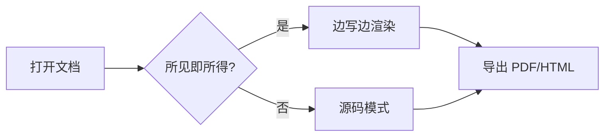

# 欢迎使用 Xiangzi MD

这是一个**所见即所得**的 Markdown 编辑器，边写边渲染。

## 功能

- 打开单个 `.md` 文件
- 打开整个文件夹，在侧边栏浏览
- 多标签页编辑
- 所见即所得 / 源码模式切换

## 试试这些语法

> 这是一段引用。

1. 有序列表
2. 第二项

- [ ] 待办事项
- [x] 已完成

支持脚注[^note]。

[^note]: 这是一条脚注内容。

```js
// JavaScript
const greet = (name) => `Hello, ${name}!`
console.log(greet('Xiangzi MD'))
```

```python
# Python
def fib(n: int) -> int:
    return n if n < 2 else fib(n - 1) + fib(n - 2)
print([fib(i) for i in range(10)])
```

```json
{ "name": "xiangzi-md", "version": "0.1.0", "wysiwyg": true }
```

Mermaid 流程图（点代码块右上角的预览按钮查看）：



| 列 A | 列 B |
| ---- | ---- |
| 1    | 2    |
| 这是一段很长很长的内容，用来测试单元格在内容过长时是否会自动换行而不是被遮挡裁剪掉 | 短 |
| https://example.com/a/very/long/url/that/should/wrap/inside/the/cell/without/overflow | 短 |

行内代码 `const x = 1`，以及 [一个链接](https://example.com)。

## 本地图片

下面这张图用的是相对路径（存在同级 `assets/` 文件夹里）：


